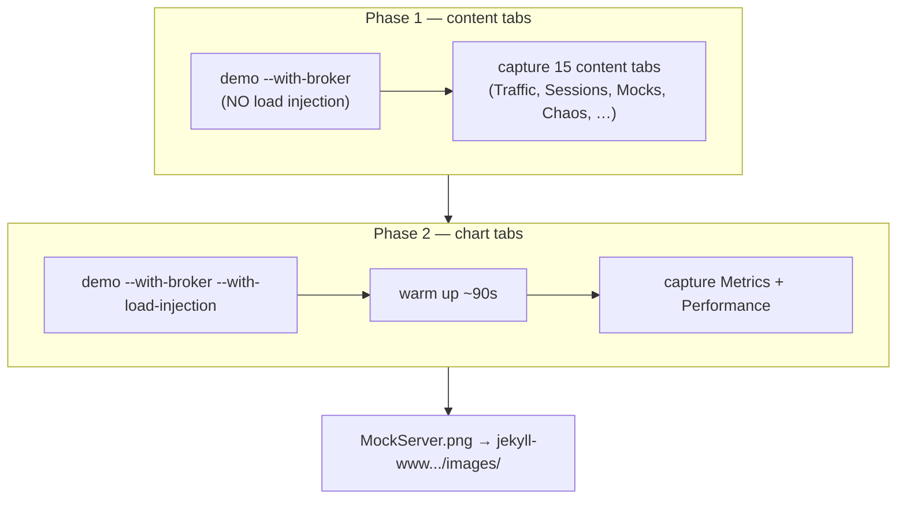

# Regenerate Dashboard Documentation Screenshots

Refresh the website's dashboard screenshots after UI changes. The flow brings up
a fully-populated demo dashboard, then captures one crisp PNG per tab at the same
geometry as the existing images so they drop in with no `` edits.

## TL;DR

```bash
cd mockserver-ui
npm install                       # first time only — fetches playwright
npx playwright install chromium   # first time only — fetches the browser binary
npm run screenshots:all           # demo up → capture every tab → demo down
```

`screenshots:all` writes 17 PNGs straight into
`jekyll-www.mock-server.com/images/` (the live website paths). Review the diff,
then commit the changed images.

## How it works

`screenshots:all` runs the demo in **two phases**, because load injection and the
screenshots want opposite things (see "Why two phases" below):



Each phase: background `npm run demo`, wait for the "Ready — populated demo
environment" line, run the Playwright capture, tear the demo down (trap EXIT).

Two scripts, both in `mockserver-ui/scripts/`:

| Script | Role |
|--------|------|
| `capture-docs-screenshots.sh` | Orchestrator — runs both demo phases, captures, tears down. `npm run screenshots:all`. |
| `capture-dashboard-screenshots.mjs` | The Playwright capture — assumes the dashboard is **already running**, waits for the WebSocket to show "Connected", navigates each tab, drives it into a rich state, shoots. `npm run screenshots`. |

### Curated tab states

The capture doesn't just navigate — for several tabs it drives a richer
documentation state (each is a best-effort `prepare` step in the `.mjs`; a
failure is logged and the shot still happens):

| Tab | What the shot shows |
|-----|---------------------|
| Traffic | an LLM exchange selected with the **Conversation** tab open (multi-turn messages + tool calls) |
| Mocks (Composer) | the **Advanced** expectation editor, not Quick mode |
| Chaos | the **HTTP Service Chaos** section expanded (form fields) with the other sections collapsed |
| Metrics / Performance | charts warmed up so the time-series are drawn, not "collecting…" |

### Why two phases

The dashboard keeps only the most recent **~100** traffic items. A load scenario
firing thousands of requests/sec evicts the seeded LLM conversations (and can
saturate the WebSocket so panels never reach "Connected"). So content tabs are
shot against a **quiet** demo. The **Metrics/Performance** charts, conversely,
need live sustained throughput to draw non-empty series — so they get their own
load-injection phase with a warm-up. Set `SKIP_CHARTS=true` to run only phase 1.

## Matching the existing screenshots

The clarity of the current images comes from **Retina capture**: a 1920-wide
viewport at `deviceScaleFactor: 2`, producing ~3840px-wide PNGs. The capture
script defaults to exactly this (`WIDTH=1920 HEIGHT=900 SCALE=2`). Keep these to
stay consistent with the on-site images. Filenames reuse the existing
`MockServer<Name>.png` convention, so regenerated tabs overwrite in place.

## Prerequisites

- **Docker running** if you pass `--with-broker` (the Async tab's recorded
  messages need a Mosquitto broker). Without it, drop `--with-broker`.
- **Node via nvm** — the repo's node is nvm-managed (v22.x). Homebrew node (v26)
  breaks the UI build. If `node` is shadowed by an `_load_nvm` shell function,
  use the absolute path `~/.nvm/versions/node/v22*/bin/node`.
- **Playwright browser** installed once: `npx playwright install chromium`.

## Common variations

```bash
cd mockserver-ui

# Content tabs only — skip the slower phase-2 load-injection chart pass:
SKIP_CHARTS=true npm run screenshots:all

# Capture into a scratch dir first to eyeball before overwriting the live images:
OUT_DIR=.tmp/shots npm run screenshots:all

# Longer chart warm-up (default 90s) for fuller Metrics/Performance series:
CHART_WARMUP_S=180 npm run screenshots:all

# Iterate on one screen against an already-running demo (two terminals):
npm run demo -- --with-broker                          # terminal 1 (quiet demo)
ONLY=traffic,composer,chaos npm run screenshots        # terminal 2
```

The orchestrator passes `--with-broker` itself; you don't add demo flags to
`screenshots:all`. To drive a demo you started yourself, use `npm run
screenshots` (the bare capture) with `ONLY=` / `OUT_DIR=` as needed.

### Orchestrator knobs (env vars on `capture-docs-screenshots.sh`)

| Var | Default | Purpose |
|-----|---------|---------|
| `SKIP_CHARTS` | `false` | `true` → run only phase 1 (content tabs) |
| `CHART_WARMUP_S` | `90` | phase-2 warm-up before shooting the charts |
| `DEMO_TIMEOUT` | `300` | seconds to wait for each demo to report ready |

### Capture knobs (env vars on `capture-dashboard-screenshots.mjs`)

| Var | Default | Purpose |
|-----|---------|---------|
| `ONLY` | all | comma-separated tab values (`dashboard,chaos,metrics,…`) |
| `OUT_DIR` | `jekyll-www.mock-server.com/images` | where PNGs are written |
| `WIDTH` / `HEIGHT` | `1920` / `900` | CSS viewport |
| `SCALE` | `2` | deviceScaleFactor (Retina) |
| `FULL_PAGE` | `false` | `true` captures full scroll height instead of one viewport |
| `THEME` | `light` | `light` or `dark` colour scheme |
| `SETTLE_MS` | `1200` | default settle before each shot (per-tab overrides apply) |
| `CHART_SETTLE_MS` / `SLOW_SETTLE_MS` | `8000` / `6000` | settle for chart tabs / slow-loading tabs (gRPC, Optimise, Sessions) |
| `UI_PORT` / `MS_PORT` | `3000` / `1080` | dev-server and MockServer ports |

## Tab inventory

The capture covers all 17 dashboard tabs in `NAV_TABS` order
(`mockserver-ui/src/components/AppBar.tsx`). Navigation clicks the inline
`[data-nav-tab]` toggle, falling back to the overflow / hamburger menu by
`aria-label` when a tab is collapsed. Lazy-loaded tabs (Mocks/Composer,
Performance, LLM Optimise, Metrics) wait for their "Loading…" placeholder to
clear before the shot.

| Tab value | File |
|-----------|------|
| get-started | MockServerGetStarted.png |
| dashboard | MockServerDashboard.png |
| traffic | MockServerTrafficInspector.png |
| breakpoints | MockServerBreakpoints.png |
| composer | MockServerComposer.png |
| chaos | MockServerChaos.png |
| performance | MockServerPerformance.png |
| optimise | MockServerOptimise.png |
| async | MockServerAsyncAPI.png |
| grpc | MockServerGRPC.png |
| sessions | MockServerSessions.png |
| library | MockServerLibrary.png |
| drift | MockServerDrift.png |
| verification | MockServerVerification.png |
| contract | MockServerContract.png |
| cluster | MockServerCluster.png |
| metrics | MockServerMetrics.png |

> Tabs added since the existing website images (Performance, LLM Optimise, gRPC,
> Contract, Cluster) produce **new** files. To surface them on the site, add an
> `` reference in `jekyll-www.mock-server.com/mock_server/mockserver_ui.html`
> following the existing `` pattern.

## After capturing

1. `git status jekyll-www.mock-server.com/images/` — confirm only intended PNGs changed.
2. Open a few PNGs to sanity-check they're fully rendered (no spinners, data present).
3. Commit the images (and any new `mockserver_ui.html` references) via the normal
   pre-commit workflow.

## Troubleshooting

- **Traffic / Sessions empty ("No captured requests yet")** — either the page
  wasn't "Connected" when shot, or load injection evicted the seeded traffic past
  the ~100-item UI cap. `screenshots:all` already shoots these in the quiet
  phase-1 demo; if running the bare capture, point it at a `npm run demo
  --with-broker` (no `--with-load-injection`).
- **A tab is blank / shows a spinner** — raise `SETTLE_MS` (or the per-tab
  `SLOW_SETTLE_MS`), or the panel needs more demo data (extend
  `mockserver-ui/scripts/populate-demo-data.mjs`).
- **Metrics/Performance charts say "collecting…"** — the demo hasn't generated
  enough samples; raise `CHART_WARMUP_S` (orchestrator) or `CHART_SETTLE_MS`.
- **A `prepare` step is skipped** (logged `! <tab> prepare step skipped`) — a UI
  selector drifted (e.g. the Advanced toggle, the Conversation tab, the HTTP
  chaos header). The shot still happens, just without the curated state; update
  the `prepare` selector in `capture-dashboard-screenshots.mjs`.
- **Demo never reports ready** — check the temp log path printed by the
  orchestrator; MockServer or Vite likely failed to start (port in use, JAR build
  error). Raise `DEMO_TIMEOUT` for slow first-time JAR builds.
- **`_load_nvm: command not found`** — node is shadowed by the nvm shell
  function; invoke the absolute nvm node path (see Prerequisites).
- **Async tab empty** — Docker isn't running, so `--with-broker` was a no-op.
