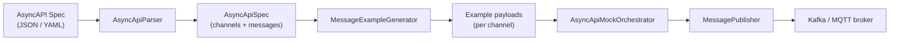

# Async Messaging Module (`mockserver-async`)

## Overview

The `mockserver-async` module provides **AsyncAPI-driven message-broker mocking** for Kafka and MQTT. Given an AsyncAPI 2.x or 3.x specification document, it parses the channels and message definitions, generates example payloads, and publishes them to a message broker through thin publisher adapters.

## Architecture

### Key Classes

| Class | Package | Responsibility |
|-------|---------|----------------|
| `AsyncApiParser` | `o.m.async.asyncapi` | Parses AsyncAPI 2.x/3.x JSON or YAML into an `AsyncApiSpec` model |
| `AsyncApiSpec` | `o.m.async.asyncapi` | Immutable model: version, title, list of `AsyncApiChannel` |
| `AsyncApiChannel` | `o.m.async.asyncapi` | A channel name, payload examples, and optional JSON Schema |
| `MessageExampleGenerator` | `o.m.async` | Produces example JSON payloads from explicit examples or schema synthesis |
| `MessagePublisher` | `o.m.async.publish` | Interface: `publish(channel, payload)` + `close()` |
| `KafkaMessagePublisher` | `o.m.async.publish` | Wraps `KafkaProducer`; channel = Kafka topic |
| `MqttMessagePublisher` | `o.m.async.publish` | Wraps Paho `MqttClient`; channel = MQTT topic |
| `AsyncApiMockOrchestrator` | `o.m.async` | Publishes examples once (`publishAll()`) or on a schedule (`startPublishing(interval)` / `stop()`) |

## AsyncAPI Parsing

The parser auto-detects JSON vs YAML (by leading `{` character) and supports:

- **AsyncAPI 2.x**: `channels.<name>.publish|subscribe.message.payload` for schema; `.payload.example` for inline examples; `.message.examples[].payload` for the examples array
- **AsyncAPI 3.x**: `channels.<name>.messages.<msgName>.payload` for schema; `.examples[].payload` for examples; basic `$ref` resolution to `#/components/messages/<name>`

Missing or incomplete structures are tolerated gracefully (channels appear with empty examples).

## Example Generation

The `MessageExampleGenerator` follows this precedence per channel:

1. First explicit example from the spec
2. Minimal example synthesized from JSON Schema (type-based defaults: `"string"` for strings, `0` for integers, `0.0` for numbers, `false` for booleans, empty array/object)
3. Fallback: `{}`

## Dependencies

| Dependency | Version | Purpose |
|------------|---------|---------|
| `jackson-databind` | (parent-managed) | JSON parsing and generation |
| `jackson-dataformat-yaml` | (parent-managed) | YAML parsing |
| `kafka-clients` | 3.9.0 | Kafka producer |
| `org.eclipse.paho.client.mqttv3` | 1.2.5 | MQTT client |
| `mockserver-core` | (optional) | Shared utilities (optional dependency) |

## MVP Scope and Boundaries

This is an **MVP library module**. What is included:

- AsyncAPI spec parsing (2.x and 3.x, JSON and YAML)
- Example message generation (explicit examples + schema synthesis)
- Kafka and MQTT publisher adapters
- Orchestrator with one-shot and scheduled publishing
- Unit tests with mocked brokers (no live broker required)

What is **not yet included** (documented follow-ups):

- **HTTP control-plane integration**: no REST endpoints to load specs or trigger publishing via the MockServer API
- **Docker wiring**: not bundled into the MockServer Docker image
- **Live-broker integration tests**: all tests use mocked producers/clients
- **Consumer/subscriber mocking**: only publish-side is implemented
- **Advanced AsyncAPI features**: no support for bindings, security schemes, correlation IDs, or multi-message channels beyond the first message
- **Dashboard UI**: no UI representation for async messaging state
