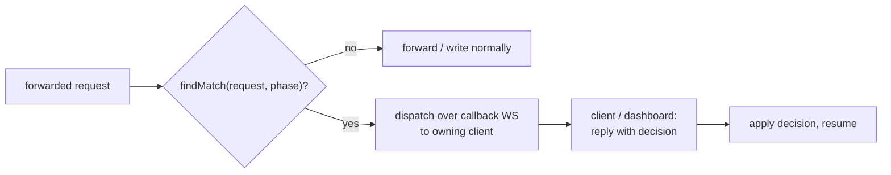

# Interactive Breakpoints

**TL;DR:** A breakpoint is a request matcher + set of phases + owning `clientId`.
Register one via `PUT /mockserver/breakpoint/matcher` (with a required `clientId`).
When a request matches, the exchange is paused at each specified phase — this
covers forwarded/proxied exchanges, matched mock responses, and unmatched-404
responses (REQUEST and RESPONSE phases); streaming-frame phases remain
forward/mock-stream only. Resolution is interactive: the paused item is dispatched to the owning client
over the callback WebSocket (`/_mockserver_callback_websocket`). The client (any
language client or the dashboard, all speaking the same protocol) inspects/modifies
it and sends a decision; the server applies the decision and resumes. The four global
flags are removed -- matchers are the only activation mechanism. The callback WebSocket
is the only resolution transport.



Interactive breakpoints let you pause proxied/forwarded exchanges at four phases:

1. **Request breakpoints** (A1a) — hold the outbound request before it reaches the upstream server
2. **Response breakpoints** (A1b) — hold the upstream response before it is written to the client
3. **Stream frame breakpoints** (A1c + A1d) — hold each individual frame of a streaming response before it is written to the client. Covers both forwarded upstream streams (SSE / HTTP/1.1 chunked) and mock-generated streams (mock SSE/chunked, gRPC server-streaming, WebSocket eager/scripted messages, WebSocket bidirectional responses, and GraphQL subscription pushes)
4. **Inbound frame breakpoints** (A1e) — hold each client-to-server frame on bidirectional/streaming connections (WebSocket, GraphQL-subscription, gRPC-bidi) before MockServer processes them. Enables inspection, modification, dropping, injection, and connection close for inbound frames

Request and response breakpoints support inspect, modify, continue, and abort -- interactively over the callback WebSocket.
Stream frame breakpoints and inbound frame breakpoints support continue, modify, drop, inject, and close per frame -- over the callback WebSocket.

## Non-blocking architecture

The breakpoint mechanism is fully asynchronous. The `BreakpointCallbackDispatcher` or
`StreamFrameCallbackDispatcher` serialises the paused item into a WS message and sends
it to the owning client. The continuation is chained onto a `CompletableFuture` that is
completed when the client replies or the timeout fires. No thread is blocked.

## Phases

### Request phase

- Hold points:
  - `HttpActionHandler.handleUnmatchedProxyForward`, after pre-flight validation
    but before the upstream HTTP call (unmatched / anonymous proxy forwards).
  - `HttpActionHandler.dispatchForwardWithBreakpoint`, before the upstream call for
    **matched** forward expectations (`FORWARD`, `FORWARD_TEMPLATE`,
    `FORWARD_CLASS_CALLBACK`, `FORWARD_REPLACE`, `FORWARD_VALIDATE`,
    `FORWARD_WITH_FALLBACK`). `FORWARD_OBJECT_CALLBACK` is not covered (it uses its
    own write path).
  - `HttpActionHandler.dispatchMockResponseWithBreakpoint`, before generating a
    **matched mock response** (`RESPONSE`, `RESPONSE_TEMPLATE`,
    `RESPONSE_CLASS_CALLBACK`). MODIFY feeds the modified request into template /
    class-callback generation.
  - The unmatched-**404** dispatch (no expectation matched and not proxying), before
    `returnNotFound` writes the not-found response.
- Decision actions: CONTINUE (proceed with the original request), MODIFY (proceed
  with the replacement request — forwarded upstream for forwards, or fed into
  response generation for mock/404), ABORT (write error response to the client
  without forwarding or generating the response).

### Response phase

- Hold points:
  - `HttpActionHandler.writeForwardActionResponse` (expectation-matched forwards)
    and `executeUnmatchedForward` (unmatched proxy forwards), after the upstream
    response is received but before it is written to the client.
  - `HttpActionHandler.writeResponseActionResponse`, after chaos is applied but
    before writing a **matched mock response**. Scoped by action type to
    `RESPONSE` / `RESPONSE_TEMPLATE` / `RESPONSE_CLASS_CALLBACK` so the
    protocol-specific paths that share this writer (LLM, gRPC, WebSocket, SSE) are
    not intercepted. Chaos is not re-applied after manual resolution.
  - `HttpActionHandler.returnNotFound`, before writing an unmatched-**404**
    response.
- Non-streaming (buffered) responses only — streaming responses are written
  immediately (breakpoint is skipped).
- Decision actions: CONTINUE (write original response), MODIFY (write replacement
  response), ABORT (write error response).
- The upstream `HttpResponse` is a deserialized model object (no pooled ByteBuf),
  so parking does not risk use-after-free.

### Stream frame phase

- **Hold points:**
  - `NettyResponseWriter.writeStreamingResponse` — SSE/chunked forwarded and mock
    responses (A1c). The `StreamingBody.subscribe()` onChunk callback intercepts
    each chunk before writing as a `DefaultHttpContent`.
  - `GrpcStreamResponseActionHandler.scheduleMessages` — gRPC server-streaming mock
    responses (A1d). Each gRPC message frame is intercepted before `ctx.writeAndFlush`.
  - `HttpWebSocketResponseActionHandler.scheduleMessages` — WebSocket eager/scripted
    messages (A1d). Each frame is intercepted before writing.
  - `HttpWebSocketResponseActionHandler.installBidirectionalHandler` — WebSocket
    bidirectional response frames (A1d). The FrameSender intercepts each response frame.
  - `HttpWebSocketResponseActionHandler.installGraphQLSubscriptionHandler` — GraphQL
    subscription push frames (A1d). The FrameSender intercepts each `next` message.
  - `Http3GrpcResponseWriter.scheduleStreamMessages` — gRPC server-streaming mock
    responses over HTTP/3 (QUIC). Each gRPC message DATA frame is intercepted before
    `ctx.writeAndFlush`. Uses stream-id suffix `-h3-grpc-stream` (distinct from
    HTTP/2's `-grpc-stream`). Decision callbacks run on the QUIC stream's event loop.
- Scope: all streaming response types (SSE/chunked forwarded AND mock-generated,
  gRPC server-streaming over HTTP/2 and HTTP/3, WebSocket, and GraphQL subscriptions).
- Decision actions: CONTINUE (write original frame), MODIFY (write replacement
  body), DROP (discard frame), INJECT (write original + extra frame), CLOSE
  (send stream-end signal and close the stream).
- **Backpressure:** for SSE/chunked streams, when a frame is parked,
  `streamingBody.requestMore()` is NOT called — this stops the upstream from
  sending more chunks. For gRPC server-streaming and WebSocket eager/scripted
  mock-generated streams (via `scheduleMessages`), the next message in the
  sequence is not scheduled until the current frame's decision is resolved
  (inherent backpressure via the recursive schedule chain). **Note:**
  GraphQL-subscription (`pushNextSequence`) and WebSocket-bidirectional
  response paths are fire-and-forget — they park ALL frames simultaneously
  as they arrive (driven by inbound client messages or the subscription
  sequence), which means they can hit `breakpointMaxHeld` under high
  throughput. There is no inherent backpressure in these paths because the
  frame sender is invoked per inbound event rather than chained sequentially.
- **Stream-close eviction:** when a stream completes, errors, or is explicitly
  closed, all held frames for that stream are auto-continued/dropped (preventing
  leaks and hanging futures).
- **Frame ordering:** frames within a stream are assigned monotonic sequence
  numbers. The registry enforces that frames are resolved in order — attempting
  to resolve a frame whose predecessor is still held is rejected.
- **ByteBuf discipline:** frame bytes are copied into a `byte[]` at park time.
  For SSE/chunked, the original ByteBuf (owned by StreamingBody) is released
  normally by the caller. For gRPC, frames are already `byte[]` from
  `GrpcStreamMessageEncoder.encode()`. For WebSocket, text is encoded to `byte[]`
  via UTF-8. On resume, the decision handler allocates a new
  `Unpooled.wrappedBuffer` for writing. No ByteBuf is retained across the
  breakpoint hold period.
- **gRPC framing constraint:** for gRPC streams, MODIFY and INJECT replacement
  bytes must be a valid gRPC length-prefixed frame (1-byte compressed flag +
  4-byte big-endian message length + message bytes), otherwise the client will
  see a protocol error. The breakpoint engine passes bytes through opaquely --
  it does not validate or re-frame the content.
- **Event-loop safety:** all hold-point callbacks run on the Netty event loop.
  They NEVER block — they park the frame and return immediately. The decision
  callback is marshalled onto the channel's event loop via
  `ctx.channel().eventLoop().execute(...)`.
- **Stream ID format:** forwarded streams use `{correlationId}-stream`, gRPC
  streams use `{correlationId}-grpc-stream`, WebSocket/GraphQL streams use
  `{correlationId}-ws-stream`.

### Inbound frame phase

- **Hold points:**
  - `BidirectionalWebSocketFrameHandler.channelRead0` — WebSocket bidirectional
    inbound frames (A1e). When enabled, each inbound WebSocket frame is copied to
    `byte[]`, the original `WebSocketFrame` is released, and the copy is parked
    in `StreamFrameBreakpointRegistry` with `direction=INBOUND`.
  - `GraphQLSubscriptionHandler.channelRead0` — GraphQL subscription inbound
    frames (A1e). The text content is copied to `byte[]` (UTF-8), the frame is
    released, and the copy is parked.
- **gRPC-bidi inbound:** `GrpcBidiStreamHandler.handleData` — gRPC bidirectional
  streaming inbound DATA frames. When enabled, the handler copies the DATA frame
  bytes to `byte[]` and releases the `Http2DataFrame` IMMEDIATELY (refunding the
  HTTP/2 flow-control window), then parks the byte copy in the registry. The
  existing pull-based model (`autoRead=false` + explicit `ctx.read()`) provides
  backpressure: withholding `ctx.read()` prevents the next DATA frame from being
  delivered. This decouples flow-control window refund (immediate) from
  backpressure (deferred), so other streams on the same connection are NOT stalled.
  `GrpcBidiRouterHandler` generates a per-stream inbound stream ID and passes it
  along with the `Configuration` to the handler constructor.
- Decision actions: CONTINUE (process the original frame), MODIFY (process a
  replacement frame), DROP (discard — do not process), INJECT (process original
  + extra frame), CLOSE (evict stream, send CANCELLED trailer, close stream).
- **Backpressure:** WebSocket and GraphQL handlers use `autoRead=false` while
  a frame is parked. The gRPC-bidi handler uses its existing pull-based model
  (withholding `ctx.read()`) — no `autoRead` toggling needed since it is already
  `false` from `handlerAdded`. On resume (any decision), `ctx.read()` is called
  to request the next frame (or `finish()` is called if `endStream`).
- **ByteBuf discipline:** the original `WebSocketFrame`'s ByteBuf is copied to
  `byte[]` at park time and the frame is released immediately. Both WebSocket
  handlers use `super(false)` (no auto-release), so the handler manages release
  explicitly. For gRPC-bidi, the `Http2DataFrame` is released in a `finally`
  block immediately after byte copy — this refunds the HTTP/2 flow-control
  window before any breakpoint parking delay. On resume, WebSocket frames are
  reconstructed via `Unpooled.wrappedBuffer(byte[])` for matcher evaluation;
  gRPC frames are passed as `byte[]` to the decoder. No ByteBuf is retained
  across the breakpoint hold period.
- **Stream ID format:** WebSocket inbound streams use `{correlationId}-ws-inbound`;
  gRPC-bidi inbound streams use `grpc-bidi-inbound-{path}-{uuid}`.
- **Direction field:** `PausedStreamFrame.direction` is `INBOUND` for client-to-server
  frames and `OUTBOUND` (default) for server-to-client frames. The `direction` field
  is included in the `PausedStreamFrameDTO` dispatched over the callback WebSocket.
- **Channel close eviction:** `channelInactive` in all handlers (WebSocket,
  GraphQL, and gRPC-bidi) evicts all held inbound frames for the stream,
  preventing leaks and hanging futures.

## Safety rails

- **Timeout auto-continue:** each paused exchange or frame auto-continues if not
  resolved within `breakpointTimeoutMillis` (default 30 seconds).
- **Max-held cap:** when `breakpointMaxHeld` (default 50) exchanges/frames are
  held (request/response breakpoints and stream frames use separate registries
  but both check the same cap), new intercepts are skipped.
- **Default off:** breakpoints are inactive until a matcher is registered via
  `PUT /mockserver/breakpoint/matcher` — zero overhead until then.

## Breakpoint matcher registry

A breakpoint is active when at least one matcher is registered. Register a matcher by sending the request definition (identical in shape to an expectation request matcher) and the set of phases to intercept:

```
PUT /mockserver/breakpoint/matcher
{
  "httpRequest": { "method": "GET", "path": "/api/.*" },
  "phases": ["REQUEST", "RESPONSE"]
}
```

Any forwarded/proxied request that matches `httpRequest` will be paused at the specified phases. Registrations persist until explicitly removed or until `/mockserver/reset` is called (which clears all matchers).

### Matcher-registry endpoints

| Method | Path | Body | Description |
|--------|------|------|-------------|
| PUT | `/mockserver/breakpoint/matcher` | `{httpRequest, phases, clientId}` | Register a matcher; returns `{id, phases, clientId}` |
| GET/PUT | `/mockserver/breakpoint/matchers` | — | List all registered matchers: `{matchers:[{id,httpRequest,phases,clientId}]}` |
| PUT | `/mockserver/breakpoint/matcher/remove` | `{id}` | Remove a matcher by id; returns `{status:"removed",id}` or 404 |
| PUT | `/mockserver/breakpoint/matcher/clear` | — | Remove all matchers; returns `{status:"cleared",count}` |

**Validation:** `httpRequest` and `phases` are required; `phases` must be non-empty and contain only `REQUEST`, `RESPONSE`, `RESPONSE_STREAM`, or `INBOUND_STREAM` — unknown values return 400. The registry is cleared on `/mockserver/reset`.

**Matching semantics:** the `httpRequest` body uses the same matcher fields as an expectation request matcher (`method`, `path`, `headers`, `queryStringParameters`, `body`, etc.). An exchange pauses at a phase if any registered matcher matches the request for that phase.

## WebSocket callback resolution (`clientId` required)

Breakpoint matchers require a `clientId` field that identifies the callback
WebSocket client (`/_mockserver_callback_websocket`) to dispatch matched
exchanges to for interactive resolution -- reusing the same
`WebSocketClientRegistry` dispatch primitives that the object-callback
(`forwardObject` / `responseObject`) feature uses. Registration without a
`clientId` returns 400.

### Registration

```
PUT /mockserver/breakpoint/matcher
{
  "httpRequest": { "method": "GET", "path": "/api/.*" },
  "phases": ["REQUEST", "RESPONSE"],
  "clientId": "my-ws-client-id"
}
```

The list endpoint (`GET /mockserver/breakpoint/matchers`) includes `clientId`
in each entry.

### Resolution protocol

- **REQUEST phase:** the paused request is sent to the client over the callback
  WS (with a `WebSocketCorrelationId` header). The client replies with either:
  - An `HttpRequest` — forward that request (MODIFY if different, CONTINUE if
    identical to the original).
  - An `HttpResponse` — ABORT (write that response to the downstream client,
    do not forward upstream).

- **RESPONSE phase:** the paused request+response are sent to the client. The
  client replies with an `HttpResponse` — the server writes it to the
  downstream client (MODIFY/CONTINUE).

### Safety rails

- **Timeout auto-continue:** if the client does not reply within
  `breakpointTimeoutMillis`, the exchange auto-continues with the original
  request/response.
- **Max-held cap:** WS-callback dispatches share the `breakpointMaxHeld` cap
  across the WS-callback dispatchers (`BreakpointCallbackDispatcher` and
  `StreamFrameCallbackDispatcher`). When the cap is reached, new breakpoints are
  skipped.
- **Disconnect cleanup:** when a callback client disconnects, all its registered
  breakpoint matchers are removed and any in-flight dispatches are auto-completed
  to CONTINUE (no hung exchanges).

### Dispatcher

`BreakpointCallbackDispatcher` is the process-wide singleton that manages
WS-callback breakpoint dispatch for buffered REQUEST/RESPONSE phases. It tracks
in-flight dispatches per correlation id, schedules timeouts, and provides
`autoCompleteForClient(clientId)` for disconnect cleanup. It is called from the
hold-point gate sites in `HttpActionHandler` when the matched breakpoint has a
non-null `clientId`.

### Per-frame WS protocol (RESPONSE_STREAM / INBOUND_STREAM)

When a stream-frame breakpoint matcher has a non-null `clientId` and the
owning client's callback WebSocket is connected, each held frame is dispatched
over the WS for interactive resolution -- using the same
`/_mockserver_callback_websocket` endpoint as the buffered request/response
dispatch. This is the **frozen contract** that all language clients and the
dashboard UI implement.

`StreamFrameCallbackDispatcher` is the process-wide singleton that manages
per-frame WS dispatch. It mirrors `BreakpointCallbackDispatcher` with the same
safety rails (timeout auto-continue, max-held cap, disconnect cleanup) and
the same non-blocking, event-loop-safe dispatch pattern. The dispatcher is
stateless with respect to server identity: the per-server
`WebSocketClientRegistry` is passed as a parameter at each dispatch site
(obtained from `HttpState` at core sites, or from a channel
`AttributeKey<WebSocketClientRegistry>` at netty sites), so multiple
`HttpState`/server instances in the same JVM dispatch to their own clients.

The `clientId` is always present (required since Unit 7b).

#### Server-to-client: `PausedStreamFrameDTO`

Sent over the callback WS to the owning client when a frame is held. The
client inspects the frame and replies with a `StreamFrameDecisionDTO`.

| Field | Type | Description |
|-------|------|-------------|
| `correlationId` | String | Unique ID; client MUST echo in reply |
| `streamId` | String | Stream this frame belongs to |
| `sequenceNumber` | int | 0-based monotonic index within the stream |
| `direction` | String | `"INBOUND"` or `"OUTBOUND"` |
| `phase` | String | `"RESPONSE_STREAM"` or `"INBOUND_STREAM"` |
| `body` | String | Frame payload, Base64-encoded (RFC 4648 section 4) |
| `requestMethod` | String (nullable) | HTTP method of the original request |
| `requestPath` | String (nullable) | Path of the original request |
| `breakpointId` | String (nullable) | The id of the breakpoint matcher that matched this frame, enabling per-breakpoint handler routing on the client |

**Encoding:** the `body` is standard Base64 with no line breaks. Frames are
arbitrary bytes (gRPC length-prefixed, WebSocket text/binary, SSE/chunked).

**Breakpoint identification:** for REQUEST/RESPONSE phases (buffered), the
matched breakpoint id is conveyed via the `X-MockServer-BreakpointId` header
on the dispatched `HttpRequest`. For RESPONSE_STREAM/INBOUND_STREAM phases,
the matched breakpoint id is the `breakpointId` field in the
`PausedStreamFrameDTO`. Clients use this id to route each pushed item to the
handler of the specific breakpoint that matched, supporting multiple concurrent
breakpoints without handler overwriting.

#### Client-to-server: `StreamFrameDecisionDTO`

The client's reply carrying the resolution decision.

| Field | Type | Description |
|-------|------|-------------|
| `correlationId` | String | MUST match the `PausedStreamFrameDTO` |
| `action` | String | `"CONTINUE"`, `"MODIFY"`, `"DROP"`, `"INJECT"`, or `"CLOSE"` |
| `body` | String (nullable) | Base64-encoded replacement/injected bytes; required for `MODIFY` and `INJECT` |

**Action semantics:**

| Action | Effect |
|--------|--------|
| `CONTINUE` | Write the original frame unchanged |
| `MODIFY` | Write the `body` bytes instead of the original |
| `DROP` | Discard the frame (do not write / do not process inbound) |
| `INJECT` | Write the original frame AND an additional frame with `body` bytes |
| `CLOSE` | End the stream (drop frame, send stream-end signal, evict remaining) |

#### Safety rails

- **Timeout auto-continue:** if the client does not reply within
  `breakpointTimeoutMillis`, the frame auto-continues with the original bytes.
- **Max-held cap:** WS stream-frame dispatches share the `breakpointMaxHeld`
  cap with all other breakpoint registries and dispatchers. When the cap is
  reached, new frames are written immediately (no breakpoint).
- **Disconnect cleanup:** when a callback client disconnects, all its in-flight
  stream-frame dispatches are auto-completed to CONTINUE via
  `StreamFrameCallbackDispatcher.autoCompleteForClient(clientId)`.
- **Frame ordering:** ordering is preserved by the existing backpressure
  mechanisms (streaming body `requestMore()`, `autoRead=false`, withhold
  `ctx.read()`). The next frame is not delivered until the current one resolves.
- **Event-loop safety:** the WS dispatch future's `thenAccept` callback is
  marshalled onto the channel's event loop via `ctx.channel().eventLoop().execute()`.
  No blocking occurs on the Netty event loop.

## Control-plane endpoints

All breakpoint resolution is done over the callback WebSocket. The REST
control-plane endpoints below are for matcher management only.

See the "Breakpoint matcher registry" section above for the matcher endpoints
(`/breakpoint/matcher`, `/breakpoint/matchers`, `/breakpoint/matcher/remove`,
`/breakpoint/matcher/clear`).

## Configuration properties

Breakpoint activation is driven by the matcher registry (see "Breakpoint matcher registry" below), not by global flags. The two remaining properties are safety rails only:

| Property | Default | Description |
|----------|---------|-------------|
| `mockserver.breakpointTimeoutMillis` | `30000` | Auto-continue timeout in milliseconds (shared across all phases) |
| `mockserver.breakpointMaxHeld` | `50` | Max concurrent paused exchanges/frames (shared across all registries) |

## Client support

Seven language clients implement the breakpoint callback WebSocket protocol:

| Client | Notes |
|--------|-------|
| Java | `MockServerClient.addBreakpoint(...)` with `BreakpointRequestHandler`, `BreakpointResponseHandler`, `BreakpointStreamFrameHandler` |
| Node | `mockserver-client` npm package — `addBreakpoint`/`addRequestBreakpoint`/`addRequestAndResponseBreakpoint` |
| Python | `mockserver-client` PyPI package — `add_breakpoint`/`add_request_breakpoint`/`add_request_and_response_breakpoint` |
| Ruby | `mockserver` gem — `add_breakpoint`/`add_request_breakpoint`/`add_request_and_response_breakpoint` |
| Go | `mockserver-client-go` — `AddRequestBreakpoint`/`AddRequestResponseBreakpoint`/`AddStreamBreakpoint` |
| .NET | `MockServer.Client` NuGet — `AddRequestBreakpoint`/`AddRequestResponseBreakpoint`/`AddStreamBreakpoint` |
| Rust | `mockserver-client` crate — `add_request_breakpoint`/`add_request_response_breakpoint`/`add_stream_breakpoint` |

**PHP is intentionally not supported.** Breakpoints require a persistent callback WebSocket connection for resolution. PHP runtimes lack WebSocket client support, so there is no way for PHP to participate in interactive resolution.

The dashboard is also a full callback WebSocket client: it connects to `/_mockserver_callback_websocket`, receives a server-assigned `clientId`, and resolves paused items in the Breakpoints panel (Live Exchanges and Live Streams tabs).

## Key classes

### Breakpoint matcher registry
- `BreakpointMatcher` — a registered breakpoint: request matcher, phases, required `clientId`
- `BreakpointMatcherRegistry` — process-wide singleton registry of breakpoint matchers with `findMatch`, `removeByClientId`
- `BreakpointPhase` — enum: REQUEST, RESPONSE, RESPONSE_STREAM, INBOUND_STREAM

### Request/response breakpoints
- `BreakpointCallbackDispatcher` — process-wide singleton for WS-callback breakpoint dispatch; dispatches to owning client via `WebSocketClientRegistry`, manages in-flight tracking, timeouts, and disconnect cleanup
- `BreakpointDecision` — CONTINUE / MODIFY (request or response) / ABORT resolution
- `WebSocketClientRegistry.unregisterClient` — on disconnect, calls `BreakpointMatcherRegistry.removeByClientId`, `BreakpointCallbackDispatcher.autoCompleteForClient`, and `StreamFrameCallbackDispatcher.autoCompleteForClient` to clean up the client's breakpoints and in-flight dispatches
- `HttpActionHandler.handleUnmatchedProxyForward` — request-phase breakpoint intercept
- `HttpActionHandler.writeForwardActionResponse` — response-phase breakpoint intercept (matched)
- `HttpActionHandler.executeUnmatchedForward` — response-phase breakpoint intercept (unmatched)
- `HttpActionHandler.attemptResponseBreakpoint` — helper for RESPONSE phase WS dispatch

### Stream frame breakpoints (WS-callback path)
- `StreamFrameCallbackDispatcher` — process-wide singleton for per-frame WS-callback dispatch; dispatches `PausedStreamFrameDTO` to owning client, receives `StreamFrameDecisionDTO` replies, manages in-flight tracking, timeouts, and disconnect cleanup
- `PausedStreamFrameDTO` — server-to-client WS message: correlationId, streamId, sequenceNumber, direction, phase, body (Base64), requestMethod, requestPath
- `StreamFrameDecisionDTO` — client-to-server WS reply: correlationId, action (CONTINUE/MODIFY/DROP/INJECT/CLOSE), optional body (Base64)
- `WebSocketClientRegistry.sendStreamFrameMessage` — sends a `PausedStreamFrameDTO` to a client
- `WebSocketClientRegistry.registerStreamFrameCallbackHandler` — registers a callback for `StreamFrameDecisionDTO` replies by correlationId

### Stream frame breakpoints
- `StreamFrameCallbackDispatcher` — process-wide singleton for per-frame WS-callback dispatch
- `StreamFrameDecision` — CONTINUE / MODIFY / DROP / INJECT / CLOSE resolution
- `StreamFrameBreakpointRegistry` — process-wide singleton managing per-stream sequence counters and stream eviction
- `NettyResponseWriter.writeStreamingResponse` — hold point for SSE/chunked streams (forwarded + mock)
- `GrpcStreamResponseActionHandler.scheduleMessages` — hold point for gRPC server-streaming mock responses
- `HttpWebSocketResponseActionHandler.scheduleMessages` — hold point for WebSocket eager/scripted messages
- `HttpWebSocketResponseActionHandler.installBidirectionalHandler` — hold point for WebSocket bidi responses
- `HttpWebSocketResponseActionHandler.installGraphQLSubscriptionHandler` — hold point for GraphQL subscription pushes

### Inbound frame breakpoints
- `BidirectionalWebSocketFrameHandler.channelRead0` — hold point for WebSocket bidi inbound frames
- `GraphQLSubscriptionHandler.channelRead0` — hold point for GraphQL subscription inbound frames
- `GrpcBidiStreamHandler.handleData` — hold point for gRPC bidi inbound DATA frames
- `GrpcBidiRouterHandler` — routes gRPC bidi streams to `GrpcBidiStreamHandler`
- Uses the same `StreamFrameBreakpointRegistry` with `direction=INBOUND`

## Behavioural notes

- **Response chaos-latency is not re-applied after manual resolution.** When a
  response breakpoint is resolved (CONTINUE, MODIFY, or ABORT), any configured
  response chaos-latency for the matched expectation is bypassed. The manual
  resolution supersedes automatic chaos injection because the user has already
  inspected and approved (or replaced) the response.
- **REQUEST phase reply semantics.** A WS client replying with an `HttpRequest`
  means MODIFY/CONTINUE (forward the replacement or original). Replying with an
  `HttpResponse` means ABORT (write that response directly, do not forward).
- **RESPONSE phase reply semantics.** A WS client replying with an `HttpResponse`
  means write that response to the downstream client (MODIFY/CONTINUE).

## Dashboard UI

The dashboard is a **real callback client**: it opens a WebSocket to
`/_mockserver_callback_websocket` (the same endpoint language clients use) and
reads its server-assigned `clientId` from the first `WebSocketClientIdDTO`
message. Browser WebSockets cannot set custom request headers, so the server
generates the `clientId` server-side when the `CLIENT_REGISTRATION_ID_HEADER`
is absent on the upgrade request (already handled in
`CallbackWebSocketServerHandler.upgradeChannel`).

The Breakpoints panel has three tabs:

### Matchers tab

- A **matcher-builder form** to register a breakpoint matcher with method, path
  (regex), and phase checkboxes (Request, Response, Response stream frames,
  Inbound stream frames). On submit, calls
  `PUT /mockserver/breakpoint/matcher {httpRequest, phases, clientId}` with the
  dashboard's assigned `clientId`.
- Lists all registered matchers (`GET /mockserver/breakpoint/matchers`) with
  remove and clear-all actions.

### Live Exchanges tab

- When a registered matcher triggers on a forwarded request or response, the
  server pushes the paused item over the callback WS (same `{type, value}`
  envelope as language clients). The dashboard shows it in real time.
- Resolution is interactive: **Continue** (send the original back), **Modify**
  (edit the JSON in a dialog, send modified), or **Abort** (REQUEST phase only;
  sends an `HttpResponse` with status 503 to skip forwarding).
- The WS reply IS the resolution -- no REST endpoint is called.

### Live Streams tab

- Paused stream frames (`PausedStreamFrameDTO`) are pushed over the same
  callback WS and shown in real time with direction, stream ID, sequence
  number, and Base64-decoded body preview.
- Resolution actions: **Continue**, **Modify** (edit body, Base64-encode),
  **Drop**, **Inject** (extra frame after the held one), **Close** (end the
  stream). Each sends a `StreamFrameDecisionDTO` back over the WS.

### Header-less callback registration

The `CallbackWebSocketServerHandler.upgradeChannel` method handles both
registration modes:

```java
final String clientId = httpRequest.headers().contains(CLIENT_REGISTRATION_ID_HEADER)
    ? httpRequest.headers().get(CLIENT_REGISTRATION_ID_HEADER)
    : UUIDService.getUUID();
```

Language clients supply the header; the dashboard (browser WebSocket) does not,
so the server generates a UUID. In both cases, `registerClient(clientId, ctx)`
sends a `WebSocketClientIdDTO{clientId}` to the client and registers the
channel. The dashboard reads its assigned `clientId` from that first message.

### Connection lifecycle

- The callback WS connection is opened when the Breakpoints panel mounts and
  closed on unmount. It auto-reconnects on close with exponential backoff.
- A connection-state indicator (green/yellow/red dot) shows the WS status.
- On disconnect, the server automatically removes the dashboard's breakpoint
  matchers and auto-continues any in-flight dispatches (same cleanup as any
  other callback client).

## Java client

### Matcher-driven WS-callback breakpoints

The Java client can register breakpoint matchers with callback handlers that are
invoked over the callback WebSocket (`/_mockserver_callback_websocket`). The
client opens a single WS connection (reused across all breakpoints), obtains a
`clientId`, and passes it to the server during matcher registration so paused
items are dispatched to the owning client.

#### Handler interfaces

Three handler interfaces cover all four breakpoint phases:

| Interface | Phase(s) | Input | Output |
|-----------|----------|-------|--------|
| `BreakpointRequestHandler` | REQUEST | `HttpRequest` | `HttpRequest` (continue/modify) or `HttpResponse` (abort) |
| `BreakpointResponseHandler` | RESPONSE | `HttpRequest` + `HttpResponse` | `HttpResponse` (continue/modify) |
| `BreakpointStreamFrameHandler` | RESPONSE_STREAM, INBOUND_STREAM | `PausedStreamFrameDTO` | `StreamFrameDecisionDTO` |

All three are `@FunctionalInterface` and can be expressed as lambdas.

#### Registration API

```java
// Register with explicit phases and all handlers
String id = mockServerClient.addBreakpoint(
    request().withPath("/api/.*"),
    EnumSet.of(BreakpointPhase.REQUEST, BreakpointPhase.RESPONSE),
    request -> request,                          // REQUEST handler
    (request, response) -> response,             // RESPONSE handler
    null                                         // no stream-frame handler
);

// Convenience: REQUEST phase only
String id = mockServerClient.addBreakpoint(
    request().withPath("/api/.*"),
    request -> modifiedRequest                   // BreakpointRequestHandler
);

// Convenience: REQUEST + RESPONSE
String id = mockServerClient.addBreakpoint(
    request().withPath("/api/.*"),
    request -> request,                          // BreakpointRequestHandler
    (request, response) -> response              // BreakpointResponseHandler
);

// Convenience: streaming phases
String id = mockServerClient.addBreakpoint(
    request().withPath("/stream/.*"),
    EnumSet.of(BreakpointPhase.RESPONSE_STREAM),
    frame -> new StreamFrameDecisionDTO()        // BreakpointStreamFrameHandler
        .setCorrelationId(frame.getCorrelationId())
        .setAction("CONTINUE")
);
```

The returned `id` is the server-assigned breakpoint matcher id (UUID).

#### Matcher management

```java
String json = mockServerClient.listBreakpointMatchers();      // GET /breakpoint/matchers
mockServerClient.removeBreakpointMatcher(id);                  // PUT /breakpoint/matcher/remove
mockServerClient.clearBreakpointMatchers();                    // PUT /breakpoint/matcher/clear
```

#### WS connection lifecycle

- The breakpoint WS connection is opened lazily on the first `addBreakpoint` call.
- The same connection and `clientId` are reused for all subsequent breakpoint
  registrations from this `MockServerClient` instance.
- On `stop()` / `reset`, the WS connection is closed and the server automatically
  cleans up all matchers owned by that `clientId` and auto-continues any in-flight
  dispatches.
- If the WS connection drops, the server's disconnect cleanup removes the
  client's matchers and auto-continues held items.

#### Stream frame resolution

For RESPONSE_STREAM and INBOUND_STREAM phases, the `BreakpointStreamFrameHandler`
receives a `PausedStreamFrameDTO` (the frozen server-to-client contract from
Unit 3) and returns a `StreamFrameDecisionDTO`. The `correlationId` is
automatically echoed. The handler can return any of the five actions: CONTINUE,
MODIFY, DROP, INJECT, CLOSE. If the handler throws, the client auto-continues
the frame.

