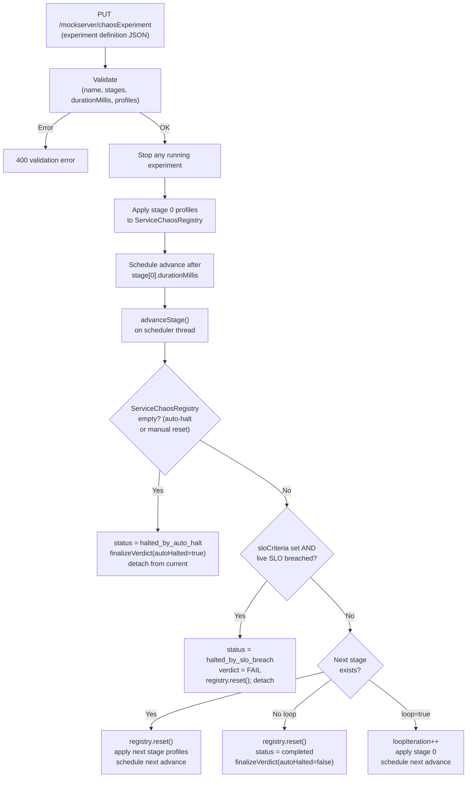
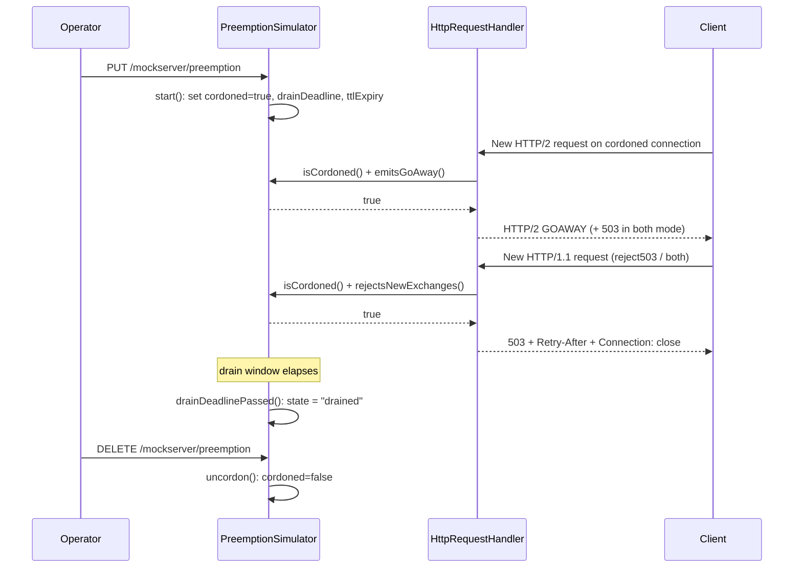

# Chaos Experiments

## TL;DR

`ChaosExperimentOrchestrator` runs scheduled multi-stage chaos experiments via
`PUT/GET/DELETE /mockserver/chaosExperiment`. An experiment is an ordered list of
stages; each stage applies per-host `HttpChaosProfile` entries to
`ServiceChaosRegistry` for a configured duration, then advances automatically.
Safety limits prevent abuse (max 50 stages, max 24 h per stage, one active
experiment at a time). The C1 auto-halt circuit-breaker (`ChaosAutoHaltMonitor`)
stops a running experiment if it detects a fault cascade.

An experiment may carry an optional `sloCriteria` (an `SloCriteria`, the same
model the `verifySLO` endpoint uses). When present, the orchestrator (a) asserts
the SLO over the experiment's own time window when the experiment terminates,
attaching a terminal `experimentVerdict` (`PASS` / `FAIL` / `INCONCLUSIVE`,
STRICT semantics), and (b) auto-halts the experiment with status
`halted_by_slo_breach` (verdict `FAIL`) if an objective is breached mid-run.
When `sloCriteria` is absent the experiment behaves exactly as before — no
verdict, no SLO probe, byte-for-byte-identical status JSON.

## How an Experiment Runs



When `sloCriteria` is present a self-rearming 1 s SLO probe also runs between
stage boundaries (see [SLO Assertion & Verdict](#slo-assertion--verdict)), so a
breach is detected without waiting for the next stage advance.

## Control-Plane Endpoints

| Endpoint | Action |
|----------|--------|
| `PUT /mockserver/chaosExperiment` | Start (or replace) an experiment. Body: experiment definition JSON. Returns 200 + current status, or 400 on validation error. |
| `GET /mockserver/chaosExperiment` | Return current experiment status (JSON). Returns 200 with status or 404 when no experiment has run since last reset. |
| `DELETE /mockserver/chaosExperiment` | Stop the running experiment, clear chaos, return 204. Idempotent. |

All three endpoints go through `controlPlaneRequestAuthenticated()` (mTLS / JWT if
configured). Implemented in `HttpState.handleChaosExperimentPut/Get/Delete()`.

## Saved Profile Library (ADV3)

Chaos experiments can be saved as reusable **named profiles** and re-applied by
name, rather than re-sending the full experiment JSON each time. A "profile" is
just a saved experiment definition (the same JSON shape the `PUT
/mockserver/chaosExperiment` endpoint accepts) stored under a name.

| Endpoint | Action |
|----------|--------|
| `PUT /mockserver/chaosExperiment/profiles/{name}` | Save (or replace) a profile under `{name}`. The body is an experiment definition; its `name` field is normalised to `{name}`. Validates as an experiment at save time. Returns 200. |
| `POST /mockserver/chaosExperiment/apply/{name}` | Apply (start) the saved profile by name — equivalent to `PUT /mockserver/chaosExperiment` with the saved body. Returns 200, or 404 if no such profile. |
| `GET /mockserver/chaosExperiment/profiles` | List saved profile names (`{"profiles":[...]}`, ascending). |
| `GET /mockserver/chaosExperiment/profiles/{name}` | Return one profile's stored definition, or 404. |
| `DELETE /mockserver/chaosExperiment/profiles/{name}` | Remove a profile (`status: deleted` / `absent`). |

All routes go through `controlPlaneRequestAuthenticated()` and are implemented in
`HttpState` (`handleChaosProfileSave/Apply/List/Get/Delete`); the `{name}` path
segment is parsed by `HttpState.chaosProfileName(...)`. The `POST apply` route is
dispatched in a dedicated `POST` branch of `HttpState.handle()` (there was no
prior POST control-plane route).

**Storage — `ChaosProfileLibrary`** (`org.mockserver.mock.action.http.ChaosProfileLibrary`):
profiles are stored in the `StateBackend`'s `crudEntities("chaos-profiles")`
key-value store, keyed by profile name, with the raw experiment-definition
`ObjectNode` as the value. Unlike the chaos *registries* (which attach a backend
only when clustered), the library **always** uses the backend store. This gives
two properties:

- **Survives `HttpState.reset()`** — reset clears active chaos (registries, the
  running experiment) but intentionally does **not** clear the profile template
  library, so saved profiles outlive a reset on the default single-node backend.
- **Cluster-correct** — when the backend is clustered, profile saves/deletes
  replicate across the fleet via the same CRUD-entity replication as the chaos
  registries.

Profile names are validated (`isValidName`): 1–128 chars of `[A-Za-z0-9._ -]` (letters, digits, dot, underscore, hyphen, and interior space), with no leading or trailing space.

The dashboard Chaos panel (`mockserver-ui` `ServiceChaosPanel`) exposes the
library as a *Saved Profiles* chip list with a "Save as Profile" button (saves
the current experiment editor) and one-click apply / delete; the client helpers
live in `mockserver-ui/src/lib/chaosExperiment.ts`.

## Experiment Definition (Request Body)

```json
{
  "name": "my-experiment",
  "loop": false,
  "stages": [
    {
      "durationMillis": 30000,
      "profiles": {
        "payments.svc": { "errorStatusCode": 503, "errorProbability": 0.5 }
      }
    },
    {
      "durationMillis": 60000,
      "profiles": {
        "payments.svc": { "latencyMillis": 2000, "latencyProbability": 1.0 },
        "auth.svc": { "dropProbability": 0.1 }
      }
    }
  ]
}
```

| Field | Required | Description |
|-------|----------|-------------|
| `name` | Yes | Non-blank display name |
| `stages` | Yes | Ordered list of stages; 1 – 50 entries |
| `loop` | No | If `true`, restarts from stage 0 after the last stage completes (default `false`) |
| `startDelayMillis` | No | Fixed delay before stage 0 is applied; `0` (default) = start immediately. Max 604 800 000 ms (7 days) |
| `cronSchedule` | No | Standard 5-field cron expression (`minute hour day-of-month month day-of-week`) for the start time; omitted/blank = no cron |
| `sloCriteria` | No | An `SloCriteria` block (same shape as the `verifySLO` body) asserted over the experiment window. Omitted = no verdict, no SLO probe (see [SLO Assertion & Verdict](#slo-assertion--verdict)) |
| `stage.durationMillis` | Yes | Duration > 0 and ≤ 86 400 000 ms (24 h) |
| `stage.profiles` | Yes | Map of host → `HttpChaosProfile` with at least one entry |

### Scheduled (Deferred / Cron) Start

By default an experiment applies stage 0 the instant it is `PUT`. Setting
`startDelayMillis` and/or `cronSchedule` defers stage 0 to a future time; until
then the experiment sits in a new `scheduled` status and applies **no** chaos.

- **`startDelayMillis`** — a fixed delay (e.g. `300000` = start in 5 minutes).
- **`cronSchedule`** — a standard 5-field cron expression evaluated against the
  JVM default time zone at minute granularity. Day-of-week is `0–6` with `0` =
  Sunday (`7` also = Sunday). When both day-of-month and day-of-week are
  restricted, a time matches if **either** matches (conventional cron rule). The
  evaluator (`org.mockserver.mock.action.http.CronSchedule`) is self-contained —
  no third-party cron dependency. Steps, ranges, and comma lists are supported
  (e.g. `0-59/5`, `9-17`, `0,30`).
- **Both set** — the **later** of the fixed delay and the next cron boundary
  wins, so an explicit delay can never start before its cron time.

While `scheduled`, `GET /mockserver/chaosExperiment` reports
`status: "scheduled"` and `startRemainingMillis` (ms until stage 0 applies). The
deferred start fires on the same `chaos-experiment-scheduler` thread used for
stage advancement; `DELETE` (or a replacing `PUT`) cancels a pending start
before any chaos is applied. No scheduling fields = immediate start
(back-compatible default), and the JSON status/definition omit the new fields
entirely when unset.

```json
PUT /mockserver/chaosExperiment
{
  "name": "nightly-error-storm",
  "cronSchedule": "0 2 * * *",
  "stages": [
    { "durationMillis": 600000, "profiles": { "payments.svc": { "errorStatusCode": 503, "errorProbability": 0.3 } } }
  ]
}
```

## Status Response

`GET /mockserver/chaosExperiment` returns:

```json
{
  "name": "my-experiment",
  "status": "running",
  "currentStageIndex": 1,
  "totalStages": 2,
  "stageElapsedMillis": 12000,
  "stageRemainingMillis": 48000,
  "loopIteration": 0,
  "totalElapsedMillis": 42000,
  "experiment": { ... },
  "experimentVerdict": { "result": "FAIL", "windowFromEpochMillis": 1700000000000, "objectiveResults": [ ... ] }
}
```

`experimentVerdict` is present only for an experiment with `sloCriteria` and only
once a verdict has been produced (terminal transition, or an SLO-breach halt). It
is omitted entirely otherwise.

| `status` value | Meaning |
|---------------|---------|
| `starting` | Experiment object created; stage 0 not yet applied |
| `scheduled` | A deferred start (`startDelayMillis`/`cronSchedule`) is pending; no chaos applied yet. The status carries `startRemainingMillis` (ms until stage 0). |
| `running` | A stage is active |
| `completed` | All stages ran and `loop=false` |
| `stopped` | Stopped via `DELETE /mockserver/chaosExperiment` or replaced by a new `PUT` |
| `halted_by_auto_halt` | Stopped by the C1 raw-volume circuit-breaker (see below) |
| `halted_by_slo_breach` | Stopped because the experiment's `sloCriteria` was breached mid-run (see [SLO Assertion & Verdict](#slo-assertion--verdict)) |

After an experiment terminates (any terminal status), `lastTerminatedStatus` and
`lastTerminatedVerdict` are retained so that a subsequent `GET` can report the
outcome (and verdict) even after `current` is nulled. Both are cleared only by
`HttpState.reset()`.

## SLO Assertion & Verdict

An experiment definition may carry an optional `sloCriteria` field — an
`SloCriteria` (the same model `PUT /mockserver/verifySLO` accepts: a window, a
list of objectives, an optional `minimumSampleCount` and `upstreamHosts`). The
SLO it submits is **scoped to the experiment**: the orchestrator ignores the
window carried in the criteria and substitutes an EXPLICIT window
`[experiment.startedAtMillis, terminationOrNowEpochMillis]`, so the verdict is
strictly about what happened while the experiment ran. Evaluation reuses
`SloEvaluator` / `SloSampleStore` unchanged (forward-path samples are recorded on
the normal proxy path when `sloTrackingEnabled`). When `sloCriteria` is absent,
none of this runs and the status JSON is byte-for-byte identical to before.

### Terminal verdict (STRICT semantics)

When an experiment **with** `sloCriteria` terminates (completes, is stopped, is
auto-halted, or is SLO-halted) `finalizeVerdict(...)` evaluates the SLO over the
experiment window and attaches `experimentVerdict`:

| Verdict | When |
|---------|------|
| `PASS` | Every objective held within threshold across the **entire** experiment window |
| `FAIL` | Any objective breached at any point in the window, **or** the experiment was auto-halted / SLO-halted (forced FAIL regardless of samples) |
| `INCONCLUSIVE` | Fewer in-window samples than the criteria's `minimumSampleCount` |

The auto-halt → FAIL coupling is deliberate: an experiment whose steady-state
guardrail tripped did not hold its SLO, so its verdict is FAIL even if the
samples in the window would otherwise read PASS. `minimumSampleCount` is
propagated to the scoped criteria **unconditionally**, so an explicit `null`
(guard disabled) is preserved rather than re-defaulted to the model default of 1.

### Live SLO-breach halt (A2)

In addition to the C1 raw-volume circuit-breaker, an experiment with
`sloCriteria` is auto-halted the moment an objective is **actually** breached
over its live window. `checkSloBreachAndHalt(...)`:

1. evaluates the SLO over `[start, now]`;
2. on a `FAIL` verdict, atomically claims the experiment via
   `current.compareAndSet(experiment, null)` **before** mutating any shared state
   (so a stale probe that loses the CAS performs no global mutation — it can
   never clear a registry that now belongs to a different experiment);
3. sets status `halted_by_slo_breach`, attaches the FAIL verdict, and calls
   `ServiceChaosRegistry.reset()`.

This check runs from two places: at every stage boundary inside `advanceStage`,
and from a **self-rearming SLO probe**. The probe is a one-shot scheduled
`SLO_PROBE_INTERVAL_MILLIS` (1 s) ahead that re-arms itself only while the
experiment is still `current` and `running`; it is scheduled **only when
`sloCriteria` is present** and cancelled (`cancelProbe`) on every terminal path
(`stopInternal`, auto-halt, completion, SLO-halt), so it can never outlive its
experiment. Tests drive it deterministically via the package-private
`checkSloNow()` hook rather than relying on the 1 s wall-clock timer.

The raw-volume C1 halt and the SLO-breach halt are independent: a latency-only
experiment never trips C1 (no destructive faults) but can still SLO-halt on a
latency-percentile breach; an error-storm experiment can trip C1 first. Either
terminal path yields `experimentVerdict = FAIL` for an experiment with
`sloCriteria`.

## Safety Limits

| Limit | Value | Constant |
|-------|-------|----------|
| Maximum stages per experiment | 50 | `MAX_STAGES` |
| Maximum stage duration | 86 400 000 ms (24 h) | `MAX_STAGE_DURATION_MILLIS` |
| Maximum deferred-start delay | 604 800 000 ms (7 days) | `MAX_START_DELAY_MILLIS` |
| Concurrent experiments | 1 | Enforced by `AtomicReference<RunningExperiment>` |

Starting a new experiment while one is running implicitly stops the existing one
(`stopInternal(false)` → status `stopped`) before applying the new definition.

## Scheduler

The orchestrator uses a single-thread `ScheduledExecutorService` (daemon thread
`chaos-experiment-scheduler`) for non-blocking stage advancement. Stage timers
fire off the Netty event loop. Time is measured via a pluggable `LongSupplier`
clock (default: `TimeService::currentTimeMillis`) so tests drive advancement
deterministically via `advanceNow()` without wall-clock sleeps.

## C1 Auto-Halt Integration

`ChaosAutoHaltMonitor` is a safety circuit-breaker for service-scoped chaos. When
enabled, it maintains a sliding window of **destructive fault** timestamps. If the
count in the window exceeds the threshold, it calls both `ServiceChaosRegistry.reset()`
and `TcpChaosRegistry.reset()`.

An experiment detects this at the next stage boundary: if
`ServiceChaosRegistry.entries().isEmpty()` and the status is `running`, the
orchestrator transitions to `halted_by_auto_halt` and detaches.

```mermaid
sequenceDiagram
    participant C as Client request
    participant M as Metrics
    participant AHM as ChaosAutoHaltMonitor
    participant SCR as ServiceChaosRegistry
    participant TCR as TcpChaosRegistry
    participant EO as ChaosExperimentOrchestrator

    C->>M: Metrics.incrementHttpChaosInjected("error")
    M->>AHM: recordError("error")
    AHM->>AHM: Add timestamp to sliding window
    AHM->>AHM: Evict expired; check count >= threshold
    AHM->>SCR: reset() [if threshold exceeded]
    AHM->>TCR: reset() [also resets TCP/lifecycle chaos]
    Note over EO: At next stage advance...
    EO->>SCR: entries().isEmpty() ?
    SCR-->>EO: true
    EO->>EO: status = "halted_by_auto_halt"
```

Only **destructive** fault types count toward the window: `"error"` (synthetic
5xx), `"drop"` (connection kill), `"quota"` (429/503). Benign types (`"latency"`,
`"slow"`, `"truncate"`, `"malformed"`, `"graphql"`) do not contribute — a
latency-only experiment never auto-halts.

Connection-lifecycle faults integrate as follows:
- A mid-response RST (L1 `resetMidResponse`) records a `"drop"` fault,
  contributing to the window (gated by `connectionLifecycleAutoHaltCountsRst`,
  default `true`).
- An HTTP/2 GOAWAY and a preemption 503 cordon are graceful drain signals and
  are NOT counted.
- When the breaker fires, `TcpChaosRegistry.reset()` is called alongside
  `ServiceChaosRegistry.reset()`, so a lifecycle RST storm stops immediately.

Auto-halt configuration (all `ConfigurationProperties`):

| Property | Default | Description |
|----------|---------|-------------|
| `chaosAutoHaltEnabled` | `false` | Master switch — `false` means the monitor is a no-op |
| `chaosAutoHaltErrorThreshold` | `50` | Destructive fault count in the window that triggers halt |
| `chaosAutoHaltWindowMillis` | `60000` | Sliding window duration in ms |

See [Metrics & Monitoring](metrics.md) for the `mock_server_chaos_auto_halt` counter.

## Connection-Lifecycle Faults

MockServer can simulate the fault patterns that appear when a server crashes mid-response, closes connections slowly, or signals graceful shutdown to HTTP/2 clients. These faults fire at response/dispatch time — the client sees them while or after the response head is written — as opposed to the connect-time faults in `TcpChaosHandler`.

### Response-Path Faults (L1 / L2 / L3)

The three faults are carried as new fields on `TcpChaosProfile` and are registered via the same `PUT /mockserver/tcpChaos` endpoint used for connect-time TCP faults. Lookup is keyed on the request `Host` header via `TcpChaosRegistry`.

| Layer | Field | Behaviour |
|-------|-------|-----------|
| L1 | `resetMidResponse` | After the response head is flushed, forces a TCP RST (SO_LINGER 0 + `channel.close()`, the same RST mechanism as `TcpChaosHandler`) instead of a clean FIN. The client sees "connection reset" mid-stream — the "server crashed while replying" fault. |
| L1 | `resetAfterResponseChunks` | Number of response body chunks to write before the mid-response RST. `null` or `0` means reset immediately after the response head. v1 treats values > 0 on non-chunked bodies as "after head" (deferred). Has no effect unless `resetMidResponse` is also `true`. |
| L2 | `slowCloseDelay` | A `Delay` (with optional jitter) applied before the socket FIN on the response path, even when `ConnectionOptions.closeSocketDelay` is null. Lets a host linger on close without a per-expectation connection option. |
| L3 | `http2GoAway` | On HTTP/2 connections, emits a GOAWAY frame on the response path before the response head so the client stops opening new streams. `http2GoAwayErrorCode` (default 0 = NO_ERROR) and `http2GoAwayLastStreamId` (default: current connection last-stream) are also configurable. HTTP/1.1 connections have no GOAWAY concept; callers degrade to `Connection: close` + 503 instead. |

Example registration:

```json
PUT /mockserver/tcpChaos
{
  "host": "payments.svc",
  "chaos": {
    "resetMidResponse": true
  }
}
```

**Hot-path guarantee.** `NettyResponseWriter.resolveLifecycleProfile()` returns `null` (and adds zero overhead) when `connectionLifecycleChaosEnabled` is `false` OR when `TcpChaosRegistry.activeCount() == 0`. The `activeCount()` check is a single volatile read. The normal response path is byte-for-byte unchanged when no lifecycle chaos is registered.

**Streaming carve-out (v1).** The L1/L2/L3 response-path faults (`resetMidResponse`, `slowCloseDelay`, `http2GoAway`) are applied in `NettyResponseWriter.writeAndCloseSocket()` — the non-streaming response path. The streaming response path (`writeStreamingResponse`, used for SSE / chunked-streaming responses) does **not** apply these faults in v1; a streaming response completes normally even when a host has a lifecycle profile registered. This is a deliberate v1 limitation, not a bug.

**Host-scoping is not control-plane-exempt.** Like the connect-time `TcpChaosHandler`, the response-path lifecycle faults are keyed on the request `Host` header. They are **not** exempt from the control plane: a profile registered against the host MockServer itself is served on (e.g. `localhost`) will apply to control-plane responses (`/mockserver/...`) on that host too — so a `resetMidResponse` profile on the chaos host can RST a control-plane response. Register lifecycle profiles against the *mocked upstream* host, not the MockServer host, to avoid disrupting the control plane. (The L6 preemption cordon, by contrast, *is* control-plane-exempt.)

### Preemption Simulation (`/mockserver/preemption`)

The preemption endpoint simulates a Kubernetes node drain, Spot reclamation, or pre-SIGTERM sequence: the server **cordons** itself (turning away new data-plane exchanges), allows in-flight requests to drain for a bounded window, and signals HTTP/2 clients to drain via GOAWAY. It is a simulation only — it never stops the JVM or event loops.

While cordoned, a new exchange is turned away **lazily on its next request** (there is no per-channel registry and no broadcast at cordon time):
- **HTTP/1.1** — when the mode rejects new exchanges (`reject503` or `both`), the request is answered with `503 + Retry-After + Connection: close` so a load balancer routes elsewhere. HTTP/1.1 has no GOAWAY, so a `goaway`-only cordon cannot signal an HTTP/1.1 client and the request is served normally.
- **HTTP/2** — when the mode includes GOAWAY (`goaway` or `both`), a connection-level GOAWAY is emitted on the cordoned connection so the client stops opening new streams. In `both` mode the request is additionally answered with 503; in `goaway`-only mode the in-flight request still completes normally after the GOAWAY.

In-flight requests are allowed to drain; `GET /mockserver/preemption` reports the **live** in-flight count (wired from `LifeCycle.getRequestsInFlight()`). The cordon clears on an explicit `DELETE` or automatically after `ttlMillis` (a dead-man's switch). There is no force-RST of stragglers in v1 — once the drain window elapses the state simply reports `"drained"` and the cordon persists until TTL/uncordon.



**Mode enum** (`PreemptionRequest.Mode`):

| Mode | HTTP/1.1 | HTTP/2 |
|------|----------|--------|
| `reject503` | 503 + Retry-After + Connection: close | 503 + Retry-After + Connection: close (no GOAWAY) |
| `goaway` | served normally (HTTP/1.1 has no GOAWAY, and 503 is not requested) | connection-level GOAWAY emitted; the in-flight request still completes (no 503) |
| `both` (default) | 503 + Retry-After + Connection: close | GOAWAY **and** 503 |

**Control-plane endpoints:**

| Endpoint | Action |
|----------|--------|
| `PUT /mockserver/preemption` | Start (or replace) a preemption simulation. Body: `PreemptionRequest` JSON. Returns 200 + effective request (with defaults/clamping resolved). |
| `GET /mockserver/preemption` | Return current state: `{state, inFlight, drainRemainingMillis, mode}`. `state` is `"inactive"`, `"draining"`, or `"drained"`. |
| `DELETE /mockserver/preemption` | Uncordon immediately. Idempotent. |

**L6 cordon check in `HttpRequestHandler`.** When `connectionLifecycleChaosEnabled` is true and `PreemptionSimulator.isCordoned()` is true, any non-control-plane request (path does not start with `/mockserver/`) is handled by the cordon branch: if the mode `emitsGoAway()` and the connection is HTTP/2, a GOAWAY is emitted (the `Http2GoAwayEmitter.emit(...)` return value is the HTTP/2 detection — it is a no-op returning `false` on HTTP/1.1); if the mode `rejectsNewExchanges()`, the request is answered with 503 + `Retry-After` + `Connection: close` and the in-flight token is completed immediately. The control plane (`/mockserver/...`) is exempt so the operator can always observe and uncordon. The in-flight token is completed on every branch, so the drain counter can never leak. The `isCordoned()` probe is a single volatile read when no simulation is active.

**Request fields:**

| Field | Default | Description |
|-------|---------|-------------|
| `mode` | `both` | Rejection + GOAWAY strategy (see table above) |
| `drainMillis` | `stopDrainMillis` config value | Drain window; clamped to `preemptionSimulationMaxDrainMillis` |
| `ttlMillis` | `0` (no auto-uncordon) | Dead-man's switch: auto-clears the cordon after this many ms; clamped to `preemptionSimulationMaxDrainMillis` |
| `lastStreamId` | `null` (current connection last-stream) | `lastStreamId` carried on the GOAWAY frame (HTTP/2 modes only) |

**TTL dead-man's switch.** If `ttlMillis` is set, the cordon auto-clears lazily on the next `isCordoned()` call once the TTL has elapsed. This prevents a forgotten simulation from permanently blocking traffic.

**Hard cap.** Both `drainMillis` and `ttlMillis` are clamped to `preemptionSimulationMaxDrainMillis` (default 86400000 ms = 24 h), preventing runaway simulations.

**State is cleared on server reset** (`HttpState.reset()`).

### C1 Auto-Halt: Connection-Lifecycle Integration

The `ChaosAutoHaltMonitor` circuit-breaker now also covers connection-lifecycle faults:

- **`TcpChaosRegistry` is cleared on halt.** When the breaker fires, `ChaosAutoHaltMonitor.recordError()` calls both `ServiceChaosRegistry.getInstance().reset()` and `TcpChaosRegistry.getInstance().reset()`. Without the TCP-registry clear, a mid-response RST storm driven by a host TCP-chaos profile would keep firing even after the breaker tripped.
- **Mid-response RST counts as a "drop" fault.** When `connectionLifecycleAutoHaltCountsRst` is true (default), a `resetMidResponse` records `Metrics.incrementHttpChaosInjected("drop")`, which routes into the auto-halt sliding window alongside connection drops from service-scoped chaos. Set `connectionLifecycleAutoHaltCountsRst=false` to exclude lifecycle RSTs from the breaker count.
- **GOAWAY and the preemption 503 cordon are benign.** An HTTP/2 GOAWAY and a preemption 503 are graceful drain signals and are NOT counted toward the auto-halt window.

### New Configuration Properties

| Property | Default | Description |
|----------|---------|-------------|
| `connectionLifecycleChaosEnabled` | `true` | Master switch for the response-path faults (L1/L2/L3) and the L6 cordon check. When `false`, `resolveLifecycleProfile()` always returns null and the cordon check is skipped entirely. |
| `preemptionSimulationMaxDrainMillis` | `86400000` (24 h) | Hard cap applied to both `drainMillis` and `ttlMillis` on a `PreemptionRequest`. |
| `connectionLifecycleAutoHaltCountsRst` | `true` | When true, a mid-response RST (L1) records a "drop" fault toward the auto-halt circuit-breaker. |

> **Note — the one deliberate exception to "new flags default off".** `connectionLifecycleChaosEnabled`
> defaults to `true` as an available-but-inert kill-switch. The data path additionally gates on an active
> cordon via `PreemptionSimulator.isCordoned()` (and, for the response-path faults, a registered profile via
> `TcpChaosRegistry.activeCount()`), so with nothing active the vanilla behaviour is byte-for-byte unchanged.
> It defaults `true` precisely because it is inert until a cordon (or lifecycle profile) is activated; setting
> it `false` is a hard master kill-switch that skips the cordon check and `resolveLifecycleProfile()` entirely.

### Key Classes

| Class | Module | Path |
|-------|--------|------|
| `TcpChaosProfile` | mockserver-core | `org.mockserver.model.TcpChaosProfile` (new fields: `resetMidResponse`, `resetAfterResponseChunks`, `slowCloseDelay`, `http2GoAway`, `http2GoAwayErrorCode`, `http2GoAwayLastStreamId`) |
| `PreemptionRequest` | mockserver-core | `org.mockserver.model.PreemptionRequest` |
| `PreemptionSimulator` | mockserver-core | `org.mockserver.mock.action.http.PreemptionSimulator` |
| `Http2GoAwayEmitter` | mockserver-netty | `org.mockserver.netty.unification.Http2GoAwayEmitter` |
| `NettyResponseWriter` | mockserver-netty | `org.mockserver.netty.responsewriter.NettyResponseWriter` (L1/L2/L3 faults, `resolveLifecycleProfile()`) |
| `HttpRequestHandler` | mockserver-netty | `org.mockserver.netty.HttpRequestHandler` (L6 cordon check) |

## Relationship to Service-Scoped Chaos

A running experiment takes **exclusive ownership** of `ServiceChaosRegistry`. At
each stage boundary the orchestrator calls `registry.reset()` then re-applies
the stage's profiles. This means:

- Manual `PUT /mockserver/serviceChaos` registrations during an experiment are
  silently overwritten at the next advance.
- A manual `DELETE /mockserver/serviceChaos` (which calls `registry.reset()`)
  is detected by the orchestrator as an auto-halt condition at the next boundary.

Users should stop the experiment (`DELETE /mockserver/chaosExperiment`) before
making manual service-chaos changes.

## Key Classes

| Class | Module | Path |
|-------|--------|------|
| `ChaosExperimentOrchestrator` | mockserver-core | `org.mockserver.mock.action.http.ChaosExperimentOrchestrator` (carries `sloCriteria` / `experimentVerdict`, the SLO probe and `checkSloBreachAndHalt`) |
| `CronSchedule` | mockserver-core | `org.mockserver.mock.action.http.CronSchedule` (minimal 5-field cron evaluator for deferred starts) |
| `ChaosAutoHaltMonitor` | mockserver-core | `org.mockserver.mock.action.http.ChaosAutoHaltMonitor` |
| `ServiceChaosRegistry` | mockserver-core | `org.mockserver.mock.action.http.ServiceChaosRegistry` |
| `HttpChaosProfile` | mockserver-core | `org.mockserver.model.HttpChaosProfile` |
| `SloEvaluator` / `SloCriteria` / `SloVerdict` | mockserver-core | `org.mockserver.slo.*` (reused for the experiment verdict; see [SLO Verdicts](slo-verdicts.md) if present) |
| `HttpState` | mockserver-core | `org.mockserver.mock.HttpState` (endpoints wired here) |
