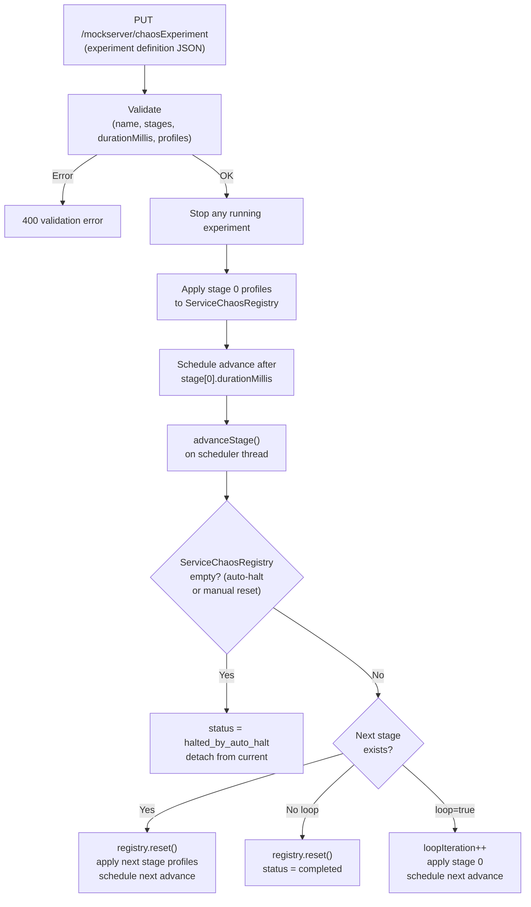

# Chaos Experiments

## TL;DR

`ChaosExperimentOrchestrator` runs scheduled multi-stage chaos experiments via
`PUT/GET/DELETE /mockserver/chaosExperiment`. An experiment is an ordered list of
stages; each stage applies per-host `HttpChaosProfile` entries to
`ServiceChaosRegistry` for a configured duration, then advances automatically.
Safety limits prevent abuse (max 50 stages, max 24 h per stage, one active
experiment at a time). The C1 auto-halt circuit-breaker (`ChaosAutoHaltMonitor`)
stops a running experiment if it detects a fault cascade.

## How an Experiment Runs



## Control-Plane Endpoints

| Endpoint | Action |
|----------|--------|
| `PUT /mockserver/chaosExperiment` | Start (or replace) an experiment. Body: experiment definition JSON. Returns 200 + current status, or 400 on validation error. |
| `GET /mockserver/chaosExperiment` | Return current experiment status (JSON). Returns 200 with status or 404 when no experiment has run since last reset. |
| `DELETE /mockserver/chaosExperiment` | Stop the running experiment, clear chaos, return 204. Idempotent. |

All three endpoints go through `controlPlaneRequestAuthenticated()` (mTLS / JWT if
configured). Implemented in `HttpState.handleChaosExperimentPut/Get/Delete()`.

## Experiment Definition (Request Body)

```json
{
  "name": "my-experiment",
  "loop": false,
  "stages": [
    {
      "durationMillis": 30000,
      "profiles": {
        "payments.svc": { "errorStatusCode": 503, "errorProbability": 0.5 }
      }
    },
    {
      "durationMillis": 60000,
      "profiles": {
        "payments.svc": { "latencyMillis": 2000, "latencyProbability": 1.0 },
        "auth.svc": { "dropProbability": 0.1 }
      }
    }
  ]
}
```

| Field | Required | Description |
|-------|----------|-------------|
| `name` | Yes | Non-blank display name |
| `stages` | Yes | Ordered list of stages; 1 – 50 entries |
| `loop` | No | If `true`, restarts from stage 0 after the last stage completes (default `false`) |
| `stage.durationMillis` | Yes | Duration > 0 and ≤ 86 400 000 ms (24 h) |
| `stage.profiles` | Yes | Map of host → `HttpChaosProfile` with at least one entry |

## Status Response

`GET /mockserver/chaosExperiment` returns:

```json
{
  "name": "my-experiment",
  "status": "running",
  "currentStageIndex": 1,
  "totalStages": 2,
  "stageElapsedMillis": 12000,
  "stageRemainingMillis": 48000,
  "loopIteration": 0,
  "totalElapsedMillis": 42000,
  "experiment": { ... }
}
```

| `status` value | Meaning |
|---------------|---------|
| `starting` | Experiment object created; stage 0 not yet applied |
| `running` | A stage is active |
| `completed` | All stages ran and `loop=false` |
| `stopped` | Stopped via `DELETE /mockserver/chaosExperiment` or replaced by a new `PUT` |
| `halted_by_auto_halt` | Stopped by the C1 circuit-breaker (see below) |

After an experiment terminates (any terminal status), `lastTerminatedStatus` is
retained so that a subsequent `GET` can report the outcome even after `current`
is nulled. The field is cleared only by `HttpState.reset()`.

## Safety Limits

| Limit | Value | Constant |
|-------|-------|----------|
| Maximum stages per experiment | 50 | `MAX_STAGES` |
| Maximum stage duration | 86 400 000 ms (24 h) | `MAX_STAGE_DURATION_MILLIS` |
| Concurrent experiments | 1 | Enforced by `AtomicReference<RunningExperiment>` |

Starting a new experiment while one is running implicitly stops the existing one
(`stopInternal(false)` → status `stopped`) before applying the new definition.

## Scheduler

The orchestrator uses a single-thread `ScheduledExecutorService` (daemon thread
`chaos-experiment-scheduler`) for non-blocking stage advancement. Stage timers
fire off the Netty event loop. Time is measured via a pluggable `LongSupplier`
clock (default: `TimeService::currentTimeMillis`) so tests drive advancement
deterministically via `advanceNow()` without wall-clock sleeps.

## C1 Auto-Halt Integration

`ChaosAutoHaltMonitor` is a safety circuit-breaker for service-scoped chaos. When
enabled, it maintains a sliding window of **destructive fault** timestamps. If the
count in the window exceeds the threshold, it calls `ServiceChaosRegistry.reset()`.

An experiment detects this at the next stage boundary: if
`ServiceChaosRegistry.entries().isEmpty()` and the status is `running`, the
orchestrator transitions to `halted_by_auto_halt` and detaches.

```mermaid
sequenceDiagram
    participant C as Client request
    participant M as Metrics
    participant AHM as ChaosAutoHaltMonitor
    participant SCR as ServiceChaosRegistry
    participant EO as ChaosExperimentOrchestrator

    C->>M: Metrics.incrementHttpChaosInjected("error")
    M->>AHM: recordError("error")
    AHM->>AHM: Add timestamp to sliding window
    AHM->>AHM: Evict expired; check count >= threshold
    AHM->>SCR: reset() [if threshold exceeded]
    Note over EO: At next stage advance...
    EO->>SCR: entries().isEmpty() ?
    SCR-->>EO: true
    EO->>EO: status = "halted_by_auto_halt"
```

Only **destructive** fault types count toward the window: `"error"` (synthetic
5xx), `"drop"` (connection kill), `"quota"` (429/503). Benign types (`"latency"`,
`"slow"`, `"truncate"`, `"malformed"`, `"graphql"`) do not contribute — a
latency-only experiment never auto-halts.

Auto-halt configuration (all `ConfigurationProperties`):

| Property | Default | Description |
|----------|---------|-------------|
| `chaosAutoHaltEnabled` | `false` | Master switch — `false` means the monitor is a no-op |
| `chaosAutoHaltErrorThreshold` | `50` | Destructive fault count in the window that triggers halt |
| `chaosAutoHaltWindowMillis` | `60000` | Sliding window duration in ms |

See [Metrics & Monitoring](metrics.md) for the `mock_server_chaos_auto_halt` counter.

## Relationship to Service-Scoped Chaos

A running experiment takes **exclusive ownership** of `ServiceChaosRegistry`. At
each stage boundary the orchestrator calls `registry.reset()` then re-applies
the stage's profiles. This means:

- Manual `PUT /mockserver/serviceChaos` registrations during an experiment are
  silently overwritten at the next advance.
- A manual `DELETE /mockserver/serviceChaos` (which calls `registry.reset()`)
  is detected by the orchestrator as an auto-halt condition at the next boundary.

Users should stop the experiment (`DELETE /mockserver/chaosExperiment`) before
making manual service-chaos changes.

## Key Classes

| Class | Module | Path |
|-------|--------|------|
| `ChaosExperimentOrchestrator` | mockserver-core | `org.mockserver.mock.action.http.ChaosExperimentOrchestrator` |
| `ChaosAutoHaltMonitor` | mockserver-core | `org.mockserver.mock.action.http.ChaosAutoHaltMonitor` |
| `ServiceChaosRegistry` | mockserver-core | `org.mockserver.mock.action.http.ServiceChaosRegistry` |
| `HttpChaosProfile` | mockserver-core | `org.mockserver.model.HttpChaosProfile` |
| `HttpState` | mockserver-core | `org.mockserver.mock.HttpState` (endpoints wired here) |
