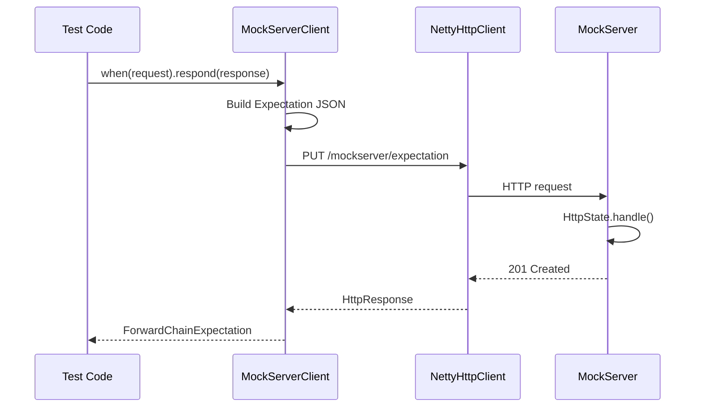
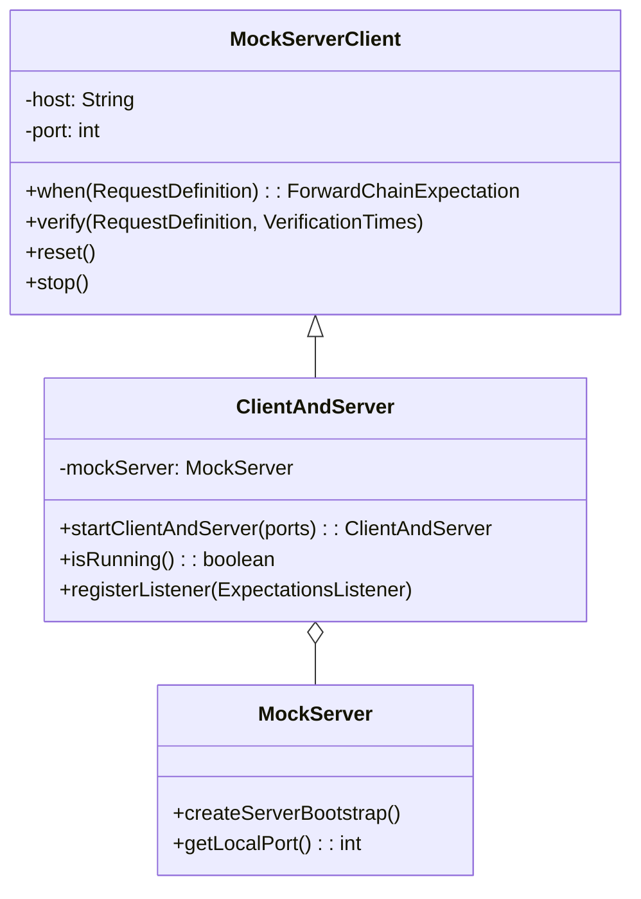
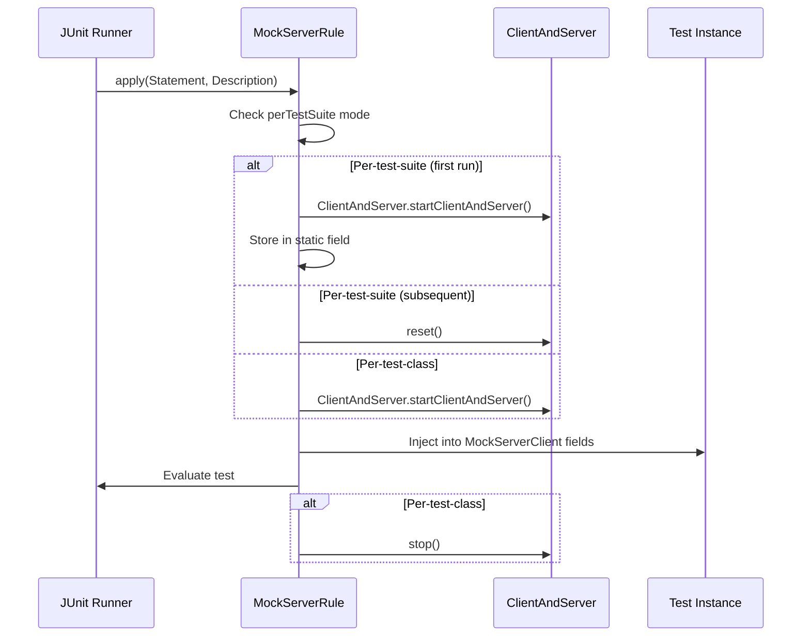
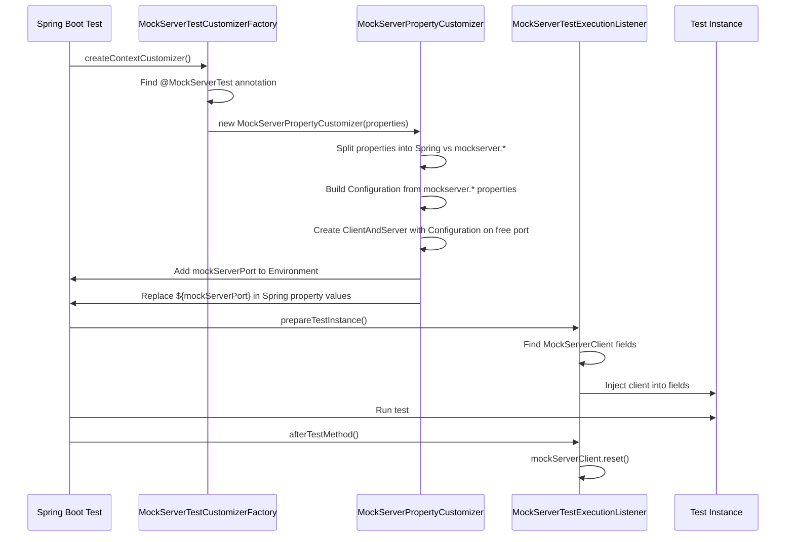

# Client API & Test Integrations

## MockServerClient

`MockServerClient` (`mockserver-client-java`) is the primary Java API for interacting with a running MockServer. All operations are performed via HTTP requests to the MockServer REST API.

### Communication Mechanism



### Fluent API

```java
MockServerClient client = new MockServerClient("localhost", 1080);

// Create expectation
client.when(
    request().withMethod("GET").withPath("/api/users")
).respond(
    response().withStatusCode(200).withBody("{\"users\": []}")
);

// Verify
client.verify(
    request().withPath("/api/users"),
    VerificationTimes.exactly(1)
);

// Retrieve
HttpRequest[] requests = client.retrieveRecordedRequests(
    request().withPath("/api/users")
);
```

### API Methods

#### Expectation Setup

| Method | Description |
|--------|-------------|
| `when(RequestDefinition)` | Create expectation with unlimited matches |
| `when(RequestDefinition, Times)` | Create expectation with limited matches |
| `when(RequestDefinition, Times, TimeToLive)` | Create with match limit and TTL |
| `when(RequestDefinition, Times, TimeToLive, Integer)` | Create with priority |
| `upsert(Expectation...)` | Create or update expectations (by ID) |
| `upsert(OpenAPIExpectation...)` | Create expectations from OpenAPI specs |

#### Verification

| Method | Description |
|--------|-------------|
| `verify(RequestDefinition, VerificationTimes)` | Verify request count |
| `verify(RequestDefinition...)` | Verify requests received in order |
| `verify(ExpectationId, VerificationTimes)` | Verify by expectation ID |
| `verify(ExpectationId...)` | Verify sequence by expectation IDs |
| `verifyZeroInteractions()` | Verify no requests received |

#### Retrieval

| Method | Return Type | Description |
|--------|-------------|-------------|
| `retrieveRecordedRequests(RequestDefinition)` | `HttpRequest[]` | Received requests |
| `retrieveRecordedRequests(RequestDefinition, Format)` | `String` | Received requests as JSON/Java |
| `retrieveRecordedRequestsAndResponses(RequestDefinition)` | `LogEventRequestAndResponse[]` | Request/response pairs |
| `retrieveRecordedExpectations(RequestDefinition)` | `Expectation[]` | Recorded proxy expectations |
| `retrieveActiveExpectations(RequestDefinition)` | `Expectation[]` | Currently active expectations |
| `retrieveActiveExpectations(RequestDefinition, Format)` | `String` | Active expectations as JSON/Java |
| `retrieveLogMessages(RequestDefinition)` | `String` | Log messages as text |
| `retrieveLogMessagesArray(RequestDefinition)` | `String[]` | Log messages as array |

#### Clear & Reset

| Method | Description |
|--------|-------------|
| `clear(RequestDefinition)` | Clear expectations and logs matching request |
| `clear(RequestDefinition, ClearType)` | Clear specific type (`EXPECTATIONS`, `LOG`, `ALL`) |
| `clear(ExpectationId)` | Clear by expectation ID |
| `clear(String)` | Clear by expectation ID string |
| `reset()` | Reset all state (expectations, logs, WebSocket registry) |

#### Lifecycle

| Method | Description |
|--------|-------------|
| `hasStarted()` | Whether server has started |
| `hasStopped()` | Whether server has stopped |
| `isRunning()` | (deprecated) Use `hasStarted()`/`hasStopped()` |
| `stop()` | Stop server synchronously |
| `stopAsync()` | Stop server asynchronously |
| `close()` | Alias for `stop()` |
| `bind(Integer...)` | Bind additional ports |
| `openUI()` | Launch dashboard UI in browser |

#### Configuration

| Method | Description |
|--------|-------------|
| `withSecure(boolean)` | Enable TLS for client communication |
| `withControlPlaneJWT(String)` | Set static JWT token |
| `withControlPlaneJWT(Supplier<String>)` | Set dynamic JWT supplier |
| `withRequestOverride(HttpRequest)` | Default headers for control-plane requests |
| `withProxyConfiguration(ProxyConfiguration)` | Route via proxy |

#### gRPC

| Method | Description |
|--------|-------------|
| `uploadGrpcDescriptor(byte[])` | Upload a compiled proto descriptor set to the server |
| `retrieveGrpcServices()` | List all loaded gRPC services and their methods |
| `clearGrpcDescriptors()` | Clear all loaded gRPC descriptors |

### ForwardChainExpectation

Returned by `when()`, provides terminal methods to define the action:

| Category | Methods |
|----------|---------|
| Response | `respond(HttpResponse)`, `respond(HttpTemplate)`, `respond(HttpClassCallback)`, `respond(ExpectationResponseCallback)` |
| Forward | `forward(HttpForward)`, `forward(HttpTemplate)`, `forward(HttpClassCallback)`, `forward(ExpectationForwardCallback)`, `forward(HttpOverrideForwardedRequest)` |
| Error | `error(HttpError)` |
| gRPC | `respondWithGrpcStream(GrpcStreamResponse)` |
| Configuration | `withId(String)`, `withPriority(int)` |

### Authentication Support

| Method | Purpose |
|--------|---------|
| `withControlPlaneJWT(String)` | Static JWT token |
| `withControlPlaneJWT(Supplier<String>)` | Dynamic JWT supplier |
| `withSecure(boolean)` | Enable TLS for client-to-server |
| `withRequestOverride(HttpRequest)` | Default headers for all control-plane requests |

## ClientAndServer

`ClientAndServer` (`mockserver-netty`) combines an embedded `MockServer` with a `MockServerClient`, used by all test framework integrations:



```java
// Embedded usage
ClientAndServer server = ClientAndServer.startClientAndServer(1080);
server.when(request().withPath("/test")).respond(response().withBody("OK"));
// ... run tests ...
server.stop();
```

## Test Framework Integrations

### JUnit 4 Rule



**Usage:**

```java
public class MyTest {
    @Rule
    public MockServerRule mockServerRule = new MockServerRule(this);

    private MockServerClient mockServerClient;  // Auto-injected

    @Test
    public void test() {
        mockServerClient.when(request()).respond(response().withBody("OK"));
    }
}
```

**Modes:**
- `new MockServerRule(this)` — auto-allocates port, per-test-class lifecycle
- `new MockServerRule(this, true)` — per-test-suite (static, shared across tests)
- `new MockServerRule(this, 1080)` — specific port, per-test-suite

### JUnit 5 Extension

```java
@MockServerSettings(ports = {1080})
class MyTest {
    @Test
    void test(MockServerClient client) {
        client.when(request()).respond(response().withBody("OK"));
    }
}
```

**`@MockServerSettings` attributes:**
- `perTestSuite` — boolean, default false. If true, single server per JVM
- `ports` — int[], default empty (auto-allocate)

**Parameter resolution**: Injects `MockServerClient` (or `ClientAndServer`) as test method parameters.

**Lifecycle:**
- `beforeAll`: Creates `ClientAndServer`, optionally registers JVM shutdown hook
- `afterAll`: Stops server (unless per-test-suite mode)

### Spring Test Integration



**Usage:**

```java
@MockServerTest({
    "my.service.url=http://localhost:${mockServerPort}",
    "mockserver.initializationClass=com.example.MyInit",
    "mockserver.logLevel=WARN"
})
@SpringBootTest
class MyTest {
    private MockServerClient mockServerClient;  // Auto-injected

    @MockServerPort
    private int serverPort;  // Injected via @Value

    @Test
    void test() { ... }
}
```

**How it works:**
1. `MockServerTestCustomizerFactory` (loaded via `spring.factories`) scans for `@MockServerTest`
2. `MockServerPropertyCustomizer` splits annotation properties: `mockserver.*`-prefixed properties are applied to a per-instance `Configuration` object; other properties go to the Spring `Environment`
3. `MockServerPropertyCustomizer` creates a `ClientAndServer` with the `Configuration` on a free port and injects `mockServerPort` into the Spring `Environment`
4. `MockServerTestExecutionListener` injects the `ClientAndServer` into `MockServerClient` fields
5. After each test, `reset()` clears state

### Maven Plugin Glob Support

The Maven plugin's `initializationJson` parameter now supports glob patterns for loading multiple expectation files. The plugin uses `FilePath.expandFilePathGlobs()` to resolve glob characters (`*`, `**`, `?`, `[]`, `{}`) into matching file paths.

Example Maven configuration:
```xml
<initializationJson>src/test/resources/expectations/**/*.json</initializationJson>
```

When a glob pattern is detected (by checking for glob characters in the path), the plugin expands it and concatenates the contents of all matching files into a single JSON array, which is then passed to `initializationJsonPath`. Non-glob paths are passed through unchanged.

## Testcontainers

The `mockserver-testcontainers` module (`org.mock-server:mockserver-testcontainers`) is the **canonical, MockServer-maintained** Testcontainers integration. It supersedes the thin upstream `org.testcontainers:mockserver` module (which exposes only a single TCP port, pins an ancient default image, and offers no configuration helpers).

`MockServerContainer` extends Testcontainers' `GenericContainer` and adds:

| Capability | Method | Mechanism |
|------------|--------|-----------|
| Version-lockstep image | (default constructor) | Image tag derived from `MockServerClient`'s `Implementation-Version` (`mockserver/mockserver:mockserver-<version>`), falling back to `:latest` when run from unpackaged classes |
| Server port | `withServerPort(int)` | Sets `SERVER_PORT` and *replaces* the exposed port (not append) so `Wait.forListeningPort()` never blocks on a port MockServer is not bound to |
| Direct client wiring | `getClient()` | `new MockServerClient(getHost(), getServerPort())` |
| Endpoints | `getEndpoint()` / `getSecureEndpoint()` | HTTP and HTTPS are served on the same unified port |
| DNS | `withDnsPort(int)` | `MOCKSERVER_DNS_ENABLED` + `MOCKSERVER_DNS_PORT`, UDP port exposed |
| Transparent proxy | `withTransparentProxy()` | `MOCKSERVER_TRANSPARENT_PROXY_ENABLED` + `NET_ADMIN` capability (iptables/redirect rules remain the operator's responsibility) |
| HTTP/3 (experimental) | `withHttp3(int)` | `MOCKSERVER_HTTP3_PORT`, UDP port exposed |
| Initialization JSON | `withInitializationJson(String)` | Copies an initialization JSON into the container and sets `MOCKSERVER_INITIALIZATION_JSON_PATH` (startup loading, distinct from `persistExpectations`) |
| Broker networking | `withNetwork(Network)` / `withNetworkAliases(String)` (inherited from `GenericContainer`) | For AsyncAPI broker connectivity / inter-container comms |
| Arbitrary properties | `withProperty(k,v)` / `withProperties(Map)` | Passed through as MockServer env vars |
| Log level | `withLogLevel(String)` | `MOCKSERVER_LOG_LEVEL` |

The builder helpers configure env vars, exposed ports, and Linux capabilities **before** the container starts, so they are introspectable in unit tests without a running Docker daemon (`MockServerContainerConfigTest`). The Docker-dependent `MockServerContainerIT` is gated on `DockerClientFactory.instance().isDockerAvailable()` and runs in CI.

Typical usage:
```java
try (MockServerContainer mockServer = new MockServerContainer()) {
    mockServer.start();
    MockServerClient client = mockServer.getClient();
    client.when(request().withPath("/hello")).respond(response().withBody("world"));
    // ... point the system under test at mockServer.getEndpoint() ...
}
```

## On-Demand Binary Launcher (turnkey, no Java/Docker)

Each language client can **start a real MockServer on demand** by downloading the self-contained,
JVM-less binary bundle for the user's OS/arch — no Java install, no Docker. A user adds only the
client; the server is fetched, cached, launched, and stopped programmatically. This mirrors the
esbuild / Playwright "managed binary" model. `mockserver-node/downloadBinary.js` is the reference
implementation; every other client mirrors the same contract.

**Shared contract (identical across all clients):**

| Aspect | Value |
|--------|-------|
| Bundle | `mockserver-<version>-<os>-<arch>.<ext>` — os ∈ {linux, darwin, windows}, arch ∈ {x86_64, aarch64}, ext = tar.gz (linux/darwin) / zip (windows) |
| Source | `${MOCKSERVER_BINARY_BASE_URL:-https://github.com/mock-server/mockserver-monorepo/releases/download/mockserver-<version>}/<file>` |
| Cache | `${MOCKSERVER_BINARY_CACHE:-<OS user cache>}/mockserver/binaries/<version>/<bundle>/bin/mockserver` (`mockserver.bat` on Windows); OS cache = `%LOCALAPPDATA%` (Windows) else `$XDG_CACHE_HOME` or `~/.cache` |
| Integrity | downloads to a `.part` temp, verifies the published `<file>.sha256` (**fail-closed** on missing/empty/mismatch), atomic rename, then `tar -xf` extract |
| Versioned cache GC | after a successful install, prunes other version dirs keeping the current + **one** previous (`maxPrevious = 1`); semver-aware so a **release outranks its `-SNAPSHOT`** (a stable release is never pruned in favour of a pre-release) |
| Env knobs | `MOCKSERVER_BINARY_BASE_URL` (mirror / air-gap), `MOCKSERVER_BINARY_CACHE`, `MOCKSERVER_SKIP_BINARY_DOWNLOAD` (fail instead of download — pre-seeded caches) |
| Default version | the shared MockServer version (`7.2.0`), pinned per client so all clients fetch the same server bundle and share one cache |

**Per-client location & API:**

| Client | File(s) | Entry point |
|--------|---------|-------------|
| Node | `mockserver-node/downloadBinary.js` | `ensureBinary` / `runBinary` (reference) |
| Python | `mockserver-client-python/mockserver/launcher.py` | `start(port)` → handle, `stop()` |
| Ruby | `mockserver-client-ruby/lib/mockserver/binary_launcher.rb` | `BinaryLauncher` start/stop |
| Go | `mockserver-client-go/launcher.go` | `StartServer` / handle `Stop` |
| .NET | `mockserver-client-dotnet/.../MockServerBinaryLauncher.cs` | `Start` / `Stop` |
| Rust | `mockserver-client-rust/src/launcher.rs` | `start` / handle `stop` |
| PHP | `mockserver-client-php/src/BinaryLauncher.php` (+ `BinaryHandle.php`) | `BinaryLauncher::start` / `BinaryHandle::stop` |

Hardening common to all: version strings are validated and resolved cache paths are asserted to stay
within the cache root (no path traversal); SHA-256 verification is mandatory on the public path; the
Windows `.bat` launcher is spawned with safe quoting; child process stdout/stderr are drained to avoid
pipe-buffer deadlock; HTTP downloads use timeouts and stream to disk. Tests are hermetic (no live
network) using `file://` fixtures and a stubbed downloader, plus one integration test that runs only
when a real bundle is available. *(Known minor follow-up: the PHP pruner relies on `version_compare`,
which can treat `7.2.0` and `7.2.0-SNAPSHOT` as equal — prune order between those two is not
guaranteed; tracked as a follow-up.)*

## WebSocket Callback System

For object/closure callbacks, a WebSocket connection between the client JVM and MockServer enables the callback to execute on the client side:

```mermaid
graph TB
    subgraph "Client JVM"
        TEST[Test Code]
        FCE[ForwardChainExpectation]
        LCR[LocalCallbackRegistry]
        WSC[WebSocketClient]
    end

    subgraph "MockServer"
        CWSH[CallbackWebSocketServerHandler]
        WSCR[WebSocketClientRegistry]
        AH[HttpActionHandler]
    end

    TEST -->|respond(callback)| FCE
    FCE -->|store| LCR
    FCE -->|connect| WSC
    WSC <-->|WebSocket| CWSH
    CWSH -->|register| WSCR

    AH -->|RESPONSE_OBJECT_CALLBACK| WSCR
    WSCR -->|send request| CWSH
    CWSH -->|forward to client| WSC
    WSC -->|invoke callback| LCR
    LCR -->|return response| WSC
    WSC -->|send response| CWSH
    CWSH -->|dispatch| WSCR
    WSCR -->|return to| AH
```

### Registration Flow

1. `ForwardChainExpectation.respond(callback)` generates a UUID `clientId`
2. Callback stored in `LocalCallbackRegistry` keyed by `clientId`
3. `WebSocketClient` connects to `/_mockserver_callback_websocket`
4. Server's `CallbackWebSocketServerHandler` performs WebSocket handshake
5. Server's `WebSocketClientRegistry.registerClient(clientId, channel)` stores the mapping
6. Expectation created with `HttpObjectCallback(clientId)`

### Invocation Flow

1. Request arrives, matches expectation with `RESPONSE_OBJECT_CALLBACK`
2. `HttpResponseObjectCallbackActionHandler` calls `WebSocketClientRegistry.sendClientMessage(clientId, request)`
3. Server sends `HttpRequest` JSON to client via WebSocket
4. Client's `WebSocketClient.receivedTextWebSocketFrame()` deserializes request
5. Client looks up callback by `clientId`, invokes `callback.handle(request)`
6. Client sends `HttpResponse` JSON back via WebSocket
7. Server's `WebSocketClientRegistry.receivedTextWebSocketFrame()` dispatches response
8. Original request handler receives response and writes it to the client channel

### Cleanup

`MockServerEventBus` (per-port) publishes `STOP` and `RESET` events. `ForwardChainExpectation` subscribes to these events to close WebSocket connections and unregister callbacks.

## Callback Interfaces

| Interface | Method | Used By |
|-----------|--------|---------|
| `ExpectationResponseCallback` | `handle(HttpRequest): HttpResponse` | `respond(callback)` |
| `ExpectationForwardCallback` | `handle(HttpRequest): HttpRequest` | `forward(callback)` |
| `ExpectationForwardAndResponseCallback` | `handle(HttpRequest, HttpResponse): HttpResponse` | `forward(fwdCallback, respCallback)` |

## Class Reference

| Class | Module | Role |
|-------|--------|------|
| `MockServerClient` | client-java | Java client API (1621 lines) |
| `ForwardChainExpectation` | client-java | Fluent API action builder |
| `MockServerEventBus` | client-java | Internal pub/sub for stop/reset events |
| `ClientAndServer` | netty | Combined embedded server + client |
| `MockServerRule` | junit-rule | JUnit 4 `TestRule` |
| `MockServerExtension` | junit-jupiter | JUnit 5 `Extension` |
| `MockServerSettings` | junit-jupiter | Configuration annotation |
| `MockServerTest` | spring-test-listener | Spring test annotation |
| `MockServerPropertyCustomizer` | spring-test-listener | Spring context customizer |
| `MockServerTestExecutionListener` | spring-test-listener | Spring test lifecycle |
| `MockServerPort` | spring-test-listener | Port injection annotation |
| `WebSocketClient` | core | Client-side WebSocket connector |
| `WebSocketClientHandler` | core | Client-side WebSocket handshake |
| `WebSocketClientRegistry` | core | Server-side client registry |
| `CallbackWebSocketServerHandler` | netty | Server-side WebSocket handler |
| `LocalCallbackRegistry` | core | In-JVM callback storage |
| `MockServerServlet` | war | Servlet bridge for WAR deployment |
| `ProxyServlet` | proxy-war | Proxy servlet for WAR deployment |

## IDE Extensions

MockServer ships two IDE extensions that let developers start, stop, and inspect MockServer without leaving their editor. Both are published as part of the standard MockServer release and versioned in lockstep with the server.

### VS Code Extension

**Source:** `mockserver-vscode/`
**Publisher ID:** `mockserver` (extension ID `mockserver.mockserver`)
**Registries:** VS Code Marketplace and Open VSX Registry

The extension is built with TypeScript and bundled via `vsce`. It contributes three commands and a set of JSON snippets.

| Feature | Detail |
|---------|--------|
| Commands | `mockserver.start` (Start Docker), `mockserver.stop`, `mockserver.openDashboard` |
| Snippets | `mockserver-expectation`, `mockserver-forward`, `mockserver-verify` — expand in any `.json` file |
| VS Code minimum | 1.80 |
| Runtime dependency | Docker Desktop (pulls `mockserver/mockserver:<version>` on demand) |

**Release publishing** (`scripts/release/components/vscode.sh`): bumps the version in `package.json`, builds and packages a `.vsix` inside a pinned Node.js Docker container (no host toolchain required), then publishes to VS Code Marketplace via `vsce publish` and to Open VSX via `ovsx publish`. Secrets are loaded from `mockserver-release/vsce` and `mockserver-release/ovsx` in AWS Secrets Manager.

### JetBrains / IntelliJ Plugin

**Source:** `mockserver-jetbrains/`
**Plugin ID:** `com.mock-server.mockserver`
**Registry:** JetBrains Marketplace

The plugin is written in Kotlin and built with the IntelliJ Platform Gradle Plugin 2.x. It targets IntelliJ Platform 2023.3+ (build 233) and is compatible through 2025.3.x (build 253).

| Feature | Detail |
|---------|--------|
| Actions | `MockServer.OpenDashboard`, `MockServer.StartDocker` — added to the **Tools > MockServer** menu group |
| Tool window | Bottom-panel **MockServer** window with buttons for the same two actions |
| Notifications | Balloon notification group `MockServer Notifications` |
| Minimum platform | 2023.3 (build `sinceBuild=243`) |
| Language | Kotlin 2.1.x, JVM toolchain 17 |

**Release publishing** (`scripts/release/components/jetbrains.sh`): bumps `pluginVersion` in `gradle.properties`, builds the plugin ZIP (`./gradlew clean buildPlugin`) inside the pinned Maven Docker image (which ships JDK 17; Gradle is downloaded by the wrapper), then publishes via `./gradlew publishPlugin` with the `JETBRAINS_TOKEN` environment variable set from `mockserver-release/jetbrains` in AWS Secrets Manager.

## MCP (Model Context Protocol) Integration

MockServer exposes its control-plane capabilities via the [Model Context Protocol](https://modelcontextprotocol.io/) (MCP), enabling AI agents and LLM-based tools to interact with MockServer programmatically.

### Protocol Details

| Property | Value |
|----------|-------|
| Transport | Streamable HTTP (POST for JSON-RPC, DELETE for session termination) |
| MCP version | `2025-03-26` |
| Endpoint path | `/mockserver/mcp` |
| Session management | Sessions created by `initialize` JSON-RPC request; tracked via `Mcp-Session-Id` header |
| Enable/disable | `mcpEnabled` configuration property (default: `true`) |

### Available Tools

MCP tools map to MockServer control-plane operations:

| Tool | Description |
|------|-------------|
| `create_expectation` | Create a mock expectation (high-level, simplified parameters) |
| `create_forward_expectation` | Create a forwarding proxy expectation |
| `create_expectation_from_openapi` | Create expectations from an OpenAPI/Swagger specification |
| `verify_request` | Verify that requests matching criteria were received a specific number of times |
| `verify_request_sequence` | Verify that requests were received in a specific order |
| `retrieve_recorded_requests` | Retrieve requests that MockServer has received |
| `retrieve_request_responses` | Retrieve request/response pairs |
| `clear_expectations` | Clear expectations and/or logs matching a request |
| `reset` | Reset all MockServer state |
| `get_status` | Check MockServer running status and bound ports |
| `debug_request_mismatch` | Diagnose why a request did not match any expectation |
| `stop_server` | Stop the MockServer instance |
| `raw_expectation` | Full expectation JSON passthrough |
| `raw_retrieve` | Full retrieve parameters passthrough |
| `raw_verify` | Full verification JSON passthrough |

### Available Resources

MCP resources provide read-only access to MockServer state:

| Resource URI | Description |
|--------------|-------------|
| `mockserver://expectations` | All currently active expectations |
| `mockserver://requests` | All recorded requests |
| `mockserver://logs` | Current MockServer log messages |
| `mockserver://configuration` | Current MockServer configuration properties |

### Authentication

The MCP endpoint enforces the same control-plane authentication (mTLS and/or JWT) as the REST API. See [TLS & Security — MCP Endpoint Authentication](tls-and-security.md#mcp-endpoint-authentication).

### Key Classes

| Class | Module | Role |
|-------|--------|------|
| `McpStreamableHttpHandler` | netty | Netty channel handler; intercepts `/mockserver/mcp` requests, handles JSON-RPC 2.0, auth, session management |
| `McpToolRegistry` | netty | Defines and implements 15 MCP tools (high-level and low-level) by delegating to `HttpState` |
| `McpResourceRegistry` | netty | Implements 4 MCP resource reads by querying `HttpState` |
| `McpSessionManager` | netty | Singleton session store with LRU eviction, TTL, and executor lifecycle |
| `McpSession` | netty | Session state: ID, initialization flag, last-accessed timestamp |
| `JsonRpcMessage` | netty | JSON-RPC 2.0 request/response/error/notification types |
