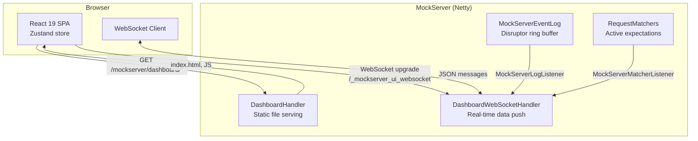
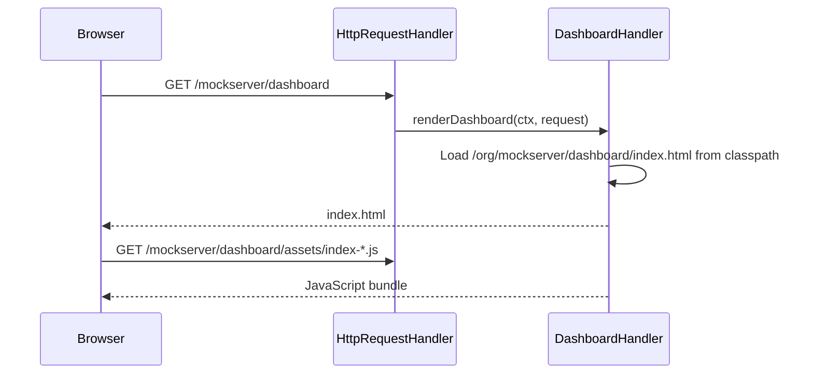
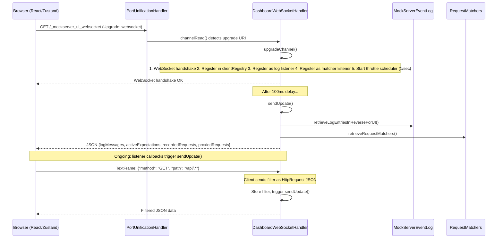
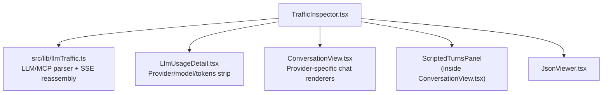
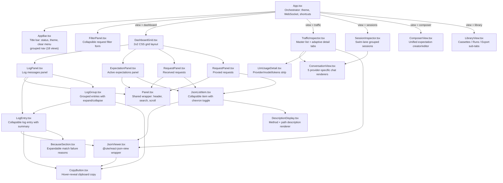
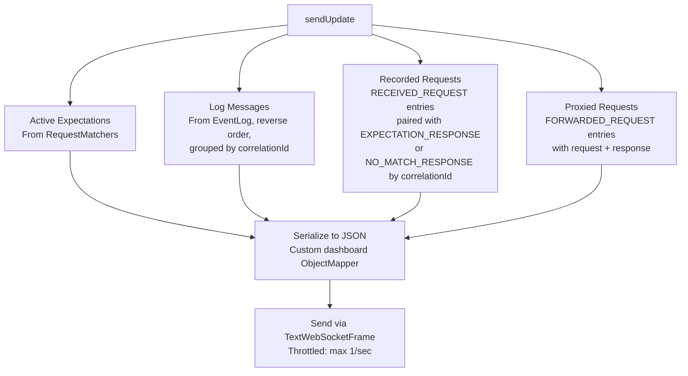
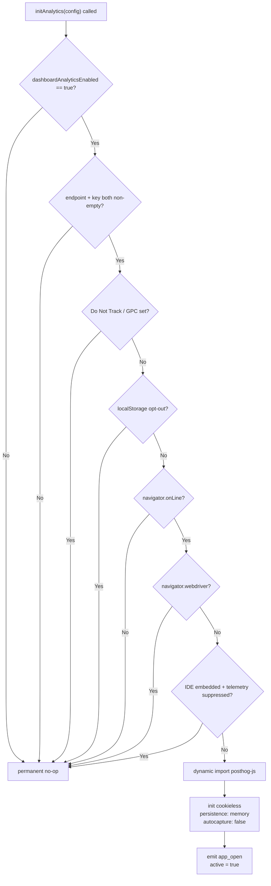

# Dashboard UI

## Architecture Overview

The MockServer dashboard is a React single-page application (SPA) that receives real-time updates via WebSocket. The frontend is built with Vite and served as static resources from the Java classpath. During the Maven build, the `build-ui` profile in `mockserver-netty` uses `frontend-maven-plugin` to install Node, run `npm ci` and `npm run build`, then copies the output to the classpath.



## Request Flow

### 1. Initial Page Load



### 2. WebSocket Connection



### 3. Real-Time Updates

The `DashboardWebSocketHandler` implements both `MockServerLogListener` and `MockServerMatcherListener`. When either fires, `sendUpdate()` assembles and pushes the current state to all connected clients.

**Throttling**: A `Semaphore(1)` with a scheduled release every 1 second limits updates to at most one per second per client, preventing UI flooding during high-traffic scenarios.

## Error Resilience

The entire view-switching region in `App.tsx` is wrapped in a single `ErrorBoundary` (`src/components/ErrorBoundary.tsx`) keyed on the active `view`:

```tsx
<ErrorBoundary label="this view" resetKeys={[view]}>
  {view === 'dashboard' && <DashboardGrid />}
  {/* ... */}
</ErrorBoundary>
```

When any view throws during render — including a failed `lazy()` chunk import (e.g. `MetricsView`) — the boundary catches it and shows an inline alert instead of blanking the whole app. The AppBar sits **outside** the boundary so navigation always works. Two recovery paths:

- **Chunk-load failure** (stale JS hashed URL after a redeploy): the fallback offers a hard "Reload page" button (`window.location.reload()`). These are detected by matching the browser's `Failed to fetch dynamically imported module` / `Importing a module script failed` error messages.
- **Any other render error**: the fallback offers a "Try again" button that calls `boundary.reset()` in place.

When `resetKeys` changes (the user navigates to another tab), the boundary clears its error state automatically — a crashed subtree recovers without a manual retry.

`ErrorBoundary` accepts an optional `label` prop (shown in the fallback text and in `console.error`) and an `onReset` callback.

## Auto-Refresh

`src/hooks/useAutoRefresh.ts` is a thin wrapper over `usePolling` that drives periodic background refresh in panels that do not receive WebSocket push. It inherits `usePolling`'s self-rescheduling loop (next tick scheduled only after the previous run completes, preventing overlapping fetches), tab-visibility gating, and abort-on-unmount cleanup. The `AbortSignal` is forwarded to the callback so in-flight fetches are cancelled when the component unmounts or polling restarts.

**Data-fetch model by panel:**

| Panel | Refresh mechanism |
|-------|------------------|
| Dashboard, Traffic, Trace | WebSocket push (`_mockserver_ui_websocket`) |
| Breakpoints — live exchanges / frames | Callback WebSocket push (`_mockserver_callback_websocket`) |
| Breakpoints — matcher list | `useAutoRefresh` (interval, default 3 s) |
| Drift | `useAutoRefresh` (interval) |
| AsyncAPI | `useAutoRefresh` (interval, 5 s) |
| gRPC Services | `useAutoRefresh` (interval, 5 s) |
| MCP tools panel | `useAutoRefresh` (interval, 3 s) |
| Chaos | `setInterval` poll every 4 s (predates `useAutoRefresh`) |
| Performance — live status | `useAutoRefresh` (interval, 1 s) polling `GET /mockserver/loadScenario` |
| Performance — metrics graph | `usePolling` (interval, 3 s) scraping `GET /mockserver/metrics` (shared with Metrics view) |
| Metrics | `usePolling` directly in `useMetricsPolling` (3 s) |

## Shared Error Helpers

`src/lib/errorMessage.ts` exports two functions used across control-plane calls:

- **`humanizeError(e)`** — catches any thrown value; recognises the `MockServer returned <status>: <body>` shape (thrown by most lib helpers) and the `Replay failed (<status>): <body>` shape, then delegates to `humanizeServerError`. Falls back to a network-error message for `TypeError` / `Failed to fetch`. Returns `{ message, details? }`.
- **`humanizeServerError(status, rawBody)`** — maps HTTP status + raw body to a short actionable `message`, keeping the raw body in `details`. Handles 400 (invalid, extracts `{ "error": "…" }` envelope or JSON-schema `N errors:` summary), 401/403 (not authorised), 404 (feature unavailable), 409 (conflict), 5xx (internal error).

`src/components/HumanErrorAlert.tsx` (`HumanErrorAlert`) is the shared rendering component. It accepts a `HumanError` object (or discrete `message`/`details` props), shows the short message in an MUI `Alert`, and puts the raw `details` text behind an inline "Details" / "Hide details" toggle rendered in a monospace scrollable block. It replaces near-identical inline implementations that previously lived in `ComposerView`, `CaptureAsMockDialog`, and `ImportForm`. All panels added in subsequent rounds (`GrpcServicesPanel`, `BaselineCompareDialog`, `AsyncApiPanel`, etc.) use `HumanErrorAlert` and `humanizeError` consistently — there are no longer any inline error string concatenations in control-plane call sites.

`monospaceFontFamily` exported from `src/theme.ts` is the canonical monospace font stack. All code, JSON, log, and identifier surfaces across the dashboard use it via `sx={{ fontFamily: monospaceFontFamily }}` or the MUI theme's `typography` overrides rather than hardcoded `'monospace'` strings, giving a consistent typeface across panels.

`src/lib/replay.ts` wraps `PUT /mockserver/replay`: `replayRequests(params, httpRequest)` returns the upstream response parsed as JSON (wraps non-JSON bodies as `{ body: text }`), throwing `ReplayError(status, body)` on non-2xx so `humanizeError` can parse it.

`src/lib/expectations.ts` exposes `deleteExpectation(params, id)`, which issues `PUT /mockserver/clear?type=expectations` with body `{ "id": "<expectationId>" }` to remove a single expectation without disturbing logs or recorded requests.

## Top-Level Views

The dashboard has **eighteen top-level views** controlled by the AppBar. The view state is stored in Zustand as `view: ViewMode` where:

```
ViewMode = 'dashboard' | 'traffic' | 'sessions' | 'composer' | 'library'
         | 'chaos' | 'performance' | 'metrics' | 'drift' | 'verification'
         | 'slo' | 'async' | 'grpc' | 'breakpoints'
         | 'contract' | 'cluster' | 'optimise' | 'get-started'
```

`'composer'` is surfaced in the UI under the button label **Mocks**; `'async'` is the **AsyncAPI** broker view; `'performance'` is the **Performance** load-scenario panel; `'sessions'` is labelled **Trace** in the nav; `'get-started'` is the initial onboarding view shown to new users before any data arrives.

The active view and per-panel search terms persist across page reloads: the view is mirrored in the URL hash (`#/<view>`) and in `localStorage`, resolved at startup by `coerceView`/`persistView` in `store/index.ts`; per-panel search terms are stored under a separate `localStorage` key. Unknown or stale values are silently ignored and fall back to `'get-started'`.

The Request Filter panel is shown on Dashboard, Traffic, and Trace views. It is hidden on all other views.

| View | Nav label | Component | Description |
|------|-----------|-----------|-------------|
| `get-started` | Get Started | `OnboardingPanel.tsx` | Onboarding view shown on first load; stays until the user navigates away (no auto-switch) |
| `dashboard` | Dashboard | `DashboardGrid.tsx` | 2×2 grid of Log Messages, Active Expectations, Received Requests, Proxied Requests panels |
| `traffic` | Traffic | `TrafficInspector.tsx` | Full-width master/detail list of all captured traffic (mock-matched + proxied), with per-row Replay and Compare buttons |
| `sessions` | Trace | `SessionInspector.tsx` | Swim-lane grouped view of isolated LLM conversation sessions; labelled **Trace** in the nav |
| `composer` | Mocks | `ComposerView.tsx` | Unified expectation creator/editor for Standard HTTP and LLM Conversation expectations |
| `library` | Library | `LibraryView.tsx` | Fixture cassettes, run comparison, and export (HAR / OpenAPI / Postman / Bruno) |
| `chaos` | Chaos | `ServiceChaosPanel.tsx` | Service-scoped HTTP chaos registration, live TTL countdown, and clear-all |
| `performance` | Performance | `LoadScenarioPanel.tsx` | Create and run load scenarios: stage-builder (VU / RATE / PAUSE stages with ramp curves), live run status (stageIndex / stageType / currentTarget / active VUs), and a live latency+throughput graph with per-metric and per-scenario toggles plus an all-scenarios total (see [Performance View](#performance-view)) |
| `drift` | Drift | `DriftPanel.tsx` | Mock drift detection results: divergence records between forwarded responses and stub expectations |
| `verification` | Verify | `VerificationView.tsx` | Build and run verifications — request matchers, expected counts (atLeast/atMost/exactly/between), or an ordered sequence — against received requests |
| `slo` | SLO | `SloPanel.tsx` | Assert service-level objectives — latency percentiles and error rate — against recorded traffic (see [SLO View](#slo-view)) |
| `contract` | Contract | `ContractTestPanel.tsx` | Validate mocks and traffic against an OpenAPI contract |
| `cluster` | Cluster | `ClusterPanel.tsx` | Monitor MockServer cluster nodes and shared state |
| `optimise` | LLM Optimise | `OptimiseView.tsx` | Analyse captured LLM traffic to optimise prompts, inference cost, safety, and speed |
| `async` | Async | `AsyncApiPanel.tsx` | AsyncAPI broker mock status: loaded spec, channels/topics, publisher/subscriber summary, and recorded broker messages |
| `grpc` | gRPC | `GrpcServicesPanel.tsx` | gRPC services and methods loaded from protobuf descriptors, with per-service health-check status (see [gRPC Services View](#grpc-services-view)) |
| `metrics` | Metrics | `MetricsView.tsx` | Prometheus metrics polling: request counters, latency percentiles, JVM stats, chaos gauges |
| `breakpoints` | Breakpoints | `BreakpointsPanel.tsx` | Live table of paused HTTP exchanges and held streaming frames; continue / modify / abort each (see [Breakpoints Panel](#breakpoints-panel)) |

```mermaid
graph TB
    APP["App.tsx"]
    AB["AppBar.tsx
grouped nav: 6 dropdown groups"]
    FP["FilterPanel.tsx
(dashboard, traffic, sessions only)"]
    GS["OnboardingPanel.tsx
(view = 'get-started')"]
    DG["DashboardGrid.tsx
(view = 'dashboard')"]
    TI["TrafficInspector.tsx
(view = 'traffic')"]
    SI["SessionInspector.tsx
(view = 'sessions', label 'Trace')"]
    CV["ComposerView.tsx
(view = 'composer', label 'Mocks')"]
    LV["LibraryView.tsx
(view = 'library')"]
    SCP["ServiceChaosPanel.tsx
(view = 'chaos')"]
    LSP["LoadScenarioPanel.tsx
(view = 'performance')"]
    DP["DriftPanel.tsx
(view = 'drift')"]
    VV["VerificationView.tsx
(view = 'verification')"]
    SP["SloPanel.tsx
(view = 'slo')"]
    CO["ContractTestPanel.tsx
(view = 'contract')"]
    CL["ClusterPanel.tsx
(view = 'cluster')"]
    OP["OptimiseView.tsx
(view = 'optimise')"]
    AAP["AsyncApiPanel.tsx
(view = 'async')"]
    GP["GrpcServicesPanel.tsx
(view = 'grpc')"]
    MV["MetricsView.tsx
(view = 'metrics')"]
    BP["BreakpointsPanel.tsx
(view = 'breakpoints')"]

    APP --> AB
    APP --> FP
    AB -->|setView| APP
    APP -->|view = get-started| GS
    APP -->|view = dashboard| DG
    APP -->|view = traffic| TI
    APP -->|view = sessions| SI
    APP -->|view = composer| CV
    APP -->|view = library| LV
    APP -->|view = chaos| SCP
    APP -->|view = performance| LSP
    APP -->|view = drift| DP
    APP -->|view = verification| VV
    APP -->|view = slo| SP
    APP -->|view = contract| CO
    APP -->|view = cluster| CL
    APP -->|view = optimise| OP
    APP -->|view = async| AAP
    APP -->|view = grpc| GP
    APP -->|view = metrics| MV
    APP -->|view = breakpoints| BP
```



## Metrics View

`MetricsView.tsx` (view = `metrics`) is the dashboard's observability surface. Unlike the other views — which are pushed data over the WebSocket — it **polls** MockServer's Prometheus endpoint `GET /mockserver/metrics` on an interval (default 3s) via the `useMetricsPolling` hook, parses the text exposition format (`lib/prometheusParser.ts`), and keeps a rolling history so it can derive time series client-side (`lib/metricsDerive.ts`).

During the initial load (before the first scrape resolves) `MetricsView` renders MUI `Skeleton` placeholders — one text skeleton for the label and one rounded skeleton per chart — so the page shows structure rather than a blank area while waiting.

It renders:
- **KPI hero stat cards** — four prominent headline counters (requests received, matched, not-matched, forwarded) rendered as `Card` components above the chart stack. When latency histogram data is present, p50/p95/p99 cards join the row.
- time-series charts with a **real time axis** and **area fill** (via `@mui/x-charts` `AreaChart`) for throughput and latency trends; `@mui/x-charts` is lazy-loaded with the whole `MetricsView` chunk so it stays off the initial bundle,
- a derived requests-per-second throughput chart (Δcount / Δt between scrapes, since the metrics are monotonic gauges),
- request latency percentiles (p50/p95/p99) from the `mock_server_request_duration_seconds` histogram (shown only when present),
- an **HTTP Chaos Faults** section (shown only when a chaos metric is present and has non-zero data) with: a per-fault-type stat + time-series chart of cumulative injections (`mock_server_http_chaos_injected_total`), and a separate per-fault-type chart of the active service-scoped chaos gauge (`mock_server_active_service_chaos`, labeled by `fault_type`) plotted by type rather than as a single counter. Fault types for both are discovered from the scrape via `labelValues`, so a future type renders automatically,
- JVM heap memory, thread count, and GC stats (shown only when JVM metrics are present), and
- a per-action breakdown of the `*_actions_count` gauges, plus the served MockServer version from `mock_server_build_info`.

There is **no charting dependency** (inline SVG) and no server change required. Because metrics are off by default, a 404 is treated as a first-class `disabled` state that shows the user how to enable them (`metricsEnabled`) rather than an error.

## Chaos View

`ServiceChaosPanel.tsx` (view = `chaos`) manages **service-scoped chaos** interactively. Like the Metrics view it **polls** rather than using the WebSocket — `GET /mockserver/serviceChaos` every 4s via the control-plane helpers in `lib/serviceChaos.ts` (`fetchServiceChaos` / `registerServiceChaos` / `removeServiceChaos` / `clearServiceChaos`). It renders:
- a **register form** — host plus error status / error probability / drop probability / latency-ms / optional TTL-ms fields; only the populated fields are sent in the `chaos` object (`buildChaosProfile`), and the register is rejected client-side if no fault is set,
- a list of **active registrations**, each with a `summarizeChaosProfile` chip breakdown of its faults and a per-host **Remove** button,
- a **live TTL auto-revert countdown** chip for any TTL-bearing registration — the remaining ms returned by the server's `ttlRemainingMillis` is decremented client-side by a 1s tick between polls (`formatTtl`),
- a **Clear all** button.

`lib/serviceChaos.ts` is framework-agnostic (plain `fetch`) so it is unit-tested independently of the component; it surfaces the server's `{"error": ...}` message on a 4xx.

## Performance View

`LoadScenarioPanel.tsx` (view = `performance`) is the dashboard control surface for [load injection](load-generation.md). It is lazy-loaded (shares the `@mui/x-charts` chunk with `MetricsView`) so the bundle does not download until the tab is opened.

**Layout.** A shared **Registered scenarios** section (the named-scenario registry: lifecycle-state badges, multi-select start, per-row edit/start/stop/delete) sits at the top, visible at all times. Below it, two sub-tabs separate the two things you do here:

- **Run & Monitor** (default) — the live side: a "Running now" card per concurrently-running scenario, the single-run live status, the multi-scenario chart, and the post-run summary. An empty-state hint shows when nothing has run yet.
- **Create / Edit** — author a scenario: the stage-builder form, with the generated client code (idiomatic MockServer client builders for each language, not raw JSON) rendered inline directly below it and updated live as you fill in fields (no separate Code tab).

The view follows what you're doing: clicking **edit** on a registered scenario (or "Edit running") switches to **Create / Edit**; starting a run (Load & Run, Start selected, or a per-row Start) switches to **Run & Monitor**.

**Stage builder.** Presents an ordered list of stages that forms the `LoadProfile.stages` array sent in `PUT /mockserver/loadScenario`. Each stage row lets the user pick the stage type, duration, setpoint (hold or ramp), and curve:

| Stage type | Setpoint fields shown |
|------------|----------------------|
| `VU` hold | `vus` |
| `VU` ramp | `startVus`, `endVus`, `curve` |
| `RATE` hold | `rate` (iterations/second) |
| `RATE` ramp | `startRate`, `endRate`, `curve`, optional `maxVus` |
| `PAUSE` | duration only |

Ramp curves offered: `LINEAR` / `QUADRATIC` / `EXPONENTIAL`. The builder prevents submitting a scenario that would exceed any safety cap (`loadGenerationMaxVirtualUsers`, `loadGenerationMaxRate`, `loadGenerationMaxStages`).

**Live status.** Once a scenario is running, the panel polls `GET /mockserver/loadScenario` and surfaces the status DTO:

| Status field | Meaning |
|-------------|---------|
| `state` | `running` / `completed` / `stopped` / `none` |
| `stageIndex` | 0-based index of the currently executing stage |
| `stageType` | `VU` / `RATE` / `PAUSE` |
| `currentTarget` | Target VU count or target arrival rate for the active stage |
| `currentVus` | Actual live VU count |
| `elapsedMillis` | Milliseconds since the run started |
| `requestsSent`, `succeeded`, `failed` | Cumulative counters |
| `p50Millis`, `p95Millis`, `p99Millis` | Latency percentiles from the histogram |

A **determinate** progress bar (not an indeterminate sweep) fills with `elapsedMillis / Σ stage durations` so you can see how far through the run is, and is coloured by phase — green while driving load, amber during a `PAUSE` stage. It falls back to an empty bar when the total duration is unknown (older server that doesn't echo the definition).

**Metrics graph.** A live `@mui/x-charts` `LineChart` built entirely from the polled scenario status — no Prometheus dependency, so it works with `metricsEnabled` off. Each registry poll appends a *frame* to a shared timeline, capturing a snapshot of every scenario running at that instant (keyed by scenario name); the legacy single-run status is folded in too, so older single-run servers still chart. The graph has two independent sets of toggles:

- **Metric toggles** — which series to plot: RPS, Active VUs, In-flight, p50/p95/p99 ms, Error rate % (default subset: RPS + p95 + Active VUs). RPS and error rate are derived per series (Δsent/Δt and failed/sent).
- **Scenario toggles** — which scenarios to include (shown only when more than one scenario has data; **all enabled by default**). Hiding a scenario removes its lines and drops it from the total.

When two or more scenarios are enabled the chart draws, for each visible metric, **a line per scenario plus an aggregate "All scenarios" total** — counts/VUs/in-flight summed across scenarios, latency percentiles taken as the worst (max) case. A scenario that starts or stops mid-run leaves a null gap in its line rather than distorting the others. With a single scenario it falls back to clean one-line-per-metric labels.

**Refresh mechanism:**

| Panel area | Mechanism |
|-----------|-----------|
| Live status (legacy single run) | poll of `GET /mockserver/loadScenario` (1 s while running, 5 s idle) |
| Registry list + chart frames | poll of `GET /mockserver/loadScenario` listing (1 s while any scenario runs, 5 s idle) |

When `loadGenerationEnabled=false` the panel renders a configuration prompt (property name + environment variable) instead of the stage builder.

## Dashboard View

`DashboardGrid.tsx` renders a 2×2 CSS grid with four data panels:

| Panel | Component | Data Source | Content |
|-------|-----------|------------|---------|
| Log Messages | `LogPanel` → `LogEntry` / `LogGroup` | `logMessages` | Grouped log entries with color-coded types |
| Active Expectations | `ExpectationPanel` → `JsonListItem` | `activeExpectations` | Currently registered expectations |
| Received Requests | `RequestPanel` → `JsonListItem` | `recordedRequests` | All received HTTP requests with paired responses |
| Proxied Requests | `RequestPanel` → `JsonListItem` | `proxiedRequests` | Forwarded requests with upstream responses |

### Per-Expectation Delete and Edit

Each row in `ExpectationPanel` exposes two inline actions (shown only when the row has an `expectationId`):

- **Delete** — opens a `ConfirmDialog` describing what will be removed; on confirmation calls `deleteExpectation(params, id)` from `src/lib/expectations.ts`, which issues `PUT /mockserver/clear?type=expectations { "id": "<id>" }`. The row is optimistically removed from the local store; a success toast confirms. Recorded requests and logs are kept.
- **Edit** — calls the store action `editExpectation(item.value)`, which sets `pendingEditExpectation` in the store and switches `view` to `'composer'`. `ComposerView` detects the non-null `pendingEditExpectation` in a `useEffect`, loads the expectation JSON into the form, and switches to **Advanced** mode automatically. `clearPendingEditExpectation()` is called after loading so the signal is consumed once.

### Generate Stub on Unmatched Requests

Log entries for unmatched requests (description contains `EXPECTATION_NOT_MATCHED`) show an
extra "Generate Stub" action button (alongside the "Debug Mismatch / Why?" button) in
`LogEntry`. It follows the same React-context pattern as Debug Mismatch: a nullable async
callback is provided via `GenerateStubContext` (hook `useGenerateStubContext`) from `App`,
backed by the `useGenerateStub` hook and Zustand UI state (`generateStubOpen` /
`generateStubSuggestions` / `generateStubConfidence` / `generateStubLoading` /
`generateStubError`). Clicking it extracts the request from the log entry, calls
`PUT /mockserver/generateExpectation` via `lib/generateStub.ts`, and opens `GenerateStubDialog`
with the returned suggestion(s) and confidence so the user can register the stub or open it in
the Composer. The button is gated to unmatched entries only and hidden when no context is provided.

### Row Layout in Requests and Expectations

Each collapsed item row has two lines:

1. `[expand-chevron] [#] [expectationId-if-present]: METHOD …/right-aligned/path`
2. LLM badge chips (provider / model / `turn N of M` / stream / tool count / isolation key), indented to align with the expectation id column

The expanded JSON tree also aligns with the id column. The `turn N of M` chip is computed from `scenarioName` + `scenarioState` ordering and is always present for LLM expectations, regardless of which predicate type the turn uses.

## Traffic Inspector

`TrafficInspector.tsx` is a full-width master/detail layout. It shows **all captured traffic** — both mock-matched requests (from `recordedRequests`) and upstream-proxied requests (from `proxiedRequests`) — in a single unified list, because the user thinks of both as "traffic". No server-side changes are needed beyond the request/response pairing described below.



**Master list** — one row per captured call:

| Column | Source |
|--------|--------|
| Index | Row number |
| Provider chip | Detected kind: Anthropic / OpenAI / OpenAI Resp / Gemini / Ollama / MCP / HTTP |
| Method | `httpRequest.method` |
| Host + path | `httpRequest.headers.host` + `httpRequest.path` |
| Status chip | `httpResponse.statusCode` |
| Model chip | Parsed by `llmTraffic.ts` from request/response bodies |
| Token summary | Input/output tokens from response body |

**Detail pane** — shown on row selection. A thin **LLM Usage** strip appears above the tab row for any LLM-kind row, showing: provider chip, model name, tokens (`<in> in / <out> out`), estimated USD cost, and stop reason. This strip is rendered by `LlmUsageDetail.tsx`.

Below the strip, the adaptive tab row:

| Traffic kind | Tabs rendered |
|-------------|---------------|
| Anthropic, OpenAI, OpenAI Responses, Gemini, Ollama | **Messages**, **Conversation**, optionally **Scripted Turns** (when active scripted expectations exist), optionally **SSE Timeline** (when stream events present), **Raw JSON** |
| MCP JSON-RPC (`jsonrpc` field present) | **MCP**, **Raw JSON** |
| All other traffic | Raw JSON rendered directly (no tab bar) |

A **Capture as mock** button appears top-right of the detail pane for LLM-kind rows. Clicking it opens `CaptureAsMockDialog.tsx`, which calls the MCP `mock_llm_completion` tool to register a mock expectation from the captured traffic. For non-LLM (generic HTTP) traffic, the same dialog is opened with a generic draft. In the generic case a **Refine in Composer** button appears alongside the Register button in the dialog actions: clicking it calls the store's `editExpectation` action, which loads the draft into the Composer and switches to `view = 'composer'`, so the capture and the Composer share a single creation flow rather than being two divergent engines. Only the generic draft maps cleanly onto the Composer form; LLM drafts go directly to the MCP tool.

### ConversationView Component

`ConversationView.tsx` exports five provider-specific conversation views:

| Export | Provider | Format |
|--------|----------|--------|
| `AnthropicConversationView` | Anthropic Messages API | System banner + user/assistant bubbles + tool-call/tool-result bubbles |
| `OpenAiConversationView` | OpenAI Chat Completions | Same layout, OpenAI message structure |
| `OpenAiResponsesConversationView` | OpenAI Responses API | Input/output item rendering |
| `GeminiConversationView` | Gemini | Contents/candidates rendering |
| `OllamaConversationView` | Ollama | Messages + response rendering |

All five use a chat-transcript layout: user messages left-aligned, assistant messages right-aligned (WhatsApp-style bubbles), system prompts as a distinct banner.

The component is a pure renderer — it receives a parsed object from `llmTraffic.ts` and has no direct store or network dependencies.

### LLM/MCP Parser (`llmTraffic.ts`)

`src/lib/llmTraffic.ts` is a pure client-side parser. It detects traffic kind and extracts structured data for the detail pane.

**Traffic detection:**

| Pattern | Detection logic |
|---------|----------------|
| Anthropic Messages API | Path ends with `/v1/messages`; extracts `model`, `usage.input_tokens`, `usage.output_tokens`, `stop_reason`, messages array, tool-use blocks, SSE events |
| OpenAI Chat Completions | Path ends with `/v1/chat/completions`; extracts `model`, `usage.prompt_tokens`, `usage.completion_tokens`, `finish_reason`, messages array, `tool_calls` |
| OpenAI Responses API | Path ends with `/v1/responses`; extracts `model`, input/output items |
| Gemini | Path contains `/models/` and `/generateContent`; extracts `model`, contents, candidates |
| Ollama | Path ends with `/api/chat` or `/api/generate`; extracts `model`, messages, response message |
| MCP JSON-RPC | `Content-Type: application/json` body with a `jsonrpc` field; extracts `method`, `id`, `params`, `result`, `error` |
| Fallback | Generic display — Raw JSON only |

**SSE reassembly:** For streamed responses (body contains `data:` lines), `llmTraffic.ts` splits the captured body on `\n\n`, parses each `data:` chunk as JSON, and merges incremental delta fields to reconstruct the final message content. The per-chunk elapsed timestamps are preserved for the SSE Timeline tab.

**Base64 body decoding:** When a response body has a `BINARY` body type, the content is base64-encoded. `llmTraffic.ts` detects the `BINARY` type and decodes before parsing. Textual streaming responses are normally delivered as `STRING` bodies; this is a defensive fallback.

## Trace (Sessions) Inspector

`SessionInspector.tsx` (view = `sessions`, nav label **Trace**) groups all captured requests into swim-lanes by `<scenarioName> / <isolation-value>`. Each swim-lane displays chips for the captured turns, where each chip shows the turn index, method, path, and status code. Clicking a chip opens a per-request detail panel directly below the swim-lane, showing the Conversation view for the selected turn.

Requests that do not match any isolated scenario are grouped by upstream host (from the `Host` header) into **unscoped** sessions. This proxy-aware fallback means proxied traffic to different LLM providers (e.g. `api.anthropic.com` vs `api.openai.com`) appears in separate swim-lanes even without any conversation-isolation expectations configured.

Each swim-lane also has a collapsible **Conversation** section (`SessionConversation`) that renders the whole session as a chat-transcript using the same provider-specific Conversation views as the Traffic tab. Because each request in an agent run re-sends the full accumulated message history, it renders the *last* conversation-capable request in the session, which carries the complete transcript. Beneath it, a compact **Show graph** link (`AgentRunGraph.tsx`) fetches the correlated agent-run call graph on demand via the `explain_agent_run` MCP tool and renders it as a real Mermaid SVG diagram — a secondary structural view alongside the chat transcript. `AgentRunGraph` imports `mermaid` via a dynamic `import('mermaid')` inside an effect so the large Mermaid bundle (~hundreds of kB) stays out of the initial dashboard chunk and is fetched only the first time a user opens a graph. The SVG is rendered with `securityLevel: 'strict'` and a theme that follows the dashboard's light/dark mode. If Mermaid fails to load or render, the component falls back to displaying the Mermaid source text and a "Could not render the diagram" note. A "Show/Hide Mermaid source" toggle and a `CopyButton` are always available below the rendered diagram. Both graph and transcript are shown for any session with a detectable LLM provider, including unscoped/proxy sessions.

The grouping logic lives in `src/lib/sessionGrouping.ts`. It uses `scenarioName` and `scenarioState` from the request data to identify which requests belong to which conversation session, with a host-based fallback for unscoped traffic.

Each session lane header displays **per-session token/cost totals**: total input tokens, total output tokens, and estimated USD cost (via `llmPricing.ts`). These are computed purely client-side by aggregating the token usage already parsed from each request's response body by `llmTraffic.ts` (`getNumericTokens`). The cost chip is shown only when a pricing entry exists for the provider/model combination; unpriced models contribute tokens but no cost.

## Mocks (composer) View

`ComposerView.tsx` (view = `composer`, surfaced under the AppBar label **Mocks**) is a unified expectation creator and editor — a single inline form covering standard HTTP expectations of every action type plus multi-turn LLM conversations.

At the top is a **Quick mock / Advanced** toggle (`ComposerMode = 'quick' | 'advanced'`), defaulting to `'quick'`. The choice is persisted to `sessionStorage` so it survives navigation within the session. When a `pendingEditExpectation` arrives from the store (set by `ExpectationPanel`'s Edit action), the form loads the expectation and switches to **Advanced** mode automatically, since Quick mode only authors a plain HTTP static mock.

Below the mode toggle is an **Expectation kind** radio: **Standard HTTP expectation** or **LLM Conversation**.

### Standard HTTP Expectation

**Quick mock mode** (`QuickMockForm`) shows only the fields needed for the 90% case — method, path, status code, and a response body — and always produces a static HTTP expectation. It is the default for new sessions and for users who have not previously chosen Advanced. Switching to Advanced retains the current form state.

**Advanced mode** exposes the full form described below.

A **template snippet palette** (`SnippetPalette.tsx`) is available in both the Response Template and Forward Template steps. It is engine-aware — clicking a snippet inserts the correct Velocity, Mustache, or JavaScript syntax for the currently selected template engine. Each snippet shows a description and example output.

The Response Template and Forward Template panels also expose an **"Or load template from file"** field (`templateFile`) so the template can live in an external file instead of inline; the inline template wins when both are set. The Static HTTP response panel has a **Body source** toggle (Inline body / From file): choosing *From file* emits a `FILE` body with a path and an optional **Template engine** selector (None / Mustache / Velocity) that renders the body file as a template against the request. JavaScript is not offered for body files — it builds a full response object rather than a text fragment, so use a Response Template for that. These map to `StandardStaticState.bodyFromFile/filePath/fileTemplateType`, `StandardTemplateState.templateFile`, and `StandardForwardTemplateState.templateFile` in `standardCodegen.ts`.

- An **Edit existing or add new** dropdown lists every active non-LLM expectation by `<id-short>… · METHOD path`. Picking one prefills the matcher + response-action panel. A Reset button clears the selection.
- **Step 1 · Match a request**: Expectation ID (optional), Method, Path, Headers (Name: value lines), Query string parameters (key=value lines), Cookies (name=value lines), Path parameters (name=value lines), Body matcher, "Body is binary (base64)" toggle, HTTPS-only toggle, Priority (higher = wins), Times (0 = unlimited). All string fields and per-line entries accept a leading `!` to negate via MockServer's NottableString convention.
- **Step 2 · Respond with**: radio for the response action — Static HTTP response / Forward to upstream / Forward with override / Class callback / Response template / Error / fault injection.
- **Step 3 · {action name}**: per-action panel with fields specific to that action.
- **Step 4 · Review & register**: client-library tabs first — Java / Node.js / Python / Go / C# / Ruby / Rust — then JSON and curl last (read-only preview generated from the current form state by `standardToJava`/`standardToNode`/`standardToPython`/`standardToGo`/`standardToCsharp`/`standardToRuby`/`standardToRust`/`standardToJson`/`standardToCurl` in `standardCodegen.ts`), then the Register expectation button. The client-library tabs hydrate the same expectation JSON via each client's native facility (Node `mockAnyResponse({...})`, Python `Expectation.from_dict({...})`, Go `json.Unmarshal → client.Upsert`, C# `JsonSerializer.Deserialize<Expectation> → client.Upsert`, Ruby `Expectation.from_hash(JSON.parse(...)) → client.upsert`, Rust `serde_json::from_str::<Expectation> → client.upsert`) instead of reimplementing each language's builder matrix. The Node client is JSON-native so it reproduces every field; the typed-model clients hydrate into model objects, so a field the installed client version does not yet model is dropped on hydration (the JSON tab stays the authoritative, lossless source). Helper text next to the button changes based on whether the Expectation ID field is filled (editing existing in place vs. creating new).

### LLM Conversation

- Same **Edit existing or add new** dropdown, but listing scenario names (e.g. `weather-agent (2 turns)`).
- The LLM Conversation wizard content is rendered inline on the same page — no modal. It uses the same "1 · / 2 · / 3 ·" step structure: **Conversation basics** (provider, path, model, isolateBy), **Turns**, **Review & register** (Java / JSON / MCP tabs + Register button).
- Picking an existing scenario from the dropdown remounts the form via React `key` and prefills all fields. The Register button reads "Update N expectations" instead of "Register on server" when editing. A green note confirms "Editing — the existing expectation IDs will be reused so this updates in place."

The edit-existing flow works because `ComposerView.tsx` collects the current expectation IDs and passes them as `ids: string[]` to the `create_llm_conversation` MCP tool call. The server then calls `Expectation.withId(...)` on each generated expectation before `httpState.add(...)`, which performs an upsert.

## Library View

`LibraryView.tsx` consolidates fixture management and export. Three sub-tabs:

| Sub-tab | Content |
|---------|---------|
| **Cassettes** | List / Record / Load / Export sub-tabs for cassette files. Recording writes the current MockServer state to a JSON cassette file on the server filesystem via the `record_llm_fixtures` MCP tool. Loading reads one back via `load_expectations_from_file`. |
| **Runs** | Pick two captured sessions (Run A / Run B) and see a side-by-side structural trajectory diff (tool-call chain + per-turn token usage table). |
| **Export** | Single dropdown that crosses scope (registered expectations / recorded requests) with file format (MockServer JSON / HAR / OpenAPI 3 / Postman v2.1 / Bruno zip). Each option maps to a `PUT /mockserver/retrieve?type=ACTIVE_EXPECTATIONS\|REQUEST_RESPONSES&format=JSON\|HAR\|OPENAPI\|POSTMAN\|BRUNO` call. BRUNO returns `application/zip` since Bruno collections are multi-file (`.bru` per request + `bruno.json` manifest). Generation lives in `mockserver-core`'s `ExpectationExportSerializer` — best-effort for the non-MockServer formats (positive-string matchers round-trip, NottableString negation and dynamic actions appear as placeholders). |

## Verification View

`VerificationView.tsx` (view = `verification`, AppBar label **Verify**) builds and runs request verifications against the requests MockServer has already received. A toggle switches between two modes:

- **Single request** — one `httpRequest` matcher (method, path, header lines, query `key=value` lines, substring/JSON body) plus a times assertion. The times mode (`VerificationTimesMode`) is one of `atLeast` / `atMost` / `exactly` / `between`; `between` reveals a second count field. Submitting calls `verifyRequest(...)` in `lib/verification.ts`.
- **Ordered sequence** — an ordered list of matcher rows (add / remove steps) that must have been received in order (other requests may occur in between). Submitting calls `verifySequence(...)`.

Empty form fields are omitted from the built `httpRequest` (`buildHttpRequest`). A pass renders a green "Verified" alert; a failure renders the server's `failureMessage` (closest matches + actual count) in a red alert. `lib/verification.ts` is framework-agnostic (plain `fetch`) so it is unit-tested independently of the component. This is the visual equivalent of the verification REST API (`PUT /mockserver/verify` and `PUT /mockserver/verifySequence`).

## SLO View

`SloPanel.tsx` (view = `slo`, AppBar label **SLO**, under the **Verify** group) lets the user define SLO objectives against recorded traffic and assert them on demand. It calls `PUT /mockserver/verifySLO` via `lib/slo.ts` with a `SloCriteria` body — a `window` object (`{ type: 'LOOKBACK', lookbackMillis }` for a trailing window, or `{ type: 'EXPLICIT', fromEpochMillis, toEpochMillis }` for an absolute range) and an array of `SloObjective` entries each specifying:
- `sli` — one of `LATENCY_P50` / `LATENCY_P95` / `LATENCY_P99` / `ERROR_RATE`
- `comparator` — one of `LESS_THAN` / `LESS_THAN_OR_EQUAL` / `GREATER_THAN` / `GREATER_THAN_OR_EQUAL`
- `threshold` — the numeric threshold value

The server evaluates the objectives and returns an `SloVerdict` with `result` (`PASS` / `FAIL` / `INCONCLUSIVE`) and `objectiveResults` array. The panel renders per-objective pass/fail chips showing the measured value alongside the threshold.

## Contract View

`ContractTestPanel.tsx` (view = `contract`, AppBar label **Contract**, under the **Verify** group) validates mocks and recorded traffic against an OpenAPI spec. Two modes:
- **Traffic validate** — calls `PUT /mockserver/trafficValidate` with a spec (URL or inline YAML/JSON) to check whether all recorded traffic conforms to the spec.
- **Contract test** — calls `PUT /mockserver/contractTest` with a spec and a target `baseUrl` (and optional `operationId`) to exercise the live service and report pass/fail per operation.

Results are rendered as a report table with columns: operation, status code received, pass/fail, and validation errors. The UI result type (`lib/contractTest.ts`) has fields `operationId`, `method`, `path`, `statusCodeReceived`, `passed`, and `validationErrors: string[]`; the Java client maps these to `ContractResult.requestErrors`/`responseErrors`.

## Cluster View

`ClusterPanel.tsx` (view = `cluster`, AppBar label **Cluster**, under the **Inspect** group) shows the status of MockServer cluster nodes when the Infinispan state backend is active. It polls the cluster status endpoint and renders per-node health, the cluster name, and shared-state metrics. When clustering is not enabled the panel shows a configuration prompt.

## LLM Optimise View

`OptimiseView.tsx` (view = `optimise`, AppBar label **LLM Optimise**, under the **AI** group) analyses captured LLM proxy traffic and exports a brief recommending optimisations to prompts, inference cost, safety, and speed. It calls the LLM optimise REST endpoint, renders per-call signals (token usage, cost, cache-hit rate, one-shot rate, latency), and assigns an A–F verdict with a dollar-value "recoverable" attribution capped at actual spend. An export button downloads the full JSON report.

## AsyncAPI View

`AsyncApiPanel.tsx` (view = `async`, AppBar label **Async**) shows the live status of the AsyncAPI broker mock (the `mockserver-async` module). It **polls** `GET /mockserver/asyncapi` every 5s via `getAsyncApiStatus` in `lib/asyncApi.ts` (with a manual refresh button) rather than using the WebSocket. It renders:

- a **status header** — a connection chip (`connected` / `no spec loaded` / `unavailable`) plus the loaded spec title and version when present,
- a **Channels** table — one row per channel/topic with a schema-present indicator and example count,
- a **publisher / subscriber summary** — chips for active publisher count, subscriber count, and recorded-message count,
- a **Recorded Messages** table — messages captured from broker subscriptions (channel, key, truncated payload with full-text tooltip, schema-valid indicator, timestamp), with a free-text filter over channel / key / payload.

When the `mockserver-async` jar is not on the server's classpath the helper returns `null` and the panel shows a "Module unavailable" warning. A spec is loaded from the **AsyncAPI broker mock** entry in the Tools menu (`AsyncApiDialog`) or via `PUT /mockserver/asyncapi`.

## gRPC Services View

`GrpcServicesPanel.tsx` (view = `grpc`, AppBar label **gRPC**) lists the gRPC services and methods loaded from compiled protobuf descriptors, together with the health-check serving status of each service. It **polls** every 5 s via `useAutoRefresh`, fetching both data sources in parallel via `lib/grpc.ts`:

| Endpoint | Method | Purpose |
|----------|--------|---------|
| `PUT /mockserver/grpc/services` | `listGrpcServices` | Returns the services and methods from loaded FileDescriptorSets |
| `GET /mockserver/grpc/health` | `fetchGrpcHealth` | Returns a map of service name → `ServingStatus` |

`fetchGrpcStatus` wraps both calls; the health fetch is best-effort — if the endpoint is unavailable (older server), the panel still renders services with an empty health map rather than failing.

The panel renders:
- a **header** with service count, total method count, and an overall server `ServingStatus` chip (derived from the `_default` or empty-string key in the health map),
- one **collapsible card per service** — service name in monospace, a per-service health chip (`SERVING` / `NOT_SERVING` / `SERVICE_UNKNOWN` / `UNKNOWN`), and a method count,
- within each card, a **methods table** with columns: Method (name), Input (fully-qualified message type), Output (fully-qualified message type), and Kind (`unary` / `server stream` / `client stream` / `bidi stream`).

When no descriptors are loaded, a centred prompt directs the user to `PUT /mockserver/grpc/descriptors`. Errors are surfaced via `HumanErrorAlert`. Health chip colours: `SERVING` → success, `NOT_SERVING` → error, `SERVICE_UNKNOWN` / `UNKNOWN` → warning.

## MCP Session Handshake

`mockserver-ui/src/lib/mcpClient.ts` manages all MCP tool calls from the UI (capture-as-mock, conversation registration, cassette record/load). It performs the MCP `initialize` + `notifications/initialized` handshake lazily on first use and caches the resulting `Mcp-Session-Id` per base URL in a module-level `Map`. If a call fails with a "Missing or invalid Mcp-Session-Id" error, the client reinitializes automatically before retrying.

Prior to this, any UI feature that called an MCP tool was broken with a session-not-initialized error.

## Breakpoints Panel

`BreakpointsPanel.tsx` (view = `breakpoints`) registers **breakpoint matchers** and resolves paused HTTP exchanges and streaming frames interactively. Unlike the polling views, it is a real **callback-WebSocket client**: it opens `/_mockserver_callback_websocket` (the server assigns it a `clientId`, since a browser WebSocket cannot send the registration header) and paused items are **pushed** to it live — there is no REST polling of paused state. Only the matcher list is fetched over REST. (`lib/breakpoints.ts` holds the matcher REST helpers; `lib/breakpointCallbackClient.ts` holds the WebSocket client.)

The panel has **three tabs**:

**Matchers tab** — register a breakpoint matcher (method, path regex, headers, query parameters, cookies) together with the phases to break at (`REQUEST` / `RESPONSE` / `RESPONSE_STREAM` / `INBOUND_STREAM`), and list / remove / clear the active matchers. The matcher REST endpoints:

| Action | Endpoint |
|--------|----------|
| Register matcher | `PUT /mockserver/breakpoint/matcher` (requires a `clientId`) |
| List matchers | `GET /mockserver/breakpoint/matchers` |
| Remove one matcher | `PUT /mockserver/breakpoint/matcher/remove` (`{id}`) |
| Clear all matchers | `PUT /mockserver/breakpoint/matcher/clear` (routed through a confirmation dialog) |

The matcher list loads on mount and via a manual Refresh button (no interval).

**Live Exchanges tab** — one row per paused request/response exchange that arrived over the callback WebSocket. Each row shows the phase (`REQUEST` or `RESPONSE`), method or status code, path or reason phrase, age, exchange ID, and the matched breakpoint/expectation ID. Resolution is sent back over the **same callback WebSocket** (not REST):

| Button | Effect |
|--------|--------|
| Continue | Resolve the exchange unchanged (`resolveRequest` / `resolveResponse` with the original) |
| Modify | Opens a JSON editor prefilled with the request (REQUEST phase) or response (RESPONSE phase); resolves with the edited JSON |
| Abort | Resolve the REQUEST with a synthetic error response so it is not forwarded |

**Live Streams tab** — paused frames from forwarded streaming responses (SSE, chunked transfer, gRPC server-streaming, gRPC bidi inbound), grouped by `streamId`. Each row shows a direction badge (`Inbound` / `Outbound`) alongside the sequence number, method, path, body preview, size, and age. Per-frame decisions are sent over the WebSocket as a `StreamFrameDecisionDTO` whose `action` is one of `CONTINUE` / `MODIFY` / `DROP` / `INJECT` / `CLOSE` (continue, modify body, drop/discard, inject an extra frame after this one, close stream). The modify and inject actions each open a text editor dialog.

Held items are bounded client-side and cleared when the callback WebSocket disconnects (a reconnect issues a new `clientId`, so older paused items can no longer be resolved).

**Empty-state guidance**: when there are no paused exchanges or stream frames yet, each tab shows a contextual prompt directing the user to the correct next step — e.g. "Register a breakpoint matcher (Matchers tab) to pause matching forwarded requests or responses." If the callback WebSocket is not yet `connected`, an info banner explains the state and tells the user that items will appear once the connection establishes and matchers are registered.

See [docs/code/breakpoints.md](breakpoints.md) for the server-side architecture (`BreakpointRegistry`, `PausedExchange`, phases) and the callback-WebSocket resolution protocol.

## Get-Started / Onboarding View

`OnboardingPanel.tsx` (view = `get-started`) is the initial landing view. The Zustand store starts with `view: 'get-started'` and **stays there** — `applyMessage` never changes the view, so incoming data does not bounce the user to the dashboard. The user navigates away themselves via the AppBar. (A reset returns the view to `get-started`.)

## Traffic View: Replay and Compare

`TrafficInspector.tsx` exposes two extra per-row actions in the detail pane for captured requests:

**Replay button** — appears top-right of the detail pane for each traffic row. Clicking opens `ReplayDialog`, which calls `PUT /mockserver/replay` with the captured `HttpRequest` JSON and displays the upstream response (or an error) in a `JsonViewer`. This uses the same `NettyHttpClient`-backed handler as any other forward request (see [Request Replay](request-processing.md#request-replay)).

**Compare (diff) button** — a `CompareArrowsIcon` checkbox on each row. Selecting two rows enables structural comparison of those two requests or their responses via the `DiffPanel` (`PUT /mockserver/diff`). This is the same diff engine used by the Tools menu "Diff two requests" dialog.

## AppBar Styling and Responsive Behaviour

The AppBar navigation is driven by `NAV_GROUPS` — six top-level group-button entries, each of which opens a dropdown `Menu` of its member views. Groups, in order:

| Group | Views |
|-------|-------|
| **Mock** | Get Started, Mocks, gRPC, Async |
| **Observe** | Dashboard, Traffic, Trace, Metrics |
| **Verify** | Verify, Contract, SLO, Drift |
| **Resilience** | Chaos, Performance |
| **AI** | LLM Optimise |
| **Inspect** | Breakpoints, Library, Cluster |

The group button whose group contains the active view is highlighted (a translucent-white tint in light mode; the theme action-selected overlay in dark mode). Clicking a group button opens a dropdown `Menu`; selecting an item calls `setView` and closes the menu. One shared `<Menu>` is reused across all groups rather than one per group.

Below the `lg` breakpoint (`useMediaQuery(theme.breakpoints.down('lg'))`) all six group buttons are replaced by a single hamburger icon that opens one flat `Menu` organised into the same six labelled sections (`ListSubheader` + `Divider` separators). The current view name appears inline next to the icon.

**Light mode**: group buttons use `color="inherit"` (white text) with a translucent white border and a pale-tint active background. The connection-status chip uses pale tints (`#7fffa0` connected, `#ffd180` connecting, `#ff8a80` error) for visibility against the primary-coloured bar.

**Dark mode**: MUI defaults are kept; no overrides applied.

**Responsive layout across views:**

| Breakpoint | Effect |
|-----------|--------|
| `< lg` | AppBar nav collapses from six group-dropdown buttons to hamburger menu |
| `< md` | `DashboardGrid` collapses from 2×2 to a single stacked column |
| `< md` | `TrafficInspector` stacks master list above detail pane (column layout) |
| `< sm` | Dialogs rendered with `fullScreen` |

Icon-only toolbar buttons carry both a `Tooltip` and an `aria-label`.

## Tools Menu

The AppBar "Import / export" (wrench) menu groups one-off control-plane tools, each opening a dialog:

| Menu item | Dialog | Endpoint(s) |
|-----------|--------|-------------|
| Import OpenAPI / WSDL | `OpenApiImportDialog` / `WsdlImportDialog` | `PUT /mockserver/openapi` / WSDL import |
| Pact contract (export / verify) | `PactExportDialog` | `PUT /mockserver/pact`, `PUT /mockserver/pact/verify` |
| Mock OIDC provider | `OidcDialog` | `PUT /mockserver/oidc` |
| Mock SAML provider | `SamlDialog` | `PUT /mockserver/saml` |
| AsyncAPI broker mock | `AsyncApiDialog` | `PUT/GET /mockserver/asyncapi`, `PUT /mockserver/asyncapi/verify` |
| Register CRUD resource | `CrudDialog` | `PUT /mockserver/crud` |
| Mock file store | `FileStoreDialog` | `PUT /mockserver/files/{store,list,retrieve,delete}` |
| Diff two requests | `DiffRequestsDialog` | `PUT /mockserver/diff` (renders `DiffPanel`) |
| Compare against baseline | `BaselineCompareDialog` | `PUT /mockserver/baseline/compare` |

**Baseline Compare** (`BaselineCompareDialog.tsx`, backed by `lib/baseline.ts`) lets the user paste a known-good array of expectations as the baseline and optionally a second array as the current state. When the current array is omitted, the server diffs the baseline against its live recorded expectations. It calls `PUT /mockserver/baseline/compare` with `{ baseline: [...], current?: [...] }` and displays a `BaselineDiffReport` with `added`, `removed`, and `changed` arrays keyed by `METHOD path`, plus a `hasDrift` boolean, rendered as summary chips and a `JsonViewer` tree. The dialog is full-screen below the `sm` breakpoint and surfaces errors via `HumanErrorAlert`.

`SamlDialog` is backed by `src/lib/saml.ts` (`createSamlProvider`), which calls `PUT /mockserver/saml` with a `SamlConfig` body and returns the count of expectations registered. All fields are optional; the server supplies sensible defaults so an empty submit produces a fully functional mock SAML 2.0 IdP. Errors are surfaced via `humanizeError`.

## Destructive-Action Safety & Feedback

- **Confirmation**: "Reset server (all)" and "Clear expectations" route through a reusable `ConfirmDialog` instead of firing immediately; Reset is styled in the error colour and separated by a divider. "Clear logs" is benign and fires directly.
- **Keyboard**: `⌘/Ctrl-L` clears **logs only** (not a full reset) — a full reset is intentionally not bound to a keystroke.
- **Toasts**: a global `notification` in the store (`setNotification`) drives a `Snackbar` in `App.tsx`, giving success feedback for clear/reset and operating-mode changes. Failed operations use `severity="error"` consistently (not `warning`).

## Frontend Application

### Technology Stack

| Component | Technology |
|-----------|-----------|
| Framework | React 19 |
| State management | Zustand |
| Build tool | Vite |
| UI library | MUI v9 |
| Language | TypeScript |
| Testing | Vitest + React Testing Library |

### Zustand Store

```typescript
{
  logMessages: [],               // Log entries (grouped by correlationId)
  activeExpectations: [],        // Currently active expectations
  recordedRequests: [],          // All received requests (with paired responses)
  proxiedRequests: [],           // Forwarded request+response pairs
  connectionStatus: 'disconnected',
  error: null,
  filterEnabled: false,
  filterExpanded: false,
  autoScroll: true,
  logSearch: '',
  expectationSearch: '',
  receivedSearch: '',
  proxiedSearch: '',
  trafficSearch: '',
  view: 'get-started',          // 18 values — see ViewMode in store/index.ts; 'sessions' is labelled "Trace", 'composer' is "Mocks", 'async' is AsyncAPI, 'slo' is SLO, 'contract' is Contract, 'cluster' is Cluster, 'optimise' is "LLM Optimise"
  selectedTrafficIndex: null,
  actionTypeFilter: [],
  llmProviderFilter: [],
  pendingEditExpectation: null,  // Set by editExpectation(); consumed once by ComposerView to pre-fill the form
}
```

### WebSocket Hook

The `useWebSocket` hook manages the WebSocket lifecycle:

```typescript
const url = `${protocol}://${host}:${port}/_mockserver_ui_websocket`;
const ws = new WebSocket(url);
```

- `onopen`: Sends the current filter (serialized `HttpRequest`), resets reconnect counter
- `onmessage`: Parses JSON, calls `applyMessage()` to update all four entity arrays
- `onclose`: Triggers reconnection with exponential backoff (max 10 retries)
- `onerror`: Sets error status in store

### Component Architecture



### UI Components

| Component | File | Purpose |
|-----------|------|---------|
| `AppBar` | `AppBar.tsx` | Title bar with connection status chip, keyboard shortcut hints, auto-scroll toggle, dark/light mode toggle, clear/reset menu; on wide screens (`>= lg`): six grouped dropdown buttons (Mock / Observe / Verify / Resilience / AI / Inspect), each opening a `Menu` of its views; on narrow screens: hamburger icon with all 18 views in labelled sections |
| `FilterPanel` | `FilterPanel.tsx` | Collapsible request filter form (method, path, headers, query params, cookies) with debounced WebSocket send; shown on dashboard/traffic/sessions |
| `DashboardGrid` | `DashboardGrid.tsx` | 2×2 CSS grid layout for the four panels |
| `TrafficInspector` | `TrafficInspector.tsx` | Full-width master list + adaptive detail pane for all captured traffic (mock-matched + proxied) |
| `SessionInspector` | `SessionInspector.tsx` | Swim-lane grouped view of isolated LLM conversation sessions |
| `ComposerView` | `ComposerView.tsx` | Mocks (composer) view — unified expectation creator/editor; inline Standard HTTP and LLM Conversation forms |
| `LibraryView` | `LibraryView.tsx` | Cassettes / Runs / Export sub-tabs |
| `ConversationView` | `ConversationView.tsx` | Five provider-specific chat-transcript renderers: Anthropic, OpenAI, OpenAI Responses, Gemini, Ollama |
| `LlmUsageDetail` | `LlmUsageDetail.tsx` | Thin strip shown above the detail pane tab row for LLM traffic: provider chip, model, tokens, cost, stop reason |
| `Panel` | `Panel.tsx` | Shared panel wrapper with title, count chip, search box, auto-scroll content area |
| `LogEntry` | `LogEntry.tsx` | Renders a single log entry; supports `collapsible` mode and `divider` mode |
| `LogGroup` | `LogGroup.tsx` | Groups related log entries (same correlation ID) with orange left border, expand/collapse |
| `JsonListItem` | `JsonListItem.tsx` | Renders request/expectation items with chevron toggle, index number, and description |
| `JsonViewer` | `JsonViewer.tsx` | Thin wrapper around `@uiw/react-json-view` with theme-aware styling |
| `CopyButton` | `CopyButton.tsx` | Hover-reveal icon button that copies text to clipboard |
| `DescriptionDisplay` | `DescriptionDisplay.tsx` | Renders description variants: plain string, structured `{first, second}`, or JSON object |
| `BecauseSection` | `BecauseSection.tsx` | Expandable list of match failure reasons for `EXPECTATION_NOT_MATCHED` entries |
| `ErrorBoundary` | `ErrorBoundary.tsx` | Catches render-time exceptions; shows a recoverable inline fallback; keyed-reset on `view`; hard-reload for chunk-load failures |
| `HumanErrorAlert` | `HumanErrorAlert.tsx` | Shared error alert: short `message` + inline "Details" expander for the raw server body |
| `SamlDialog` | `SamlDialog.tsx` | Mock SAML 2.0 IdP registration dialog; backed by `lib/saml.ts` → `PUT /mockserver/saml` |
| `GrpcServicesPanel` | `GrpcServicesPanel.tsx` | gRPC Services view: polls services + health every 5 s via `lib/grpc.ts` (`PUT /mockserver/grpc/services`, `GET /mockserver/grpc/health`); renders per-service method tables with streaming kind chips |
| `BaselineCompareDialog` | `BaselineCompareDialog.tsx` | Tools-menu dialog: paste baseline + optional current expectation arrays, calls `PUT /mockserver/baseline/compare` via `lib/baseline.ts`, renders `BaselineDiffReport` summary chips and `JsonViewer` tree |

### Collapsible Items

All data items are **collapsed by default** across all four dashboard panels:

- **Requests and expectations** (`JsonListItem`): Show a chevron (`▸`), index number, and method+path description. Click to expand and reveal the full JSON body rendered by `JsonViewer`.
- **Standalone log entries** (`LogEntry` with `collapsible=true`): Show a chevron, description (timestamp + type), and a grey summary (first 80 chars of message text, truncated with `…`). Click to expand and see the full message parts.
- **Grouped log entries** (`LogGroup`): Show an expand button with the group header entry. Click to expand and reveal all child entries.

### Rendering Performance

The four dashboard panels can each hold up to 100 rows and receive a full state
snapshot over the WebSocket up to once per second, so the panels are tuned to
avoid re-render storms and keep interaction smooth:

| Technique | Where | Effect |
|-----------|-------|--------|
| Reference-stable reconciliation | `store` `reconcileByKey` (in `applyMessage`) | Each push reuses the previous object reference for any row whose content is unchanged (matched by stable `key`, structural compare), so memoized rows and their `useMemo([item.value])` hooks stay valid across pushes |
| Row memoization | `React.memo` on `LogEntry`, `JsonListItem` | Unchanged rows skip re-rendering entirely on each push |
| Deferred expand body | `useDeferredValue(expanded)` in `LogEntry` / `JsonListItem` | The chevron/layout reacts to the click immediately; the expensive expanded JSON tree (`@uiw/react-json-view`) builds in a non-blocking follow-up render |
| Progressive rendering | `ProgressiveList` (used by `LogPanel`, `ExpectationPanel`, `RequestPanel`) | Mounts an initial batch (~visible rows) on first paint, then appends the rest in batches during browser idle time (`requestIdleCallback`, `setTimeout` fallback). The full list ends up laid out, so native scrolling stays smooth with no per-scroll work |
| Lifted expand state | `useExpansion` hook (per panel) | Expand/collapse state is held in the panel keyed by row key, passed to rows as controlled `expanded`/`onToggle` props (with an uncontrolled fallback for standalone use), so it survives independently of any row remount |

An earlier attempt used true windowing (`@tanstack/react-virtual`) but was
reverted: it rendered the full list then re-rendered windowed (slower first
paint) and its JS-driven per-scroll re-measuring made scrolling janky.
Progressive rendering keeps the fast-first-paint benefit without the
scroll-time cost.

### Copy to Clipboard

Copy buttons appear on hover (CSS `opacity: 0` → `opacity: 1` on parent `:hover .copy-btn`):

- `JsonViewer`: Copy button in top-right copies the full JSON as formatted text
- `LogEntry`: Copy button copies description + all message parts as text
- `LogGroup`: Separate `.group-copy-btn` copies the full group (header + all child entries joined by `\n\n`)

### Theme System

- Default: dark mode (unless user explicitly saved `'light'` in `localStorage` key `mockserver-theme`)
- `getInitialTheme()` in store checks `localStorage` first; falls back to `'dark'`
- `prefers-color-scheme` media query is **not** used — dark is always the default for new users
- `buildTheme()` in `theme.ts` creates an MUI theme from the mode
- Toggle via AppBar sun/moon icon; saved to `localStorage`

`src/theme.ts` is now a full design system. Beyond `buildTheme()`, it exports:

| Export | Purpose |
|--------|---------|
| `logTypeColors` | Flat `rgb(…)` map keyed by log type — light-background variants, kept for backwards compatibility |
| `logTypeColor(type, mode)` | Mode-aware accessor; returns a dark-override colour for types whose light-bg value has low contrast on the dark `#1e1e1e` canvas (`CREATED_EXPECTATION`, `EXPECTATION_NOT_MATCHED`, `CLEARED`, `UPDATED_EXPECTATION`, `INFO`, `SERVER_CONFIGURATION`, `ERROR`, `EXCEPTION`) |
| `transitions` | Shared motion tokens — `fast` (150 ms), `standard` (220 ms), `forProps(props[], ms?)` for property-scoped transitions |
| `monospaceFontFamily` | Monospace font stack shared by log/JSON/code surfaces |

`buildTheme()` now sets MUI `shape.borderRadius: 8`, a tuned typography scale (`h5`/`h6`/`subtitle1`/`subtitle2`/`body2`/`caption` all mapped to the rem sizes the dashboard already uses), shortened `transitions.duration` values, and component overrides for `MuiPaper`, `MuiCard`, `MuiAppBar`, `MuiButton`, `MuiChip`, `MuiToggleButton`, `MuiTooltip`, and `MuiTableRow`. Shadow tokens are mode-aware (deeper spreads on dark canvas) and are applied to Paper elevations, Cards, and the AppBar.

### Keyboard Shortcuts

Handled by `useKeyboardShortcuts` hook in `App.tsx`:

| Shortcut | Handler | Action |
|----------|---------|--------|
| `⌘K` / `Ctrl+K` | `onSearch` | Focus log messages search input |
| `⌘L` / `Ctrl+L` | `onClear` | Call `clearServer('all')` (server reset + UI clear + WebSocket reconnect) |
| `Escape` | `onToggleFilter` | Toggle filter panel expanded/collapsed |

### Clear and Reset

The AppBar clear menu provides three server-side operations:

| Menu Item | API Call | UI Behavior |
|-----------|----------|-------------|
| Clear server logs | `PUT /mockserver/clear?type=log` | Calls `clearUI()` after success |
| Clear server expectations | `PUT /mockserver/clear?type=expectations` | Calls `clearUI()` after success |
| Reset server (all) | `PUT /mockserver/reset` | Calls `clearUI()` + reconnects WebSocket (server closes it on reset) |

### Filtering

Users can filter all panels by sending an `HttpRequest` JSON object as a text WebSocket frame. The server stores the filter per client and uses it when assembling data:

- **Active expectations**: Filtered by `requestMatchers.retrieveRequestMatchers(filter)`
- **Log entries**: Filtered by matching `LogEntry.httpRequests` against the filter
- **Recorded requests**: Filtered by type `RECEIVED_REQUEST` + request match
- **Proxied requests**: Filtered by type `FORWARDED_REQUEST` + request match

### WebSocket Reconnection

The `connect()` function in `useWebSocket.ts` handles reconnection safely:

1. Clears any pending reconnect timer (`reconnectTimerRef`)
2. Nullifies `onclose`/`onerror` on the old socket before calling `close()` — prevents stale handlers from triggering spurious reconnection
3. Sets `socketRef.current = null` before creating the new socket
4. On `onclose`, schedules reconnection with exponential backoff (max 10 retries)

### Test Coverage

Vitest + React Testing Library + jsdom — see `mockserver-ui/src/__tests__/` for the full set. The suite is grouped roughly as follows:

| Area | Example test files |
|------|--------------------|
| Store + hooks | `store.test.ts`, `useConnectionParams.test.ts`, `useKeyboardShortcuts.test.ts`, `useWebSocket.test.ts`, `useAutoRefresh.test.ts` |
| App-chrome components | `AppBar.test.tsx`, `Panel.test.tsx`, `BecauseSection.test.tsx`, `CopyButton.test.tsx`, `DescriptionDisplay.test.tsx`, `HumanErrorAlert.test.tsx` |
| Log and request panels | `LogEntry.test.tsx`, `LogGroup.test.tsx`, `LogPanel.test.tsx`, `RequestPanel.test.tsx`, `ExpectationPanel.test.tsx`, `FilterPanel.test.tsx`, `JsonListItem.test.tsx` |
| Traffic / Sessions inspectors | `TrafficInspector.test.tsx`, `SessionInspector.test.tsx`, `PredicatePills.test.tsx`, `AgentRunGraph.test.tsx` |
| Responsive layout | `responsiveLayout.test.tsx` |
| Metrics view | `MetricsView.test.tsx` |
| Composer quick/advanced | `composerW6.test.tsx` |
| LLM mocking flows | `CaptureAsMockDialog.test.tsx`, `ConversationWizard.test.tsx`, `CassetteManager.test.tsx`, `CompareRunsDialog.test.tsx`, `cassetteRegistry.test.ts`, `conversationCodegen.test.ts`, `expectationFromCapture.test.ts`, `llmExpectationCodegen.test.ts`, `llmPricing.test.ts`, `llmTraffic.test.ts`, `trajectoryDiff.test.ts`, `sessionGrouping.test.ts`, `mcpClient.test.ts`, `callGraph.test.ts` |

Run `npm test` from `mockserver-ui/` to execute the full suite; the JUnit report is written to `mockserver-ui/test-reports/junit.xml`.

## Server-Side Data Assembly

### sendUpdate() Method

For each connected client, assembles four data categories (limited to 100 items each):



### Request/Response Pairing for Recorded Requests

`DashboardWebSocketHandler` (lines 385–450) performs a single reverse-chronological pass over the log stream to pair `RECEIVED_REQUEST` entries with their matching `EXPECTATION_RESPONSE` or `NO_MATCH_RESPONSE` entries. Because the log is iterated in reverse order, responses appear before their corresponding requests. The handler stashes each response by `correlationId` in a temporary map, then when it encounters the `RECEIVED_REQUEST` with the matching `correlationId`, it attaches the stashed response as `httpResponse` in the emitted `recordedRequests` item.

This means `recordedRequests` items are now `{ httpRequest, httpResponse }` objects — the same shape as `proxiedRequests` — allowing the Traffic, Sessions, and LLM Usage detail views to see mock-matched traffic with full request/response pairs, not just upstream-proxied traffic.

### Dashboard Model Classes

| Class | Package | Purpose |
|-------|---------|---------|
| `DashboardLogEntryDTO` | `o.m.dashboard.model` | Simplified log entry for UI display with description, style, and HTTP request/response data |
| `DashboardLogEntryDTOGroup` | `o.m.dashboard.model` | Groups related log entries by correlation ID |
| `Description` | `o.m.dashboard.serializers` | Truncated request description (method + path) for UI column display |

### Custom Serializers

The dashboard uses specialized Jackson serializers for UI-friendly output:

| Serializer | Purpose |
|------------|---------|
| `DashboardLogEntryDTOSerializer` | Color-coded log entries with message parts |
| `DashboardLogEntryDTOGroupSerializer` | Groups related entries by correlation ID |
| `DescriptionSerializer` | Truncated request/log descriptions |
| `ThrowableSerializer` | Exception stack traces as string arrays |

### Log Entry Color Coding

The colour map lives in `src/theme.ts` as `logTypeColors` (light-background values). Use `logTypeColor(type, mode)` rather than indexing `logTypeColors` directly so dark-mode overrides are applied. Components that receive `themeMode` from the store pass it through to the colour accessor.

| Log Type | Color | RGB (light) |
|----------|-------|-----|
| RECEIVED_REQUEST | Blue | `rgb(114,160,193)` |
| EXPECTATION_RESPONSE | Light blue | `rgb(161,208,231)` |
| EXPECTATION_MATCHED | Teal | `rgb(117,185,186)` |
| EXPECTATION_NOT_MATCHED | Muted pink | `rgb(204,165,163)` |
| FORWARDED_REQUEST | Sky blue | `rgb(152,208,255)` |
| VERIFICATION | Purple | `rgb(178,148,187)` |
| VERIFICATION_FAILED | Red | `rgb(234,67,106)` |
| WARN | Coral | `rgb(245,95,105)` |
| ERROR | Dark pink | `rgb(179,97,122)` |
| EXCEPTION | Bright red | `rgb(211,33,45)` |
| INFO | Green | `rgb(59,122,87)` |
| TEMPLATE_GENERATED | Gold | `rgb(241,186,27)` |
| CREATED_EXPECTATION | (default) | Uses log level colour |
| UPDATED_EXPECTATION | (default) | Uses log level colour |
| REMOVED_EXPECTATION | (default) | Uses log level colour |
| CLEARED | (default) | Uses log level colour |
| RETRIEVED | (default) | Uses log level colour |
| VERIFICATION_PASSED | (default) | Uses log level colour |
| NO_MATCH_RESPONSE | (default) | Uses log level colour |
| SERVER_CONFIGURATION | (default) | Uses log level colour |
| AUTHENTICATION_FAILED | (default) | Uses log level colour |
| DEBUG | (default) | Uses log level colour |
| TRACE | (default) | Uses log level colour |
| RUNNABLE | (hidden) | Internal — not displayed in UI |

### JSON Message Structure

```json
{
  "logMessages": [
    {
      "key": "<id>_log",
      "value": {
        "description": "2024-01-15 10:30:45.123 RECEIVED_REQUEST",
        "style": { "paddingTop": "4px", "color": "rgb(114,160,193)" },
        "messageParts": [
          { "key": "<id>_0msg", "value": "received request:" },
          { "key": "<id>_0arg", "json": true, "argument": true, "value": { "method": "GET", "path": "/api/users" } }
        ]
      }
    }
  ],
  "activeExpectations": [ ... ],
  "recordedRequests": [ ... ],
  "proxiedRequests": [ ... ]
}
```

## Dashboard vs Callback WebSockets

MockServer has two distinct WebSocket systems:

| Feature | Dashboard WebSocket | Callback WebSocket |
|---------|--------------------|--------------------|
| URI | `/_mockserver_ui_websocket` | `/_mockserver_callback_websocket` |
| Handler | `DashboardWebSocketHandler` | `CallbackWebSocketServerHandler` |
| Purpose | Real-time UI data push | Closure callback execution |
| Direction | Server → Client (push) | Bidirectional (request/response) |
| Client | Browser (React SPA) | Java `WebSocketClient` |
| Pipeline impact | Keeps all handlers | Removes downstream handlers |
| Max clients | 100 (CircularHashMap) | Bounded by configuration |

## Build Integration

The UI is built from source during the Maven build via the `build-ui` profile in `mockserver-netty/pom.xml`:

| Step | Plugin | Phase | Action |
|------|--------|-------|--------|
| Install Node | `frontend-maven-plugin` | `generate-resources` | Downloads Node v22.14.0 |
| Install dependencies | `frontend-maven-plugin` | `generate-resources` | Runs `npm ci` |
| Build UI | `frontend-maven-plugin` | `generate-resources` | Runs `npm run build` (tsc + vite) |
| Copy to classpath | `maven-resources-plugin` | `process-resources` | Copies `mockserver-ui/build/` to `target/classes/org/mockserver/dashboard/` |

The profile auto-activates when `../../mockserver-ui/package.json` exists. To skip the UI build: `./mvnw ... -P!build-ui`.

### Static Resources

All frontend files are bundled in the JAR at `/org/mockserver/dashboard/`:

| File | Type | Purpose |
|------|------|---------|
| `index.html` | HTML | SPA entry point |
| `assets/index-*.js` | JS | Application bundle (React, MUI, Zustand, all components) |
| `apple-touch-icon.png` | PNG | Touch icon |
| `favicon.ico` | ICO | Browser favicon |

## Opening the Dashboard

From client code:

```java
MockServerClient client = new MockServerClient("localhost", 1080);
client.openUI();  // Opens http://localhost:1080/mockserver/dashboard in browser
```

Or directly in a browser: `http://localhost:1080/mockserver/dashboard`

## Local Development

### Dev Environment Script

`scripts/local_ui_dev.sh` launches both MockServer and the Vite dev server for UI development:

```bash
./scripts/local_ui_dev.sh              # Build JAR if needed, start both servers, open browser
./scripts/local_ui_dev.sh --rebuild    # Force rebuild the MockServer JAR
./scripts/local_ui_dev.sh --no-browser # Don't auto-open browser
./scripts/local_ui_dev.sh --port 9090  # Use custom MockServer port
```

The script:
1. Checks port availability (offers to kill blocking processes interactively)
2. Builds the MockServer shaded JAR if not present
3. Installs UI npm dependencies if `node_modules/` is missing
4. Starts MockServer (logs to `mockserver-dev.log` in repo root)
5. Loads example data via `scripts/ui_dev_populate_data.sh`
6. Starts Vite dev server on port 3000
7. Opens `http://localhost:3000/mockserver/dashboard/`

### Vite Dev Proxy

`vite.config.ts` proxies API and WebSocket requests to the MockServer backend to avoid CORS issues during development:

| Path | Proxy Target | Notes |
|------|-------------|-------|
| `/_mockserver_ui_websocket` | `MOCKSERVER_URL` (default: `http://localhost:1080`) | WebSocket proxy |
| `/mockserver/*` (except `/mockserver/dashboard*`) | `MOCKSERVER_URL` | API proxy via `bypass` function |
| `/mockserver/dashboard*` | — | Served by Vite (returns `req.url` in bypass) |

The `MOCKSERVER_URL` env var is set by `local_ui_dev.sh` to match the configured MockServer port.

### Cross-Origin (CORS) Support

The dashboard is designed to connect to a MockServer at an arbitrary `host`/`port` (set via its
connection fields or the `?host=`/`?port=` query parameters), which is inherently a cross-origin
request when the dashboard is not served from that same MockServer. To make this work without any
configuration, **MockServer always returns CORS headers on control-plane responses** (every
`/mockserver/*` API response, written with `apiResponse == true`) and **answers the CORS preflight**
(`OPTIONS`) for control-plane paths — both independent of the `enableCORSForAPI` setting. This is
applied centrally in `ResponseWriter.writeResponse(...)` and `HttpActionHandler` (preflight), so it
covers every control-plane endpoint, not just the dashboard-specific ones.

Mock/proxy responses (`apiResponse == false`) are unaffected — they only receive CORS headers when
`enableCORSForAllResponses` is enabled — so enabling cross-origin dashboard access never changes how
mocked APIs respond. The Vite dev proxy above is therefore optional; the demo launcher
(`launch-with-demo-data.sh`) points the dashboard straight at the MockServer port via `?port=` and
relies on this CORS support.

## Usage Analytics

Anonymous, cookieless dashboard usage analytics are available via a self-hosted PostHog instance. The module is inert by default — no events are sent unless an operator explicitly supplies both an endpoint and a key.

### Activation gate chain

`initAnalytics(config)` in `mockserver-ui/src/lib/analytics.ts` runs all gates once at startup. If any gate fails, the module becomes a permanent no-op for the lifetime of the page; the decision can never be reversed without a fresh load.



### Event taxonomy

Every public function only ever emits a value from a **closed set** — there is no code path that accepts a free-text string (URL, hostname, header value, body, error message, file path, expectation JSON) and forwards it to the backend.

| PostHog event | Function | Properties |
|---|---|---|
| `app_open` | emitted by `initAnalytics` | `app_version`, `surface` (`browser`/`ide-embedded`), `theme` |
| `view_change` | `trackView(view)` | `view` — the active tab name (e.g. `traffic`, `chaos`) |
| `feature_used` | `trackFeature(feature, params?)` | `feature` from the `Feature` union type; optional `mode` (`quick`/`advanced`) |
| `error_shown` | `trackError(category)` | `category` from the `ErrorCategory` union type |

Both `feature` and `category` are runtime-guarded against non-enumerated values: values outside their `ReadonlySet` are dropped silently before any `posthog.capture` call.

### `view_change` wiring

Navigation tracking is wired in `App.tsx`, not inside the store, to keep the store pure. A `useEffect` subscribes to the store's `view` selector and calls `trackView(view)` on every change (and once for the initial view). The store itself has no analytics dependency.

### PostHog init options

```typescript
ph.init(key, {
  api_host: endpoint,
  persistence: 'memory',        // no cookie, no localStorage identifier
  autocapture: false,           // only our explicit closed event set
  capture_pageview: false,      // SPA tab switches sent manually as view_change
  capture_pageleave: false,
  disable_session_recording: true,
  disable_surveys: true,
});
```

`posthog-js` is loaded via a **dynamic `import()`** only after all gates pass, so it is a lazily-fetched first-party chunk that is never fetched when analytics is inactive.

### Configuration properties

| Property | System property / Env var | Default | Purpose |
|---|---|---|---|
| `dashboardAnalyticsEnabled` | `mockserver.dashboardAnalyticsEnabled` / `MOCKSERVER_DASHBOARD_ANALYTICS_ENABLED` | `true` | Master kill switch. `false` ⇒ module never loads. |
| `dashboardAnalyticsEndpoint` | `mockserver.dashboardAnalyticsEndpoint` / `MOCKSERVER_DASHBOARD_ANALYTICS_ENDPOINT` | `""` | PostHog `api_host` URL. Blank ⇒ disabled. |
| `dashboardAnalyticsKey` | `mockserver.dashboardAnalyticsKey` / `MOCKSERVER_DASHBOARD_ANALYTICS_KEY` | `""` | PostHog write-only project key. Blank ⇒ disabled. |

### Opt-out

Users can opt out via the dashboard banner (persisted to `localStorage` under `mockserver.analytics.optOut`), browser Do Not Track, or Global Privacy Control. `setAnalyticsOptOut(true)` also calls `posthog.opt_out_capturing()` immediately to stop any in-flight capture.
