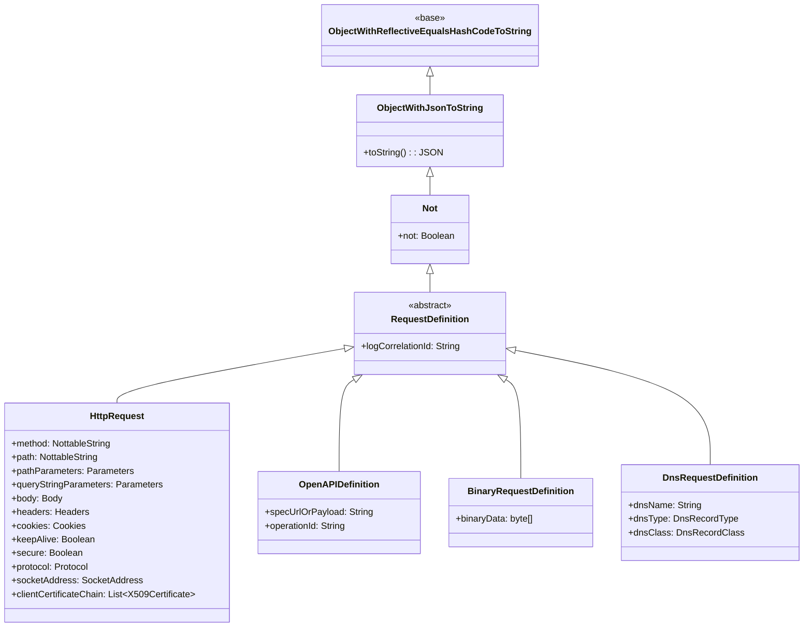
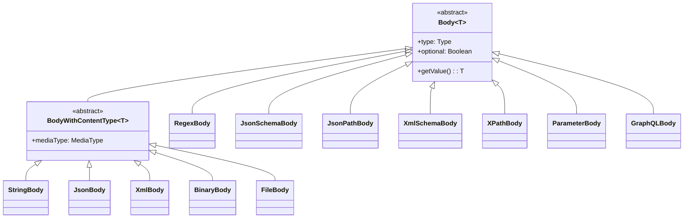
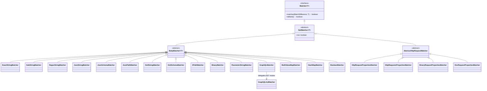
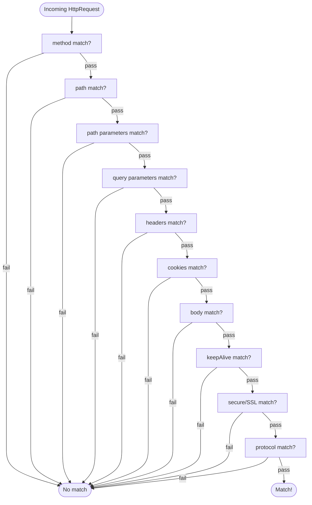
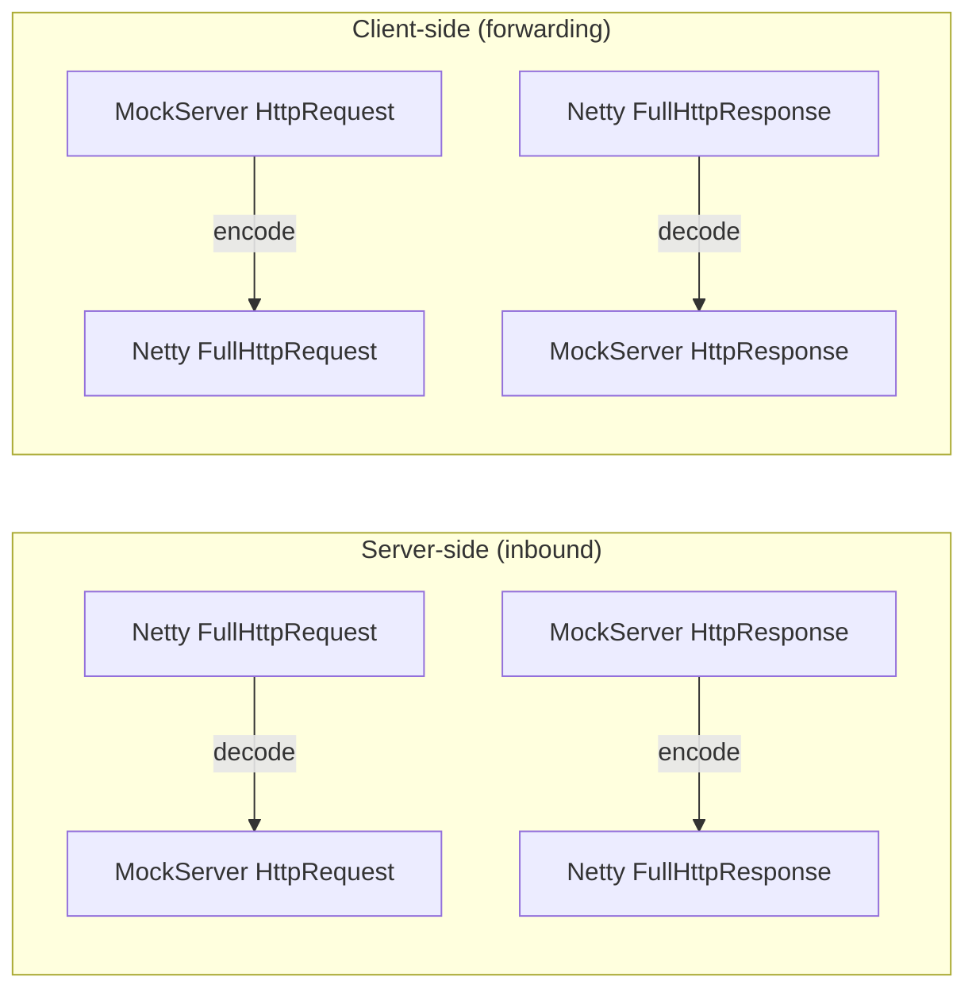
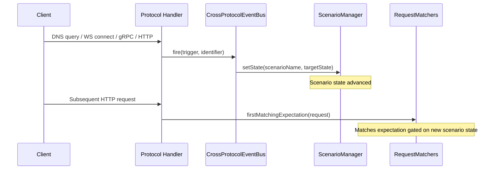

# Domain Model, Matchers & Serialization

## Domain Model Hierarchy

All domain objects descend from a common base providing reflection-based equality, JSON serialization, and a NOT operator:



`BinaryRequestDefinition` matches raw binary connections by byte content. `DnsRequestDefinition` matches DNS queries by name, record type, and record class.

### Action Types

```mermaid
classDiagram
    class Action~T~ {
        <<abstract>>
        +type: Type
        +delay: Delay
        +expectationId: String
    }
    class Delay {
        +timeUnit: TimeUnit
        +value: long
        +distribution: DelayDistribution
    }
    class DelayDistribution {
        +type: UNIFORM/LOG_NORMAL/GAUSSIAN
        +min/max: Long
        +median/p99: Long
        +mean/stdDev: Long
    }
    Delay --> DelayDistribution : optional
    class HttpResponse {
        +statusCode: Integer
        +reasonPhrase: String
        +body: Body
        +headers: Headers
        +cookies: Cookies
        +connectionOptions: ConnectionOptions
        +recoverAfter: RecoverAfter
        +timing: Timing
    }
    class RecoverAfter {
        +failTimes: Integer
        +failResponse: HttpResponse
        +idempotencyHeader: String
    }
    HttpResponse --> RecoverAfter : optional
    class HttpForward {
        +host: String
        +port: Integer
        +scheme: Scheme
    }
    class HttpTemplate {
        +template: String
        +templateType: TemplateType
        +actionType: Type
    }
    class HttpClassCallback {
        +callbackClass: String
        +actionType: Type
    }
    class HttpObjectCallback {
        +clientId: String
        +responseCallback: Boolean
        +actionType: Type
    }
    class HttpOverrideForwardedRequest {
        +requestOverride: HttpRequest
        +requestModifier: HttpRequestModifier
        +responseOverride: HttpResponse
        +responseModifier: HttpResponseModifier
    }
    class HttpError {
        +dropConnection: Boolean
        +responseBytes: byte[]
    }

    Action <|-- HttpResponse
    Action <|-- HttpForward
    Action <|-- HttpTemplate
    Action <|-- HttpClassCallback
    Action <|-- HttpObjectCallback
    Action <|-- HttpOverrideForwardedRequest
    class GrpcStreamResponse {
        +statusCode: Integer
        +messages: List~GrpcStreamMessage~
    }
    class GrpcStreamMessage {
        +json: String
        +delay: Delay
    }
    GrpcStreamResponse --> GrpcStreamMessage : 0..*

    class HttpForwardValidateAction {
        +specUrlOrPayload: String
        +host: String
        +port: Integer
        +scheme: Scheme
        +validateRequest: Boolean
        +validateResponse: Boolean
        +validationMode: ValidationMode
    }
    class HttpForwardWithFallback {
        +httpForward: HttpForward
        +fallbackResponse: HttpResponse
        +fallbackOnStatusCodes: List~Integer~
        +fallbackOnTimeout: Boolean
    }
    class HttpSseResponse {
        +statusCode: Integer
        +headers: Headers
        +events: List~SseEvent~
        +closeConnection: Boolean
    }
    class HttpWebSocketResponse {
        +subprotocol: String
        +messages: List~WebSocketMessage~
        +matchers: List~WebSocketMessageMatcher~
        +closeConnection: Boolean
    }
    class WebSocketMessageMatcher {
        +frameType: WebSocketFrameType
        +textMatcher: NottableString
        +responses: List~WebSocketMessage~
    }

    class BinaryResponse {
        +binaryData: byte[]
    }
    class DnsResponse {
        +answerRecords: List~DnsRecord~
        +authorityRecords: List~DnsRecord~
        +additionalRecords: List~DnsRecord~
        +responseCode: DnsResponseCode
    }

    class HttpLlmResponse {
        +provider: Provider
        +model: String
        +completion: Completion
        +embedding: EmbeddingResponse
        +conversationPredicates: ConversationPredicates
    }
    class Completion {
        +text: String
        +toolCalls: List~ToolUse~
        +stopReason: String
        +usage: Usage
        +streaming: Boolean
        +streamingPhysics: StreamingPhysics
    }
    class ToolUse {
        +id: String
        +name: String
        +arguments: String
    }
    class Usage {
        +inputTokens: Integer
        +outputTokens: Integer
    }
    class StreamingPhysics {
        +timeToFirstToken: Delay
        +tokensPerSecond: Integer
        +jitter: Double
        +seed: Long
    }
    class EmbeddingResponse {
        +dimensions: Integer
        +deterministicFromInput: Boolean
        +seed: Integer
    }
    class ConversationPredicates {
        +turnIndex: Integer
        +latestMessageContains: String
        +latestMessageMatches: String
        +latestMessageRole: Role
        +containsToolResultFor: String
    }
    class ParsedConversation {
        +messages: List~ParsedMessage~
    }
    class ParsedMessage {
        +role: Role
        +textContent: String
        +toolName: String
        +toolCallId: String
    }
    class IsolationSource {
        +kind: Kind
        +name: String
    }

    HttpLlmResponse --> Completion
    HttpLlmResponse --> EmbeddingResponse
    HttpLlmResponse --> ConversationPredicates
    Completion --> ToolUse : 0..*
    Completion --> Usage
    Completion --> StreamingPhysics

    Action <|-- HttpError
    Action <|-- HttpForwardValidateAction
    Action <|-- HttpForwardWithFallback
    Action <|-- HttpSseResponse
    Action <|-- HttpWebSocketResponse
    Action <|-- GrpcStreamResponse
    Action <|-- BinaryResponse
    Action <|-- DnsResponse
    Action <|-- HttpLlmResponse
```



### Body Types



Body `Type` enum: `BINARY`, `FILE`, `JSON`, `JSON_SCHEMA`, `JSON_PATH`, `PARAMETERS`, `REGEX`, `STRING`, `XML`, `XML_SCHEMA`, `XPATH`, `JSON_RPC`, `GRAPHQL`, `LOG_EVENT`

#### FileBody

`FileBody` (`org.mockserver.model.FileBody`) loads response content from a file path at response time, rather than embedding the content in the expectation JSON. This keeps expectations clean when response bodies are large or shared across expectations.

| Field | Type | Description |
|-------|------|-------------|
| `filePath` | `String` | Path to the file to load (absolute or relative to working directory) |
| `contentType` | `String` | MIME type of the file content (optional) |

Static factory: `FileBody.fileBody(filePath)`, `FileBody.fileBody(filePath, contentType)`. Convenience: `HttpResponse.withBodyFromFile(filePath)`.

#### GraphQL Body Matcher

`GraphQLBody` (`org.mockserver.model.GraphQLBody`) enables matching GraphQL requests by query structure, operation name, and variables schema. The matcher normalizes whitespace and comments before comparison, so formatting differences between the expected and actual queries are ignored.

| Field | Type | Description |
|-------|------|-------------|
| `query` | `String` | GraphQL query string, normalized before comparison (whitespace collapsed, comments stripped) |
| `operationName` | `String` | Optional operation name filter; supports exact match or regex |
| `variablesSchema` | `String` | Optional JSON Schema that the request's `variables` object must validate against |
| `selectionSetMatchType` | `SelectionSetMatchType` | Controls how the selection set is compared (default: `NORMALISED_STRING`) |
| `fields` | `List<String>` | Explicit list of top-level field names to match (optional; extracted from `query` if not set) |

`GraphQLMatcher` (`org.mockserver.matchers.GraphQLMatcher`) parses the incoming request body as JSON, extracts the `query`, `operationName`, and `variables` fields, and matches each against the expectation. The `GraphQLBodyDTO` handles serialization. Static factory: `GraphQLBody.graphQL(query)`, `GraphQLBody.graphQL(query, operationName)`, `GraphQLBody.graphQL(query, operationName, variablesSchema)`.

##### SelectionSetMatchType

The `SelectionSetMatchType` enum (`org.mockserver.model.SelectionSetMatchType`) controls how GraphQL body matching compares the selection set:

| Value | Behaviour |
|-------|-----------|
| `NORMALISED_STRING` | Default. Whitespace-normalised string comparison of the full query (existing behaviour). |
| `AST_EXACT` | Extracts operation type, operation name, and top-level field names; all must match exactly. Whitespace and nested field details are ignored. |
| `AST_SUBSET` | Like `AST_EXACT`, but the expected fields only need to be a *subset* of the actual request's top-level fields. Useful for matching requests that contain additional fields beyond what the test cares about. |

AST modes use a lightweight parser (`GraphQLAstMatcher`) that extracts operation type/name and top-level fields without a full GraphQL grammar dependency. It handles comments, string literals, argument lists, and nested braces.

**Example -- AST_SUBSET matching:**

```java
GraphQLBody.graphQL("query { users { id } }")
    .withSelectionSetMatchType(SelectionSetMatchType.AST_SUBSET)
    .withFields("users");
// Matches any query with operation type "query" that includes a top-level "users" field,
// regardless of what other fields are present.
```

**Example -- AST_EXACT matching:**

```java
GraphQLBody.graphQL("query GetUser { user profile }")
    .withSelectionSetMatchType(SelectionSetMatchType.AST_EXACT);
// Matches only queries with operation type "query", name "GetUser", and exactly
// the top-level fields "user" and "profile" (in any order, with any sub-selections).
```

### ConnectionOptions

`ConnectionOptions` on `HttpResponse` provides low-level control over the HTTP connection:

| Field | Type | Description |
|-------|------|-------------|
| `suppressContentLengthHeader` | Boolean | Prevent `Content-Length` header from being added |
| `contentLengthHeaderOverride` | Integer | Override `Content-Length` with a specific value |
| `suppressConnectionHeader` | Boolean | Prevent `Connection` header from being added |
| `chunkSize` | Integer | If positive, response is sent with `Transfer-Encoding: chunked` in chunks of this size |
| `chunkDelay` | Delay | Delay between each chunk when `chunkSize` is set. Uses Netty `EventLoop.schedule()` (non-blocking). Supports all delay distributions (fixed, uniform, lognormal, Gaussian). First chunk (headers) is written immediately; subsequent chunks are scheduled with cumulative delays |
| `keepAliveOverride` | Boolean | If true, `Connection: keep-alive`; if false, `Connection: close` |
| `closeSocket` | Boolean | Force close (true) or keep open (false) the socket after responding |
| `closeSocketDelay` | Delay | Delay before closing the socket (ignored if socket is not being closed) |

### RecoverAfter (Retry/Backoff Recovery)

`RecoverAfter` is an optional, nullable field on `HttpResponse` (`org.mockserver.model.RecoverAfter`) that makes a mocked response "fail N times then succeed" — a deterministic recovery primitive for testing a client's retry/backoff logic against a transiently-failing dependency. It is a response-level value object (not a chaos field and not a new action type), so a response without a `recoverAfter` clause behaves and serializes byte-for-byte as before.

| Field | Type | Description |
|-------|------|-------------|
| `failTimes` | Integer | K — the number of leading attempts that serve the failure response. `null` or `<= 0` makes the primitive inert (the configured response is served unchanged) |
| `failResponse` | HttpResponse | Optional failure response. When omitted, a default `503 Service Unavailable` is served for the failing attempts |
| `idempotencyHeader` | String | Optional request header whose value scopes an independent failure window (see below) |

Counting is 1-based over attempt `n`: attempts `1..failTimes` serve the failure response; attempt `failTimes + 1` and beyond serve the configured success response. So `failTimes = K` yields exactly K failures followed by success.

**Counter source.** By default the counter is per-expectation, taken from the expectation's match count (`capturedMatchCount`) — so no extra state is held. When `idempotencyHeader` is set and present on the request, the counter is instead keyed per `(expectationId, header-value)` in the node-local `RecoveryAttemptRegistry` (`org.mockserver.mock.action.http.RecoveryAttemptRegistry`), so each distinct idempotency key gets its own `1..K` window while requests sharing a key share one window. If the header is configured but absent on a request, that request falls back to the per-expectation count. The keyed registry is touched only on the keyed path; the default path adds zero new state or overhead. The registry is **bounded** (a synchronized access-ordered `LinkedHashMap` capped at 10,000 keys, mirroring `DnsIntentRegistry`) so client-supplied idempotency keys — typically fresh UUIDs — cannot exhaust the heap; once full, the least-recently-used key is evicted and a subsequent request under that key restarts its failure window at attempt 1 (matching `reset()` semantics). The composite key uses a NUL separator (`expectationId + NUL + keyValue`) so a client-settable expectation id containing a space cannot collide with another `(id, key)` pair. The registry is node-local in v1 (clustering deferred) and is cleared by `HttpState.reset()`.

**Independence from `Times`.** Recovery counting is independent of `Times`: a failing attempt still matches the expectation but does not consume an extra `Times` use, so the expectation keeps matching across the whole failure window. For example `Times.exactly(5)` with `failTimes = 2` yields `503, 503, 200, 200, 200` over five matches.

**Relationship to chaos `succeedFirst`/`failRequestCount`.** `HttpChaosProfile`'s `succeedFirst`/`failRequestCount` define a count-window over which *probabilistic* faults are injected. `RecoverAfter` is the simpler, deterministic, response-level "fail-then-succeed" with optional idempotency-key scoping, expressed directly on the response action. v1 covers RESPONSE actions only (FORWARD-action support is deferred).

Example JSON (default 503 for the first 3 attempts, then the configured 200):

```json
{ "httpResponse": { "statusCode": 200, "body": "ok", "recoverAfter": { "failTimes": 3 } } }
```

Example with an explicit failure response and idempotency-key scoping:

```json
{ "httpResponse": { "statusCode": 200, "body": "ok",
  "recoverAfter": {
    "failTimes": 3,
    "failResponse": { "statusCode": 503, "headers": { "Retry-After": ["1"] } },
    "idempotencyHeader": "Idempotency-Key"
  } } }
```

### Timing (Forward Response Metadata)

`Timing` captures latency metrics when MockServer forwards a request:

| Field | Type | Description |
|-------|------|-------------|
| `connectTimeInMillis` | `Long` | Time to establish the TCP connection |
| `totalTimeInMillis` | `Long` | Total round-trip time including connect, send, and receive |

Timing is automatically populated by `NettyHttpClient.sendRequest()` and included in forwarded response objects. It appears in retrieved request-response pairs via the retrieve API.

### Request & Response Modifiers

Used by `HttpOverrideForwardedRequest` to modify forwarded requests and responses:

**`HttpRequestModifier`** fields:

| Field | Type | Description |
|-------|------|-------------|
| `path` | `PathModifier` | Regex-based path rewriting (`regex` + `substitution`) |
| `queryStringParameters` | `QueryParametersModifier` | Add, replace, or remove query parameters |
| `headers` | `HeadersModifier` | Add, replace, or remove headers |
| `cookies` | `CookiesModifier` | Add, replace, or remove cookies |

**`HttpResponseModifier`** fields:

| Field | Type | Description |
|-------|------|-------------|
| `headers` | `HeadersModifier` | Add, replace, or remove response headers |
| `cookies` | `CookiesModifier` | Add, replace, or remove response cookies |

Each modifier type (`HeadersModifier`, `CookiesModifier`, `QueryParametersModifier`) supports three operations: `add`, `replace`, and `remove`.

### NottableString

The fundamental primitive throughout the model. A string value that can be negated (`!value`) or made optional (`?value`):

| Variant | Class | Purpose |
|---------|-------|---------|
| Standard | `NottableString` | Exact or regex string matching with NOT operator |
| Optional | `NottableOptionalString` | Matches if present; absence also matches |
| Schema | `NottableSchemaString` | Validates against a JSON Schema |

### Expectation

The `Expectation` class binds a `RequestDefinition` (matcher) to an `Action`, with `Times` and `TimeToLive` constraints:

```java
Expectation.when(request)      // RequestDefinition
    .thenRespond(response)     // Action (only one allowed)
    .withTimes(Times.exactly(3))
    .withTimeToLive(TimeToLive.exactly(TimeUnit.MINUTES, 5))
    .withPriority(10)
    .withId("unique-id")
    .withScenarioName("MyScenario")
    .withScenarioState("Started")
    .withNewScenarioState("Step2")
```

Scenario fields are optional. When `scenarioName` and `scenarioState` are set, the expectation only matches when the named scenario is in the required state. After matching, the scenario transitions to `newScenarioState` (if set). All scenarios start in the `"Started"` state. State is managed by `ScenarioManager` in `RequestMatchers`.

#### Rate Limit (`rateLimit`)

`Expectation.rateLimit` (a `RateLimit`, `org.mockserver.model`) is an optional, nullable clause — a sibling of `chaos` — that declaratively rate-limits the matched expectation. It follows the same model field / `withX` / getter convention as `HttpChaosProfile` (plain Jackson bean, no custom serializer) and round-trips through `RateLimitDTO` (`org.mockserver.serialization.model`), wired into `ExpectationDTO` exactly like `chaos` (nullable field, null-guarded copy in the constructor, `withRateLimit(...)` in `buildObject()`). An expectation **without** a `rateLimit` clause serializes and behaves byte-for-byte identically to before (the field is omitted from JSON, the response is untouched).

`RateLimit` fields: `name` (shared counter key; `null` ⇒ the expectation id is used), `algorithm` (`FIXED_WINDOW` default, or `TOKEN_BUCKET`; serialized as a lowercase string), `limit` + `windowMillis` (fixed-window, each `>= 1`), `burst` + `refillPerSecond` (token-bucket, `>= 1` and `> 0`), `errorStatus` (default `429`), and `retryAfter` (literal `Retry-After` override, else computed). The `withX` setters carry the same `>= 1` / range guards as `HttpChaosProfile.withQuotaLimit`. Counting is backed by the node-local `RateLimitRegistry` (`org.mockserver.ratelimit`) and the over-limit response is produced in the write path — see [docs/code/request-processing.md](request-processing.md).

#### Timed and Triggered Scenario Flows

Beyond expectation-driven transitions, scenarios support timed auto-transitions and external triggers via REST endpoints:

**Timed auto-transitions** (`TimedScenarioTransition` model): A scenario can be configured to automatically advance from one state to another after a delay. The `ScenarioManager.scheduleTransition()` method accepts a `TimedScenarioTransition` and a `Scheduler`, using generation-based cancellation to ensure only the latest scheduled transition for a given scenario fires. The transition only fires if the scenario is still in the expected `currentState`.

**REST endpoints for external control:**

| Method | Path | Body | Description |
|--------|------|------|-------------|
| `GET` | `/mockserver/scenario` | — | Lists all known scenarios: `{"scenarios": [{"scenarioName": "...", "currentState": "..."}, ...]}` |
| `GET` | `/mockserver/scenario/{name}` | — | Returns `{"scenarioName": "...", "currentState": "..."}` |
| `PUT` | `/mockserver/scenario/{name}` | `{"state": "Running"}` | Sets state immediately |
| `PUT` | `/mockserver/scenario/{name}` | `{"state": "Running", "transitionAfterMs": 5000, "nextState": "Finished"}` | Sets state and schedules timed transition |
| `PUT` | `/mockserver/scenario/{name}/trigger` | `{"newState": "Step3"}` | Sets state to `newState` immediately (external trigger) |

These endpoints are handled in `HttpState.handleScenarioPut()`, `HttpState.handleScenarioGet()`, and `HttpState.handleScenarioList()` (the no-name `GET /mockserver/scenario` form, used by the dashboard's Scenarios panel to list existing scenarios), authenticated via the control plane authentication handler.

#### Sequential/Cycling Responses (`httpResponses`)

An expectation can return multiple responses by setting `httpResponses` (a `List<HttpResponse>`) instead of `httpResponse`. Each match returns the next response, cycling back to the first after the last. The `responseMode` field (`ResponseMode.SEQUENTIAL`, `ResponseMode.RANDOM`, or `ResponseMode.WEIGHTED`) controls selection. Sequential mode uses `(matchCount - 1) % size` because `matchCount` is incremented in `consumeMatch()` before `getPrimaryAction()` is called. `WEIGHTED` mode selects probabilistically using the index-aligned `responseWeights` list (`List<Integer>`); a missing or non-positive weight defaults to `1`, and a non-positive total falls back to uniform random.

#### Before & After Actions (`beforeActions` / `afterActions`)

An expectation can carry two optional ordered side-effect lists, both `List<AfterAction>`: `beforeActions` run before the primary response (and can gate it), `afterActions` run after it (fire-and-forget). Each `AfterAction` fires one of three mutually-exclusive targets, with an optional delay:

| Field | Type | Description |
|-------|------|-------------|
| `httpRequest` | `HttpRequest` | An HTTP request (webhook) to send |
| `httpClassCallback` | `HttpClassCallback` | A Java class callback to invoke |
| `httpObjectCallback` | `HttpObjectCallback` | A WebSocket object callback to invoke |
| `delay` | `Delay` | Optional delay before executing the action |

Setting one target clears the others. `AfterAction` also carries three optional controls that are meaningful only for before-actions (after-actions ignore them):

| Field | Type | Default | Description |
|-------|------|---------|-------------|
| `blocking` | `Boolean` | `true` (when null) | Whether the response waits for the action to complete |
| `timeout` | `Delay` | `maxSocketTimeout` | Max wait for a blocking action; on expiry the action is treated as failed |
| `failurePolicy` | `FailurePolicy` | `BEST_EFFORT` | `FAIL_FAST` aborts with `502` (primary action skipped); `BEST_EFFORT` logs and continues |

Both lists are additive and optional (an expectation without them is unchanged), serialised via `AfterActionDTO`/`ExpectationDTO`, and validated against the shared `afterAction` JSON schema definition. Dispatch is handled in `HttpActionHandler` (`runBeforeActions` / `dispatchSideAction`) — see [request-processing.md](request-processing.md) for the before/after dispatch flow.

#### Unified Ordered Steps (`steps`)

As an alternative to separate `beforeActions` + primary action + `afterActions`, an expectation can declare a `List<ExpectationStep>` in the `steps` field. Each `ExpectationStep` carries:

- Exactly one action target: `httpRequest` (webhook), `httpClassCallback`, `httpObjectCallback`, `httpForward`, `httpOverrideForwardedRequest`, `httpResponse`, or `httpError`.
- A `responder` boolean flag — exactly one step must be the responder (the action that produces the HTTP response).
- The same blocking/timeout/failurePolicy controls as before-actions, for pre-responder side-effect steps.

**Validation rules** (enforced in `Expectation.validateSteps()`, called at upsert time in `HttpState.add()`):
- Exactly one step must have `responder = true`.
- `httpError` cannot be combined with other steps (must be sole step).
- `httpRequest` (webhook) cannot be a responder (side-effect only).
- Each step must have exactly one action target.

**Dispatch order** (in `HttpActionHandler`):
1. Pre-responder steps (blocking/async side-effects, like beforeActions).
2. The responder step's action is dispatched via the normal `dispatchPrimaryAction` path.
3. Post-responder steps run as fire-and-forget side-effects (like afterActions).

Serialised via `ExpectationStepDTO`/`ExpectationDTO`, validated against `expectationStep.json` schema. Backward-compatible: when `steps` is null/empty, the existing beforeActions + primary action path is used unchanged.

#### Bidirectional WebSocket Matching (`WebSocketMessageMatcher`)

`HttpWebSocketResponse` supports bidirectional WebSocket mocking via `matchers` -- a list of `WebSocketMessageMatcher` objects that evaluate incoming WebSocket frames and send configured response messages when matched.

Each `WebSocketMessageMatcher` specifies:

| Field | Type | Description |
|-------|------|-------------|
| `frameType` | `WebSocketFrameType` | Frame type to match: `TEXT`, `BINARY`, `PING`, `PONG`, or `ANY` (default) |
| `textMatcher` | `NottableString` | Text pattern to match against text frame content (exact or regex) |
| `responses` | `List<WebSocketMessage>` | Response messages to send when the matcher matches |

Matchers are evaluated in order; the first match wins and sends its responses. If no matcher matches, the frame is passed through to the next pipeline handler. When matchers are present, the connection remains open after initial messages are sent, enabling request-response patterns over WebSocket.

The `BidirectionalWebSocketFrameHandler` (a Netty `SimpleChannelInboundHandler<WebSocketFrame>`) is installed in the pipeline after the WebSocket handshake completes, only when the `HttpWebSocketResponse` has matchers configured.

#### GraphQL Subscriptions over WebSocket (`GraphQLSubscriptionHandler`)

`HttpWebSocketResponse` supports GraphQL subscription mocking via the [graphql-transport-ws](https://github.com/enisdenjo/graphql-ws/blob/master/PROTOCOL.md) protocol. When the negotiated subprotocol is `graphql-transport-ws` (or the legacy `graphql-ws`) and a `graphqlSubscriptionFilter` is configured, the `GraphQLSubscriptionHandler` is installed in the pipeline instead of the `BidirectionalWebSocketFrameHandler`.

| Field | Type | Description |
|-------|------|-------------|
| `graphqlSubscriptionFilter` | `GraphQLBody` | Subscription query to match against incoming `subscribe` messages using `GraphQLAstMatcher` |

The handler implements the full graphql-transport-ws protocol state machine:

| Client Message | Server Response | Description |
|----------------|-----------------|-------------|
| `connection_init` | `connection_ack` | Connection handshake |
| `ping` | `pong` | Keepalive |
| `subscribe` (matching) | `next`... `complete` | Pushes configured `messages` as `next` payloads, then sends `complete` |
| `subscribe` (non-matching) | `error` | Sends error with diagnostic message |
| `complete` | (cancels stream) | Stops pending pushes for that subscription ID |

The `messages` from `HttpWebSocketResponse` are wrapped in the protocol envelope: each message's `text` is embedded as the `data` field inside `{"id":"...","type":"next","payload":{"data":...}}`. Per-message `delay` settings from `WebSocketMessage` are respected.

The `graphqlSubscriptionFilter` uses the existing `GraphQLAstMatcher` for query matching. If no `selectionSetMatchType` is set on the filter, it defaults to `AST_SUBSET` for forgiving matching. The filter supports all match types: `AST_EXACT`, `AST_SUBSET`, and `NORMALISED_STRING`.

Example expectation shape:

```json
{
    "httpRequest": {
        "method": "GET",
        "path": "/graphql"
    },
    "httpWebSocketResponse": {
        "subprotocol": "graphql-transport-ws",
        "graphqlSubscriptionFilter": {
            "query": "subscription { userUpdated { id name } }",
            "selectionSetMatchType": "AST_SUBSET"
        },
        "messages": [
            {"text": "{\"id\": \"1\", \"name\": \"Alice\"}"},
            {"text": "{\"id\": \"2\", \"name\": \"Bob\"}", "delay": {"timeUnit": "MILLISECONDS", "value": 500}}
        ]
    }
}
```

#### Forward Validate Action (`HttpForwardValidateAction`)

`HttpForwardValidateAction` forwards requests to a target server and validates the request and/or response against an OpenAPI specification. It combines forwarding with contract validation.

| Field | Type | Default | Description |
|-------|------|---------|-------------|
| `specUrlOrPayload` | `String` | — | OpenAPI spec URL or inline spec content |
| `host` | `String` | — | Target host to forward to |
| `port` | `Integer` | `80` | Target port |
| `scheme` | `HttpForward.Scheme` | `HTTP` | Target scheme (HTTP/HTTPS) |
| `validateRequest` | `Boolean` | `true` | Validate the outbound request against the spec |
| `validateResponse` | `Boolean` | `true` | Validate the response from the target against the spec |
| `validationMode` | `ValidationMode` | `STRICT` | `STRICT` fails the request on validation error; `LOG_ONLY` logs but still returns the response |

Static factory: `HttpForwardValidateAction.forwardValidate()`

#### Forward with Fallback (`HttpForwardWithFallback`)

`HttpForwardWithFallback` forwards requests to an upstream host but returns a pre-configured fallback mock response when the upstream returns an error status code (default 500-599) or the request times out / connection fails. This combines MockServer's proxy and mock capabilities for resilience testing scenarios.

| Field | Type | Default | Description |
|-------|------|---------|-------------|
| `httpForward` | `HttpForward` | — | The upstream target (host, port, scheme) |
| `fallbackResponse` | `HttpResponse` | — | The mock response to return when fallback triggers |
| `fallbackOnStatusCodes` | `List<Integer>` | `500-599` | HTTP status codes that trigger the fallback |
| `fallbackOnTimeout` | `Boolean` | `true` | Whether to fall back on connection errors/timeouts |

Static factory: `HttpForwardWithFallback.forwardWithFallback()`

#### Match Count

Each `Expectation` tracks how many times it has been matched via `matchCount` (an `AtomicInteger`). This is incremented in `consumeMatch()` and exposed via `getMatchCount()`. The match count is `@JsonIgnore` — it is runtime-only state, not serialized.

## Request Matching

### Matcher Hierarchy



### BinaryRequestPropertiesMatcher

Matches `BinaryRequestDefinition` against incoming binary data using exact byte comparison via `BinaryMatcher`.

### DnsRequestPropertiesMatcher

Matches `DnsRequestDefinition` against incoming DNS queries. Compares `dnsName` (case-insensitive, trailing-dot-normalized), `dnsType`, and `dnsClass` fields. Uses fail-fast matching order: name → type → class.

### HttpRequestPropertiesMatcher

The primary matcher decomposes an `HttpRequest` into individual property matchers using a fail-fast strategy:



Each field uses the appropriate body matcher type:

| Field | Matcher Type |
|-------|-------------|
| Method | `RegexStringMatcher` |
| Path | `RegexStringMatcher` |
| Path parameters | `MultiValueMapMatcher` |
| Query parameters | `MultiValueMapMatcher` |
| Headers | `MultiValueMapMatcher` |
| Cookies | `HashMapMatcher` |
| Body (by type) | `JsonStringMatcher`, `XmlStringMatcher`, `RegexStringMatcher`, `BinaryMatcher`, etc. |
| keepAlive, secure | `BooleanMatcher` |

### HttpRequestsPropertiesMatcher (OpenAPI)

For `OpenAPIDefinition` request definitions, this matcher parses an OpenAPI spec and creates multiple `HttpRequestPropertiesMatcher` instances (one per operation + content-type combination). A request matches if it matches any of the generated matchers.

### MatchDifference

Collects per-field match failure details for debugging. Fields correspond to HTTP request properties:

`METHOD`, `PATH`, `PATH_PARAMETERS`, `QUERY_PARAMETERS`, `COOKIES`, `HEADERS`, `BODY`, `SECURE`, `PROTOCOL`, `KEEP_ALIVE`, `OPERATION`, `OPENAPI`, `DNS_NAME`, `DNS_TYPE`, `DNS_CLASS`, `BINARY_BODY`

The "matched X/Y fields" closest-match log uses the total field count. OpenAPI fields (`OPERATION`, `OPENAPI`) are unused by non-OpenAPI matchers but still counted, which is imprecise but consistent.

## Codec Layer

The codec package bridges Netty's HTTP objects and MockServer's domain model:



| Codec | Direction | Conversion |
|-------|-----------|------------|
| `MockServerHttpServerCodec` | Server pipeline | Combines request decoder + response encoder |
| `MockServerHttpClientCodec` | Client pipeline | Combines response decoder + request encoder |
| `MockServerBinaryClientCodec` | Binary proxy | Binary message encode/decode |
| `BodyDecoderEncoder` | Both | Body ↔ ByteBuf conversion |
| `ExpandedParameterDecoder` | Inbound | Query/form parameter parsing (OpenAPI styles) |
| `PathParametersDecoder` | Inbound | URL path parameter extraction |

### OpenAPI Parameter Styles

`ExpandedParameterDecoder` handles 13 OpenAPI parameter serialization styles: `SIMPLE`, `SIMPLE_EXPLODED`, `LABEL`, `LABEL_EXPLODED`, `MATRIX`, `MATRIX_EXPLODED`, `FORM`, `FORM_EXPLODED`, `SPACE_DELIMITED`, `SPACE_DELIMITED_EXPLODED`, `PIPE_DELIMITED`, `PIPE_DELIMITED_EXPLODED`, `DEEP_OBJECT`.

## Serialization

### Architecture

Three serialization layers:

1. **Top-level serializers**: Public API for JSON (de)serialization (`ExpectationSerializer`, `HttpRequestSerializer`, etc.)
2. **DTO layer** (`serialization/model/`): Data Transfer Objects mirroring domain objects, each with a `buildObject()` method
3. **Custom Jackson modules** (`serialization/serializers/`, `serialization/deserializers/`): Type-specific JSON handling

### ObjectMapperFactory

Central registry configuring Jackson `ObjectMapper` with all custom serializers, deserializers, and modules. Used by all serialization operations.

### Java Code Serializers

`serialization/java/` package generates Java client API code from domain objects (e.g., `ExpectationToJavaSerializer` produces Java code that recreates an expectation programmatically).

## OpenAPI

### Processing Pipeline

```mermaid
flowchart LR
    SPEC["OpenAPI Spec
URL, file, or inline"] --> PARSER["OpenAPIParser
Swagger Parser + LRU cache"]
    PARSER --> CONV["OpenAPIConverter
Spec → Expectations"]
    CONV --> EXP[Expectation[]]
    
    CONV --> EB["ExampleBuilder
Schema → example values"]
    EB --> RESP[Example HttpResponse]
```

`OpenAPIConverter` creates one `Expectation` per operation, with an `OpenAPIDefinition` matcher and an example `HttpResponse` built from the spec's response schemas, headers, and examples. Both path operations and webhook operations (OAS 3.1 `webhooks` top-level key) are included.

### OpenAPI 3.1 Support

MockServer fully supports OpenAPI 3.1 specifications. The swagger-parser library (2.1.x with swagger-models 2.2.x) handles both 3.0.x and 3.1 specs transparently. Three 3.1-specific constructs are explicitly handled:

| Construct | How it works |
|-----------|-------------|
| `type` as array (`type: [string, "null"]`) | `ExampleBuilder` detects `Schema.getTypes()` (the OAS 3.1 type set) when no typed subclass matches, extracts the primary non-null type, and generates the correct example value. `alreadyProcessedRefExample` also resolves types from the set. |
| `$ref` siblings | Handled by the swagger-parser with `resolveFully(true)` -- sibling properties (e.g. `description` alongside `$ref`) are preserved in the resolved model. |
| `webhooks` top-level key | `OpenAPIParser.addMissingOperationIds()`, `OpenAPIConverter.buildExpectations()`, `OpenAPISerialiser.retrieveOperation(s)()`, and both validators iterate `openAPI.getWebhooks()` alongside `openAPI.getPaths()`. |

### Realistic Example Values (`generateRealisticExampleValues`)

By default `ExampleBuilder` produces generic placeholder values (`"string"`, `0`, `true`). When the `generateRealisticExampleValues` configuration property is set to `true`, `ExampleBuilder` constructs a `SampleDataGenerator` instance and delegates format-aware value generation to it. `SampleDataGenerator` (`mockserver-core/.../openapi/examples/SampleDataGenerator.java`) uses [Datafaker](https://www.datafaker.net/) with a fixed seed (`42L`) so every run produces the same output — generated examples are deterministic and safe to commit as fixtures.

The decision is carried per generation run by `GenerationOptions` (`getRealisticValues()`): an explicit value wins, and only when it is absent (`null`) does `ExampleBuilder` fall back to reading the global `generateRealisticExampleValues` property. An OpenAPI import can therefore request realistic generation for a single import — without changing global configuration — via a `"realisticValues": true` entry in the reserved `__generationOptions__` map (alongside the existing `seed` and `fieldOverrides` options). Reading the global only as a fallback (rather than deep inside generation) also keeps generation free of shared-state reads, so callers and tests drive it deterministically.

Coverage by schema format:

| Format | Generated value |
|--------|----------------|
| `email` | `faker.internet().emailAddress()` |
| `uuid` | Seeded UUID v4 |
| `date` | ISO-8601 date (e.g. `2022-07-14`) |
| `date-time` | ISO-8601 offset date-time (UTC) |
| `time` | `HH:mm:ss` (e.g. `14:32:07`) |
| `uri` / `url` | `faker.internet().url()` |
| `hostname` | `faker.internet().domainName()` |
| `ipv4` / `ipv6` | `faker.internet().ipV4Address()` / `ipV6Address()` |
| `password` | Mixed-case alphanumeric 8–16 chars |
| `byte` | Base64-encoded 12 random bytes |
| `string` (no format) | `faker.lorem().word()`, respecting `minLength`/`maxLength` |
| `integer` / `int32` | Random int within `minimum`/`maximum` (default 0–1000) |
| `int64` | Random long within bounds (default 0–10 000) |
| `float` / `number` | Random float/double/decimal within bounds (2 decimal places) |
| `boolean` | `random.nextBoolean()` |

This feature is off by default (`generateRealisticExampleValues=false`). Enabling it affects all paths that call `ExampleBuilder`: `PUT /mockserver/openapi`, `initializationOpenAPIPath`, the `run_contract_test` and `run_resiliency_test` MCP tools, and `OpenApiContractTest` used by WSDL-generated callbacks.

### JSON-Schema constraints honoured during generation

Independently of the `generateRealisticExampleValues` flag, `ExampleBuilder` honours several additional JSON-Schema constraints so generated examples are less likely to fail a consumer's own validators. These apply in both the default (placeholder) and realistic modes:

| Constraint | Behaviour |
|------------|-----------|
| `minItems` / `maxItems` (arrays) | Emits `minItems` items (clamped to a small cap of 5) instead of always a single element; `maxItems` below 1 yields an empty array. Default is still 1 item when neither is set. |
| `pattern` (strings) | Generates a value matching the regex via Datafaker's seeded `regexify` (e.g. SKUs, phone numbers). An unsupported/invalid regex falls back to the previous behaviour rather than failing. This runs even with the flag off, using a deterministic generator. |
| `exclusiveMinimum` / `exclusiveMaximum` (numbers) | The generated number sits strictly inside the open bound. Both the OpenAPI 3.0 boolean-flag form (paired with `minimum`/`maximum`) and the 3.1 numeric form (`exclusiveMinimumValue`/`exclusiveMaximumValue`) are supported. |
| `time` format (strings) | Produces a valid `HH:mm:ss` example. |
| `minProperties` (free-form / `additionalProperties` objects) | Emits at least that many entries (clamped to a cap of 10). |

Unconstrained schemas are unaffected — there is no behaviour change when none of these constraints are present.

## Configuration

Two complementary configuration mechanisms:

| Class | Scope | Source |
|-------|-------|--------|
| `Configuration` | Instance (runtime POJO) | Programmatic, ~1900 lines |
| `ConfigurationProperties` | Static (system properties) | `mockserver.properties` or `mockserver.json` file + JVM system properties, ~1900 lines |
| `ClientConfiguration` | Client subset | Timeout, TLS, JWT settings |
| `ConfigurationDTO` | Serialization DTO | JSON API and JSON config file format, ~1100 lines |
| `ConfigurationSerializer` | JSON codec | Serialize/deserialize `Configuration` via `ConfigurationDTO` |

Configuration properties cover: logging, memory usage, scalability, socket settings, HTTP parsing, CORS, template restrictions, initialization/persistence, verification, proxy settings, TLS (forward, control plane), ring buffer sizing, MCP.

### ConfigurationDTO

`ConfigurationDTO` (`serialization/model/ConfigurationDTO.java`) is a Jackson-annotated DTO covering all ~85 configuration properties. It serves dual purpose:
- **API response/request**: JSON schema for `GET/PUT /mockserver/configuration` endpoints
- **JSON config file format**: The JSON produced by serializing a `Configuration` can be saved as a `mockserver.json` config file and loaded at startup

Key methods:
- `ConfigurationDTO(Configuration)`: Constructs DTO from live configuration (reads all getters including fallback defaults)
- `buildObject()`: Creates a new `Configuration` from DTO values
- `applyTo(Configuration target)`: Merges only non-null DTO fields into an existing `Configuration` (used by `PUT /mockserver/configuration`)

### JSON Configuration File

`ConfigurationProperties.readPropertyFile()` detects `.json` file extension and parses it using Jackson. JSON property names use camelCase without the `mockserver.` prefix (e.g., `logLevel` not `mockserver.logLevel`). The parsed values are converted to a `Properties` object with `mockserver.` prefixed keys, occupying the same precedence slot as `.properties` files.

### Configuration API

Runtime configuration is exposed via REST endpoints in `HttpRequestHandler`:
- `GET /mockserver/configuration`: Returns current configuration as JSON
- `PUT /mockserver/configuration`: Updates configuration at runtime (only non-null fields are applied)

Client methods: `MockServerClient.retrieveConfiguration()`, `MockServerClient.updateConfiguration(String)`

### Metrics Retrieval

Metrics can be retrieved via the existing `PUT /mockserver/retrieve` endpoint with `type=METRICS`, returning a JSON map of metric names to counts. Client method: `MockServerClient.retrieveMetrics()`.

### MCP Configuration

The Model Context Protocol endpoint is controlled by a single property:

| Property | Type | Default | Source |
|----------|------|---------|--------|
| `mcpEnabled` | `boolean` | `true` | `Configuration` / `ConfigurationProperties` / system property `mockserver.mcpEnabled` |

When `mcpEnabled` is `true` (the default), MockServer registers the `McpStreamableHttpHandler` in the Netty pipeline to serve MCP requests at `/mockserver/mcp`. When `false`, no MCP handler is registered and requests to that path are handled normally by `HttpRequestHandler`.

### DNS Configuration

| Property | Type | Default | Source |
|----------|------|---------|--------|
| `dnsEnabled` | `boolean` | `false` | `Configuration` / `ConfigurationProperties` / system property `mockserver.dnsEnabled` |
| `dnsPort` | `Integer` | `0` (auto-assign) | `Configuration` / `ConfigurationProperties` / system property `mockserver.dnsPort` |

When `dnsEnabled` is `true`, MockServer starts a UDP DNS server on the specified port (or auto-assigns if 0). DNS queries are matched against expectations using `DnsRequestDefinition` and responded with `DnsResponse`. Supported record types: A, AAAA, CNAME, MX, SRV, TXT, PTR.

### gRPC Configuration

| Property | Type | Default | Source |
|----------|------|---------|--------|
| `grpcEnabled` | `boolean` | `true` | `Configuration` / `ConfigurationProperties` / system property `mockserver.grpcEnabled` |
| `grpcDescriptorDirectory` | `String` | `null` | Directory of pre-compiled `.dsc`/`.desc` proto descriptor files |
| `grpcProtoDirectory` | `String` | `null` | Directory of `.proto` files to compile at startup |
| `grpcProtocPath` | `String` | `"protoc"` | Path to the `protoc` compiler binary |

When `grpcEnabled` is `true` (the default) and descriptors are loaded (via directory config or runtime API upload), MockServer inserts `GrpcToHttpRequestHandler` and `GrpcToHttpResponseHandler` into the HTTP/2 pipeline to intercept and convert gRPC requests. The `GrpcProtoDescriptorStore` is initialized in `HttpState` and provides method descriptors for protobuf-to-JSON conversion.

## Cross-Protocol Session Correlation

Cross-protocol session correlation allows protocol events (DNS queries, WebSocket connects, gRPC requests, HTTP requests) to trigger scenario state transitions, enabling multi-protocol test flows.

### Model

| Class | Package | Description |
|-------|---------|-------------|
| `CrossProtocolTrigger` | `org.mockserver.model` | Enum: `DNS_QUERY`, `WEBSOCKET_CONNECT`, `GRPC_REQUEST`, `HTTP_REQUEST` |
| `CrossProtocolScenario` | `org.mockserver.model` | Binds a trigger + optional match pattern to a scenario name and target state |
| `CrossProtocolEventBus` | `org.mockserver.mock` | Singleton event bus: listeners register scenario transitions, `fire()` advances matching scenarios |

### How It Works



### Configuration

Cross-protocol scenarios are configured on expectations via the `crossProtocolScenarios` field:

```json
{
  "httpRequest": { "path": "/api/users" },
  "httpResponse": { "statusCode": 200 },
  "crossProtocolScenarios": [
    {
      "trigger": "DNS_QUERY",
      "matchPattern": "api.example.com",
      "scenarioName": "DnsFlow",
      "targetState": "DnsObserved"
    }
  ]
}
```

Convenience builders are provided for common patterns:

- `CrossProtocolScenario.onDnsQuery(queryName, scenarioName, targetState)`
- `CrossProtocolScenario.onWebSocketConnect(scenarioName, targetState)`
- `CrossProtocolScenario.onGrpcRequest(serviceName, scenarioName, targetState)`
- `CrossProtocolScenario.onHttpPath(pathPattern, scenarioName, targetState)`

### Event Bus Lifecycle

- **Registration**: scenarios are registered with `CrossProtocolEventBus.getInstance()` when expectations are added (via `ExpectationDTO.buildObject()`)
- **Firing**: protocol handlers call `fire(trigger, identifier)` on successful events
- **Reset**: `HttpState.reset()` calls `CrossProtocolEventBus.getInstance().reset()` to clear all listeners
- **Pattern matching**: if `matchPattern` is set, the event identifier must contain the pattern; if unset, all events of that trigger type match
