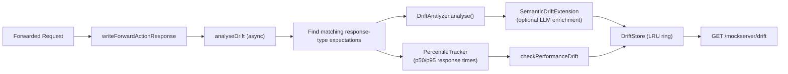

# Mock Drift Detection

## Overview

Mock drift detection identifies structural discrepancies between forwarded (real) upstream responses and stub expectations configured in MockServer. When a request is forwarded through the proxy and there are also response-type stub expectations matching the same request, MockServer compares the real response against each stub to surface drifts -- fields added or removed, type changes, status code mismatches, and header differences.

This helps teams detect when a real service has evolved in ways that their stubs no longer reflect, preventing silent test regressions.

## Architecture



### Key Components

| Component | Location | Responsibility |
|-----------|----------|---------------|
| `DriftType` | `mock/drift/DriftType.java` | Enum of drift categories (STATUS, SCHEMA_FIELD_ADDED, etc.) |
| `DriftRecord` | `mock/drift/DriftRecord.java` | Single drift observation with expectation ID, field, expected/actual values, confidence, timestamp |
| `DriftStore` | `mock/drift/DriftStore.java` | Thread-safe LRU-capped store (max 1000 entries) of drift records |
| `DriftAnalyzer` | `mock/drift/DriftAnalyzer.java` | Compares real response vs stub response; emits DriftRecords |
| `SemanticSeverity` | `mock/drift/SemanticSeverity.java` | Enum: BREAKING, WARNING, INFORMATIONAL |
| `SemanticDriftExtension` | `mock/drift/SemanticDriftExtension.java` | LLM-powered severity classification of drift records |
| `PercentileTracker` | `mock/drift/PercentileTracker.java` | Sliding-window p50/p95 response time tracker per expectation |

### Drift Categories

| DriftType | Description | Confidence |
|-----------|-------------|------------|
| `STATUS` | HTTP status code differs | 1.0 |
| `SCHEMA_FIELD_ADDED` | JSON field present in real but not stub | 0.9 |
| `SCHEMA_FIELD_REMOVED` | JSON field present in stub but not real | 0.95 |
| `SCHEMA_TYPE_CHANGED` | JSON field type changed (e.g. integer to string) | 0.95 |
| `HEADER_ADDED` | HTTP header present in real but not stub | 0.9 |
| `HEADER_REMOVED` | HTTP header present in stub but not real | 0.9 |
| `HEADER_CHANGED` | HTTP header value changed | 0.85 |
| `PERFORMANCE` | p95 response time exceeds threshold | 0.8 |

### JSON Schema Comparison

Schema drift leverages `StructuralShapeDiff` from `org.mockserver.llm.drift`, which compares two JSON documents by shape (field paths and value types) ignoring values. This catches structural changes like new/removed fields and type changes without flagging benign value differences.

### Skipped Headers

Non-semantic headers that change per-request are excluded from drift analysis: `date`, `x-request-id`, `content-length`, `transfer-encoding`, `connection`, `keep-alive`, `server`.

## Integration Points

### Hook in HttpActionHandler

Drift analysis is triggered asynchronously in `HttpActionHandler.writeForwardActionResponse()` after the upstream response is received but before it is written back to the client. The `analyseDrift()` method:

1. Looks up all expectations matching the original request via `HttpState.allMatchingExpectation()`
2. Filters to those with response-type actions (stubs)
3. Passes each stub expectation + real response to `DriftAnalyzer.analyse()`

The analysis runs on a scheduler thread and never blocks the response path.

### Reset Integration

`DriftStore.getInstance().clear()` is called during `HttpState.reset()`, alongside all other registry resets.

## REST API

### PUT /mockserver/baseline/compare

Compares two sets of expectations offline and returns a structured drift report. This is the batch/CI counterpart to the runtime `GET /mockserver/drift` endpoint — it never touches live traffic and requires no proxy setup.

**Request body:**
```json
{
  "baseline": [ <expectations> ],
  "current":  [ <expectations> ]
}
```

`current` is optional. When omitted, MockServer uses `requestMatchers.retrieveActiveExpectations(null)` — the live active expectations.

**Response (HTTP 200):**
```json
{
  "hasDrift": true,
  "added": [
    { "key": "POST /api/orders", "requestDiffs": [], "responseDiffs": [] }
  ],
  "removed": [
    { "key": "DELETE /api/users/{id}", "requestDiffs": [], "responseDiffs": [] }
  ],
  "changed": [
    {
      "key": "GET /api/users",
      "requestDiffs": [],
      "responseDiffs": [
        {
          "field": "response.body.role",
          "diffType": "REMOVED",
          "expectedValue": "string"
        }
      ]
    }
  ]
}
```

**Error responses:** `400 Bad Request` for empty body, invalid JSON, or missing `baseline` field.

#### BaselineDiffer — key components

| Class | Location | Responsibility |
|-------|----------|---------------|
| `BaselineDiffer` | `mock/diff/BaselineDiffer.java` | Entry point; indexes interactions by request key; delegates to `TrafficDiffEngine` for request diffs and `diffResponseStructure()` for response diffs |
| `BaselineDiffReport` | `mock/diff/BaselineDiffReport.java` | Report root: `hasDrift` flag + `added`/`removed`/`changed` lists |
| `InteractionDiff` | `mock/diff/InteractionDiff.java` | Single entry in a report bucket; carries the matching `key` and optional `requestDiffs`/`responseDiffs` lists |
| `FieldDiff` | `mock/diff/FieldDiff.java` | Single field-level difference: `field` path, `diffType` (`ADDED`/`REMOVED`/`CHANGED`), `expectedValue`, `actualValue` |
| `TrafficDiffEngine` | `mock/diff/TrafficDiffEngine.java` | Request-side structural diff (method, path, headers, query, body, cookies) |

#### Matching key and normalization

`BaselineDiffer.requestKey(HttpRequest)` produces `METHOD normalized-path`. Method is upper-cased; a single trailing slash is stripped from the path (but `"/"` is preserved). Trailing-slash-only differences in the path are filtered out after matching to prevent false positives.

#### Value-insensitive JSON response body diffing

`diffBodyShape()` in `BaselineDiffer` recursively walks two JSON trees. Only the following count as drift:

- A field present in one tree but absent in the other
- A node whose JSON type changed (object, array, number, boolean, string, null)

A different value at the same field with the same type is **not** drift (e.g. `"name": "Alice"` vs `"name": "Bob"`). All numeric subtypes (int, long, double) collapse to `"number"` so `1` vs `1.5` are the same shape.

Non-JSON bodies fall back to exact-string comparison.

#### Status code and header diffing

Status code is compared as a string. Response headers are lowercased, values are comma-joined for multi-value headers, and added/removed/changed headers are each reported as separate `FieldDiff` entries under `response.header.<name>`.

### GET /mockserver/drift

Returns recent drift records.

**Query Parameters:**
- `expectationId` (optional) -- filter by expectation ID
- `limit` (optional, default 50, max 500) -- maximum number of records to return

**Response:**
```json
{
  "count": 2,
  "drifts": [
    {
      "expectationId": "abc-123",
      "driftType": "STATUS",
      "field": "statusCode",
      "expectedValue": "200",
      "actualValue": "422",
      "confidence": 1.0,
      "epochTimeMs": 1717145600000
    },
    {
      "expectationId": "abc-123",
      "driftType": "SCHEMA_FIELD_ADDED",
      "field": "$.newField",
      "actualValue": null,
      "confidence": 0.9,
      "epochTimeMs": 1717145600000
    }
  ]
}
```

### PUT /mockserver/drift/clear

Clears all drift records.

**Response:**
```json
{"status": "cleared"}
```

## Semantic Drift Detection (F11)

When `mockserver.driftSemanticAnalysisEnabled=true` and a runtime LLM backend is configured, structural drift records are enriched with LLM-classified severity and explanations.

### How it works

1. `DriftAnalyzer` collects structural drift records into a list (status, header, schema drifts).
2. If a `SemanticDriftExtension` is installed, it sends the drift records along with truncated stub/real response bodies to the LLM.
3. The LLM classifies each drift as **BREAKING**, **WARNING**, or **INFORMATIONAL** and provides a one-sentence explanation.
4. The enriched records are then stored in the `DriftStore`.

### Components

| Component | Location | Responsibility |
|-----------|----------|---------------|
| `SemanticSeverity` | `mock/drift/SemanticSeverity.java` | Enum: BREAKING, WARNING, INFORMATIONAL |
| `SemanticDriftExtension` | `mock/drift/SemanticDriftExtension.java` | Builds LLM prompt, calls `LlmCompletionService`, parses response |
| `PercentileTracker` | `mock/drift/PercentileTracker.java` | Sliding-window p50/p95 response time tracker per expectation |

### Semantic fields on DriftRecord

`DriftRecord` has two optional fields:
- `semanticSeverity` — the LLM-assigned severity (null when semantic analysis is off)
- `semanticExplanation` — one-sentence explanation from the LLM (null when off)

### Fail-soft behaviour

Semantic enrichment is best-effort. If the LLM is unavailable, times out, or returns unparseable output, the drift records are stored with their original structural-only data. No exceptions propagate to the drift pipeline.

## Performance Drift Detection

When `mockserver.driftResponseTimeThresholdMs` is set to a positive value, MockServer tracks response times per expectation using a sliding-window `PercentileTracker` (default window size: 100 observations). If the p95 response time exceeds the threshold, a `PERFORMANCE` drift record is emitted.

### PercentileTracker

- Fixed-size circular buffer per expectation ID (default 100 slots)
- Thread-safe via `ConcurrentHashMap.compute()`
- Provides `p50()` and `p95()` queries
- Cleared when `DriftStore.clear()` is called

### Configuration

| Property | Default | Description |
|----------|---------|-------------|
| `mockserver.driftSemanticAnalysisEnabled` | `false` | Enable LLM-powered semantic drift classification |
| `mockserver.driftResponseTimeThresholdMs` | `0` (disabled) | p95 response time threshold for PERFORMANCE drift |

## Thread Safety

`DriftStore` uses a `ReadWriteLock` for concurrent access. The deque-based storage provides O(1) insertion and oldest-eviction with a configurable capacity (default 1000 entries). `PercentileTracker` uses `ConcurrentHashMap.compute()` for atomic per-key updates.
