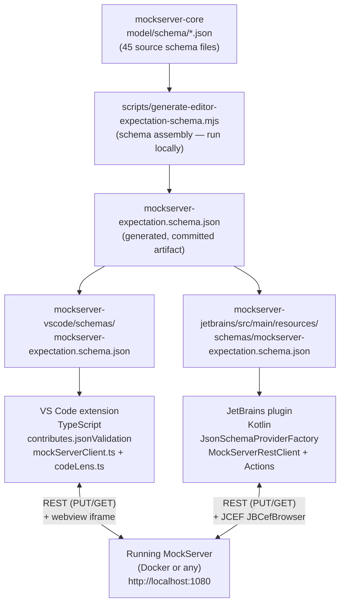

# Editor Extensions (VS Code + JetBrains)

Two IDE extensions bring MockServer controls into VS Code and JetBrains IDEs.
Both publish the server's own JSON Schema for `*.mockserver.json` validation and
talk to a running MockServer over REST. There is **no Language Server**: both
editors' built-in JSON engines handle validation, completion, and hover from the
schema alone. The design spec is at
[docs/plans/editor-extensions-value-roadmap.md](../plans/editor-extensions-value-roadmap.md).

Key facts:
- VS Code: TypeScript, published to VS Code Marketplace and Open VSX (publisher id `mockserver`).
- JetBrains: Kotlin, targets `platformType=IC` (IntelliJ Community) since build `243` (2024.3).
- Shared artifact: a generated `mockserver-expectation.schema.json` (draft-07, self-contained), one copy bundled in each extension.
- Docker image tag defaults to the extension's own version at runtime — never a hardcoded constant.
- Marketplace branding: VS Code ships `media/icon.png` (128×128, generated from `media/icon.svg`); JetBrains ships `META-INF/pluginIcon.svg` (+ `pluginIcon_dark.svg`). Both are the teal "M" mark on a dark slate (`#1e1e1e`) rounded square.

## Architecture Overview



The schema is a **committed artifact** regenerated by running
`node scripts/generate-editor-expectation-schema.mjs` whenever `mockserver-core`
schemas change. It is not auto-regenerated in CI.

## Feature Inventory

| Feature | VS Code command(s) | JetBrains action id(s) | REST endpoint |
|---------|-------------------|----------------------|---------------|
| Schema validation/completion/hover | `contributes.jsonValidation` (automatic) | `MockServerSchemaProviderFactory` (automatic) | — |
| Load expectations | `mockserver.loadExpectations` | `MockServer.LoadExpectations` | `PUT /mockserver/expectation` |
| Diff against live | `mockserver.diffAgainstLive` | — | `PUT /mockserver/retrieve?type=active_expectations` |
| Record-to-code (recorded expectations) | `mockserver.saveRecorded` | `MockServer.SaveRecordedExpectations` | `PUT /mockserver/retrieve?type=recorded_expectations&format=json\|java` |
| Generate expectations from OpenAPI | `mockserver.generateFromOpenApi` | `MockServer.GenerateFromOpenApi` | `PUT /mockserver/openapi` |
| Send test request | `mockserver.sendRequest` | `MockServer.SendRequest` | `<spec.method> <spec.path>` on the server |
| View request log | `mockserver.viewRequestLog` | — | `PUT /mockserver/retrieve?type=requests&format=json` |
| Show drift report | `mockserver.showDrift` | `MockServer.ShowDriftReport` | `GET /mockserver/drift` |
| Drift inline diagnostics | `mockserver.showDriftDiagnostics` | — (VS Code only) | `GET /mockserver/drift` |
| Find requests by trace | `mockserver.findByTrace` | `MockServer.FindByTrace` | `PUT /mockserver/retrieve?type=requests&format=json` (client-side filter) |
| Reset server | `mockserver.reset` | `MockServer.Reset` | `PUT /mockserver/reset` |
| Upload WASM module | `mockserver.uploadWasm` | `MockServer.UploadWasm` | `PUT /mockserver/wasm/modules?name=<name>` |
| List WASM modules | `mockserver.listWasm` | `MockServer.ListWasm` | `GET /mockserver/wasm/modules` |
| Open dashboard (browser) | `mockserver.openDashboard` | `MockServer.OpenDashboard` | browser → `/mockserver/dashboard` |
| Open dashboard (docked in-IDE) | `mockserver.openDashboardInEditor` (reveals the docked Panel webview) | `MockServer.OpenDashboardInIde` | webview/JCEF → `/mockserver/dashboard` |
| Start Docker container | `mockserver.start` | `MockServer.StartDocker` | `docker run` subprocess |
| Stop Docker container | `mockserver.stop` | — (VS Code only) | `docker stop` subprocess |
| Settings (port, image, container name) | `mockserver.*` workspace config | `Settings \| Tools \| MockServer` | — |

Notes:
- "Diff against live" and "Stop Docker" are VS Code-only features at current implementation.
- "Save Recorded Expectations" offers a JSON / Java DSL format choice in **both** extensions.
- Drift inline diagnostics map `DriftRecord.expectationId` to a line in the open `.mockserver.json` file; this requires an open editor with the expectation file and is VS Code-specific.
- "Find by trace" retrieves the full request log then filters client-side by W3C `traceparent` header.

## VS Code Extension

**Location:** `mockserver-vscode/`

**Language/runtime:** TypeScript, compiled to `out/extension.js`.

**Entry point:** `src/extension.ts` — `activate()` registers all commands, CodeLens providers, the status-bar item, and the `mockserver-live` virtual document scheme.

**Activation:** `activationEvents` is `["onStartupFinished"]` — this is required, not optional. The status-bar item and the CodeLens providers are created in `activate()`, so without a startup activation event they would not appear until the user first invoked a command from the palette (commands themselves get implicit `onCommand:` activation). `onStartupFinished` defers activation until the window is interactive, so the passive surfaces light up with negligible startup cost.

### Key components

| File | Role |
|------|------|
| `src/extension.ts` | Activation, command handlers, Docker subprocess calls, status bar, and view registration (Actions tree + docked dashboard reveal via `mockserver.dashboard.focus`) |
| `src/mockServerClient.ts` | REST client; free of the `vscode` API so it is unit-testable. Takes an injectable `FetchLike` so tests run without a live server |
| `src/codeLens.ts` | `ExpectationCodeLensProvider` (top of `*.mockserver.json(c)`) + `ScratchRequestCodeLensProvider` (top of `*.mockserver-request.json`) |
| `src/actionsView.ts` | `MockServerActionsProvider` (`TreeDataProvider`) backing the Activity Bar **Actions** view — a status leaf (`MockServer · localhost:<port>`) plus grouped action leaves (Server / Author / Inspect / WASM), each running an existing command. Takes an injected `getPort` so refresh re-reads the port |
| `src/dashboardView.ts` | `MockServerDashboardViewProvider` (`WebviewViewProvider`) backing the docked Panel **Dashboard** view; reuses `client.buildDashboardWebviewHtml(...)` |
| `schemas/mockserver-expectation.schema.json` | Generated schema, wired via `contributes.jsonValidation` to `*.mockserver.json` and `*.mockserver.jsonc` |
| `snippets/expectation.json` | Code snippets, contributed for both `json` and `jsonc` languages |
| `media/icon.png` / `media/icon.svg` | Marketplace icon (PNG, wired via `package.json` `icon`) and its SVG source |
| `media/activitybar.svg` | Monochrome (`currentColor`) M glyph for the Activity Bar / Panel view containers — the themed `mockserver.svg` can't recolor in those slots |

### Discoverability surfaces (IntelliJ-style)

Beyond the command palette, the extension exposes its commands through:
- A **MockServer Activity Bar view container** (`viewsContainers.activitybar` id `mockserver`, icon `media/activitybar.svg`) holding the `mockserver.actions` **TreeView** — a status leaf (`MockServer · localhost:<port>`, click reveals the docked dashboard) and collapsible groups **Server / Author / Inspect / WASM** whose leaves each run an existing command. This is the idiomatic VS Code analogue of the JetBrains tool-window buttons. `view/title` icon buttons (Start, Open Dashboard, Reset, Refresh) sit on the view's title bar; `mockserver.refreshView` fires the tree's change event to re-read the port.
- A **status-bar item** (`$(server) MockServer :<port>`) whose click runs `mockserver.statusBarMenu` — an internal command (registered but deliberately **not** in `contributes.commands`) showing a quick pick of Open Dashboard / Start / Stop / View Request Log.
- **`contributes.menus`**: file-scoped commands appear in the editor title bar and right-click menu gated by `when` clauses on `resourceFilename` (`*.mockserver.json(c)` → Load / Diff / drift; `*.mockserver-request.json` → Send Test Request), and the same `when` clauses hide those file-scoped commands from the palette when no matching editor is active.

### Docked dashboard

The live dashboard is a **`WebviewView` docked in the bottom Panel** (`viewsContainers.panel` id `mockserverDashboard` → view `mockserver.dashboard`, `"type": "webview"`), so it gets full editor width and is not mixed in with editor tabs — the analogue of the JetBrains JCEF dashboard tool window. `MockServerDashboardViewProvider.resolveWebviewView` sets `enableScripts` and the html from `client.buildDashboardWebviewHtml(...)` (a full-bleed `<iframe>` at `http://localhost:<port>/mockserver/dashboard`; the CSP allows `frame-src http://localhost:*`/127.0.0.1), registered with `retainContextWhenHidden: true`. `mockserver.openDashboardInEditor` (title "MockServer: Open Dashboard") now **reveals** this docked view via `mockserver.dashboard.focus` rather than opening an editor tab; `mockserver.openDashboard` still opens the external browser.

### JSONC support

Expectation files may use `.mockserver.jsonc` with comments and trailing commas. The client uses `jsonc-parser` (a runtime dependency, NOT a dev dependency) to parse them. The `.vscodeignore` must therefore NOT blanket-ignore `node_modules/` — `vsce` bundles production dependencies and prunes dev ones. If `node_modules/**` were ignored, the extension would fail at runtime with "Cannot find module 'jsonc-parser'".

### Settings

Read fresh on every use from `vscode.workspace.getConfiguration("mockserver")`:

| Setting | Default | Notes |
|---------|---------|-------|
| `mockserver.dockerImage` | `mockserver/mockserver:<extension-version>` | Blank = derive from extension version |
| `mockserver.containerName` | `mockserver-vscode` | Container started/stopped by the extension |
| `mockserver.port` | `1080` | Host port; also used for dashboard URL |

## JetBrains Plugin

**Location:** `mockserver-jetbrains/`

**Language:** Kotlin, compiled against IntelliJ Platform `2024.3` (`IC`), since build `243`, until build `253.*`.

**Build:** Gradle (`build.gradle.kts`) using the IntelliJ Platform Gradle Plugin 2.16. Requires Gradle 9.5.1+ (provided by the Gradle wrapper). JVM toolchain: 17.

**Plugin id:** `com.mock-server.mockserver`

### Key components

| File | Role |
|------|------|
| `MockServerRestClient.kt` | REST client using `java.net.http.HttpClient` (JDK 11+). Free of IntelliJ platform APIs: pure request builders (`build*Request`) plus a thin `send()` wrapper. Must never run on the EDT |
| `MockServerSchemaProviderFactory.kt` | Implements `JsonSchemaProviderFactory`; associates the bundled schema with `*.mockserver.json` / `*.mockserver.jsonc` files via `SchemaType.embeddedSchema` |
| `MockServerToolWindowFactory.kt` | Bottom tool window ("MockServer"): a `localhost:<port>` status line, an inline **Port** field (commits on Enter / focus-loss, validates 1–65535, writes back to `MockServerSettings.state.port` and refreshes the status line; reverts on invalid), bold section headers, and every action as an icon button, invoking registered actions via `ActionManager.getAction(id)` + `ActionUtil.invokeAction(...)` with a `SimpleDataContext` carrying the project and selected editor. Actions read the port at click time (`effectivePort()`), so they pick up an edited port without restart; the already-loaded JCEF dashboard reflects a port change only when next reopened |
| `MockServerDashboardToolWindowFactory.kt` | Right-side tool window ("MockServerDashboard"): embeds `JBCefBrowser` when JCEF (`JBCefApp.isSupported()`) is available; degrades to a fallback panel with an external-browser button when not. A `CefLoadHandler.onLoadError` swaps in a friendly "no MockServer running" panel (with a retry link) on a real load failure |
| `MockServerEdt.kt` | Shared `runOnEdt(project, block)` helper — posts UI work back to the EDT via `invokeLater(block, defaultModalityState) { project.isDisposed }`, so a result delivered after the project/tool-window closes is dropped instead of throwing `AlreadyDisposedException`. Every background action uses this single helper |
| `MockServerSettings.kt` | Application-level service (`@Service(APP)`, persisted to `mockserver.xml`). Exposes `effectiveImage()`, `effectivePort()`, `effectiveContainerName()`, `dashboardUrl()` |
| `MockServerConfigurable.kt` | Settings UI under `Settings \| Tools \| MockServer` |
| `LoadExpectationsAction.kt` | Representative action: reads the active editor document, validates it, runs `Task.Backgroundable` for the HTTP call, posts result notification on EDT via `invokeLater` |
| `src/main/resources/META-INF/plugin.xml` | Action group under `ToolsMenu` — actions carry `AllIcons` icons and are grouped with `<separator>`s (Server / Editor / WASM); two tool window registrations; schema provider extension point |
| `src/main/resources/META-INF/pluginIcon.svg` / `pluginIcon_dark.svg` | Marketplace plugin icon (rendered directly from SVG by JetBrains) |

### EDT discipline

All `MockServerRestClient.send(...)` calls **block** on the network and must run on a background thread. Actions use `Task.Backgroundable` (which shows a cancellable progress indicator) and marshal UI work back through the shared `runOnEdt(project) { ... }` helper in `MockServerEdt.kt`, which wraps `invokeLater` with a `project.isDisposed` expiry condition (so a late result after the project closes is dropped, not thrown). The tool window buttons invoke actions via `ActionUtil.invokeAction(...)`, which handles threading internally.

### JCEF dashboard

The dashboard tool window uses `JBCefBrowser(dashboardUrl)`. The browser's native Chromium process is registered with `Disposer.register(toolWindow.disposable, browser)` so it is released when the tool window closes. The `JBCefApp.isSupported()` guard means the embedded dashboard works only with the JetBrains-bundled JRE; remote/headless environments fall back gracefully. A `CefLoadHandler.onLoadError` (ignoring `ERR_NONE`/`ERR_ABORTED`) replaces the page with a dark-themed "No MockServer running on localhost:&lt;port&gt;" panel and a retry link when the server is unreachable, instead of showing a raw Chromium `ERR_CONNECTION_REFUSED` page.

### Settings

Stored in `mockserver.xml` via `PersistentStateComponent`:

| Field | Default | Notes |
|-------|---------|-------|
| `dockerImage` | `mockserver/mockserver:<plugin-version>` | Blank = derive from plugin version |
| `containerName` | `mockserver-ide` | Container started by the extension |
| `port` | `1080` | Used for all REST calls and dashboard URL |

## Shared Schema Generation

**Script:** `scripts/generate-editor-expectation-schema.mjs`

The `mockserver-core` JSON Schema set consists of ~45 cross-referencing files under
`mockserver/mockserver-core/src/main/resources/org/mockserver/model/schema/`. The
server assembles them at runtime in
`org.mockserver.validator.jsonschema.JsonSchemaValidator#addReferencesIntoSchema`.
An editor needs one self-contained document, so the script performs the same
assembly ahead of time.

What the script does:

1. Reads `expectation.json` (the root schema) and every file listed in `REFERENCE_FILES` — this list mirrors `JsonSchemaExpectationValidator`'s reference list exactly.
2. Hoists all nested `definitions` from each reference file to the top level (matching `addReferencesIntoSchema`).
3. Builds the root as a concrete **object/array union** that accepts either a single expectation or an array (initialization-JSON form): `type: ["object","array"]` with the expectation's `properties`/`additionalProperties`/`anyOf` inlined for the object form and `items`/`minItems` for the array form. It is deliberately **NOT** a root `oneOf` of `$ref`s — IntelliJ's JSON-schema engine cannot provide completion or validation through a root `oneOf` reached only via `$ref` (it can't pick a branch), so a `oneOf` root silently breaks autocompletion and error highlighting in the JetBrains plugin (VS Code handles it either way). The object-only and array-only keywords never interfere, and the `required`-based `anyOf` branches are satisfied vacuously by array instances.
4. Rewrites every `$ref: "#/definitions/draft-07"` to the canonical URI `http://json-schema.org/draft-07/schema#`. The `draft-07` meta-schema is deliberately **not** bundled: its `$id` would collide with validators' built-in draft-07, and its internal `"$ref": "#"` self-reference would re-root to the bundle.
5. Runs two self-checks: (a) every `#/definitions/X` reference in the bundle must resolve — catches drift if the Java validator's reference list changes without updating `REFERENCE_FILES`; and (b) the root must stay IntelliJ-navigable (a concrete object root with inline `properties`, never a bare `oneOf`) — catches a regression to the broken root shape.
6. Writes the result to both `mockserver-vscode/schemas/` and `mockserver-jetbrains/src/main/resources/schemas/`.

**When to re-run:** whenever any schema file under `mockserver-core/.../schema/` changes, or when `JsonSchemaExpectationValidator`'s reference list changes. The generated file is committed; it is not auto-regenerated in CI.

```bash
node scripts/generate-editor-expectation-schema.mjs
```

## Build, Test, and CI

### VS Code

```bash
cd mockserver-vscode
npm ci
npm run compile          # tsc
npm test                 # node ./out/test/extension.test.js
npm run generate-schema  # regenerate the schema (runs the mjs script)
npm run package          # vsce package → .vsix
```

`vscode:prepublish` runs `generate-schema` then `compile`, so the schema is always current in published packages.

### JetBrains

```bash
cd mockserver-jetbrains
./gradlew test           # JUnit 5; tests cover MockServerRestClient and helpers (no IDE required)
./gradlew buildPlugin    # produces build/distributions/*.zip
./gradlew runIde         # sandbox IDE with the plugin loaded
```

### Buildkite pipeline

Pipeline: `.buildkite/pipeline-editors.yml`

| Step | Image | What it does |
|------|-------|-------------|
| VS Code compile + test | `node:20` | `npm ci && npm run compile && npm test`; `node_modules/` is removed inside the container on exit to avoid root-owned files breaking the next checkout |
| JetBrains plugin tests | `eclipse-temurin:17-jdk` | Copies the project to `/tmp/jb` (avoids root-owned Gradle outputs in the workspace), then `./gradlew test --no-daemon`; marked `soft_fail: true` |

The JetBrains step runs as root and copies to `/tmp` to avoid a known `elastic-ci-stack` issue: Gradle + the IntelliJ Platform Gradle Plugin write `build/`, `.gradle/`, `.kotlin/`, and `.intellijPlatform/` as root, and those directories prevent the next build's git checkout from cleaning the workspace.

### Local test harness

```bash
scripts/try-editor-extensions.sh            # VS Code Extension Development Host
scripts/try-editor-extensions.sh jetbrains  # JetBrains sandbox IDE (./gradlew runIde)
scripts/try-editor-extensions.sh both
scripts/try-editor-extensions.sh --install  # package + install into real VS Code
scripts/try-editor-extensions.sh --no-server --port 9090
```

The script starts a `mockserver-try` Docker container (unless `--no-server`), creates a demo workspace under `.tmp/editor-demo/` with `demo.mockserver.json` and `petstore.openapi.json`, and opens the workspace so schema validation and CodeLens are active immediately.

## Gotchas

| Gotcha | Detail |
|--------|--------|
| `Icon?` gitignore rule | The repo `.gitignore` has a rule that matches `Icon?` (macOS resource-fork files); `mockserver-jetbrains/src/main/resources/icons/` contains `mockserver.svg` and `mockserver_dark.svg`. If these files appear missing after a fresh clone on macOS, force-add them: `git add -f mockserver-jetbrains/src/main/resources/icons/` |
| `.vscodeignore` must not exclude `node_modules` | `jsonc-parser` is a runtime (production) dependency shipped in the `.vsix`. A blanket `node_modules/**` ignore would drop it and break the extension at runtime with "Cannot find module". `vsce` prunes dev dependencies automatically — only production deps need to ship |
| WASM body matcher field name is `moduleName` | The expectation JSON body matcher for a WASM custom rule uses `{ "type": "WASM", "moduleName": "<name>" }` — the `WasmBodyDTO` field and both server deserializers use `moduleName`, NOT `wasm`/`wasmBody`. Both extensions' upload UI and docs reflect this; keep any new copy in step |
| JetBrains tool-window buttons use `ActionUtil.invokeAction` | Buttons in `MockServerToolWindowFactory` look up the registered `AnAction` by id via `ActionManager.getInstance().getAction(actionId)` and fire it with `ActionUtil.invokeAction(action, dataContext, ...)`. This reuses each action's own validation, notifications, and threading — do not call the action's REST logic directly from the button handler. The 5-arg data-context overload is `@Suppress("DEPRECATION")`-annotated: on platform `243` every non-deprecated replacement requires `ActionUiKind` (a later-platform API), so the migration is deferred until the minimum platform is raised |
| Schema must be regenerated after `mockserver-core` changes | The committed schema in both extensions is a snapshot. After any change to `mockserver-core/.../schema/*.json` or to `JsonSchemaExpectationValidator`'s reference list, run `node scripts/generate-editor-expectation-schema.mjs` and commit the updated files in both extensions |
| JetBrains `soft_fail` in CI | The JetBrains test step has `soft_fail: true` in `pipeline-editors.yml`. A failing JetBrains step does not block the build — check Buildkite manually if JetBrains tests become relevant to a change |
| JetBrains Marketplace renders `<description>`, NOT the README | The JetBrains Marketplace page is built from the `<description>` HTML (limited subset: `<p>`, `<ul>`, `<li>`, `<b>`, `<em>`, `<a>`, `<br>` — no ``/`<code>`/`<style>`) inside `plugin.xml`, not `mockserver-jetbrains/README.md`. Marketing copy must live in the `<description>`; screenshots/GIFs are uploaded separately in the Marketplace UI. The VS Code Marketplace and Open VSX, by contrast, render `mockserver-vscode/README.md` verbatim (images/GIFs allowed). When updating the pitch, update BOTH surfaces |
| Screenshot assets live in three places | The IntelliJ screenshots are committed at `mockserver-jetbrains/docs/screenshots/*.png` (raw — rendered in the GitHub/plugin README) AND copied to `jekyll-www.mock-server.com/images/intellij_*.png` (raw — rendered on the `mock_server/ide_extensions.html` website page; both surfaces get a frame from the `.ui_image` CSS class, so the committed images stay raw). For the JetBrains Marketplace gallery (which has NO CSS), ready-to-upload **framed** copies — rounded corners + equal padding baked in — live in `mockserver-jetbrains/docs/screenshots/marketplace/`, regenerated from the raw screenshots by `mockserver-jetbrains/docs/make-marketplace-screenshots.py <src-dir> <out-dir>` (Pillow). JetBrains Marketplace screenshots are NOT taken from the repo automatically — they must be uploaded manually in the Marketplace UI |
| VS Code `activationEvents` must include `onStartupFinished` | The status-bar item and CodeLens providers are created in `activate()`. With an empty `activationEvents` they only appear after the first palette command runs (commands get implicit `onCommand:` activation). Keep `onStartupFinished` so the passive surfaces light up on a fresh window |
