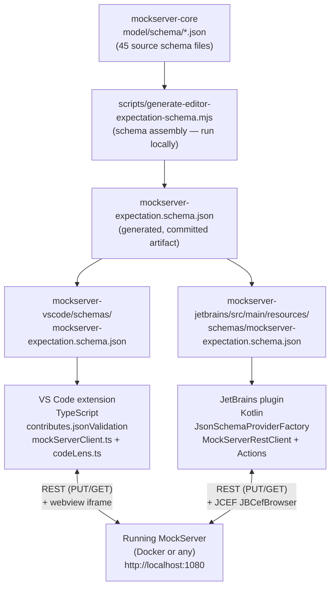

# Editor Extensions (VS Code + JetBrains)

Two IDE extensions bring MockServer controls into VS Code and JetBrains IDEs.
Both publish the server's own JSON Schema for `*.mockserver.json` validation and
talk to a running MockServer over REST. There is **no Language Server**: both
editors' built-in JSON engines handle validation, completion, and hover from the
schema alone. The design spec is at
[docs/plans/editor-extensions-value-roadmap.md](../plans/editor-extensions-value-roadmap.md).

Key facts:
- VS Code: TypeScript, published to VS Code Marketplace and Open VSX (publisher id `mockserver`).
- JetBrains: Kotlin, targets `platformType=IC` (IntelliJ Community) since build `243` (2024.3).
- Shared artifact: a generated `mockserver-expectation.schema.json` (draft-07, self-contained), one copy bundled in each extension.
- Docker image tag defaults to the extension's own version at runtime — never a hardcoded constant.

## Architecture Overview



The schema is a **committed artifact** regenerated by running
`node scripts/generate-editor-expectation-schema.mjs` whenever `mockserver-core`
schemas change. It is not auto-regenerated in CI.

## Feature Inventory

| Feature | VS Code command(s) | JetBrains action id(s) | REST endpoint |
|---------|-------------------|----------------------|---------------|
| Schema validation/completion/hover | `contributes.jsonValidation` (automatic) | `MockServerSchemaProviderFactory` (automatic) | — |
| Load expectations | `mockserver.loadExpectations` | `MockServer.LoadExpectations` | `PUT /mockserver/expectation` |
| Diff against live | `mockserver.diffAgainstLive` | — | `PUT /mockserver/retrieve?type=active_expectations` |
| Record-to-code (recorded expectations) | `mockserver.saveRecorded` | `MockServer.SaveRecordedExpectations` | `PUT /mockserver/retrieve?type=recorded_expectations&format=json\|java` |
| Generate expectations from OpenAPI | `mockserver.generateFromOpenApi` | `MockServer.GenerateFromOpenApi` | `PUT /mockserver/openapi` |
| Send test request | `mockserver.sendRequest` | `MockServer.SendRequest` | `<spec.method> <spec.path>` on the server |
| View request log | `mockserver.viewRequestLog` | — | `PUT /mockserver/retrieve?type=requests&format=json` |
| Show drift report | `mockserver.showDrift` | `MockServer.ShowDriftReport` | `GET /mockserver/drift` |
| Drift inline diagnostics | `mockserver.showDriftDiagnostics` | — (VS Code only) | `GET /mockserver/drift` |
| Find requests by trace | `mockserver.findByTrace` | `MockServer.FindByTrace` | `PUT /mockserver/retrieve?type=requests&format=json` (client-side filter) |
| Reset server | `mockserver.reset` | `MockServer.Reset` | `PUT /mockserver/reset` |
| Upload WASM module | `mockserver.uploadWasm` | `MockServer.UploadWasm` | `PUT /mockserver/wasm/modules?name=<name>` |
| List WASM modules | `mockserver.listWasm` | `MockServer.ListWasm` | `GET /mockserver/wasm/modules` |
| Open dashboard (browser) | `mockserver.openDashboard` | `MockServer.OpenDashboard` | browser → `/mockserver/dashboard` |
| Open dashboard (in-editor) | `mockserver.openDashboardInEditor` | `MockServer.OpenDashboardInIde` | webview/JCEF → `/mockserver/dashboard` |
| Start Docker container | `mockserver.start` | `MockServer.StartDocker` | `docker run` subprocess |
| Stop Docker container | `mockserver.stop` | — (VS Code only) | `docker stop` subprocess |
| Settings (port, image, container name) | `mockserver.*` workspace config | `Settings \| Tools \| MockServer` | — |

Notes:
- "Diff against live" and "Stop Docker" are VS Code-only features at current implementation.
- Drift inline diagnostics map `DriftRecord.expectationId` to a line in the open `.mockserver.json` file; this requires an open editor with the expectation file and is VS Code-specific.
- "Find by trace" retrieves the full request log then filters client-side by W3C `traceparent` header.

## VS Code Extension

**Location:** `mockserver-vscode/`

**Language/runtime:** TypeScript, compiled to `out/extension.js`.

**Entry point:** `src/extension.ts` — `activate()` registers all commands, CodeLens providers, and the `mockserver-live` virtual document scheme.

### Key components

| File | Role |
|------|------|
| `src/extension.ts` | Activation, command handlers, Docker subprocess calls, webview panel management |
| `src/mockServerClient.ts` | REST client; free of the `vscode` API so it is unit-testable. Takes an injectable `FetchLike` so tests run without a live server |
| `src/codeLens.ts` | `ExpectationCodeLensProvider` (top of `*.mockserver.json(c)`) + `ScratchRequestCodeLensProvider` (top of `*.mockserver-request.json`) |
| `schemas/mockserver-expectation.schema.json` | Generated schema, wired via `contributes.jsonValidation` to `*.mockserver.json` and `*.mockserver.jsonc` |
| `snippets/expectation.json` | Code snippets for JSON expectations |

### In-editor dashboard

`mockserver.openDashboardInEditor` creates a `WebviewPanel` that renders a full-bleed `<iframe>` pointing at `http://localhost:<port>/mockserver/dashboard`. The Content-Security-Policy allows `frame-src http://localhost:*` so the iframe loads. The panel is a singleton — re-focusing it replaces the HTML rather than opening a second tab. The icon path is `media/mockserver.svg`.

### JSONC support

Expectation files may use `.mockserver.jsonc` with comments and trailing commas. The client uses `jsonc-parser` (a runtime dependency, NOT a dev dependency) to parse them. The `.vscodeignore` must therefore NOT blanket-ignore `node_modules/` — `vsce` bundles production dependencies and prunes dev ones. If `node_modules/**` were ignored, the extension would fail at runtime with "Cannot find module 'jsonc-parser'".

### Settings

Read fresh on every use from `vscode.workspace.getConfiguration("mockserver")`:

| Setting | Default | Notes |
|---------|---------|-------|
| `mockserver.dockerImage` | `mockserver/mockserver:<extension-version>` | Blank = derive from extension version |
| `mockserver.containerName` | `mockserver-vscode` | Container started/stopped by the extension |
| `mockserver.port` | `1080` | Host port; also used for dashboard URL |

## JetBrains Plugin

**Location:** `mockserver-jetbrains/`

**Language:** Kotlin, compiled against IntelliJ Platform `2024.3` (`IC`), since build `243`, until build `253.*`.

**Build:** Gradle (`build.gradle.kts`) using the IntelliJ Platform Gradle Plugin 2.16. Requires Gradle 9.5.1+ (provided by the Gradle wrapper). JVM toolchain: 17.

**Plugin id:** `com.mock-server.mockserver`

### Key components

| File | Role |
|------|------|
| `MockServerRestClient.kt` | REST client using `java.net.http.HttpClient` (JDK 11+). Free of IntelliJ platform APIs: pure request builders (`build*Request`) plus a thin `send()` wrapper. Must never run on the EDT |
| `MockServerSchemaProviderFactory.kt` | Implements `JsonSchemaProviderFactory`; associates the bundled schema with `*.mockserver.json` / `*.mockserver.jsonc` files via `SchemaType.embeddedSchema` |
| `MockServerToolWindowFactory.kt` | Bottom tool window ("MockServer"): every action as a button, invoking registered actions via `ActionManager.getAction(id)` + `ActionUtil.invokeAction(...)` with a `SimpleDataContext` carrying the project and selected editor |
| `MockServerDashboardToolWindowFactory.kt` | Right-side tool window ("MockServerDashboard"): embeds `JBCefBrowser` when JCEF (`JBCefApp.isSupported()`) is available; degrades to a fallback panel with an external-browser button when not |
| `MockServerSettings.kt` | Application-level service (`@Service(APP)`, persisted to `mockserver.xml`). Exposes `effectiveImage()`, `effectivePort()`, `effectiveContainerName()`, `dashboardUrl()` |
| `MockServerConfigurable.kt` | Settings UI under `Settings \| Tools \| MockServer` |
| `LoadExpectationsAction.kt` | Representative action: reads the active editor document, validates it, runs `Task.Backgroundable` for the HTTP call, posts result notification on EDT via `invokeLater` |
| `src/main/resources/META-INF/plugin.xml` | Action group under `ToolsMenu`, two tool window registrations, schema provider extension point |

### EDT discipline

All `MockServerRestClient.send(...)` calls **block** on the network and must run on a background thread. Actions use `Task.Backgroundable` (which shows a cancellable progress indicator) and marshal UI work back with `ApplicationManager.getApplication().invokeLater(...)`. The tool window buttons invoke actions via `ActionUtil.invokeAction(...)`, which handles threading internally.

### JCEF dashboard

The dashboard tool window uses `JBCefBrowser(dashboardUrl)`. The browser's native Chromium process is registered with `Disposer.register(toolWindow.disposable, browser)` so it is released when the tool window closes. The `JBCefApp.isSupported()` guard means the embedded dashboard works only with the JetBrains-bundled JRE; remote/headless environments fall back gracefully.

### Settings

Stored in `mockserver.xml` via `PersistentStateComponent`:

| Field | Default | Notes |
|-------|---------|-------|
| `dockerImage` | `mockserver/mockserver:<plugin-version>` | Blank = derive from plugin version |
| `containerName` | `mockserver-ide` | Container started by the extension |
| `port` | `1080` | Used for all REST calls and dashboard URL |

## Shared Schema Generation

**Script:** `scripts/generate-editor-expectation-schema.mjs`

The `mockserver-core` JSON Schema set consists of ~45 cross-referencing files under
`mockserver/mockserver-core/src/main/resources/org/mockserver/model/schema/`. The
server assembles them at runtime in
`org.mockserver.validator.jsonschema.JsonSchemaValidator#addReferencesIntoSchema`.
An editor needs one self-contained document, so the script performs the same
assembly ahead of time.

What the script does:

1. Reads `expectation.json` (the root schema) and every file listed in `REFERENCE_FILES` — this list mirrors `JsonSchemaExpectationValidator`'s reference list exactly.
2. Hoists all nested `definitions` from each reference file to the top level (matching `addReferencesIntoSchema`).
3. Wraps the root as a `oneOf` that accepts either a single expectation or an array — the initialization-JSON form.
4. Rewrites every `$ref: "#/definitions/draft-07"` to the canonical URI `http://json-schema.org/draft-07/schema#`. The `draft-07` meta-schema is deliberately **not** bundled: its `$id` would collide with validators' built-in draft-07, and its internal `"$ref": "#"` self-reference would re-root to the bundle.
5. Runs a self-check: every `#/definitions/X` reference in the bundle must resolve. This catches drift if the Java validator's reference list changes without updating the script.
6. Writes the result to both `mockserver-vscode/schemas/` and `mockserver-jetbrains/src/main/resources/schemas/`.

**When to re-run:** whenever any schema file under `mockserver-core/.../schema/` changes, or when `JsonSchemaExpectationValidator`'s reference list changes. The generated file is committed; it is not auto-regenerated in CI.

```bash
node scripts/generate-editor-expectation-schema.mjs
```

## Build, Test, and CI

### VS Code

```bash
cd mockserver-vscode
npm ci
npm run compile          # tsc
npm test                 # node ./out/test/extension.test.js
npm run generate-schema  # regenerate the schema (runs the mjs script)
npm run package          # vsce package → .vsix
```

`vscode:prepublish` runs `generate-schema` then `compile`, so the schema is always current in published packages.

### JetBrains

```bash
cd mockserver-jetbrains
./gradlew test           # JUnit 5; tests cover MockServerRestClient and helpers (no IDE required)
./gradlew buildPlugin    # produces build/distributions/*.zip
./gradlew runIde         # sandbox IDE with the plugin loaded
```

### Buildkite pipeline

Pipeline: `.buildkite/pipeline-editors.yml`

| Step | Image | What it does |
|------|-------|-------------|
| VS Code compile + test | `node:20` | `npm ci && npm run compile && npm test`; `node_modules/` is removed inside the container on exit to avoid root-owned files breaking the next checkout |
| JetBrains plugin tests | `eclipse-temurin:17-jdk` | Copies the project to `/tmp/jb` (avoids root-owned Gradle outputs in the workspace), then `./gradlew test --no-daemon`; marked `soft_fail: true` |

The JetBrains step runs as root and copies to `/tmp` to avoid a known `elastic-ci-stack` issue: Gradle + the IntelliJ Platform Gradle Plugin write `build/`, `.gradle/`, `.kotlin/`, and `.intellijPlatform/` as root, and those directories prevent the next build's git checkout from cleaning the workspace.

### Local test harness

```bash
scripts/try-editor-extensions.sh            # VS Code Extension Development Host
scripts/try-editor-extensions.sh jetbrains  # JetBrains sandbox IDE (./gradlew runIde)
scripts/try-editor-extensions.sh both
scripts/try-editor-extensions.sh --install  # package + install into real VS Code
scripts/try-editor-extensions.sh --no-server --port 9090
```

The script starts a `mockserver-try` Docker container (unless `--no-server`), creates a demo workspace under `.tmp/editor-demo/` with `demo.mockserver.json` and `petstore.openapi.json`, and opens the workspace so schema validation and CodeLens are active immediately.

## Gotchas

| Gotcha | Detail |
|--------|--------|
| `Icon?` gitignore rule | The repo `.gitignore` has a rule that matches `Icon?` (macOS resource-fork files); `mockserver-jetbrains/src/main/resources/icons/` contains `mockserver.svg` and `mockserver_dark.svg`. If these files appear missing after a fresh clone on macOS, force-add them: `git add -f mockserver-jetbrains/src/main/resources/icons/` |
| `.vscodeignore` must not exclude `node_modules` | `jsonc-parser` is a runtime (production) dependency shipped in the `.vsix`. A blanket `node_modules/**` ignore would drop it and break the extension at runtime with "Cannot find module". `vsce` prunes dev dependencies automatically — only production deps need to ship |
| WASM body matcher field name is `moduleName` | The expectation JSON body matcher for a WASM custom rule uses `{ "type": "WASM", "moduleName": "<name>" }`. The `mockServerClient.ts` JSDoc comment at line 644 incorrectly states `"wasm": "<name>"` — the `WasmBodyDTO` field and both the server deserializers use `moduleName`. `extension.ts` (line 576) is correct |
| JetBrains tool-window buttons use `ActionUtil.invokeAction` | Buttons in `MockServerToolWindowFactory` look up the registered `AnAction` by id via `ActionManager.getInstance().getAction(actionId)` and fire it with `ActionUtil.invokeAction(action, dataContext, ...)`. This reuses each action's own validation, notifications, and threading — do not call the action's REST logic directly from the button handler |
| Schema must be regenerated after `mockserver-core` changes | The committed schema in both extensions is a snapshot. After any change to `mockserver-core/.../schema/*.json` or to `JsonSchemaExpectationValidator`'s reference list, run `node scripts/generate-editor-expectation-schema.mjs` and commit the updated files in both extensions |
| JetBrains `soft_fail` in CI | The JetBrains test step has `soft_fail: true` in `pipeline-editors.yml`. A failing JetBrains step does not block the build — check Buildkite manually if JetBrains tests become relevant to a change |
