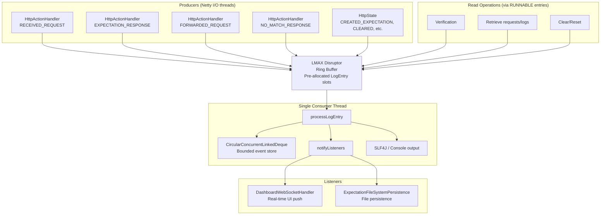
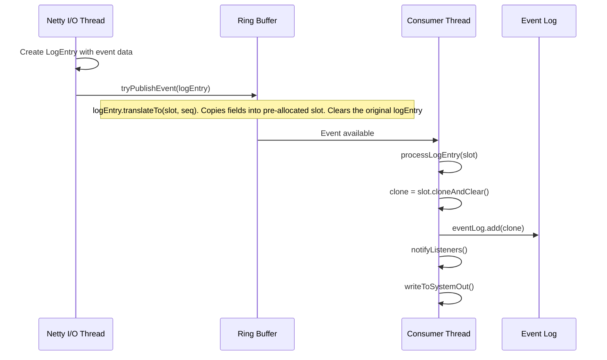
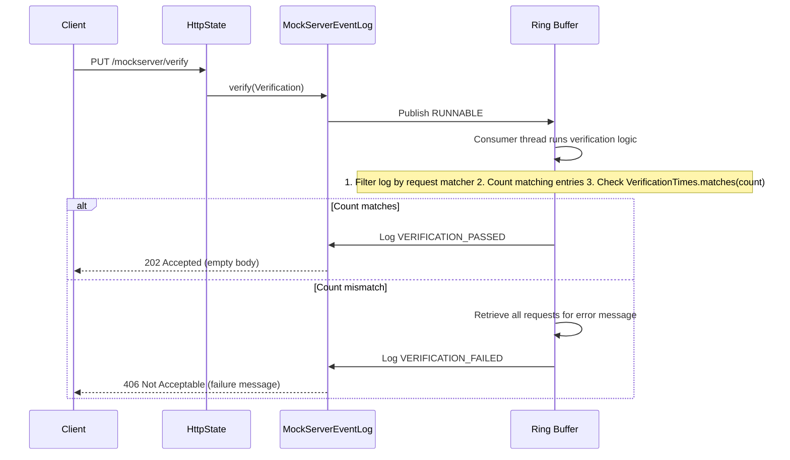
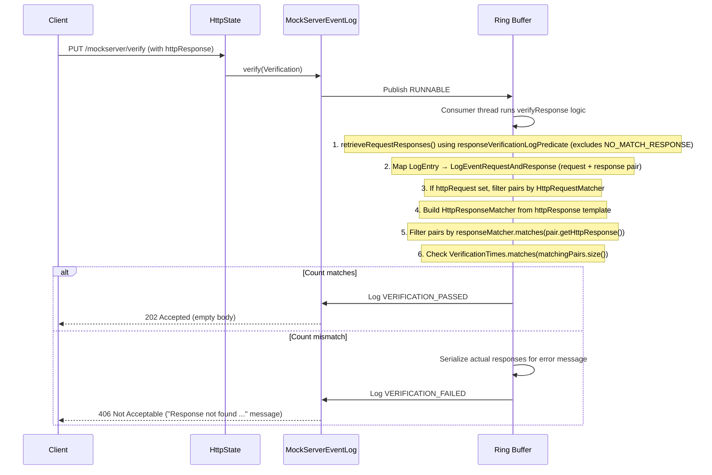
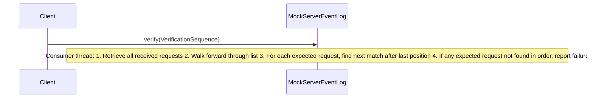
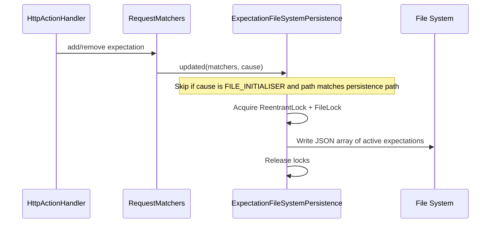
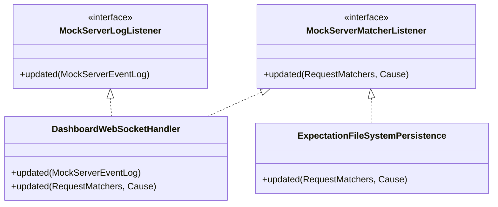

# Event System, Logging & Verification

## Architecture Overview

All events in MockServer -- received requests, matched expectations, forwarded requests, verification results -- flow through a high-performance LMAX Disruptor ring buffer. A single consumer thread serializes all reads and writes, eliminating the need for locks.



## LMAX Disruptor Integration

### Why Disruptor?

The Disruptor provides:
- **Lock-free publishing**: Multiple Netty I/O threads can publish events without contention
- **Single-writer principle**: One consumer thread processes all events, eliminating data races
- **Pre-allocated objects**: Ring buffer slots are pre-allocated `LogEntry` instances, reducing GC pressure
- **Backpressure**: `tryPublishEvent()` is non-blocking; if the ring buffer is full, low-priority events are dropped

### Ring Buffer Mechanics



### LogEntry as EventTranslator

`LogEntry` implements LMAX Disruptor's `EventTranslator<LogEntry>` interface. Its `translateTo()` method copies all fields from the source entry into the pre-allocated ring buffer slot, then clears the source. This avoids object allocation in the hot path.

### Serialized Read Operations

All read operations (verification, retrieval, clear, reset) are submitted as `RUNNABLE`-type `LogEntry` objects through the same ring buffer. This ensures that:

1. Reads see a consistent snapshot (no concurrent writes during iteration)
2. No locks are needed on the event log data structure
3. Operations are processed in FIFO order

```java
// Example: verify() publishes a RUNNABLE that runs on the consumer thread
disruptor.getRingBuffer().tryPublishEvent(
    new LogEntry()
        .setType(RUNNABLE)
        .setConsumer(() -> {
            // This runs on the single consumer thread
            List<LogEntry> matching = filterLog(predicate);
            future.complete(checkVerification(matching));
        })
);
```

## LogEntry

Each event is represented by a `LogEntry` with 25 possible types, organized into `LogMessageTypeCategory` groups for per-category log level overrides:

| Category Group | Types |
|----------------|-------|
| `MATCHING` | `EXPECTATION_MATCHED`, `EXPECTATION_NOT_MATCHED`, `NO_MATCH_RESPONSE` |
| `REQUEST_LIFECYCLE` | `RECEIVED_REQUEST`, `FORWARDED_REQUEST`, `EXPECTATION_RESPONSE`, `TEMPLATE_GENERATED` |
| `EXPECTATION_MANAGEMENT` | `CREATED_EXPECTATION`, `UPDATED_EXPECTATION`, `REMOVED_EXPECTATION`, `CLEARED` |
| `VERIFICATION` | `VERIFICATION`, `VERIFICATION_FAILED`, `VERIFICATION_PASSED`, `RETRIEVED` |
| `SERVER` | `SERVER_CONFIGURATION`, `AUTHENTICATION_FAILED`, `OPENAPI_RESPONSE_VALIDATION_FAILED` |
| `GENERAL` | `TRACE`, `DEBUG`, `INFO`, `WARN`, `ERROR`, `EXCEPTION` |
| (Internal) | `RUNNABLE` (used to serialize read operations through the ring buffer; excluded from categories) |

Users can override the log level per category or per individual type via the `logLevelOverrides` configuration property (a JSON map). Resolution order: individual type override > category group override > global `logLevel`. Overrides affect stdout/SLF4J output and the dashboard UI only; the event log stores entries based on the global `logLevel` threshold to preserve verification functionality. Note: overrides can only further suppress events that are already generated at the global `logLevel` — they cannot increase verbosity beyond the global threshold because events below the global level are never created or stored.

The `compactLogFormat` configuration property (default `false`) controls log output verbosity for stdout/SLF4J. When enabled, log messages use a compact single-line format showing summary information (e.g., `POST /path`, `200`, expectation ID) instead of full pretty-printed JSON. This only affects console output — the dashboard UI, verification, and REST API log retrieval continue to use the full structured format. The compact formatter is implemented in `StringFormatter.formatCompactLogMessage()` and called via `LogEntry.getCompactMessage()`, which is independent of the cached `getMessage()` used by the REST API.

### Key Fields

| Field | Type | Purpose |
|-------|------|---------|
| `id` | String | UUID (lazy-generated) |
| `correlationId` | String | Groups related entries (e.g., request + response) |
| `type` | LogMessageType | Event type (see above) |
| `httpRequests` | RequestDefinition[] | Associated requests |
| `httpResponse` | HttpResponse | Associated response |
| `expectation` | Expectation | Associated expectation |
| `expectationId` | String | ID of matched expectation |
| `epochTime` | long | Timestamp |
| `messageFormat` | String | Format string with `{}` placeholders |
| `arguments` | Object[] | Arguments for formatting |
| `deleted` | boolean | Soft-delete flag |

### Streamed Response Capture in FORWARDED_REQUEST

When MockServer proxies a streaming response (Server-Sent Events with `Content-Type: text/event-stream`) and `streamingResponsesEnabled` is `true`, the `FORWARDED_REQUEST` log entry is written **after the stream completes** rather than synchronously after `CompletableFuture.get()`. The entry is written from the stream-completion callback in `HttpActionHandler` once `LastHttpContent` arrives.

The `httpResponse` body in the log entry contains the bytes captured by `StreamingBody` (bounded to `maxStreamingCaptureBytes`, default 256 KB). Two additional headers may appear on the logged `httpResponse`:

| Header | Meaning |
|--------|---------|
| `x-mockserver-streamed: true` | Response was relayed incrementally (not buffered) |
| `x-mockserver-stream-truncated: true` | Captured body was truncated at `maxStreamingCaptureBytes`; the client received the full stream |

These headers are present only in the log entry — they are not sent to the client. The full stream always reaches the client regardless of the capture limit.

If the upstream connection closes mid-stream (`channelInactive`), the relay handler still emits a `FORWARDED_REQUEST` entry with the bytes captured so far, flagged with `x-mockserver-stream-truncated: true`.

## Event Log Storage

`CircularConcurrentLinkedDeque<LogEntry>` is a bounded, thread-safe deque. When capacity (`maxLogEntries`) is reached, the oldest entries are evicted and their `clear()` method is called (releasing references for GC).

### Filtering Predicates

Static predicates filter log entries for different retrieval operations:

| Predicate | Passes Types |
|-----------|-------------|
| `requestLogPredicate` | `RECEIVED_REQUEST` |
| `requestResponseLogPredicate` | `EXPECTATION_RESPONSE`, `NO_MATCH_RESPONSE`, `FORWARDED_REQUEST` |
| `recordedExpectationLogPredicate` | `FORWARDED_REQUEST` |
| `expectationLogPredicate` | `EXPECTATION_RESPONSE`, `FORWARDED_REQUEST` |
| `notDeletedPredicate` | Any non-deleted entry |

**Filter ordering matters for CPU (issue #2359).** When a retrieve also applies an `HttpRequestMatcher`, the cheap type/not-deleted predicate is applied **before** the matcher. The matcher clones the request and runs full field-by-field matching, so running it first would evaluate it against deleted tombstones and wrong-type entries that are then discarded — making each `/retrieve` cost grow with total log size as the log fills toward `maxLogEntries` (and `clear` at `INFO` only tombstones entries, leaving them in the deque). Keep the predicate filter first when adding or changing a retrieve path. For the same reason, `clear` skips entries already marked deleted rather than re-matching them on every clear.

### Unmatched Request Retrieval

`MockServerEventLog.retrieveUnmatchedRequests(limit, Consumer<List<LogEntry>>)` retrieves the most recent `NO_MATCH_RESPONSE` log entries (requests that matched no expectation). It drains the disruptor first to ensure all pending events are processed, then iterates the event log in reverse order (most recent first) to return up to `limit` entries (capped at 100). This is used by `HttpState.explainUnmatched()` and the MCP `explain_unmatched_requests` tool to provide post-hoc mismatch diagnostics without requiring users to reconstruct the failing request.

## Verification

### Request Count Verification



`VerificationTimes` supports:
- `never()` — must not have been received
- `once()` — exactly 1
- `exactly(n)` — exactly n
- `atLeast(n)` — n or more
- `atMost(n)` — n or fewer
- `between(min, max)` — within range

### Response Verification

When `Verification.httpResponse` is non-null, the verification switches from the request-only path to a response-aware path that counts matching **request-response pairs** rather than received requests.



**Dispatch logic** in `MockServerEventLog.verify(Verification, Consumer<String>)`:

```java
if (verification.getHttpResponse() != null) {
    verifyResponse(verification, logCorrelationId, resultConsumer);
} else {
    verifyRequest(verification, logCorrelationId, resultConsumer);
}
```

The `verifyResponse` path uses `responseVerificationLogPredicate` — an alias for `expectationLogPredicate` — which passes only `EXPECTATION_RESPONSE` and `FORWARDED_REQUEST` entries. It deliberately **excludes** `NO_MATCH_RESPONSE` (MockServer's own auto-generated 404 for unmatched requests), so a template such as `response().withStatusCode(404)` does not accidentally count MockServer's own no-match responses. The `requestResponseLogPredicate` used by `/retrieve` is intentionally broader (includes `NO_MATCH_RESPONSE`); the verification predicate is a separate alias so future changes to one do not silently affect the other.

#### Response Matching Semantics

`HttpResponseMatcher` (`mockserver-core/src/main/java/org/mockserver/matchers/HttpResponseMatcher.java`) is a self-contained matcher built from the `HttpResponse` template in a `Verification` or `VerificationSequence`. Every field is optional: an unset field imposes no constraint, so a null template matches any response.

| Field | Matching strategy | Notes |
|-------|-------------------|-------|
| `statusCode` | Exact integer equality | Not used when `statusCodeRange` is set |
| `statusCodeRange` | `StatusCodeMatcher` — class range or numeric operator | See below |
| `reasonPhrase` | `RegexStringMatcher` — string or regex | Respects `matchExactCase` (see below) |
| `headers` | `MultiValueMapMatcher` — subset match, extra response headers allowed | Notted key/value strings supported |
| `cookies` | `HashMapMatcher` — subset match, extra cookies allowed | Same semantics as request cookie matching; notted values supported |
| `body` | `BodyMatching` dispatch — full parity with request body matching | See below |

**Status-code range / operator matching (`statusCodeRange`)** — `StatusCodeMatcher` supports three forms:

- **Exact** (default): when `statusCodeRange` is absent/blank, exact `Integer` equality is used.
- **Class range**: a single digit followed by `XX` (case-insensitive), e.g. `"2XX"` or `"5xx"`, matches the range `[N00, N99]`.
- **Numeric operator**: a leading comparison operator followed by a number, e.g. `">= 400"`, `"> 200"`, `"< 300"`, `"<= 204"`, `"== 201"`. Delegated to `NumericComparisonMatcher`.

When both `statusCode` and `statusCodeRange` are set on the template, `statusCodeRange` takes priority (the matcher is built from it). An unparseable `statusCodeRange` expression is a clean non-match (logged at DEBUG; never throws).

**`matchExactCase` scope** — the `reasonPhrase` matcher honours the `matchExactCase` configuration flag: when `true`, the reason-phrase comparison is case-sensitive. This mirrors the request-side behaviour for method, path, and string-body. Header names/values, cookie names/values, and query parameters are always matched case-insensitively regardless of this flag. The flag has no effect on `statusCode`/`statusCodeRange` (numeric) or on control-plane operations (clear/retrieve).

**Body matching** — response body matching shares `BodyMatching` (`mockserver-core/src/main/java/org/mockserver/matchers/BodyMatching.java`) with request matching. This means:

- All body matcher types are supported: string, regex, sub-string, JSON, JSON Schema, JSONPath, XML, XML Schema, GraphQL, JSON-RPC, binary, multipart.
- `optional: true` body template matches a response with no body.
- XML and form actual bodies are converted to JSON before JSON-family matching.
- Binary matchers try the decompressed bytes; for response bodies (no compressed-original representation) only one byte array is tried.
- An absent actual body is a clean non-match for JSON/XML matchers (no internal NPE).

**`detailedVerificationFailures` now covers response verification** — when `detailedVerificationFailures` is `true` and a response verification fails, MockServer appends a field-level closest-response diff to the error message. It scores recorded responses by how many fields differ from the template, picks the closest one, and lists the differing fields with expected-vs-found values. This is diagnostic only and never changes the pass/fail result.

**Intentional asymmetries vs. request matching** — features present on the request side that are absent from response matching:

- There is no top-level `not(...)` on a response template. The `HttpResponse` model has no `isNot()` method. Per-field negation (notted header/cookie strings and body `not`) still works.
- `connectionOptions` and HTTP trailers are not matched; they are action-configuration fields, not observable response properties.
- Control-plane operations (clear, retrieve) do not apply `matchExactCase`.

### Sequence Verification

Sequence verification checks that requests were received in a specific order:



Verification can be done by request matcher or by expectation ID.

**Field-level closest-match diff on sequence failure** — when `detailedVerificationFailures` is enabled (on by default) and a request-matcher sequence step fails to find a match, the failure message appends a `closest match diff:` block for that specific step (via the same `buildClosestMatchDiff` used by single-request verify), naming the differing fields (method/path/headers/body/...) for the closest recorded request. Response-aware sequences append the analogous `buildClosestResponseMatchDiff` for the failing step's response template. The expectation-ID path appends no diff (steps match by recorded expectation id, not request fields). The diff is diagnostic only; when `detailedVerificationFailures` is disabled the legacy message format is unchanged.

**Request matcher count verification** filters `RECEIVED_REQUEST` entries. **Expectation ID verification** retrieves entries matching `expectationLogPredicate` (includes `EXPECTATION_RESPONSE`, `FORWARDED_REQUEST`). **Sequence verification** scans recorded requests in order rather than counting.

#### Response-Aware Sequence Verification

When `VerificationSequence.httpResponses` is non-empty, sequence verification switches to a response-aware path that checks both requests and responses at each step:

1. Validates inputs: an entirely-empty sequence (no expectation IDs, no requests, no responses) is rejected; when both `httpRequests` and `httpResponses` are non-empty they must be the same length, otherwise the sequence is rejected (a mismatched-length sequence previously padded with null and silently passed the unspecified steps — this is no longer allowed).
2. Retrieves all recorded request-response pairs via `retrieveRequestResponses()` using `responseVerificationLogPredicate` (excludes `NO_MATCH_RESPONSE`).
3. Iterates `stepCount = httpResponses.size()` steps; `httpRequests` may be empty (response-only sequence).
4. At each step, creates an `HttpRequestMatcher` from `httpRequests[i]` (if present) and an `HttpResponseMatcher` from `httpResponses[i]`; a null matcher acts as a wildcard for that side.
5. Uses a forward-scanning pointer (`pairLogCounter`) that only advances — order is preserved.
6. A step passes when both matchers match the same `LogEventRequestAndResponse` entry: `requestMatches && responseMatches`.
7. If any step fails to find a match after the previous step's position, the sequence verification fails; the failure message serializes the response side (not the request side) to make the failure actionable.

### Verification in Parallel Testing

**Common issue (#1713):** When running tests in parallel, verification may intermittently fail even though requests were sent successfully.

**Root causes:**

1. **Async application under test** — If your application sends requests asynchronously (e.g., fire-and-forget, background workers), calling `verify()` before the application has actually sent the request will fail. Verification operations are serialized through the same ring buffer as request recording (FIFO order), so once a request has reached MockServer and been published to the ring buffer, subsequent verification calls will see it.
2. **Log eviction** — The event log is bounded by `maxLogEntries` (default: `min(free heap KB / 8, 100000)`). In high-throughput parallel testing, old entries may be evicted before verification runs.
3. **Cross-test interference** — If multiple tests share the same MockServer instance, requests from other tests may inflate the count or interfere with sequence verification.

**Solutions:**

- **Increase `maxLogEntries`** if running many parallel tests that generate thousands of requests:
  ```java
  ConfigurationProperties.maxLogEntries(200_000);
  ```
- **Use separate MockServer instances per test** (different ports or separate containers) to isolate event logs
- **Use unique test identifiers** if sharing an instance:
  - Unique paths per test: `/test/{testId}/...`
  - Unique headers or query parameters in matchers
  - Avoid broad matchers like only `path("/api")` in parallel tests
- **Be careful with `clear()` / `reset()`** — they affect all tests sharing the instance
- **Retry verification with backoff** if testing asynchronous systems where you need to wait for the application to send requests:
  ```java
  // Wait for application under test to send request, not for MockServer to process it
  Awaitility.await()
      .atMost(Duration.ofSeconds(5))
      .pollInterval(Duration.ofMillis(100))
      .untilAsserted(() -> mockServerClient.verify(request, VerificationTimes.once()));
  ```
- **Debug by retrieving recorded requests** — if verification fails, check what was actually recorded:
  ```java
  // Retrieves recorded requests (not the full event log)
  HttpRequest[] recorded = mockServerClient.retrieveRecordedRequests(null);
  System.out.println("Recorded requests: " + Arrays.toString(recorded));
  ```

See consumer documentation at [/mock_server/verification.html#how_verification_works](https://www.mock-server.com/mock_server/verification.html#how_verification_works) for user-facing guidance.

## Retrieve Formats (Expectation Code Generation)

`PUT /mockserver/retrieve?type=<scope>&format=<format>` converts recorded or active state into a
chosen representation. The `format` query parameter maps to the `Format` enum
(`mockserver-core/.../model/Format.java`) via `Format.valueOf(param.toUpperCase())`, defaulting to
`JSON`. `HttpState.retrieve()` dispatches on `(scope, format)` in four `switch(format)` blocks —
one per scope: `REQUESTS`, `REQUEST_RESPONSES`, `RECORDED_EXPECTATIONS`, `ACTIVE_EXPECTATIONS`.

| Format | Scopes producing code/output | Content-Type | Generator |
|--------|------------------------------|--------------|-----------|
| `JAVA` | recorded + active expectations | `application/java` | `ExpectationToJavaSerializer` (typed builder DSL) |
| `JAVASCRIPT` | recorded + active expectations | `application/javascript` | `ExpectationToJavaScriptSerializer` |
| `PYTHON` | recorded + active expectations | `text/x-python` | `ExpectationToPythonSerializer` |
| `GO` | recorded + active expectations | `text/x-go` | `ExpectationToGoSerializer` |
| `CSHARP` | recorded + active expectations | `text/x-csharp` | `ExpectationToCSharpSerializer` |
| `RUBY` | recorded + active expectations | `text/x-ruby` | `ExpectationToRubySerializer` |
| `RUST` | recorded + active expectations | `text/x-rust` | `ExpectationToRustSerializer` |
| `PHP` | recorded + active expectations | `application/x-httpd-php` | `ExpectationToPhpSerializer` |
| `JSON` | all | `application/json` | `ExpectationSerializer` / `RequestDefinitionSerializer` |

**Why the non-Java languages are cheap.** Unlike the Java client (which needs the typed builder DSL,
hence the ~20-class `*ToJavaSerializer` family), every other official client accepts an expectation as
a JSON object. So each `ExpectationTo<Lang>Serializer` (all in `org.mockserver.serialization.code`)
reuses the existing JSON serialization (the same `ExpectationSerializer` used for `format=json`) and
wraps each expectation in the language's real upsert call plus an import/instantiation preamble — one
call per expectation. The embedded JSON is byte-identical to `format=json`, so the generated code
round-trips through the real clients.

- **JavaScript**: `const { mockServerClient } = require('mockserver-client');` then one
  `mockServerClient("localhost", 1080).mockAnyResponse(<expectation JSON>);` per expectation.
- **Python**: `import json` / `from mockserver import MockServerClient, Expectation` then one
  `client.upsert(Expectation.from_dict(json.loads("""<expectation JSON>""")));` per expectation.
- **Go**: `mockserver.New("localhost", 1080)` then `json.Unmarshal([]byte(`​`<JSON>`​`), &e); client.Upsert(e)`.
  A Go raw-string (backtick) literal carries the JSON; it falls back to a double-quoted interpreted
  string if the JSON contains a backtick.
- **C#**: `new MockServerClient("localhost", 1080)` then
  `client.Upsert(JsonSerializer.Deserialize<Expectation>(@"<JSON>", jsonOptions));`. The JSON sits in a
  C# verbatim string (`@"..."`, double-quotes doubled).
- **Ruby**: `require 'mockserver-client'` then
  `client.upsert(MockServer::Expectation.from_hash(JSON.parse(<<JSON)));` with the JSON in a heredoc.
- **Rust**: `ClientBuilder::new("localhost", 1080).build()?` then
  `client.upsert(&[serde_json::from_str::<Expectation>(r#"<JSON>"#)?])?;`. The hash count of the raw
  string is bumped if the JSON contains a quote-followed-by-hashes terminator.
- **PHP**: `new MockServerClient('localhost', 1080)` then
  `$client->upsertExpectation(Expectation::fromArray(json_decode(<<<'JSON' ... JSON, true)));`. The JSON
  sits in a nowdoc (no interpolation). The PHP client's `Expectation::fromArray()` factory stores the
  decoded array verbatim and replays it from `toArray()`, so every field round-trips without a typed
  field-by-field inverse.

Each generator escapes the embedded JSON for its language's string literal, so hostile values (quotes,
backslashes, newlines, and the language's own raw-string/heredoc terminator) copy-paste cleanly. These
are all expectation-scope formats; for `REQUESTS`/`REQUEST_RESPONSES` they return a clear "not
supported" message, exactly as `JAVA` does for `REQUEST_RESPONSES`. The dashboard surfaces these via
Library → Export (format dropdown + "Copy as code" button). The same Export tab also offers
**verification code** for the recorded-requests scope in Java, JavaScript, Python, Go, C#, Ruby and
Rust — that code is generated client-side in the dashboard (by `verificationCodegen.ts`) from the
retrieved request JSON, one `verify(...)` per request, rather than by a server-side serializer.

## Persistence System

### File Persistence

When `configuration.persistExpectations()` is true, `ExpectationFileSystemPersistence` implements `MockServerMatcherListener` and writes all active expectations to a JSON file whenever they change.



### File Watcher

When `configuration.watchInitializationJson()` is true, `ExpectationFileWatcher` monitors the initialization JSON and OpenAPI files for changes:

- Uses `FileWatcher` which polls every 5 seconds using a `ScheduledExecutorService`
- Detects changes by comparing file content hashes (`Arrays.hashCode(Files.readAllBytes(path))`)
- On change, reloads expectations via `ExpectationInitializerLoader`

## Observer Pattern

Two observer interfaces drive real-time updates:



### Notification Flow

- `MockServerEventLogNotifier` (base of `MockServerEventLog`): Notifies `MockServerLogListener` instances when log entries are added
- `MockServerMatcherNotifier` (base of `RequestMatchers`): Notifies `MockServerMatcherListener` instances when expectations change

Notifications are dispatched asynchronously via the `Scheduler` to avoid blocking the Disruptor consumer thread.

## Scheduler

The `Scheduler` manages async task execution with a `ScheduledThreadPoolExecutor`:

| Method | Purpose |
|--------|---------|
| `schedule(Runnable, Delay...)` | Execute after delay |
| `submit(Runnable)` | Execute immediately |
| `submit(HttpForwardActionResult, Runnable)` | Execute when forward result completes |
| `submit(CompletableFuture<BinaryMessage>, Runnable)` | Execute when binary result completes |

Thread names follow the pattern `MockServer-<name><N>`. The pool uses `CallerRunsPolicy` as a backpressure mechanism when saturated.

## Memory Monitoring

`MemoryMonitoring` implements both `MockServerLogListener` and `MockServerMatcherListener` to track JVM memory usage. When `outputMemoryUsageCsv` is enabled, it writes memory statistics to a CSV file every 50 updates. See [Metrics & Monitoring](metrics.md) for full details.

## Class Reference

| Class | File | Role |
|-------|------|------|
| `MockServerEventLog` | `mockserver-core/.../log/MockServerEventLog.java` | Central event log with Disruptor ring buffer |
| `LogEntry` | `mockserver-core/.../log/model/LogEntry.java` | Event data object, implements `EventTranslator` |
| `MockServerLogger` | `mockserver-core/.../logging/MockServerLogger.java` | Logging facade, routes to event log |
| `Scheduler` | `mockserver-core/.../scheduler/Scheduler.java` | Async task execution |
| `CircularConcurrentLinkedDeque` | `mockserver-core/.../collections/CircularConcurrentLinkedDeque.java` | Bounded event store |
| `CircularPriorityQueue` | `mockserver-core/.../collections/CircularPriorityQueue.java` | Priority-sorted expectation store |
| `Verification` | `mockserver-core/.../verify/Verification.java` | Request count verification |
| `VerificationSequence` | `mockserver-core/.../verify/VerificationSequence.java` | Ordered sequence verification |
| `VerificationTimes` | `mockserver-core/.../verify/VerificationTimes.java` | Expected count constraints |
| `HttpResponseMatcher` | `mockserver-core/.../matchers/HttpResponseMatcher.java` | Response matcher for response verification (status, headers, body) |
| `BodyMatcherBuilder` | `mockserver-core/.../matchers/BodyMatcherBuilder.java` | Factory for body matchers, shared by request and response matching |
| `ExpectationFileSystemPersistence` | `mockserver-core/.../persistence/ExpectationFileSystemPersistence.java` | Write expectations to disk |
| `ExpectationFileWatcher` | `mockserver-core/.../persistence/ExpectationFileWatcher.java` | Monitor initialization files |
| `FileWatcher` | `mockserver-core/.../persistence/FileWatcher.java` | Low-level file polling |
| `MockServerEventLogNotifier` | `mockserver-core/.../mock/listeners/MockServerEventLogNotifier.java` | Observer pattern base for log |
| `MockServerMatcherNotifier` | `mockserver-core/.../mock/listeners/MockServerMatcherNotifier.java` | Observer pattern base for matchers |

## LLM Action Types and Event Logging

LLM action types (`LLM_RESPONSE`) participate in the standard expectation matching and event logging pipeline. When an `httpLlmResponse` expectation matches, the handler produces the response and the event is logged as `EXPECTATION_RESPONSE` through the Disruptor ring buffer, exactly like any other response action.

The streaming path for LLM responses delegates to `HttpSseResponseActionHandler`, which emits events through the existing SSE handler infrastructure. SSE events are logged and streamed to the dashboard via the WebSocket observer, enabling real-time visibility of LLM mock responses.

Conversation-aware matchers (`LlmConversationMatcher`) evaluate during the normal matching pipeline in `HttpRequestPropertiesMatcher`. Parse failures on the request body are fail-closed (no match) and logged at DEBUG level. Oversize bodies exceeding `maxLlmConversationBodySize` are also fail-closed and logged at INFO level.

See [LLM Mocking](llm-mocking.md) for the complete architecture.

## Custom Log Event Listener

A programmatic callback can be registered to receive every log event processed by MockServer. This is useful for integrating MockServer logging into custom monitoring, alerting, or debugging systems.

The listener is set via `Configuration.logEventListener(Consumer<LogEntry> listener)` or the convenience method `ClientAndServer.setLogEventListener(Consumer<LogEntry> listener)`.

Implementation details:
- The listener reference is stored as a `volatile Consumer<LogEntry>` on `MockServerLogger`
- It is invoked synchronously on the Disruptor consumer thread (the same thread that processes all log events)
- A slow listener will slow down all log event processing — keep the callback fast
- The listener receives the full `LogEntry` object including type, timestamp, message, and associated HTTP objects
- Setting the listener to `null` removes it
- The listener is wired in `LifeCycle` constructor, which passes the `Configuration.logEventListener()` to `MockServerLogger`

## Traffic Diff

The traffic diff feature provides field-by-field comparison of two `HttpRequest` objects, enabling regression testing by comparing recorded HTTP sessions.

### Components

- **`FieldDiff`** (`org.mockserver.mock.diff.FieldDiff`) -- a data class representing a single field-level difference. Each diff has a `field` name, optional `expectedValue` and `actualValue`, and a `DiffType` (`ADDED`, `REMOVED`, `CHANGED`, `EQUAL`). Extends `ObjectWithReflectiveEqualsHashCodeToString` for standard equals/hashCode/toString support.

- **`TrafficDiffEngine`** (`org.mockserver.mock.diff.TrafficDiffEngine`) -- compares two `HttpRequest` objects and returns `List<FieldDiff>`. Diffed fields include:
  - `method` -- HTTP method comparison
  - `path` -- request path comparison
  - `body` -- body string comparison
  - `header.<key>` -- per-header comparison (case-insensitive keys, multi-value joined with commas)
  - `queryParam.<key>` -- per-query-parameter comparison (case-insensitive keys)
  - `cookie.<key>` -- per-cookie comparison (case-insensitive keys)

### API Endpoint

`PUT /mockserver/diff` accepts a JSON body with `expected` and `actual` fields, each containing a serialized `HttpRequest`. Returns a JSON response with `diffCount`, `identical` (boolean), and a `diffs` array of `FieldDiff` objects.

Example request:
```json
{
  "expected": { "method": "GET", "path": "/api/users" },
  "actual": { "method": "POST", "path": "/api/users" }
}
```

Example response:
```json
{
  "diffCount": 1,
  "identical": false,
  "diffs": [
    { "field": "method", "expectedValue": "GET", "actualValue": "POST", "diffType": "CHANGED" }
  ]
}
```
