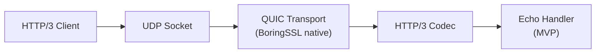

# Experimental HTTP/3 (QUIC) Support

## Status

**EXPERIMENTAL** -- this feature is an MVP (Minimum Viable Product) that proves the
HTTP/3 stack can serve requests. It is off by default and must be explicitly enabled.

## Overview

MockServer can optionally listen for HTTP/3 requests over QUIC (UDP). This uses
the [netty-incubator-codec-http3](https://github.com/netty/netty-incubator-codec-http3)
library which provides an HTTP/3 codec on top of Netty's QUIC transport (backed by
BoringSSL native libraries).

## How to Enable

Set the `http3Port` configuration property to a non-zero UDP port number:

| Method | Example |
|--------|---------|
| System property | `-Dmockserver.http3Port=8443` |
| Environment variable | `MOCKSERVER_HTTP3_PORT=8443` |
| Configuration API | `Configuration.configuration().http3Port(8443)` |

When `http3Port` is `0` (the default), the HTTP/3 listener is **not started** and
has zero impact on the existing TCP/HTTP server.

## Architecture

### Components

| Class | Module | Purpose |
|-------|--------|---------|
| `Http3Server` | `mockserver-netty` | Bootstraps the QUIC/HTTP3 server, manages lifecycle |
| `Http3EchoRequestHandler` | `mockserver-netty` | MVP request handler (inner class of Http3Server) |
| `Configuration.http3Port()` | `mockserver-core` | Configuration property |
| `ConfigurationProperties.http3Port()` | `mockserver-core` | Static/system-property access |

### TLS

The HTTP/3 server generates a self-signed EC certificate at startup (using
BouncyCastle, which is already a MockServer dependency). This is suitable for
testing but would need to be replaced with configurable certificates for
production use.

### Request Handling (MVP)

The current implementation uses a simple echo handler that:

1. Reads the `:method` and `:path` pseudo-headers from the HTTP/3 request
2. Returns a `200 OK` response with a text body echoing those values

**Full mock-pipeline bridging** (routing HTTP/3 requests through `HttpState` and
`ActionHandler` for expectation matching, recording, and proxying) is a planned
follow-up. The echo handler proves the transport layer works without risking
entanglement with the existing TCP pipeline.

### Lifecycle

`Http3Server` is a standalone class with `start(port)` and `stop()` methods.
It creates its own `NioEventLoopGroup` for the UDP channel. It is **not** wired
into MockServer's `LifeCycle` class to avoid any risk to the existing boot path.

Integration into `MockServer.createServerBootstrap()` (similar to how the DNS
mock server is conditionally started) is straightforward when the feature
matures.

## Native QUIC Platform Requirement

The QUIC transport requires a native BoringSSL library. The
`netty-incubator-codec-http3` dependency transitively pulls in
`netty-incubator-codec-native-quic` with classifier-specific JARs.

### Supported platforms

- `linux-x86_64`
- `linux-aarch_64`
- `osx-x86_64`
- `osx-aarch_64`
- `windows-x86_64`

### CI native classifier note

The Maven dependency is declared without a platform classifier, relying on the
transitive resolution from `netty-incubator-codec-http3`. This brings in native
libraries for all supported platforms. If the shaded/uber JAR build strips
native libraries (e.g., via maven-shade-plugin filters), ensure the QUIC natives
are included for the target platform.

### Test skip behavior

The `Http3ServerTest` checks `Quic.isAvailable()` at test startup and uses
JUnit 4's `Assume.assumeTrue(...)` to skip gracefully on platforms where the
native library cannot be loaded. The test will **never fail the build** due to
platform incompatibility.

## Dependencies

| Artifact | Version | Scope |
|----------|---------|-------|
| `io.netty.incubator:netty-incubator-codec-http3` | `0.0.28.Final` | compile |
| `io.netty.incubator:netty-incubator-codec-native-quic` | `0.0.62.Final` (transitive) | runtime |
| `io.netty.incubator:netty-incubator-codec-classes-quic` | `0.0.62.Final` (transitive) | compile |

## MVP Boundaries and Risks

### What works now

- QUIC server binds to a UDP port and negotiates TLS 1.3 with ALPN `h3`
- HTTP/3 request streams are decoded and an echo response is returned
- Server starts and stops cleanly with proper resource cleanup
- Test proves end-to-end HTTP/3 request/response over QUIC

### What is NOT implemented (follow-up work)

- Full mock-pipeline bridging (HttpState, ActionHandler, expectation matching)
- Configurable TLS certificates (currently self-signed only)
- Integration into MockServer's `LifeCycle` and `MockServer` startup
- HTTP/3 proxy support
- QPACK header compression tuning
- Metrics and logging integration
- Dashboard UI visibility for HTTP/3 connections

### Risks

- **Native library compatibility**: the QUIC native (BoringSSL) must be available
  for the target platform. Missing natives will prevent the HTTP/3 server from starting.
- **Incubator API stability**: `netty-incubator-codec-http3` is in the incubator
  namespace and its API may change in future releases.
- **Netty version coupling**: the incubator codec must be compatible with the
  project's Netty version (`4.2.14.Final`). Version updates may require
  coordinated upgrades.
