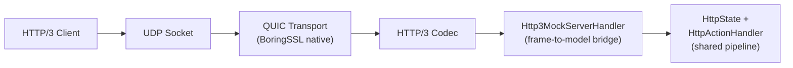
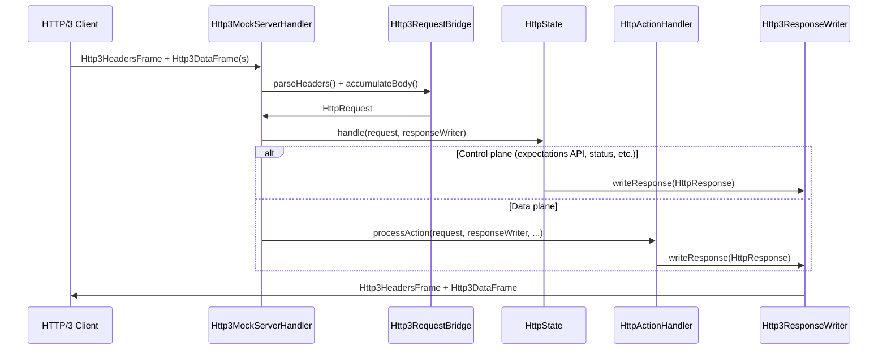
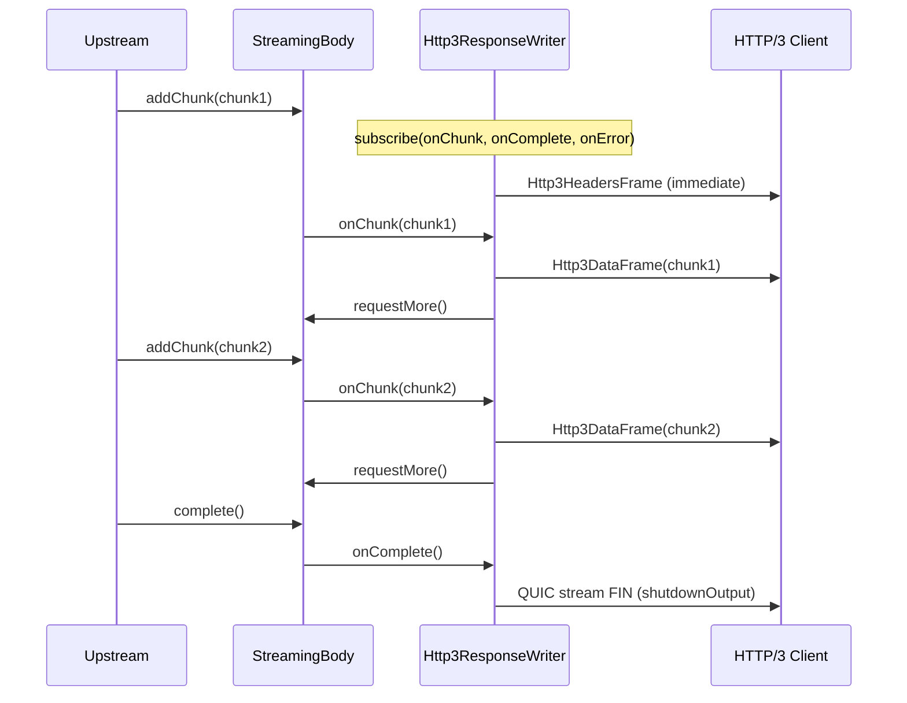

# Experimental HTTP/3 (QUIC) Support

## Status

**EXPERIMENTAL** -- HTTP/3 support is fully integrated with MockServer's request
pipeline (expectation matching, actions, recording, proxy forwarding). It is off
by default and must be explicitly enabled. The "experimental" label reflects the
fact that the underlying QUIC codec is a Netty incubator dependency
(`io.netty.incubator:netty-incubator-codec-http3`), which is a pre-release
artifact whose API may change in future releases.

## Overview

MockServer can optionally listen for HTTP/3 requests over QUIC (UDP). HTTP/3
requests are routed through the same expectation matching, action handling,
recording, and proxy forwarding pipeline used by HTTP/1.1 and HTTP/2, providing
full protocol parity.

## How to Enable

Set the `http3Port` configuration property to a non-zero UDP port number:

| Method | Example |
|--------|---------|
| System property | `-Dmockserver.http3Port=8443` |
| Environment variable | `MOCKSERVER_HTTP3_PORT=8443` |
| Configuration API | `Configuration.configuration().http3Port(8443)` |

When `http3Port` is `0` (the default), the HTTP/3 listener is **not started** and
has zero impact on the existing TCP/HTTP server.

## Architecture

### Components

| Class | Module | Purpose |
|-------|--------|---------|
| `Http3Server` | `mockserver-netty` | Bootstraps the QUIC/HTTP3 server, manages lifecycle |
| `Http3MockServerHandler` | `mockserver-netty` | Per-stream handler: accumulates HTTP/3 frames, converts to HttpRequest, routes through the shared pipeline |
| `Http3RequestBridge` | `mockserver-netty` | Pure conversion helpers: HTTP/3 frames to/from HttpRequest/HttpResponse |
| `Http3ResponseWriter` | `mockserver-netty` | ResponseWriter subclass that serialises HttpResponse as HTTP/3 frames |
| `Http3ConnectUdpHandler` | `mockserver-netty` | CONNECT-UDP (MASQUE) handler stub; intercepts CONNECT requests when `http3ConnectUdpEnabled=true`; currently returns 501 (codec limitation) |
| `Configuration.http3Port()` | `mockserver-core` | Configuration property |
| `ConfigurationProperties.http3Port()` | `mockserver-core` | Static/system-property access |
| `Configuration.http3MaxIdleTimeout()` | `mockserver-core` | QUIC max idle timeout (ms) |
| `Configuration.http3InitialMaxData()` | `mockserver-core` | Connection-level flow control (bytes) |
| `Configuration.http3InitialMaxStreamDataBidirectional()` | `mockserver-core` | Per-stream flow control (bytes) |
| `Configuration.http3InitialMaxStreamsBidirectional()` | `mockserver-core` | Max concurrent bidirectional streams |
| `Configuration.http3QpackMaxTableCapacity()` | `mockserver-core` | QPACK dynamic table capacity (bytes, 0 = disabled) |

### Request Processing

HTTP/3 requests flow through the same pipeline as HTTP/1.1 and HTTP/2:

### Streaming Response Path

When the response carries a `StreamingBody` (SSE, chunked proxy forwarding, LLM
streaming), `Http3ResponseWriter` sends the headers immediately and subscribes
to the body to forward each chunk as an HTTP/3 DATA frame:

Key design points:
- **Same matching**: uses `HttpState.firstMatchingExpectation()` and `HttpActionHandler.processAction()` -- identical to HTTP/1.1 and HTTP/2
- **Same recording**: requests are logged in `MockServerEventLog` for verification
- **Same proxy forwarding**: unmatched requests can be forwarded when configured
- **Body handling**: text content types (JSON, XML, HTML, etc.) are stored as string bodies for correct expectation matching; binary content is stored as binary bodies
- **Streaming support**: `Http3ResponseWriter` subscribes to `StreamingBody` and forwards each chunk as an HTTP/3 DATA frame with backpressure, matching the pattern used by `NettyResponseWriter` for HTTP/1.1

### Lifecycle Integration

The HTTP/3 server is started automatically by `MockServer.createServerBootstrap()`
when `http3Port > 0`. It is stopped during `MockServer.stopAsync()`. The lifecycle
mirrors how the DNS mock server is conditionally started.

**Fail-soft startup**: if the native QUIC transport is not available on the platform,
MockServer logs a warning and continues without HTTP/3. The existing TCP/HTTP server
is never affected by HTTP/3 startup failures.

The bound HTTP/3 port is accessible via `MockServer.getHttp3Port()`.

### TLS

The HTTP/3 server uses MockServer's configured TLS certificate material -- the same
private key and certificate chain used by the HTTPS server. This is obtained via
`KeyAndCertificateFactoryFactory.createKeyAndCertificateFactory()`, which respects
the `privateKeyPath`, `x509CertificatePath`, and other TLS configuration properties.

If no configuration is provided (legacy/echo mode), the server falls back to
generating a self-signed EC certificate at startup using BouncyCastle.

### Metrics

When metrics are enabled, HTTP/3 requests increment the `REQUESTS_RECEIVED_COUNT`
counter, consistent with HTTP/1.1 and HTTP/2 request counting.

## Native QUIC Platform Requirement

The QUIC transport requires a native BoringSSL library. The
`netty-incubator-codec-http3` dependency transitively pulls in
`netty-incubator-codec-native-quic` with classifier-specific JARs.

### Supported platforms

- `linux-x86_64`
- `linux-aarch_64`
- `osx-x86_64`
- `osx-aarch_64`
- `windows-x86_64`

### CI native classifier note

The Maven dependency is declared without a platform classifier, relying on the
transitive resolution from `netty-incubator-codec-http3`. This brings in native
libraries for all supported platforms. If the shaded/uber JAR build strips
native libraries (e.g., via maven-shade-plugin filters), ensure the QUIC natives
are included for the target platform.

### Test skip behavior

The `Http3ServerTest` checks `Quic.isAvailable()` at test startup and uses
JUnit 4's `Assume.assumeTrue(...)` to skip gracefully on platforms where the
native library cannot be loaded. The tests will **never fail the build** due to
platform incompatibility.

## Dependencies

| Artifact | Version | Scope |
|----------|---------|-------|
| `io.netty.incubator:netty-incubator-codec-http3` | `0.0.30.Final` | compile |
| `io.netty.incubator:netty-incubator-codec-native-quic` | `0.0.73.Final` (transitive) | runtime |
| `io.netty.incubator:netty-incubator-codec-classes-quic` | `0.0.73.Final` (transitive) | compile |

The native QUIC artifact is bundled with platform classifiers for all supported
platforms (`linux-x86_64`, `linux-aarch_64`, `osx-x86_64`, `osx-aarch_64`,
`windows-x86_64`) as transitive runtime dependencies of
`netty-incubator-codec-http3`. No additional classifier-specific dependency
declarations are needed -- they resolve automatically.

## What Works

- QUIC server binds to a UDP port and negotiates TLS 1.3 with ALPN `h3`
- HTTP/3 requests are decoded and routed through the full expectation pipeline
- Expectation matching, response actions, template actions, and proxy forwarding
- Request body reading (text and binary content types)
- Request recording for verification via the standard event log
- MockServer TLS certificate reuse (same key/cert as HTTPS)
- Lifecycle integration: start/stop with MockServer
- Fail-soft startup when native QUIC is unavailable
- Metrics: HTTP/3 requests counted in `REQUESTS_RECEIVED_COUNT`
- **Streaming/SSE responses**: `StreamingBody` (SSE, chunked proxy forwarding,
  LLM streaming) responses are fully supported over HTTP/3. Each chunk is sent
  as an HTTP/3 DATA frame with backpressure via `StreamingBody.requestMore()`.
  The QUIC stream output is shut down on stream completion or error.
- Unit-tested frame conversion (no native QUIC needed for bridge tests)
- Unit-tested streaming response writer (no native QUIC needed)
- Integration-tested pipeline parity (expectation matching via HTTP/3)
- Integration-tested streaming over QUIC (in-JVM Netty QUIC client, gated on
  native QUIC availability)

## What is NOT Implemented (follow-up work)

- ~~QPACK header compression tuning (G16-FOLLOW-UP-1)~~ -- **DONE**: `http3QpackMaxTableCapacity`
  configuration property controls the QPACK dynamic table size (default 0 = static table only).
- ~~Dashboard UI visibility for HTTP/3 connections (G16-FOLLOW-UP-2)~~ -- **DONE**: active
  connection count tracked in `Http3Server`; exposed via `GET /mockserver/http3status` endpoint;
  dashboard AppBar shows an "H3" chip with port and active connection count when enabled.
  Per-connection detail (remote address, stream count, duration) is deferred as follow-up.
- HTTP/3 specific proxy mode -- CONNECT-UDP / MASQUE (G16-FOLLOW-UP-3) -- **PARTIAL (DEFERRED)**:
  the `http3ConnectUdpEnabled` configuration flag (default `false`) enables the
  `Http3ConnectUdpHandler` in the QUIC stream pipeline. When enabled, HTTP/3 CONNECT
  requests are intercepted and cleanly rejected with `501 Not Implemented` (with a JSON
  body explaining the limitation). Normal HTTP/3 requests pass through unchanged.
  **Full datagram relay is blocked** because the bundled `netty-incubator-codec-http3`
  (0.0.30.Final) does not support the `:protocol` pseudo-header (RFC 9220 extended
  CONNECT) -- the codec actively rejects it in `Http3HeadersSink.validate()`. The QUIC
  layer (`netty-incubator-codec-classes-quic` 0.0.73.Final) does support QUIC datagrams
  (RFC 9221) via `QuicCodecBuilder.datagram()` and `QuicheQuicChannel.sendDatagram()`/
  `recvDatagram()`, so the transport foundation exists. Unblocking requires upgrading
  to a codec version that adds `:protocol` to `Http3Headers.PseudoHeaderName`,
  `SETTINGS_ENABLE_CONNECT_PROTOCOL` (0x08) to `Http3SettingsFrame`, and
  `SETTINGS_H3_DATAGRAM` (0xffd277). See `Http3ConnectUdpHandler` javadoc for the
  detailed implementation plan.
- ~~Configurable QUIC transport parameters via configuration properties (G16-FOLLOW-UP-4)~~ --
  **DONE**: `http3MaxIdleTimeout`, `http3InitialMaxData`,
  `http3InitialMaxStreamDataBidirectional`, `http3InitialMaxStreamsBidirectional` configuration
  properties added. Defaults match the original hardcoded values.

## Risks

- **Native library compatibility**: the QUIC native (BoringSSL) must be available
  for the target platform. Missing natives will prevent the HTTP/3 server from starting.
- **Incubator API stability**: `netty-incubator-codec-http3` is in the incubator
  namespace and its API may change in future releases.
- **Netty version coupling**: the incubator codec must be compatible with the
  project's Netty version (`4.2.14.Final`). Version updates may require
  coordinated upgrades.
- **InsecureQuicTokenHandler**: the QUIC server uses `InsecureQuicTokenHandler`
  which performs no source-address validation (no Retry token). This is acceptable
  for a test/mock tool but means the server does not protect against address
  spoofing. A production deployment behind a real network would need a proper
  token handler.
- **QUIC transport parameters**: transport parameters (`maxIdleTimeout`,
  `initialMaxData`, `initialMaxStreamDataBidirectional`, `initialMaxStreamsBidirectional`)
  and the QPACK dynamic table capacity are now configurable via `Configuration` /
  `ConfigurationProperties`. The defaults match the original hardcoded values and are
  generous for testing. See the configuration properties documentation for details.
- **Streaming body ordering**: streaming chunks over HTTP/3 are serialised on the
  QUIC stream (QUIC guarantees in-order delivery per stream), but the subscriber
  callbacks run on the upstream event loop. If the upstream event loop differs from
  the QUIC stream's event loop, chunks may be delayed by event loop scheduling
  (not lost or reordered, just latency-amplified).
