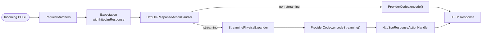
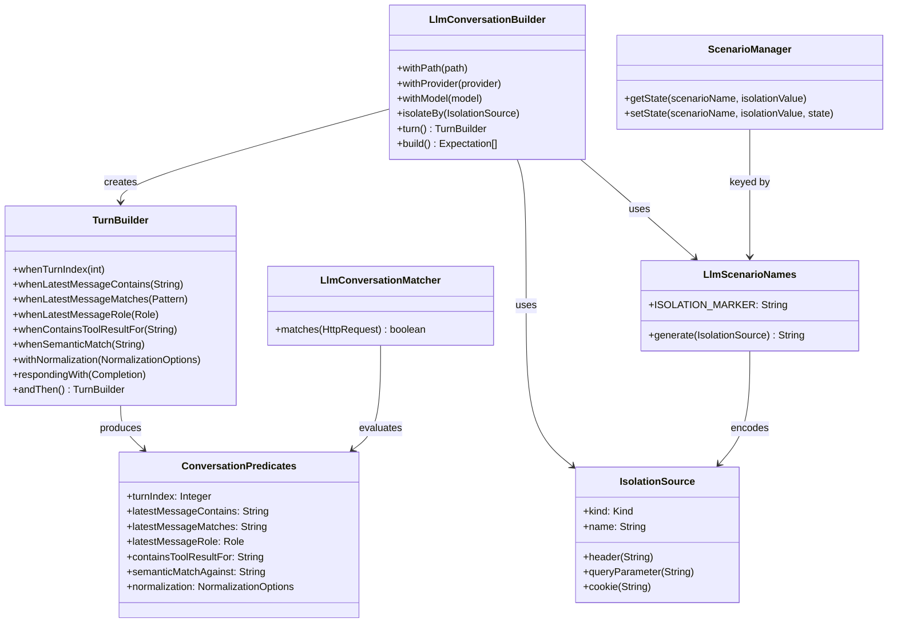
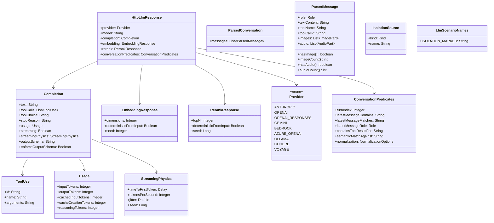
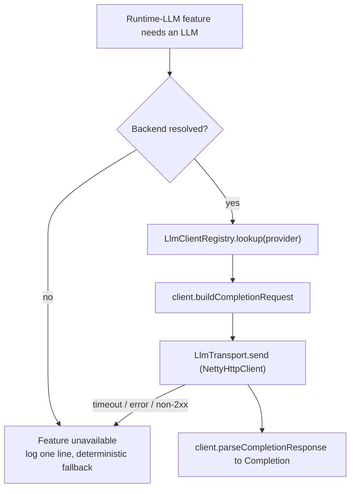
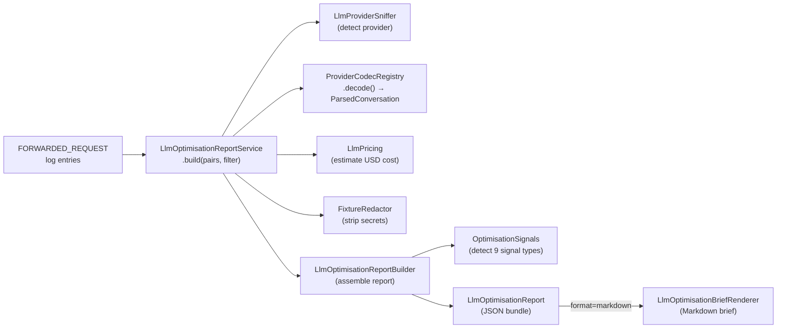

# LLM & Agent Mocking — Internal Architecture

## Overview

MockServer provides first-class LLM mocking through a new action type `httpLlmResponse` that produces provider-correct responses from a high-level, provider-neutral `Completion` abstraction. The feature spans codec encoding, streaming physics, conversation-aware matching, session isolation, MCP tool exposure, and dashboard rendering.

## Action Type

`httpLlmResponse` is a peer to `httpResponse`, `httpSseResponse`, etc. It lives on `Expectation` as a separate field and dispatches through `HttpLlmResponseActionHandler`.



## Codec Registry

`ProviderCodecRegistry` is a singleton that maps `Provider` enum values to `ProviderCodec` implementations. Each codec exposes:

- `encode(Completion, model)` -- non-streaming response
- `encodeStreaming(Completion, model, StreamingPhysics)` -- SSE event list
- `encodeEmbedding(EmbeddingResponse, input)` / `encodeEmbedding(EmbeddingResponse, input, model)` -- embeddings (the model-aware overload lets Bedrock pick Titan vs Cohere; most codecs ignore the model and inherit the two-arg default)
- `encodeRerank(RerankResponse, documents)` -- rerank results (Cohere/Voyage)
- `decode(HttpRequest)` -- parse inbound request to `ParsedConversation` (for conversation matchers)

All embedding codecs share `EmbeddingVectors` (deterministic-from-input or random, then L2-normalised); only the JSON envelope differs per provider. Embedding shapes: OpenAI/Azure `{"object":"list","data":[{"embedding":[...]}]}` (default 1536 dims); Gemini `{"embedding":{"values":[...]}}` (768); Ollama `{"embeddings":[[...]]}` — the `/api/embed` shape (768); Bedrock Titan `{"embedding":[...],"inputTextTokenCount":N}` or Bedrock Cohere `{"embeddings":[[...]]}` when the model id starts with `cohere` (1024). `ANTHROPIC` and `OPENAI_RESPONSES` have no embeddings endpoint and throw (surfaced as a 400 by the handler). Rerank shares `RerankScoring` (per-document relevance scores — reproducible when `deterministicFromInput` is set, else random — descending, capped to `topN`) and emits the provider-correct envelope via a `RerankScoring.Envelope` selector: Cohere `{"results":[{"index":N,"relevance_score":F}, ...]}`, Voyage `{"object":"list","data":[...],"usage":{"total_tokens":N}}`.

Currently registered codecs:

| Provider | Codec class | Status |
|----------|-------------|--------|
| ANTHROPIC | `AnthropicCodec` | Complete (no embeddings endpoint) |
| OPENAI | `OpenAiChatCompletionsCodec` | Complete (chat + embeddings) |
| OPENAI_RESPONSES | `OpenAiResponsesCodec` | Complete (no embeddings endpoint) |
| GEMINI | `GeminiCodec` | Complete (chat + embeddings) |
| BEDROCK | `BedrockCodec` | Complete (delegates chat to `AnthropicCodec`; streaming uses `application/vnd.amazon.eventstream` binary framing via `BedrockEventStreamEncoder`; SigV4 signing is a follow-up; embeddings = Titan default / Cohere by model) |
| AZURE_OPENAI | `AzureOpenAiCodec` | Complete (delegates to `OpenAiChatCompletionsCodec`) |
| OLLAMA | `OllamaCodec` | Complete (chat + embeddings; see security audit for NDJSON wire-format limitation) |
| COHERE | `CohereCodec` | Rerank only (`/v1/rerank`) |
| VOYAGE | `VoyageCodec` | Rerank only (`/v1/rerank`) |

## Streaming Physics

`StreamingPhysicsExpander` converts a `Completion` + `StreamingPhysics` configuration into a `List<SseEvent>` with pre-computed per-event delays.

Parameters:
- `timeToFirstToken` -- delay before the first SSE event
- `tokensPerSecond` -- base rate (1-10000)
- `jitter` -- fractional uniform deviation (0.0-1.0)
- `seed` -- PRNG seed for reproducible timing

The expanded events are handed to `HttpSseResponseActionHandler` which already honours per-event delays.

## Conversation Matchers

`LlmConversationMatcher` evaluates predicates against a `ParsedConversation` decoded from the inbound request body:

- `whenTurnIndex(n)` -- assistant turn count
- `whenLatestMessageContains(text)` -- substring match on last message
- `whenLatestMessageMatches(pattern)` -- regex match on last message
- `whenLatestMessageRole(role)` -- role of last message
- `whenContainsToolResultFor(toolName)` -- tool result presence
- `withNormalization(options)` -- opt-in prompt normalisation applied before the `contains`/`matches` text predicates (see below)

Predicates are stored as `ConversationPredicates` on `HttpLlmResponse` for JSON round-tripping. The matcher is lazily reconstructed from predicates after deserialisation.

### Multimodal (image) recognition

The decoders recognise **image content parts** on the request side so a mocked request can be matched on image presence. Each `ParsedMessage` exposes `hasImage()`, `imageCount()`, and `getImages()` (a list of `ImagePart`, each carrying the declared media type where the provider shape includes it):

| Provider | Image shape recognised |
|----------|------------------------|
| OPENAI / AZURE_OPENAI | `image_url` content part (media type parsed from a `data:` URL; `null` for a remote `https` URL) |
| ANTHROPIC / BEDROCK | `image` block with a `source.media_type` |
| GEMINI | `inline_data` / `inlineData` part with `mime_type` / `mimeType` |

This is **request-side recognition only** — MockServer notes that a message contains an image (and how many, and the media type) so conversation matchers can assert it; it does not store the image bytes or generate image responses.

### Multimodal (audio) recognition

The OpenAI decoder also recognises **audio content parts** on the request side, mirroring the image handling. Each `ParsedMessage` exposes `hasAudio()`, `audioCount()`, and `getAudio()` (a list of `AudioPart`, each carrying the declared `format` where the provider shape includes it):

| Provider | Audio shape recognised |
|----------|------------------------|
| OPENAI / AZURE_OPENAI | `input_audio` content part (`format` read from `input_audio.format`, e.g. `wav`/`mp3`; `null` when absent) |

Like image recognition, this is **request-side only** — MockServer notes that a message contains audio (and how many, and the declared format); it does not store the audio bytes.

### Normalised prompt matching

Agent prompts are dynamically assembled, so exact-byte matching is brittle. `NormalizationOptions` (carried on `ConversationPredicates`) applies a **deterministic** transform to the latest-message text before the text predicates run, via `PromptNormalizer.normalize(text, options)`:

- `collapseWhitespace` (default on) -- collapse runs of whitespace to a single space and trim
- `lowercase` (default off) -- lowercase the text
- `sortJsonKeys` (default on) -- when the prompt is JSON, sort object keys so key ordering is irrelevant
- `dropBuiltInVolatileFields` (default off) -- strip ISO-8601 timestamps, UUIDs, and `prefix_…` ids (`req_`, `msg_`, `call_`, …)
- `dropVolatileFields` -- names of JSON fields to drop before matching

For `latestMessageContains`, both the subject text and the expected substring are normalised; for `latestMessageMatches`, only the subject is normalised (normalising the regex source would corrupt the pattern). Normalisation applies **only to the latest-message text** — the `containsToolResultFor` tool name, `turnIndex`, and `latestMessageRole` are matched exactly as specified. Boolean options are nullable: an unset flag uses its default (`collapseWhitespace` and `sortJsonKeys` on; `lowercase` and `dropBuiltInVolatileFields` off), resolved identically whether the options arrive via the REST API or the MCP tool. Normalisation is idempotent and pure — it never makes a test flaky — and is a *modifier*, not a predicate: it does not count toward `hasAnyPredicate()` and has no effect unless a text predicate is also set.

### Semantic prompt matching (opt-in, exploratory)

The `semanticMatch` predicate (`ConversationPredicates.semanticMatchAgainst`) matches when the latest message expresses a given intent, judged by a runtime LLM. It is deliberately quarantined from the deterministic path:

- **Off by default.** `SemanticMatching` is a static gate that is only `install`ed (at server start) when `mockserver.llmSemanticMatchingEnabled` is set **and** a backend resolves via `LlmBackendResolver`. Until then `isEnabled()` is false and `LlmConversationMatcher` **ignores** the predicate (logs once, deterministic fallback) — so default behaviour is unchanged.
- **Fail-closed when active.** `SemanticPromptMatcher` asks the LLM (via the Phase-2 `LlmCompletionService`, `temperature=0`, cached) a strict yes/no judge question; a non-affirmative, empty, or errored answer does not match.
- **Never for assertions.** It is non-deterministic by construction (a live model) and documented as exploratory only.

## Session Isolation

`IsolationSource` describes where to extract the isolation key from an inbound request (header, query parameter, or cookie). The key is encoded into the scenario name:

```
__llm_conv_<uuid>__iso=header:x-session-id
```

`ScenarioManager` uses composite keys `(scenarioName, isolationValue)` to maintain independent state per session.

## Conversation Builder

`LlmConversationBuilder` produces an array of `Expectation` objects, one per turn, with:
- Auto-generated scenario name (with optional isolation suffix)
- State progression: `Started` -> `turn_1` -> `turn_2` -> ... -> `__done`
- `ConversationPredicates` on each `HttpLlmResponse`

The class relationships between the builder, predicates, matcher, and isolation model:



## MCP Tools

Two MCP tools expose the LLM mocking feature to agents:

| Tool | Description |
|------|-------------|
| `mock_llm_completion` | Creates a single LLM expectation from provider, path, text, tool calls, usage, and an optional `outputSchema` (response-path structured-output validation) |
| `create_llm_conversation` | Creates a multi-turn conversation with scenario state chain, optional isolation, and an optional per-turn `match.normalization` object |
| `verify_tool_call` | Asserts an agent called a named tool `atLeast`/`atMost` times (optional args regex), by decoding recorded LLM requests. Supports `provider=AUTO` to auto-detect from request paths |
| `explain_agent_run` | Summarises a recorded agent run: turn/tool-call sequence, tool results, latest role. Supports `provider=AUTO` to auto-detect from request paths |
| `verify_structured_output` | Validates the JSON output text of recorded LLM responses against a JSON Schema (decodes each response via the runtime-LLM client SPI, then `JsonSchemaValidator`); reports per-response conformance |
| `verify_cost_budget` | Sums input/output tokens from recorded responses' usage, prices them via `org.mockserver.llm.cost.LlmPricing`, and asserts the total USD cost is within `maxCostUsd` — a deterministic CI cost gate. Unpriceable models are reported and excluded |
| `mock_llm_failover` | Creates a failover/retry scenario: the first N requests fail with specified HTTP statuses, then subsequent requests succeed with a provider-correct LLM response. Uses `LlmFailoverBuilder` |

The first two validate provider availability against `ProviderCodecRegistry` at registration time. The analysis tools delegate to `org.mockserver.llm.analysis.AgentRunAnalyzer`.

## Structured-output validation

Structured-output validation against a JSON Schema works on **both sides** of a mock, both built on `JsonSchemaValidator`:

- **Read side — `verify_structured_output`** (assertion over recorded traffic): decodes each recorded response for a provider via the runtime-LLM client SPI and checks the assistant's output text against the schema. Read-only and deterministic.
- **Response side — `Completion.outputSchema`** (fixture sanity check): a completion may declare the JSON Schema its `text` should conform to (`Completion.withOutputSchema(...)`, the `outputSchema` expectation-JSON field, or the `mock_llm_completion` MCP param — string or inline object). `HttpLlmResponseActionHandler.validateStructuredOutput(...)` validates the configured text as the response is encoded. It is **fail-soft** by default: a mismatch never alters the response body — it adds the `x-mockserver-structured-output-invalid` diagnostic header (a single-line, CR/LF-collapsed message; non-streaming only) and logs a warning. A blank schema, absent text, or a malformed schema are all "nothing to check" and can never break the response. This surfaces malformed fixtures while still letting you return a deliberately non-conforming response unchanged.
  - **Strict enforcement (opt-in) — `Completion.enforceOutputSchema`**: set the `enforceOutputSchema` flag (`Completion.enforceOutputSchema()` / `withEnforceOutputSchema(true)`, the `enforceOutputSchema` expectation-JSON field, or the `mock_llm_completion` MCP boolean param) alongside the schema to switch from fail-soft to strict. `HttpLlmResponseActionHandler.enforcementErrorResponseOrNull(...)` then **fails loudly** when the configured body does not conform: it returns a provider-correct error (HTTP `502` via `LlmErrorBodies`, with the `x-mockserver-structured-output-invalid` header) instead of the non-conforming body. This models a provider's strict `response_format: json_schema` mode, which guarantees schema-valid output. `HttpActionHandler` checks it before dispatch (after chaos, which takes priority — a transport-level failure independent of the body), so it applies on **both** the streaming and non-streaming paths and a strict streaming completion with a non-conforming body never begins streaming. The shared `structuredOutputError(...)` helper backs both the fail-soft and strict paths, so a blank/absent-text/malformed schema is a no-op in either mode and can never produce an enforcement error. The flag is back-compatible: unset/`false` keeps the fail-soft behaviour and the flag has no effect without an `outputSchema`.

## Approximate token counting and usage inference

`TokenCounter` (`org.mockserver.llm`) is a pure, deterministic helper that estimates token counts for text. It is **an estimate, not a real tokenizer** — it does not implement BPE/SentencePiece or any provider's vocabulary, so its counts differ from a provider's billed counts (roughly within ±20% for ordinary English prose, further off for code or non-Latin text). The heuristic averages two cheap signals — characters ÷ 4 and words × 4/3 — plus a small punctuation-density allowance (BPE tends to split punctuation into its own tokens), clamped to ≥1 for any non-empty text and 0 for `null`/empty. It exposes `estimateTokens(text)`, `estimatePromptTokens(ParsedConversation)` (per-message text + a small per-message chat-format overhead, including tool-call args and tool results), and `estimateCompletionTokens(text, toolCalls)`.

When the opt-in `mockserver.llmInferUsageEnabled` flag is set, `HttpLlmResponseActionHandler.withInferredUsageIfEnabled(...)` returns a **per-request shallow copy** of the completion carrying approximate `prompt_tokens` / `completion_tokens` for a mocked completion that omits `usage`, on both the non-streaming and streaming paths, **before** the codec encodes. The shared expectation `Completion` is never mutated, so the request-dependent prompt estimate is recomputed every request (no stale caching, no concurrent-write race). The prompt estimate comes from decoding the inbound request with the provider codec (`ProviderCodec.decode`); the completion estimate from the response text and tool-call arguments. It is **off by default** so existing responses are unchanged (an absent `usage` continues to encode as zeros) and a completion that already declares a non-zero `usage` is never overwritten. Decoding failures are fail-soft (prompt estimate degrades to 0, never an error). This is independent of `HttpLlmResponseActionHandler.estimateTokenCount(...)`, the existing rough character estimate that backs the token-based chaos quota, which is unchanged.

## Adversarial-response harness

`AdversarialResponseLibrary` (`org.mockserver.llm.adversarial`) is a curated catalog of hostile/malformed *responses* an agent might receive from a compromised tool or jailbroken model — prompt injection, jailbreak persona-swaps, data-exfiltration requests, malformed/truncated JSON, an empty response, and an over-long repetition. The `mock_adversarial_llm_response` MCP tool mocks a chosen payload as the provider-correct LLM response so you can test that your agent **resists** it. The payloads are short, well-known benign test fixtures (not working exploits) — a defensive testing aid — and generation is deterministic (each id maps to fixed text).

## Fault / chaos injection

`LlmChaosProfile` (`org.mockserver.model`) attaches a fault profile to any `HttpLlmResponse` for resilience testing. Applied by `HttpLlmResponseActionHandler`:

- **Probabilistic error** — `chaosErrorResponseOrNull(...)` returns an error `HttpResponse` (`errorStatus` + optional `Retry-After`) when triggered. An `errorStatus` with no `errorProbability` always fires; a fractional probability draws once (reproducible via `seed`). `HttpActionHandler` checks this first and, if present, returns the error on the normal (non-streaming) path — a provider error is a plain HTTP response, not an SSE stream, even for a would-be streaming completion.
- **Mid-stream truncation** — `applyStreamingChaos(...)` keeps a leading `truncateAtFraction` of the SSE events (default 0.5) so the stream ends early.
- **Malformed SSE** — appends a deliberately broken-JSON chunk so the client must handle a corrupt event.
- **Stateful request quota** — a deterministic fixed-window rate limit (`quotaName` + `quotaLimit` + `quotaWindowMillis`, optional `quotaErrorStatus` default 429). `quotaErrorResponseOrNull(...)` (called first inside `chaosErrorResponseOrNull`) records one request against `org.mockserver.llm.LlmQuotaRegistry` and returns the quota error once the in-window count exceeds the limit. The registry is a process-wide singleton keyed by `quotaName` (expectations sharing a name share one counter — model an upstream account limit), thread-safe via `ConcurrentHashMap`, with an injectable clock for testing, cleared on `HttpState.reset()`. A misconfigured/partial quota fails open (never rate-limits).

Truncation, malformed-SSE, and the stateful quota are fully deterministic; the probabilistic error path is deterministic at probability 0.0/1.0. Each injection increments the `LLM_CHAOS_INJECTED_COUNT` metric. The profile round-trips as the top-level `chaos` field on `HttpLlmResponse` (alongside `completion`, `embedding`, and `conversationPredicates`) and is exposed per turn in the dashboard wizard and via the `chaos` MCP parameter.

### Provider-specific error bodies

Both chaos error paths (the probabilistic `errorStatus` and a stateful quota breach) emit the **provider-correct JSON error body** for the detected provider, so client SDK retry/backoff logic — which parses the body's `error.type` / `error.code` — can be exercised faithfully against a mock. `LlmErrorBodies` (`org.mockserver.llm`) is a pure, deterministic helper that maps a `Provider` + a coarse error `Kind` (derived from the HTTP status) to the body shape. When the provider is `null`/unknown, the handler falls back to the previous generic body (`{"error":{"type":"chaos_injected"|"quota_exceeded"|"token_quota_exceeded",...}}`), so behaviour is unchanged for an unspecified provider.

The error `Kind` is derived from the status: `429 → RATE_LIMIT`, `529 → OVERLOADED`, any other status `→ SERVER_ERROR`.

| Provider | Body shape (by error kind) |
|----------|----------------------------|
| ANTHROPIC / BEDROCK | `{"type":"error","error":{"type":"overloaded_error"\|"rate_limit_error"\|"api_error","message":...}}` — Bedrock delivers the Anthropic body unchanged |
| OPENAI / OPENAI_RESPONSES / AZURE_OPENAI | `{"error":{"message":...,"type":"rate_limit_exceeded"\|"server_error","param":null,"code":...}}` — `code` is the numeric status for `server_error`, the string `"rate_limit_exceeded"` for a 429 |
| GEMINI | `{"error":{"code":<status>,"message":...,"status":"UNAVAILABLE"\|"RESOURCE_EXHAUSTED"\|"INTERNAL"}}` |
| OLLAMA | `{"error":"<message>"}` (a plain message string) |

The `Retry-After` and provider-specific rate-limit *headers* (see below) are still applied on top of the body by the same code path, so a 429/529 carries both the correct body and the correct headers.

### Token-based quota (TPM/TPD)

Real LLM providers (OpenAI, Anthropic) enforce token-per-minute (TPM) and token-per-day (TPD) limits in addition to request-count limits. MockServer models this with two additional `LlmChaosProfile` fields: `tokenQuotaLimit` (Long, >= 1) and `tokenQuotaWindowMillis` (Long, >= 1). When both are set alongside `quotaName`, each response charges its cumulative token count (from `Usage.inputTokens + outputTokens`, or `ceil(text.length()/4)` as a fallback when no Usage is present) against a separate fixed-window counter in `LlmQuotaRegistry` under the key `quotaName + ":tokens"`. Once the in-window token sum exceeds `tokenQuotaLimit`, the response path returns a 429 (or custom `quotaErrorStatus`) with error type `token_quota_exceeded` and the `Retry-After` header when set. The request-count quota and token quota are independent counters that can coexist on the same profile; the request-count quota is checked first. Embeddings contribute zero tokens. The `LlmQuotaRegistry.tryAcquire(name, limit, windowMillis, amount)` overload supports arbitrary increment amounts for this purpose.

### Provider rate-limit headers

When an LLM response path returns a rate-limit / quota error (probabilistic `errorStatus` or stateful quota 429), MockServer emits the **provider-correct rate-limit HTTP headers** that real LLM providers send, so client SDK retry/backoff logic (which reads those headers) can be exercised faithfully against a mock. The same headers are stamped on **successful** responses when a quota is configured, so a client can observe the limit counting down.

`LlmRateLimitHeaders` (`org.mockserver.llm`) is a pure, deterministic helper that maps a `Provider` + quota parameters to the **provider-specific** header names and values. The standard `Retry-After` header is generic HTTP (not provider-specific), so it is owned by `HttpLlmResponseActionHandler.applyRateLimitHeaders(...)` — emitted once for every provider on a 429 — rather than by the helper, so it can never appear twice on the wire.

| Provider | Provider-specific headers on error (429) | Headers on success (with quota) | `Retry-After` on 429 |
|----------|----------------------|-------------------------------|---------------------|
| OPENAI / OPENAI_RESPONSES / AZURE_OPENAI | `x-ratelimit-limit-requests`, `x-ratelimit-remaining-requests`, `x-ratelimit-reset-requests` (e.g. `"60s"`) | `x-ratelimit-limit-requests`, `x-ratelimit-reset-requests` | yes (seconds) |
| ANTHROPIC | `anthropic-ratelimit-requests-limit`, `anthropic-ratelimit-requests-remaining`, `anthropic-ratelimit-requests-reset` (RFC 3339 timestamp) | `anthropic-ratelimit-requests-limit`, `anthropic-ratelimit-requests-reset` | yes (seconds) |
| GEMINI | *(none)* | *(none)* | yes (seconds) |
| BEDROCK | *(none)* | *(none)* | yes (seconds) |
| OLLAMA | *(none)* | *(none)* | yes, when a quota window or literal `retryAfter` is set |

Header values are derived from the `LlmChaosProfile` fields: `quotaLimit` becomes the limit header; the reset duration is `quotaWindowMillis / 1000` (falling back to `tokenQuotaWindowMillis / 1000` for a token-only quota, then to a numeric `retryAfter`), so a **token-quota-only** 429 still carries reset/`Retry-After` headers; `remaining` is `0` on a 429 (omitted on success since the registry window count is not cheaply re-readable). On a 429 `Retry-After` is the literal configured `retryAfter` (which may be an HTTP-date) when set, otherwise the computed reset seconds. Applied at three sites: the probabilistic chaos error, the quota-exceeded error, and the successful non-streaming response when a quota is configured.

## Agent-run analysis

`AgentRunAnalyzer` (`org.mockserver.llm.analysis`) is a deterministic, read-only inspector. Given the LLM requests MockServer recorded (retrieved via the normal request log), it decodes each with the provider's `ProviderCodec` and treats the **richest** conversation (most messages — the latest dialogue snapshot) as the canonical run. From that it derives:

- `inspectToolCalls(requests, provider, toolName, argsRegex)` → count + matched tool calls (powers `verify_tool_call`).
- `summarise(requests, provider)` → message count, assistant-turn count, ordered tool-call name sequence, tool-result keys, latest message role (powers `explain_agent_run`).

- `buildCallGraph(requests, provider)` → a `CallGraph` of nodes (one per message, one per assistant tool call) and directed edges: `NEXT` (message sequence), `INVOKES` (assistant turn → the tool calls it made), `RESULT` (tool call → the tool message that returned its result, correlated by tool-call id). Powers the dashboard call-graph view.

No LLM is called and no network is used — it reads the structure the codecs already produce, so assertions are reproducible. The MCP tools are thin wrappers that retrieve recorded requests (`/mockserver/retrieve?type=REQUESTS`) and format the analyzer's output; `explain_agent_run` includes the `callGraph` (nodes + edges). The dashboard **Sessions** view (`SessionInspector` → `AgentRunGraph.tsx`, with the pure transform `mockserver-ui/src/lib/callGraph.ts`) loads the graph per session via `explain_agent_run` and renders it as a step list (role + invoked tool calls + result indicator) plus a copyable Mermaid `flowchart`.

### Proxied/forwarded traffic support

Agent-run analysis works identically for **proxied/forwarded** traffic. Every incoming request — whether it matches a mock expectation or is forwarded to an upstream provider — is recorded as a `RECEIVED_REQUEST` log entry with the full request body. The `type=REQUESTS` retrieval returns these entries, and `AgentRunAnalyzer` decodes them with the appropriate `ProviderCodec`.

**Provider auto-detection.** The `verify_tool_call` and `explain_agent_run` MCP tools accept `"AUTO"` as the `provider` parameter. `ProviderDetector` (`org.mockserver.llm.ProviderDetector`) infers the provider from recorded request paths (e.g. `/v1/messages` maps to `ANTHROPIC`, `/v1/chat/completions` to `OPENAI`), mirroring the UI-side detection in `llmTraffic.ts`. This is especially useful for proxy users who route real LLM calls through MockServer and may not know or want to specify the provider explicitly.

**Dashboard Sessions view.** The Sessions view groups proxied LLM traffic by upstream host (from the `Host` header) when no conversation-isolation expectations are configured, so proxy traffic to different providers appears in separate session lanes. The call graph (via `AgentRunGraph`) is shown for all sessions including these host-grouped proxy sessions.

## Dashboard Rendering

The expectation panel renders an "LLM Response" badge (with provider, model, and text preview) when `httpLlmResponse` is present on an expectation.

The `ScriptedTurnsPanel` component renders the scripted turn sequence for conversation expectations, showing per-turn predicates, responses, and scenario state transitions.

## Domain Model



## Runtime LLM client SPI

Most LLM mocking is deterministic and offline. A few opt-in features (drift detection, semantic prompt matching) need MockServer to act as a *client* against a real LLM the user already runs. This is the opposite direction to the codecs (`decode` parses an inbound request; `encode` builds a mock response), so a sibling SPI mirrors the codec-registry shape:

- `org.mockserver.llm.client.LlmClient` — `provider()`, `buildCompletionRequest(LlmBackend, ParsedConversation)`, `parseCompletionResponse(HttpResponse)`. Implementations are **pure** (no transport, no shared state) so they unit-test offline. `AbstractLlmClient` provides URL parsing, base-request construction, and JSON helpers.
- `org.mockserver.llm.client.LlmClientRegistry` — singleton, static-block registration keyed by `Provider`, structurally identical to `ProviderCodecRegistry`. All seven providers registered: Ollama, OpenAI, OpenAI Responses, Azure OpenAI, Anthropic, Gemini, Bedrock.
- `org.mockserver.llm.client.LlmBackend` — immutable record (`name, provider, baseUrl, apiKey, model, headers, timeoutMillis`); `baseUrl`/`model` default per provider, `apiKey` redacted in `toString()`.
- `org.mockserver.llm.client.LlmBackendResolver` — three config layers: (1) provider env conventions (`OPENAI_API_KEY` / `ANTHROPIC_API_KEY` / `GEMINI_API_KEY` / `OLLAMA_HOST`), (2) `mockserver.llmProvider`/`llmApiKey`/`llmModel`/`llmBaseUrl`, (3) named backends JSON (`mockserver.llmBackendsConfig`). Properties take precedence over env; named backends are selectable by name.
- `org.mockserver.llm.client.LlmCompletionService` — the single entry point for runtime-LLM features. Looks up the client, builds the request, sends it via an injected `LlmTransport`, parses the response. Enforces the safety rules: **off unless a backend resolves**, **fail closed** (timeout / transport error / non-2xx / parse failure → `Optional.empty()` + one log line), and **reproducible** (clients pin `temperature=0`/seed; responses cached per provider+model+baseUrl+normalised prompt). `LlmTransport` is a seam; `NettyHttpClientLlmTransport` wraps the server's `NettyHttpClient` in production.



Adding a provider = implement `LlmClient` + one `register(...)` line — the same one-line story as codecs. **Ollama** is the reference backend (no auth, local, free) used to prove the path. **Bedrock** builds the Anthropic-on-Bedrock body and parses the Anthropic-shaped response, but automatic AWS SigV4 signing is not yet implemented — callers supply auth via the `headers` escape hatch or a signing proxy (tracked in `llm-security-audit.md`).

This SPI is never on the deterministic assertion/matching path. The features that consume it (drift detection, semantic matching) are opt-in and documented in this file above.

## OpenTelemetry export

Optional, off-by-default OTLP export, in two independent parts (both fail-soft — a setup error logs one line and never affects the server or a response; `io.opentelemetry` is relocated in the shaded jar):

- **Metrics** (`org.mockserver.metrics.OtelMetricsExporter`, `mockserver.otelMetricsEnabled`) — bridges the existing `Metrics.Name` gauges (the same set exposed for Prometheus, including the LLM/SSE/chaos counters) to OTLP as observable gauges that read the current values, so Prometheus and OTLP stay consistent. An alternative to the Prometheus endpoint.
- **GenAI spans** (`org.mockserver.telemetry.GenAiSpanExporter` + `GenAiSpans`, `mockserver.otelTracesEnabled`) — emits one span per LLM completion with GenAI semantic-convention attributes (`gen_ai.system`, `gen_ai.request.model`, `gen_ai.usage.*`, `gen_ai.response.finish_reasons`, tool-call count). When a provider reports them, cached-input and reasoning token counts are also emitted under the `mockserver.gen_ai.usage.*` namespace (`cached_input_tokens`, `cache_creation_tokens`, `reasoning_tokens`) — there is no GenAI semconv attribute for these yet, and they are omitted entirely when absent. These are spans MockServer codes deliberately — **no auto-instrumentation**. `GenAiSpans` is a process-wide no-op until `GenAiSpanExporter` installs a tracer. Spans fire on two paths:
  - **Mock action path** — `HttpLlmResponseActionHandler` calls `GenAiSpans.recordCompletion()` for mocked responses (streaming and non-streaming).
  - **Forward/proxy path** — `HttpActionHandler.emitForwardGenAiSpan()` detects LLM traffic via `LlmProviderSniffer` (maps the forwarded request's target host to a `Provider`), parses the upstream response using the provider's `LlmClient.parseCompletionResponse()`, and records a completion span. Covers matched-expectation forwards and unmatched proxy-pass. Streaming forward paths emit the GenAI span in the completion listener after the full SSE body is captured. Model is extracted from the response body (most providers include it), falling back to the request body.

Both use the OTLP HTTP/protobuf exporter with the JDK HttpClient sender (no gRPC/OkHttp) and share `mockserver.otelEndpoint` (a base collector URL; `/v1/metrics` and `/v1/traces` appended per signal, resolved by `telemetry.OtelEndpoints`).

## Drift detection

`detect_llm_drift` (MCP) closes the loop on stale cassettes: it replays a recorded cassette's exchanges against the **live** provider and reports structural drift in the responses. Built from two pieces in `org.mockserver.llm.drift`:

- `StructuralShapeDiff` — pure: walks two JSON documents into path→type shape maps and reports added / removed / type-changed paths (values ignored; arrays use a representative-first-element model). Reusable.
- `DriftDetector` — for each recorded exchange, decodes the recorded request via the `ProviderCodec`, builds a fresh live request via the runtime-LLM `LlmClient` (Phase 2 SPI), sends it through an injected `LlmTransport`, and diffs the live response shape against the recorded one. **Fails closed** per exchange: a missing client/codec, network error, non-2xx, or non-JSON body is reported as `COULD_NOT_CHECK`, never as drift, and never thrown.

The MCP tool resolves a backend via `LlmBackendResolver` and is **disabled** (returns `{disabled:true}`) when none is configured. When configured, it builds a transient `NettyHttpClient`-backed transport for the live calls. Because it needs real API keys/tokens and is inherently non-deterministic against a live API, it belongs in an opt-in/scheduled CI lane (see `docs/infrastructure/ci-cd.md`), never the per-commit build. No dashboard control — it is an operational/CI tool.

## AI-Powered Stub Generation

`PUT /mockserver/generateExpectation` infers a plausible MockServer expectation from an unmatched HTTP request, optionally calling a configured LLM backend for intelligent generation.

### Request format

```json
{
  "request": { "method": "GET", "path": "/api/users/42" },
  "preview": true,
  "limit": 1
}
```

| Field | Type | Default | Description |
|-------|------|---------|-------------|
| `request` | object | *required* | The unmatched `HttpRequest` to generate a stub for |
| `preview` | boolean | `true` | When `true`, returns the suggestion without registering it; `false` registers immediately |
| `limit` | integer | `1` | Number of suggestions to return (1-5) |

### Response format

```json
{
  "suggestions": [ { "httpRequest": { ... }, "httpResponse": { ... } } ],
  "confidence": 0.75,
  "preview": true,
  "explanation": "Generated from request pattern (no LLM backend configured)"
}
```

### Behaviour

1. **LLM-powered** (when a runtime LLM backend is configured via `LlmBackendResolver`): `StubGenerationPromptBuilder` builds a prompt containing the unmatched request details and up to 10 existing expectations as context. The prompt is sent via `LlmCompletionService` and the response is parsed as expectation JSON. If the LLM response is unparseable, falls back to template generation.

2. **Template fallback** (no LLM backend): generates a simple expectation matching the request's method and path with an appropriate status code (200 for GET, 201 for POST, 204 for DELETE) and a `{"status":"ok"}` body. Confidence is reported as `0.5`.

### Wiring

- `HttpState` holds an optional `LlmCompletionService` + `LlmBackend` pair, set by `LifeCycle.installLlmCompletionServiceIfAvailable()` at boot when a backend resolves via `LlmBackendResolver`.
- The handler uses `RequestMatchers.retrieveActiveExpectations(null)` to obtain context expectations.
- When `preview=false`, generated expectations are registered via `RequestMatchers.add(expectation, Cause.API)`.

### Source files

| File | Purpose |
|------|---------|
| `llm/StubGenerationPromptBuilder.java` | Builds the LLM prompt from the unmatched request + existing expectations context |
| `llm/StubGenerationResult.java` | Result DTO with suggestions, confidence, explanation, raw LLM response |
| `mock/HttpState.handleGenerateExpectation()` | Control-plane handler for `PUT /mockserver/generateExpectation` |
| `mock/HttpState.generateSimpleStub()` | Template-based fallback when no LLM is available |

## MCP server conformance testing

`run_mcp_contract_test` (MCP) verifies that a target **MCP (Model Context Protocol) server** correctly implements the protocol over Streamable HTTP. It is deterministic and involves no LLM — it checks the *protocol*, not any tool's semantics.

- `org.mockserver.netty.mcp.McpContractTest` — the orchestrator. Pure, with an injected `JsonRpcExchange` transport (a `(message, sessionId) → ExchangeResult` function), so the whole check sequence is unit-testable without a network (`McpContractTestTest` drives it with stub servers). Runs an ordered suite of checks, each producing a `CheckResult` (name, passed, statusCode, detail, validationErrors), aggregated into a `Report` (checks + negotiated `protocolVersion` + `serverInfo`):
  1. **initialize** — POSTs `initialize`, validates the JSON-RPC 2.0 envelope and that `result` carries `protocolVersion`, a `capabilities` object, and `serverInfo.name`; captures the `Mcp-Session-Id`. A transport error here short-circuits (only this check is reported).
  2. **notifications/initialized** — sends the notification (no `id`) with the session; expects HTTP 200/202/204 and no JSON-RPC error.
  3. **ping** — expects a JSON-RPC `result`.
  4. **tools/list** — expects `result.tools` to be an array where every tool has a `name` and an object `inputSchema` (`type: object`).
  5. **rejects unknown method** — sends a bogus method; expects a JSON-RPC `error` with code `-32601` (Method not found).
  6. **tools/call** (optional) — only when the caller passes `toolName`, since a real call may have side effects; a shape check on `result.content[]` + the `isError` boolean.
- The `McpToolRegistry` handler validates `targetUrl` (absolute http/https with a host), builds the `JsonRpcExchange` over the existing `sendHttpRequest` (`HttpURLConnection`, 10 s timeout), extracts the session header case-insensitively, and parses the JSON-RPC body — handling both `application/json` and `text/event-stream` (SSE `data:` framing) responses.

The check sequence is self-consistent with MockServer's own `McpStreamableHttpHandler` (which returns `-32601` for unknown methods and `202 ACCEPTED` for the initialized notification), so pointing the tool at MockServer's own `/mockserver/mcp` endpoint passes. No dashboard control — it is an agent/CI-invoked developer tool, like `run_contract_test`.

## VCR (record / replay)

LLM/MCP traffic forwarded through MockServer can be snapshotted to committable fixture files and replayed deterministically:

- **Record** — `record_llm_fixtures` (MCP) converts recorded request/response pairs (including SSE) into expectations via `SseAwareExpectationConverter`, then `FixtureRedactor` masks sensitive **headers** and — when `redactBodyFields` / `mockserver.fixtureBodyRedactFields` is set — named **JSON body fields** (recursively, value → `***REDACTED***`).
- **Replay** — `load_expectations_from_file` (MCP) loads the fixture as active expectations. Two replay aids: **strict mode** (`strict` param or `mockserver.llmVcrStrict`) registers a lowest-priority (`Integer.MIN_VALUE`) catch-all per cassette path returning HTTP 599 so an unmatched request fails loudly; **replay normalisation** (`normalizeRequestBodyFields`) drops volatile JSON fields from each recorded request body and rewrites the matcher to `JsonBody` with `MatchType.ONLY_MATCHING_FIELDS`, so per-run values do not block the match.

These are operational settings (config + MCP, for CI/automation), not dashboard controls.

## Configuration

| Property | Default | Range | Description |
|----------|---------|-------|-------------|
| `mockserver.maxLlmConversationBodySize` | `1048576` (1 MiB) | 16384 - 67108864 | Maximum request body size for conversation matcher parsing |
| `mockserver.fixtureBodyRedactFields` | _(unset)_ | — | Comma-separated JSON field names redacted from recorded fixture bodies |
| `mockserver.llmVcrStrict` | `false` | — | Strict VCR mode: unmatched requests on a cassette path return HTTP 599 |
| `mockserver.llmProvider` | _(unset)_ | — | Default runtime-LLM backend provider (enables runtime-LLM features) |
| `mockserver.llmApiKey` | _(unset)_ | — | API key for the default backend (secret; redacted in logs) |
| `mockserver.llmModel` | _(provider default)_ | — | Model for the default backend |
| `mockserver.llmBaseUrl` | _(provider default)_ | — | Base URL override for the default backend |
| `mockserver.llmBackendsConfig` | _(unset)_ | — | Path to JSON file of named backends |
| `mockserver.llmRequestTimeoutMillis` | `30000` | — | Per-request timeout for outbound runtime-LLM calls |
| `mockserver.llmSemanticMatchingEnabled` | `false` | — | Opt-in: activate the exploratory `semanticMatch` predicate (needs a backend; never for assertions) |
| `mockserver.llmInferUsageEnabled` | `false` | — | Opt-in: fill **approximate** `prompt_tokens`/`completion_tokens` (via `TokenCounter`) when a mocked completion omits `usage`. Off by default so responses are unchanged; never overwrites a declared `usage` |
| `mockserver.otelMetricsEnabled` | `false` | — | Export MockServer's metrics to an OTLP collector (alternative to Prometheus) |
| `mockserver.otelTracesEnabled` | `false` | — | Emit one explicit GenAI semantic-convention span per served LLM completion |
| `mockserver.otelEndpoint` | _(unset)_ | — | OTLP base endpoint shared by metrics and span export |
| `mockserver.otelMetricsExportIntervalSeconds` | `60` | ≥1 | How often metrics are pushed to the OTLP collector |
| `mockserver.llmMetricsEnabled` | `false` | — | Enable LLM token/cost Prometheus counters (requires `metricsEnabled`); activates forward-path response parsing even without OTLP tracing |
| `mockserver.llmCostBudgetUsd` | `-1.0` (disabled) | — | Cumulative LLM cost budget in USD; enforced on ALL forward paths (matched FORWARD, breakpoint-continuation, unmatched proxy). When exceeded, LLM forwards return 429. Negative = disabled. Resets on server reset. Trip surfaces via `mock_server_llm_cost_budget_tripped` counter, WARN log, and the dashboard Circuit Breakers section |

## LLM failover scenarios

`LlmFailoverBuilder` (`org.mockserver.client`) produces an ordered array of expectations that simulate a provider returning failures for the first N attempts, then succeeding on subsequent attempts. This is the deterministic way to test retry/failover logic (LiteLLM, Envoy AI Gateway, SDK retries) against MockServer.

The mechanism relies on expectation registration order and `Times` exhaustion: failure expectations with `Times.exactly(n)` are registered before the success expectation with `Times.unlimited()`. MockServer matches expectations in priority-then-insertion order (`SortableExpectationId`), so the first N requests match and consume the failure expectations, then fall through to the unlimited success expectation.

```java
// Java builder
llmFailover()
    .withPath("/v1/chat/completions")
    .withProvider(Provider.OPENAI)
    .withModel("gpt-4o")
    .failWith(503)
    .failWith(503)
    .failWith(429)
    .thenRespondWith(completion().withText("The answer is 42."))
    .applyTo(mockServerClient);
```

Consecutive failures with the same status code and body are coalesced into a single expectation with `Times.exactly(count)` for efficiency. Custom error bodies can be provided per failure via `failWith(status, body)`.

| MCP Tool | Description |
|----------|-------------|
| `mock_llm_failover` | Creates a failover scenario: `failStatuses` array of HTTP status codes (one per failure attempt), then a success response with provider-correct encoding. Validates provider against `ProviderCodecRegistry`. |

## Related Documents

- [Security Audit](llm-security-audit.md) -- M5 security review including known codec limitations
- [Codec Golden-File Testing](llm-codec-fixtures.md) -- how to refresh provider fixtures
- [Request Processing](request-processing.md) -- action dispatch pipeline (LLM dispatch flow)
- [Domain Model](domain-model.md) -- model class hierarchy
- [Event System](event-system.md) -- event logging pipeline
- [AI & RPC Protocol Mocking](ai-protocol-mocking.md) -- SSE, MCP, A2A mocking

## Source References

Key source files under `mockserver/mockserver-core/src/main/java/org/mockserver/`:

| File | Role |
|------|------|
| `llm/ProviderCodecRegistry.java` | Codec registry singleton; all 9 providers registered at boot (7 chat + 2 rerank-only) |
| `llm/codec/AnthropicCodec.java` | Anthropic Messages API encoder/decoder |
| `llm/codec/OpenAiChatCompletionsCodec.java` | OpenAI Chat Completions encoder/decoder |
| `llm/codec/OpenAiResponsesCodec.java` | OpenAI Responses API encoder/decoder |
| `llm/codec/GeminiCodec.java` | Gemini encoder/decoder |
| `llm/codec/BedrockCodec.java` | Bedrock wrapper (delegates to Anthropic codec; streaming uses AWS event-stream framing) |
| `llm/codec/BedrockEventStreamEncoder.java` | AWS event-stream binary framing encoder/decoder (`application/vnd.amazon.eventstream`) |
| `llm/codec/AzureOpenAiCodec.java` | Azure OpenAI wrapper (delegates to OpenAI codec) |
| `llm/codec/OllamaCodec.java` | Ollama encoder/decoder |
| `llm/codec/CohereCodec.java` | Cohere rerank-only codec (`/v1/rerank`) |
| `llm/codec/VoyageCodec.java` | Voyage AI rerank-only codec (`/v1/rerank`) |
| `llm/codec/EmbeddingVectors.java` | Shared deterministic/L2-normalised embedding-vector generation used by every embedding codec |
| `llm/codec/RerankScoring.java` | Shared deterministic rerank scoring + `{"results":[...]}` envelope used by the rerank codecs |
| `model/RerankResponse.java` | Rerank action config (`topN`, `deterministicFromInput`, `seed`) carried on `HttpLlmResponse` |
| `llm/StreamingPhysicsExpander.java` | Converts `Completion` + `StreamingPhysics` to `List<SseEvent>` |
| `llm/IsolationSource.java` | Session isolation key extraction descriptor |
| `llm/LlmScenarioNames.java` | Scenario name generation with isolation encoding |
| `llm/ParsedConversation.java` | Decoded conversation model |
| `llm/ParsedMessage.java` | Single decoded message (role, text, tool name, tool call ID) |
| `client/LlmConversationBuilder.java` | Fluent builder producing per-turn `Expectation` arrays |
| `client/LlmFailoverBuilder.java` | Fluent builder producing failover/retry `Expectation` arrays (failures then success) |
| `client/TurnBuilder.java` | Per-turn predicate and response configuration |
| `matchers/LlmConversationMatcher.java` | Evaluates `ConversationPredicates` against decoded requests |
| `llm/PromptNormalizer.java` | Deterministic prompt normalisation (whitespace/case/JSON-key-sort/volatile-field drop) |
| `model/HttpLlmResponse.java` | Action type holding provider, model, completion, predicates |
| `model/ConversationPredicates.java` | Serialisable predicate set stored on `HttpLlmResponse` |
| `model/NormalizationOptions.java` | Serialisable normalisation modifier carried on `ConversationPredicates` |
| `llm/client/LlmClient.java` + `AbstractLlmClient.java` | Runtime-LLM client SPI (build request / parse response), pure |
| `llm/client/LlmClientRegistry.java` | Singleton registry of runtime-LLM clients keyed by `Provider` |
| `llm/client/{Ollama,OpenAi,OpenAiResponses,AzureOpenAi,Anthropic,Gemini,Bedrock}LlmClient.java` | Per-provider runtime clients |
| `llm/client/LlmProviderSniffer.java` | Maps forwarded request host/path to LLM Provider for forward-path GenAI observability (path-gated fallback) |
| `llm/client/LlmBackend.java` | Immutable backend config record (apiKey redacted) |
| `llm/client/LlmBackendResolver.java` | Three-layer backend resolution (env / properties / named JSON) |
| `llm/client/LlmCompletionService.java` | Orchestrator: off-unless-configured, fail-closed, cached |
| `llm/client/LlmTransport.java` + `NettyHttpClientLlmTransport.java` | Transport seam over `NettyHttpClient` |
| `llm/ProviderDetector.java` | Heuristic provider detection from request path; mirrors UI-side detection; powers `AUTO` provider for MCP tools |
| `llm/analysis/AgentRunAnalyzer.java` | Deterministic read-only agent-run inspection (tool-call counts, run summary, call graph) |
| `llm/semantic/SemanticPromptMatcher.java` + `SemanticMatching.java` | Opt-in LLM-judge fuzzy match + its off-by-default static gate |
| `llm/adversarial/AdversarialResponseLibrary.java` | Curated adversarial-response payloads for agent-resilience testing |
| `model/LlmChaosProfile.java` | Fault/chaos profile carried on `HttpLlmResponse` |
| `llm/LlmErrorBodies.java` | Pure helper mapping a `Provider` + error kind to the provider-correct chaos/quota error JSON body |
| `llm/TokenCounter.java` | Pure, deterministic **approximate** token-count estimator (char/word heuristic; not a real tokenizer); backs opt-in usage inference |
| `mock/action/http/HttpLlmResponseActionHandler.java` | Encodes LLM responses and applies chaos (error / truncation / malformed SSE) |
| `fixture/FixtureRedactor.java` | Masks sensitive headers and (optional) JSON body fields when recording fixtures |
| `llm/drift/StructuralShapeDiff.java` | Pure JSON shape diff (added/removed/type-changed paths) |
| `llm/drift/DriftDetector.java` + `DriftReport.java` | Replays a cassette against the live provider and reports structural drift, fail-closed |
| `llm/StubGenerationPromptBuilder.java` | Builds the LLM prompt for AI stub generation from unmatched requests |
| `llm/StubGenerationResult.java` | Result DTO for stub generation (suggestions, confidence, explanation) |
| `metrics/OtelMetricsExporter.java` | Optional OTLP metrics export bridging the Prometheus gauges (off by default) |
| `telemetry/GenAiSpanExporter.java` + `GenAiSpans.java` + `OtelEndpoints.java` | Optional explicit GenAI span export per served completion (off by default) |
| `llm/analysis/LlmOptimisationReport.java` | Structured JSON bundle — nested `Session`, `Totals`, `Call`, `ToolCall`, `Signal`, `Redaction` POJOs; schema version 1 |
| `llm/analysis/LlmOptimisationReportBuilder.java` | Builds the report from `FORWARDED_REQUEST` log entries via `ProviderCodecRegistry` + `LlmProviderSniffer` + `LlmPricing` + `FixtureRedactor` |
| `llm/analysis/OptimisationSignals.java` | Nine deterministic signal detectors (see below); pure — no network, no LLM |
| `llm/analysis/LlmOptimisationBriefRenderer.java` | Renders an `LlmOptimisationReport` to a pre-framed Markdown brief |
| `llm/analysis/LlmOptimisationReportService.java` | Façade: `build(pairs, filter)` + `renderBrief(result)` — used by both the REST handler and the MCP tool |

## LLM Optimisation Export

MockServer can turn any captured LLM session into a structured **optimisation report** — either a copy-paste Markdown brief (pre-framed so a user can paste it into any LLM for cost-reduction advice) or a JSON bundle for programmatic use. The feature is export-only: MockServer never calls an LLM; every number is deterministic.

### Data flow



Only LLM traffic (where the sniffer recognises a provider) is included; non-LLM forwarded traffic is ignored.

### Per-call upstream latency

The per-call `latencyMs` is the measured upstream round-trip time. It is carried from the forward path to the report via an internal `x-mockserver-response-time-ms` header attached **only to the logged `FORWARDED_REQUEST` response clone** (never the response written to the real client) — the same convention as `x-mockserver-streamed` / `x-mockserver-chunk-delays-ms`. `HttpActionHandler` defines the constant (`HttpActionHandler.RESPONSE_TIME_HEADER`) and sets the header on every forward path's logged clone:

- **Non-streaming** — the value prefers the precise `Timing.getTotalTimeInMillis()` measured by `NettyHttpClient` (matching `recordForwardMetrics`), falling back to the wall-clock delta. This matters for the matched-`FORWARD` path, where `scheduler.submit(responseFuture, …)` only runs after the future has completed, so a naive nanos delta would read ~0.
- **Streaming** — the full-stream duration is computed from the captured forward-start nanos at stream completion (the upstream `Timing` only covers the response head).

`LlmOptimisationReportService` reads the header off the recorded response and passes it as `CapturedExchange.latencyMs`; the builder applies it when non-null and `>= 0` and aggregates `totals.totalLatencyMs`. A malformed/absent header degrades gracefully to a `0` latency for that call. The matched-`FORWARD` two-arg `writeForwardActionResponse(HttpResponse, …)` overload (pre-resolved responses, e.g. object-callback) has no upstream timing and leaves latency unset.

### Endpoint and MCP tool

**REST** — `GET /mockserver/llm/optimisationReport` (mockserver-netty control-plane, handled by `HttpRequestHandler.handleOptimisationReport`):

| Query parameter | Values | Default |
|-----------------|--------|---------|
| `format` | `json` \| `markdown` | `json` |
| `session` | grouping key | all captured LLM traffic |
| `host` | upstream hostname | all hosts |
| `provider` | `OPENAI` \| `ANTHROPIC` \| `GEMINI` \| `BEDROCK` \| `AZURE_OPENAI` \| `OLLAMA` | all providers |

CORS is enabled on this endpoint so the dashboard UI can call it even when the dashboard and control plane are on different origins.

**MCP tool** — `export_optimisation_report` (registered in `McpToolRegistry.registerExportOptimisationReport`), same parameters as the REST endpoint. Returns the brief text or JSON bundle as a tool result.

**Dashboard** — the LLM Optimise screen (`OptimiseView.tsx`, the **LLM Optimise** nav tab, positioned immediately after **Chaos**) fetches `format=json` for display and `format=markdown` for the "Copy optimisation brief" and "Download bundle" buttons.

### In-product verdict

`LlmOptimisationReport.Verdict` is always present on the report (an empty session yields grade `A`, zeros, and the rationale `"No optimisation opportunities detected."`). It is computed by `LlmOptimisationReportBuilder.buildVerdict` using per-call MAX attribution — the approach that ensures overlapping signals can never inflate the headline above actual spend.

**Attribution algorithm.** For each signal with `k` affected calls, divide its `estimatedSavingUsd` and `estimatedWastedInputTokens` by `k` to get per-call shares. For each call index `i`, take the **maximum** across all signals (not a sum) so the same wasted tokens cannot be counted twice. Sum those per-call maxima, then apply a final clamp: `totalEstimatedSavingUsd ≤ totals.estimatedCostUsd`.

**Grade thresholds.** `score = 100 × (1 − savingFraction)`, where `savingFraction = totalEstimatedSavingUsd / totals.estimatedCostUsd` (falls back to a token-wasted fraction when cost is zero):

| Score | Grade |
|-------|-------|
| ≥ 90 | A |
| ≥ 75 | B |
| ≥ 60 | C |
| ≥ 45 | D |
| < 45 | F |

**Severity floor:** if `highCount > 0` and the score would otherwise yield `A`, the grade is promoted to `B`.

**Rationale string** (templated, deterministic): no signals → `"No optimisation opportunities detected."`; otherwise → `"Grade C — an estimated 18% of spend ($1.42) is recoverable across 3 findings (1 high, 2 medium)."` Zero-count severities are omitted.

| Verdict field | Type | Notes |
|---|---|---|
| `grade` | String | `"A"` … `"F"` |
| `rationale` | String | Templated one-liner |
| `totalEstimatedSavingUsd` | double | Clamped ≤ `totals.estimatedCostUsd` |
| `totalWastedInputTokens` | long | Sum of per-call MAX wasted input tokens |
| `savingFractionOfSpend` | double | 0..1 |
| `costIsEstimated` | boolean | Mirrors `totals.costIsEstimated` |
| `highCount` / `mediumCount` / `lowCount` | int | Signal counts by severity |

The **dashboard** renders the verdict as a banner above the hero cards (`data-testid="optimise-verdict"`): the grade letter is colour-coded (A/B = success, C = warning, D/F = error), the headline shows `"Est. $X recoverable (Y% of spend)"`, and the rationale appears beneath it. The **"Copy verdict"** button next to "Copy optimisation brief" builds a compact plain-text verdict client-side from the already-loaded JSON (no additional fetch).

The **Markdown brief** opens with a `## Verdict` section (grade, rationale, recoverable estimate, cache-hit %, one-shot %) before the run summary.

### Session KPIs

Three new KPIs are added to `Totals` and reflected in the run summary and hero cards:

| KPI field | Formula | Dashboard label |
|---|---|---|
| `cacheHitRatio` | `inputTokens > 0 ? cachedInputTokens / inputTokens : 0` | Cache hit |
| `oneShotRate` | `callCount > 0 ? 1 − retryCallCount / callCount : 1.0` | One-shot |
| `retryCallCount` | Windowed retry count (window = 3): call `i` is a retry if it matches any of the prior 3 calls on path, model, messageCount, systemPromptFingerprint, and inputTokens. | — (used to derive `oneShotRate`) |

### Optimisation signals

`OptimisationSignals.detect(calls, providers, cachedInputTokens)` runs nine pure detectors. Results are sorted by **urgency descending** (urgency = `severityWeight × callShare`, where severityWeight is 1.0 / 0.6 / 0.3 for HIGH / MEDIUM / LOW, and callShare = affected calls / total calls); severity rank is the tie-breaker.

Each signal also carries a structured `Fix` object (all String fields, any nullable):

| `Fix` field | Content |
|---|---|
| `summary` | Imperative ≤6-word headline, e.g. `"Enable prompt caching"` |
| `action` | 1–2 sentence description of what to do |
| `configSnippet` | Copy-paste env / JSON snippet, or null |
| `exampleExpectation` | Example MockServer expectation JSON, or null |
| `docsUrl` | Absolute URL into the consumer docs, or null |

The legacy `recommendation` String on each signal is retained for back-compat. When `fix` is present the dashboard renders `fix.summary` (bold) + `fix.action` + copy-button for `configSnippet` / `exampleExpectation` + a docs link; when `fix` is null it falls back to `recommendation`.

| Signal id | Severity | Urgency | Trigger | Lever |
|-----------|----------|---------|---------|-------|
| `REPEATED_SYSTEM_PROMPT` | HIGH / MEDIUM | urgency-ranked | Same system-prompt fingerprint on ≥2 calls | Prompt caching / retrieval tool |
| `LARGE_STATIC_CONTEXT_RESENT` | HIGH | urgency-ranked | Context block ≥2,000 tokens resent on ≥2 calls | Prompt caching / retrieval tool |
| `DETERMINISTIC_TOOL_CALL` | MEDIUM | urgency-ranked | Same tool name + args fingerprint on ≥2 calls | Direct HTTP/MCP endpoint |
| `OVERSIZED_TOOL_RESULT` | MEDIUM | urgency-ranked | Tool result ≥1,000 tokens | Trim/summarise output |
| `OUTPUT_TOKEN_BLOAT` | LOW | urgency-ranked | Output ≥1,500 tokens or ≥3× session median | `max_tokens` / `response_format` |
| `DUPLICATE_CONSECUTIVE_CALL` | MEDIUM | urgency-ranked | Near-identical consecutive request shape | De-duplicate / cache / retry guard |
| `LOW_CACHE_HIT_RATE` | HIGH / MEDIUM | urgency-ranked | `cacheHitRatio < 0.5` AND a repeated cacheable system-prompt fingerprint exists AND `notYetCached > 0`. HIGH when notYetCached ≥ 2,000 tokens AND ratio < 0.2, else MEDIUM. `fix` is provider-aware: Anthropic gets a `cache_control` snippet; OpenAI/Gemini get prefix-caching advice. | Enable prompt caching |
| `MODEL_OVERSPEND` | LOW | urgency-ranked | ≥2 trivial calls (output < 256 tokens, no tool calls, no reasoning tokens) on a model whose blended rate is > 30% above the provider's cheapest model. `estimatedSavingUsd = affectedCost × savingFraction`; `estimatedWastedInputTokens = null`. | Switch to a smaller model |
| `UNUSED_TOOL_SCHEMA` | MEDIUM / LOW | urgency-ranked | Tools defined in the `tools` array but never invoked across the session, resent on ≥2 calls with `definedToolTokens > 0`. MEDIUM when total wasted tokens ≥ 1,000. Per-call waste = `definedToolTokens × unusedInCall / definedCount`. | Remove unused tools from `tools` |

Each signal carries `estimatedWastedInputTokens` (nullable) and `estimatedSavingUsd` (nullable, scaled from per-call cost via `LlmPricing`). Additionally, each signal carries `urgency` (double, 0..1) used for sorting.

#### `Call` additions for `UNUSED_TOOL_SCHEMA`

`buildCall` captures the tool names and schema size from the request body:

| `Call` field | Type | Source |
|---|---|---|
| `definedToolNames` | `List<String>` | Tool/function names from the request `tools` array (OpenAI: `function.name`; Anthropic/Gemini: `name`). Best-effort; empty on parse failure. |
| `definedToolTokens` | long | `charsToTokens(serialized tools node length)` (`~4 chars/token`). 0 when `tools` is absent. |

#### Anthropic top-level `system` field

The Anthropic provider codec (`AnthropicCodec`) maps the top-level `system` field in request bodies — both the simple `"system": "text"` string form and the `"system": [{"type":"text","text":"...","cache_control":{...}}]` blocks array form — to a leading `SYSTEM` message in the decoded conversation. This ensures `REPEATED_SYSTEM_PROMPT` and `LOW_CACHE_HIT_RATE` fire correctly on Anthropic traffic (including Bedrock). `cachedInputTokens` is populated from `usage.cache_read_input_tokens` in the Anthropic response by `AnthropicLlmClient`.

### Session grouping

Sessions group by isolation key (when LLM conversation expectations with `IsolationSource` are active — isolation key encoded in the scenario name as `__llm_conv_<uuid>__iso=<type>:<key>`) or by upstream `Host` header otherwise. The `groupingBasis` field in the report (`ISOLATION_KEY` \| `PROXY_HOST`) records which was used.

**v1 deferral.** Proxied (forwarded) LLM traffic — the optimisation use case — carries no matched-expectation scenario, so the builder groups it by upstream host (`PROXY_HOST`); server-side isolation-key grouping is deferred. The `session` filter in `LlmOptimisationReportService` therefore accepts the composite `host:<host>` key or the bare host, and the dashboard `OptimiseView` picker offers host-grouped sessions only (plus "All captured LLM traffic") so a selection always resolves rather than silently returning an empty report.

### Redaction

`FixtureRedactor` strips `Authorization`, `x-api-key`, `api-key`, `Cookie`, `Set-Cookie`, and `Proxy-Authorization` headers. JSON body fields named in `mockserver.fixtureBodyRedactFields` are also redacted. The `redaction` object in the report lists what was stripped.

### Configuration

- `mockserver.llmOptimisationMaxCalls` (int, default 200) — caps report size; only the most recent N calls are included when the session is larger. Signal thresholds are v1 constants in `OptimisationSignals` (no config properties beyond this bound).
- `mockserver.fixtureBodyRedactFields` — shared with `record_llm_fixtures`; controls body-field redaction.

### Markdown brief structure (frozen order)

1. Framing preamble (verbatim instructions for the downstream LLM)
2. `## Verdict` — grade, rationale, `"Est. $X (Y% of spend) / Z tokens recoverable"`, cache-hit %, one-shot %
3. Run summary (providers, models, token totals, estimated cost, latency, tool-call count, cache-hit rate, one-shot rate)
4. Per-call table (`# | model | in tok | out tok | cost | latency | tools | finish`)
5. Detected opportunities (urgency-ranked, each as a `###` section with title, detail, affected call indices, estimated saving, recommendation, `Fix:` line, and optional fenced `config` / `json` block for snippet / example expectation and docs link)
6. Conversations and tool definitions appendix (redacted messages + tool schemas per call)
