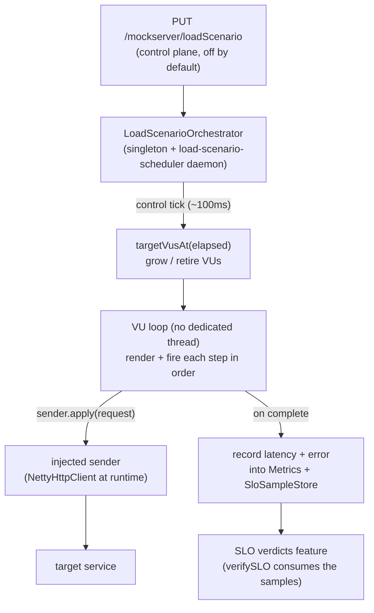

# Load Generation

> **TL;DR** — MockServer can drive API traffic at a target on demand. A **load scenario**
> (`PUT /mockserver/loadScenario`) is an ordered list of templated request *steps* fired at a
> target concurrency described by a *ramp profile*, with per-iteration data variation. It is a pure
> **SLI producer**: it records latency/error samples into the metrics histograms and the SLO sample
> store (so [SLO verdicts](slo-verdicts.md) can read load-driven SLIs) but contains no verdict logic
> of its own. **Off by default** — the endpoint returns `403` until `loadGenerationEnabled=true`, and
> hard caps + a live in-flight semaphore and RPS token bucket prevent it self-DoSing the server.

## High-level flow



## Model

| Type | Purpose |
|------|---------|
| `LoadScenario` | name, ordered `steps`, `profile`, `templateType` (default `VELOCITY`), optional `maxRequests`. Modelled on `VerificationSequence`. |
| `LoadStep` | a `request` (reuses `HttpRequest`; template strings live in its fields) and an optional `thinkTime` (`Delay`) — inter-step pacing only. |
| `LoadProfile` | the ramp. `type` ∈ `{CONSTANT, LINEAR}`, `durationMillis`, and either `vus` (constant) or `startVus`/`endVus` (linear), plus optional `iterationPacingMillis`. |
| `IterationContext` | per-iteration template variable exposed under `iteration` (see below). |

### `iteration.*` template variable

A fresh `IterationContext` is built each iteration and injected under the key `iteration`, sibling of
`request`. Plain JavaBean getters, so `$iteration.index` (Velocity), `{{iteration.index}}` (Mustache)
and `iteration.getIndex()` (JavaScript) all resolve.

| Field | Meaning |
|-------|---------|
| `index` | global iteration index across all virtual users (0-based) |
| `vuId` | the launching virtual user's id (0-based) |
| `vuIteration` | the iteration count within that virtual user (0-based) |
| `elapsedMillis` | millis since the scenario started |
| `count` | total requests dispatched so far |

Only the request `path` and `body` are rendered in v1 (the most commonly templated fields). The render
path is a new internal overload (`TemplateEngine.renderTemplate(template, request, iteration)`); the
existing response/forward template path is untouched (it passes a `null` iteration).

## Ramp profile

`LoadProfile.targetVusAt(elapsedMillis)` is the single source of truth for the setpoint, read by the
control tick:

- **CONSTANT** → `vus` for the whole duration.
- **LINEAR** → `round(startVus + min(1, elapsed/duration) * (endVus − startVus))`, clamped at `endVus`.

`STEP` / `SPIKE` / `SOAK` are a deferred extension point.

## REST API

All three verbs are control-plane endpoints (subject to `controlPlaneRequestAuthenticated`).

| Verb | Path | Behaviour |
|------|------|-----------|
| `PUT` | `/mockserver/loadScenario` | Start. `403` when `loadGenerationEnabled=false`; `400 {error}` when invalid or a cap is exceeded; `200 {status:started,...}` otherwise. |
| `GET` | `/mockserver/loadScenario` | Status: `state` (running/completed/stopped/none), `elapsedMillis`, `currentVus`, `requestsSent`, `succeeded`, `failed`, `p50/p95/p99Millis`, `runId`, `startedAt`/`endedAt`. |
| `DELETE` | `/mockserver/loadScenario` | Stop (idempotent). |

### Example — CONSTANT with a templated step

```json
{
  "name": "checkout-load",
  "templateType": "VELOCITY",
  "maxRequests": 5000,
  "profile": { "type": "CONSTANT", "vus": 10, "durationMillis": 30000, "iterationPacingMillis": 50 },
  "steps": [
    {
      "request": {
        "method": "GET",
        "path": "/api/item/$iteration.index",
        "headers": { "Host": ["target.svc:8080"] },
        "socketAddress": { "host": "target.svc", "port": 8080, "scheme": "HTTP" }
      },
      "thinkTime": { "timeUnit": "MILLISECONDS", "value": 20 }
    }
  ]
}
```

### Example — LINEAR ramp

```json
{
  "name": "ramp-to-25",
  "profile": { "type": "LINEAR", "startVus": 1, "endVus": 25, "durationMillis": 60000 },
  "steps": [ { "request": { "path": "/health", "socketAddress": { "host": "target.svc", "port": 8080 } } } ]
}
```

## Timing and concurrency

The scheduler thread does **no I/O** — it only computes ramp setpoints and hands each request to the
injected sender, which returns a `CompletableFuture` immediately. Step and iteration pacing are
*scheduled* (`scheduler.schedule(nextStep, thinkTimeMillis, …)`), never `Thread.sleep`-ed via
`Delay.applyDelay()`, so a slow target never blocks a worker thread. There is **no dedicated thread per
virtual user**: a VU "loop" is a chain of `CompletableFuture` completion callbacks.

## Decoupling

`mockserver-core` must not depend on the Netty HTTP client, so the request sender is **injected** via
`LoadScenarioOrchestrator.setSender(Function<HttpRequest, CompletableFuture<HttpResponse>>)` — exactly
like `HttpState.setReplayHandler`. The Netty runtime wires it from
`HttpActionHandler.getHttpClient()` in `HttpRequestHandler`. Unit tests pass a deterministic synchronous
fake sender directly to `start(scenario, sender)`.

## Self-load guard

| Control | Where | Default |
|---------|-------|---------|
| Feature flag | `loadGenerationEnabled` → PUT returns `403` when off | `false` |
| Max virtual users | `validate()` (rejects oversized profile) | `50` |
| Max in-flight requests | live in-flight `Semaphore` at dispatch | `200` |
| Max requests/second | live token bucket at dispatch | `500` |
| Max duration | `validate()` | `3600000` (1 h) |
| Max steps | `validate()` | `50` |

## Relationship to SLO verdicts

Each completed request is recorded into the same forward-path metrics (`observeForwardRequest`) **and**
`SloSampleStore.getInstance().record(epochMillis, latencyMillis, isError, Scope.FORWARD, host)`. So a
load scenario produces the SLIs that `PUT /mockserver/verifySLO` ([SLO verdicts](slo-verdicts.md)) reads —
generate load, then assert a resilience verdict over the same window. Load generation owns *producing*
traffic; the SLO feature owns *judging* it.

> **Note:** `verifySLO` over a window that overlaps an active load scenario on the same host will include
> the load scenario's synthetic samples, because both real proxied traffic and load-scenario traffic record
> latency samples under `Scope.FORWARD` keyed by host. Scope or time-bound the verification window to exclude
> synthetic load if you need to assert only on real traffic.

## Deferred (not in v1)

- Advanced ramp shapes (`STEP`, `SPIKE`, `SOAK`).
- Distributed / multi-node load.
- In-scenario thresholds (owned by the SLO verdict feature).
- Programmatic cross-step capture (v1 uses template-side `$scenario.set/get`).
- Dashboard UI.
- Seeding scenarios from an OpenAPI spec or a recording.
