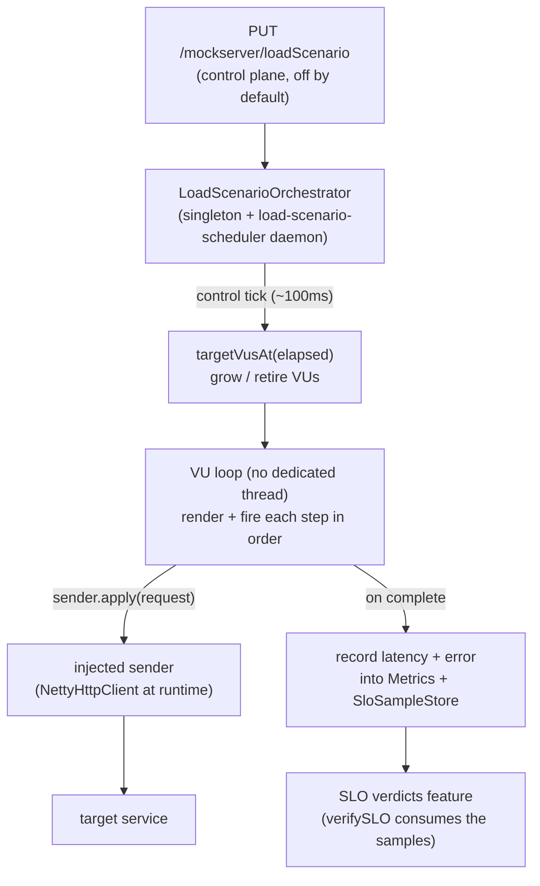

# Load Generation

> **TL;DR** — MockServer can drive API traffic at a target on demand. A **load scenario**
> (`PUT /mockserver/loadScenario`) is an ordered list of templated request *steps* fired at a
> target concurrency described by a *ramp profile*, with per-iteration data variation. It is a pure
> **SLI producer**: it records latency/error samples into the metrics histograms and the SLO sample
> store (so [SLO verdicts](slo-verdicts.md) can read load-driven SLIs) but contains no verdict logic
> of its own. **Off by default** — the endpoint returns `403` until `loadGenerationEnabled=true`, and
> hard caps + a live in-flight semaphore and RPS token bucket prevent it self-DoSing the server.

## High-level flow



## Model

| Type | Purpose |
|------|---------|
| `LoadScenario` | `name`, ordered `steps`, `profile`, `templateType` (default `VELOCITY`), optional `maxRequests`, optional `labels` (`Map<String,String>` — scenario-level custom metric labels). |
| `LoadStep` | a `request` (reuses `HttpRequest`; template strings live in its fields), an optional `thinkTime` (`Delay`) — inter-step pacing only, an optional `name` (used as the `route` metric label when set; otherwise the path is auto-templatized), and optional `labels` (`Map<String,String>` — step-level custom metric labels that override scenario labels for this step). |
| `LoadProfile` | the ramp. `type` ∈ `{CONSTANT, LINEAR}`, `durationMillis`, and either `vus` (constant) or `startVus`/`endVus` (linear), plus optional `iterationPacingMillis`. |
| `IterationContext` | per-iteration template variable exposed under `iteration` (see below). |

### `iteration.*` template variable

A fresh `IterationContext` is built each iteration and injected under the key `iteration`, sibling of
`request`. Plain JavaBean getters, so `$iteration.index` (Velocity), `{{iteration.index}}` (Mustache)
and `iteration.getIndex()` (JavaScript) all resolve.

| Field | Meaning |
|-------|---------|
| `index` | global iteration index across all virtual users (0-based) |
| `vuId` | the launching virtual user's id (0-based) |
| `vuIteration` | the iteration count within that virtual user (0-based) |
| `elapsedMillis` | millis since the scenario started |
| `count` | total requests dispatched so far |

Only the request `path` and `body` are rendered in v1 (the most commonly templated fields). The render
path is a new internal overload (`TemplateEngine.renderTemplate(template, request, iteration)`); the
existing response/forward template path is untouched (it passes a `null` iteration).

## Ramp profile

`LoadProfile.targetVusAt(elapsedMillis)` is the single source of truth for the setpoint, read by the
control tick:

- **CONSTANT** → `vus` for the whole duration.
- **LINEAR** → `round(startVus + min(1, elapsed/duration) * (endVus − startVus))`, clamped at `endVus`.

`STEP` / `SPIKE` / `SOAK` are a deferred extension point.

## REST API

All three verbs are control-plane endpoints (subject to `controlPlaneRequestAuthenticated`).

| Verb | Path | Behaviour |
|------|------|-----------|
| `PUT` | `/mockserver/loadScenario` | Start. `403` when `loadGenerationEnabled=false`; `400 {error}` when invalid or a cap is exceeded; `200 {status:started,...}` otherwise. |
| `GET` | `/mockserver/loadScenario` | Status: `state` (running/completed/stopped/none), `elapsedMillis`, `currentVus`, `requestsSent`, `succeeded`, `failed`, `p50/p95/p99Millis`, `runId`, `startedAt`/`endedAt`. |
| `DELETE` | `/mockserver/loadScenario` | Stop (idempotent). |

### Example — CONSTANT with a templated step

```json
{
  "name": "checkout-load",
  "templateType": "VELOCITY",
  "maxRequests": 5000,
  "profile": { "type": "CONSTANT", "vus": 10, "durationMillis": 30000, "iterationPacingMillis": 50 },
  "steps": [
    {
      "request": {
        "method": "GET",
        "path": "/api/item/$iteration.index",
        "headers": { "Host": ["target.svc:8080"] },
        "socketAddress": { "host": "target.svc", "port": 8080, "scheme": "HTTP" }
      },
      "thinkTime": { "timeUnit": "MILLISECONDS", "value": 20 }
    }
  ]
}
```

### Example — LINEAR ramp

```json
{
  "name": "ramp-to-25",
  "profile": { "type": "LINEAR", "startVus": 1, "endVus": 25, "durationMillis": 60000 },
  "steps": [ { "request": { "path": "/health", "socketAddress": { "host": "target.svc", "port": 8080 } } } ]
}
```

## Timing and concurrency

The scheduler thread does **no I/O** — it only computes ramp setpoints and hands each request to the
injected sender, which returns a `CompletableFuture` immediately. Step and iteration pacing are
*scheduled* (`scheduler.schedule(nextStep, thinkTimeMillis, …)`), never `Thread.sleep`-ed via
`Delay.applyDelay()`, so a slow target never blocks a worker thread. There is **no dedicated thread per
virtual user**: a VU "loop" is a chain of `CompletableFuture` completion callbacks.

## Decoupling

`mockserver-core` must not depend on the Netty HTTP client, so the request sender is **injected** via
`LoadScenarioOrchestrator.setSender(Function<HttpRequest, CompletableFuture<HttpResponse>>)` — exactly
like `HttpState.setReplayHandler`. The Netty runtime wires it from
`HttpActionHandler.getHttpClient()` in `HttpRequestHandler`. Unit tests pass a deterministic synchronous
fake sender directly to `start(scenario, sender)`.

## Self-load guard

All caps are configurable via `ConfigurationProperties` (system properties / env vars). The defaults below are starting points; raise them for larger load runs.

| Control | Property | Default |
|---------|----------|---------|
| Feature flag | `mockserver.loadGenerationEnabled` → PUT returns `403` when off | `false` |
| Max virtual users | `mockserver.loadGenerationMaxVirtualUsers` — `validate()` rejects oversized profiles | `50` |
| Max in-flight requests | `mockserver.loadGenerationMaxInFlightRequests` — live `Semaphore` at dispatch | `200` |
| Max requests/second | `mockserver.loadGenerationMaxRequestsPerSecond` — live token bucket at dispatch | `500` |
| Max duration | `mockserver.loadGenerationMaxDurationMillis` — `validate()` | `3600000` (1 h) |
| Max steps | `mockserver.loadGenerationMaxSteps` — `validate()` | `50` |

## Relationship to SLO verdicts

Each completed request is recorded into the same forward-path metrics (`observeForwardRequest`) **and**
`SloSampleStore.getInstance().record(epochMillis, latencyMillis, isError, Scope.FORWARD, host)`. So a
load scenario produces the SLIs that `PUT /mockserver/verifySLO` ([SLO verdicts](slo-verdicts.md)) reads —
generate load, then assert a resilience verdict over the same window. Load generation owns *producing*
traffic; the SLO feature owns *judging* it.

> **Note:** `verifySLO` over a window that overlaps an active load scenario on the same host will include
> the load scenario's synthetic samples, because both real proxied traffic and load-scenario traffic record
> latency samples under `Scope.FORWARD` keyed by host. Scope or time-bound the verification window to exclude
> synthetic load if you need to assert only on real traffic.

## Metrics & Observability

Every completed load-scenario dispatch is recorded into the `mock_server_load_*` Prometheus metric family **and** mirrored over OTLP by `OtelMetricsExporter`. This gives a real-time view of the injector alongside your system-under-test in Grafana/Datadog/Tempo without any external load tool. The family is registered whenever `metricsEnabled=true` (the `loadGenerationEnabled` flag only gates the PUT endpoint, not metric registration).

### Metric family

All per-request metrics carry **fixed structured labels** (`LOAD_FIXED_LABELS`) plus optional custom labels (see below):

```
scenario, run_id, step, route, method, status_class
```

| Metric name | Prom type | OTEL type | Labels | Description |
|-------------|-----------|-----------|--------|-------------|
| `mock_server_load_request_duration_seconds` | Histogram | DoubleHistogram | fixed + custom | Round-trip latency per dispatch; histogram buckets enable `histogram_quantile` at any percentile |
| `mock_server_load_requests` | Counter | LongCounter | fixed + custom | Completed dispatches |
| `mock_server_load_request_bytes` | Counter | LongCounter (`By`) | fixed + custom | Outbound request bytes |
| `mock_server_load_response_bytes` | Counter | LongCounter (`By`) | fixed + custom | Inbound response bytes |
| `mock_server_load_iterations` | Counter | LongCounter | `scenario`, `run_id` | Full iteration completions (one per VU loop) |
| `mock_server_load_throttled` | Counter | LongCounter | `scenario`, `run_id`, `reason` | Dispatches skipped by the self-load guard (`reason` = `inflight_cap` or `rate_limit`) |
| `mock_server_load_errors` | Counter | LongCounter | `scenario`, `run_id`, `kind` | Failed dispatches (`kind` = `render`, `connection`, `timeout`, `null_response`, `http_5xx`) |
| `mock_server_load_active_vus` | GaugeWithCallback | Observable gauge | `scenario`, `run_id` | Virtual users currently running |
| `mock_server_load_inflight_requests` | GaugeWithCallback | Observable gauge | `scenario`, `run_id` | Dispatches in flight at scrape time |

**Fixed label meanings:**

| Label | Value |
|-------|-------|
| `scenario` | The `name` field from `LoadScenario` |
| `run_id` | A UUID generated at scenario start (stable for the lifetime of one run; resets on each `PUT`) |
| `step` | Step index (0-based) or the step's `name` field when set |
| `route` | Auto-templatized path (see below) or the step's `name` field when set |
| `method` | HTTP method (`GET`, `POST`, …) |
| `status_class` | Response status class (`2xx`, `3xx`, `4xx`, `5xx`, or `unknown`) |

### Route-label templatizing

Raw request paths would create unbounded cardinality (`/orders/12345`, `/orders/12346`, …). `MetricLabels.routeOf(path)` collapses id-shaped segments to `{id}`:

- `/api/orders/12345` → `/api/orders/{id}`
- `/users/9f1c8e0a-1b2c-4d3e-8f90-abcdef012345` → `/users/{id}`
- `/v2/items/deadbeefcafebabe` → `/v2/items/{id}` (16+ hex chars)
- `/api/orders` → `/api/orders` (unchanged — no id-shaped segment)

A step with an explicit `name` field bypasses templatizing entirely — the name is used as both the `step` and `route` label. This is the recommended approach when a scenario hits many different paths that should be grouped together.

### `run_id` correlation

Each `PUT /mockserver/loadScenario` generates a fresh UUID `run_id`. It appears in:
- All `mock_server_load_*` metric labels (so all series for a run share one label value)
- The `GET /mockserver/loadScenario` status DTO (`runId` field)

Use `run_id` to filter or group metrics in PromQL/OTEL exactly to one scenario execution, even when multiple runs of the same scenario follow each other.

**Retention / eviction (bounded).** A completed run's `mock_server_load_*` series stay scrapeable until the next run starts, then are evicted (`Metrics.evictLoadRun(previousRunId)`), so at most one completed run's series are ever retained — the per-run UUID `run_id` labels do not accumulate unbounded in the Prometheus registry. The OTLP-exported per-run attribute sets are managed by the OTEL SDK's own aggregation/cardinality handling (the load counters are direct `LongCounter.add`, not callbacks), so they are not manually evicted.

### Custom labels

Scenario-level and step-level `labels` maps let you attach domain dimensions (environment, region, team, release) to metric series without hardcoding them in metric names.

**Prometheus** — the `mockserver.loadGenerationMetricLabels` property (comma-separated list) is an **allowlist** that controls which custom label keys are registered as Prometheus label names. Because Prometheus requires a fixed label schema at registration time, only keys present in the allowlist appear in the Prometheus series. Set this at startup (before the first `PUT /mockserver/loadScenario`).

```
# Example: allow env and region as custom labels
-Dmockserver.loadGenerationMetricLabels=env,region
```

Then in the scenario JSON:
```json
{
  "name": "checkout-load",
  "labels": { "env": "staging", "region": "eu-west-1" },
  "steps": [ { "name": "get-order", "labels": { "team": "orders" }, "request": { ... } } ]
}
```

**OTEL** — all custom labels from the scenario and step `labels` maps are attached as OTEL attributes unconditionally. No allowlist is required on the OTEL path, so arbitrary dimensions appear in your OTEL backend without a restart.

### Exemplars / trace-pivot

`mock_server_load_request_duration_seconds` attaches an OpenTelemetry exemplar carrying the W3C `trace_id` extracted from the upstream response's `traceparent` header (when present). This allows pivoting from a latency spike in Grafana directly to the corresponding distributed trace in Tempo — useful when the system under test propagates W3C Trace Context.

### Percentile queries

The status DTO (`GET /mockserver/loadScenario`) returns `p50Millis`, `p95Millis`, and `p99Millis` computed from the histogram buckets. Any other percentile is queryable via PromQL without a pre-defined summary:

```promql
histogram_quantile(0.99,
  sum by (le, scenario, run_id) (
    rate(mock_server_load_request_duration_seconds_bucket[1m])
  )
)
```

### Configuration

| Property | Default | Description |
|----------|---------|-------------|
| `mockserver.loadGenerationMetricLabels` | `""` (empty) | Comma-separated allowlist of custom label keys to expose in Prometheus. OTEL always receives all custom labels. |

## Deferred (not in v1)

- Advanced ramp shapes (`STEP`, `SPIKE`, `SOAK`, `STRESS`).
- Distributed / multi-node load.
- In-run thresholds (pass/fail decided during the run, as opposed to post-run `verifySLO`).
- Dashboard UI (coming next — `GET /mockserver/loadScenario` status already queryable via the REST API).
- Seeding scenarios from recorded traffic or an OpenAPI spec.
- Programmatic cross-step capture (v1 uses template-side `$scenario.set/get`).
