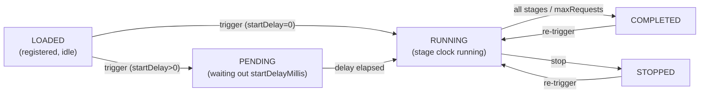
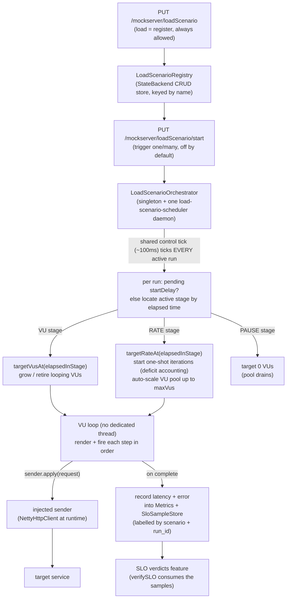

# Load Generation

> **TL;DR** — MockServer can drive API traffic at a target on demand, organised as a **registry of
> named load scenarios**. You **load** (register) a scenario by name with `PUT /mockserver/loadScenario`
> (this does *not* run it — it is staged in the `LOADED` state), then **trigger** one or many by name
> with `PUT /mockserver/loadScenario/start` to run them **concurrently**, each with its own optional
> **start delay**. A scenario is an ordered list of templated request *steps* driven through a sequence
> of *stages* (a **load profile**): each stage holds/ramps **virtual users** (`VU`, closed model),
> holds/ramps an **arrival rate** in iterations/second (`RATE`, open model), or **pauses**. It is a pure
> **SLI producer**: it records latency/error samples into the metrics histograms and the SLO sample
> store (so [SLO verdicts](slo-verdicts.md) can read load-driven SLIs) but contains no verdict logic of
> its own. **Loading is always allowed; triggering a run is off by default** — `start` returns `403`
> until `loadGenerationEnabled=true`, and hard caps + a live in-flight semaphore and RPS token bucket
> prevent it self-DoSing the server. Scenarios can be **preloaded at startup** from a JSON file
> (`loadScenarioInitializationJsonPath`).

## Registry & lifecycle

Scenarios live in a **registry** persisted in the `StateBackend` CRUD-entity store (namespace
`load-scenarios`, mirroring the saved chaos-profile library): they survive a `reset`, replicate across a
cluster, and can be preloaded. The unique key is the scenario **`name`** — loading the same name
replaces the prior definition. Each scenario has a per-run lifecycle state:



## High-level flow



### Multiple concurrent runs

The orchestrator holds a `Map<name, RunningScenario>` of **active runs**. A **single** shared
`load-scenario-scheduler` daemon thread ticks **every** active run each control tick (~100ms) — there is
one scheduler regardless of how many scenarios run. Each trigger gets a fresh `run_id` UUID, so the
`mock_server_load_*` metrics (which carry both `scenario` and `run_id` labels) keep concurrent runs
fully distinguishable; the `active_vus`/`inflight` gauge readers emit one series per `(scenario, run_id)`.
Re-triggering an already-active name **replaces** that run (and evicts its prior metric series, keeping
per-run series accumulation bounded). `recordResult` only writes durable series while the run is still
the registry's active run for its name, so a draining/replaced run cannot resurrect evicted series.

The `loadGenerationMaxConcurrentScenarios` cap (default 10) bounds how many scenarios may be active
(`PENDING` + `RUNNING`) at once; a trigger that would exceed it is rejected. The existing per-scenario
caps (max VUs/rate/stages/duration/steps) still apply to each scenario.

### Start delay

A triggered scenario with `startDelayMillis > 0` enters `PENDING` and fires no requests; the shared tick
checks the elapsed time against the orchestrator clock (the same injectable clock the engine uses, so
tests can drive it deterministically), and once the delay elapses it transitions to `RUNNING` and its
stage clock starts from that moment. `startDelayMillis == 0` runs immediately on trigger.

### Preloading at startup

Setting `loadScenarioInitializationJsonPath` to a JSON file containing an array of `LoadScenario`
definitions loads them into the registry in the `LOADED` state at startup (mirroring the
`initializationJsonPath` expectation mechanism). MockServer boots with scenarios staged and ready to be
triggered by name. Preloading is fail-soft: an invalid definition logs a WARN and is skipped.

## Model

| Type | Purpose |
|------|---------|
| `LoadScenario` | `name`, ordered `steps`, `profile`, `templateType` (default `VELOCITY`), optional `maxRequests`, optional `labels` (`Map<String,String>` — scenario-level custom metric labels). |
| `LoadStep` | a `request` (reuses `HttpRequest`; template strings live in its fields), an optional `thinkTime` (`Delay`) — inter-step pacing only, an optional `name` (used as the `route` metric label when set; otherwise the path is auto-templatized), and optional `labels` (`Map<String,String>` — step-level custom metric labels that override scenario labels for this step). |
| `LoadProfile` | a `List<LoadStage> stages` run in sequence. |
| `LoadStage` | one slice of the run: a `type` ∈ `{VU, RATE, PAUSE}`, a required `durationMillis` (> 0), an optional `curve` ∈ `{LINEAR, EXPONENTIAL, QUADRATIC}` (ramps only; default `LINEAR`), and the setpoint fields for its type (see below). |
| `RampCurve` | the interpolation helper. `valueAt(start, end, p)` is the single tested place the curve math lives, for both the VU driver and the rate scheduler. |
| `IterationContext` | per-iteration template variable exposed under `iteration` (see below). |

### `iteration.*` template variable

A fresh `IterationContext` is built each iteration and injected under the key `iteration`, sibling of
`request`. Plain JavaBean getters, so `$iteration.index` (Velocity), `{{iteration.index}}` (Mustache)
and `iteration.getIndex()` (JavaScript) all resolve.

| Field | Meaning |
|-------|---------|
| `index` | global iteration index across all virtual users (0-based) |
| `vuId` | the launching virtual user's id (0-based) |
| `vuIteration` | the iteration count within that virtual user (0-based) |
| `elapsedMillis` | millis since the scenario started |
| `count` | total requests dispatched so far |
| `captured` | per-iteration cross-step captured variables (a `Map<String,String>`); see [Cross-step capture / correlation](#cross-step-capture--correlation) |

The request `path`, `body` **and header values** are rendered (the most commonly templated fields). The
render path is an internal overload (`TemplateEngine.renderTemplate(template, request, iteration)`); the
existing response/forward template path is untouched (it passes a `null` iteration).

## Cross-step capture / correlation

A later step often needs a value produced by an earlier step — the classic case is a **login step that
returns a token** which subsequent steps must send as a bearer credential. Each `LoadStep` can declare
`captures`: rules that extract a value from **that step's response** and bind it to a named variable that
later steps read from their templated request fields.

### Scope — per-iteration

The captured-variable map is **per-iteration**: it is created fresh at the start of every iteration (one
virtual user's single pass through the ordered steps — i.e. one user "session"), threaded through that
iteration's chained step dispatches, and **never shared** across virtual users or across a VU's
successive iterations. This is the correct, race-free correlation scope: each simulated user gets its own
token. A value captured in step 1 is visible to steps 2..N of the *same* iteration only.

### Capture sources

A `LoadCapture` has a `name` (the variable), a `source`, an `expression`, and an optional `defaultValue`:

| `source` | `expression` is | Extracts |
|----------|-----------------|----------|
| `BODY_JSONPATH` | a JSONPath | the JSONPath result over the response body (single-element lists are unwrapped; scalars stringified) |
| `HEADER` | a header name | the first value of that response header |
| `BODY_REGEX` | a regex | capture **group 1** of the first match over the response body string |

Capture is **best-effort and never fails the run**: on no match (or any extraction error — logged at
debug) the variable falls back to `defaultValue` when set, otherwise it is left unset.

### Referencing captured variables

Captured variables are exposed on the `iteration` template object under `captured`, so a subsequent
step references them by key — in the **path, body, and header** templates:

- Velocity: `$iteration.captured.token`
- Mustache: `{{iteration.captured.token}}`

Both engines resolve a member access on a `Map<String,String>` getter (`IterationContext.getCaptured()`)
by key, so the syntax is uniform across them.

### Example — login → token → authenticated call

```json
{
  "name": "login-then-fetch",
  "templateType": "MUSTACHE",
  "profile": { "stages": [ { "type": "VU", "targetVus": 5, "durationMillis": 30000 } ] },
  "steps": [
    {
      "request": {
        "method": "POST",
        "path": "/login",
        "headers": { "Host": [ "api" ] },
        "body": { "username": "user{{iteration.vuId}}", "password": "pw" }
      },
      "captures": [
        { "name": "token", "source": "BODY_JSONPATH", "expression": "$.token" }
      ]
    },
    {
      "request": {
        "method": "GET",
        "path": "/account",
        "headers": {
          "Host": [ "api" ],
          "Authorization": [ "Bearer {{iteration.captured.token}}" ]
        }
      }
    }
  ]
}
```

Step 1 logs in and captures the response body's `$.token` into `token`; step 2 — same iteration — sends
it as `Authorization: Bearer <token>`. With 5 VUs, each VU's iterations each capture and replay their own
token independently.

## Stages, arrival-rate and curves

A `LoadProfile` is an **ordered list of stages run in sequence**. The control tick locates the active
stage by elapsed time (`elapsed` vs the running sum of stage durations), computes `elapsedInStage`, and
applies that stage's setpoint. The run ends after the last stage (or when `maxRequests` is hit, or on
stop). The total run length is the sum of the stage durations.

### Stage types — open vs closed model

| Stage `type` | Model | Setpoint | What the orchestrator does |
|------|-------|----------|----------------------------|
| `VU` | **closed** | virtual users | Maintains a pool of *looping* VUs sized to `targetVusAt(elapsedInStage)`; each VU loops the steps back-to-back. Throughput is whatever the target can sustain. Surplus VUs retire at their iteration boundary. |
| `RATE` | **open** (arrival rate) | iterations/second | Starts new *one-shot* iterations so the cumulative number started tracks the integral of the rate; auto-scales a VU pool up to `maxVus` to run them. Throughput is the *requested rate*, independent of how fast the target responds. |
| `PAUSE` | — | none | Drives no load (`target 0 VUs`); any looping VUs drain, then the next stage starts cold. |

The two models answer different questions. A **VU stage** asks "how does the target behave with N
concurrent clients?" — a slow target self-throttles because each VU waits for its response before
looping. A **RATE stage** asks "how does the target behave at R requests/second?" — the injector keeps
opening new iterations on schedule even when the target is slow, exposing queue build-up and tail
latency the closed model hides (k6's `constant-arrival-rate` / `ramping-arrival-rate` executors).

### Setpoint functions

`LoadStage.targetVusAt(elapsedInStage)` and `LoadStage.targetRateAt(elapsedInStage)` are the pure,
deterministic setpoints read by the control tick:

- **hold** (`vus` / `rate` set) → the constant value for the whole stage.
- **ramp** (`startVus`+`endVus` / `startRate`+`endRate` set) → `curve.valueAt(start, end, progress)`
  where `progress = min(1, elapsedInStage / durationMillis)` (clamped, so the stage stays pinned at the
  end value after its duration). VU ramps are rounded to the nearest integer.

### Ramp curves

`RampCurve.valueAt(start, end, p)` (with `p` clamped to `[0,1]`) is the single tested place the curve
math lives. Every curve is exact at the endpoints (`valueAt(s,e,0)==s`, `valueAt(s,e,1)==e`):

| Curve | Formula | Shape |
|-------|---------|-------|
| `LINEAR` | `start + (end−start)·p` | constant slope |
| `QUADRATIC` | `start + (end−start)·p²` | ease-in (slow then fast) |
| `EXPONENTIAL` | `start + (end−start)·(e^{Kp}−1)/(e^{K}−1)`, `K=4` | steeper ease-in; the normalised form is exact at the endpoints and handles `start=0` correctly |

### Arrival-rate scheduler (deficit accounting)

The RATE scheduler keeps a fractional `rateDeficit` accumulator, only touched on the single scheduler
thread. Each control tick:

1. adds `targetRate · dtSeconds` owed iterations (where `dt` is the time since the last tick),
2. starts `floor(rateDeficit)` new one-shot iterations, each occupying one auto-scaled VU slot,
3. carries the fractional remainder forward — so the *achieved* long-run rate equals the target rate
   exactly, independent of the 100 ms tick granularity.

If the VU pool is already at the stage's `maxVus` (or the global `loadGenerationMaxVirtualUsers`), the
owed-but-unstartable iterations are **dropped** (the deficit is clamped so it can't snowball) and each
shortfall increments `mock_server_load_throttled{reason="rate_limit"}`, so an operator can see the
injector could not meet the requested rate. Caps are never exceeded.

Sequences and pauses compose freely — e.g. a VU warm-up, then a pause, then a ramping-arrival-rate
soak, then a constant-rate hold — up to `loadGenerationMaxStages` stages.

### Named load shapes

A profile may instead carry a single declarative **shape** (`LoadShape`) describing a common traffic
pattern by name, rather than spelling out every stage. A shape is **pure sugar**: `LoadShapes.expand`
turns it into ordinary `LoadStage`s, and `LoadProfile.getStages()` returns that expansion — so the
orchestrator, the validator, and every cap check run unchanged. A profile uses **either** an explicit
`stages` list **or** a `shape`; if both are set the explicit stages win (the shape is ignored).

Each shape drives one **metric** — `VU` (concurrent virtual users, closed model; expands to `VU`
stages, setpoints rounded to whole VUs) or `RATE` (arrival rate in iterations/second, open model;
expands to `RATE` stages, fractional rates preserved). Expanded `RATE` stages leave `maxVus` unset, so
the global `loadGenerationMaxVirtualUsers` cap governs the auto-scaled VU pool — a shape never imposes
its own lower cap.

| Shape | Expands into | Parameters (only these are read) |
|-------|--------------|----------------------------------|
| `SPIKE` | ramp `baseline→peak`, hold `peak`, ramp `peak→baseline`, optional hold `baseline` | `baseline`, `peak`, `rampUpMillis`, `holdMillis`, `rampDownMillis`, optional `recoveryHoldMillis`; `curve` shapes both ramps |
| `STAIRS` | for `i` in `0..steps-1`: a **pure hold** at `start + i*step` for `stepDurationMillis` (discrete steps, no inter-step ramp) | `start`, `step`, `steps`, `stepDurationMillis` |
| `RAMP_HOLD` | ramp `0→target` along `curve`, then hold `target` | `target`, `rampMillis`, `holdMillis`, optional `curve` (default `LINEAR`) |

Any zero/absent duration (or zero `steps`) simply drops that stage from the expansion, so e.g. a SPIKE
with `rampDownMillis=0` expands to ramp-up + hold only. A shape whose parameters expand to **no**
stages — or whose expansion exceeds a cap (max stages, peak VUs/rate, total duration) — is rejected by
`validate` with a clear error, because validation runs over the expanded stages exactly as it does for
explicit ones.

## REST API

All endpoints are control-plane endpoints (subject to `controlPlaneRequestAuthenticated`). The model is
**load (register) → trigger (run) by name**.

| Verb | Path | Behaviour |
|------|------|-----------|
| `PUT` | `/mockserver/loadScenario` | **Load/register** a scenario by `name` (does NOT run). Allowed even when `loadGenerationEnabled=false`. `400 {error}` when invalid or a cap is exceeded; `200 {status:loaded, name, state:LOADED}` otherwise. Loading the same name replaces. |
| `PUT` | `/mockserver/loadScenario/generateFromOpenAPI` | **Seed** a scenario from an OpenAPI spec, then load/register it (does NOT run, allowed when disabled). Body `{name, specUrlOrPayload, target?, profile?}`. One step per operation; returns the generated scenario for editing. See [Seed a scenario from an OpenAPI spec](#seed-a-scenario-from-an-openapi-spec). |
| `PUT` | `/mockserver/loadScenario/generateFromRecording` | **Seed** a scenario from recorded proxy traffic, then load/register it (does NOT run, allowed when disabled). Body `{name, mode?, requestFilter?, maxSteps?, target?, profile?}`. `VERBATIM` (default) = one step per recorded request; `TEMPLATIZED` = one step per unique route. Returns the generated scenario for editing. See [Seed a scenario from recorded traffic](#seed-a-scenario-from-recorded-traffic). |
| `GET` | `/mockserver/loadScenario` | List ALL registered scenarios: `{ scenarios:[ { name, state, startDelayMillis, definition, ...live status fields when active/run } ] }`. State ∈ `LOADED/PENDING/RUNNING/COMPLETED/STOPPED`. |
| `GET` | `/mockserver/loadScenario/{name}` | One scenario (definition + state + status); `404` if not registered. |
| `GET` | `/mockserver/loadScenario/{name}/report` | **End-of-run summary report** for the run (live snapshot if running, retained terminal snapshot if finished). JSON by default; `?format=junit` returns a JUnit-XML `<testsuite>` with `application/xml`. `404` if the scenario never ran. See [Summary report](#summary-report). |
| `DELETE` | `/mockserver/loadScenario/{name}` | Remove from the registry (stops it first if running). |
| `DELETE` | `/mockserver/loadScenario` | Clear the whole registry (stops all running). |
| `PUT` | `/mockserver/loadScenario/start` | **Trigger** registered scenario(s) to run. Body `{names:[...]}` or `{name:"a"}`. Requires `loadGenerationEnabled` (else `403`); `404` if a name isn't registered; `400` if it would exceed `loadGenerationMaxConcurrentScenarios`. Returns the triggered names + resulting states (`PENDING`/`RUNNING`). |
| `PUT` | `/mockserver/loadScenario/stop` | Stop running scenario(s). Body `{names:[...]}`, `{all:true}`, or empty (stop all). Stopped scenarios stay registered (`STOPPED`) and can be re-triggered. |

### Example — load then start (one scenario)

```bash
# 1) load (register) — does not run
curl -X PUT http://localhost:1080/mockserver/loadScenario -d '{ "name": "checkout-load", ... }'
#    -> { "status": "loaded", "name": "checkout-load", "state": "LOADED" }

# 2) trigger it to run (requires loadGenerationEnabled=true)
curl -X PUT http://localhost:1080/mockserver/loadScenario/start -d '{ "name": "checkout-load" }'
#    -> { "status": "started", "started": [ { "name": "checkout-load", "state": "RUNNING" } ] }

# 3) watch it
curl http://localhost:1080/mockserver/loadScenario/checkout-load

# 4) stop it (stays registered, STOPPED)
curl -X PUT http://localhost:1080/mockserver/loadScenario/stop -d '{ "name": "checkout-load" }'
```

Trigger several at once — each honours its own `startDelayMillis`:

```bash
curl -X PUT http://localhost:1080/mockserver/loadScenario/start \
  -d '{ "names": ["checkout-load", "background-poller"] }'
```

### Example — VU ramp then hold (closed model)

```json
{
  "name": "checkout-load",
  "templateType": "VELOCITY",
  "maxRequests": 5000,
  "profile": {
    "stages": [
      { "type": "VU", "startVus": 1, "endVus": 10, "durationMillis": 30000, "curve": "LINEAR" },
      { "type": "VU", "vus": 10, "durationMillis": 60000 }
    ]
  },
  "steps": [
    {
      "request": {
        "method": "GET",
        "path": "/api/item/$iteration.index",
        "headers": { "Host": ["target.svc:8080"] },
        "socketAddress": { "host": "target.svc", "port": 8080, "scheme": "HTTP" }
      },
      "thinkTime": { "timeUnit": "MILLISECONDS", "value": 20 }
    }
  ]
}
```

### Example — arrival-rate ramp + hold, with a pause (open model)

```json
{
  "name": "rate-soak",
  "profile": {
    "stages": [
      { "type": "VU", "vus": 2, "durationMillis": 10000 },
      { "type": "PAUSE", "durationMillis": 5000 },
      { "type": "RATE", "startRate": 10, "endRate": 200, "durationMillis": 30000, "curve": "EXPONENTIAL", "maxVus": 40 },
      { "type": "RATE", "rate": 200, "durationMillis": 60000 }
    ]
  },
  "steps": [ { "request": { "path": "/health", "socketAddress": { "host": "target.svc", "port": 8080 } } } ]
}
```

## Seed a scenario from an OpenAPI spec

`PUT /mockserver/loadScenario/generateFromOpenAPI` turns an OpenAPI specification into an editable,
immediately-runnable `LoadScenario` and registers it in the `LOADED` state — it generates **no traffic**
and (like `PUT /loadScenario`) is allowed even when `loadGenerationEnabled=false`. The generated scenario
is returned in the response so a client/UI can show and edit it before triggering a run.

`LoadScenarioFromOpenAPI.generate(...)` reuses the **same OpenAPI parse** the expectation converter uses
(`OpenAPIParser.buildOpenAPI` + `OpenAPISerialiser.retrieveOperations`) and the **same example engine**
(`ExampleBuilder`), so steps line up with what `PUT /mockserver/openapi/expectation` would mock:

- **one `LoadStep` per operation**, in the stable path-then-method order, each with the operation's
  method and server-prefixed path;
- a **representative request-body example** (built from the request-body schema) plus a `Content-Type`
  header, for operations that declare a body;
- **plain, ordered steps** — no per-step weighting in v1.

### Request body

```json
{
  "name": "petstore-load",
  "specUrlOrPayload": "https://raw.githubusercontent.com/OAI/OpenAPI-Specification/master/examples/v3.0/petstore.yaml",
  "target": { "host": "petstore.svc", "port": 8080, "scheme": "http" },
  "profile": { "stages": [ { "type": "VU", "vus": 5, "durationMillis": 30000 } ] }
}
```

`specUrlOrPayload` is accepted **identically to `PUT /mockserver/openapi/expectation`** — an inline
JSON/YAML payload (string or embedded object), a URL, or a file/classpath reference. `target` and
`profile` are optional.

### Target precedence

Each step's target is carried as the request's `Host` header and `secure` flag (the routing surface every
load step uses), resolved by this precedence:

1. an explicit `target` (with a `host`) in the request body — wins;
2. otherwise the spec's `servers[0]` URL — its host, port and `https` scheme are applied;
3. otherwise the request is left **path-only** — the operator edits in a target before running.

### Default profile

When no `profile` is supplied a conservative default is applied — a single short constant-VU stage
(5 VUs for 30s) — so the scenario runs out of the box yet stays safe. Edit the returned profile (ramps,
rate stages, duration) before scaling up.

```bash
curl -X PUT http://localhost:1080/mockserver/loadScenario/generateFromOpenAPI \
  -d '{ "name": "petstore-load", "specUrlOrPayload": "https://.../petstore.yaml" }'
#  -> { "status":"loaded", "name":"petstore-load", "state":"LOADED", "scenario": { ...editable... } }

# then edit if needed and trigger as usual
curl -X PUT http://localhost:1080/mockserver/loadScenario/start -d '{ "name": "petstore-load" }'
```

A missing `name`/`specUrlOrPayload`, an unparseable spec, a spec with no operations, or a generated
scenario that fails validation all return `400 {error}`.

## Seed a scenario from recorded traffic

`PUT /mockserver/loadScenario/generateFromRecording` turns traffic **previously recorded by MockServer
in proxy/recording mode** into an editable, immediately-runnable `LoadScenario` and registers it in the
`LOADED` state — it generates **no traffic** and (like `PUT /loadScenario`) is allowed even when
`loadGenerationEnabled=false`. The generated scenario is returned so a client/UI can show and edit it
before triggering a run. This is the **record-to-load** flow: capture real traffic through the proxy,
then replay its shape as a load test.

`LoadScenarioFromRecording.generate(...)` reuses the **same recorded-request retrieval** the recorded-
requests control plane uses (`MockServerEventLog.retrieveRequests`, the `RECEIVED_REQUEST` entries),
optionally narrowed by a `requestFilter`, and the **same route templatizer** the metrics layer uses
(`MetricLabels.routeOf`).

### Modes

| Mode | Steps produced |
|------|----------------|
| `VERBATIM` (default) | One `LoadStep` per recorded request, **in recorded order**, preserving the concrete path, body and headers. An optional `maxSteps` keeps only the first N recorded requests (the orchestrator's `loadGenerationMaxSteps` also caps). |
| `TEMPLATIZED` | Recorded requests are **deduplicated by `(method, templatised-path)`** — id-shaped segments such as `/orders/123` collapse to `/orders/{id}` — keeping one representative example per unique route, **ordered by descending hit frequency** (most-hit routes first). One step per unique route. No per-step weight is added. |

### Request body

```json
{
  "name": "replay-prod-traffic",
  "mode": "TEMPLATIZED",
  "requestFilter": { "path": "/orders/.*" },
  "maxSteps": 100,
  "target": { "host": "staging.svc", "port": 8080, "scheme": "http" },
  "profile": { "stages": [ { "type": "VU", "vus": 5, "durationMillis": 30000 } ] }
}
```

All fields except `name` are optional. `requestFilter` is a standard **HttpRequest matcher** — when
present only the recorded requests it matches are converted; when absent **all** recorded requests are
used. `maxSteps` applies to `VERBATIM` (`TEMPLATIZED` is naturally bounded by the number of unique routes).

### Target precedence

Each step's target is carried as the request's `Host` header and `secure` flag, resolved by this
precedence:

1. an explicit `target` (with a `host`) in the request body — applied to **every** step (its `Host`
   header is replaced and the `secure` flag set from the scheme);
2. otherwise each recorded request's **own routing is left untouched** — recorded proxied requests
   already carry their upstream target.

### Default profile

When no `profile` is supplied the same conservative default as the OpenAPI seeder is applied — a single
short constant-VU stage (5 VUs for 30s) — so the scenario runs out of the box yet stays safe. Edit the
returned profile before scaling up.

```bash
# record some traffic through the proxy first, then:
curl -X PUT http://localhost:1080/mockserver/loadScenario/generateFromRecording \
  -d '{ "name": "replay-prod-traffic", "mode": "TEMPLATIZED" }'
#  -> { "status":"loaded", "name":"replay-prod-traffic", "state":"LOADED", "scenario": { ...editable... } }

# then edit if needed and trigger as usual
curl -X PUT http://localhost:1080/mockserver/loadScenario/start -d '{ "name": "replay-prod-traffic" }'
```

A missing `name`, no recorded requests to convert (none recorded, or none matching `requestFilter`), an
invalid `mode`, or a generated scenario that fails validation all return `400 {error}`.

> Frequency-proportional **weighting** of routes (firing hotter routes more often within a run) is a
> separate weighted-flows enhancement — `TEMPLATIZED` today emits ordered, unweighted steps.

## Timing and concurrency

The scheduler thread does **no I/O** — it only computes ramp setpoints and hands each request to the
injected sender, which returns a `CompletableFuture` immediately. Step and iteration pacing are
*scheduled* (`scheduler.schedule(nextStep, thinkTimeMillis, …)`), never `Thread.sleep`-ed via
`Delay.applyDelay()`, so a slow target never blocks a worker thread. There is **no dedicated thread per
virtual user**: a VU "loop" is a chain of `CompletableFuture` completion callbacks.

## Decoupling

`mockserver-core` must not depend on the Netty HTTP client, so the request sender is **injected** via
`LoadScenarioOrchestrator.setSender(Function<HttpRequest, CompletableFuture<HttpResponse>>)` — exactly
like `HttpState.setReplayHandler`. The Netty runtime wires it from
`HttpActionHandler.getHttpClient()` in `HttpRequestHandler`. Unit tests pass a deterministic synchronous
fake sender directly to `start(scenario, sender)`.

## Self-load guard

All caps are configurable via `ConfigurationProperties` (system properties / env vars). The defaults below are starting points; raise them for larger load runs.

| Control | Property | Default |
|---------|----------|---------|
| Feature flag | `mockserver.loadGenerationEnabled` → PUT returns `403` when off | `false` |
| Max virtual users | `mockserver.loadGenerationMaxVirtualUsers` — `validate()` rejects oversized stages (VU and RATE `maxVus`) | `50` |
| Max arrival rate | `mockserver.loadGenerationMaxRate` — `validate()` rejects RATE stages over this iterations/second | `5000` |
| Max stages | `mockserver.loadGenerationMaxStages` — `validate()` rejects profiles with more stages | `20` |
| Max in-flight requests | `mockserver.loadGenerationMaxInFlightRequests` — live `Semaphore` at dispatch | `200` |
| Max requests/second | `mockserver.loadGenerationMaxRequestsPerSecond` — live token bucket at dispatch | `500` |
| Max duration | `mockserver.loadGenerationMaxDurationMillis` — `validate()` on the total of all stage durations | `3600000` (1 h) |
| Max steps | `mockserver.loadGenerationMaxSteps` — `validate()` | `50` |

## Relationship to SLO verdicts

Each completed request is recorded into the same forward-path metrics (`observeForwardRequest`) **and**
`SloSampleStore.getInstance().record(epochMillis, latencyMillis, isError, Scope.FORWARD, host)`. So a
load scenario produces the SLIs that `PUT /mockserver/verifySLO` ([SLO verdicts](slo-verdicts.md)) reads —
generate load, then assert a resilience verdict over the same window. Load generation owns *producing*
traffic; the SLO feature owns *judging* it.

> **Note:** `verifySLO` over a window that overlaps an active load scenario on the same host will include
> the load scenario's synthetic samples, because both real proxied traffic and load-scenario traffic record
> latency samples under `Scope.FORWARD` keyed by host. Scope or time-bound the verification window to exclude
> synthetic load if you need to assert only on real traffic.

## In-run thresholds (pass/fail verdicts)

A scenario can carry **in-run thresholds** that are evaluated *while the run executes* and yield a
PASS/FAIL verdict — independent of, and complementary to, post-run `verifySLO`. Use them to fail a CI
load test the moment a metric breaches its budget.

- **Model** — `LoadScenario.thresholds` is a list of `LoadThreshold`, each a `{metric, comparator,
  threshold}` triple. `metric` is one of `LATENCY_P50/P95/P99/P999` (milliseconds), `ERROR_RATE` (a
  0–1 fraction) or `THROUGHPUT_RPS` (requests/second). `comparator` reuses the SLO feature's
  `SloObjective.Comparator` (`LESS_THAN`, `LESS_THAN_OR_EQUAL`, `GREATER_THAN`,
  `GREATER_THAN_OR_EQUAL`). The verdict is **PASS iff every threshold holds, FAIL if any breaches**.
- **Per-run evaluation, not the global SLO store** — thresholds are computed on each control tick from
  *this run's own* data: latency percentiles from a `copy()` of the run's HDR `latencyHistogram`,
  `ERROR_RATE = failed / max(1, requestsSent)`, and `THROUGHPUT_RPS = requestsSent /
  max(0.001s, elapsed/1000)`. This deliberately does **not** read `SloSampleStore`, which aggregates
  *all* forward traffic rather than this one run. The verdict stays `null` until at least one request
  has completed (a run is never failed on zero samples), and is always `null` for a scenario with no
  thresholds (unchanged behaviour).
- **`abortOnFail` + `abortGraceMillis`** — when `abortOnFail` is true, a FAIL verdict stops the run
  early (terminal `STOPPED` state, `abortedByThreshold` set) via the normal stop path, carrying the
  final FAIL verdict and breach detail. `abortGraceMillis` suppresses the *abort action* for the first
  N ms of the run so noisy startup samples cannot trigger a premature abort (analogous to k6's
  `delayAbortEval`); thresholds are still evaluated and a verdict still reported during the grace
  window. `abortOnFail` defaults to false (the run always finishes its stages); a normally-completed
  run does a final evaluation so it carries PASS/FAIL.
- **Status DTO** — `LoadScenarioStatus` (the `GET /mockserver/loadScenario` list entry) exposes
  `verdict` (`"PASS"`/`"FAIL"`/absent), `abortedByThreshold`, and `thresholdResults` (each `{metric,
  comparator, threshold, observed, satisfied}`).
- **CI mapping** — clients should map a terminal `verdict == FAIL` to a non-zero process exit code so a
  breached load test fails the pipeline. (The client convenience methods that do this are a later wave;
  for now poll the status and inspect `verdict` directly.)

## Summary report

`GET /mockserver/loadScenario/{name}/report` produces an **end-of-run summary report** derived from the
run's status snapshot — the live snapshot while running, or the **retained terminal snapshot** once
finished (so you can fetch the report after a `COMPLETED`/`STOPPED` run). `404` if the scenario never
ran. The report is built by `org.mockserver.load.LoadScenarioReport` purely from existing
`LoadScenarioStatus` fields (it adds no hot-path tracking).

Two renderings of the same data:

- **JSON** (default) — `{ scenario, runId, state, verdict, abortedByThreshold, timing:{
  startedAtEpochMillis, endedAtEpochMillis, durationMillis }, counts:{ requestsSent, succeeded, failed,
  droppedIterations, errorRate }, latencyMillis:{ p50, p95, p99, p999 }, thresholdResults:[ { metric,
  comparator, threshold, observed, satisfied } ] }`. `errorRate = failed / max(1, requestsSent)`.
- **JUnit XML** (`?format=junit`, `application/xml`) — a `<testsuite name="load:{scenario}" tests=…
  failures=… time={durationSeconds}>` with one `<testcase name="threshold: {metric} {comparator}
  {threshold}">` per threshold (a breach adds a `<failure>`), plus a `<testcase name="run completed">`
  that fails when the run was `abortedByThreshold`, carries a `FAIL` verdict, or stopped with request
  failures. p95/p99/error-rate (and the other counts/percentiles) are emitted as `<properties>` and a
  `<system-out>` line so CI consumers (Buildkite, JUnit) render them. The scenario name and all messages
  are XML-escaped, so a name containing `& < > " '` is safe.

```bash
# JSON report for a finished run
curl http://localhost:1080/mockserver/loadScenario/checkout-load/report

# JUnit XML — drop into a CI test-report artifact so a breached threshold fails the build
curl 'http://localhost:1080/mockserver/loadScenario/checkout-load/report?format=junit' \
  -o load-report.xml
```

## Metrics & Observability

Every completed load-scenario dispatch is recorded into the `mock_server_load_*` Prometheus metric family **and** mirrored over OTLP by `OtelMetricsExporter`. This gives a real-time view of the injector alongside your system-under-test in Grafana/Datadog/Tempo without any external load tool. The family is registered whenever `metricsEnabled=true` (the `loadGenerationEnabled` flag only gates the PUT endpoint, not metric registration).

### Metric family

All per-request metrics carry **fixed structured labels** (`LOAD_FIXED_LABELS`) plus optional custom labels (see below):

```
scenario, run_id, step, route, method, status_class
```

| Metric name | Prom type | OTEL type | Labels | Description |
|-------------|-----------|-----------|--------|-------------|
| `mock_server_load_request_duration_seconds` | Histogram | DoubleHistogram | fixed + custom | Round-trip latency per dispatch, **coordinated-omission-corrected** — measured from the iteration's scheduled-due time (before the in-flight permit / RPS-token acquire), so it includes any queue wait the self-load guard imposes when the target is overloaded. Histogram buckets enable `histogram_quantile` at any percentile |
| `mock_server_load_requests` | Counter | LongCounter | fixed + custom | Completed dispatches |
| `mock_server_load_request_bytes` | Counter | LongCounter (`By`) | fixed + custom | Outbound request bytes |
| `mock_server_load_response_bytes` | Counter | LongCounter (`By`) | fixed + custom | Inbound response bytes |
| `mock_server_load_iterations` | Counter | LongCounter | `scenario`, `run_id` | Full iteration completions (one per VU loop) |
| `mock_server_load_throttled` | Counter | LongCounter | `scenario`, `run_id`, `reason` | Dispatches skipped by the self-load guard (`reason` = `inflight_cap` or `rate_limit`) |
| `mock_server_load_errors` | Counter | LongCounter | `scenario`, `run_id`, `kind` | Failed dispatches (`kind` = `render`, `connection`, `timeout`, `null_response`, `http_5xx`) |
| `mock_server_load_active_vus` | GaugeWithCallback | Observable gauge | `scenario`, `run_id` | Virtual users currently running |
| `mock_server_load_inflight_requests` | GaugeWithCallback | Observable gauge | `scenario`, `run_id` | Dispatches in flight at scrape time |

**Fixed label meanings:**

| Label | Value |
|-------|-------|
| `scenario` | The `name` field from `LoadScenario` |
| `run_id` | A UUID generated each time the scenario is **triggered** (stable for the lifetime of one run; a fresh UUID on every re-trigger, so concurrent runs of different scenarios are fully distinguishable) |
| `step` | Step index (0-based) or the step's `name` field when set |
| `route` | Auto-templatized path (see below) or the step's `name` field when set |
| `method` | HTTP method (`GET`, `POST`, …) |
| `status_class` | Response status class (`2xx`, `3xx`, `4xx`, `5xx`, or `unknown`) |

### Route-label templatizing

Raw request paths would create unbounded cardinality (`/orders/12345`, `/orders/12346`, …). `MetricLabels.routeOf(path)` collapses id-shaped segments to `{id}`:

- `/api/orders/12345` → `/api/orders/{id}`
- `/users/9f1c8e0a-1b2c-4d3e-8f90-abcdef012345` → `/users/{id}`
- `/v2/items/deadbeefcafebabe` → `/v2/items/{id}` (16+ hex chars)
- `/api/orders` → `/api/orders` (unchanged — no id-shaped segment)

A step with an explicit `name` field bypasses templatizing entirely — the name is used as both the `step` and `route` label. This is the recommended approach when a scenario hits many different paths that should be grouped together.

### `run_id` correlation

Each **trigger** (`PUT /mockserver/loadScenario/start`) generates a fresh UUID `run_id`. It appears in:
- All `mock_server_load_*` metric labels (so all series for a run share one label value)
- The `GET /mockserver/loadScenario` / `GET .../{name}` status fields (`runId`)

Because every run carries both `scenario` and `run_id`, **concurrent** runs are fully distinguishable in
PromQL/OTEL. The `active_vus`/`inflight` gauge readers emit one series per `(scenario, run_id)` — one per
active run.

**Retention / eviction (bounded, per name).** A completed/stopped run's `mock_server_load_*` series stay
scrapeable until that scenario is **re-triggered** with a new `run_id` (or removed from the registry),
then the prior run's series are evicted (`Metrics.evictLoadRun(...)`), so at most one prior run per
scenario name is ever retained. `recordResult` only writes durable series while the run is still the
registry's active run for its name, so a draining/replaced run cannot resurrect evicted series. The
OTLP-exported per-run attribute sets are managed by the OTEL SDK's own aggregation/cardinality handling.

### Custom labels

Scenario-level and step-level `labels` maps let you attach domain dimensions (environment, region, team, release) to metric series without hardcoding them in metric names.

**Prometheus** — the `mockserver.loadGenerationMetricLabels` property (comma-separated list) is an **allowlist** that controls which custom label keys are registered as Prometheus label names. Because Prometheus requires a fixed label schema at registration time, only keys present in the allowlist appear in the Prometheus series. Set this at startup (before the first `PUT /mockserver/loadScenario`).

```
# Example: allow env and region as custom labels
-Dmockserver.loadGenerationMetricLabels=env,region
```

Then in the scenario JSON:
```json
{
  "name": "checkout-load",
  "labels": { "env": "staging", "region": "eu-west-1" },
  "steps": [ { "name": "get-order", "labels": { "team": "orders" }, "request": { ... } } ]
}
```

**OTEL** — all custom labels from the scenario and step `labels` maps are attached as OTEL attributes unconditionally. No allowlist is required on the OTEL path, so arbitrary dimensions appear in your OTEL backend without a restart.

### Exemplars / trace-pivot

`mock_server_load_request_duration_seconds` attaches an OpenTelemetry exemplar carrying the W3C `trace_id` extracted from the upstream response's `traceparent` header (when present). This allows pivoting from a latency spike in Grafana directly to the corresponding distributed trace in Tempo — useful when the system under test propagates W3C Trace Context.

### Percentile queries

The status DTO (`GET /mockserver/loadScenario`) returns `p50Millis`, `p95Millis`, `p99Millis`, and `p999Millis` read from a **per-run HDR histogram** (auto-resizing, ~3 significant digits, recording milliseconds). The HDR histogram is the authoritative percentile source, so these values are exact (not bucket-bounded) and are populated **even when Prometheus metrics are disabled**. The recorded latency is coordinated-omission-corrected (see the duration metric above), so the percentiles reflect real tail behaviour rather than a queue-wait-excluded best case.

The DTO also returns `droppedIterations`: the count of iterations that were due but never dispatched because a safety cap was hit (the sum of the `rate_limit` and `inflight_cap` throttles for the run, across all three throttle sites — the RATE-stage VU-cap shortfall, the in-flight-permit miss, and the RPS-token miss). MockServer's caps are intentional, so dropped iterations are surfaced as a first-class truncated-distribution signal rather than hidden by fabricating synthetic latency samples — the percentiles describe only the iterations that actually ran.

Any other percentile is queryable via PromQL against the coordinated-omission-corrected Prometheus histogram without a pre-defined summary:

```promql
histogram_quantile(0.99,
  sum by (le, scenario, run_id) (
    rate(mock_server_load_request_duration_seconds_bucket[1m])
  )
)
```

### Configuration

| Property | Default | Description |
|----------|---------|-------------|
| `mockserver.loadGenerationEnabled` | `false` | Gate on **triggering** runs (`PUT /loadScenario/start`). Loading/registering is always allowed. |
| `mockserver.loadGenerationMaxConcurrentScenarios` | `10` | Hard cap on concurrently active (PENDING+RUNNING) scenarios. A trigger exceeding it is rejected. |
| `mockserver.loadScenarioInitializationJsonPath` | `""` (empty) | Path to a JSON file (array of `LoadScenario` definitions) preloaded into the registry in the LOADED state at startup. |
| `mockserver.loadGenerationMaxVirtualUsers` | `50` | Per-scenario hard cap on concurrent virtual users. |
| `mockserver.loadGenerationMaxRate` | `5000` | Per-scenario hard cap on `RATE`-stage arrival rate (iterations/second). |
| `mockserver.loadGenerationMaxStages` | `20` | Per-scenario hard cap on profile stages. |
| `mockserver.loadGenerationMaxSteps` | `50` | Per-scenario hard cap on steps. |
| `mockserver.loadGenerationMaxDurationMillis` | `3600000` | Per-scenario hard cap on total duration (1 h). |
| `mockserver.loadGenerationMaxInFlightRequests` | `200` | Per-run live in-flight dispatch semaphore. |
| `mockserver.loadGenerationMaxRequestsPerSecond` | `500` | Per-run RPS token bucket. |
| `mockserver.loadGenerationMetricLabels` | `""` (empty) | Comma-separated allowlist of custom label keys to expose in Prometheus. OTEL always receives all custom labels. |

## Dashboard UI

The **Performance** panel (`LoadScenarioPanel.tsx`, view = `performance`) is the dashboard control surface for load scenarios. See [Dashboard UI — Performance View](dashboard-ui.md#performance-view) for the component-level architecture. Key points:

- Stage builder submits `PUT /mockserver/loadScenario` (load/register) then `PUT /mockserver/loadScenario/start` (trigger) with the assembled `LoadProfile.stages` array. (Dashboard wiring for the registry/start/stop surface is a later UI wave.)
- Live status polls `GET /mockserver/loadScenario` every 1 s and surfaces, per registered scenario, its `state`, `stageIndex`, `stageType`, `currentTarget`, `currentVus`, percentile latencies, and run counters.
- Metrics graph shares the `@mui/x-charts` bundle with `MetricsView` (lazy-loaded); scrapes `GET /mockserver/metrics` every 3 s and plots throughput and p95 latency for the `mock_server_load_*` family.

## Deferred

- Distributed / multi-node load.
- Frequency-proportional **weighting** of routes within a run (a weighted-flows enhancement; the
  `TEMPLATIZED` recording seeder today emits ordered, unweighted steps — see
  [Seed a scenario from recorded traffic](#seed-a-scenario-from-recorded-traffic)).
- Dashboard UI, client libraries, and codegen for the registry/start/stop surface (later waves; the core + REST API land first) — including for the cross-step `captures` field and the [`generateFromRecording`](#seed-a-scenario-from-recorded-traffic) seeder.

> Seeding scenario *definitions* from recorded traffic **is now supported** via
> [`PUT /mockserver/loadScenario/generateFromRecording`](#seed-a-scenario-from-recorded-traffic) (preloading
> from a JSON file via `loadScenarioInitializationJsonPath`, and seeding from an OpenAPI spec via
> [`PUT /mockserver/loadScenario/generateFromOpenAPI`](#seed-a-scenario-from-an-openapi-spec), remain available too).
