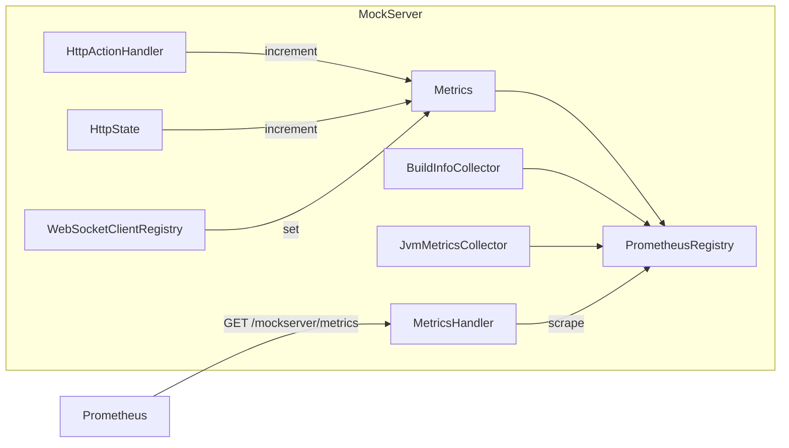

# Metrics & Monitoring

## Prometheus Metrics

MockServer exposes Prometheus-compatible metrics when the `metricsEnabled` configuration property is set to `true`. Metrics are served at the `/mockserver/metrics` endpoint in Prometheus text exposition format.

### Architecture



### Configuration

| Property | Default | Description |
|----------|---------|-------------|
| `metricsEnabled` | `false` | Enable Prometheus metrics collection and the `/mockserver/metrics` endpoint |

When metrics are disabled, the scrape endpoint returns a `404 Not Found` response.

### Metric Names

The `Metrics.Name` enum defines 24 request/action/websocket gauges (all Prometheus `Gauge` type); separate collectors add the build-info and JVM-runtime metrics described below:

#### Request & Expectation Matching

| Metric Name | Description |
|-------------|-------------|
| `requests_received_count` | Total requests received |
| `expectations_not_matched_count` | Requests that did not match any expectation |
| `response_expectations_matched_count` | Requests matched to a response expectation |
| `forward_expectations_matched_count` | Requests matched to a forward expectation |

#### Per-Expectation Match Counter (opt-in)

`mock_server_expectation_matched` is a Prometheus `Counter` labelled by `expectation_id` that increments each time an expectation is matched and a response is served. It is registered only when **both** `metricsEnabled` and `perExpectationMetricsEnabled` are `true`; the default scrape is byte-for-byte unchanged when the property is off. Cardinality is bounded by the number of active expectations. Appears in the exposition output as `mock_server_expectation_matched_total{expectation_id="..."}`.

| Property | Default | Description |
|----------|---------|-------------|
| `perExpectationMetricsEnabled` | `false` | Register the `mock_server_expectation_matched` counter labelled by expectation id (requires `metricsEnabled`) |

Example PromQL (which expectations are never hit?):
```promql
mock_server_expectation_matched_total == 0
```

#### Action Execution (one per action type)

| Metric Name | Description |
|-------------|-------------|
| `forward_actions_count` | Forward actions executed |
| `forward_template_actions_count` | Forward template actions executed |
| `forward_class_callback_actions_count` | Forward class callback actions executed |
| `forward_object_callback_actions_count` | Forward object callback actions executed |
| `forward_replace_actions_count` | Forward replace (override) actions executed |
| `response_actions_count` | Response actions executed |
| `response_template_actions_count` | Response template actions executed |
| `response_class_callback_actions_count` | Response class callback actions executed |
| `response_object_callback_actions_count` | Response object callback actions executed |
| `sse_response_actions_count` | SSE (server-sent events) response actions executed |
| `llm_response_actions_count` | LLM response actions executed |
| `llm_chaos_injected_count` | LLM chaos faults injected |
| `websocket_response_actions_count` | WebSocket response actions executed |
| `grpc_stream_response_actions_count` | gRPC stream response actions executed |
| `binary_response_actions_count` | Binary response actions executed |
| `dns_response_actions_count` | DNS response actions executed |
| `error_actions_count` | Error actions executed |

#### WebSocket Callbacks

| Metric Name | Description |
|-------------|-------------|
| `websocket_callback_clients_count` | Active WebSocket callback client connections |
| `websocket_callback_response_handlers_count` | Registered response callback handlers |
| `websocket_callback_forward_handlers_count` | Registered forward callback handlers |

### Build Info Metric

`BuildInfoCollector` registers a `mock_server_build_info` gauge with labels:

| Label | Description |
|-------|-------------|
| `version` | Full version (e.g. `7.2.0`) |
| `major_minor_version` | Major.minor version (e.g. `6.1`) |
| `group_id` | Maven group ID (`org.mock-server`) |
| `artifact_id` | Maven artifact ID (`mockserver-netty`) |
| `git_hash` | Abbreviated git commit hash the build was produced from, or `unknown` when no git metadata is available |

### JVM Runtime Metrics

`JvmMetricsCollector` registers JVM process-health gauges (read fresh from JDK `java.lang.management` MX beans on each scrape — no extra dependency). Registered once alongside `BuildInfoCollector` when `metricsEnabled`:

| Metric Name | Labels | Description |
|-------------|--------|-------------|
| `jvm_memory_used_bytes` | `area` = `heap` / `nonheap` | Memory currently used |
| `jvm_memory_committed_bytes` | `area` | Memory committed by the JVM |
| `jvm_memory_max_bytes` | `area` | Max memory (`-1` if undefined) |
| `jvm_threads_current` | — | Live thread count |
| `jvm_threads_daemon` | — | Daemon thread count |
| `jvm_gc_collection_count` | — | Total GC collections across all collectors |
| `jvm_gc_collection_seconds_sum` | — | Total GC time across all collectors (seconds) |

These let Grafana and the dashboard Metrics view chart heap/GC/thread behaviour alongside the request and action counters.

> **Perf-regression sampler dependency:** `perf-test-run.sh` (the performance regression pipeline's run step) scrapes `/mockserver/metrics` every 5 seconds during a growth run and reads exactly these three series by name: `jvm_memory_used_bytes{area="heap"}`, `jvm_gc_collection_seconds_sum`, and `jvm_threads_current`. If these metric names change, `perf-test-run.sh` must be updated in the same commit.

### Request Latency Histogram

`mock_server_request_duration_seconds` is a Prometheus classic histogram of request handling duration (receipt → response), with buckets from 0.5 ms to 10 s. It exposes the usual `_bucket{le="…"}`, `_sum`, and `_count` series, so Grafana/PromQL can derive latency percentiles, e.g.:

```promql
histogram_quantile(0.95, sum by (le) (rate(mock_server_request_duration_seconds_bucket[1m])))
```

It is registered (once) when `metricsEnabled`. Timing is captured per `NettyResponseWriter` (one is created per request, so there is no cross-request race) and **only when metrics are enabled** — `Metrics.observeRequestDurationSeconds(...)` is a no-op otherwise, so the request hot path pays nothing when metrics are off.

### Per-Upstream Forward/Proxy Observability

Two Prometheus metrics give per-upstream visibility into forwarded and proxied requests — which upstream a request hit and how it performed. Both are registered once when `metricsEnabled` is `true`.

| Metric Name | Type | Labels | Description |
|-------------|------|--------|-------------|
| `mock_server_forward_request_duration_seconds` | Histogram (classic, 0.5 ms–10 s buckets) | `upstream_host` | Latency of forwarded/proxied requests, by upstream host |
| `mock_server_forward_requests` | Counter | `upstream_host`, `status_class` | Count of forwarded/proxied requests, by upstream host and status class (`1xx`..`5xx`, or `unknown`) |

Recording happens in `HttpActionHandler` on every forward/proxy completion: matched FORWARD actions, the unmatched proxy-pass path (streaming and non-streaming), and `proxyPassMappings` reverse-proxy routes. The latency is taken from the precise client-side `Timing` (`getTotalTimeInMillis()`) already computed by `NettyHttpClient` — it is *not* re-measured — falling back to a coarse wall-clock delta only when no `Timing` is attached.

The `upstream_host` label is resolved from the matched forward action's host (the real upstream even behind an HTTP forward-proxy), falling back to the resolved socket address host; a null/blank host is recorded as `unknown`. **Cardinality is deliberately bounded to the host** (never the full URL or path) plus the five status classes, so the series count scales with the number of distinct upstreams, not with request volume or path variety. `Metrics.observeForwardRequest(host, statusCode, latencySeconds)` is a static no-op when metrics are disabled (the histogram/counter are `null`), so the forward hot path pays nothing when metrics are off.

Example PromQL (p95 forward latency per upstream):
```promql
histogram_quantile(0.95, sum by (le, upstream_host) (rate(mock_server_forward_request_duration_seconds_bucket[5m])))
```

Example PromQL (5xx rate per upstream):
```promql
sum by (upstream_host) (rate(mock_server_forward_requests{status_class="5xx"}[5m]))
```

### Upstream Circuit Breaker Gauge

`mock_server_upstream_circuit_open` is a Prometheus `GaugeWithCallback` reporting the number of upstreams whose forward/proxy circuit breaker is currently **open** (open or half-open state). It backs the per-upstream circuit breaker (`ForwardCircuitBreaker`) that is enabled by `forwardProxyCircuitBreakerEnabled` (see [configuration-reference](configuration-reference.md)). Like the other callback gauges it reads live state at scrape time (`Metrics.getOpenUpstreamCircuitCount()` → `ForwardCircuitBreaker.getInstance().openCircuitCount()`), so half-open recovery is reflected without imperative plumbing. It is registered once when `metricsEnabled` is `true`, and reads **0** whenever the circuit breaker is disabled (the default) or no upstream is currently open.

| Metric Name | Type | Labels | Description |
|-------------|------|--------|-------------|
| `mock_server_upstream_circuit_open` | GaugeWithCallback | — | Number of upstreams whose forward/proxy circuit breaker is currently open |

A non-zero, sustained value means one or more upstreams are being failed fast (a 503 is returned without attempting the forward) because they crossed `forwardProxyCircuitBreakerFailureThreshold` consecutive failures. The breaker state is reset on `HttpState.reset()`.

Example PromQL alert rule:
```promql
mock_server_upstream_circuit_open > 0
```

### HTTP Chaos Fault Counter

`mock_server_http_chaos_injected_total` is a Prometheus `Counter` with a `fault_type` label (values: `"drop"`, `"error"`, `"latency"`, `"truncate"`, `"malformed"`, `"slow"`, `"quota"`, `"graphql"`) that tracks every HTTP chaos fault injected by the chaos profile subsystem. It is registered once when `metricsEnabled` is `true`.

| Label Value | Incremented When |
|-------------|------------------|
| `drop` | A chaos profile drops the TCP connection without sending any response |
| `error` | A chaos profile injects an HTTP error status instead of the normal response |
| `latency` | A chaos profile injects artificial latency into a response |
| `truncate` | A chaos profile truncates the response body |
| `malformed` | A chaos profile emits a malformed/corrupted response |
| `slow` | A chaos profile drip-feeds the response slowly (chunk delay) |
| `quota` | A chaos profile returns a quota/rate-limit fault once the limit in a window is exceeded |
| `graphql` | A chaos profile injects a GraphQL-shaped error response |

`Metrics.incrementHttpChaosInjected(faultType)` is a static no-op when metrics are disabled (the counter is `null`). This counter is surfaced on the dashboard Metrics view as an "HTTP Chaos Faults" section (visible only when the metric is present and has non-zero data).

Example PromQL:

```promql
rate(mock_server_http_chaos_injected_total{fault_type="error"}[5m])
```

### Active Service-Scoped Chaos Gauge

`mock_server_active_service_chaos` is a Prometheus `GaugeWithCallback` with a `fault_type` label (values: `drop`, `error`, `latency`, `truncate`, `malformed`, `slow`, `quota`, `graphql`) reporting, per fault type, the number of currently-active service-scoped chaos profiles (`ServiceChaosRegistry`) configured with that fault. A profile carrying several faults counts under each, so the per-type series can be charted by type. (`slow` and `quota` require their companion fields — chunk-delay, and limit + window — to be counted, matching when they actually fire.) It is a *callback* gauge — the callback reads `Metrics.getActiveServiceChaosCountByFaultType()` → `ServiceChaosRegistry.getInstance().activeCountByFaultType()` at scrape time rather than tracking the value imperatively, so TTL auto-revert (which removes a profile without any `put`/`remove` call) is reflected without extra plumbing. Every fault type is always present (0 when none), giving a stable, complete set of series. It is registered once when `metricsEnabled` is `true`; the counts drop to 0 as profiles are cleared or their TTLs lapse, which makes `sum(mock_server_active_service_chaos) > 0` a natural "chaos still live" alert.

Both chaos metrics are also mirrored over OTLP by `OtelMetricsExporter` (`registerChaosCounter` / `registerActiveServiceChaosGauge`) so OTLP-only consumers can observe them without a Prometheus scrape.

### Chaos Auto-Halt Counter

`mock_server_chaos_auto_halt_total` is a Prometheus `Counter` that increments each time the chaos auto-halt circuit-breaker triggers. The circuit-breaker is a safety mechanism that automatically disables all active service-scoped chaos profiles when the number of **destructive** chaos faults within a sliding window exceeds a configured threshold. This prevents chaos experiments from driving cascading outages.

Only **destructive** fault types contribute to the window: `"error"` (synthetic 5xx), `"drop"` (connection kill), and `"quota"` (429/503). Benign fault types (`"latency"`, `"slow"`, `"truncate"`, `"malformed"`, `"graphql"`) are excluded -- a latency-only experiment will never auto-halt.

The auto-halt feature is controlled by three configuration properties (all off/inert by default):

| Property | Default | Description |
|----------|---------|-------------|
| `chaosAutoHaltEnabled` | `false` | Master switch for the circuit-breaker |
| `chaosAutoHaltErrorThreshold` | `50` | Number of error-class faults (5xx/dropped/quota) in the window that triggers halt |
| `chaosAutoHaltWindowMillis` | `60000` | Sliding window duration in milliseconds |

When the circuit-breaker fires:
1. All active service-scoped chaos profiles are removed via `ServiceChaosRegistry.reset()` (the same path used by TTL expiry)
2. The `mock_server_chaos_auto_halt_total` counter is incremented
3. The `mock_server_active_service_chaos` gauge drops to 0 for all fault types
4. A WARN-level log event is emitted with the error count, window, and threshold
5. The sliding window is cleared so the breaker does not immediately re-trigger

The monitor is also reset by `HttpState.reset()` (alongside `ServiceChaosRegistry.reset()`), so a server reset clears stale errors from the window and prevents them from halting freshly-registered chaos.

The auto-halt is evaluated per chaos fault injection (called from `Metrics.incrementHttpChaosInjected`). It uses a lock-free `ConcurrentLinkedDeque` of timestamps with an `AtomicInteger` window counter (O(1) size check) and an `AtomicBoolean` guard to prevent concurrent double-trigger. When the feature is disabled (`chaosAutoHaltEnabled=false`), the evaluation is a no-op with zero overhead.

Example PromQL alert rule:
```promql
increase(mock_server_chaos_auto_halt_total[5m]) > 0
```

### LLM Token & Cost Counters

Three Prometheus `Counter`s track LLM token usage and estimated cost when `llmMetricsEnabled` is `true` (in addition to `metricsEnabled`). Each is labeled by `provider` (lowercased enum name, e.g. `anthropic`, `openai`) and `model` (the model identifier from the completion). They are incremented on both the mock path (`HttpLlmResponseActionHandler`) and the forward/proxy path (`HttpActionHandler.emitForwardGenAiSpan`) whenever a `Completion` is served or forwarded.

| Metric Name | Description |
|-------------|-------------|
| `mock_server_llm_input_tokens` | Cumulative input tokens across all LLM completions |
| `mock_server_llm_output_tokens` | Cumulative output tokens across all LLM completions |
| `mock_server_llm_cost_usd` | Cumulative estimated cost in USD (via `LlmPricing`) |

Cost estimation uses the static pricing table in `LlmPricing` — it is an estimate, not an invoice. Models with unknown pricing contribute tokens but no cost.

The forward-path response parse (which extracts the `Completion` from the upstream response) is gated on `GenAiSpans.isEnabled() || Metrics.isLlmMetricsActive() || llmCostBudgetUsd > 0`, so token/cost metrics work without requiring full OTLP tracing.

Example PromQL:
```promql
sum(rate(mock_server_llm_cost_usd[1h]))
```

### LLM Optimisation Verdict Gauges

Three Prometheus `GaugeWithCallback` gauges expose the headline figures of the latest **LLM optimisation report** (see [llm-mocking.md → LLM Optimisation Export](llm-mocking.md#llm-optimisation-export)). They are registered once when `metricsEnabled` is `true`.

| Metric Name | Type | Labels | Source |
|-------------|------|--------|--------|
| `mock_server_llm_estimated_waste_usd` | GaugeWithCallback | — | `report.verdict.totalEstimatedSavingUsd` |
| `mock_server_llm_cache_hit_ratio` | GaugeWithCallback | — | `report.totals.cacheHitRatio` (0..1) |
| `mock_server_llm_one_shot_rate` | GaugeWithCallback | — | `report.totals.oneShotRate` (0..1) |

These are **single global gauges with no per-model labels** — deliberately, to avoid the unbounded label cardinality that a per-model breakdown would create (cf. the load-injection `run_id` series-leak lesson). The waste-USD figure reuses the deterministic Wave-1 verdict's `totalEstimatedSavingUsd` (clamped ≤ total spend); it is not re-derived.

**Source of truth: cached snapshot, not a scrape-time rebuild.** The optimisation report is built on demand (REST endpoint / MCP tool) — building it retrieves the recorded request/response pairs from the event log and decodes each, which is too expensive to run on every Prometheus scrape, and the core `Metrics` gauge callback has no access to the netty-side log-retrieval path. So each time a report is built, `LlmOptimisationReportService.build(...)` pushes its three headline figures into a small `AtomicReference` snapshot on `Metrics` (`Metrics.updateLlmOptimisationSnapshot(...)`), and the gauge callbacks read that snapshot at scrape time. **Trade-off:** the gauges reflect the *most recently built* report, not a continuously-live computation — they read `0` until a report has ever been built (no traffic analysed yet) and are reset to `0` on `Metrics.clear()` (server reset). A dashboard/scheduled-export that builds the report periodically keeps the gauges fresh; if no one ever builds a report, the gauges stay at `0`. This is correct-and-cheap, versus building-at-scrape which would be scrape-time-correct but pay the full report cost (bounded by `llmOptimisationMaxCalls`, default 200) on every scrape.

The three gauges are also mirrored to OTLP by `OtelMetricsExporter` (matching the load gauges, which are likewise mirrored), reading the same cached snapshot at collection time, so OTLP-only consumers see the verdict without a Prometheus scrape.

Example PromQL alert (more than $5 of recoverable spend detected):
```promql
mock_server_llm_estimated_waste_usd > 5
```

### LLM Cost Budget Circuit-Breaker

`mock_server_llm_cost_budget_tripped` is a Prometheus `Counter` that increments each time the LLM cost-budget circuit-breaker triggers. The breaker is configured by `mockserver.llmCostBudgetUsd` (a cumulative USD budget); when the running cost total exceeds it, further LLM forwards are blocked with a 429 response. The budget is **enforced on all forward paths**: matched FORWARD actions (FORWARD, FORWARD_TEMPLATE, FORWARD_CLASS_CALLBACK, FORWARD_REPLACE, FORWARD_VALIDATE, FORWARD_WITH_FALLBACK), breakpoint-continuation forwards, unmatched proxy-pass forwards, and `proxyPassMappings` reverse-proxy routes. For matched FORWARD actions, the guard resolves the forward target host from the action (e.g. `HttpForward.getHost()`) so the sniffer checks the upstream host, not the inbound request host. The budget is tracked independently of the Prometheus counter (via `LlmCostBudgetMonitor`) so it works even when `metricsEnabled` is false. The breaker is deterministic and fail-open: a negative, unset, or malformed budget never blocks traffic. It resets on `HttpState.reset()`.

The sole excluded forward path is `FORWARD_OBJECT_CALLBACK`, intentionally excluded because its upstream target is determined by arbitrary user callback code at runtime (the same architectural exclusion as chaos injection on that path).

The cost-budget trip shares the same operator-facing observability surface as the chaos auto-halt:
- **Prometheus counter**: `mock_server_llm_cost_budget_tripped`
- **WARN log**: emitted on each trip with cumulative cost and budget values
- **Dashboard**: the MetricsView "Circuit Breakers" section (inside the HTTP Chaos Faults panel) shows both the chaos auto-halt and the LLM cost-budget trip count, with cumulative cost display

| Property | Default | Description |
|----------|---------|-------------|
| `llmMetricsEnabled` | `false` | Enable LLM token/cost Prometheus counters (requires `metricsEnabled`) |
| `llmCostBudgetUsd` | `-1.0` (disabled) | Cumulative cost budget in USD; negative = disabled |

### Async Message Counters

Two Prometheus `Counter`s track broker message flow for the optional `mockserver-async` (AsyncAPI broker-mocking) module, each labelled by `channel` (the broker topic/channel). Both are registered once when `metricsEnabled` is `true`.

| Metric Name | Incremented When |
|-------------|------------------|
| `mock_server_async_messages_published_total` | MockServer publishes an example message to a broker — one increment per message in `AsyncApiMockOrchestrator.publishAll()` (covers both publish-on-load and scheduled publishing) |
| `mock_server_async_messages_consumed_total` | MockServer records a message consumed from a broker subscription — one increment per message in the `KafkaMessageSubscriber` / `MqttMessageSubscriber` record path |

`mockserver-async` depends on `mockserver-core` (optional scope) and calls the static `Metrics.incrementAsyncMessagePublished(channel)` / `Metrics.incrementAsyncMessageConsumed(channel)` methods directly; both are null-safe no-ops when metrics are disabled, so the async hot paths pay nothing when metrics are off. These counters only move when a real broker is connected (`brokerConfig` with `kafkaBootstrapServers`/`mqttBrokerUrl`); a broker-less spec load leaves them at zero.

The dashboard **Metrics** view renders these on a dedicated **"Async message activity (cumulative)"** chart — kept separate from the HTTP **"HTTP request activity"** chart because broker message counts and HTTP request counts have different semantics. The two series (Published, Consumed) are summed across all channels client-side via `gaugeSeriesSum`; the panel is hidden until at least one async counter has data.

### Dropped Log Events Counter

A single Prometheus `Counter` makes the event-log ring-buffer saturation cliff observable. Registered once when `metricsEnabled` is `true`.

| Metric Name | Incremented When |
|-------------|------------------|
| `mock_server_dropped_log_events` | A log event cannot be published because the `MockServerEventLog` disruptor ring buffer is full (`tryPublishEvent` returns `false`) |

Under sustained load the event-log ring buffer can saturate and drop events. Previously only WARN/ERROR drops were logged, so INFO/DEBUG drops were silent and the cliff was undetectable. `MockServerEventLog.add(...)` now counts every drop on an always-available `AtomicLong` (readable via `getDroppedLogEventCount()` regardless of whether metrics are enabled), mirrors it to this Prometheus counter via the null-safe static `Metrics.incrementDroppedLogEvents()` (a no-op when metrics are off), and logs a single WARN on the first drop pointing at `ringBufferSize` / log verbosity as the remedy. A non-zero, growing value means the event log cannot keep up — raise `ringBufferSize` (derived from `maxLogEntries`) or reduce log verbosity.

### Load Injection Metrics (`mock_server_load_*`)

The `mock_server_load_*` family is registered by `Metrics.registerLoadMetrics()` when `metricsEnabled` is `true` (there is no `loadGenerationEnabled` check in `Metrics` registration — that flag only gates the PUT endpoint). All metrics in this family are also mirrored to OTLP by `OtelMetricsExporter` — see [telemetry.md](telemetry.md).

**Per-run series retention.** Each run uses a fresh UUID `run_id` label, so without eviction the Prometheus client would retain every completed run's datapoints in the registry forever (unbounded memory growth, slower scrapes). The orchestrator calls `Metrics.evictLoadRun(previousRunId)` when a *new* run starts, so a completed (or replaced) run's durable series stay scrapeable until the next run begins and are then evicted — at most one completed run's series are retained (bounded). The two observable gauges (`mock_server_load_active_vus`, `mock_server_load_inflight_requests`) are not evicted because they self-clear via the orchestrator's empty-callback readers. On the OTLP side the per-run attribute sets are managed by the OTEL SDK's own aggregation/cardinality handling (the load counters are direct `LongCounter.add`, not callbacks), so they are not manually evicted.

Fixed structured label set for per-request metrics (`LOAD_FIXED_LABELS`):
`scenario`, `run_id`, `step`, `route`, `method`, `status_class`

Optional custom labels (appended after fixed labels) are declared via the `mockserver.loadGenerationMetricLabels` allowlist. The allowlist is captured at registration time because Prometheus requires a fixed schema.

| Metric Name | Type | Labels | Description |
|-------------|------|--------|-------------|
| `mock_server_load_request_duration_seconds` | Histogram | fixed + custom | Round-trip latency per dispatch. Carries a `trace_id` exemplar from the upstream response `traceparent` header when present. |
| `mock_server_load_requests` | Counter | fixed + custom | Completed dispatches |
| `mock_server_load_request_bytes` | Counter (unit: bytes) | fixed + custom | Outbound request bytes |
| `mock_server_load_response_bytes` | Counter (unit: bytes) | fixed + custom | Inbound response bytes |
| `mock_server_load_iterations` | Counter | `scenario`, `run_id` | Full VU iteration completions |
| `mock_server_load_throttled` | Counter | `scenario`, `run_id`, `reason` | Dispatches skipped by the self-load guard (`reason` = `inflight_cap` or `rate_limit`) |
| `mock_server_load_errors` | Counter | `scenario`, `run_id`, `kind` | Failed dispatches (`kind` = `render`, `connection`, `timeout`, `null_response`, `http_5xx`) |
| `mock_server_load_active_vus` | GaugeWithCallback | `scenario`, `run_id` | Virtual users currently running |
| `mock_server_load_inflight_requests` | GaugeWithCallback | `scenario`, `run_id` | Dispatches currently in flight |

The `route` label is auto-templatized by `MetricLabels.routeOf()` (numeric and UUID path segments become `{id}`) to keep cardinality bounded. A step with an explicit `name` field uses that name as `route` directly. See [load-generation.md](load-generation.md) for the full model and custom-label details.

Example PromQL (p95 latency per scenario):
```promql
histogram_quantile(0.95,
  sum by (le, scenario) (
    rate(mock_server_load_request_duration_seconds_bucket[1m])
  )
)
```

Example PromQL (throttle rate — did the scenario reach its setpoint?):
```promql
rate(mock_server_load_throttled_total[1m])
```

### SLO Sample Tracking

Independent of the Prometheus metrics feature, MockServer can record a windowed
sample for every forwarded upstream round-trip so that resilience verdicts can be
computed on demand via `PUT /mockserver/verifySLO` (see
[docs/code/slo-verdicts.md](slo-verdicts.md)).

The recording funnel lives in the **same place** as the forward-metrics funnel —
`HttpActionHandler.recordForwardMetrics(...)` — but has its own independent gate:

```text
recordForwardMetrics(action, response, upstreamAddress, responseTimeMs)
  ├─ SloSampleStore.getInstance().record(now, latency, isError, FORWARD, host)   // gated by sloTrackingEnabled (no-op when off)
  └─ Metrics.observeForwardRequest(host, status, latencySeconds)                 // gated by isForwardMetricsActive()
```

Because `SloSampleStore.record(...)` is a no-op when `sloTrackingEnabled` is
`false` (the default), SLO tracking runs even when forward metrics are inactive and
costs nothing on the hot path when disabled. The store is bounded by
`sloWindowMaxSamples` (count) and `sloWindowRetentionMillis` (age), and is cleared
on server reset. A sample's error flag is set when the upstream status is `null` or
`>= 500` — the same definition used by the forward metrics counters.

### How Metrics Are Incremented

- `HttpActionHandler` calls `metrics.increment(action.getType())` after dispatching each action, which maps the `Action.Type` enum to the corresponding `*_ACTIONS_COUNT` gauge
- `HttpState` increments `REQUESTS_RECEIVED_COUNT` on each request and `EXPECTATIONS_NOT_MATCHED_COUNT` when no expectation matches
- `WebSocketClientRegistry` calls `metrics.set()` to update WebSocket client and handler counts
- `Metrics.clear()` resets all gauges to zero (called during server reset)

### Scrape Endpoint

`MetricsHandler` serves the `/mockserver/metrics` endpoint. It uses `ExpositionFormats` to render all registered metrics from `PrometheusRegistry.defaultRegistry`, respecting the client's `Accept` header for content negotiation.

## Memory Monitoring

`MemoryMonitoring` provides CSV-based memory usage tracking, enabled via the `outputMemoryUsageCsv` configuration property.

### Configuration

| Property | Default | Description |
|----------|---------|-------------|
| `outputMemoryUsageCsv` | `false` | Enable memory usage CSV output |
| `memoryUsageCsvDirectory` | `.` | Directory for CSV output files |

### How It Works

`MemoryMonitoring` implements both `MockServerLogListener` and `MockServerMatcherListener`. It receives notifications when log entries are added or expectations change, and writes memory statistics to a CSV file (named `memoryUsage_YYYY-MM-DD.csv`) every 50 updates.

### CSV Columns

| Column | Description |
|--------|-------------|
| `mockServerPort` | Server port |
| `eventLogSize` | Current log entry count |
| `maxLogEntries` | Configured max log entries |
| `expectationsSize` | Current expectation count |
| `maxExpectations` | Configured max expectations |
| `heapInitialAllocation` | JVM heap initial allocation (bytes) |
| `heapUsed` | JVM heap used (bytes) |
| `heapCommitted` | JVM heap committed (bytes) |
| `heapMaxAllowed` | JVM heap max allowed (bytes) |
| `nonHeapInitialAllocation` | JVM non-heap initial allocation (bytes) |
| `nonHeapUsed` | JVM non-heap used (bytes) |
| `nonHeapCommitted` | JVM non-heap committed (bytes) |
| `nonHeapMaxAllowed` | JVM non-heap max allowed (bytes) |

## Key Classes

| Class | Module | Path |
|-------|--------|------|
| `Metrics` | mockserver-core | `org.mockserver.metrics.Metrics` |
| `Metrics.Name` | mockserver-core | `org.mockserver.metrics.Metrics.Name` (enum) |
| `MetricsHandler` | mockserver-core | `org.mockserver.metrics.MetricsHandler` |
| `BuildInfoCollector` | mockserver-core | `org.mockserver.metrics.BuildInfoCollector` |
| `JvmMetricsCollector` | mockserver-core | `org.mockserver.metrics.JvmMetricsCollector` |
| `ChaosAutoHaltMonitor` | mockserver-core | `org.mockserver.mock.action.http.ChaosAutoHaltMonitor` |
| `LlmCostBudgetMonitor` | mockserver-core | `org.mockserver.mock.action.http.LlmCostBudgetMonitor` |
| `MetricLabels` | mockserver-core | `org.mockserver.metrics.MetricLabels` (route templatizing for load metrics) |
| `OtelMetricsExporter` | mockserver-core | `org.mockserver.metrics.OtelMetricsExporter` (OTLP mirror of load metrics) |
| `LoadScenarioOrchestrator` | mockserver-core | `org.mockserver.mock.action.http.LoadScenarioOrchestrator` (records load metric samples) |
| `SloSampleStore` | mockserver-core | `org.mockserver.slo.SloSampleStore` (see [slo-verdicts.md](slo-verdicts.md)) |
| `MemoryMonitoring` | mockserver-core | `org.mockserver.memory.MemoryMonitoring` |
| `Summary` | mockserver-core | `org.mockserver.memory.Summary` |
| `Detail` | mockserver-core | `org.mockserver.memory.Detail` |

## Dependencies

| GroupId | ArtifactId | Version | Purpose |
|---------|-----------|---------|---------|
| `io.prometheus` | `prometheus-metrics-core` | 1.7.0 | Prometheus client library (Gauge, MultiCollector, PrometheusRegistry) |
| `io.prometheus` | `prometheus-metrics-exposition-formats` | 1.7.0 | Prometheus exposition format writers |
| `io.prometheus` | `prometheus-metrics-model` | 1.7.0 | Prometheus metric snapshots and labels |
