# Request Processing, Mocking & Proxying

## How Mocking and Proxying Work Together

MockServer operates in two modes simultaneously on every request:

1. **Mock mode**: Matches incoming requests against registered expectations and returns configured responses
2. **Proxy mode**: Forwards unmatched requests to their original destination (when the channel has `PROXYING=true`)

The decision is made per-request in `HttpActionHandler.processAction()`:

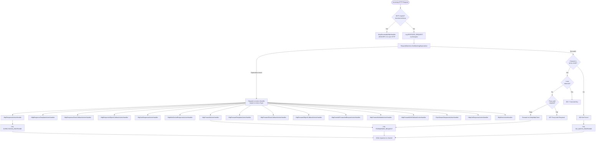

## HttpState -- The Control Plane Brain

`HttpState` (`mockserver-core/.../mock/HttpState.java`) is the central orchestrator. It owns:

- `RequestMatchers` -- active expectation collection
- `MockServerEventLog` -- event log (Disruptor-backed)
- `WebSocketClientRegistry` -- callback WebSocket clients
- `Scheduler` -- async task execution
- All serializers for JSON parsing

### Control Plane REST API

`HttpState.handle()` processes PUT requests to control-plane endpoints and returns `true` if handled:

| Endpoint | Action |
|----------|--------|
| `PUT /mockserver/expectation` | Deserialize + add/update expectations |
| `PUT /mockserver/openapi` | Convert OpenAPI spec to expectations (idempotent/incremental sync) |
| `PUT /mockserver/wsdl` | Convert a WSDL 1.1 document (SOAP 1.1/1.2) to expectations |
| `PUT /mockserver/pact` | Export active response expectations as a Pact v3 consumer contract (`?consumer=&provider=`) |
| `PUT /mockserver/pact/verify` | Verify that active expectations satisfy a Pact v3 contract (202 all-pass / 406 failures) |
| `PUT/GET /mockserver/mode` | Get/set the operating mode (`?mode=SIMULATE\|SPY\|CAPTURE`) — toggles proxy-on-no-match for record/spy workflows |
| `PUT /mockserver/clear` | Clear expectations and/or logs by request matcher |
| `PUT /mockserver/reset` | Reset all state (expectations, logs, WebSocket registry) |
| `PUT /mockserver/retrieve` | Retrieve requests, responses, logs, or active expectations |
| `PUT /mockserver/verify` | Verify request count against `VerificationTimes` |
| `PUT /mockserver/verifySequence` | Verify ordered sequence of requests |
| `PUT /mockserver/grpc/descriptors` | Upload a compiled proto descriptor set (binary body) |
| `PUT /mockserver/grpc/services` | List all loaded gRPC services and their methods |
| `PUT /mockserver/grpc/clear` | Clear all loaded gRPC descriptors and reset the store |
| `PUT /mockserver/files/store` | Store a file in the in-memory file store |
| `PUT /mockserver/files/retrieve` | Retrieve a stored file by name |
| `PUT /mockserver/files/list` | List all stored file names |
| `PUT /mockserver/files/delete` | Delete a stored file by name |
| `PUT /mockserver/debugMismatch` | Compare a request against all active expectations and return per-field diffs |
| `PUT /mockserver/explainUnmatched` | Retrieve recent unmatched requests with ranked closest-expectation diagnostics and remediation hints |
| `PUT /mockserver/replay` | Re-issue a recorded request to its target and return the upstream response (see [Request Replay](#request-replay)) |
| `PUT/GET/DELETE /mockserver/chaosExperiment` | Start, query, or stop a scheduled multi-stage chaos experiment (see [docs/code/chaos.md](chaos.md)) |

All control-plane requests go through `controlPlaneRequestAuthenticated()` which enforces mTLS and/or JWT authentication if configured.

#### WSDL Expectation Generation

`PUT /mockserver/wsdl` accepts a raw WSDL 1.1 XML document and generates one `Expectation` per SOAP operation found across all service/port bindings. Implementation is in `WsdlExpectationGenerator` (`mockserver-core/.../mock/wsdl/`). For each operation it builds a `POST` request matcher targeting the path from `soap:address` (or `soap12:address`) and matches on the `SOAPAction` header (SOAP 1.1), the `content-type` `action` parameter (SOAP 1.2), or an XPath body check when no SOAP action is declared. The response is a skeleton SOAP envelope with a `<{Operation}Response/>` element in the WSDL target namespace. The WSDL is parsed through `StringToXmlDocumentParser` with DOCTYPE and external entity resolution disabled (XXE-safe). Returns 201 with the generated expectations as JSON.

#### Pact Contract Export

`PUT /mockserver/pact` (with optional `?consumer=NAME&provider=NAME` query parameters) exports the currently active response expectations as a Pact v3 consumer contract JSON. Implementation is in `PactExporter` (`mockserver-core/.../mock/pact/`). Only expectations with a concrete `HttpRequest` matcher and an `HttpResponse` (or `HttpResponses`) action are included; expectations with notted method/path matchers are skipped; notted header and query-parameter values are dropped from the exported interaction. JSON bodies are embedded as structured nodes. The `consumer` and `provider` parameters default to `"consumer"` and `"provider"` when not supplied. Returns 200 with the Pact JSON.

#### Pact Contract Verification

`PUT /mockserver/pact/verify` takes a Pact v3 contract JSON as the request body and verifies that MockServer's currently-active expectations satisfy each interaction. Implementation is in `PactVerifier` (`mockserver-core/.../mock/pact/`). For each interaction, the verifier builds an `HttpRequest` from the interaction's request fields, finds matching expectations via `RequestMatchers.retrieveExpectationsMatchingRequest()` (read-only forward matching — no side effects on times/scenarios), and compares the matched expectation's response against the interaction's expected response: status code must be equal, headers use subset matching (each Pact header must be present but extra MockServer headers are allowed), and bodies are compared structurally as JSON when both parse as JSON, otherwise as strings. Only expectations with a static `HttpResponse` (or first of `HttpResponses`) action are verifiable; forward/callback/template actions fail with reason "unverifiable (non-static action)". Returns 202 with `{"verified":true,...}` when all interactions pass, 406 with `{"verified":false,...}` when any fail, or 400 on malformed/empty input.

#### Operating Mode (SIMULATE / SPY / CAPTURE)

`PUT /mockserver/mode?mode=SIMULATE|SPY|CAPTURE` switches the server's operating mode at runtime. `GET /mockserver/mode` returns the current mode as `{"mode":"...","proxyUnmatchedRequests":true|false}`. Implementation is in `MockMode` (`mockserver-core/.../mock/MockMode.java`). The three modes are: **SIMULATE** (default) — match expectations, return 404 on no match; **SPY** — match expectations, forward unmatched requests to the real upstream and record; **CAPTURE** — forward and record all traffic (useful with no expectations defined). SPY and CAPTURE both enable `attemptToProxyIfNoMatchingExpectation`. Recorded interactions are retrieved via the existing `PUT /mockserver/retrieve?type=RECORDED_EXPECTATIONS` endpoint.

#### MCP list_mock_tools

The `list_mock_tools` MCP tool (registered in `McpToolRegistry.registerListMockTools()`, `mockserver-netty/.../mcp/`) generates MCP tool definitions from the currently active response expectations by delegating to `McpToolSchemaGenerator` (`mockserver-core/.../mock/mcp/`). It takes no parameters and returns `{"tools":[...],"count":N}`. Each expectation with a concrete (non-notted) method and path and a response action becomes one tool: the name is derived from `METHOD_path` in lower snake_case (deduplicated and capped at 64 characters), the `inputSchema` exposes query parameters and an optional `body` property, and a `_mockserver` annotation records the target method, path, and expectation ID.

### Retrieve, Clear & Format Enums

The retrieve and clear endpoints accept type parameters:

**`RetrieveType`** (query parameter `?type=`):

| Value | Description |
|-------|-------------|
| `REQUESTS` | Received requests matching the filter |
| `REQUEST_RESPONSES` | Request/response pairs |
| `RECORDED_EXPECTATIONS` | Expectations recorded from proxy forwarding |
| `ACTIVE_EXPECTATIONS` | Currently active expectations |
| `LOGS` | Log messages |

**`Format`** (query parameter `?format=`):

| Value | Description |
|-------|-------------|
| `JSON` | Standard JSON serialization |
| `JAVA` | Generated Java client API code (via `ExpectationToJavaSerializer`) |
| `LOG_ENTRIES` | Raw log entry format |
| `HAR` | HTTP Archive (HAR) export |
| `OPENAPI` | OpenAPI spec export (applies to `ACTIVE_EXPECTATIONS`) |
| `POSTMAN` | Postman collection export (applies to `ACTIVE_EXPECTATIONS`) |
| `BRUNO` | Bruno request collection export (applies to `ACTIVE_EXPECTATIONS`) |
| `CURL` | cURL command(s) reproducing recorded requests (applies to `REQUESTS` / `REQUEST_RESPONSES`) |

**`ClearType`** (query parameter `?type=`):

| Value | Description |
|-------|-------------|
| `EXPECTATIONS` | Clear expectations only |
| `LOG` | Clear logs only |
| `ALL` | Clear both expectations and logs (default) |

Clear also supports clearing by `ExpectationId` (not just `RequestDefinition`).

### Pre-HttpRequestHandler Routes

Before a request reaches `HttpRequestHandler`, the Netty pipeline may intercept it at an earlier stage:

| Route | Handler | Description |
|-------|---------|-------------|
| `/mockserver/mcp` | `McpStreamableHttpHandler` | MCP (Model Context Protocol) server endpoint (Streamable HTTP transport with JSON-RPC 2.0). Intercepted in the pipeline before `MockServerHttpServerCodec`. Only active when `mcpEnabled=true`. Methods dispatched by `McpRequestProcessor`: `initialize`, `ping`, `tools/list`, `tools/call`, `resources/list`, `resources/read`, `prompts/list`, `prompts/get` (built-in prompts from `McpPromptRegistry`, `{{argument}}` substitution) and `sampling/createMessage` (returns a mocked completion: `role`/`content`/`model`/`stopReason`). The `prompts` and `sampling` capabilities are advertised in the `initialize` result. |
| `/_mockserver_callback_websocket` | `CallbackWebSocketServerHandler` | WebSocket upgrade for object/closure callbacks |

### gRPC Built-in Services (in GrpcToHttpRequestHandler)

`GrpcToHttpRequestHandler` intercepts gRPC requests before they reach the normal expectation-matching pipeline. The following built-in gRPC services are handled directly without user-defined expectations:

| Path | Handler | Description |
|------|---------|-------------|
| `/grpc.health.v1.Health/Check` | `GrpcHealthCheckHandler` | Health check (returns serving status from `GrpcHealthRegistry`) |
| `/grpc.reflection.v1.ServerReflection/ServerReflectionInfo` | `GrpcServerReflectionHandler` | Server Reflection v1 (lists services, resolves symbols/files from loaded descriptors) |
| `/grpc.reflection.v1alpha.ServerReflection/ServerReflectionInfo` | `GrpcServerReflectionHandler` | Server Reflection v1alpha (same behaviour as v1) |

**Server Reflection** enables tools like `grpcurl list` and `grpcurl describe` to introspect the gRPC services loaded into MockServer without a local proto file. The handler decodes `ServerReflectionRequest` messages and responds with service listings, file descriptors by symbol, or file descriptors by filename. It uses `CodedInputStream`/`CodedOutputStream` for manual protobuf encoding (no generated reflection stubs).

**Limitation:** The current gRPC path in MockServer is buffered-unary -- each HTTP/2 request carries exactly one gRPC message. Server Reflection therefore handles a single `ServerReflectionRequest` per HTTP/2 request, which is sufficient for `grpcurl list`, single symbol lookups, and file lookups. Fully-interactive bidi-streaming reflection (a long-lived stream with multiple back-and-forth messages) is not supported by the buffered pipeline.

### Non-Control-Plane Routes (in HttpRequestHandler)

| Route | Method | Handler |
|-------|--------|---------|
| `/mockserver/status` | PUT | Returns port binding JSON (bound ports, version, group/artifact id, and `gitHash` when built from a git checkout) |
| Liveness path | GET | Returns port binding JSON |
| `/mockserver/bind` | PUT | Dynamically bind additional ports |
| `/mockserver/stop` | PUT | Graceful shutdown |
| `/mockserver/dashboard` | GET | `DashboardHandler.renderDashboard()` |
| `/mockserver/metrics` | GET | `MetricsHandler` (Prometheus) |
| CONNECT method | - | HTTP CONNECT tunnel setup |
| Everything else | - | `HttpActionHandler.processAction()` |

## Expectation Matching

### RequestMatchers

Expectations are stored in a `CircularPriorityQueue` sorted by priority (highest first), then creation time (earliest first). The `firstMatchingExpectation()` method accepts an `HttpRequest` and iterates in sort order, returning the first match.

When no expectation matches, the method logs a **closest match summary** identifying the expectation with the fewest field differences, along with a match score (e.g., "matched 8/12 fields"). This helps users quickly identify which expectation was closest to matching.

`HttpState` obtains its `RequestMatchers` through `ExpectationStoreFactory` (a small SPI/registry) rather than constructing it directly. By default the factory returns the standard in-memory `RequestMatchers` (zero behaviour change). This is the **clustered-state seam**: an optional backend can register a factory returning a clustering-aware `RequestMatchers` so a fleet of MockServer instances shares expectations. The optional `mockserver-state-infinispan` module implements this with an embedded Infinispan data-grid backend; activate it by setting `stateBackend=infinispan`. See [Clustered State](clustered-state.md) for full details.

A `MatchDifference` context is always created for each comparison (regardless of log level), so detailed field-level difference information is always available in the `EXPECTATION_NOT_MATCHED` log entries. The `MatchFailureHints` utility adds actionable suggestions for common mistakes (trailing slashes, Content-Type charset mismatches, unescaped regex metacharacters).

### Expectation Namespacing (Multi-Tenancy)

**Outcome:** multiple teams or test-suites can share one MockServer instance without their expectations colliding, by partitioning expectations into named namespaces (tenants). The feature is **additive and backward-compatible** — with no namespace ever set, behaviour is exactly as before.

An expectation carries an optional `namespace` (a.k.a. tenant) string (`Expectation.withNamespace(...)`, `null` = the global namespace). A request declares its namespace via a configurable request header (`matchNamespaceHeader`, default `X-MockServer-Namespace`; env `MOCKSERVER_MATCH_NAMESPACE_HEADER`).

**Matching rule** (`RequestMatchers.matchesNamespace`, applied as a pre-filter in `firstMatchingExpectation` / `firstMatchingEarlyExpectation` before each candidate is matched):

| Request namespace `T` (from header) | Expectation namespace | Eligible to match? |
|-------------------------------------|-----------------------|--------------------|
| any (incl. absent) | `null` (global) | yes |
| `T` | `T` | yes |
| `T` | other (`≠ T`) | no |
| absent | non-null | **no** |

**No-header default decision — Option A (true isolation):** a request with no namespace header sees only global (null-namespace) expectations, never any tenant's. This is the least-surprising, safest default: isolation holds by construction, so a client that forgets the header (or a stray request) can never accidentally hit another tenant's mocks; shared infrastructure stubs are explicitly placed in the global namespace. (Option B — no-header sees everything — was rejected: it makes isolation opt-out and lets a forgotten header silently leak cross-tenant matches.)

The namespace header does **not** participate in normal header matching: matching is unchanged except for the extra pre-filter skip. Existing expectations only match headers they explicitly declare, and the MockServer-specific namespace header is not one of them, so a request carrying it still matches a global expectation exactly as before. The header is not stripped.

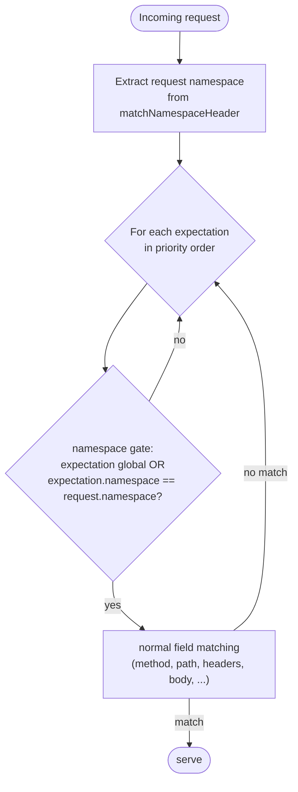

**Scoped control-plane operations** (`HttpState.resolveNamespaceFilter` reads the `?namespace=T` query parameter, falling back to the `matchNamespaceHeader` header on the control-plane request):

- `PUT /mockserver/clear?type=expectations&namespace=T` (and `?type=all&namespace=T`) removes **only** namespace `T`'s expectations via `RequestMatchers.clearByNamespace(...)`, leaving other tenants' and global expectations intact. A blank namespace is a no-op (it never clears global expectations). Because the event log is not namespaced, a namespace-scoped `all` clear deliberately leaves the request log untouched.
- `PUT /mockserver/retrieve?type=active_expectations&namespace=T` returns only namespace `T`'s expectations plus global ones (other tenants hidden).
- `PUT /mockserver/reset` with no namespace stays a full reset (unchanged semantics).

All of the matching/clearing logic lives in `mockserver-core` (`Expectation`, `ExpectationDTO`, `RequestMatchers`, `HttpState`, `Configuration`/`ConfigurationProperties`); the Netty layer needs no change because it already passes all request headers through. The `namespace` field round-trips through `ExpectationDTO`, the expectation JSON Schema (`expectation.json`), the embedded OpenAPI model, and the Java-code serializer.

### Debug Mismatch Endpoint

The `PUT /mockserver/debugMismatch` endpoint (implemented in `HttpState.debugMismatch()`) provides programmatic access to match analysis. It accepts a `RequestDefinition` body and returns structured JSON showing per-expectation, per-field match results ranked by closeness (fewest differing fields first), with the closest match highlighted and actionable `remediation` hints for each mismatched field. The MCP `debug_request_mismatch` tool delegates to this same implementation and adds ranking/remediation post-processing. The Java client exposes this via `MockServerClient.debugMismatch(RequestDefinition)`.

### Explain Unmatched Endpoint

The `PUT /mockserver/explainUnmatched` endpoint (implemented in `HttpState.explainUnmatched()`) provides a post-hoc diagnostic for requests that have already been received and returned 404. It retrieves recent `NO_MATCH_RESPONSE` log entries from `MockServerEventLog.retrieveUnmatchedRequests()`, and for each, computes ranked closest-expectation diagnostics using `MatchDifference` with `MismatchRemediation` hints. The optional request body accepts `{"limit": N}` (default 10, max 100). The MCP `explain_unmatched_requests` tool and `mockserver://unmatched` resource both delegate to this implementation.

### Request Replay

`PUT /mockserver/replay` re-issues a previously recorded or proxied request to its upstream target and returns the upstream response through the control plane. The primary use case is the Traffic-view **Replay** button in the dashboard, which lets a developer resend a captured request to see whether the real service has changed behaviour. The Java client exposes this as `MockServerClient.replay(HttpRequest)`.

**Architecture:** The feature is split across two modules to avoid a circular dependency. `HttpState` (in `mockserver-core`) defines the endpoint and holds a `Function<HttpRequest, CompletableFuture<HttpResponse>> replayHandler` field. `HttpRequestHandler` (in `mockserver-netty`) wires the handler at startup: `httpState.setReplayHandler(req -> httpActionHandler.getHttpClient().sendRequest(req))`. The WAR deployment does not wire this handler; calling the endpoint from a WAR returns 501.

**Target resolution:** The host is resolved from `socketAddress.host` (if set in the JSON) or the `Host` header, mirroring the normal forward path.

**Safety hardening:**

| Check | Behaviour on failure |
|-------|---------------------|
| Body too large (request > 10 MB) | 413 Payload Too Large |
| Upstream response too large (> 10 MB) | 502 with error message |
| Target host blocked by SSRF policy (`InetAddressValidator.validateForwardTarget`) | 403 Forbidden |
| No handler wired (WAR deployment) | 501 Not Implemented |
| Upstream connection error / timeout | 502 Bad Gateway |

The 10 MB cap (`REPLAY_MAX_BODY_SIZE`) is applied to both the outbound request body and the returned upstream response body to prevent OOM from materializing and JSON-serializing an unbounded body.

The endpoint goes through `controlPlaneRequestAuthenticated()` — mTLS / JWT restrictions apply.

### Record-to-Expectations (MCP)

The `create_expectations_from_recorded_traffic` MCP tool converts `FORWARDED_REQUEST` log entries into active mock expectations. It reuses the existing `RECORDED_EXPECTATIONS` retrieve mechanism (`MockServerEventLog.retrieveRecordedExpectations()` which filters for `FORWARDED_REQUEST` entries and maps them to `Expectation` objects via `LogEntry.getExpectation()`). The tool deserializes the retrieved expectations, upgrades them from `Times.once()` to `Times.unlimited()` for persistent mocking, and adds them via `HttpState.add()`. Optional `method` and `path` parameters filter the recorded traffic, and `preview=true` returns the expectations as JSON without activating them.

### LLM Record/Replay (MCP)

The `record_llm_fixtures` MCP tool extends the record-to-expectations workflow for LLM/MCP traffic. After retrieving `RECORDED_EXPECTATIONS`, it applies two additional processing steps:

1. **SSE-aware conversion** (`SseAwareExpectationConverter`) -- detects streaming responses (via `x-mockserver-streamed` header or `text/event-stream` content type) and converts them from static `HttpResponse` to `HttpSseResponse` actions by parsing the captured SSE body into `SseEvent` objects. Truncated captures fall back to static responses with a warning header.

2. **Secret redaction** (`FixtureRedactor`) -- replaces sensitive header values (Authorization, api-key, Cookie, etc.) with `***REDACTED***` so fixture files are safe to commit to version control.

The redacted, SSE-aware expectations are serialized to a JSON file that can be loaded with `load_expectations_from_file` or via `initializationJsonPath` for deterministic replay.

### OpenAPI Contract Verification (MCP)

Two MCP tools provide OpenAPI contract verification:

- **`verify_traffic_against_openapi`** (passive) — retrieves recorded `REQUEST_RESPONSES` from the event log, then validates each request/response pair against an OpenAPI spec using `OpenApiTrafficValidator` (which delegates to `OpenAPIRequestValidator` and `OpenAPIResponseValidator`). Returns a structured per-pair conformance report with request and response validation errors.

- **`run_contract_test`** (active) — parses the OpenAPI spec, builds example requests for each operation using `OpenApiContractTest` (path parameters resolved from spec examples/schema defaults, query parameters, headers, and request bodies generated via `ExampleBuilder`), sends them to a specified base URL via `java.net.HttpURLConnection`, and validates each response with `OpenAPIResponseValidator`. Returns per-operation pass/fail results.

All three tools are registered in `McpToolRegistry` and support filtering (by method/path for traffic verification, by operationId for contract and resiliency tests).

- **`run_resiliency_test`** (active, negative) -- parses the OpenAPI spec, builds valid example requests using `OpenApiContractTest.buildExampleRequest()`, then generates a bounded mutation catalogue per operation using `OpenApiResiliencyTest` (omitting required fields, type violations, numeric/string boundary violations, oversized strings, malformed JSON). Each mutated request is sent to the target service via `java.net.HttpURLConnection` with a 5-second timeout. Responses are classified as `HANDLED` (4xx) or `UNEXPECTED` (5xx, 2xx, connection error). Returns per-mutation results and per-operation/overall summaries.

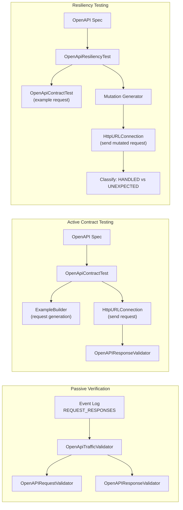

### Correlation ID Retrieval

All log entries for a single incoming HTTP request share the same `correlationId` (a UUID assigned in `HttpState.handle()`). The `PUT /mockserver/retrieve?type=LOGS&correlationId=<id>` endpoint retrieves all log entries for a specific correlation ID, enabling request-to-match-attempts correlation. The Java client exposes this via `MockServerClient.retrieveLogsByCorrelationId(String)`, and the dedicated MCP `retrieve_logs` tool (as well as the generic `raw_retrieve` tool) supports a `correlationId` parameter.

### Typed Log Entry Retrieval

The `LOGS` retrieve type now supports `format=LOG_ENTRIES` to return structured `LogEntry[]` JSON instead of plain text. This enables typed programmatic access to log entries in the Java client:

- `MockServerClient.retrieveLogEntries(RequestDefinition)` — returns `LogEntry[]` matching a request pattern
- `MockServerClient.retrieveLogEntriesByCorrelationId(String)` — returns `LogEntry[]` for a specific correlation ID
- `MockServerClient.retrieveLogEntries(RequestDefinition, long, long)` — time-filtered variant using epoch milliseconds

Deserialization is handled by `LogEntrySerializer.deserializeArray()` using Jackson's `ObjectMapper.readValue()` directly against the `LogEntry` class. Fields that survive the round-trip: `logLevel`, `epochTime`, `timestamp`, `type`, `correlationId`, `port`, `expectationId`, `messageFormat`, `arguments`, `because`. Fields serialized by the custom `LogEntrySerializer` but NOT deserialized (returned as `null`): `httpRequest`, `httpResponse`, `httpError`, `expectation`, `throwable` — their setters are `@JsonIgnore` because the types (`RequestDefinition`, `Expectation`) lack default constructors needed for Jackson deserialization.

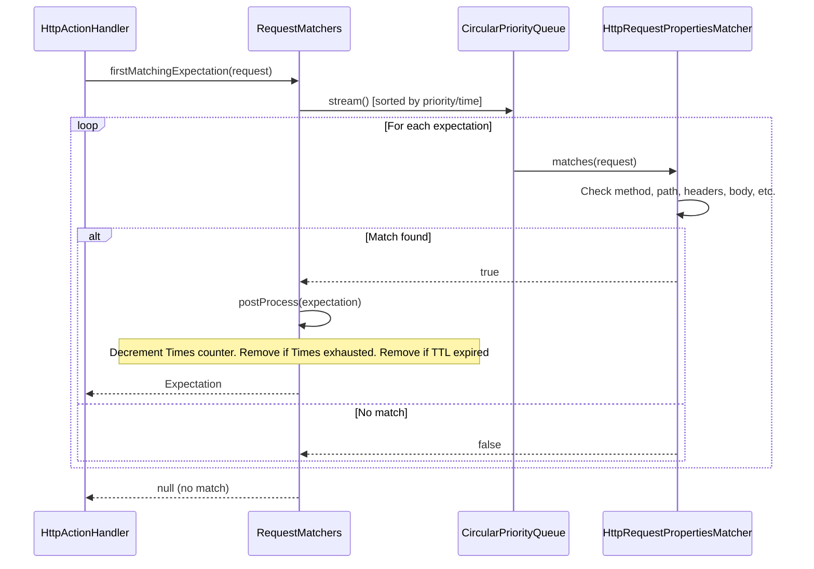

### Protocol Matching and Verification

`HttpRequestPropertiesMatcher` matches on the **negotiated protocol** a request arrived over, exposed
as the `org.mockserver.model.Protocol` enum (`HTTP_1_1`, `HTTP_2`, `HTTP_3` — `HTTP_3` is experimental).
An expectation built with `request().withProtocol(Protocol.HTTP_2)` only matches requests negotiated
over HTTP/2; the same field on a `verify(...)` request asserts how a recorded request arrived. Protocol
is **optional**: a `null` expectation protocol matches a request regardless of the request's protocol
(`protocolMatcher` is built from `null` and the `ExactStringMatcher` treats that as match-any), so
existing expectations that do not specify a protocol are unaffected.

How the request's protocol is tagged (server-trusted, not client-supplied):

| Arrival path | Tagged as | Where |
|--------------|-----------|-------|
| HTTP/1.1 (TCP) | `HTTP_1_1` (or `null` for mocking) | `FullHttpRequestToMockServerHttpRequest` |
| HTTP/2 via ALPN (`h2`) | `HTTP_2` | ALPN negotiation in `PortUnificationHandler` |
| HTTP/2 cleartext (`h2c`) | `HTTP_2` | `PortUnificationHandler` sets a trusted negotiated-protocol channel attribute (the `Upgrade` header alone is not trusted) |
| HTTP/3 over QUIC (`h3`) | `HTTP_3` | `Http3RequestBridge.toHttpRequest` — the `h3` ALPN identifier is always trusted, so there is no header-spoofing concern |

The `protocol` field round-trips through `HttpRequestDTO`, the request serializers
(`HttpRequestSerializer` / `HttpRequestDTOSerializer`), `RequestDefinitionDTODeserializer`, the request
JSON Schema (`protocol.json`), and the embedded OpenAPI model — and through the **pretty-printed
retrieval DTO** (`HttpRequestPrettyPrintedDTO`), so a request retrieved via
`retrieveRecordedRequests(...)` carries the protocol it arrived over for HTTP/2 and HTTP/3 alike.

### Post-Processing

After a match, `postProcess()`:
1. Decrements the `Times` counter
2. Checks if `Times` is exhausted → removes expectation
3. Checks if `TimeToLive` has expired → removes expectation
4. Notifies `MockServerMatcherListener`s of the change

## Action Types

Each `Expectation` binds a request matcher to exactly one action. There are 19 action types across two categories:

### Response Actions

| Type | Handler | Description |
|------|---------|-------------|
| `RESPONSE` | `HttpResponseActionHandler` | Returns a static `HttpResponse`. When the response body is a `FileBody` carrying a `templateType` (`VELOCITY`/`MUSTACHE`), the file contents are rendered as a template against the request before being returned |
| `RESPONSE_TEMPLATE` | `HttpResponseTemplateActionHandler` | Evaluates a template (Velocity/Mustache/JavaScript) to generate the response. The template text may be supplied inline (`template`) or loaded from a file (`templateFile`); inline takes precedence — see `HttpTemplate.getTemplateContent()` |
| `RESPONSE_CLASS_CALLBACK` | `HttpResponseClassCallbackActionHandler` | Loads a Java class implementing `ExpectationResponseCallback`, invokes `handle(request)` |
| `RESPONSE_OBJECT_CALLBACK` | `HttpResponseObjectCallbackActionHandler` | Sends request to a WebSocket-connected client, awaits response callback |
| `SSE_RESPONSE` | `HttpSseResponseActionHandler` | Streams Server-Sent Events with per-event delays, optional `closeConnection` flag |
| `WEBSOCKET_RESPONSE` | `HttpWebSocketResponseActionHandler` | Upgrades to WebSocket and sends a sequence of `WebSocketMessage` frames with per-message delays. When subprotocol is `graphql-transport-ws`/`graphql-ws` with a `graphqlSubscriptionFilter`, installs `GraphQLSubscriptionHandler` for the graphql-transport-ws protocol state machine |
| `GRPC_STREAM_RESPONSE` | `GrpcStreamResponseActionHandler` | Streams gRPC-framed protobuf messages with per-message delays and grpc-status trailers (Netty only; returns 501 in WAR) |
| `GRPC_BIDI_RESPONSE` | `GrpcBidiRouterHandler` / `GrpcBidiStreamHandler` | Bidirectional gRPC streaming via the multiplex pipeline (requires `grpcBidiStreamingEnabled=true`; returns 501 otherwise or in WAR) |
| `BINARY_RESPONSE` | (inline in `BinaryRequestProxyingHandler`) | Returns raw binary bytes when a `BinaryRequestDefinition` matches |
| `DNS_RESPONSE` | (inline in `DnsRequestHandler`) | Returns DNS response records when a `DnsRequestDefinition` matches a UDP DNS query |
### Forward Actions

| Type | Handler | Description |
|------|---------|-------------|
| `FORWARD` | `HttpForwardActionHandler` | Forwards to a specified host:port:scheme |
| `FORWARD_TEMPLATE` | `HttpForwardTemplateActionHandler` | Template generates the forwarding request |
| `FORWARD_CLASS_CALLBACK` | `HttpForwardClassCallbackActionHandler` | Java class modifies the request before forwarding |
| `FORWARD_OBJECT_CALLBACK` | `HttpForwardObjectCallbackActionHandler` | WebSocket client modifies request before forwarding |
| `FORWARD_REPLACE` | `HttpOverrideForwardedRequestActionHandler` | Applies request/response overrides and modifiers |
| `FORWARD_VALIDATE` | `HttpForwardValidateActionHandler` | Forwards and validates request/response against an OpenAPI spec |
| `FORWARD_WITH_FALLBACK` | `HttpForwardWithFallbackActionHandler` | Forwards to upstream; returns a fallback mock response on 5xx or timeout |

### Forward with Fallback

The `FORWARD_WITH_FALLBACK` action combines MockServer's proxy and mock capabilities: it
forwards the request to a real upstream service, but if the upstream returns a status code
matching the fallback criteria (default: 500-599) or the connection fails/times out, a
pre-configured fallback response is returned instead of the error.

This is useful for resilience testing and development against partially-available services:
the mock provides a reliable baseline while the upstream is flaky or under development.

Configuration via `HttpForwardWithFallback`:
- `httpForward` -- the upstream target (host, port, scheme)
- `fallbackResponse` -- the mock response to return when fallback triggers
- `fallbackOnStatusCodes` -- list of status codes that trigger fallback (default: 500-599)
- `fallbackOnTimeout` -- whether to fall back on connection errors/timeouts (default: true)

### Forward Retry & Per-Upstream Circuit Breaker

All matched FORWARD-class actions (`FORWARD`, `FORWARD_TEMPLATE`, `FORWARD_CLASS_CALLBACK`, `FORWARD_REPLACE`, `FORWARD_VALIDATE`, `FORWARD_WITH_FALLBACK`, `FORWARD_OBJECT_CALLBACK`) funnel through `HttpForwardAction.sendRequest(...)`, the single place that calls `NettyHttpClient`. Two **opt-in, default-off** resilience controls wrap that call so existing behaviour (forward exactly once, always attempt) is byte-for-byte unchanged unless configured.

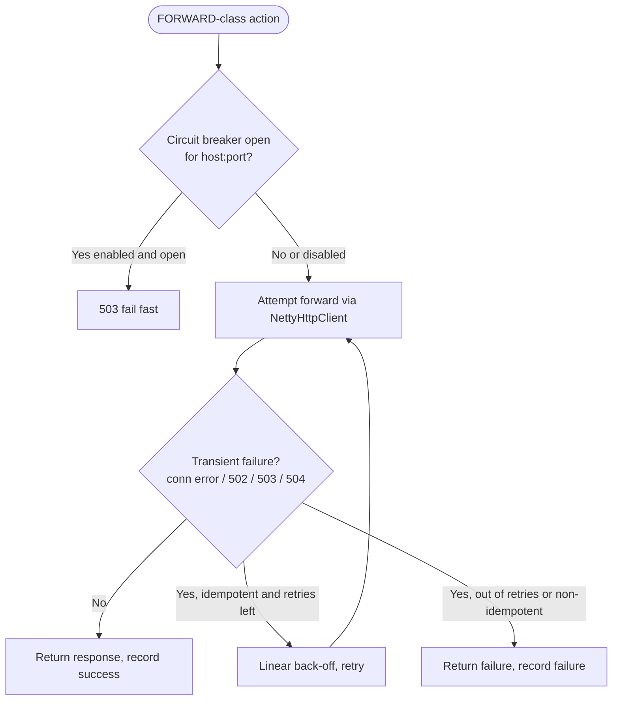

- **Retry** (`ForwardRetryPolicy`, config `forwardProxyRetryCount` / `forwardProxyRetryBackoffMillis`): re-issues the upstream call up to *N* times when an attempt is a transient failure — a connection-level exception or an upstream **502/503/504**. Only **idempotent** methods (GET, HEAD, OPTIONS, PUT, DELETE, TRACE) are retried; POST/PATCH are never retried so a request is never executed twice. Retries are chained asynchronously off the response future (never blocking the event loop) with a linear back-off (`backoff × attemptNumber`). Default `forwardProxyRetryCount=0` = forward exactly once.
- **Circuit breaker** (`ForwardCircuitBreaker`, config `forwardProxyCircuitBreakerEnabled` + threshold/window): a process-wide singleton keyed by upstream `host:port`. After `forwardProxyCircuitBreakerFailureThreshold` consecutive failures the breaker trips **open** and `sendRequest` fails fast with a 503 (no upstream attempt) for `forwardProxyCircuitBreakerWindowMillis`; then **half-open** admits a single trial request — a success closes it, a failure re-opens it. The retry policy and breaker compose: a request's final outcome (after any retries) feeds `recordSuccess`/`recordFailure`. The open-upstream count is exported as the `mock_server_upstream_circuit_open` gauge (see [metrics.md](metrics.md)) and reset on `HttpState.reset()`.

The unmatched speculative-proxy path (`HttpActionHandler`, which calls `NettyHttpClient` directly) is intentionally **not** wrapped by these controls; they apply to matched forward expectations. Self-loopback relay and the HTTP/2/HTTP/3 forward paths are unaffected (the breaker only keys on a resolvable host, and retry only engages for idempotent methods when explicitly configured).

### Host Header Auto-Adjustment

When forwarding requests via `FORWARD_REPLACE` or `FORWARD_TEMPLATE` actions, MockServer can automatically adjust the `Host` header to match the target server. This is controlled by the `forwardAdjustHostHeader` configuration property (default: `true`).

This prevents HTTP 421 "Misdirected Request" errors that occur when the target server validates the Host header against its own server name. The adjustment uses the `socketAddress` on the request to compute the correct Host value. If an explicit Host header is provided in the request override, it is always preserved.

The `FORWARD` action type (`HttpForwardActionHandler`) has always adjusted the Host header to match the forward target; this behaviour is unchanged.

### Error Action

| Type | Handler | Description |
|------|---------|-------------|
| `ERROR` | `HttpErrorActionHandler` | Writes raw bytes and/or drops the connection |

### LLM Response Action

| Type | Handler | Description |
|------|---------|-------------|
| `LLM_RESPONSE` | `HttpLlmResponseActionHandler` | Encodes a provider-correct LLM response from a high-level `Completion` |

`HttpLlmResponseActionHandler` routes to the appropriate `ProviderCodec` based on the `HttpLlmResponse.provider` field. For non-streaming completions, the codec produces an `HttpResponse` directly. For streaming completions, the codec produces a `List<SseEvent>` via `StreamingPhysicsExpander`, which is then handed to `HttpSseResponseActionHandler` for delivery.

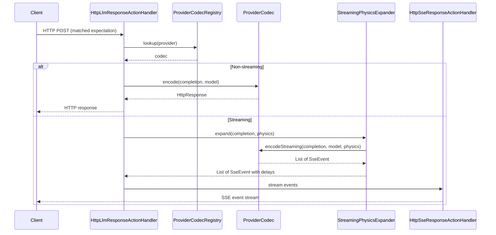

See [LLM Mocking](llm-mocking.md) for the full architecture.

### Sequential/Cycling Response Dispatch

When an expectation is configured with `httpResponses` (a list of `HttpResponse` objects) instead of a single `httpResponse`, each match returns the next response in the list. The selection is controlled by `responseMode`:

- **`SEQUENTIAL`** (default): Returns responses in order, cycling back to the first after the last. Uses `(matchCount - 1) % size` because `matchCount` is incremented in `consumeMatch()` before `getPrimaryAction()` is called.
- **`RANDOM`**: Returns a random response from the list on each match (uniform probability).
- **`WEIGHTED`**: Returns a response chosen probabilistically by relative weight. Weights are supplied via the index-aligned `responseWeights` list on the expectation (e.g. `[90, 10]` selects the first response ~90% of the time and the second ~10%). A missing or non-positive weight defaults to `1`; if the total effective weight is non-positive, selection falls back to uniform random. Implemented as cumulative-weight selection in `Expectation.selectWeightedResponse()`.

The cycling/selection logic is in `Expectation.getPrimaryAction()` -> `selectFromResponses()`. The `matchCount` is tracked per-expectation via an `AtomicInteger` and is runtime-only state (`@JsonIgnore`). `responseWeights` is a serialized field that round-trips in expectation JSON; weights are ignored unless `responseMode` is `WEIGHTED`.

### Before & After Actions

An expectation can carry two optional ordered lists of side-effect actions, both using the same `AfterAction` type (exactly one of `httpRequest`, `httpClassCallback`, or `httpObjectCallback`, plus an optional `Delay`):

- **`afterActions`** — executed *after* the primary response is sent. Dispatched fire-and-forget via `HttpActionHandler.dispatchSideAction(...)` from `expectationPostProcessor` (which also runs `HttpState.postProcess`). Responses are discarded and failures are only logged, so they never alter or delay the client response.
- **`beforeActions`** — executed *before* the primary response and able to gate it. When an expectation has `beforeActions`, `processAction` wraps `runBeforeActions(...)` plus `dispatchPrimaryAction(...)` in `scheduler.submit(runnable, synchronous)` so any blocking wait runs off the event loop (async) or inline (synchronous), mirroring forward-action threading.

`runBeforeActions` iterates the list applying three optional per-action controls that are meaningful only here (after-actions ignore them):

- `blocking` (default `true` when null) — whether the response waits for the action.
- `timeout` (a `Delay`; falls back to `configuration.maxSocketTimeoutInMillis()`) — max wait for a blocking action.
- `failurePolicy` (`FAIL_FAST` or `BEST_EFFORT`, default `BEST_EFFORT`) — outcome when a blocking action fails or times out.

Only `httpRequest` (webhook) before-actions can actually block: they are sent via the synchronous `httpClient.sendRequest(req, timeoutMillis, MILLISECONDS)` (throws on error/timeout). On failure, `FAIL_FAST` writes a `502` (`badGatewayResponse().withBody("before-action failed: ...")`) and `runBeforeActions` returns `false` so the primary action is skipped; `BEST_EFFORT` logs and continues. Non-blocking before-actions and callback before-actions are dispatched fire-and-forget via `dispatchSideAction` (a WARN is logged if `blocking=true` is set on a callback). When `runBeforeActions` returns `false`, `expectationPostProcessor.run()` is still invoked (it is idempotent via `compareAndSet`) so matcher state — `responseInProgress`, `times` exhaustion — is cleaned up and after-actions still fire after the `502`. Webhook fields support `{$request.*}` runtime expressions, resolved against the triggering request via `OpenApiRuntimeExpressionResolver`.

#### Unified Ordered Steps

When an expectation has `steps` (a `List<ExpectationStep>`), the dispatch pipeline is:

1. **Pre-responder steps** — extracted by `Expectation.getPreResponderSteps()`, dispatched by `HttpActionHandler.runStepsPreResponder()`. Each step follows the same blocking/timeout/failurePolicy semantics as before-actions. Webhook steps can block; callback and forward side-effect steps are fire-and-forget.
2. **Responder step** — the single step with `responder = true`. Its action is resolved via `Expectation.resolveStepAction()` and dispatched through the existing `dispatchPrimaryAction()` path (the normal action-type switch).
3. **Post-responder steps** — extracted by `Expectation.getPostResponderSteps()`, dispatched by `HttpActionHandler.dispatchPostResponderSteps()` as fire-and-forget side-effects via `dispatchStepSideEffect()`.

Steps and `beforeActions`/`afterActions` are independent: when `steps` is present it determines the pre/post pipeline ordering. Any existing `afterActions` still fire after the steps pipeline completes (from `expectationPostProcessor`). Validation is enforced at upsert time in `HttpState.add()` via `Expectation.validateSteps()`.

### Template Engines

Three template engines are supported for `RESPONSE_TEMPLATE` and `FORWARD_TEMPLATE`:

| Engine | Class | Template Variable |
|--------|-------|-------------------|
| Velocity | `VelocityTemplateEngine` | `$request` |
| Mustache | `MustacheTemplateEngine` | `request` (with `#jsonPath` and `#xPath` lambdas) |
| JavaScript | `JavaScriptTemplateEngine` | `request` (Nashorn, Java 17+) |

All engines receive built-in dynamic variables from `TemplateFunctions.BUILT_IN_FUNCTIONS` (`now`, `now_epoch`, `now_iso_8601`, `uuid`, `rand_int`, `rand_bytes`, etc.) and five helper objects from `TemplateFunctions.BUILT_IN_HELPERS`:

| Helper | Variable | Description |
|--------|----------|-------------|
| `JwtTemplateHelper` | `jwt` | Generate signed JWTs (`jwt.generate()`, `jwt.generate(claims)`) and JWKS (`jwt.jwks()`) for OAuth2/OIDC testing |
| `StringTemplateHelper` | `strings` | String manipulation: `trim`, `capitalize`, `uppercase`, `lowercase`, `urlEncode`, `urlDecode`, `base64Encode`, `base64Decode`, `substringBefore`, `substringAfter`, `length`, `contains`, `replace` |
| `JsonTemplateHelper` | `jsonTransform` | JSON manipulation: `merge`, `sort`, `arrayAdd`, `remove`, `prettyPrint`, `field`, `size` |
| `DateTemplateHelper` | `dates` | Date/time arithmetic: `format(pattern)`, `plusSeconds/Minutes/Hours/Days`, `minusSeconds/Minutes/Hours/Days`, `epochSeconds`, `epochMillis`, `epochSecondsPlus/Minus` |
| `MathTemplateHelper` | `calc` | Math operations: `randomInt(min,max)`, `randomDouble()`, `abs`, `min`, `max`, `round(value,scale)`, `format(value,pattern)`, `ceil`, `floor` |

Helper objects are registered as template context variables, so methods are called directly (e.g., Velocity: `$strings.uppercase($!request.method)`, JavaScript: `dates.plusHours(1)`, Mustache: `{{ jwt }}`).

#### Templates loaded from a file

The template text for `RESPONSE_TEMPLATE` and `FORWARD_TEMPLATE` can be stored in an external file instead of being embedded inline in the expectation. Set `templateFile` (a classpath-or-filesystem path resolved by `FileReader.readFileFromClassPathOrPath`) on the `httpResponseTemplate` / `httpForwardTemplate`. `HttpTemplate.getTemplateContent()` returns the inline `template` when present, otherwise reads `templateFile`; the action handlers and `HttpOverrideForwardedRequestActionHandler` all call `getTemplateContent()`. This keeps the full template machinery (rendering an `HttpResponseDTO`/`HttpRequestDTO`) while letting large templates live outside the expectation JSON.

#### Templated response body files (`FileBody` + `templateType`)

A static `RESPONSE` whose body is a `FileBody` can mark the file as a template by setting `templateType` to `VELOCITY` or `MUSTACHE`. `HttpResponseActionHandler.handle(httpResponse, httpRequest)` reads the file, renders it through `TemplateEngine.renderTemplate(...)` (raw text render — no `HttpResponseDTO` deserialization), and replaces the body with the rendered string (preserving the declared content type). This differs from `RESPONSE_TEMPLATE`: the file is just the **body** payload (rendered as-is), while the surrounding status code, headers, etc. come from the static response. `JAVASCRIPT` is intentionally **not** supported for body files (JS templates return structured objects, not text) — use `RESPONSE_TEMPLATE` with a JavaScript template for that. The request is only available on the primary/secondary `RESPONSE` dispatch paths, so the no-request `handle(httpResponse)` overload returns the `FileBody` verbatim.

### Generating a response body from an inline JSON Schema

A static `RESPONSE` with **no explicit body** can set `generateFromSchema` to a plain (inline) JSON Schema. When `HttpResponseActionHandler.handle(...)` sees an unset body and a non-blank `generateFromSchema`, it delegates to `JsonSchemaResponseSynthesizer`, which wraps the inline schema in a minimal OpenAPI document, parses it with the same `OpenAPIParser` used for full specs (so typed swagger `Schema` subclasses, `$ref`, `allOf` and OpenAPI 3.1 type arrays are produced), and runs the existing `ExampleBuilder`/`SampleDataGenerator` engine — no example-generation logic is reimplemented. The generated body is set as a JSON `StringBody`. An explicit body always wins (the schema path only fills an unset body), and this synthesis does not depend on the request, so it also runs on the no-request `handle(httpResponse)` overload (unlike GraphQL synthesis below, which requires the request query). A schema that cannot be parsed (`JsonSchemaResponseSynthesisException`) is logged at WARN and leaves the body unset rather than failing the request.

## WebSocket Object Callbacks

For `RESPONSE_OBJECT_CALLBACK` and `FORWARD_OBJECT_CALLBACK`, the callback runs on the client side:

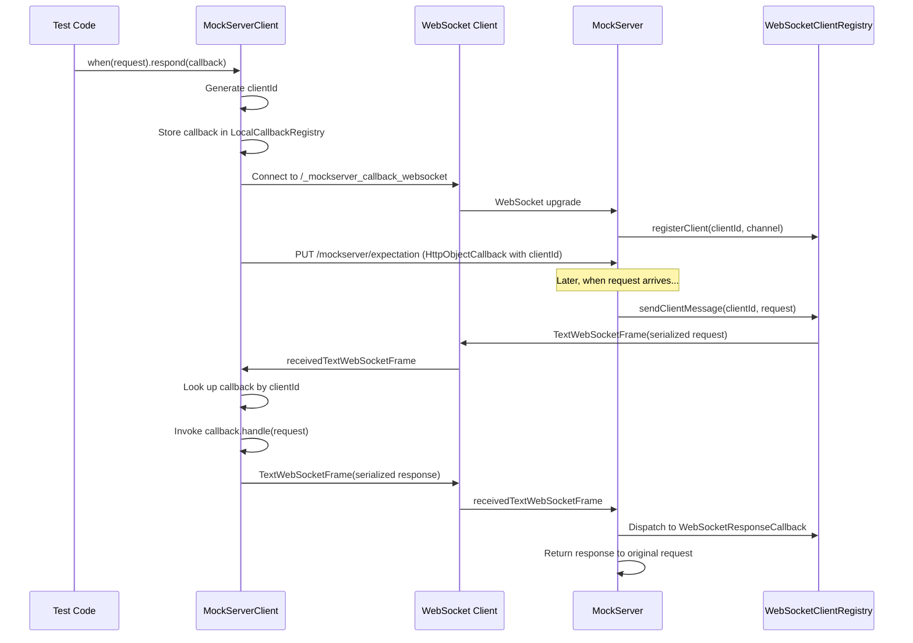

## Global Response Delay

The `globalResponseDelayMillis` configuration property adds a fixed delay to all matched expectation responses. The delay is **additive** — it combines with any per-action delay. Implementation:

- `HttpActionHandler.combineWithGlobalDelay(Delay actionDelay)` returns a `Delay[]` passed as varargs to `Scheduler.schedule()`
- `Scheduler.sampleCombinedDelayMillis()` sums all delay samples
- Only applies to the primary response path (not after-actions or secondary actions)
- Only applies when an expectation matches (unmatched/proxied requests are not delayed)

## Proxy Forwarding

When no expectation matches and the channel is in proxy mode, `HttpActionHandler` forwards via `NettyHttpClient`:

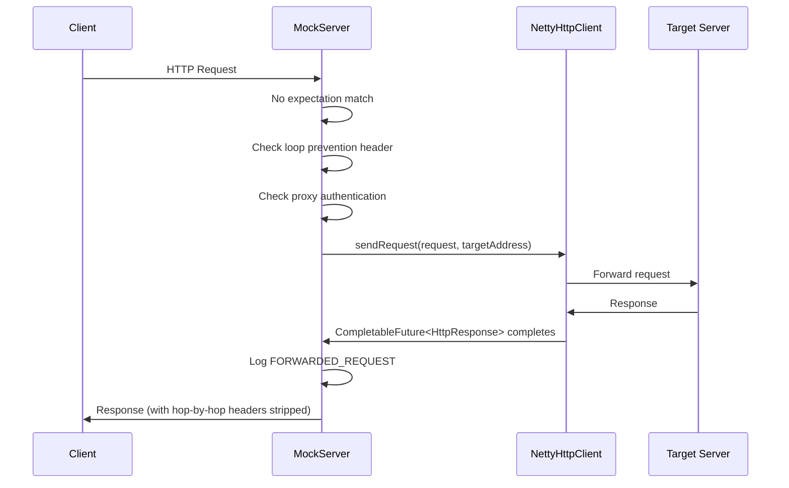

### Streaming Forward Path

When the upstream response is a streaming response (detected from `Content-Type: text/event-stream`), and `streamingResponsesEnabled` is `true` (default), MockServer relays chunks incrementally rather than buffering the entire body. Only SSE responses are detected as streaming; ordinary chunked responses are aggregated normally.

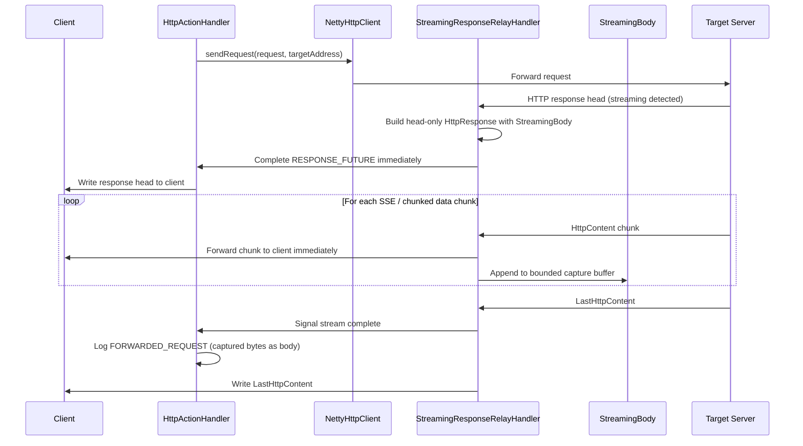

Key behavioural points:

- The `CompletableFuture<HttpResponse>` completes at **response-head time** (not after the full body is received), so the global socket timeout (`maxSocketTimeoutInMillis`) no longer applies to the streamed portion. A per-stream `IdleStateHandler` enforces `streamIdleTimeoutSeconds` between chunks instead.
- The full stream always reaches the client. The capture buffer is bounded to `maxStreamingCaptureBytes` (default 256 KB). When exceeded, the logged body is truncated and the `FORWARDED_REQUEST` log entry carries `x-mockserver-stream-truncated: true`.
- Non-streaming responses are unaffected — `StreamingAwareHttpObjectAggregator` detects the response type and delegates to the standard `HttpObjectAggregator` path for non-streaming responses.
- `FORWARD_REPLACE` (`overrideHttpResponse`) is incompatible with streaming because the response override/modifier/template needs the full response body. When a response override, response modifier, or response template is present, `HttpOverrideForwardedRequestActionHandler` passes `disableStreaming=true` through `HttpForwardAction.sendRequest` to `NettyHttpClient.sendRequest`, which sets the `DISABLE_RESPONSE_STREAMING` channel attribute. `StreamingAwareHttpObjectAggregator.channelRead` checks this attribute and always delegates to the standard `HttpObjectAggregator` path when it is set, ensuring the response is fully aggregated regardless of `streamingResponsesEnabled`.
- WAR deployments (`ctx == null`) always use the buffered path.

### ProxyPass (Reverse Proxy)

The `proxyPass` configuration property allows MockServer to act as a reverse proxy, mapping incoming path prefixes to upstream servers with automatic path rewriting. This is evaluated in `HttpActionHandler.handleProxyPass()` after expectation matching and CORS, but before the speculative proxy attempt.

Each mapping specifies a `pathPrefix` (e.g. `/api/`), a `targetUri` (e.g. `https://backend:8443/services/`), and an optional `preserveHost` flag. When a request path starts with the prefix, the path is rewritten (prefix stripped, target path prepended) and forwarded to the target host:port. The Host header is adjusted to match the target unless `preserveHost` is true.

### Non-Proxy Hosts

The `noProxyHosts` configuration property (comma-separated list) controls which hosts MockServer will not proxy to. When a request's Host header matches a pattern in this list, MockServer returns a 404 instead of forwarding. This applies both to MockServer's speculative "attempt to proxy if no matching expectation" behaviour and to upstream proxy bypass in `NettyHttpClient`.

Patterns support exact hostnames (`example.com`), wildcard prefixes (`*.internal.corp`), and IP addresses (`192.168.1.1`). Matching is case-insensitive. The shared utility `NoProxyHostsUtils.isHostOnNoProxyList()` is used by both `HttpActionHandler` and `NettyHttpClient`.

### Validation Proxy (OpenAPI Contract Validation on Forwarded Traffic)

When `validateProxyOpenAPISpec` is set (to an OpenAPI spec URL, file path, or inline JSON/YAML), MockServer validates every forwarded/proxied request and its upstream response against the spec. This applies to both the unmatched proxy forward path and the ProxyPass reverse-proxy path. Request violations are logged as `OPENAPI_REQUEST_VALIDATION_FAILED` and response violations as `OPENAPI_RESPONSE_VALIDATION_FAILED` log entries.

By default, validation is **report-only**: traffic flows unmodified and violations are only logged. When `validateProxyEnforce` is set to `true`, non-conformant requests are rejected with a **400** status code before they reach the upstream, and non-conformant **buffered** (non-streaming) upstream responses are replaced with a **502**.

**Streaming response limitation:** For streaming responses the body is written to the client as it arrives, before validation can inspect the complete body. In enforce mode, streaming responses are therefore validated in **report-only** fashion (violations logged but not blocked) even when `validateProxyEnforce=true`. Non-streaming responses are fully enforced.

The validation uses `OpenAPIRequestValidator` for requests and `OpenAPIResponseValidator` for responses (response-only, avoiding the double request validation that `OpenApiTrafficValidator` would perform). Both validation phases run off the Netty event loop (inside the scheduler thread pool) to avoid blocking I/O threads on cold-cache OpenAPI spec parsing or JSON-schema validation.

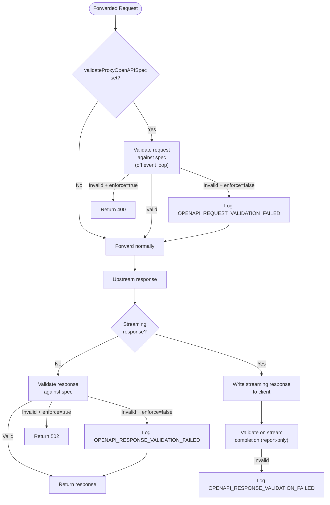

| Configuration Property | Type | Default | Description |
|----------------------|------|---------|-------------|
| `validateProxyOpenAPISpec` | String | `""` (disabled) | OpenAPI spec URL, file path, or inline payload to validate forwarded traffic against |
| `validateProxyEnforce` | Boolean | `false` | When true, block non-conformant traffic (400 for bad requests, 502 for bad non-streaming responses). Streaming responses are validated report-only. |

### Loop Prevention

To prevent infinite forwarding loops (where MockServer forwards to itself), an `x-forwarded-by` header with a unique per-instance value (`MockServer_<UUID>`) is added to forwarded requests. If an incoming request already has this header with the matching value, it is identified as a loop and returned with a 404.

### Proxy Authentication

HTTP proxy requests can require Basic authentication. The `HttpRequestHandler` checks the `Proxy-Authorization` header against configured credentials. On failure, it returns 407 with a `Proxy-Authenticate: Basic` header.

## WAR Deployment (Servlet Mode)

`MockServerServlet` and `ProxyServlet` bridge the Servlet API to the same core processing:

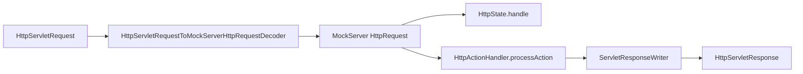

The only difference between the two servlets is a single boolean flag: `ProxyServlet` passes `proxyRequest=true` to `processAction()`, enabling forwarding of unmatched requests.

**WAR limitations**: WebSocket callbacks, dynamic port binding, and server stop are not supported.

## Startup Initialisation

`HttpState` performs several initialisation steps in its constructor:

| Step | Condition | Class |
|------|-----------|-------|
| File persistence | `configuration.persistExpectations()` | `ExpectationFileSystemPersistence` |
| Expectation loading | `initializationJsonPath`, `initializationOpenAPIPath`, or `initializationClass` set | `ExpectationInitializerLoader` |
| JSON file watching | `watchInitializationJson` enabled | `ExpectationFileWatcher` |
| Memory monitoring | `outputMemoryUsageCsv` enabled | `MemoryMonitoring` |

### Loop Prevention Header

MockServer adds an `x-forwarded-by` header to forwarded requests to prevent infinite loops. The header name is fixed (`x-forwarded-by`); the value is generated per server instance using the pattern `MockServer_<UUID>`. If an incoming request already contains this header with the matching value, it is identified as a loop and returned with a 404.

## CRUD Simulation

The CRUD simulation feature allows auto-generating stateful REST endpoints from a data model definition. Registered via `PUT /mockserver/crud`, it creates 5 endpoints (GET list, GET by ID, POST, PUT, DELETE) backed by an in-memory data store.

### Architecture

CRUD requests are intercepted in `HttpActionHandler.processAction()` **before** normal expectation matching. The dispatch chain is:

1. `CrudDispatcher.dispatch(request)` checks if the request path matches any registered CRUD basePath
2. If matched, delegates to the appropriate `CrudActionHandler` method based on HTTP method and path structure
3. If no CRUD match, falls through to normal expectation matching

### Key Classes

| Class | Location | Purpose |
|-------|----------|---------|
| `CrudExpectationsDefinition` | `mockserver-core/.../model/` | POJO model for the CRUD definition (basePath, idField, idStrategy, initialData) |
| `CrudDataStore` | `mockserver-core/.../mock/crud/` | Thread-safe in-memory store using ConcurrentHashMap + ConcurrentLinkedDeque |
| `CrudActionHandler` | `mockserver-core/.../mock/crud/` | Handles CRUD operations, produces HttpResponse objects |
| `CrudDispatcher` | `mockserver-core/.../mock/crud/` | Routes requests to the correct handler based on path and method |

### Thread Safety

`CrudDataStore` uses `ConcurrentHashMap` for data storage and `ConcurrentLinkedDeque` for insertion order tracking. The `AtomicLong` counter handles auto-increment ID generation. All operations are individually thread-safe.

### Reset Behaviour

`CrudDispatcher.reset()` is called during `HttpState.reset()`, clearing all CRUD registrations.

## Binary Mock Processing

When `BinaryRequestProxyingHandler` receives raw bytes on a channel, it first checks for a matching expectation via `HttpState.firstMatchingExpectation(BinaryRequestDefinition)`. If a match is found with a `BinaryResponse` action, the handler writes the response bytes directly to the channel. If no match is found and the channel is in proxy mode (remote address configured), the bytes are forwarded to the upstream server as before.

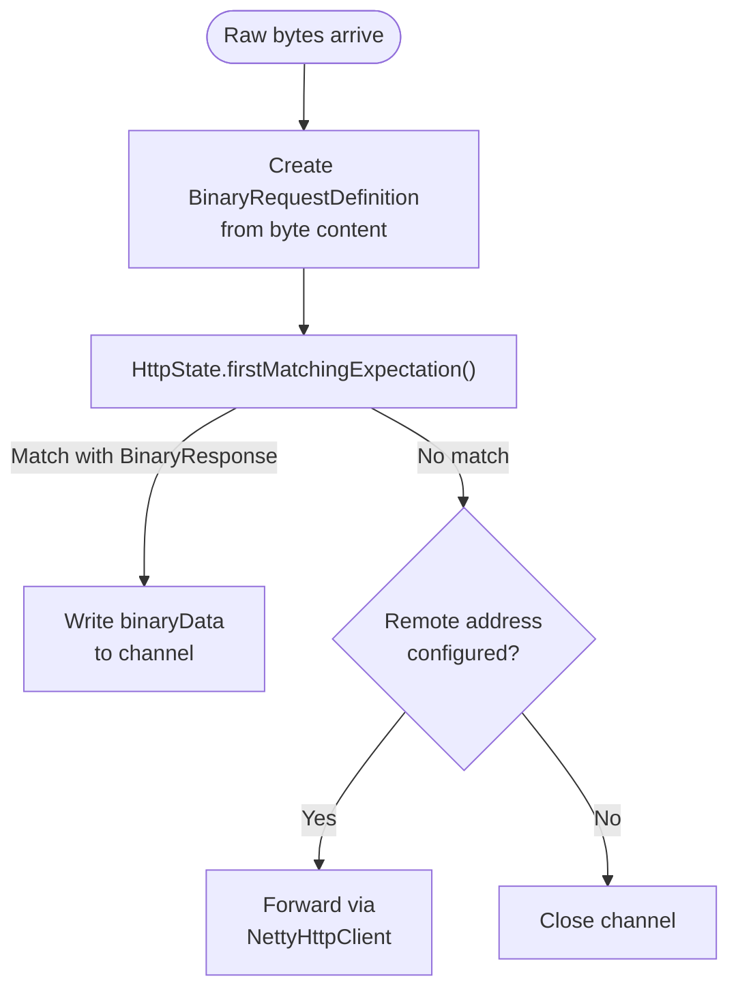

## DNS Mock Processing

DNS queries arrive via UDP on a separate `DatagramChannel` bound by `MockServer.bindDnsPort()`. The `DnsRequestHandler` decodes the query, creates a `DnsRequestDefinition`, and matches it against expectations.

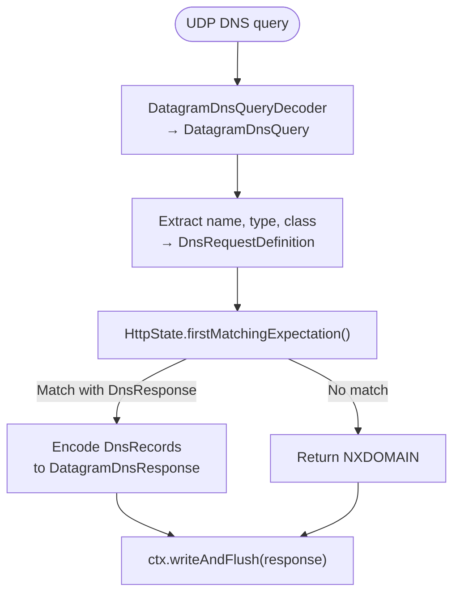

Supported DNS record types: A, AAAA, CNAME, MX, SRV, TXT, PTR. The DNS server is disabled by default (`dnsEnabled=false`) and must be explicitly enabled.

## OpenAPI Callback Support

When expectations are generated from an OpenAPI specification (via `PUT /mockserver/openapi` or `initializationOpenAPIPath`), MockServer now automatically processes `callbacks` defined on operations.

For each callback in the OpenAPI spec, `OpenAPIConverter.buildAfterActions()`:
1. Extracts the callback URL expression (e.g., `{$request.body#/callbackUrl}`)
2. Resolves the HTTP method from the callback operation
3. Extracts the request body schema and generates an example body
4. Creates an `AfterAction` with a `HttpForward`-style webhook that fires after the main response

Runtime expressions in callback URLs (e.g., `{$request.body#/callbackUrl}`) are preserved verbatim at spec-conversion time and resolved at callback fire-time by `OpenApiRuntimeExpressionResolver.resolve()`. The resolver is called in `HttpActionHandler.dispatchAfterAction()` and supports:

- `{$request.body#/<json-pointer>}` — JSON Pointer into the triggering request body (via Jackson `JsonNode.at()`)
- `{$request.query.<name>}` — query parameter value from the triggering request
- `{$request.header.<name>}` — header value from the triggering request
- `{$request.path.<name>}` — path parameter (best-effort; requires path parameters to be populated)
- `{$request.method}` — HTTP method of the triggering request
- `{$url}` — reconstructed URL of the triggering request

Unresolvable expressions (unknown format, missing values) are replaced with empty string. Response-based expressions (`{$response.body#/...}`, `{$response.header.*}`) are out of scope because the response object is not available at after-action dispatch time — these are also replaced with empty string.

The resolver guarantees a **strict no-op** when the after-action request contains no `{$...}` expressions: the original instance is returned without cloning or allocation. This ensures zero overhead for the vast majority of after-actions (plain webhooks).

Static callback URLs are used as-is (parsed into path + Host header at conversion time).

Remaining limitations:
- Only `post`, `put`, `patch`, `get`, and `delete` callback methods are supported
- Callback request bodies use the first available media type schema
- Response-based expressions are not resolved (response not available at dispatch time)

## Incremental OpenAPI Sync

The `PUT /mockserver/openapi` endpoint performs **idempotent, incremental synchronization** when re-importing an OpenAPI specification. Each generated expectation receives a stable, deterministic id of the form `openapi:<specKey>:<operationId>` (with `:<n>` appended only to disambiguate multiple expectations for the same operation, e.g. different response codes).

The `specKey` is derived from the parsed `info.title` field of the OpenAPI spec (lowercased, non-alphanumeric characters replaced with `_`). If the title is blank, a short hex hash of the raw spec payload/URL is used instead.

When the endpoint processes an import:

1. `OpenAPIConverter.buildExpectations()` generates expectations with stable ids
2. `HttpState.add(OpenAPIExpectation)` identifies the namespace prefixes (e.g. `openapi:swagger_petstore:`) covered by the new expectations
3. Existing expectations whose id starts with a covered prefix but is **not** in the new id set are **pruned** (removed)
4. The new expectations are upserted (added or updated in place by id)

This means:
- **Re-importing the same spec** is a no-op (same ids, same content)
- **Adding an operation** to the spec creates a new expectation without affecting existing ones
- **Removing an operation** from the spec prunes the corresponding expectation
- **Other specs and manually created expectations** are never affected (different namespace or no `openapi:` prefix)

The prune logic is encapsulated in `OpenApiSyncPlanner.idsToPrune()` for testability.

## Detailed Verification Failures (Diff Mode)

When `mockserver.detailedVerificationFailures` is enabled (default: `true`), verification failure messages include a "closest match diff" section showing exactly which fields of the closest matching request differed from the expected request.

### How It Works

In `MockServerEventLog.verify()`, after determining verification failed:
1. Creates an `HttpRequestPropertiesMatcher` for the verification request definition
2. Tests each received request against it with `detailedMatchFailures=true`
3. Identifies the closest match (fewest diff fields)
4. Appends formatted diff using `MatchDifferenceFormatter`

### 404 Closest Match Logging

When no expectation matches and a 404 is returned, `HttpActionHandler.returnNotFound()` calls `HttpState.findClosestMatchDiff()` to find the closest matching expectation's diff details and logs them at DEBUG level. By default the 404 response body is not modified to avoid breaking client assertions.

### Client-Visible Match Feedback (Opt-In)

When `attachMismatchDiagnosticToResponse` is enabled (default: `false`), unmatched 404 responses include diagnostic information to help test authors understand why their mock didn't match:

- **Header** `x-mockserver-closest-match`: lists the fields that differed (e.g., `fields differ: method, path`) or `no expectations configured` when no expectations exist.
- **Body**: a JSON object with `matchedFieldCount`, `totalFieldCount`, and a `differences` map keyed by field name, each containing an array of diff descriptions.

This reuses the existing `findClosestMatchDiff()` and `MatchDifferenceFormatter` infrastructure -- no new matcher logic is introduced. The diagnostic is only attached when the property is explicitly set to `true`; when off (the default), the response is byte-for-byte identical to previous behaviour.

### Key Classes

| Class | Location | Purpose |
|-------|----------|---------|
| `MatchDifferenceFormatter` | `mockserver-core/.../matchers/` | Formats `MatchDifference` maps into human-readable text |
| `MatchDifference` | `mockserver-core/.../matchers/` | Stores per-field match failure details (pre-existing) |
| `MatchFailureHints` | `mockserver-core/.../matchers/` | Generates actionable suggestions for common mismatches (pre-existing) |
| `MismatchRemediation` | `mockserver-core/.../matchers/` | Produces one-line remediation hints from `MatchDifference.Field` and diff messages (e.g., "use method POST not GET", "add trailing slash") |
