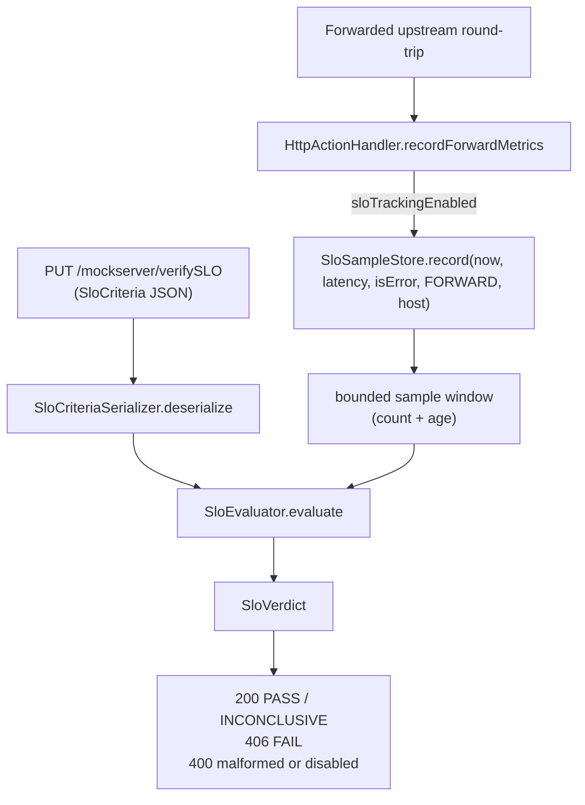

# SLO Verdicts

## Outcome

MockServer can answer **"did the traffic it just proxied meet a service-level
objective?"** synchronously, on demand. With `sloTrackingEnabled=true` it records a
windowed sample for every forwarded upstream round-trip; `PUT /mockserver/verifySLO`
evaluates a named set of objectives (latency percentiles, error rate) over a time
window and returns a PASS / FAIL / INCONCLUSIVE **verdict**. The HTTP status encodes
the verdict (`200` PASS or INCONCLUSIVE, `406` FAIL), so a CI/chaos gate can assert
on the status code alone.

The feature is off by default and the recording funnel is a no-op when disabled, so
the forward hot path pays nothing unless you opt in.

## Flow



## Key components

| Component | Path | Responsibility |
|-----------|------|----------------|
| `SloSampleStore` | `org.mockserver.slo.SloSampleStore` | Process-wide singleton holding the bounded sample window; `record(...)` (gated), windowed queries, static `percentile(...)`, `reset()` |
| `SloEvaluator` | `org.mockserver.slo.SloEvaluator` | Pure evaluation of an `SloCriteria` into an `SloVerdict` — resolves the window, computes each objective, AND-s the results |
| `SloCriteria` / `SloObjective` / `SloWindow` | `org.mockserver.slo` | The request model: a named set of objectives over a window |
| `SloVerdict` / `SloObjectiveResult` | `org.mockserver.slo` | The response model |
| `SloCriteriaSerializer` | `org.mockserver.serialization.SloCriteriaSerializer` | Lenient JSON parse of the request body (no JSON schema) and verdict serialization |
| `*DTO` | `org.mockserver.serialization.model.Slo*DTO` | Jackson-friendly holders bridging JSON and model |
| Routing + handler | `HttpState.handleVerifySlo(...)` | `PUT /mockserver/verifySLO` branch, auth-gated, immediately after `/verifySequence` |

## Request / response contract

`PUT /mockserver/verifySLO` body — an `SloCriteria`:

```json
{
  "name": "checkout-slo",
  "window": { "type": "LOOKBACK", "lookbackMillis": 60000 },
  "minimumSampleCount": 20,
  "upstreamHosts": ["payments.svc"],
  "objectives": [
    { "sli": "LATENCY_P95", "comparator": "LESS_THAN", "threshold": 250.0, "scope": "FORWARD" },
    { "sli": "ERROR_RATE",  "comparator": "LESS_THAN_OR_EQUAL", "threshold": 0.01 }
  ]
}
```

Response — an `SloVerdict`:

```json
{
  "name": "checkout-slo",
  "result": "PASS",
  "windowFromEpochMillis": 1700000000000,
  "windowToEpochMillis": 1700000060000,
  "sampleCount": 137,
  "objectiveResults": [
    { "sli": "LATENCY_P95", "comparator": "LESS_THAN", "threshold": 250.0, "observedValue": 210.0, "result": "PASS" },
    { "sli": "ERROR_RATE",  "comparator": "LESS_THAN_OR_EQUAL", "threshold": 0.01, "observedValue": 0.0, "result": "PASS" }
  ]
}
```

| Window type | Fields | Resolution |
|-------------|--------|------------|
| `LOOKBACK` | `lookbackMillis` | `[now - lookbackMillis, now]` using the controllable clock (`TimeService`) |
| `EXPLICIT` | `fromEpochMillis`, `toEpochMillis` | Used verbatim |

| SLI | Computation |
|-----|-------------|
| `LATENCY_P50` / `LATENCY_P95` / `LATENCY_P99` | Percentile over in-window latencies, `ceil(p/100 * n) - 1` index (same algorithm as `PercentileTracker`) |
| `ERROR_RATE` | `errors / total` over in-window samples; an error is status `null` or `>= 500` |

## Verdict logic and status mapping

A criteria PASSes only when **all** objectives hold (logical AND):

- any objective **FAIL** → verdict **FAIL** → HTTP `406 NOT_ACCEPTABLE`
- else any objective **INCONCLUSIVE**, or the window holds fewer than
  `minimumSampleCount` samples → verdict **INCONCLUSIVE** → HTTP `200`
- else → verdict **PASS** → HTTP `200`
- malformed body, or `sloTrackingEnabled=false` → HTTP `400` with a JSON `error`

An objective is INCONCLUSIVE when its indicator cannot be computed — no latency
samples in the window, or error rate over zero requests — so an empty window never
reports a misleading `0`.

## Rationale / trade-offs

- **Off by default, no-op funnel.** SLO tracking has its own `sloTrackingEnabled`
  gate, independent of Prometheus metrics, checked inside `SloSampleStore.record`.
  The forward path pays nothing when the feature is off.
- **Verdict in the status code.** Mapping FAIL → `406` lets a CI step or chaos
  experiment gate on `verifySLO` without parsing the body — mirroring how
  `/verify` and `/verifySequence` map a failed verification to `406`.
- **Lenient parse, no JSON schema.** The control-plane contract is small and the
  DTO tolerates absent fields (it applies model defaults), so the serializer parses
  straight into `SloCriteriaDTO` rather than carrying a JSON-schema validator.
- **v1 records only `FORWARD` traffic.** The `INBOUND` scope is modelled so criteria
  authored against it parse, but the inbound recording funnel is deferred; an
  inbound objective therefore evaluates over zero samples (INCONCLUSIVE) for now.
- **Bounded two ways.** `sloWindowMaxSamples` (count) and `sloWindowRetentionMillis`
  (age, relative to the newest sample) keep memory bounded regardless of throughput.

## Configuration

See [configuration-reference.md](configuration-reference.md#slotrackingenabled-slowindowretentionmillis-slowindowmaxsamples).

| Property | Default | Meaning |
|----------|---------|---------|
| `sloTrackingEnabled` | `false` | Enable the forward-path recording funnel |
| `sloWindowRetentionMillis` | `600000` | Maximum sample age (relative to newest) |
| `sloWindowMaxSamples` | `50000` | Maximum retained samples |

## Lifecycle and reset

`SloSampleStore` is a singleton, cleared by `HttpState.reset()` (alongside the other
singleton registries) and by `SloSampleStore.reset()` directly in tests. Because the
store, the static SLO properties, and the controllable clock are all process-wide,
the SLO tests run in the **sequential** Surefire phase (registered in both the
parallel `<excludes>` and sequential `<includes>` of `mockserver-core/pom.xml`, as
enforced by `GlobalStateMutationGuardTest`).

## Tests

| Test | Covers |
|------|--------|
| `SloSampleStoreTest` | record gating, count/age eviction, window/scope/host filters, error counts, percentile vs brute-force oracle, empty window |
| `SloEvaluatorTest` | comparators, AND-ing, `minimumSampleCount` guard, INCONCLUSIVE cases, LOOKBACK (frozen clock) + EXPLICIT windows |
| `SloCriteriaSerializerTest` | lenient parse, verdict serialization, DTO round-trip |
| `HttpStateVerifySloEndpointTest` | routing/auth, `200` PASS, `406` FAIL, `400` malformed, `400` disabled |
