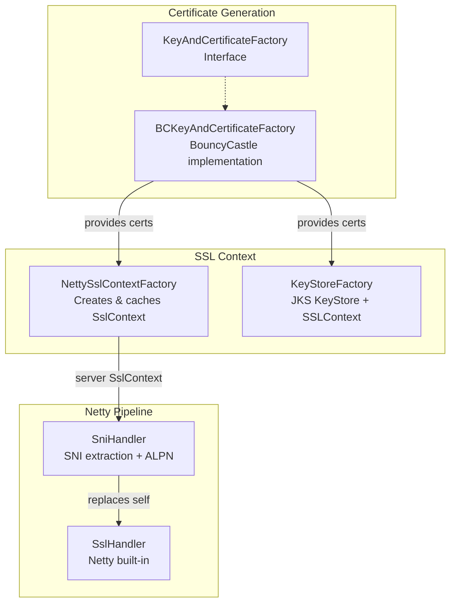
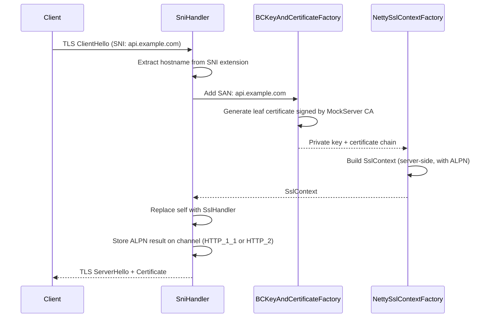
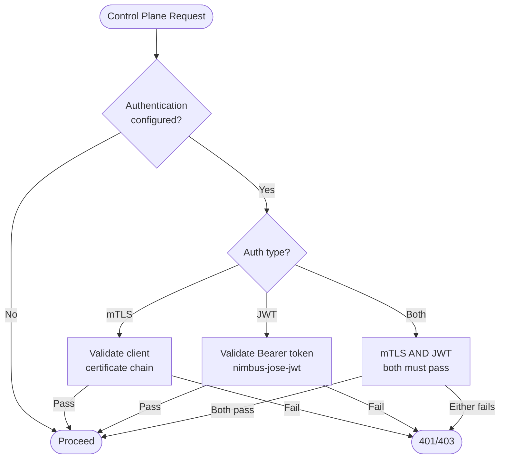
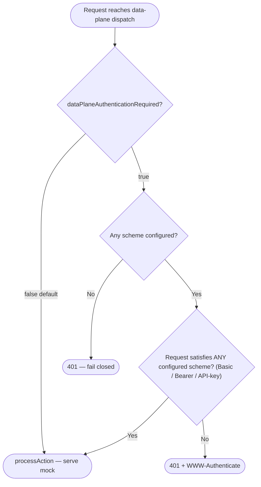

# TLS, Certificates & Security

## TLS Architecture

MockServer dynamically generates TLS certificates using BouncyCastle, enabling transparent HTTPS interception without pre-configured certificates.



### Dynamic Certificate Generation

When a TLS connection arrives:



### Certificate Authority

MockServer maintains an in-memory CA with default DN:
- **CN**: `www.mockserver.com`
- **O**: `MockServer`
- **L**: `London`
- **ST**: `England`
- **C**: `UK`

**Certificate validity period**: both the CA and dynamically-generated leaf certificates are valid for **10 years** from server startup (`KeyAndCertificateFactory.CERTIFICATE_VALIDITY_YEARS = 10`). The HTTP/3 self-signed fallback certificate uses the same constant. This long validity avoids certificate expiry during normal development and test usage.

Custom CA certificates can be loaded from PEM files via configuration.

### Key Classes

| Class | Package | Purpose |
|-------|---------|---------|
| `KeyAndCertificateFactory` | `o.m.socket.tls` | Interface for cert generation |
| `BCKeyAndCertificateFactory` | `o.m.socket.tls.bouncycastle` | BouncyCastle implementation: generates CA + leaf X.509 certs, supports dynamic SANs, reads custom PEM certs (including intermediate chains) |
| `KeyAndCertificateFactoryFactory` | `o.m.socket.tls` | Factory with pluggable supplier |
| `NettySslContextFactory` | `o.m.socket.tls` | Creates and caches Netty `SslContext` for server and client sides; supports mTLS, HTTP/2 ALPN; throws on failure instead of returning null |
| `CertificateConfigurationValidator` | `o.m.socket.tls` | Validates TLS certificate configuration at startup: key/cert pairing, CA chain verification, expiry, file existence |
| `KeyStoreFactory` | `o.m.socket.tls` | Creates JKS `KeyStore` and `SSLContext` for non-Netty use |
| `SniHandler` | `o.m.socket.tls` | Extends Netty's `AbstractSniHandler`; extracts SNI hostname, provisions certificate, negotiates ALPN |
| `PEMToFile` | `o.m.socket.tls` | PEM format utilities (read/write private keys and X.509 chains); properly closes InputStreams |

### BouncyCastle FIPS Support

MockServer supports both standard BouncyCastle (`bcprov-jdk18on`) and BouncyCastle FIPS (`bc-fips`) as the JCE provider for certificate generation. The provider is selected automatically at runtime:

1. `KeyAndCertificateFactoryFactory.isBouncyCastleAvailable()` checks if `org.bouncycastle.jce.provider.BouncyCastleProvider` is on the classpath
2. If available, `BCKeyAndCertificateFactory` is used; otherwise, MockServer falls back to JDK default crypto

`BCKeyAndCertificateFactory` uses lazy initialization:
- The provider name `"BC"` is hardcoded as a string constant (not referencing `BouncyCastleProvider.PROVIDER_NAME`) to avoid triggering class loading of the provider class at factory construction time
- `ensureProviderRegistered()` is called on first use (synchronized) and registers the provider via `Security.addProvider(new BouncyCastleProvider())`
- This design supports both `bcprov-jdk18on` (standard) and `bc-fips` (FIPS) since both register under the `"BC"` provider name

To use FIPS mode, replace the `bcprov-jdk18on` dependency with `bc-fips` in your classpath. No configuration changes are needed.

### Startup Certificate Validation

When custom TLS certificates are configured (`privateKeyPath` and `x509CertificatePath`), `CertificateConfigurationValidator` runs eagerly during `NettySslContextFactory.createServerSslContext()` and performs these checks:

| Check | Behaviour on Failure |
|-------|---------------------|
| Both `privateKeyPath` and `x509CertificatePath` must be set together | **Hard failure** with message naming both properties |
| Private key file must be valid PEM | **Hard failure** |
| Certificate file must be valid PEM | **Hard failure** |
| Certificate must not be expired or not-yet-valid | **Hard failure** with expiry/notBefore date |
| Private key must match certificate (sign-verify challenge) | **Hard failure** |
| Leaf certificate must be signed by configured CA | **Hard failure** |
| CA certificate file must be valid PEM (when non-default) | **Hard failure** |
| CA private key file must be valid PEM (when non-default) | **Hard failure** |
| Certificate should include `serverAuth` EKU | **WARN log** (not hard failure) |

Validation only runs when custom certs are provided. Default/auto-generated certificate deployments are unaffected.

### Intermediate CA Chain Support

When `x509CertificatePath` contains multiple PEM-encoded certificates, `BCKeyAndCertificateFactory` loads the full chain using `PEMToFile.x509ChainFromPEMFile()`. The first certificate is the leaf; subsequent certificates are intermediates. The full chain `[leaf, intermediate₁, ..., intermediateₙ, CA]` is sent during TLS handshake.

### SSL Context Caching

`NettySslContextFactory` caches `SslContext` objects to avoid regenerating them for every connection. It creates separate contexts for:
- **Server-side**: For accepting client connections (with the dynamically-generated certificate)
- **Client-side**: For forwarding to upstream servers (with configurable trust)

### Forward Proxy Trust

When forwarding requests, MockServer's `NettyHttpClient` needs to trust upstream servers. Three modes are supported via `ForwardProxyTLSX509CertificatesTrustManager`:

| Mode | Behaviour |
|------|-----------|
| `ANY` | Trust all certificates (insecure, useful for testing) |
| `JVM` | Use the JVM's default truststore |
| `CUSTOM` | Use a custom CA chain from configuration |

### Forward Target SSRF Validation

When `forwardProxyBlockPrivateNetworks` is `true` (default `false`), MockServer validates the target host before opening any outbound connection. `InetAddressValidator.validateForwardTarget` resolves the hostname and rejects addresses in these ranges:

| Blocked range | Reason |
|--------------|--------|
| `169.254.169.254` / `fd00:ec2::254` | Cloud instance metadata (AWS/GCP/Azure/Oracle) |
| Loopback (`127.0.0.0/8`, `::1`) | Localhost |
| Link-local (`169.254.0.0/16`, `fe80::/10`) | Link-local |
| RFC 1918 private / RFC 4193 unique-local (`fc00::/7`) | Private network |
| Wildcard / any-local | Bind-all addresses |

The validation runs in `HttpForwardActionHandler`, `HttpForwardValidateActionHandler`, `HttpForwardWithFallbackActionHandler`, `HttpForwardTemplateActionHandler`, and several `HttpState` call sites that accept an explicit forward target. After validation, the address is passed as an **unresolved** `InetSocketAddress` (`InetSocketAddress.createUnresolved`), so the actual DNS lookup happens on the Netty event loop rather than the calling thread — this guards against a TOCTOU window between validation and connection.

The feature is opt-in because MockServer is most commonly used to mock services running on localhost, Docker bridge networks, or Kubernetes service IPs, where blocking private addresses would prevent normal usage.

## Mutual TLS (mTLS)

MockServer supports mTLS for both incoming connections and the control plane.

A complete end-to-end mTLS example with self-generated certificates, Docker Compose configuration, and curl commands is available in [`examples/docker-compose/docker_compose_with_mtls/`](../../examples/docker-compose/docker_compose_with_mtls/). The consumer-facing documentation is on the [HTTPS & TLS page](https://www.mock-server.com/mock_server/HTTPS_TLS.html#mtls_examples).

### Incoming Connection mTLS

When `tlsMutualAuthenticationRequired` is configured, `PortUnificationHandler` checks for TLS on the channel. If the connection is not TLS, it returns **426 Upgrade Required** and disconnects.

Client certificates are extracted from the SSL session via `SniHandler.retrieveClientCertificates()` and stored as a channel attribute (`UPSTREAM_CLIENT_CERTIFICATES`).

### Control Plane mTLS

Control plane endpoints (`/mockserver/expectation`, `/mockserver/verify`, etc.) can require mTLS authentication. When configured, `HttpState.controlPlaneRequestAuthenticated()` validates the client certificate chain against the configured trust store.

## Control Plane Authentication



Authentication is configured in `MockServer.createServerBootstrap()` and validated in `HttpState.controlPlaneRequestAuthenticated()`:

| Configuration | Handler | Mechanism |
|---------------|---------|-----------|
| `controlPlaneTLSMutualAuthenticationCAChain` | mTLS handler | Validates client cert against CA chain |
| `controlPlaneJWTAuthenticationJWKSource` | JWT handler | Validates Bearer token using JWK source |
| `controlPlaneOidcAuthenticationRequired` | OIDC handler | Verifies an external-IdP Bearer token (issuer + audience + scopes) and surfaces a verified principal |
| Two or more configured | Chained handler | Every configured handler must succeed (logical AND) |

### Verified OIDC Control-Plane Authentication

`OidcAuthenticationHandler` (`o.m.authentication.oidc`) lets an external OIDC IdP govern the control plane. It is off by default — with no `controlPlaneOidc*` configuration the control plane behaves byte-for-byte as before. When `controlPlaneOidcAuthenticationRequired` is enabled it:

1. extracts the single `Authorization: Bearer <jwt>` access token (missing or non-Bearer → `AuthenticationException` → 401);
2. resolves the IdP JWK set — directly from `controlPlaneOidcJwksUri`, or by fetching `{controlPlaneOidcIssuer}/.well-known/openid-configuration` and reading its `jwks_uri`;
3. verifies the token signature and asserts issuer (`controlPlaneOidcIssuer`), audience (`controlPlaneOidcAudience`), `exp`/`nbf` (60s skew), and that the granted scopes contain every `controlPlaneOidcRequiredScopes` entry. Scopes are read from `controlPlaneOidcScopeClaim` (default `scope`, space-delimited; array claims such as `scp`/`roles`/`groups` are also supported);
4. returns an `AuthenticationResult` carrying the **verified** principal (`sub`), source `verified-oidc`, a redaction-safe claim subset (`sub`/`iss`/`aud`/`scope`/`groups`/`email` — never the raw token) and the normalised scope set.

The verified principal flows into the control-plane audit log (`AuditEntry.principalSource == "verified-oidc"`, `principal == sub`) instead of the unverified best-effort extraction. Wave 1 authenticates only; scope-based authorization/403 enforcement is a later wave.

**Secure-by-default hardening** (the OIDC handler only — the legacy `JWTAuthenticationHandler` is unchanged):

- **Asymmetric algorithms only.** The OIDC validator accepts only asymmetric JWS families (`RS*`, `PS*`, `ES*`, `EdDSA`). HMAC (`HS256/384/512`) and the unsecured `alg=none` are rejected — accepting HMAC against a public JWK set is the classic algorithm-confusion attack (forge an HMAC token using the public key bytes as the shared secret).
- **`exp` required.** A token without an `exp` claim is rejected (nimbus only checks expiry when the claim is present, so without this a no-`exp` token would be valid forever). Real OIDC tokens always carry `exp`.
- **`iss` or `aud` required.** At least one of `controlPlaneOidcIssuer` / `controlPlaneOidcAudience` must be configured. If both are blank the handler **fails construction** (logs an error, leaves the validator null so every request 401s fail-closed) — with neither set, any validly-signed token from the configured JWKS would be accepted regardless of who it was minted for.
- **HTTPS JWKS required.** A remote `controlPlaneOidcJwksUri` / `controlPlaneOidcIssuer` (used for discovery) must use `https://`. Plaintext `http://` is permitted **only** to `localhost`/loopback (local testing); file/classpath JWKS paths are unaffected. An `http://` URL to any other host fails construction (fail-closed), preventing MITM on plaintext key retrieval.
- **Generic 401 body.** On an OIDC authentication failure the client receives a generic `Unauthorized for control plane` body; the detailed reason (expected issuer/audience/scopes, signature failure) is logged **server-side only**. The legacy JWT/mTLS path still echoes its detailed reason to the client (unchanged). This is driven by `AuthenticationException.isClientSafeMessage()` — `false` for OIDC-originated exceptions, `true` (the default) for all others.

### Control-Plane Authorization (claims→scopes)

Authentication answers *who* a caller is; **authorization** answers *what they may do*. On top of verified OIDC authentication, MockServer adds a coarse, hierarchical role model — "RBAC by standards conformance" — that maps a verified principal's scopes/groups to one of three roles and enforces a read/mutate split on the control plane.

Off by default: with `controlPlaneAuthorizationEnabled=false` (the default) no authorization check runs and the control plane behaves byte-for-byte as before (verified authentication only). Authentication is unaffected by this switch.

**Role model.** Roles are strictly hierarchical — `ADMIN ⊇ MUTATE ⊇ READ`:

| Role | Grants |
|------|--------|
| `read` | Read-only control-plane operations (every `GET`, plus the read `PUT`s: `retrieve`, `verify`, `verifySequence`, `verifySLO`, `diff`, `explainUnmatched`, `debugMismatch`, `files/retrieve`, `files/list`) |
| `mutate` | Everything `read` grants **plus** all mutations (creating expectations, clearing, resetting, binding ports, etc.) |
| `admin` | Everything `mutate` grants (ceiling for future admin-only operations; currently a strict superset of `mutate`) |

**Mapping.** `controlPlaneScopeMapping` maps a verified scope/group **value** to a role. Serialized form is a comma-separated list of `value=role` pairs, e.g. `platform-admins=admin,qa-team=mutate,viewers=read`. The scope values come from the same verified scope set as authentication (`controlPlaneOidcScopeClaim` — `scope`/`scp`/`roles`/`groups`). Unrecognised roles and malformed pairs are skipped at parse time so a typo can never silently widen access.

**Enforcement** (in `HttpState.controlPlaneRequestAuthenticated`, after authentication succeeds and before the operation runs):

1. the operation's **required role** is derived from the existing read/mutate split (`isControlPlaneRead` → `READ`; otherwise `MUTATE`);
2. the principal's verified scopes are mapped through `controlPlaneScopeMapping` into its **granted roles**;
3. if no granted role `satisfies` the required role, the request is denied with a generic **`403 Forbidden`** (`Forbidden for control plane`) and an audit entry is recorded with **`outcome=FORBIDDEN`**. The denial detail (granted vs required role) is logged at INFO **server-side only**, so authorization policy is not disclosed to the client.
4. otherwise the operation proceeds and is audited with `outcome=AUTHORIZED` (as before).

**Fail-closed, requires a verified principal.** Authorization maps the *verified* scope set, so it requires control-plane OIDC authentication to be enabled. A principal with no scopes, or whose scopes map to no role, is granted nothing and is **denied every mutation** (and every read unless it has a `READ`-or-higher role). A `read`-only principal passes reads but is `403`'d on mutations; an `admin` principal passes everything. FORBIDDEN denials are always recorded when auditing is enabled, even for reads (unlike AUTHORIZED reads, which honour `controlPlaneAuditReads`).

Classes: `ControlPlaneRole` (enum, `o.m.authentication.authorization`) with `satisfies(required)`; `ControlPlaneAuthorizer` (same package) maps scopes→roles and decides allow/deny.

**Coverage — exactly what authorization protects.** The authorization decision runs in `HttpState.controlPlaneRequestAuthenticated`. Every operation dispatched through `HttpState.handle` is covered: all expectation CRUD (`PUT/POST /expectation`), `clear`, `reset`, retrieve/verify, mode/bind-config, drift/chaos/SLO, replay, contract-test, and so on. A handful of routes are serviced directly in the Netty layer (`HttpRequestHandler`) outside `HttpState.handle`; their coverage is:

| Route | Authn | Authz | Notes |
|-------|-------|-------|-------|
| `PUT /mockserver/configuration` (mutates live config) | yes | **yes** | Routed through the shared `HttpState.controlPlaneRequestAuthenticated` gate, so it takes the same read/mutate authorization as `handle`-dispatched mutations (classified `MUTATE`). A read-only principal is `403`'d; mutate/admin proceed. |
| `GET /mockserver/configuration` | yes | yes | Same gate, classified `READ`. |
| `GET /mockserver/openapi.yaml`, `GET /mockserver/llm/optimisationReport` | yes | yes | Reads; routed through the shared gate. |
| `GET /mockserver/status`, `GET /mockserver/ready` | **no** | **no** | Deliberately open: these are liveness/readiness probes and must be reachable by health-check infrastructure without credentials. |
| `PUT /mockserver/bind` | yes | **yes (MUTATE)** | Auth-gated in `HttpRequestHandler` via the same `controlPlaneRequestAuthenticated` call as every other mutation. An unauthenticated caller receives 401/403 before any port is rebound. Default (no auth configured) is a no-op: the gate returns true and binding proceeds. |
| `PUT /mockserver/stop` | yes | **yes (MUTATE)** | Auth-gated identically to `/bind` — an unauthenticated caller cannot stop the server. Default (no auth configured) is a no-op: the gate returns true and `/stop` proceeds. |
| MCP control plane (`POST /mockserver/mcp` over HTTP/1.1, HTTP/2, HTTP/3, and JSON-RPC batch) | yes | **yes — per-tool read/mutate** | MCP requests are **authenticated** (same mTLS/JWT/OIDC as every control-plane route). When `controlPlaneAuthorizationEnabled` is true, per-tool **read/mutate authorization** is enforced: `McpToolRegistry` classifies each tool as read or mutate (fail-closed — an unclassified tool defaults to MUTATE), and `McpRequestProcessor` calls `HttpState.controlPlaneToolAuthorized` before executing the tool. A read-only principal is `403`'d on mutating tools (`create_expectation`, `clear_expectations`, `reset`, etc.). When `controlPlaneAuthorizationEnabled` is false (the default), no authorization check runs. |

HTTP/3 non-MCP control-plane requests re-dispatch into `HttpState.handle`, so they inherit full authorization automatically.

### Enriched Authentication SPI (`AuthenticationResult`)

The `AuthenticationHandler` SPI gained a richer, default-adapted method alongside the legacy boolean:

```java
default AuthenticationResult authenticate(HttpRequest request) {
    return controlPlaneRequestAuthenticated(request)
        ? AuthenticationResult.authenticated(null, "none", Map.of(), Set.of())
        : AuthenticationResult.unauthenticated();
}
```

`AuthenticationResult` is immutable and carries `authenticated`, `principal` (null = anonymous), `principalSource`, a read-only `claims` map and a read-only `scopes` set. Existing and third-party handlers that implement only the boolean method keep working unchanged — the default adapter treats their `true` as authenticated-but-anonymous. `ChainedAuthenticationHandler.authenticate()` ANDs every delegate, returns unauthenticated if any fails, and otherwise selects the first delegate with a non-null principal (so an OIDC/JWT principal wins over an mTLS-only null) while unioning all delegates' scopes.

### MCP Endpoint Authentication

The MCP endpoint (`/mockserver/mcp`) enforces the same control-plane **authentication** as all other control-plane routes. When `controlPlaneTLSMutualAuthenticationCAChain` and/or `controlPlaneJWTAuthenticationJWKSource` are configured, MCP requests must satisfy the same mTLS and/or JWT requirements. Unauthenticated MCP requests receive a `401 Unauthorized` response with a JSON-RPC error body. This ensures that enabling MCP does not widen the attack surface of a secured MockServer instance.

**Per-tool authorization.** When `controlPlaneAuthorizationEnabled=true`, per-tool read/mutate authorization is enforced at the MCP layer (see the coverage table above): `McpToolRegistry` classifies each tool as read or mutate (fail-closed), and `McpRequestProcessor` enforces the role check via `HttpState.controlPlaneToolAuthorized` before executing any tool call.

### Authentication Classes

| Class | Package | Purpose |
|-------|---------|---------|
| `AuthenticationHandler` | `o.m.authentication` | Core interface: legacy `controlPlaneRequestAuthenticated(HttpRequest): boolean` plus default-adapted `authenticate(HttpRequest): AuthenticationResult` |
| `AuthenticationResult` | `o.m.authentication` | Immutable enriched outcome: authenticated flag, verified principal, principalSource, read-only claims/scopes |
| `ChainedAuthenticationHandler` | `o.m.authentication` | Chains multiple `AuthenticationHandler` instances (logical AND — all must pass); combines results selecting the first verified principal and unioning scopes |
| `AuthenticationException` | `o.m.authentication` | Thrown on authentication failure |
| `MTLSAuthenticationHandler` | `o.m.authentication.mtls` | Validates client certificate chain against configured CA certificates via `X509Certificate.verify()` |
| `JWTAuthenticationHandler` | `o.m.authentication.jwt` | Loads JWK keys from URL (`RemoteJWKSet`) or file (`ImmutableJWKSet`), extracts Bearer token from `Authorization` header, delegates to `JWTValidator` |
| `OidcAuthenticationHandler` | `o.m.authentication.oidc` | Verifies an external-IdP OIDC Bearer token (signature + issuer + audience + exp/nbf + required scopes) and returns a verified-principal `AuthenticationResult`; resolves the JWK set directly or via OIDC discovery |
| `ControlPlaneRole` | `o.m.authentication.authorization` | Coarse hierarchical role enum (`READ` < `MUTATE` < `ADMIN`) with `satisfies(required)` |
| `ControlPlaneAuthorizer` | `o.m.authentication.authorization` | Maps a principal's verified scopes through `controlPlaneScopeMapping` into granted roles and decides allow/deny against the operation's required role |
| `JWTValidator` | `o.m.authentication.jwt` | Validates JWT tokens using nimbus-jose-jwt; supports `withExpectedAudience()`, `withMatchingClaims()`, `withRequiredClaims()` |
| `JWTGenerator` | `o.m.authentication.jwt` | Generates JWT tokens with configurable claims (used in tests) |
| `JWKGenerator` | `o.m.authentication.jwt` | Generates JWK sets from `AsymmetricKeyPair` objects (RSA and EC key types) |

### Supported JWS Algorithms

`JWTValidator` supports 11 JWS algorithms — **asymmetric families only**. HMAC (`HS256/384/512`)
is rejected: the validator verifies against a public-key JWK set loaded from a URL or file, and
accepting HMAC there is the classic algorithm-confusion forgery vector (an attacker signs an HMAC
token using the public key bytes as the shared secret). This matches `OidcJWTValidator`.

| Family | Algorithms |
|--------|-----------|
| RSA PKCS#1 | `RS256`, `RS384`, `RS512` |
| ECDSA | `ES256`, `ES256K`, `ES384`, `ES512` |
| RSA-PSS | `PS256`, `PS384`, `PS512` |
| EdDSA | `EdDSA` |

### JWT Authentication

Uses `nimbus-jose-jwt` library. The JWT handler:
1. Extracts the `Authorization: Bearer <token>` header
2. Validates the token against the configured JWK source
3. Checks required claims (issuer, audience, etc.)

## Proxy Authentication

For HTTP CONNECT proxy requests, MockServer supports Basic authentication:

1. `HttpRequestHandler` checks the `Proxy-Authorization` header
2. Validates against configured username/password
3. On failure: returns **407 Proxy Authentication Required** with `Proxy-Authenticate: Basic` header

SOCKS5 proxy also supports username/password authentication (configured separately).

## Data Plane Authentication

All of the authentication above protects the **control plane** (`/mockserver/*`) or the `CONNECT`
proxy. The **data plane** — the mocked endpoints themselves — is open by default. An opt-in,
default-off gate (`dataPlaneAuthenticationRequired`) can require credentials on every mocked request.



The gate sits at the top of the data-plane `else` branch in `HttpRequestHandler.channelRead0`, just
before the existing mTLS-upgrade check and `httpActionHandler.processAction(...)`. Because control-plane
routes, health/status/ready probes and `CONNECT` are all matched in **earlier** branches, reaching this
branch already means the request is a genuine data-plane request — so control-plane administration,
liveness/readiness probes and the proxy `CONNECT` handshake are never gated by data-plane auth.

| Aspect | Behaviour |
|--------|-----------|
| Default | `dataPlaneAuthenticationRequired=false` — no gate, byte-identical to a server without the feature |
| Schemes | HTTP Basic, Bearer token, API-key header — any combination |
| Multi-scheme | **Accept-any** (logical OR): a request is accepted if it satisfies any one configured scheme. Adding a scheme can only widen the accepted set |
| Required-but-unconfigured | **Fail-closed**: every data-plane request is rejected (401) rather than allowed |
| Failure response | `401 Unauthorized`, body `Unauthorized for data plane`; `WWW-Authenticate: Basic realm="…"` when Basic is configured, else `Bearer` when Bearer is configured, else no challenge (API-key-only) |
| Secret comparison | Constant-time (`MessageDigest.isEqual` on UTF-8 bytes) for password / token / API-key value; credential values never logged |

The policy/decision lives in core (`DataPlaneAuthenticator`, `o.m.authentication.dataplane`) so it is unit
testable; the Netty handlers only invoke it and write the 401. The invocation + 401-writing is itself
factored into a single shared netty helper (`DataPlaneAuthenticationGate.isAuthenticated(...)`) so that
**every** data-plane dispatch path enforces it identically — there is no transport on which the gate can be
skipped. `configuration.dataPlaneAuthenticationRequired()` is a single boolean read, so the default-off
path adds nothing measurable to the hot path.

**Scope.** The gate covers every HTTP data-plane dispatch path:

- **HTTP/1.1, HTTP/2 and gRPC-over-h2** — `HttpRequestHandler`, just before `httpActionHandler.processAction(...)`.
- **HTTP/3 (QUIC), including gRPC-over-HTTP/3** — `Http3MockServerHandler`, at both the normal and the
  gRPC data-plane dispatch sites, before `processAction(...)`. HTTP/3 carries the same HTTP
  `Authorization` / api-key headers, so it is the same request type and the same gate applies. (This path
  previously bypassed the gate — a fail-open — and is now closed.)
- Requests tunnelled through a `CONNECT` proxy are decrypted and re-dispatched back through
  `HttpRequestHandler`, so they are gated too once enabled.

On all of the above, control-plane (`/mockserver/*`), liveness/status/ready probes and `CONNECT` are routed
through `httpState.handle(...)` (or earlier branches) **before** the gate, so they remain reachable without
data-plane credentials — an operator can still administer a locked-down server.

**Out of scope.** Raw-binary proxy traffic handled by `BinaryRequestProxyingHandler` is a non-HTTP byte
stream (no HTTP request structure), so HTTP credentials are not meaningful there and the gate does not
apply. mTLS for incoming connections (`tlsMutualAuthenticationRequired`) is an orthogonal transport-layer
check handled earlier in `PortUnificationHandler` and is unaffected.

### Data-Plane Authentication Properties

| Property | Default | Purpose |
|----------|---------|---------|
| `dataPlaneAuthenticationRequired` | false | Master switch — require auth on mocked endpoints |
| `dataPlaneBasicAuthenticationUsername` | (none) | HTTP Basic username (Basic active only when both username and password are set) |
| `dataPlaneBasicAuthenticationPassword` | (none) | HTTP Basic password |
| `dataPlaneBasicAuthenticationRealm` | MockServer | Realm advertised in the `WWW-Authenticate: Basic` challenge |
| `dataPlaneBearerAuthenticationToken` | (none) | Expected `Authorization: Bearer <token>` value |
| `dataPlaneApiKeyAuthenticationHeader` | (none) | Header name carrying the API key (e.g. `X-API-Key`) |
| `dataPlaneApiKeyAuthenticationValue` | (none) | Expected API-key value (API-key active only when both header and value are set) |

## TLS Configuration Properties

| Property | Default | Purpose |
|----------|---------|---------|
| `tlsMutualAuthenticationRequired` | false | Require client certificates |
| `tlsMutualAuthenticationCertificateChain` | (none) | PEM file with trusted CA chain for client certs |
| `dynamicallyCreateCertificateAuthorityCertificate` | false | Auto-generate CA cert |
| `certificateAuthorityPrivateKey` | (auto) | PEM file for custom CA private key |
| `certificateAuthorityCertificate` | (auto) | PEM file for custom CA certificate |
| `forwardProxyTLSX509CertificatesTrustManagerType` | ANY | Trust mode for upstream connections |
| `forwardProxyTLSCustomTrustX509Certificates` | (none) | PEM file for custom upstream trust |
| `controlPlaneTLSMutualAuthenticationRequired` | false | Require mTLS for control plane |
| `controlPlaneTLSMutualAuthenticationCAChain` | (none) | CA chain for control plane mTLS |
| `controlPlaneJWTAuthenticationJWKSource` | (none) | JWK source URL for JWT validation |
| `controlPlaneJWTAuthenticationRequired` | false | Require JWT for control plane |
| `controlPlaneOidcAuthenticationRequired` | false | Require verified external-IdP OIDC token for control plane |
| `controlPlaneOidcIssuer` | (none) | Required `iss`; also used for OIDC discovery of the JWKS URI |
| `controlPlaneOidcJwksUri` | (none) | JWK set URI (skips discovery when set) |
| `controlPlaneOidcAudience` | (none) | Required `aud` on control-plane tokens |
| `controlPlaneOidcRequiredScopes` | (empty) | Scopes that must all be present |
| `controlPlaneOidcScopeClaim` | scope | Claim holding granted scopes (`scope`/`scp`/`roles`/`groups`) |
| `controlPlaneAuthorizationEnabled` | false | Enforce coarse role-based authorization of control-plane requests (requires a verified principal) |
| `controlPlaneScopeMapping` | (empty) | Map verified scope/group values to roles, e.g. `platform-admins=admin,qa-team=mutate,viewers=read` |
