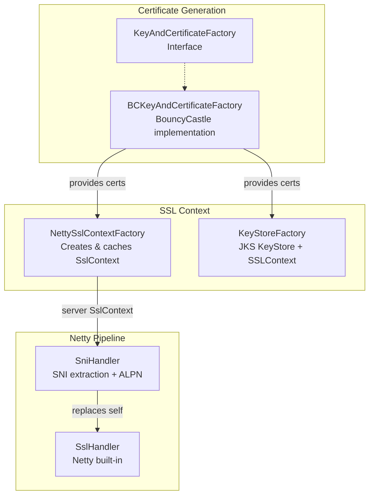
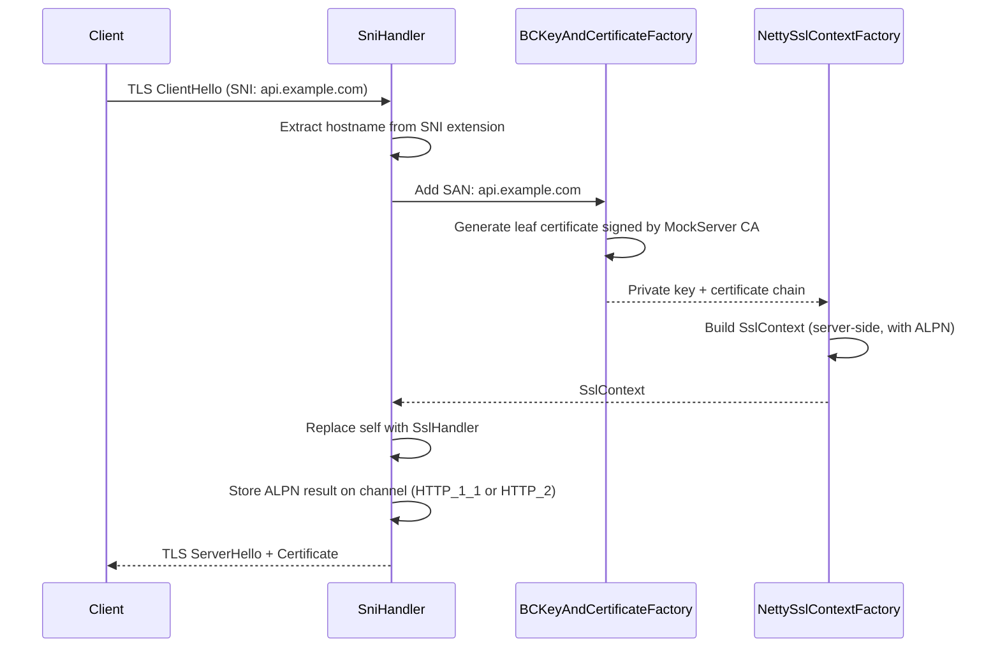

# TLS, Certificates & Security

## TLS Architecture

MockServer dynamically generates TLS certificates using BouncyCastle, enabling transparent HTTPS interception without pre-configured certificates.



### Dynamic Certificate Generation

When a TLS connection arrives:



### Certificate Authority

MockServer maintains an in-memory CA with default DN:
- **CN**: `www.mockserver.com`
- **O**: `MockServer`
- **L**: `London`
- **ST**: `England`
- **C**: `UK`

Custom CA certificates can be loaded from PEM files via configuration.

### Key Classes

| Class | Package | Purpose |
|-------|---------|---------|
| `KeyAndCertificateFactory` | `o.m.socket.tls` | Interface for cert generation |
| `BCKeyAndCertificateFactory` | `o.m.socket.tls.bouncycastle` | BouncyCastle implementation: generates CA + leaf X.509 certs, supports dynamic SANs, reads custom PEM certs (including intermediate chains) |
| `KeyAndCertificateFactoryFactory` | `o.m.socket.tls` | Factory with pluggable supplier |
| `NettySslContextFactory` | `o.m.socket.tls` | Creates and caches Netty `SslContext` for server and client sides; supports mTLS, HTTP/2 ALPN; throws on failure instead of returning null |
| `CertificateConfigurationValidator` | `o.m.socket.tls` | Validates TLS certificate configuration at startup: key/cert pairing, CA chain verification, expiry, file existence |
| `KeyStoreFactory` | `o.m.socket.tls` | Creates JKS `KeyStore` and `SSLContext` for non-Netty use |
| `SniHandler` | `o.m.socket.tls` | Extends Netty's `AbstractSniHandler`; extracts SNI hostname, provisions certificate, negotiates ALPN |
| `PEMToFile` | `o.m.socket.tls` | PEM format utilities (read/write private keys and X.509 chains); properly closes InputStreams |

### BouncyCastle FIPS Support

MockServer supports both standard BouncyCastle (`bcprov-jdk18on`) and BouncyCastle FIPS (`bc-fips`) as the JCE provider for certificate generation. The provider is selected automatically at runtime:

1. `KeyAndCertificateFactoryFactory.isBouncyCastleAvailable()` checks if `org.bouncycastle.jce.provider.BouncyCastleProvider` is on the classpath
2. If available, `BCKeyAndCertificateFactory` is used; otherwise, MockServer falls back to JDK default crypto

`BCKeyAndCertificateFactory` uses lazy initialization:
- The provider name `"BC"` is hardcoded as a string constant (not referencing `BouncyCastleProvider.PROVIDER_NAME`) to avoid triggering class loading of the provider class at factory construction time
- `ensureProviderRegistered()` is called on first use (synchronized) and registers the provider via `Security.addProvider(new BouncyCastleProvider())`
- This design supports both `bcprov-jdk18on` (standard) and `bc-fips` (FIPS) since both register under the `"BC"` provider name

To use FIPS mode, replace the `bcprov-jdk18on` dependency with `bc-fips` in your classpath. No configuration changes are needed.

### Startup Certificate Validation

When custom TLS certificates are configured (`privateKeyPath` and `x509CertificatePath`), `CertificateConfigurationValidator` runs eagerly during `NettySslContextFactory.createServerSslContext()` and performs these checks:

| Check | Behaviour on Failure |
|-------|---------------------|
| Both `privateKeyPath` and `x509CertificatePath` must be set together | **Hard failure** with message naming both properties |
| Private key file must be valid PEM | **Hard failure** |
| Certificate file must be valid PEM | **Hard failure** |
| Certificate must not be expired or not-yet-valid | **Hard failure** with expiry/notBefore date |
| Private key must match certificate (sign-verify challenge) | **Hard failure** |
| Leaf certificate must be signed by configured CA | **Hard failure** |
| CA certificate file must be valid PEM (when non-default) | **Hard failure** |
| CA private key file must be valid PEM (when non-default) | **Hard failure** |
| Certificate should include `serverAuth` EKU | **WARN log** (not hard failure) |

Validation only runs when custom certs are provided. Default/auto-generated certificate deployments are unaffected.

### Intermediate CA Chain Support

When `x509CertificatePath` contains multiple PEM-encoded certificates, `BCKeyAndCertificateFactory` loads the full chain using `PEMToFile.x509ChainFromPEMFile()`. The first certificate is the leaf; subsequent certificates are intermediates. The full chain `[leaf, intermediate₁, ..., intermediateₙ, CA]` is sent during TLS handshake.

### SSL Context Caching

`NettySslContextFactory` caches `SslContext` objects to avoid regenerating them for every connection. It creates separate contexts for:
- **Server-side**: For accepting client connections (with the dynamically-generated certificate)
- **Client-side**: For forwarding to upstream servers (with configurable trust)

### Forward Proxy Trust

When forwarding requests, MockServer's `NettyHttpClient` needs to trust upstream servers. Three modes are supported via `ForwardProxyTLSX509CertificatesTrustManager`:

| Mode | Behaviour |
|------|-----------|
| `ANY` | Trust all certificates (insecure, useful for testing) |
| `JVM` | Use the JVM's default truststore |
| `CUSTOM` | Use a custom CA chain from configuration |

## Mutual TLS (mTLS)

MockServer supports mTLS for both incoming connections and the control plane.

A complete end-to-end mTLS example with self-generated certificates, Docker Compose configuration, and curl commands is available in [`examples/docker-compose/docker_compose_with_mtls/`](../../examples/docker-compose/docker_compose_with_mtls/). The consumer-facing documentation is on the [HTTPS & TLS page](https://www.mock-server.com/mock_server/HTTPS_TLS.html#mtls_examples).

### Incoming Connection mTLS

When `tlsMutualAuthenticationRequired` is configured, `PortUnificationHandler` checks for TLS on the channel. If the connection is not TLS, it returns **426 Upgrade Required** and disconnects.

Client certificates are extracted from the SSL session via `SniHandler.retrieveClientCertificates()` and stored as a channel attribute (`UPSTREAM_CLIENT_CERTIFICATES`).

### Control Plane mTLS

Control plane endpoints (`/mockserver/expectation`, `/mockserver/verify`, etc.) can require mTLS authentication. When configured, `HttpState.controlPlaneRequestAuthenticated()` validates the client certificate chain against the configured trust store.

## Control Plane Authentication


Authentication is configured in `MockServer.createServerBootstrap()` and validated in `HttpState.controlPlaneRequestAuthenticated()`:

| Configuration | Handler | Mechanism |
|---------------|---------|-----------|
| `controlPlaneTLSMutualAuthenticationCAChain` | mTLS handler | Validates client cert against CA chain |
| `controlPlaneJWTAuthenticationJWKSource` | JWT handler | Validates Bearer token using JWK source |
| `controlPlaneOidcAuthenticationRequired` | OIDC handler | Verifies an external-IdP Bearer token (issuer + audience + scopes) and surfaces a verified principal |
| Two or more configured | Chained handler | Every configured handler must succeed (logical AND) |

### Verified OIDC Control-Plane Authentication

`OidcAuthenticationHandler` (`o.m.authentication.oidc`) lets an external OIDC IdP govern the control plane. It is off by default — with no `controlPlaneOidc*` configuration the control plane behaves byte-for-byte as before. When `controlPlaneOidcAuthenticationRequired` is enabled it:

1. extracts the single `Authorization: Bearer <jwt>` access token (missing or non-Bearer → `AuthenticationException` → 401);
2. resolves the IdP JWK set — directly from `controlPlaneOidcJwksUri`, or by fetching `{controlPlaneOidcIssuer}/.well-known/openid-configuration` and reading its `jwks_uri`;
3. verifies the token signature and asserts issuer (`controlPlaneOidcIssuer`), audience (`controlPlaneOidcAudience`), `exp`/`nbf` (60s skew), and that the granted scopes contain every `controlPlaneOidcRequiredScopes` entry. Scopes are read from `controlPlaneOidcScopeClaim` (default `scope`, space-delimited; array claims such as `scp`/`roles`/`groups` are also supported);
4. returns an `AuthenticationResult` carrying the **verified** principal (`sub`), source `verified-oidc`, a redaction-safe claim subset (`sub`/`iss`/`aud`/`scope`/`groups`/`email` — never the raw token) and the normalised scope set.

The verified principal flows into the control-plane audit log (`AuditEntry.principalSource == "verified-oidc"`, `principal == sub`) instead of the unverified best-effort extraction. Wave 1 authenticates only; scope-based authorization/403 enforcement is a later wave.

**Secure-by-default hardening** (the OIDC handler only — the legacy `JWTAuthenticationHandler` is unchanged):

- **Asymmetric algorithms only.** The OIDC validator accepts only asymmetric JWS families (`RS*`, `PS*`, `ES*`, `EdDSA`). HMAC (`HS256/384/512`) and the unsecured `alg=none` are rejected — accepting HMAC against a public JWK set is the classic algorithm-confusion attack (forge an HMAC token using the public key bytes as the shared secret).
- **`exp` required.** A token without an `exp` claim is rejected (nimbus only checks expiry when the claim is present, so without this a no-`exp` token would be valid forever). Real OIDC tokens always carry `exp`.
- **`iss` or `aud` required.** At least one of `controlPlaneOidcIssuer` / `controlPlaneOidcAudience` must be configured. If both are blank the handler **fails construction** (logs an error, leaves the validator null so every request 401s fail-closed) — with neither set, any validly-signed token from the configured JWKS would be accepted regardless of who it was minted for.
- **HTTPS JWKS required.** A remote `controlPlaneOidcJwksUri` / `controlPlaneOidcIssuer` (used for discovery) must use `https://`. Plaintext `http://` is permitted **only** to `localhost`/loopback (local testing); file/classpath JWKS paths are unaffected. An `http://` URL to any other host fails construction (fail-closed), preventing MITM on plaintext key retrieval.
- **Generic 401 body.** On an OIDC authentication failure the client receives a generic `Unauthorized for control plane` body; the detailed reason (expected issuer/audience/scopes, signature failure) is logged **server-side only**. The legacy JWT/mTLS path still echoes its detailed reason to the client (unchanged). This is driven by `AuthenticationException.isClientSafeMessage()` — `false` for OIDC-originated exceptions, `true` (the default) for all others.

### Enriched Authentication SPI (`AuthenticationResult`)

The `AuthenticationHandler` SPI gained a richer, default-adapted method alongside the legacy boolean:

```java
default AuthenticationResult authenticate(HttpRequest request) {
    return controlPlaneRequestAuthenticated(request)
        ? AuthenticationResult.authenticated(null, "none", Map.of(), Set.of())
        : AuthenticationResult.unauthenticated();
}
```

`AuthenticationResult` is immutable and carries `authenticated`, `principal` (null = anonymous), `principalSource`, a read-only `claims` map and a read-only `scopes` set. Existing and third-party handlers that implement only the boolean method keep working unchanged — the default adapter treats their `true` as authenticated-but-anonymous. `ChainedAuthenticationHandler.authenticate()` ANDs every delegate, returns unauthenticated if any fails, and otherwise selects the first delegate with a non-null principal (so an OIDC/JWT principal wins over an mTLS-only null) while unioning all delegates' scopes.

### MCP Endpoint Authentication

The MCP endpoint (`/mockserver/mcp`) enforces the same control-plane authentication as all other control-plane routes. When `controlPlaneTLSMutualAuthenticationCAChain` and/or `controlPlaneJWTAuthenticationJWKSource` are configured, MCP requests must satisfy the same mTLS and/or JWT requirements. Unauthenticated MCP requests receive a `401 Unauthorized` response with a JSON-RPC error body. This ensures that enabling MCP does not widen the attack surface of a secured MockServer instance.

### Authentication Classes

| Class | Package | Purpose |
|-------|---------|---------|
| `AuthenticationHandler` | `o.m.authentication` | Core interface: legacy `controlPlaneRequestAuthenticated(HttpRequest): boolean` plus default-adapted `authenticate(HttpRequest): AuthenticationResult` |
| `AuthenticationResult` | `o.m.authentication` | Immutable enriched outcome: authenticated flag, verified principal, principalSource, read-only claims/scopes |
| `ChainedAuthenticationHandler` | `o.m.authentication` | Chains multiple `AuthenticationHandler` instances (logical AND — all must pass); combines results selecting the first verified principal and unioning scopes |
| `AuthenticationException` | `o.m.authentication` | Thrown on authentication failure |
| `MTLSAuthenticationHandler` | `o.m.authentication.mtls` | Validates client certificate chain against configured CA certificates via `X509Certificate.verify()` |
| `JWTAuthenticationHandler` | `o.m.authentication.jwt` | Loads JWK keys from URL (`RemoteJWKSet`) or file (`ImmutableJWKSet`), extracts Bearer token from `Authorization` header, delegates to `JWTValidator` |
| `OidcAuthenticationHandler` | `o.m.authentication.oidc` | Verifies an external-IdP OIDC Bearer token (signature + issuer + audience + exp/nbf + required scopes) and returns a verified-principal `AuthenticationResult`; resolves the JWK set directly or via OIDC discovery |
| `JWTValidator` | `o.m.authentication.jwt` | Validates JWT tokens using nimbus-jose-jwt; supports `withExpectedAudience()`, `withMatchingClaims()`, `withRequiredClaims()` |
| `JWTGenerator` | `o.m.authentication.jwt` | Generates JWT tokens with configurable claims (used in tests) |
| `JWKGenerator` | `o.m.authentication.jwt` | Generates JWK sets from `AsymmetricKeyPair` objects (RSA and EC key types) |

### Supported JWS Algorithms

`JWTValidator` supports 14 JWS algorithms:

| Family | Algorithms |
|--------|-----------|
| HMAC | `HS256`, `HS384`, `HS512` |
| RSA PKCS#1 | `RS256`, `RS384`, `RS512` |
| ECDSA | `ES256`, `ES256K`, `ES384`, `ES512` |
| RSA-PSS | `PS256`, `PS384`, `PS512` |
| EdDSA | `EdDSA` |

### JWT Authentication

Uses `nimbus-jose-jwt` library. The JWT handler:
1. Extracts the `Authorization: Bearer <token>` header
2. Validates the token against the configured JWK source
3. Checks required claims (issuer, audience, etc.)

## Proxy Authentication

For HTTP CONNECT proxy requests, MockServer supports Basic authentication:

1. `HttpRequestHandler` checks the `Proxy-Authorization` header
2. Validates against configured username/password
3. On failure: returns **407 Proxy Authentication Required** with `Proxy-Authenticate: Basic` header

SOCKS5 proxy also supports username/password authentication (configured separately).

## TLS Configuration Properties

| Property | Default | Purpose |
|----------|---------|---------|
| `tlsMutualAuthenticationRequired` | false | Require client certificates |
| `tlsMutualAuthenticationCertificateChain` | (none) | PEM file with trusted CA chain for client certs |
| `dynamicallyCreateCertificateAuthorityCertificate` | false | Auto-generate CA cert |
| `certificateAuthorityPrivateKey` | (auto) | PEM file for custom CA private key |
| `certificateAuthorityCertificate` | (auto) | PEM file for custom CA certificate |
| `forwardProxyTLSX509CertificatesTrustManagerType` | ANY | Trust mode for upstream connections |
| `forwardProxyTLSCustomTrustX509Certificates` | (none) | PEM file for custom upstream trust |
| `controlPlaneTLSMutualAuthenticationRequired` | false | Require mTLS for control plane |
| `controlPlaneTLSMutualAuthenticationCAChain` | (none) | CA chain for control plane mTLS |
| `controlPlaneJWTAuthenticationJWKSource` | (none) | JWK source URL for JWT validation |
| `controlPlaneJWTAuthenticationRequired` | false | Require JWT for control plane |
| `controlPlaneOidcAuthenticationRequired` | false | Require verified external-IdP OIDC token for control plane |
| `controlPlaneOidcIssuer` | (none) | Required `iss`; also used for OIDC discovery of the JWKS URI |
| `controlPlaneOidcJwksUri` | (none) | JWK set URI (skips discovery when set) |
| `controlPlaneOidcAudience` | (none) | Required `aud` on control-plane tokens |
| `controlPlaneOidcRequiredScopes` | (empty) | Scopes that must all be present |
| `controlPlaneOidcScopeClaim` | scope | Claim holding granted scopes (`scope`/`scp`/`roles`/`groups`) |
