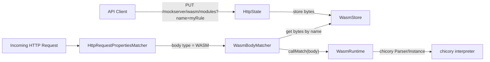

# WASM Custom Rule Engine

## Overview

MockServer supports WebAssembly (WASM) modules as custom body matchers. Users upload compiled WASM binaries via the control-plane REST API, then reference them by name in expectation body matchers. The WASM module receives the HTTP request body and returns a match/no-match decision.

This feature uses the **chicory** pure-Java WASM interpreter (no JNI or native code required), keeping MockServer's "runs anywhere Java runs" promise.

## Architecture



## Module ABI

Two export shapes are supported, both returning non-zero for a match. The runtime
**prefers the richer `match_request` export** when present and otherwise falls back to
the legacy body-only `match`, so existing body-only modules keep working unchanged.

### Legacy body-only — `match`

```wat
(func $match (export "match") (param $ptr i32) (param $len i32) (result i32)
  ;; Read $len bytes (the request body) from linear memory starting at $ptr
  ;; Return 1 for match, 0 for no match
)
```

The request body is written into the module's linear memory at offset 0 as UTF-8 bytes before calling `match`.

### Richer request envelope — `match_request`

```wat
(func $match_request (export "match_request") (param $ptr i32) (param $len i32) (result i32)
  ;; Read $len bytes (a UTF-8 JSON envelope) from linear memory starting at $ptr
  ;; Return 1 for match, 0 for no match
)
```

When a module exports `match_request`, the runtime writes a **JSON envelope** into
linear memory at offset 0 and calls `match_request(0, len)`. This lets a module inspect
the request method, path and headers in addition to the body. The envelope shape:

```json
{
  "method": "POST",
  "path": "/orders",
  "headers": { "X-Tenant": ["acme"], "Accept": ["application/json"] },
  "body": "..."
}
```

`headers` maps each header name to an array of values (preserving multi-valued headers).
`body` is the request body string, or JSON `null` when absent. The fields are additive —
a module that only reads `body` from the envelope behaves like a body-only matcher.

### Authoring SDK

`examples/wasm/sdk-rust/` is a minimal, dependency-free Rust crate
(`mockserver-wasm-sdk`) that gives module authors typed accessors over the envelope
(`Request::method/path/header/body`) and an `export_match_request!` macro that wires up
the ABI. `examples/wasm/rust-request/` is a sample module built on the SDK that matches
on method + path + header. Both ship a prebuilt `match-request.wasm`
(`mockserver-core` uses it as an ABI-guard test resource).

### Memory requirements

The module must declare at least one page of linear memory. The maximum memory is controlled by the `wasmMaxMemoryPages` configuration property (default: 256 pages = 16 MiB).

## Components

### WasmStore

`org.mockserver.wasm.WasmStore` -- thread-safe singleton backed by `ConcurrentHashMap<String, byte[]>`. Stores raw WASM module bytes keyed by user-chosen names. Reset on `/mockserver/reset`.

### WasmRuntime

`org.mockserver.wasm.WasmRuntime` -- parses the module with chicory's `Parser` and runs it via an `Instance`. Creates a fresh WASM instance per invocation for thread safety. Fails closed (returns `false`) on any error. The WASM instance is created with `MemoryLimits(min(declared.initialPages, effectiveMax), min(declared.maximumPages, wasmMaxMemoryPages))` — capping linear memory at `wasmMaxMemoryPages` while preserving the module's declared initial pages. `callMatch(WasmRequest)` builds the JSON envelope and invokes `match_request` when the module exports it; `callMatch(String)` is a body-only convenience that delegates to `callMatch(WasmRequest.ofBody(body))`. If `match_request` is absent it falls back to writing only the body and calling `match`.

### WasmRequest

`org.mockserver.wasm.WasmRequest` -- immutable view of the request parts a module can inspect (`method`, `path`, `headers`, `body`). `WasmBodyMatcher` builds one from the `MatchDifference` request context; the `wasm/test` endpoint builds one from the supplied sample request.

### WasmBody

`org.mockserver.model.WasmBody` -- domain model for a WASM body matcher. Extends `Body<String>` with type `Body.Type.WASM`. The value is the module name.

### WasmBodyMatcher

`org.mockserver.matchers.WasmBodyMatcher` -- extends `BodyMatcher<String>`. Checks `ConfigurationProperties.wasmEnabled()` first; if WASM is disabled, returns `false` (no match). Otherwise looks up the module bytes from `WasmStore`, creates a `WasmRuntime`, and calls `callMatch()` with the request body string.

### WasmBodyDTO

`org.mockserver.serialization.model.WasmBodyDTO` -- Jackson-friendly DTO for JSON serialisation of `WasmBody`.

## REST API

| Method | Path | Description |
|--------|------|-------------|
| PUT | `/mockserver/wasm/modules?name={name}` | Upload a WASM module (raw bytes in body) |
| GET | `/mockserver/wasm/modules` | List loaded module names (JSON array) |
| DELETE | `/mockserver/wasm/modules?name={name}` | Remove a loaded module |
| POST | `/mockserver/wasm/test` | Test a module against a sample request (no live expectation needed) |

All endpoints require control-plane authentication when enabled. All WASM endpoints also require `wasmEnabled=true`; when disabled they return **403 Forbidden** with a descriptive message.

### `POST /mockserver/wasm/test`

Lets IDEs/users validate a module against a sample request without creating an
expectation. Request body:

```json
{
  "module": "<base64-encoded .wasm>",
  "request": {
    "method": "POST",
    "path": "/orders",
    "headers": { "X-Tenant": ["acme"] },
    "body": "{}"
  }
}
```

Either `module` (base64 WASM bytes) **or** `moduleName` (a module already loaded via
`PUT /wasm/modules`) is required; `request` is optional (defaults to an empty body-only
request). The response is `{ "matched": true|false }`. The runtime fails closed, so an
invalid module reports `matched: false` rather than an error.

## Configuration

| Property | Env var | Default | Description |
|----------|---------|---------|-------------|
| `mockserver.wasmEnabled` | `MOCKSERVER_WASM_ENABLED` | `false` | Enable WASM body matching (must opt in) |
| `mockserver.wasmMaxMemoryPages` | `MOCKSERVER_WASM_MAX_MEMORY_PAGES` | `256` | Maximum WASM linear memory pages (64 KiB each) |

## JSON expectation format

```json
{
  "httpRequest": {
    "body": {
      "type": "WASM",
      "moduleName": "myMatcher"
    }
  },
  "httpResponse": {
    "statusCode": 200
  }
}
```

## Security considerations

- WASM modules run inside the chicory interpreter sandbox -- they cannot access the host filesystem, network, or JVM internals
- Fail-closed design: any WASM error (parse failure, runtime trap, missing export) returns no-match
- The feature is disabled by default (`wasmEnabled = false`) -- users must explicitly opt in. When disabled, all WASM control-plane endpoints return 403 Forbidden, and `WasmBodyMatcher` returns no-match.
- Linear memory is capped by `wasmMaxMemoryPages` (default 256 = 16 MiB) via chicory's `MemoryLimits`, enforced at instance creation
