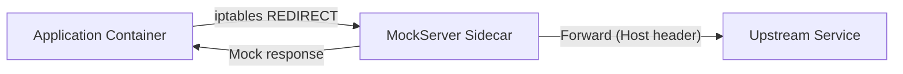

# Service Mesh / Sidecar Mode

MockServer can run as a Kubernetes sidecar proxy with transparent HTTP interception and a simplified xDS route discovery endpoint. This enables service mesh integration patterns where MockServer intercepts traffic destined for external services.

## Architecture



## Transparent Proxy Mode

When `transparentProxyEnabled=true`, MockServer treats all incoming HTTP connections as proxy requests. Instead of requiring clients to send explicit HTTP CONNECT requests, it uses the `Host` header to determine the forwarding target.

This works with Linux iptables REDIRECT rules that redirect outbound traffic to MockServer's port, making the interception transparent to the application.

### How it works

1. iptables redirects outbound traffic from the application container to MockServer's port
2. MockServer resolves the original destination:
   - **On Linux**: reads the original destination from the kernel conntrack table (`/proc/net/nf_conntrack`) which records the pre-REDIRECT destination. This is the most accurate method and works even when the Host header is missing, wrong, or the request is non-HTTP (binary).
   - **Fallback**: if conntrack is unavailable (non-Linux OS, `nf_conntrack` module not loaded, or the entry has been flushed), MockServer falls back to the `Host` header from the incoming request.
3. If an expectation matches, MockServer returns the mock response
4. Otherwise, MockServer forwards the request to the original target

### Configuration

| Property | Default | Description |
|----------|---------|-------------|
| `transparentProxyEnabled` | `false` | Enable transparent proxy mode |

Environment variable: `MOCKSERVER_TRANSPARENT_PROXY_ENABLED`

### iptables example (init container)

The UID-based RETURN rule **must come before** any REDIRECT rules to prevent an infinite redirect loop: when MockServer forwards a request upstream, its own outgoing packet would otherwise match the REDIRECT and loop back to itself.

```yaml
initContainers:
  - name: iptables-init
    image: alpine:3.19
    securityContext:
      capabilities:
        add: ["NET_ADMIN"]
    command:
      - sh
      - -c
      - |
        # RETURN first — exclude MockServer's own egress (UID 65534) to prevent redirect loop
        iptables -t nat -I OUTPUT -m owner --uid-owner 65534 -j RETURN
        iptables -t nat -A OUTPUT -p tcp --dport 80 -j REDIRECT --to-port 1080
        iptables -t nat -A OUTPUT -p tcp --dport 443 -j REDIRECT --to-port 1080
```

The `excludeUid` must match `app.runAsUser` (default 65534). The Helm chart configures this via `sidecar.iptables.excludeUid`.

## xDS Route Discovery

When `xdsEnabled=true`, MockServer provides two route discovery mechanisms:

1. **REST endpoint** -- a JSON snapshot of the route table at `GET /mockserver/xds/routes`
2. **gRPC RDS server** -- a real Envoy-compatible Route Discovery Service on `xdsPort` (default 18000)

### REST Endpoint

`GET /mockserver/xds/routes`

Returns active expectations as a simplified xDS RouteConfiguration JSON:

```json
{
  "name": "mockserver_routes",
  "virtual_hosts": [
    {
      "name": "mockserver",
      "domains": ["*"],
      "routes": [
        {
          "match": {
            "path": "/api/users",
            "method": "GET"
          },
          "expectationId": "abc-123"
        }
      ]
    }
  ]
}
```

### gRPC RDS Server

When `xdsEnabled=true` and `xdsPort > 0`, MockServer starts a standalone HTTP/2 (H2C) gRPC server that implements the Envoy v3 Route Discovery Service. This allows a real Envoy or Istio data plane to fetch routes from MockServer.

**Supported gRPC methods:**

- `/envoy.service.route.v3.RouteDiscoveryService/StreamRoutes` (server-streaming; one full-state response per request)
- `/envoy.service.route.v3.RouteDiscoveryService/FetchRoutes` (unary)

The server responds with a `DiscoveryResponse` containing a single `RouteConfiguration` resource wrapped in a `google.protobuf.Any`. Each MockServer expectation with a path becomes an Envoy Route with an exact path match and cluster name "mockserver". Expectations without a path use a prefix "/" match.

**Protobuf approach:** The xDS protobuf messages are hand-coded using minimal wire-format encoding/decoding (`ProtoWriter`/`ProtoReader`) to avoid heavyweight dependencies on `grpc-java` or `io.envoyproxy.controlplane:api`. Only the subset of messages needed for RDS is implemented.

**Lifecycle:** The gRPC server starts during `MockServer.createServerBootstrap()` (fail-soft: a bind failure logs a warning but does not crash the main server) and stops during `MockServer.stopAsync()`.

### Configuration

| Property | Default | Description |
|----------|---------|-------------|
| `xdsEnabled` | `false` | Enable xDS route discovery (REST endpoint and gRPC RDS server) |
| `xdsPort` | `18000` | TCP port for the gRPC RDS server (plaintext H2C) |

Environment variables: `MOCKSERVER_XDS_ENABLED`, `MOCKSERVER_XDS_PORT`

### Not Implemented

- **Delta/incremental xDS** -- only State of the World (SotW) responses are supported
- **Watch-on-change** -- no server push when expectations change; clients must re-request
- **LDS, CDS, EDS, ADS** -- only RDS is implemented
- **TLS on xDS port** -- the gRPC server uses plaintext HTTP/2 (H2C) only
- **Resource filtering** -- `resource_names` in the DiscoveryRequest are acknowledged but all routes are returned regardless

## Helm Chart

The Helm chart includes sidecar configuration under the `sidecar` key:

```yaml
sidecar:
  enabled: false
  transparentProxy: false
  xdsEnabled: false
  xdsPort: 18000
  iptables:
    enabled: false
    excludeUid: 65534   # must match app.runAsUser to prevent redirect loop
```

When `sidecar.transparentProxy` is true, the `MOCKSERVER_TRANSPARENT_PROXY_ENABLED` environment variable is set in the deployment.

When `sidecar.xdsEnabled` is true, both `MOCKSERVER_XDS_ENABLED` and `MOCKSERVER_XDS_PORT` are set.

## Implementation

| Component | Location |
|-----------|----------|
| Configuration properties | `Configuration.java`, `ConfigurationProperties.java` |
| Transparent proxy logic | `mockserver-netty/.../proxy/TransparentProxyInitializer.java` |
| SO_ORIGINAL_DST / conntrack | `mockserver-netty/.../proxy/SoOriginalDstHelper.java` |
| Pipeline handler (sets REMOTE_SOCKET) | `mockserver-netty/.../proxy/TransparentProxyHandler.java` |
| Protobuf wire helpers | `mockserver-core/.../xds/ProtoWriter.java`, `ProtoReader.java` |
| xDS protobuf messages | `mockserver-core/.../xds/XdsProtoMessages.java` |
| xDS route builder (JSON + protobuf) | `mockserver-core/.../xds/XdsRouteBuilder.java` |
| REST endpoint | `HttpState.java` (GET /mockserver/xds/routes) |
| gRPC RDS server | `mockserver-netty/.../xds/XdsDiscoveryServer.java` |
| Lifecycle wiring | `MockServer.java` (startXdsServer / stopAsync) |
| Helm values | `helm/mockserver/values.yaml` |
| Helm deployment | `helm/mockserver/templates/deployment.yaml` |

## SO_ORIGINAL_DST / Conntrack Resolution

On Linux with the `nf_conntrack` kernel module loaded, MockServer reads the original destination of intercepted connections from `/proc/net/nf_conntrack`. This provides accurate target resolution even when the Host header is absent or incorrect.

### Requirements

- **Linux only**: conntrack-based resolution requires Linux. On other OSes (macOS, Windows), MockServer gracefully falls back to Host-header resolution.
- **`nf_conntrack` module**: the kernel module must be loaded (`modprobe nf_conntrack`) and `/proc/net/nf_conntrack` must be readable by the MockServer process.
- **iptables REDIRECT**: the iptables rule must use `-j REDIRECT` (not `-j DNAT`). The conntrack entry format differs for DNAT.
- **`NET_ADMIN` capability**: the container/pod needs `NET_ADMIN` for iptables setup (the same capability already required for the init container).

### Implementation approach

Netty 4.x does not expose the `SO_ORIGINAL_DST` socket option (not even via `EpollChannelOption`). Calling `getsockopt(fd, SOL_IP, SO_ORIGINAL_DST, ...)` would require JNI. Instead, MockServer uses a JNI-free approach: parsing `/proc/net/nf_conntrack` to look up the original destination by matching the connection's client address and MockServer's local address against conntrack entries.

This approach:
- Works without native code or JNI libraries
- Is used by several production transparent proxies
- Has O(n) cost per lookup where n = number of tracked connections (acceptable for development/testing; for high-throughput production use, a JNI-based `SO_ORIGINAL_DST` implementation would be more efficient)
- Falls back to the legacy `/proc/net/ip_conntrack` if `nf_conntrack` is unavailable

### Testing

- Unit tests for conntrack parsing and address normalization run cross-platform (macOS/Linux/Windows)
- The `isSupported()` platform gate is tested to reflect the actual OS
- The `getOriginalDestination()` method correctly throws `UnsupportedOperationException` on non-Linux with a descriptive message
- The `TransparentProxyHandler` is tested with an `EmbeddedChannel` to verify:
  - `REMOTE_SOCKET` attribute is set when original destination is resolved
  - Graceful fallback when the resolver returns null or throws
  - No-op behavior when transparent proxy is disabled
- Integration testing with real iptables REDIRECT requires a Linux environment (CI or Docker)

## Limitations

- **SotW only**: The gRPC RDS server returns full-state responses; delta/incremental xDS is not supported.
- **RDS only**: LDS, CDS, EDS, and ADS are not implemented.
- **No watch-on-change**: The server does not push updates when expectations change; clients must re-request.
- **Plaintext H2C**: The xDS gRPC port uses cleartext HTTP/2; TLS is not supported on the xDS port.
- **Conntrack lookup is O(n) with a cap**: The `/proc/net/nf_conntrack` parsing scans the conntrack table per connection, capped at 200,000 lines to bound CPU cost. If the table exceeds this limit, MockServer falls back to Host-header resolution. For high-connection-rate production deployments, a JNI-based `getsockopt(SO_ORIGINAL_DST)` would be more efficient (not yet implemented).
- **Linux only**: conntrack-based original-destination resolution requires Linux with `nf_conntrack`. On other OSes, the transparent proxy falls back to Host-header resolution, which works for HTTP traffic but requires the Host header to be correct.
- **iptables required for interception**: The transparent proxy itself does not set up iptables rules. An init container or external mechanism must configure traffic redirection.
