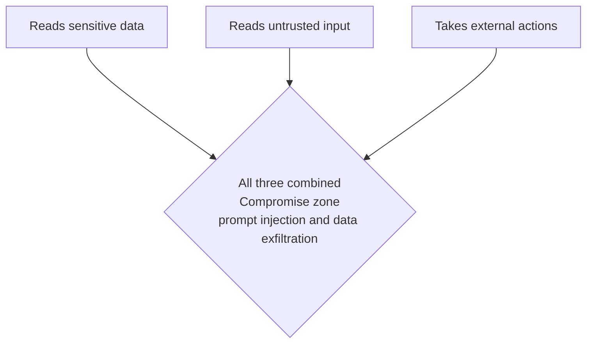
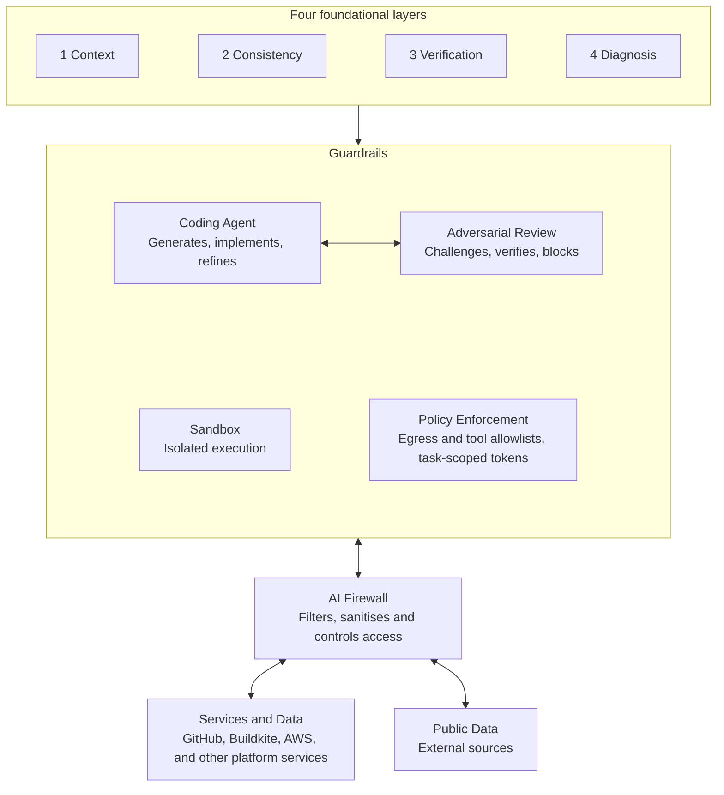
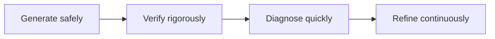

# AI-Native SDLC Principles

Core principles for working with AI across the software development lifecycle (SDLC).

These principles describe *how* to work with AI safely and effectively at every stage of
development — from specification through implementation, verification, and operation. They
are the conceptual foundation. [AI-Assisted Development](ai-assisted-development.md)
describes how MockServer puts them into practice with its specific agent harness, review
constitution, and structural controls.

## Contents

1. **Role of the Engineer** — from writing code to managing AI agents
2. **Specification as the Primary Control Point** — the contract between human intent and AI execution
3. **Trust Model** — assume AI is wrong
4. **Verification Over Generation** — converge on correct outcomes
5. **Context Is Critical** — every session is a blank slate
6. **Standardisation and Reuse** — AI instructions are shared code
7. **Observability & Diagnosability** — rich observability and the debugging context trio
8. **Security & Execution Boundaries** — least privilege and clear boundaries
9. **Continuous Learning & Improvement** — improve through usage, not remain static
10. **The Full System** — four foundational layers plus the execution model

Two cross-cutting concerns — [where AI breaks](#where-ai-breaks) and
[the lethal trifecta](#the-lethal-trifecta) — sit alongside the principles and shape
principle 10.

## Principle 1: Role of the Engineer

- The engineer's role shifts from *writing code* to **managing AI agents**.
- **AI provides speed and breadth; the engineer provides judgement and depth.**
- The engineer remains **accountable for all outputs**.

## Principle 2: Specification as the Primary Control Point

The specification is the contract between human intent and AI execution.

**Why "spec first":**

- Forces clarity before building.
- Surfaces edge cases and missed considerations early.
- Provides a shared definition of done for both AI and reviewers.

**Working with AI on specs:**

- Use iterative back-and-forth to refine requirements.
- AI should ask questions and highlight gaps.
- It is faster to reach a thorough spec with AI than by writing alone.

> **Good spec structure:** executive summary first, high-level options next, detailed
> backing only where needed.

## Principle 3: Trust Model — Assume AI Is Wrong

- **Trust is earned, not assumed.**
- Nothing is implied — be explicit about what to do *and* what not to do.
- Demand evidence — AI must **prove its claims with passing tests**.

## Principle 4: Verification Over Generation

> The system's goal is not to produce code, but to converge on correct outcomes.

- **Tests verify the AI's work.**
- Enable AI to **discover and fix its own errors**.
- Prefer **deterministic verification over human review**.

## Principle 5: Context Is Critical

- Every session is a **blank slate**.
- "Onboarding" documentation must provide full context — patterns and constraints,
  architecture and intent.
- Nothing is inferred — **explicit context is required**.

### Building Project Context

Project context is assembled from three sources:

| Source | What it provides |
|--------|------------------|
| **From code** | Architecture docs, module boundaries, request flows, dependency maps, and API contracts — derived directly from the implementation. |
| **From infrastructure** | Topology diagrams, network maps, and resource relationships — queried from Terraform state and AWS APIs. |
| **From engineers** | Intent, motivation, trade-offs, and decisions not visible in code. ADRs, runbooks, and operational knowledge that explain the *why* behind the *what*. |

> **The result:** context that serves both engineers onboarding and AI agents reasoning
> about the system.

## Principle 6: Standardisation and Reuse

- **AI instructions are shared code** — prompts, rules, workflows, and skills are
  versioned and reviewed.
- Prefer **reusable skills and workflows** over bespoke, hand-crafted agents.
- Stay flexible — use cheap, repeatable processes and avoid over-engineering.

## Principle 7: Observability & Diagnosability

- AI requires **rich observability** — logs, metrics, and traces.
- Humans can adapt to missing information — **AI cannot**.

### The Debugging Context Trio

Fast issue resolution requires three types of context brought together. Without all three,
diagnosis is guesswork.

| Context | Question it answers | Includes |
|---------|---------------------|----------|
| **Audit** | What happened? | Deployments & rollbacks, config & policy changes, scaling actions, causal timeline |
| **Diagnostics** | Is the service functioning correctly? | Service, TLS, DNS, and credential health; connectivity & dependency reachability; likely root cause when something is wrong; higher-level than raw logs & metrics |
| **Platform Health** | Is the platform itself functioning? | Service & infrastructure health and availability, platform connectivity & DNS resolution, shared dependencies & identity services, regional incidents & degradation |

> You cannot debug effectively without combining what changed, what is broken, and what
> the platform is doing.

## Principle 8: Security & Execution Boundaries

- Use **local agents with your credentials**.
- Avoid shared "god accounts" and over-privileged execution.
- Enforce **least privilege** and clear execution boundaries.

## Principle 9: Continuous Learning & Improvement

- Capture learnings — when AI is slow, and when it makes mistakes.
- Improve context, prompts, and workflows.

> AI systems should continuously improve through usage, not remain static.

## Where AI Breaks

AI fails in characteristic ways. Each failure mode has a corresponding control.

| Failure mode | Risk | Control |
|--------------|------|---------|
| **Hallucinations** | Confident wrong answers | Cite evidence; use deterministic checks |
| **Unintended harm** | Wrong remediation at scale | Human-in-the-loop for all write actions |
| **Data privacy** | Sensitive data leaving your environment | Redaction controls; models run in a trusted, controlled environment |
| **Limited context** | Missing tribal knowledge | Rich documentation; local agents with human-in-the-loop |
| **Skills atrophy** | Over-reliance erodes capability | AI augments, never replaces |
| **Accountability** | Ownership chain can break | A human owns every action — "the AI did it" is never an excuse |

## The Lethal Trifecta

Three capabilities are individually safe but structurally unsafe in combination:

Any one capability is fine. Any two can be made safe. **All three together is structurally
unsafe** — no amount of prompt tuning can fully mitigate the risk. LLMs cannot reliably
separate instructions from data, so security must be enforced through architecture, not
prompt rules.

### Guardrails — the ideal approach to the lethal trifecta

**Guardrails are the ideal approach to address the lethal trifecta** — they break the
trifecta by design rather than by hoping the model behaves. The guardrails (shown in
[The Full System](#principle-10-the-full-system)) wrap every coding agent with three
architectural controls:

- **Minimise untrusted content** — tickets, emails, PRs, and web content are isolated and
  pre-processed before reaching high-privilege contexts. Retrieval is read-only,
  least-privilege, and strongly audited.
- **Sandbox execution** — generated or executed code runs in hardened, isolated sandboxes,
  limiting the blast radius of any compromise.
- **Policy enforcement for egress, tool scope, and credentials** — strict allowlists
  govern outbound destinations and tool calls. **Authentication tokens are scoped only to
  the known task the AI is performing** — issued just-in-time, narrowed to the specific
  repositories, services, and actions that task requires, and never standing broad
  credentials. External communication is a privileged capability requiring explicit
  approval gates.

In [The Full System](#principle-10-the-full-system) below, the guardrails are the boundary
the coding agent and adversarial reviewer operate inside — sandbox execution and policy
enforcement apply to both. Minimising untrusted content happens one layer further out, at
the AI Firewall.

## Principle 10: The Full System

AI-native SDLC is a system, not a single tool. It rests on four foundational layers
feeding an execution model whose every external interaction passes through guardrails and
an AI Firewall.

Four foundational layers:

| Layer | Provides |
|-------|----------|
| **1. Context** | Codebase, business intent, docs, history, operational metadata |
| **2. Consistency** | Standard architectures, common patterns, predictable frameworks |
| **3. Verification** | Unit, integration, post-deployment, scripts, Docker, Terraform |
| **4. Diagnosis** | Audit, diagnostics, platform health, pre-generated summaries |

The execution model:

- **Guardrails** wrap the coding agent and its adversarial reviewer. The agent generates,
  implements, and refines; the reviewer challenges, verifies, and blocks. Both run inside
  a sandbox with isolated execution, and policy enforcement applies egress and tool
  allowlists plus authentication tokens scoped only to the known task the AI is
  performing. The guardrails are the ideal approach to address the lethal trifecta.
- **The AI Firewall** is the single mediated gateway for everything outside the
  guardrails. It filters, sanitises, and controls access in both directions.
- **Services and data** — GitHub, Buildkite, AWS, and other platform services and data —
  are reached *only* through the AI Firewall. They are discovered dynamically rather than
  hard-coded.
- **Public data** — external sources — is likewise reached only through the AI Firewall,
  which sanitises untrusted input before it reaches the agent.

The key point: nothing the agent does touches a real service, credential, or external
source directly. Every interaction passes through the guardrails and then the AI Firewall.

## Core System Principle

> AI-native SDLC is not about generating code faster. It is about building a system that
> can:

## Further Reading

- [AI-Assisted Development](ai-assisted-development.md) — how MockServer applies these
  principles: the agent harness, multi-model adversarial review, the review constitution,
  and structural safety controls.
- [OpenCode Configuration](opencode-configuration.md) — full technical details of the AI
  harness: agents, model strategy, rules, skills, and commands.
- [OpenCode Building Blocks](opencode-building-blocks.md) — generic guide to the
  configuration patterns used.
- [AWS Infrastructure](../infrastructure/aws-infrastructure.md) — the AWS, Terraform, and
  Buildkite agent infrastructure behind the platform services named in principle 10.
- [CI/CD](../infrastructure/ci-cd.md) — the Buildkite pipelines and GitHub Actions
  workflows the verification layer runs on.
