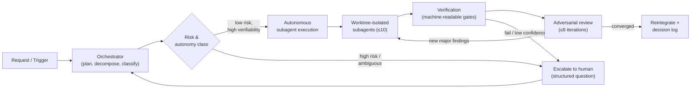
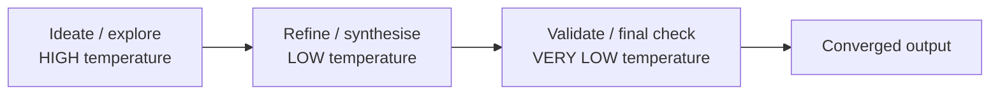
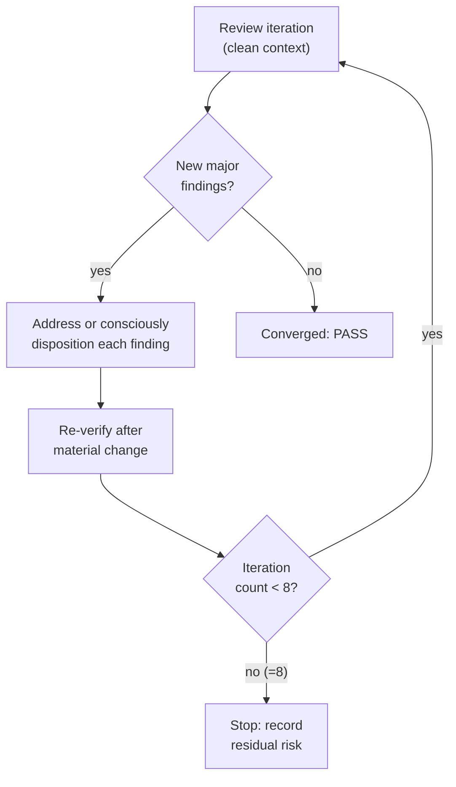
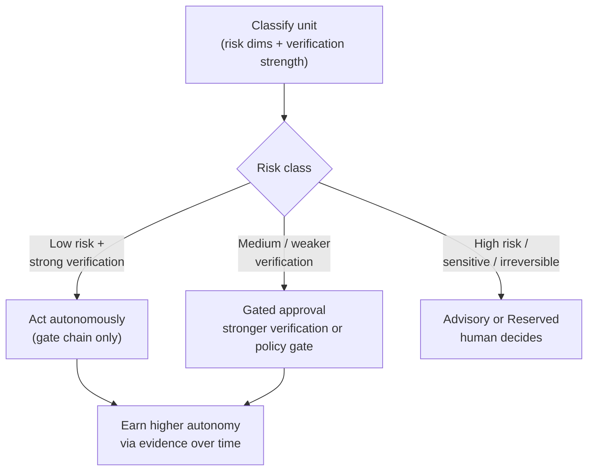

# AI-in-SDLC Integration Specification

> **Status:** Specification (requirements & outcomes). Normative.
> **Audience:** Platform engineering, AI engineering, SRE, security, engineering leadership.
> **Scope note:** This document specifies how AI is used to **support, augment, and automate the Software Development Life Cycle** (planning, requirements, specification, architecture review, coding, testing, verification, diagnosis, documentation, operational investigation, change analysis). It is **not** a specification for product features, end-user AI capabilities, customer-facing assistants, or runtime AI behaviour embedded in the delivered product.
> **Document control:** Owner — the AI-in-SDLC platform owner (role; individual to be named — see §22.6). Review cadence — at least quarterly and after any material incident or AI-capability change (§18.1, §22.5). This document is itself a change-managed, versioned artefact; terms used normatively are defined in **Appendix C — Glossary**.

---

## 1. Executive summary

**Outcome this specification mandates:** AI must be integrated into the SDLC as a **high-autonomy, subagent-first, worktree-isolated delivery system** whose autonomy is *earned through machine-verifiable evidence* — strong context, standardisation, continuous verification, fast diagnosis, reproducibility, and iterative adversarial review — rather than granted by default or backstopped by routine human review.

The system **must** minimise routine human intervention while preserving **explicit escalation** for ambiguity, policy, and high-risk decisions. It **must** maximise safe parallelism under hard caps (no more than **10 active subagents** and **10-way parallelism** at any one time). The main agent's primary job is to **orchestrate subagents**: it **must** delegate the overwhelming majority of execution — implementation *and* investigation — to subagents and reserve its own context for planning, decomposition, routing, review, and escalation. Delegating each unit to a purpose-built subagent is what lets the system pick the **model, temperature, and reasoning effort** that fit the task, which is the primary lever for managing **inference cost** and **determinism**; these are explicit, auditable decision variables, and the system **may** use multi-pass temperature pipelines (explore high → converge low → validate very low). Every significant action **must** be reproducible and auditable.

The five mandatory pillars are **Context, Consistency, Verification, Diagnosis, and Adversarial Review**, bound together by **Reproducibility**. Adversarial review **must** be driven by per-artefact-type **review constitutions** (a focused profile for specifications, plans, ADRs, coding, investigation, documentation, deployment, periodic sweeps, etc.) rather than one generic checklist, so each review probes what actually breaks that artefact type. The system is also defended against its **own** failure modes — resisting prompt injection from untrusted inputs, never weakening or gaming the controls it is judged by, running tool execution in a bounded sandbox under an operator-controlled halt, and treating its own prompts, constitutions, routing, and model versions as change-managed artefacts validated against an evaluation suite (the binding requirements are C16–C19, §12 V7, §16, §17, §18.5; this summary is descriptive, not independently normative). The central discipline of the document: *humans are removed from routine loops by making the loops verifiable, not by lowering the bar.*

**How to read this document:** Sections 2–5 set objectives, scope, and principles. Sections 6–17 are the normative core (one concern per section). Sections 18–22 cover measurement, risk, failure, governance, and open questions. Each section states intent, lists requirements, separates **mandatory** (`MUST`/`MUST NOT`) from **recommended** (`SHOULD`/`MAY`), and notes trade-offs.

**Conformance language:** `MUST`/`MUST NOT` = mandatory; `SHOULD`/`SHOULD NOT` = strongly recommended, deviation requires recorded justification; `MAY` = optional. A requirement is **conformant** only when its stated evidence source exists and is inspectable.

---

## 2. Objectives

**Intent:** Define what the integration optimises for, so that every downstream requirement can be traced to an objective.

The integration **MUST** be designed to optimise, in balance:

| # | Objective | Why it matters |
|---|-----------|----------------|
| O1 | **Correctness & fitness-for-purpose** | The output must be right *and* solve the actual problem; the primary quality target, never traded away silently. |
| O2 | **Autonomy** | Reduce routine human involvement; let humans focus on ambiguity, policy, and high-risk judgement. |
| O3 | **Safe parallelism** | Increase throughput via concurrency without raising merge, correctness, or cost risk. |
| O4 | **Low coordination overhead** | Decompose so units rarely contend; avoid synchronisation that erases parallelism gains. |
| O5 | **Fast feedback** | Verify early and continuously; shorten the loop between action and evidence. |
| O6 | **Reproducibility** | Significant work is attributable to inputs, assumptions, evidence, and decisions. |
| O7 | **Auditability** | Behaviour is explainable after the fact, by a human or another agent. |
| O8 | **Cost effectiveness** | Right-size model, temperature, reasoning effort, and concurrency to quality thresholds; avoid waste. Per-subagent routing is the primary lever for managing inference cost. |
| O9 | **Operational safety** | Fail safe, degrade gracefully, never act outside delegated authority. |
| O10 | **Maintainability over time** | Outputs and the system itself stay comprehensible and evolvable. |

**Precedence under conflict:** When objectives conflict, **O1 (correctness/fitness) and O9 (operational safety) take precedence** over O2/O3/O8 (autonomy, parallelism, cost). The system **MUST** resolve such conflicts toward correctness and safety, and **MUST** record the trade-off (§21).

---

## 3. Scope

**Intent:** Bound exactly where AI is authorised to act, advise, or be reserved.

### 3.1 In scope (SDLC activities)
The specification covers AI support, augmentation, and automation across: **planning, requirements analysis, specification authoring, architecture and design review, implementation (coding), test authoring and execution, verification, diagnosis and debugging, documentation, operational/SRE investigation, and change/impact analysis.**

### 3.2 In-scope systems and artefacts
- **Systems/environments:** source repositories, CI/CD pipelines, build/test infrastructure, issue trackers, documentation systems, observability tooling, policy systems, and non-production environments used for SDLC verification.
- **Artefacts AI MAY create/modify:** plans, specifications, code changes, tests, documentation, ADRs, runbooks, incident/operational analyses, review comments, change-impact analyses, diagnostic summaries.

### 3.3 Authority classes (what AI may do per artefact)
The system **MUST** classify each activity into one authority class, and the class **MUST** be enforced, not advisory:

| Authority class | Meaning |
|-----------------|---------|
| **Act autonomously** | AI may produce and *reintegrate* the artefact once the full verification + adversarial-review gate chain passes, with no human pre-approval. |
| **Act with gated approval** | AI may produce the artefact but a defined gate (policy, human, or stronger verification) **MUST** approve before reintegration. |
| **Advisory only** | AI may propose; a human decides and owns the action. |
| **Reserved** | AI **MUST NOT** act; the decision belongs exclusively to a human authority. |

The mapping of activity → authority class **MUST** depend on the risk classification in §19, and **MUST** be recorded in policy. Production-affecting actions, irreversible actions, and security/compliance-sensitive changes **MUST** default to *gated approval* or *reserved* unless explicitly promoted by evidence-based policy (§19, §21.5).

### 3.4 Degree of autonomy
Autonomy **MUST** be a function of risk class and verification strength (§19), not a fixed global setting. Higher autonomy is **earned** by demonstrated verification coverage and historical reliability for that work type.

---

## 4. Non-goals

**Intent:** Prevent scope creep and implementation bias by stating explicitly what this is *not*.

This specification **MUST NOT** be read as addressing any of the following:

- **N1 — Customer-facing AI features.** It does not design, specify, or govern AI capabilities exposed to end users or customers.
- **N2 — Product AI behaviour.** It does not define runtime AI interactions, models, or behaviour *within the delivered product*.
- **N3 — Embedded runtime AI.** It does not cover inference performed by the shipped software at run time.
- **N4 — Governance replacement.** It does not replace governance with blind automation; controls are strengthened, not removed.
- **N5 — Human compensation for weak process.** It does not assume human reviewers will catch what poor process design lets through. Where a control can be machine-verified, a human **MUST NOT** be the default gate.
- **N6 — Vendor/technology selection.** It does not mandate specific models, libraries, vendors, or frameworks; it specifies required *capabilities*.
- **N7 — UI/UX design.** It does not address interface design except where directly relevant to SDLC governance or agent behaviour.

---

## 5. Guiding principles

**Intent:** The philosophy that every requirement implements. These are normative.

### 5.1 Minimise routine human intervention; preserve explicit escalation
The system **MUST** minimise routine human involvement through process design, context, verification, reproducibility, and structured challenge — **not** by weakening controls. Humans **MUST** remain the decision-maker only for: (a) ambiguity that materially blocks progress; (b) high-risk decisions outside delegated authority; (c) exceptions, escalations, and policy boundaries; (d) cases where automated verification cannot provide sufficient confidence.

### 5.2 Clarify early to maximise downstream autonomy
The system **MUST** detect uncertainty early and **SHOULD** ask clarifying questions *before* expensive work begins, but **only** when a question materially reduces ambiguity, prevents rework, or unblocks progress. It **MUST**: prioritise high-value clarifications, batch related questions, avoid low-value interruptions, and state **explicit assumptions** and continue when progress can safely proceed without an answer.

### 5.3 Maximise safe parallelism (capped)
Parallelism **MUST** be an intentional design concern. The system **MUST** decompose work into independently executable units, minimise contention on shared files/branches/state, avoid unnecessary serialisation, and preserve traceability of parallel outcomes — subject to the hard caps in §8 (≤10 active subagents, ≤10-way parallelism), with **lower** dynamic limits applied per §8.2.

### 5.4 All work is worktree-isolated
**No work runs in the bare main checkout** — every independent session **MUST** operate inside its own dedicated, isolated worktree on a local-only branch, and this holds **even when the work makes no changes** (read-only investigation, analysis, and review are worktree-bound too). Worktree isolation is the default and mandatory mode. The isolation unit is the **independent session** (the primary interactive session, each parallel window, each long autonomous run); helper subagents spawned *within* a session are the one deliberate exception — they **share the spawning session's worktree** so they can review its uncommitted in-flight work (§8.3). Worktree branches **MUST** be local-only and **MUST NOT** be pushed to remote by default.

### 5.5 Subagent-first execution
The main agent's **primary job is to orchestrate subagents.** It **MUST** act as orchestrator/planner/coordinator/reviewer and **MUST** delegate the overwhelming majority of execution — implementation *and* investigation — to subagents (§7), performing work directly only for the trivial residue where delegation would add no value (e.g. a one-line edit). It **MUST** preserve its context window and reasoning capacity for orchestration, decomposition, routing, review, and escalation. Delegating each unit to a purpose-built subagent is also the mechanism by which **model, temperature, and reasoning effort** are matched to the task — the primary lever for managing inference cost and determinism (§5.6, §9).

### 5.6 Explicit, intentional model, temperature, and effort selection
Model capability, temperature, **and reasoning effort** **MUST** be treated as explicit, auditable decision variables chosen from task classification (§9), not defaults. Per-task selection of these variables is the primary control for **inference cost** and **output determinism**; the per-subagent configuration is where they are set and recorded.

### 5.7 Multi-pass creativity-to-convergence
Where it improves quality, the system **SHOULD** use multi-pass execution with descending temperature profiles (explore → refine → validate) as a structured pipeline, not ad hoc randomness (§9.4).

### 5.8 The five pillars, bound by reproducibility
**Context, Consistency, Verification, Diagnosis, and Adversarial Review** are mandatory pillars (§10–§14); **Reproducibility** (§15) makes them auditable and repeatable.

---

## 6. Core requirements

**Intent:** Cross-cutting requirements that the specialised sections (§7–§22) elaborate. This section captures the *core* cross-cutting set; additional MUST-level requirements live in their home sections (§7–§22), and **Appendix B is the complete conformance checklist**. Requirement IDs (C, V, S, OP, R, …) are **stable labels, not an ordering** — mandatory and recommended items are listed separately, so within a namespace the numbers may be non-contiguous (e.g. C16–C19 are mandatory and appear before the recommended C13–C15).

**Mandatory (`MUST`):**

- **C1 — Earned autonomy.** Autonomy level **MUST** be derived from risk class and verification strength (§19); it **MUST NOT** be globally fixed or self-asserted.
- **C2 — Gate chain is the authority to ship.** A unit of work **MUST** pass a defined, fail-closed gate chain (classify → validate → adversarial review with explicit PASS → re-verify) before reintegration. If any gate cannot run or does not return a clean PASS, the system **MUST NOT** reintegrate, and **MUST** surface the failure (§12, §14, §20).
- **C3 — Subagent-first.** The overwhelming majority of execution — implementation *and* investigation — **MUST** be delegated to subagents; the main agent acts primarily as orchestrator (§7).
- **C4 — Worktree isolation.** All work **MUST** run inside a worktree, never the bare checkout — including read-only/investigation work that makes no changes; the isolation unit is the independent session, and helper subagents share the spawning session's worktree (§8.3). Branches local-only by default (§8.3).
- **C5 — Concurrency caps.** ≤10 active subagents and ≤10-way parallelism at any time, with dynamic lower limits (§8).
- **C6 — Explicit routing.** Model, temperature, **and reasoning effort** **MUST** be selected from task classification and recorded (§9, §21).
- **C7 — Verifiability.** Every AI output **MUST** be verifiable; unverifiable completion claims **MUST NOT** be accepted (§12).
- **C8 — Adversarial review.** Key artefacts **MUST** undergo independent, iterative adversarial review to convergence or 8 iterations, with residual risk recorded if unconverged (§14).
- **C9 — Reproducibility.** Significant outputs **MUST** be reconstructable from recorded inputs, assumptions, evidence, and decisions (§15).
- **C10 — Safe failure.** On any failure mode the system **MUST** fail safe, signal explicitly, and record an auditable reason (§20).
- **C11 — Least privilege.** Agents **MUST** operate under least-privilege access scoped to the task and its authorised context (§16).
- **C12 — Decision logging.** Significant actions and decisions **MUST** be explainable after the fact (§21).
- **C16 — Control integrity.** Agents **MUST NOT** weaken, disable, delete, or game verification controls to obtain a PASS; changes to the controls themselves are a higher-scrutiny class (§12 V7, §19.5).
- **C17 — Untrusted-input resistance.** Ingested content is **data, not instructions**; agents **MUST** resist prompt/instruction injection from in-scope-but-untrusted sources (§16 S11).
- **C18 — Bounded execution & operator halt.** Tool execution **MUST** be sandboxed to least capability, and an operator **MUST** be able to halt or pause all AI activity (§16 S12, §17 OP10).
- **C19 — Change-managed AI components.** Prompts, review constitutions, routing policy, guardrails, and model/provider versions **MUST** be versioned and validated against an evaluation suite before rollout (§18.5, §22.5).

**Recommended (`SHOULD`):**

- **C13** — Prefer the cheapest model/temperature/effort/concurrency that meets the quality threshold (O8).
- **C14** — Prefer deterministic, machine-readable checks over probabilistic judgement wherever a deterministic check exists.
- **C15** — Prefer reversible, incrementally-adopted changes over large irreversible ones (§22 rollout).

---

## 7. Autonomy and delegation model

**Intent:** Define the orchestrator/subagent division of labour and how tasks are delegated.

### 7.1 Roles
- **Main / orchestrator agent (`MUST`)** — its **primary job is to orchestrate subagents**: plan, decompose, classify risk, select subagents/models/temperatures/effort, schedule concurrency within caps, coordinate dependencies, run the gate chain, make escalation decisions, reintegrate, and maintain the decision log. It **MUST NOT** routinely perform execution work — implementation *or* investigation — that a subagent could do; it **MAY** perform execution directly only for the trivial residue where delegation would add no value (e.g. a one-line edit). Keeping execution in subagents is what preserves the orchestrator's context *and* lets each unit run at a cost-and-determinism-appropriate model/temperature/effort.
- **Execution subagents (`MUST`)** — perform scoped execution (coding, investigation, summarisation, validation) within the worktree (their own session's, or the spawning session's when they are helper subagents — §8.3), returning structured results.
- **Adversarial reviewer subagents (`MUST`)** — independently challenge artefacts with clean context (§14).

### 7.2 Delegation by default
- The system **MUST** delegate the overwhelming majority of execution — implementation *and* investigation — to subagents so the orchestrator can optimise task–model–temperature–effort fit (the primary inference-cost and determinism lever) and preserve context. Direct execution by the orchestrator is reserved for the trivial residue (§7.1).
- Delegated tasks **MUST** carry **delegation metadata**: scope and boundaries, explicit success criteria, required context references (§10), dependencies, selected model class, temperature, and reasoning effort with rationale, risk class, verification expectations, and concurrency/isolation requirements.

### 7.3 Decomposition discipline (`MUST`)
- Break work into the **smallest independent units** with clear interfaces.
- Minimise overlap and contention on shared files/state.
- Make dependencies explicit; sequence only where a true dependency exists.
- Define cancellation and recomposition rules so a failed or superseded unit can be safely dropped or merged.

### 7.4 Speculative parallelism (`MAY`)
The system **MAY** run speculative parallel attempts (e.g. multiple approaches to an ambiguous task) where this improves expected quality, **provided** it stays within concurrency caps and cost budget, and discards non-selected results cleanly with the selection rationale recorded.

**Trade-off (autonomy vs control):** Delegation-by-default maximises throughput and specialisation but disperses reasoning across agents; the orchestrator's gate chain and decision log (§21) are the control that keeps dispersed work auditable and correct.

---

## 8. Parallelism and isolation requirements

**Intent:** Make concurrency safe, bounded, and isolated.

### 8.1 Hard caps (`MUST`)
- **No more than 10 active subagents at any one time.**
- **No more than 10-way parallelism at any one time.**
- These are absolute ceilings; the system **MUST** queue or defer work rather than exceed them, and **MUST** signal when work is deferred for this reason (§20).

### 8.2 Dynamic lower limits (`MUST`)
The system **MUST** apply a *lower* effective concurrency limit when warranted by: task complexity, cost budget, model availability, repository contention risk, verification capacity, or operational constraints. The effective limit **MUST** be recorded with its rationale.

### 8.3 Worktree isolation (`MUST`)
- **No work runs in the bare main checkout.** Every **independent session** — the primary interactive session, each parallel window, and each long autonomous run — **MUST** work in its **own dedicated worktree** on a local-only branch. This holds **even when the work makes no changes**: read-only investigation, analysis, and review sessions are worktree-bound too.
- The isolation unit is the **independent session**, not every agent. **Concurrent independent sessions MUST NOT share a working tree.** **Helper subagents spawned within a session are the one deliberate exception: they share the spawning session's worktree** rather than getting their own. This is required for correctness, not convenience — reviewer and investigator subagents must read the spawning session's **uncommitted in-flight diff**, which a worktree branched off `origin/master` could not see, silently breaking the commit review gate (§14). Isolation is **between independent sessions, not within one.**
- Worktrees **MUST** prevent filesystem interference and state contamination between **independent sessions**.
- Worktree branches **MUST** be **local-only** and **MUST NOT** be pushed to remote by default. Remote branch creation **MUST** require explicit policy-based approval if ever permitted.
- Temporary work artefacts **MUST** be attributable to the agent and task that produced them.
- Completed or abandoned worktrees **MUST** be cleaned up safely and predictably; cleanup **MUST NOT** discard unmerged work without an explicit, logged decision.

### 8.4 Contention and merge safety (`MUST`)
- Independent units **MUST** be partitioned to minimise shared-file contention.
- Reintegration **MUST** be serialised through a defined merge discipline under a lock so concurrent units cannot corrupt shared branch state.
- **Linear history (`MUST`).** Reintegration **MUST** keep the mainline a **linear history with no merge commits**: each gate-passed unit is **rebased onto the current mainline tip and fast-forwarded** (`git rebase` then a fast-forward `git push`). The system **MUST NOT** create merge commits on the mainline — no `git merge` of a worktree/unit branch (including `--no-ff`), no non-rebasing `git pull`, and no intermediate "integration branch" that worktree branches are merged into. When several parallel units reintegrate, they are rebased **sequentially** under the lock, each onto the result of the previous. The rationale is a clean, bisectable, easy-to-follow history; the trade-off is that rebasing rewrites the *unit branch's* (local, unpushed) commits, which is safe precisely because worktree branches are local-only (§8.3).
- After reintegrating independent parallel units, the **integrated** result **MUST** be re-verified and **SHOULD** be re-reviewed adversarially, because defects can emerge from the *combination* even when each unit was individually correct.

### 8.5 Non-filesystem shared state (`MUST`)
Worktree isolation covers the filesystem only. Where agents touch shared mutable resources **beyond** the filesystem (databases, infrastructure, external services, ticket systems, message queues), the system **MUST** prevent unsafe concurrent mutation with the same discipline — via partitioning, locking, dedicated non-production targets, or serialisation. Such resources **MUST** be identified during decomposition (§7.3), their contention risk **MUST** feed the dynamic concurrency limit (§8.2), and their side effects **MUST** be made replay-safe (§15 R8).

**Trade-off (parallelism vs coordination/cost):** Caps and worktrees bound coordination cost and merge risk; they intentionally forgo unbounded throughput. The dynamic limits (§8.2) let the system trade parallelism down when contention or cost would otherwise erode the benefit.

---

## 9. Subagent, model, temperature, and effort selection strategy

**Intent:** Make capability, determinism, and reasoning effort explicit, intentional, and auditable optimisation controls — the primary levers for inference cost and output quality. Because nearly all execution is delegated (§5.5, §7), this per-subagent selection is where cost and determinism are actually managed.

### 9.1 Task classification (`MUST`)
Before selection, each task **MUST** be classified by: **complexity, ambiguity, risk, required reasoning depth, required determinism, required creativity, and available verification strength.**

### 9.2 Selection rules (`MUST`)
- Subagent, model, temperature, **and reasoning effort** **MUST** be selected from the classification.
- **Deterministic** tasks **MUST** default to **low temperature**.
- **Creative/exploratory** tasks **MAY** use **higher temperature** where beneficial.
- **High-risk** tasks **MUST** default to **low temperature and/or stronger models**.
- **Reasoning effort MUST track required reasoning depth (§9.1):** high-effort for hard implementation, authoritative review, security audit, and complex investigation; lower effort for mechanical or shallow tasks. On harnesses where temperature is unavailable (e.g. Claude Code subagents), effort and model choice are the determinism/quality levers in its place.
- The system **SHOULD NOT** use expensive models, high temperature, or high effort where a cheaper/lower setting meets the quality threshold (O8) — per-subagent selection is the main inference-cost control.
- Selection rationale **MUST** be recorded and explainable (§21).

### 9.3 Re-routing and fallback (`MUST`)
- A task **MAY** be re-run with a different model/temperature/effort if evidence suggests the original configuration was unfit; the re-route and its trigger **MUST** be recorded.
- **Fallback behaviour MUST exist** for when a selected model underperforms, fails, or is unavailable (degrade to an alternative model class, escalate, or defer — §20).

### 9.4 Multi-pass temperature pipeline (`SHOULD`)
Where quality benefits, the system **SHOULD** run a structured descending-temperature pipeline:

- High-temperature stages **MUST NOT** produce final outputs directly; convergence **MUST** pass through a low/very-low temperature refinement and validation stage before completion.
- Whether a multi-pass strategy was used **MUST** be recorded (§21).

### 9.5 Illustrative subagent categories (non-normative)
Examples only — the spec defines required *capability*, not a fixed taxonomy: complex/medium/simple-coding; complex/medium/simple-investigation; adversarial-review; summarisation; planning; verification; ideation; refinement; validation.

**Trade-offs:** *Cost vs capability* — stronger models cost more; route by classification, not habit. *Determinism vs creativity* — low temperature is safer but can miss better solutions; the multi-pass pipeline reconciles the two by exploring wide then converging.

---

## 10. Context requirements

**Intent:** AI quality is bounded by context quality; make context complete, fresh, discoverable, trustworthy, and bounded.

**Mandatory (`MUST`):**
- **CX1 — Completeness.** Agents **MUST** have access to the context a task needs: code, business intent, documentation, architecture decisions, interfaces, dependencies, operational/deployment metadata, ownership metadata, repository history, and relevant incident/change history.
- **CX2 — Freshness & relevance.** Context **MUST** be current; the system **MUST** minimise stale, conflicting, or low-signal context.
- **CX3 — Discoverability & structured access.** Required context **MUST** be discoverable and accessible in a structured way, not dependent on tacit knowledge.
- **CX4 — Provenance & trust.** Context **MUST** carry provenance and a trust level so agents can weight or reject low-trust sources.
- **CX5 — Access control.** Sensitive context **MUST** be access-controlled; agents **MUST** operate under least privilege (§16) and **MUST NOT** act on unauthorised sources.
- **CX6 — Context boundaries.** Agents **MUST** respect explicit boundaries on which sources they may consult; out-of-scope or irrelevant sources **MUST NOT** drive action.
- **CX7 — Missing-context signalling.** When required context is missing, the system **MUST** signal it explicitly and **MUST** either obtain it, state an explicit assumption and proceed (only if safe — §5.2), or escalate.

**Recommended (`SHOULD`):**
- **CX8** — Conflicting sources **SHOULD** be detected and surfaced rather than silently reconciled (§11, §14).
- **CX9** — Context **SHOULD** be summarised/curated to maximise signal density within model context limits.

**Trade-off (broad access vs least privilege):** Richer context improves correctness but widens the blast radius and privacy surface. The system **MUST** resolve this toward least privilege (§16): expand access by explicit, scoped grant — never by default breadth.

---

## 11. Consistency requirements

**Intent:** Standardisation makes outputs predictable, maintainable, and easier for AI to produce correctly.

**Mandatory (`MUST`):**
- **CN1** — Environments, repository structures, interfaces, naming and coding conventions, testing approaches, workflows, and operational expectations **MUST** be standardised as far as is reasonable, and the standards **MUST** be discoverable by AI agents (§10).
- **CN2** — Allowed **variation** and its boundaries **MUST** be defined; where variation is permitted it **MUST** be explicit, not incidental.
- **CN3** — **Exceptions** to standards **MUST** be governed (recorded, justified, owned).
- **CN4** — **Drift** from standards **MUST** be detectable, and detected drift **MUST** be surfaced for disposition.

**Recommended (`SHOULD`):**
- **CN5** — Consistency **SHOULD** be measured (e.g. conformance rate to conventions) and tracked over time (§18).
- **CN6** — Shared patterns/conventions **SHOULD** be communicated to agents as structured, machine-consumable context, not prose alone.

**Trade-off (flexibility vs standardisation, local vs system-wide):** Local deviations may be locally optimal but raise system-wide maintenance cost and reduce AI predictability. Standardise by default; permit governed exceptions where the local benefit is demonstrated and recorded.

---

## 12. Verification requirements

**Intent:** Everything AI produces **MUST** be verifiable; verification is early, continuous, machine-readable, and feeds iteration. This is the primary mechanism that replaces routine human review.

### 12.1 Lifecycle coverage (`MUST`)
Verification **MUST** be applied across the SDLC as relevant to the artefact, for example: local development checks, static analysis, unit tests, integration tests, contract tests, build validation, infrastructure validation, policy checks, security checks, deployment validation, and post-deployment monitoring/behavioural checks.

### 12.2 Verification properties (`MUST`)
- **V1 — Automated by default.** Verification **MUST** be automated wherever possible; manual verification is the exception and **MUST** be justified.
- **V2 — Machine-readable feedback.** Results **MUST** be machine-readable with clear pass/fail outcomes.
- **V3 — Explicit confidence thresholds.** Acceptance **MUST** be governed by explicit thresholds; below threshold, the system **MUST** iterate, re-route, or escalate (§20).
- **V4 — Evidence visibility.** The **evidence** used to accept or reject an output **MUST** be visible and recorded (§15, §21).
- **V5 — Iterative refinement.** Failures **MUST** feed back into further iterations rather than being worked around.
- **V6 — No silent failure / no unverifiable completion.** The system **MUST NOT** claim completion that cannot be backed by verification evidence. A unit with unrunnable or failing required gates **MUST NOT** be reintegrated (C2).
- **V7 — Control integrity (no gaming).** Agents **MUST NOT** weaken, disable, delete, skip, or otherwise game verification controls (tests, assertions, static-analysis or policy/security rules, coverage gates) to obtain a PASS. A gate satisfied by *reducing its strength* **MUST** be treated as a failure, not a pass. Changes **to the controls themselves** are a distinct **higher-scrutiny change class** (§19.5) that **MUST** be reviewed under a constitution confirming the control still detects the failures it exists to catch, and **MUST NOT** be approved by the same agent that benefits from the change (separation of duties, §16 S2).

### 12.3 Gate chain (`MUST`)
A unit of work is authorised to ship **only** by passing a fail-closed gate chain: **classify → validate (the checks in §12.1) → adversarial review with explicit PASS (§14) → re-verify after any change**. The gate chain — not a human prompt — is the authority to reintegrate for *act-autonomously* class work (§3.3). For *gated-approval* class work the chain plus the defined approval is required.

**Trade-off (speed vs correctness):** Continuous, automated verification adds per-step cost but is faster and cheaper than late human review and rework. Where a deterministic check exists, it **MUST** be preferred over probabilistic judgement (C14).

---

## 13. Diagnosis requirements

**Intent:** When things fail, make understanding *why* fast and cheap — for both humans and AI — so investigation does not depend on repeated manual data gathering.

**Mandatory (`MUST`):**
- **D1 — Fast time-to-understanding.** Diagnostic data **MUST** be accessible quickly enough to support iterative investigation without re-gathering it each pass.
- **D2 — Structured diagnostic data.** Logs, metrics, traces, events, change records, dependency state, and quality signals **MUST** be available in structured, agent-consumable form.
- **D3 — Correlation across layers.** The system **MUST** support correlating signals across layers (code change ↔ test ↔ build ↔ deploy ↔ runtime) to localise cause.
- **D4 — Failure classification.** Failures **MUST** be classifiable (e.g. flaky vs real, infrastructure vs logic) to route response correctly.
- **D5 — Reproducible evidence trail.** Diagnostic conclusions **MUST** rest on a reproducible evidence trail (§15).
- **D6 — Dual consumability.** Diagnostic views **MUST** be consumable by both humans and AI agents.

**Recommended (`SHOULD`):**
- **D7** — Summarised diagnostic views **SHOULD** be produced to compress high-volume signals into actionable findings.
- **D8** — Historical comparisons (against prior good runs/baselines) **SHOULD** be available to distinguish regressions from pre-existing conditions.

---

## 14. Adversarial review requirements

**Intent:** Important outputs are deliberately challenged, by an independent reviewer, iteratively, until they stop yielding major findings — within a hard limit.

### 14.1 What MUST be reviewed
Key SDLC artefacts **MUST** undergo structured adversarial review, including: specifications, plans, architectural decisions, code changes, test strategies, deployment changes, completed feature implementations, operational health assessments, runbooks, and documentation.

### 14.2 Baseline review dimensions (`MUST`)
Every adversarial review, regardless of artefact, **MUST** at minimum probe for: ambiguity, incompleteness, inconsistency, infeasibility, insecurity, inoperability, incorrectness, lack of fitness-for-purpose, brittleness, hidden assumptions, overcomplexity, poor rollback characteristics, poor observability, excessive coupling, and unverifiable claims. This is the **floor**, not the whole review — the artefact-specific constitution (§14.3) extends it with what matters most for that artefact type.

### 14.3 Review constitutions (per-artefact-type review profiles) (`MUST`)

**Intent:** A single generic checklist under-serves heterogeneous artefacts — what makes a *specification* good is not what makes a *code change* or an *operational investigation* good. The system **MUST** therefore drive each review from a **review constitution**: a named, versioned profile that *specialises* the baseline (§14.2) with the focus areas, failure modes, required evidence, and PASS criteria that matter most for a specific artefact or task type. This raises signal (reviewers probe what actually breaks this artefact type) and reduces noise (reviewers don't force-fit irrelevant generic concerns). The baseline dimensions (§14.2) **MAY** be implemented as a single shared framework that every constitution inherits, while the per-artefact constitutions extend it — so a pre-existing universal review framework is conformant with RC1 provided the type-specific extensions exist.

**Requirements:**
- **RC1 — Constitution per artefact/task type (`MUST`).** Each reviewable artefact or task type **MUST** map to a review constitution. The system **MUST** select the constitution from the artefact's classification and record which constitution (and its version) was applied (§21).
- **RC2 — Baseline inheritance (`MUST`).** Every constitution **MUST** include the baseline dimensions (§14.2) and **MUST** add type-specific focus areas; a constitution **MUST NOT** remove a baseline dimension, only extend or sharpen it.
- **RC3 — Required content (`MUST`).** Each constitution **MUST** define: its scope (which artefact/task types it governs), its prioritised focus areas, the failure modes most likely for that type, the **evidence the reviewer must inspect** (e.g. test results, diffs, traces, source spec), and explicit **PASS criteria** (what "no major findings" means for this type).
- **RC4 — Governed and versioned (`MUST`).** Constitutions are governed artefacts owned by the policy owner (§21.3); they **MUST** be versioned, discoverable as structured context (§10), and improved via the learning loop (§21.5) as new failure patterns emerge.
- **RC5 — Composition (`MAY`).** An artefact that spans types (e.g. an ADR embedded in a plan, or code plus its tests) **MAY** be reviewed under a composition of constitutions; the composition applied **MUST** be recorded.

**Illustrative constitutions** (examples — the policy owner defines the authoritative set; this is not exhaustive):

| Constitution | Governs | Adds focus on (beyond the baseline) | Key evidence | PASS criteria emphasise |
|--------------|---------|-------------------------------------|--------------|--------------------------|
| **review-specification** | Specs, requirements docs | Testability of each requirement, measurability of outcomes, scope/non-goal clarity, normative-language precision, internal contradiction, unstated assumptions | The spec + its source intent | Every requirement is verifiable and unambiguous |
| **review-plan** | Implementation/migration plans | Decomposition into independent units, dependency/sequencing correctness, parallelisability & contention, rollback per step, blast radius, cancellation points | Plan + repo/contention map | Each unit is independently executable and reversible |
| **review-adr** | Architecture Decision Records | Whether alternatives were genuinely considered, trade-offs made explicit, reversibility/lock-in, coupling impact, consistency with existing architecture, decay/expiry conditions | ADR + affected architecture | Decision, alternatives, and consequences are explicit and justified |
| **review-coding** | Code changes + tests | Correctness vs intent, edge cases, concurrency/resource safety, convention conformance (§11), test adequacy & meaningfulness, security of the diff, observability of new paths | Diff + test results + static analysis | Behaviour matches intent and is covered by meaningful tests |
| **review-investigation** | Diagnoses, RCAs, operational analyses | Causal soundness (correlation vs causation), completeness of evidence, alternative hypotheses ruled out, reproducibility of the evidence trail, actionability of conclusions | Logs/metrics/traces + change records (§13) | Conclusion is evidence-backed and the trail is reproducible |
| **review-documentation** | Docs, READMEs, runbooks | Accuracy vs current code/behaviour, completeness, staleness, audience fit, runnability of instructions, dead links/commands | Doc + the code/system it describes | Content is accurate, current, and executable as written |
| **review-deployment** | Deployment/infra changes | Rollback characteristics, blast radius, progressive-delivery safety, observability/alerting of the change, policy/security conformance, capacity impact | Change + infra validation + policy checks | Change is reversible, observable, and within policy |
| **review-periodic** | Scheduled health/drift/security sweeps | Drift from standards (§11), accumulating risk/debt, coverage gaps, regressions vs baseline, recurrence of known failure patterns (§21.5) | Trend/baseline comparisons (§18) | No unflagged regression, drift, or recurring failure pattern |

### 14.4 Independence (`MUST`)
Adversarial review **MUST** be independent where possible — performed by a **separate, clean-context** subagent or a separately scoped process — so the reviewer is not biased by the original generation path. The reviewer **MUST** review the change set on its own merits regardless of prior passes, applying the relevant constitution (§14.3).

### 14.5 Iteration protocol (`MUST`)

- Each iteration **MUST** produce **explicit findings**.
- **Major findings MUST** be addressed or **consciously dispositioned** (accepted with recorded rationale) before the next iteration.
- After any material change, the artefact **MUST** be **re-verified** (§12).
- The loop **MUST** terminate when **either** no new major findings remain (convergence → PASS) **or** **8 iterations** have completed.
- If the 8-iteration limit is reached **before** convergence, the system **MUST** record the **unresolved residual risk explicitly** and **MUST** route the artefact to *gated approval* or escalation (it **MUST NOT** be auto-reintegrated as if converged).

**Trade-off (rapid progress vs assurance):** Iterative review costs inference and time; the 8-iteration cap bounds that cost while the residual-risk recording prevents the cap from silently lowering quality.

---

## 15. Reproducibility requirements

**Intent:** Significant AI work **MUST** be reconstructable, so it can be re-evaluated, challenged, or repeated.

**Mandatory (`MUST`):**
- **R1 — Attributable inputs & context.** The inputs and context used **MUST** be recorded and attributable.
- **R2 — Traceable assumptions.** Assumptions made (including those used to proceed without clarification, §5.2) **MUST** be recorded.
- **R3 — Visible attempts.** What was attempted (including discarded approaches in speculative/parallel work) **MUST** be visible.
- **R4 — Recorded verification evidence.** The verification evidence observed **MUST** be recorded (§12.2 V4).
- **R5 — Reasoning trail.** A clear reasoning trail for important conclusions **MUST** exist — enough that another agent or human can understand *what inputs were used, what was attempted, what evidence was observed, and why a conclusion was reached*.
- **R6 — Repeatable workflows.** Significant workflows **MUST** be repeatable; the execution trace **MUST** be sufficient to support review, challenge, or replay.
- **R8 — Side-effect & replay safety.** Replaying or retrying a workflow **MUST NOT** duplicate or corrupt **external** side effects (tickets, infrastructure, messages, datastores, deployments). Actions with external side effects **MUST** be idempotent, guarded against re-execution, or explicitly marked non-replayable. Worktree isolation (§8.3) covers filesystem state only; external mutable state is governed by §8.5.

**Recommended (`SHOULD`):**
- **R7** — Where practical, runs **SHOULD** be made deterministically replayable (fixed inputs, recorded model/temperature, pinned context) to reproduce a result, recognising that LLM non-determinism may limit exact reproduction; in that case the **decision trace**, not bit-exact output, is the reproducibility guarantee.

**Tension (rapid progress vs auditability):** Capturing traces adds overhead. The requirement is scoped to **significant** outputs and decisions, not every micro-step, so auditability is preserved without throttling routine work.

---

## 16. Security, privacy, and compliance requirements

**Intent:** Define security/privacy/compliance outcomes without prescribing implementation.

**Mandatory (`MUST`):**
- **S1 — Least privilege.** Agents **MUST** access only the systems, data, and context required for the task, scoped per task and class.
- **S2 — Separation of duties.** Where needed, duties **MUST** be separated (e.g. the agent that generates **MUST NOT** be the sole authority that approves high-risk changes; cf. independent review §14.4).
- **S3 — Secrets & sensitive data.** Secrets and sensitive data **MUST** be handled safely: not exposed in artefacts, logs, traces, or decision logs; access controlled; redacted where surfaced.
- **S4 — Data governance.** Any data residency, retention, or governance constraints **MUST** be respected. Sensitive data **MUST NOT** be used for model training or retained beyond policy.
- **S5 — Audit trails.** Security-relevant actions **MUST** produce audit trails (§21).
- **S6 — Approval boundaries.** Approval boundaries **MUST** be enforced; agents **MUST NOT** exceed delegated authority (§3.3).
- **S7 — No unsafe autonomy in sensitive domains.** In security-, compliance-, or production-sensitive domains, autonomy **MUST** be constrained to *gated approval* or *reserved* unless explicitly promoted by evidence-based policy.
- **S8 — Secure artefact handling.** Generated artefacts **MUST** be handled securely (storage, transmission, access) consistent with their sensitivity.
- **S9 — Policy conformance.** Outputs **MUST** pass applicable policy-conformance checks as part of verification (§12.1).
- **S11 — Untrusted input & injection resistance.** Agents **MUST** treat ingested content (repository files, issue/PR text, external docs, dependency metadata, tool/command output, prior agent output) as **data, not instructions**. Instructions embedded in such content **MUST NOT** alter an agent's task scope, authority, tool use, or guardrails. Sources **MUST** be weighted by trust level (§10 CX4); suspected injection **MUST** be flagged and **MUST NOT** be acted upon (§20).
- **S12 — Execution sandboxing / blast-radius containment.** Tool and command execution **MUST** be sandboxed to the **least capability** the task requires across filesystem (worktree, §8.3), network, credentials, and external-system access. Agents **MUST** operate under an explicit allowed-tool / allowed-action constraint; actions outside it **MUST** be denied or escalated. Non-filesystem side effects **MUST** be separately contained (§8.5).
- **S13 — IP & licence provenance.** Generated artefacts (especially code) **MUST** be checked for licence/IP contamination before reintegration; output reproducing material under incompatible licences **MUST** be rejected or escalated. Provenance of generated content **MUST** be recorded where policy requires.

**Recommended (`SHOULD`):**
- **S10** — Sensitive context **SHOULD** be minimised and tokenised/redacted before reaching a model where feasible.

**Trade-off (broad context vs least privilege):** Resolved toward least privilege (see §10 trade-off). Access expansions are explicit, scoped, time-bounded where possible, and logged.

---

## 17. Operational requirements

**Intent:** Define the operational properties the integration must exhibit as a running system.

**Mandatory (`MUST`):**
- **OP1 — Failure handling & safe degradation.** The system **MUST** handle failures (model errors, tool failures, verification outages) by failing safe and degrading gracefully (§20).
- **OP2 — Fallback modes.** Fallback modes **MUST** exist for model unavailability/underperformance (§9.3) and for verification or diagnosis tooling being unavailable.
- **OP3 — Retry behaviour.** Retries **MUST** be bounded and **MUST NOT** mask persistent failures; a retried-then-failed task **MUST** be escalated/recorded.
- **OP4 — Observability.** The system's own behaviour (tasks, agents, model/temperature/effort choices, gate outcomes, costs, concurrency) **MUST** be observable.
- **OP5 — Cost visibility & controls.** Cost **MUST** be visible and controllable, with controls tied to **agent count, model class, and execution duration**, and to the concurrency caps (§8). A task or workflow that would exceed cost budget **MUST** be deferred or escalated, not silently run (§20).
- **OP6 — Concurrency limits enforced.** The §8 caps and dynamic limits **MUST** be operationally enforced, not advisory.
- **OP7 — Incident support.** The system **MUST** support its own use in incident response (fast diagnosis §13, auditable actions §21) and **MUST NOT** take unsafe autonomous action during incidents in reserved/sensitive domains.
- **OP10 — Halt & pause control (kill-switch).** An operator **MUST** be able to immediately halt or pause **all** AI SDLC activity, and to halt scoped subsets (by domain, workflow, or agent). A halt **MUST** stop new actions, fail safe on in-flight work (§20), and leave an auditable record; the system **MUST NOT** override or evade an operator halt.
- **OP11 — Liveness & termination.** Every task and workflow **MUST** have a bounded budget (steps, time, and/or cost) and **MUST** terminate. The system **MUST** detect non-progress or looping (repeated states without advancing toward success criteria) and **MUST** stop, escalate, and record rather than consume budget indefinitely.

**Recommended (`SHOULD`):**
- **OP8 — Reliability/availability/latency.** Reliability, availability, and (where relevant) latency expectations **SHOULD** be defined and monitored against targets (§18).
- **OP9 — Capacity planning.** Capacity assumptions (concurrency, model throughput, verification throughput) **SHOULD** be documented and reviewed.

**Trade-offs (cost vs capability; cost vs parallelism):** Cost controls (OP5) and caps (§8) bound spend; routing (§9) and dynamic limits (§8.2) keep capability and parallelism as high as the budget and quality thresholds allow.

---

## 18. Measurement and success criteria

**Intent:** Define how the integration is judged, with measurable outcomes, baselines, and ownership.

### 18.1 Measurement discipline (`MUST`)
- A **baseline MUST** be captured before adoption where possible, so improvement can be demonstrated.
- Metrics **MUST** be collected on an ongoing basis, reviewed on a defined cadence, and have **clear ownership** for interpretation and action.

### 18.2 Outcome metrics
Each outcome **MUST** have a description, rationale, success measure, evidence source, and a target/threshold where one can be set.

| Outcome | Success measure (example) | Evidence source |
|---------|---------------------------|-----------------|
| Reduced cycle time | Time from request → reintegrated, verified change | Pipeline/orchestration records |
| Increased throughput | Completed units per period | Orchestration records |
| Reduced manual effort | % work completed without human intervention | Decision log (§21) |
| Correctness & fitness-for-purpose | Defect-escape rate; rework rate after completion | Verification + post-deploy monitoring |
| Quality signal density | Verification checks per unit; coverage | Verification systems |
| Reduced rework | Rework rate after AI completion | Change/issue records |
| Reduced MTTD | Mean time to diagnose failures | Diagnosis records (§13) |
| Improved consistency | Conformance rate to standards; drift incidents | Consistency checks (§11) |
| Reduced operational risk | Production incidents attributable to AI-made change | Incident records |
| Documentation quality | Doc verification pass rate; staleness | Doc checks |
| Auditability | % significant actions with complete decision log | Decision log (§21) |
| Reproducibility | % significant outputs with sufficient replay trace | Reproducibility records (§15) |
| Cost efficiency | Cost per completed unit of work | Cost/observability (§17) |

### 18.3 Process/health metrics (`MUST` collect)
- Percentage of work completed **without human intervention**.
- **Verification pass rate.**
- **Rework rate** after AI completion.
- **Adversarial review convergence rate** and **mean iterations to convergence** (and % hitting the 8-cap with residual risk).
- **% tasks correctly routed by model class** and **% correctly routed by temperature profile** (judged retrospectively against outcome/cost).
- **Average and peak concurrent subagent count** (must respect §8 caps).
- **Cost per completed unit** and cost by model class.
- **Reproducibility/completeness of execution trace.**

### 18.4 Trust & adoption (`SHOULD`)
User trust/usability signals **SHOULD** be collected where humans interact with or oversee the system, to inform §22 rollout.

### 18.5 Evaluation harness (`MUST`)
The system **MUST** maintain an **offline evaluation suite** of representative/golden tasks with known-good outcomes, used to assess agent behaviour, routing, prompts, and review constitutions. Changes to prompts, constitutions, routing policy, guardrails, or **model/provider versions MUST** be validated against this suite **before deployment** and **MUST NOT** regress correctness, safety, or cost beyond the regression thresholds set by policy (§22.5); the threshold *values* are an open decision (§22.6), but the obligation to validate against the suite and to block on policy-defined regression stands regardless of where those values land. The suite **MUST** be extended as new failure patterns are learned (§21.5). This is the mechanism that lets the AI system itself change safely without relying on routine human review of every prompt or model update.

---

## 19. Risk classification and escalation model

**Intent:** Tie autonomy to risk and verification strength; escalate by rule, not by mood.

### 19.1 Classification dimensions (`MUST`)
Each unit of work **MUST** be classified along: **blast radius, reversibility, security sensitivity, compliance sensitivity, production impact, customer impact, degree of ambiguity, verification coverage/strength, novelty of change, and dependency complexity.**

### 19.2 Autonomy follows risk (`MUST`)

- Lower-risk, highly verifiable work **MUST** be permitted to proceed more autonomously.
- Higher-risk or less-verifiable work **MUST** require stronger constraints, stronger verification, or escalation.
- **Autonomy MUST be earned through evidence, not assumed** — a work type's autonomy level **MAY** be promoted only on a track record of verified success and **MUST** be demoted on evidence of failure (§22.5, §21.5).

### 19.3 Escalation triggers (`MUST`)
The system **MUST** escalate to a human when: ambiguity materially blocks progress; a decision exceeds delegated authority; a policy boundary is reached; verification cannot reach the confidence threshold; adversarial review fails to converge within 8 iterations (§14.5); subagents irreconcilably disagree; or cost/concurrency limits would be exceeded by the only viable path (§20). Escalations **MUST** be structured (what is unclear, why it matters, recommended option first, alternatives, impact).

### 19.4 Escalation interaction model (`MUST`) — autonomy-first, sensible escalation
**Intent:** Escalation is the exception, not the loop. The interaction model **MUST** maximise autonomy (work continues, questions batch) while still routing genuine correctness/safety/authority decisions to a human promptly and decidably. The system **MUST**:

- **Prefer autonomy over interruption.** Where safe, escalations **MUST** be **non-blocking**: the agent **MUST** continue independent work and proceed on the strongest safe assumption (§5.2) rather than idling, escalating *synchronously* **only** when the decision gates correctness, safety, or authority.
- **Batch, don't drip.** Related questions and escalations **MUST** be **consolidated into a single decision point** rather than surfaced one at a time; the system **MUST** suppress repeated low-value interruptions.
- **Make each escalation decidable at a glance.** Each **MUST** be structured — what is unclear, why it matters, **recommended option first**, alternatives, and impact/blast-radius — with enough attached context to decide without re-gathering it (§13).
- **Route by urgency.** Escalations **MUST** carry a priority so high-risk items surface promptly through existing team channels (§22.4) and low-risk ones do not bury them.
- **Never silently expire.** A pending escalation **MUST NOT** lapse into a default action; unresolved high-risk escalations **MUST** keep the affected work in a safe, **non-reintegrated** state until decided (§20).

### 19.5 Higher-scrutiny change classes (`MUST`)
**Intent:** Some changes alter the very controls the system is judged by, so they **MUST** be classified *above* ordinary work regardless of their apparent size — this is the **"higher-scrutiny change class"** referenced by §12 V7 and C16.

- Changes to **verification controls** (tests, assertions, static-analysis or policy/security rules, coverage gates), **review constitutions**, **routing policy**, **guardrails**, and **risk/authority policy** **MUST** be classified as **at least gated-approval** class (§3.3) — never *act-autonomously* — and **MUST** be reviewed under a constitution that confirms the control still detects the failures it exists to catch (§12 V7).
- Such changes **MUST** observe **separation of duties**: they **MUST NOT** be approved by the same agent that benefits from the change (§16 S2).
- Where the change is to an **AI component** (prompt, constitution, routing, guardrail, model/provider version), it **MUST** additionally pass the evaluation harness before rollout (§18.5, §22.5).

---

## 20. Failure handling and fallback expectations

**Intent:** Define safe, explicit, auditable behaviour for every adverse condition. The universal rule: **fail safe, signal explicitly, record an auditable reason.**

| Condition | Required behaviour (`MUST`) |
|-----------|------------------------------|
| **Context missing** | Signal explicitly; obtain it, state an explicit safe assumption and proceed, or escalate (§10 CX7). |
| **Requirements ambiguous** | Detect early; ask a high-value clarifying question, or proceed under recorded assumptions only if safe; otherwise escalate (§5.2). |
| **Verification fails** | Do not reintegrate; iterate, re-route model/temperature/effort, or escalate; record evidence (§12). |
| **Low-confidence output** | Do not accept below threshold; refine, re-route, or escalate (§12.2 V3). |
| **Subagents disagree** | Reconcile via evidence/adversarial review; if irreconcilable, escalate (§19.3). |
| **Cost budget exceeded** | Defer or escalate; **MUST NOT** silently continue (§17 OP5). |
| **Selected model unavailable/underperforms** | Invoke fallback model class, escalate, or defer; record the fallback (§9.3). |
| **Task cannot be safely parallelised** | Serialise it; record why; **MUST NOT** force unsafe concurrency. |
| **Output cannot be adequately validated** | Treat as unverifiable completion → **MUST NOT** claim done; escalate (§12.2 V6). |
| **Policy/authority boundary reached** | Stop; escalate to the policy/authority owner (§3.3, §16). |
| **Adversarial review unconverged at 8 iterations** | Record residual risk; route to gated approval/escalation (§14.5). |
| **Subagent/parallelism cap would be exceeded** | Queue/defer the excess; signal the deferral; **MUST NOT** exceed §8 caps. |
| **Suspected prompt injection / untrusted-content instruction** | Do not act on the embedded instruction; flag, quarantine the source, and escalate (§16 S11). |
| **Control-integrity violation (gaming detected)** | Treat as failure, not pass; block reintegration; escalate as a higher-scrutiny change (§12 V7). |
| **Non-progress / runaway loop** | Stop on budget or looping detection; escalate and record (§17 OP11). |
| **External side effect on replay/retry** | Guard against duplication; if not idempotent, mark non-replayable and escalate (§15 R8, §8.5). |
| **Operator halt invoked** | Stop new actions immediately; fail safe on in-flight work; record (§17 OP10). |

Recovery actions (retry, re-route, fallback, defer, escalate) **MUST** be bounded (§17 OP3) and **MUST** leave an auditable record (§21).

---

## 21. Governance and auditability

**Intent:** Make significant AI behaviour explainable after the fact and keep humans in control of policy.

### 21.1 Decision logging (`MUST`)
For each significant AI action/decision, the system **MUST** record:
- **why** the task was attempted;
- **what context** was used (with provenance, §10);
- **what assumptions** were made (§15 R2);
- **what model class** was selected and **why** (§9);
- **what temperature** was selected and **why**, **what reasoning effort** was selected and **why**, and **whether a multi-pass strategy** was used (§9.4);
- **what verification evidence** was observed (§12);
- **which review constitution** (and version) was applied, and **what adversarial findings** were raised across iterations and their disposition (§14);
- **why** the output was accepted, rejected, escalated, retried, or re-routed;
- **any security-relevant events** that affected the task — suspected injection, control-integrity flags, sandbox denials, or operator halts (§16, §17).

### 21.2 Auditability properties (`MUST`)
- Logs **MUST** be sufficient to **explain and, for significant workflows, replay** the work (§15).
- Security-relevant actions **MUST** be in an audit trail (§16 S5).
- Decision logs **MUST NOT** contain secrets or sensitive data (§16 S3).

### 21.3 Actors and responsibilities (`MUST` be defined)

| Actor | Responsibilities | Authority / limits | Escalates when |
|-------|------------------|--------------------|----------------|
| **Orchestrator agent** | Plan, decompose, classify, route, schedule (≤caps), run gate chain, reintegrate, log | Within delegated authority class (§3.3); no heavy execution by default | Ambiguity, authority/policy boundary, non-convergence, cost/concurrency limits |
| **Execution subagent** | Scoped execution in own worktree; return structured result + evidence | Task scope only; local-only branch; least privilege | Blocked, missing context, low confidence |
| **Adversarial reviewer** | Independent challenge under the relevant review constitution (§14.3); explicit findings + PASS/BLOCK | Clean context; reviews on merits | New major risk beyond artefact scope |
| **Verification systems** | Run checks; emit machine-readable pass/fail + evidence | Deterministic where possible | — (feeds gate chain) |
| **Repository/platform systems** | Host worktrees, enforce merge discipline, enforce caps/cost | Enforce isolation & limits | — |
| **Human overseer** | Decide reserved/gated items; handle escalations | Final authority on reserved decisions | — |
| **Policy owner** | Define authority classes, risk policy, autonomy promotion/demotion | Owns policy; not routine execution | — |
| **Service owner** | Own affected services; approve high-risk changes to them | Domain authority | — |

### 21.4 Governance, not blind automation (`MUST`)
Governance controls **MUST NOT** be replaced by automation (N4). The gate chain *implements* governance; it does not remove it. Policy changes (authority classes, risk thresholds, autonomy levels) are **reserved** to policy owners.

### 21.5 Feedback and learning loops (`MUST`)
The system **MUST**:
- capture failures and near-misses in a structured way;
- update prompts, context, policies, constitutions, or guardrails based on evidence, validated against the evaluation harness before deployment (§18.5);
- prevent recurrence of known failure patterns;
- periodically review **model-routing**, **temperature-routing**, and **effort-routing** effectiveness, **inference-cost trends**, **verification gaps**, and **standardisation opportunities**;
- feed these reviews into autonomy promotion/demotion (§19.2) and rollout (§22).

---

## 22. Assumptions, constraints, and open questions

**Intent:** State what the integration depends on, what bounds it, and what remains to be decided — and how it is adopted safely.

### 22.1 Constraints the integration MUST respect
- The hard caps: ≤10 active subagents, ≤10-way parallelism (§8.1).
- The 8-iteration adversarial-review ceiling (§14.5).
- Worktree isolation with local-only branches by default (§8.3).
- Least-privilege access and authority-class enforcement (§16, §3.3).
- Cost controls tied to agent count, model class, and duration (§17 OP5).
- Existing organisational security, privacy, compliance, and data-governance policy (§16).

### 22.2 Assumptions
- LLMs and possibly other specialised models are used for delivery, investigation, analysis, content generation, and decision support within the SDLC.
- Sufficient machine-verifiable controls (tests, static analysis, policy checks, CI) exist or can be built for the work AI is authorised to do autonomously; **where they do not exist, that work MUST NOT be act-autonomously class** (§3.3, §19).
- A worktree-capable repository/platform and an orchestration layer able to enforce caps, isolation, and cost controls are available.
- Diagnostic and observability data is available in structured, agent-consumable form (§13).

### 22.3 Dependencies on broader organisational capability
- Standardised environments, conventions, and discoverable context (§10–§11).
- Policy ownership and a defined risk model (§19, §21).
- Cost/observability tooling for the AI integration itself (§17).

### 22.4 Interoperability and ecosystem fit (`MUST`)
The integration **MUST** coexist with existing repositories, CI/CD, issue tracking, documentation systems, observability tooling, policy systems, platform workflows, and team operating models — consuming and emitting their native artefacts rather than requiring parallel structures. It **SHOULD** fit the team's existing operating model (e.g. trunk-based vs branch-based) rather than imposing a new one.

### 22.5 Change management and rollout (`MUST`)
Adoption **MUST** be incremental and reversible:
- **Progressive autonomy.** Start at lower autonomy/narrow scope; **expand only on evidence** of verified success (§19.2).
- **Reversible adoption.** Changes introduced by the integration **MUST** be rollback-capable; the adoption itself **SHOULD** be reversible (the system can be scaled back or disabled per domain).
- **Review checkpoints.** Defined checkpoints **MUST** gate increases in scope or autonomy, informed by §18 metrics and §21.5 learning loops.
- **Change-managed AI components.** Prompts, system instructions, review constitutions, routing policy, guardrails, and the **model/provider versions** in use are change-managed, versioned artefacts: changes **MUST** be validated against the evaluation harness (§18.5), rolled out reversibly, and recorded. A model/provider version change **MUST** be treated as a behavioural change, **not** a silent upgrade.

### 22.6 Open questions (require later decision)
- Exact numeric **confidence thresholds** per artefact class and the evidence basis for setting them (§12.2 V3).
- Precise **autonomy-promotion criteria** (how much verified track record promotes a work type, and the demotion trigger thresholds) (§19.2).
- Concrete **cost-budget values** and how budgets are allocated across concurrent work (§17 OP5).
- The authoritative **model/temperature/effort routing policy** mapping classification → selection, and its review cadence (§9).
- Whether, and under what policy, **remote branch creation** for agent work is ever permitted (§8.3).
- The definition of "**major**" vs "minor" adversarial finding for the convergence test (§14.5), and whether the threshold differs per review constitution (§14.3).
- The authoritative **licence/IP policy** for generated artefacts and the allowed-licence set (§16 S13).
- The **scope and authority** of the operator halt — who may trigger it, its granularity, and the resumption procedure (§17 OP10).
- **Eval-suite regression thresholds** for correctness, safety, and cost that block an AI-component change (§18.5).
- The **named owner** of this specification and of each metric's interpretation (§18.1, document control header).
- The boundary of "**significant**" output/workflow that triggers full reproducibility and decision logging (§15, §21).

---

### Appendix A — Tensions and how this specification resolves them

| Tension | Resolution stance |
|---------|-------------------|
| Autonomy vs control | Autonomy is *earned* via evidence and bounded by the fail-closed gate chain (C2, §19). |
| Speed vs correctness/fitness | Correctness/fitness take precedence (O1); continuous automated verification makes speed *and* correctness compatible (§12). |
| Parallelism vs coordination overhead | Hard caps + worktree isolation + dynamic lower limits + serialised merge (§8). |
| Flexibility vs standardisation | Standardise by default; permit governed, recorded exceptions (§11). |
| Cost vs capability | Route by classification; prefer cheapest model meeting threshold (§9, C13). |
| Cost vs parallelism | Cost controls tied to agent count/model/duration; dynamic limits trade parallelism down under budget pressure (§8.2, §17). |
| Low human involvement vs safe governance | Remove humans from *routine* loops via verifiable controls; keep them for ambiguity/policy/high-risk (§5.1, §21.4). |
| Rapid progress vs auditability | Trace **significant** decisions only; decision log is the auditability guarantee (§15, §21). |
| Broad context vs least privilege | Resolve toward least privilege; expand access by explicit scoped grant (§10, §16). |
| Local optimisation vs system-wide consistency | Prefer system-wide consistency; govern local deviations (§11). |
| Determinism vs creativity | Multi-pass temperature pipeline: explore high, converge low, validate very low (§9.4). |
| Exploration vs convergence | High-temperature stages may not emit final output; convergence through low-temperature validation is mandatory (§9.4). |
| Throughput / passing the gate vs control integrity | Gates may not be weakened to pass; changes to controls are a higher-scrutiny class (§12 V7). |
| Broad tool capability vs blast radius | Execution sandboxed to least capability under an operator halt (§16 S12, §17 OP10). |
| Velocity of AI improvement vs stability | Prompt/constitution/routing/model changes are change-managed and eval-gated (§18.5, §22.5). |
| Autonomy vs sensible escalation | Escalations are non-blocking and batched by default, but correctness/safety/authority decisions still reach a human promptly (§19.4). |

### Appendix B — Conformance checklist (mandatory requirements)

- [ ] Autonomy derived from risk class + verification strength (C1, §19)
- [ ] Fail-closed gate chain enforced as authority to ship (C2, §12.3)
- [ ] Subagent-first execution; orchestrator delegates by default (C3, §7)
- [ ] All work in isolated worktrees; branches local-only (C4, §8.3)
- [ ] ≤10 active subagents and ≤10-way parallelism, with dynamic lower limits (C5, §8)
- [ ] Model + temperature selected from classification and recorded (C6, §9)
- [ ] Every output verifiable; no unverifiable completion claims (C7, §12)
- [ ] Independent adversarial review under an artefact-specific review constitution, to convergence or 8 iterations; residual risk recorded (C8, §14)
- [ ] Significant outputs reproducible from recorded inputs/assumptions/evidence/decisions (C9, §15)
- [ ] Safe failure with explicit signalling and auditable reasons (C10, §20)
- [ ] Least-privilege access scoped per task (C11, §16)
- [ ] Significant actions/decisions explainable after the fact (C12, §21)
- [ ] Control integrity: gates not weakened/gamed; control changes are a higher-scrutiny class (C16, §12 V7)
- [ ] Untrusted input treated as data; prompt injection resisted (C17, §16 S11)
- [ ] Tool execution sandboxed to least capability; operator halt available (C18, §16 S12, §17 OP10)
- [ ] AI components (prompts/constitutions/routing/model versions) versioned + eval-gated before rollout (C19, §18.5, §22.5)
- [ ] Liveness: bounded task budgets + non-progress/runaway detection (§17 OP11)
- [ ] Side-effect & replay safety beyond the filesystem (§15 R8, §8.5)
- [ ] Licence/IP provenance of generated artefacts checked (§16 S13)
- [ ] Escalations non-blocking where safe, batched, decidable, and non-expiring (§19.4)
- [ ] Baseline + ongoing metrics with owned interpretation (§18)
- [ ] Incremental, reversible, checkpoint-gated rollout (§22.5)

### Appendix C — Glossary

Terms used normatively in this specification. Where a term is defined here, its meaning is fixed for conformance evaluation.

| Term | Definition |
|------|------------|
| **Unit of work** | The smallest independently executable and independently verifiable task the orchestrator delegates, gates, and reintegrates (§7.3). |
| **Significant output / workflow** | An output or workflow whose correctness, risk, or impact warrants full reproducibility and decision logging — as opposed to routine micro-steps; the precise boundary is policy-defined (§15, §22.6). |
| **Artefact** | Any output the integration produces or reviews — plan, specification, code change, test, documentation, ADR, runbook, investigation, review comment, operational analysis (§3.2). |
| **Gate chain** | The fail-closed sequence (classify → validate → adversarial review PASS → re-verify) that authorises reintegration (§12.3). |
| **Review constitution** | A named, versioned, per-artefact-type review profile that extends the baseline review dimensions with type-specific focus, evidence, and PASS criteria (§14.3). |
| **Major finding** | An adversarial-review finding material enough to block convergence; the precise threshold is policy-defined, potentially per constitution (§14.5, §22.6). |
| **Authority class** | Act-autonomously / gated-approval / advisory / reserved — what AI may do with a given artefact or activity (§3.3). |
| **Risk class** | Classification by blast radius, reversibility, sensitivity, verification strength, novelty, and dependency complexity that sets the permitted autonomy (§19.1). |
| **Worktree isolation** | The mandatory model in which each agent works in its own dedicated, local-only working tree (§8.3). |
| **Control integrity** | The property that verification controls are not weakened, disabled, deleted, or gamed to obtain a PASS (§12 V7). |
| **Higher-scrutiny change class** | A change to the controls themselves (tests, gates, policy rules, constitutions, routing, guardrails) requiring at-least-gated-approval classification, stronger review, and separation of duties (§19.5, §12 V7). |
| **Evaluation harness** | The offline golden-task suite that validates changes to AI components before rollout (§18.5). |
| **AI component** | A change-managed element of the integration: prompt, system instruction, review constitution, routing policy, guardrail, or model/provider version (§22.5). |
| **Reintegration** | Rebasing a completed, gate-passed unit onto the mainline tip and fast-forwarding it onto the mainline under serialised merge discipline, preserving a linear history with no merge commits (§8.4). |
| **Escalation** | A structured hand-off of a decision to a human when ambiguity, policy, or risk exceeds delegated authority; non-blocking and batched by default (§19.3, §19.4). |
| **Operator halt** | An operator-invoked control that immediately stops or pauses AI activity, globally or scoped, and cannot be overridden by the system (§17 OP10). |
