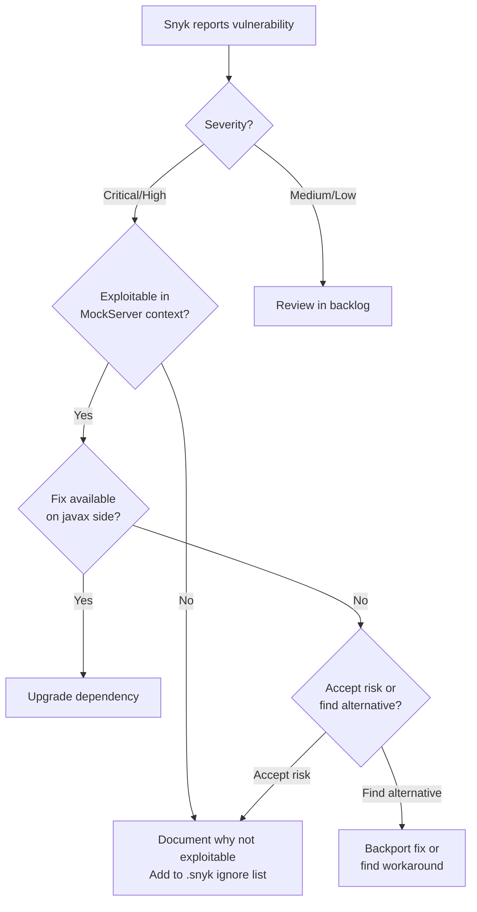

# Snyk Security Scanning

## Overview

MockServer uses [Snyk](https://snyk.io) for continuous security vulnerability scanning of Maven dependencies. Snyk automatically scans pull requests and reports vulnerabilities before they are merged.

## ⚠️ javax / jakarta Compatibility Constraint

**Critical limitation:** MockServer targets Java 17 as the minimum supported JVM version, but the codebase still uses the `javax` namespace throughout. The `javax`→`jakarta` migration is a separate planned step. Until it lands, many security vulnerability fixes that ship only on the `jakarta` side of the split are unavailable.

### Consequence: Blocked Security Fixes

Many modern dependency versions ship only against the `jakarta` namespace:
- ❌ Spring Framework 6.x (uses `jakarta`)
- ❌ Spring Boot 3.x (uses `jakarta`)
- ❌ Jetty 10.x/12.x (uses `jakarta`)
- ❌ Jakarta EE 9+ (`javax`→`jakarta` namespace migration)
- ❌ OkHttp 5.x (also depends on the jakarta-side ecosystem)

**Most outstanding Snyk vulnerabilities in MockServer are due to this constraint.** The vulnerabilities cannot be fixed without first scheduling the `javax`→`jakarta` migration.

### Mitigation

- Most vulnerable dependencies are **test-only** (`mockserver-examples`, `mockserver-spring-test-listener`)
- Not shipped in production artifacts (`mockserver-netty` JAR, Docker images)
- All vulnerabilities are tracked in the `.snyk` policy file with documented reasons
- Expiration dates trigger periodic review (currently: 2026-08-11)

## Integration Points

### PR Status Checks

Snyk runs automatically on all pull requests via two integrations:

1. **`security/snyk (mockserver)`** - Scans against the `mockserver` organization
2. **`security/snyk (jamesdbloom)`** - Scans against the personal organization

Both checks must pass for a PR to be merged. Results are visible in the PR status checks with links to detailed reports on app.snyk.io.

### Web Dashboard

**URL:** https://app.snyk.io/org/mockserver/projects

The Snyk dashboard provides:
- Real-time vulnerability monitoring across all Maven modules
- Severity ratings (Critical, High, Medium, Low)
- Remediation guidance
- License compliance information

## Snyk CLI

### Installation

The Snyk CLI is already installed via Homebrew:

```bash
snyk --version
```

### Authentication

Snyk CLI uses OAuth for authentication:

```bash
snyk auth
```

This opens a browser window for authentication. The CLI stores credentials securely in the system keychain.

### Running Scans Locally

#### Scan all Maven modules

```bash
snyk test --maven-aggregate-project
```

#### Scan main project only

```bash
snyk test --file=pom.xml --package-manager=maven
```

#### Generate JSON output for analysis

```bash
snyk test --maven-aggregate-project --json > snyk-report.json
```

#### Monitor project (upload to Snyk dashboard)

```bash
snyk monitor --maven-aggregate-project
```

### Common Commands

| Command | Description |
|---------|-------------|
| `snyk test` | Test for vulnerabilities |
| `snyk monitor` | Upload snapshot to Snyk for continuous monitoring |
| `snyk test --severity-threshold=high` | Only fail on high/critical severity |
| `snyk test -d` | Debug mode (verbose output) |
| `snyk ignore --id=SNYK-JAVA-...` | Ignore a specific vulnerability |

## Vulnerability Triage

### Compatibility Constraints

**Critical constraint:** MockServer runs on Java 17+ but the codebase still uses the `javax` namespace throughout. Until the `javax`→`jakarta` migration is scheduled and landed, the following upgrades are blocked:

- **Spring Framework 6.x** (uses `jakarta` namespace; current: 5.3.39)
- **Spring Boot 3.x** (requires Spring 6; current: 2.7.18)
- **Jetty 10+/12+** (uses `jakarta` namespace; current: 9.4.58)
- **Jakarta EE 9+** (the `javax`→`jakarta` namespace migration itself)

### Vulnerability Categories

Snyk reports vulnerabilities in several categories. Prioritize based on:

1. **Severity** (Critical > High > Medium > Low)
2. **Exploitability** (Is the vulnerable code path actually used in MockServer?)
3. **Remediation path** (Can we upgrade while staying on the `javax` namespace?)

### Decision Tree



### Current Status (as of May 2026)

**Modules with vulnerabilities:**
- `mockserver-spring-test-listener`: 8 issues (Spring Framework 5.3.39)
- `mockserver-examples`: 28 issues (Spring Boot 2.7.18, Jetty 9.4.58, OkHttp 4.12.0)

**All other modules:** ✅ No known vulnerabilities

**Blocked upgrades pending the javax→jakarta migration:**
- Spring Framework 5.3.39 → 6.x (uses `jakarta`)
- Spring Boot 2.7.18 → 3.x (requires Spring 6)
- Jetty 9.4.58 → 10+/12+ (uses `jakarta`)

### Jetty Critical Vulnerability (HTTP Request Smuggling)

**Issue:** Jetty 9.4.58 has a critical HTTP Request Smuggling vulnerability (SNYK-JAVA-ORGECLIPSEJETTY-16061843)

**Status:** Jetty 9.4.x is end-of-life. The fix is only available in Jetty 12.x, which uses the `jakarta` namespace.

**Impact in MockServer:** Jetty is only used in test dependencies (`mockserver-examples`), not in production runtime. The vulnerability does not affect MockServer's core functionality or production deployments.

**Mitigation:** The vulnerable Jetty dependency is isolated to the examples module which is not shipped in production artifacts. Users should not run the examples module in production environments.

## Snyk Policy File

**File:** `.snyk`

MockServer uses a Snyk policy file to document vulnerabilities that cannot be fixed due to the outstanding `javax`→`jakarta` namespace migration.

### Policy Structure

The `.snyk` file contains:
- **Ignore rules** for vulnerabilities where fixes only ship on the `jakarta` side of the split
- **Expiration dates** (currently 2026-08-11) to trigger periodic review
- **Documented reasons** explaining the `javax`/`jakarta` constraint

### Adding New Ignores

To ignore a new vulnerability:

```bash
# Interactive - prompts for reason and expiration
snyk ignore --id=SNYK-JAVA-ORGSPRINGFRAMEWORK-12008931

# Command line - specify all parameters
snyk ignore --id=SNYK-JAVA-ORGSPRINGFRAMEWORK-12008931 \
  --reason="Spring 6.x required for fix, but Spring 6.x uses the jakarta namespace. MockServer still uses javax." \
  --expires="2026-08-11"
```

Or manually edit the `.snyk` file following the existing format.

### Testing with Policy

```bash
# Test with policy file (default location: .snyk)
snyk test --maven-aggregate-project

# Specify custom policy location
snyk test --policy-path=.snyk
```

### Policy Review Process

The expiration dates in the policy file trigger automatic Snyk notifications when they approach. This ensures:
- Regular review of ignored vulnerabilities
- Re-evaluation when the javax→jakarta migration is scheduled
- Updates when backports become available

## Integration with Dependabot

Snyk and Dependabot work together:

1. **Dependabot** proposes dependency upgrades (automated PRs)
2. **Snyk** scans the PRs for new/resolved vulnerabilities
3. Both checks must pass before merge

For upgrades that force the `jakarta` namespace, both Snyk and manual review will reject the PR until the javax→jakarta migration is scheduled.

## GitHub Actions Integration

Snyk checks run automatically via GitHub's built-in Snyk integration. No custom workflow is required. The integration is configured at the organization/repository level in GitHub settings.

## Next Steps

1. **Regular monitoring:** Review Snyk dashboard monthly for new vulnerabilities
2. **javax→jakarta migration:** Schedule the namespace migration (enables Spring 6.x, Jetty 12, etc.); see `docs/plans/java-17-migration.md` for scope
3. **Backport evaluation:** For critical vulnerabilities, evaluate if backports or workarounds exist on the `javax` side

## References

- Snyk CLI documentation: https://docs.snyk.io/snyk-cli
- Snyk Maven documentation: https://docs.snyk.io/scan-using-snyk/supported-languages-and-frameworks/java-and-kotlin
- MockServer Java compatibility policy: `AGENTS.md`
