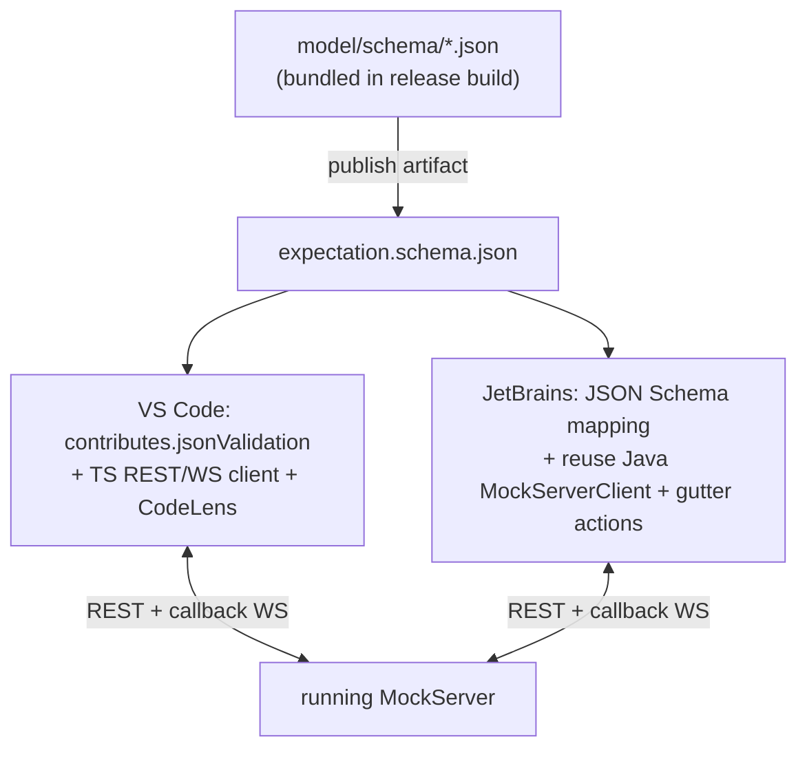
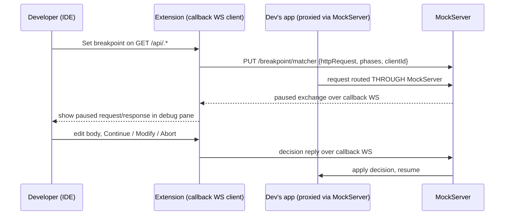

# Editor Extensions Value Roadmap (VS Code & JetBrains)

**Status:** Design spec — for review before implementation. Author: design
session 2026-06-16; revised after a three-lens adversarial review the same day
(correctness, missed-opportunity, and value/sequencing fact-checks against the
codebase).

## TL;DR — the decision

Today the VS Code (~234 LoC) and JetBrains (~140 LoC) extensions are **Docker
launchers with a dashboard link** — every feature they expose (`start`, `stop`,
`openDashboard`, three JSON snippets) is a `docker run` and a browser tab away.
They earn nothing over the CLI.

To make them valuable we move them into the loops a developer is already in —
**authoring, testing, debugging** — and do the things the CLI *structurally
cannot*: validate expectations against a schema as you type, **generate
expectations from the contract file already open in the editor**, **record real
upstream traffic straight into the repo as code**, surface drift and agent
call-graphs inline, and (for the narrower interactive audience) pause
proxied traffic in a debugger pane.

Two decisions from the review shape the architecture:

- **No Language Server.** Both editors' built-in JSON Schema engines give
  validation + completion + hover for free from a published schema. An LSP buys
  nothing for JSON authoring, adds a process and a JetBrains blocker (the IntelliJ
  LSP API is Ultimate-only; our plugin targets **Community**), and lengthens
  time-to-first-value. The single genuinely shared asset is a **published JSON
  Schema**, not a shared process.
- **Invert the value sequencing.** The flagship is **record-to-code** (reaches
  every user regardless of how they author) and **contract→stub generation**, not
  the in-IDE debugger. The debugger is a real differentiator for a *narrow*
  interactive-proxy audience and ships later, scoped honestly.

## Why the current extensions add no value

| Extension | LoC | Commands / actions | Language features | Talks to server via |
|-----------|-----|--------------------|-------------------|---------------------|
| VS Code (published, manifest 7.1.0) | ~234 | `mockserver.start`, `mockserver.stop`, `mockserver.openDashboard` + 3 snippets | none | `docker` CLI, hardcoded `mockserver-vscode` container |
| JetBrains (scaffold, manifest 7.1.0) | ~140 | `MockServer.StartDocker`, `MockServer.OpenDashboard` + tool window | none | `docker` CLI, hardcoded `mockserver-ide` container |

Neither uses a schema for validation/completion, neither reads logs, neither
touches the user's code. Known defects to fix in passing: the Docker image tag is
hardcoded to `7.0.0` in both `mockserver-vscode/src/extension.ts` and
`mockserver-jetbrains/.../StartDockerAction.kt` while the manifests are `7.1.0`;
container name, port, and image are all hardcoded; a stale `mockserver-7.0.1.vsix`
is checked in.

**The test of a worthwhile editor feature:** could the user do it just as easily
from a terminal? If yes, it doesn't belong here. Schema validation, "generate from
the file under my cursor," "record this into a file at the cursor," gutter icons,
and inline drift quick-fixes all fail that test for the CLI — which is why they
belong in the editor.

## Who the user actually is (and why that reorders the plan)

The dominant MockServer usage is a **standalone mock returning canned responses
inside automated tests** — JUnit rule, JUnit 5 `@MockServerSettings`, Spring
`@MockServerTest`, Testcontainers `MockServerContainer` (see
`docs/code/client-and-integrations.md`). Those users:

- author expectations mostly **in client code** (`mockServerClient.when(...)`),
  not in standalone JSON files;
- never route live traffic through MockServer as a proxy, so they never hit a
  breakpoint;
- live the loop "write expectation in test → run test → read failure."

A secondary audience uses MockServer as an **interactive proxy** and hand-writes
JSON expectation files (the `initializationJson` / file-glob path). The debugger
and JSON-authoring features serve *this* group.

Consequence: features that only help JSON-file authors (schema validation, live
diff) or only help proxy users (debugger) each serve a minority. The features that
reach **everyone** are the ones tied to code and to real traffic —
**record-to-code, contract→stub generation, and test/code-aware integration** —
so those lead.

## Assets we already own (so the cheap tier is genuinely cheap)

- **A complete, server-authoritative JSON Schema set** already exists at
  `mockserver/mockserver-core/src/main/resources/org/mockserver/model/schema/`
  (45 files: `expectation.json`, `requestDefinition.json`, `httpResponse.json`,
  `httpForward.json`, `httpLlmResponse.json`, `grpcStreamResponse.json`, …). It is
  the schema the server itself validates against (`JsonSchemaHttpRequestValidator`
  et al.) and is **more complete than the OpenAPI `Expectation` schema** — it
  covers extended actions (LLM, SSE, gRPC streaming, chaos) the OpenAPI omits.
  Note it uses **`anyOf`** for action selection, *not* `oneOf`: the editor must be
  exactly as permissive as the server, or it will flag valid expectations.
  → We **publish this existing schema** (bundled into one self-contained
  `expectation.schema.json` with `$ref`s resolved); we do **not** generate a
  lesser one from the OpenAPI spec.
- **Record/proxy mode** that emits expectations as **Java DSL or JSON**:
  `PUT /mockserver/retrieve?type=recorded_expectations&format=java|json`
  (`HttpState.retrieveRecordedExpectations`). This is the engine for record-to-code.
- **Contract→example generation:** `ExampleBuilder` /
  `OpenApiContractTest.buildExampleRequest()` synthesize representative
  requests/responses from an OpenAPI doc; gRPC descriptors via
  `PUT /mockserver/grpc/descriptors`; `openAPIExpectation` is already a native
  expectation source.
- **Breakpoint callback-WebSocket protocol** — a *frozen contract*
  (`docs/code/breakpoints.md`) implemented by 7 language clients and the dashboard.
  An editor is just one more callback client. The **Java `MockServerClient` already
  implements it** (`addBreakpoint(...)`), so the JetBrains debugger can reuse it
  directly; VS Code implements the same WS protocol in TypeScript.
- **Drift, chaos, and LLM/agent analysis** REST/MCP surfaces (`GET /mockserver/drift`,
  `/mockserver/chaosExperiment`, `AgentRunAnalyzer.buildCallGraph()`).

## Architecture: one shared schema, two native shells — no LSP

- **Validation/completion/hover:** VS Code maps a `*.mockserver.json` glob to the
  published schema via `contributes.jsonValidation`; JetBrains maps it via the
  built-in JSON Schema support (available in Community). Both editors' native JSON
  language services do the rest — no custom language code.
- **Commands & CodeLens:** thin per-editor wiring around REST calls
  (load/verify/diff/generate/record).
- **Live connections (debugger, drift, logs):** native REST/WS clients per editor.
  JetBrains reuses the existing Java client's `addBreakpoint(...)`; VS Code uses a
  small TS client.

**Rejected: a shared TypeScript Language Server.** It earns its keep only for
cross-file semantic analysis or a non-JSON DSL — none of which Tier 1 needs. It is
unusable in IntelliJ **Community** (the plugin targets `platformType=IC`,
`platformVersion=2024.3`, `sinceBuild=243`; the LSP `LspServerSupportProvider` API
is Ultimate-only), and it would only ever serve the JSON-authoring minority at the
cost of an extra process and slower time-to-first-value. The shared asset is the
**schema artifact**, not a server.

## Tier 1 — Author against what you already have (broad, cheap, first)

**Goal:** make the editor understand MockServer artifacts and turn the files the
user *already has open* into expectations.

| Feature | What it does | Beats CLI because | Effort |
|---------|--------------|-------------------|--------|
| Schema validation/completion/hover | Inline squiggles, autocomplete, hover docs on `*.mockserver.json` from the published schema | No feedback from CLI until you POST and get a 400 | tiny (built-in `jsonValidation`) |
| **Contract→stub generation** | Right-click an OpenAPI/proto/GraphQL/AsyncAPI doc, or CodeLens above an operation → generate expectation stubs (JSON or Java) into the workspace, then "load into running server" | The spec file *is* the open tab; CLI means hand-feeding paths | medium |
| Scratch-request REST client | `.http`-style file with "▶ Send to mock" + overlay "did this match, and if not, why" (nearest-miss diff) | `curl` can't show the match/no-match reasoning inline | medium |
| CodeLens / gutter actions | Above each expectation: `Load into running server`, `Verify`, `Diff against live`, `Delete` | One click vs hand-built `curl` | small |
| Template gallery + collection import | Searchable expectation templates (chaos/SSE/gRPC/MCP/LLM); import Postman/Bruno/HAR → expectations | Snippet insertion + one-click migration land files in the workspace | small–medium |

**Why first:** schema validation is days of work (no LSP); contract→stub
generation and the scratch client reach users regardless of how they author and
prove the REST control-plane client that everything later builds on.

## Tier 2 — Connect mocks to real code and real traffic (the flagship)

**Goal:** the broad, high-ROI integration that reaches every user.

- **Record-to-code (flagship).** Run in proxy/record mode, capture real upstream
  traffic, and **write expectation stubs into the repo** — JSON files or Java DSL
  inserted at the cursor — via
  `retrieve?type=recorded_expectations&format=java|json`. "Record real HTTP → drop
  into my test" is the perennial top request for every mocking tool and is
  agnostic to how the user otherwise authors.
- **Drift diagnostics + quick-fix.** While proxying, decorate stub expectations in
  the workspace with drift warnings ("upstream now returns `$.newField` your stub
  omits", severity-coded BREAKING/WARNING/INFORMATIONAL) from
  `GET /mockserver/drift`, mapping each `DriftRecord.expectationId` back to the
  exact JSON node, with a lightbulb "update stub to match." Per-stub, per-file —
  pure IDE territory; from the CLI it's an untraceable JSON list.
- **Test/code-aware integration.** Detect `new MockServerClient(...)`,
  `mockServerClient.when(...)`, `@MockServerSettings`, Testcontainers
  `MockServerContainer`; show run/debug gutter icons, auto-attach the log view to
  that instance, and on a JUnit failure link the assertion to the unmatched request
  and *why* it didn't match. (Navigate-from-test-to-expectation is a lower-priority
  nicety — per-language AST work for a small payoff; don't let it gate the tier.)

## Tier 3 — Power-user surfaces (narrower audience, later)

Real differentiators, but each serves a narrower slice — sequenced after the broad
wins.

- **In-IDE HTTP debugger (scoped honestly).** Surface MockServer breakpoints as a
  debug pane: pause a matched exchange, inspect, **Modify / Continue / Abort**
  (Abort is **REQUEST-phase only**; RESPONSE phase is Continue/Modify),
  then resume — over the frozen callback WS.
  **Prerequisite, stated up front:** breakpoints fire **only on traffic flowing
  through MockServer** — proxied/forwarded exchanges, matched mock responses, and
  the unmatched-404 path. The developer must point their app at MockServer as a
  proxy or mock endpoint first. This is **not** a JVM-style attach to an arbitrary
  process. Ship REQUEST/RESPONSE pause/inspect/modify first; treat per-frame stream
  editing (RESPONSE_STREAM/INBOUND_STREAM Continue/Modify/Drop/Inject/Close) as a
  later increment, not part of "debugger complete." Honour the server safety rails
  as-is (`breakpointTimeoutMillis` 30s, `breakpointMaxHeld` 50, disconnect cleanup).

- **LLM / agent mocking authoring + call-graph.** Completion-aware editing of
  `httpLlmResponse` (provider/model completion, conversation-turn scaffolding via
  `LlmConversationBuilder`) and rendering the agent-run **call graph** inline as
  Mermaid (from `AgentRunAnalyzer.buildCallGraph()`, the same graph the dashboard
  draws) next to the failing test. MockServer's biggest 2026 differentiator and a
  natural IDE fit for agent developers.
- **Chaos experiment panel.** Toggle service/gRPC/LLM chaos and run multi-stage
  experiments with a live status readout (stage index, remaining ms, auto-halt
  state) from `GET /mockserver/chaosExperiment`; CodeLens to attach a `chaos`
  profile to the expectation under the cursor.
- **Contract-test / resiliency runner** (`run_contract_test`,
  `run_resiliency_test`, `verify_traffic_against_openapi`) with per-operation
  pass/fail decorations on the spec file — a test-explorer experience over the
  OpenAPI conformance suite.
- **WASM custom-rule authoring** (build → `PUT /mockserver/wasm/modules` → "test
  this module against a sample body"): niche, opt-in, latest.

## Phased roadmap

| Phase | Outcome | Risk class |
|-------|---------|------------|
| 0 | Fix image-tag drift; make container/port/image configurable (incl. multiple named instances); remove stale `.vsix` | act-autonomously |
| 1 | Publish the bundled `expectation.schema.json` as a release artifact; wire `jsonValidation` (VS Code) + JSON Schema mapping (JetBrains) | gated-approval (release-pipeline change) |
| 2 | Contract→stub generation; scratch-request client; CodeLens load/verify/diff | act-autonomously |
| 3 | **Record-to-code** (flagship) | act-autonomously |
| 4 | Drift diagnostics + quick-fix; test/code-aware gutter integration | act-autonomously |
| 5 | Debugger (REQUEST/RESPONSE pause/inspect/modify), scoped per the prerequisite above | act-autonomously |
| 6 | LLM authoring + call-graph; chaos panel; contract/resiliency runner | act-autonomously |
| 7 | Stream-frame breakpoint editing; WASM authoring; trace correlation | act-autonomously |

Ship the **Phase 1 schema-validation slice first** as the smallest real proof, then
**record-to-code** as the feature that makes users say "now I need this."

## Cut / deprioritized (with reasons)

- **Bidirectional sync (dashboard edits → workspace file): cut.** Creates a
  two-master consistency problem (file vs live server vs dashboard), invites
  conflicts under parallel sessions, and contradicts "repo is canonical." Keep
  **one-way** only: file → server, plus an explicit "pull current server state into
  a new file."
- **Docked log panel that "replaces the dashboard": demote to link-out.** Rebuilding
  the dashboard inside the editor is the second-dashboard anti-pattern. Show a
  focused log/verification view for the current instance; link out for the rest.
- **"Live diff file vs registered" as a headline item: demote.** Fine as a
  secondary action, but drift (real upstream vs stub, with severity + quick-fix) is
  the diff that matters; don't let live-diff compete for Tier-1 attention.
- **Stream-frame per-frame editing: defer to Phase 7.** Deep effort, thin slice of
  an already-narrow debugger audience.
- **Navigate-to-expectation: keep but low.** Per-language AST work, small payoff.

## Risks and trade-offs

- **Maintenance reality.** This is two extensions across two marketplaces, plus a
  debugger UI in two native idioms — for code that today totals ~374 LoC with no
  evident dedicated maintainer. The schema artifact and REST/WS protocol are shared;
  the debugger and code-aware UI are inherently **per-editor** and are the bulk of
  the effort. Sequencing the broad/cheap tiers first limits exposure if resourcing
  is thin: Phases 0–3 are independently valuable and can be the whole deliverable.
- **Schema bundling.** The `model/schema/*.json` set uses internal `$ref`s; the
  release step must bundle them into one self-contained schema and keep `anyOf`
  semantics so the editor is exactly as permissive as the server.
- **JetBrains LSP path is out** (Community + Ultimate-only API) — already designed
  around via built-in JSON Schema support and reuse of the Java client.
- **No SaaS / local-first** holds throughout — everything talks to a
  local/configured MockServer; nothing phones home.

## Appendix — verified references

- Existing JSON Schemas (publish these; do **not** generate from OpenAPI):
  `mockserver/mockserver-core/src/main/resources/org/mockserver/model/schema/`
  (`expectation.json` uses `anyOf`; covers extended actions).
- Record-to-code: `HttpState.retrieveRecordedExpectations`;
  `retrieve?type=recorded_expectations&format=java|json` (OpenAPI yaml `format`
  enum `["java","json","log_entries"]`).
- Contract generation: `ExampleBuilder`,
  `OpenApiContractTest.buildExampleRequest()`, `OpenApiResiliencyTest`,
  `OpenApiTrafficValidator`; gRPC `PUT /mockserver/grpc/descriptors`.
- Breakpoints (debugger): `docs/code/breakpoints.md` — matcher endpoints, callback
  WS, `PausedStreamFrameDTO`/`StreamFrameDecisionDTO`, safety rails; Java client
  `MockServerClient.addBreakpoint(...)`. **Breakpoints fire only on
  proxied/forwarded/matched-mock traffic** (breakpoints.md lines 1–13, 24–29).
- Drift: `GET /mockserver/drift`, `DriftAnalyzer`/`DriftStore`, `SemanticSeverity`
  (`docs/code/drift-detection.md`).
- LLM/agent: `AgentRunAnalyzer.buildCallGraph()`, `mockserver-ui/src/lib/callGraph.ts`,
  MCP tools (`docs/code/llm-mocking.md`).
- Chaos: `GET /mockserver/chaosExperiment`, `ChaosExperimentOrchestrator`
  (`docs/code/chaos.md`).
- JetBrains platform target: `mockserver-jetbrains/gradle.properties`
  (`platformType=IC`, `platformVersion=2024.3`, `sinceBuild=243`) — LSP API is
  Ultimate-only, hence no LSP.
- Extension sources: `mockserver-vscode/` (package.json, `src/extension.ts`,
  `snippets/expectation.json`), `mockserver-jetbrains/`
  (`META-INF/plugin.xml`, `build.gradle.kts`, `StartDockerAction.kt`).
