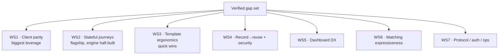

# MockServer Feature-Gap Roadmap

**Status:** Design spec — verified against the codebase, for review before
implementation. Author: analysis session 2026-06-16. Every item below was
checked against actual source (not docs); a first-pass list of ~80 candidate
gaps was reduced to the verified set here, and the claims that turned out to be
**already implemented** are recorded in the appendix so we don't build them
twice.

## TL;DR — the decision

MockServer is already very complete (LLM mocking, MCP, chaos, breakpoints, drift
detection, WASM rules, OpenAPI/WSDL import, gRPC, GraphQL, Pact export, clustered
state, blob stores, HTTP/3, 8 language clients). So the highest-value work is
**not new protocols** — it is **closing parity gaps and connecting capabilities
that half-exist**. Two findings dominate:

1. **The Java client is far ahead of the other seven clients.** Every recent
   feature lands in Java only, widening the gap each release.
2. **Stateful "journey" mocking exists in the engine but isn't wired up for
   users** — `ScenarioManager` has full state, but templates can't read or write
   it, and there are no declarative capture rules.

The recommended order of attack is the seven workstreams below. If we only do
five things, do **WS1 (client response-builder parity), WS2 (scenario state +
capture in templates), WS3 (Faker + helper ergonomics), WS4.2 (redaction at
import), and WS5.1 (inline edit/duplicate in the dashboard)** — they are the best
value-to-effort and several are nearly free.

## How to read the priority

| Priority | Meaning |
|----------|---------|
| **P0** | High value, low/medium effort, mostly reuses existing infra — do first |
| **P1** | High value but larger, or medium value and cheap |
| **P2** | Real but narrower audience or large effort — schedule deliberately |

Effort: **S** ≈ ≤2 days, **M** ≈ ~1 week, **L** ≈ multi-week.

---

## WS1 — Client feature parity (highest leverage)

**Finding:** all 8 clients (Java, Node, Python, Ruby, Go, Rust, .NET, PHP) are
**full clients** for core mocking/verification/forwarding — none are thin. But
advanced surface is lopsided:

| Capability | Java | Node | Python | Ruby | Go | Rust | .NET | PHP |
|---|:--:|:--:|:--:|:--:|:--:|:--:|:--:|:--:|
| Core CRUD / forward / verify | ✓ | ✓ | ✓ | ✓ | ✓ | ✓ | ✓ | ✓ |
| `verifyZeroInteractions` | ✓ | ✓ | ✓ | ✓ | ✗ | ✗ | ✗ | ✗ |
| OpenAPI import | ✓ | ✓ | ✓ | ✓ | ✗ | ✗ | ✗ | ✗ |
| SSE / WebSocket / DNS / binary / gRPC-stream response builders | ✓ | ✓ | ✓ | ✓ | ✗ | ✗ | ✗ | ✗ |
| gRPC descriptor upload | ✓ | ✗ | ✗ | ✗ | ✗ | ✗ | ✗ | ✗ |
| LLM builders (`Llm`/conversation/failover/mock) | ✓ | ✗ | ✗ | ✗ | ✗ | ✗ | ✗ | ✗ |
| MCP builder (`McpMockBuilder`) | ✓ | ✗ | ✗ | ✗ | ✗ | ✗ | ✗ | ✗ |

### WS1.1 — Advanced response builders for Go/Rust/.NET/PHP — **P0, S each**
Add `respondWithSse` / `respondWithWebSocket` / `respondWithDns` /
`respondWithBinary` / `respondWithGrpcStream` plus `openAPIExpectation` and
`verifyZeroInteractions` to the four clients that lack them. These are thin
serializer additions — the server already accepts the payloads; Java/Python/Ruby/
Node are the reference implementations.

### WS1.2 — gRPC descriptor upload everywhere — **P1, M**
`uploadGrpcDescriptor` / retrieve gRPC services is Java-only
(`MockServerClient.java`). Port to all 7. Blocks non-Java users from gRPC schema
matching.

### WS1.3 — LLM + MCP builders beyond Java — **P1, L**
The `Llm*` and `McpMockBuilder` families are Java-only and large. Prioritise
**Python and Node first** (the AI-tooling audience). Treat as a fluent-builder
port, not new server work — the endpoints exist.

**Governance:** add a **client capability matrix** to the release checklist so a
new server feature can't ship Java-only without an explicit parity decision.
Position Go/Rust/.NET/PHP in docs as "production-grade core clients; advanced
response types and OpenAPI import are on the parity roadmap."

---

## WS2 — Stateful journeys & dynamic responses (flagship)

This is the WireMock-"scenarios" capability. The engine pieces exist but are
**disconnected from the user-facing template/expectation layer**.

### WS2.1 — Scenario state accessible from templates — **P0, M**
`ScenarioManager` (`mockserver-core/.../mock/ScenarioManager.java`) has full
`getState`/`setState`/`matchesState`, but `VelocityTemplateEngine` only injects
`request` and `response` into the context — **no state accessor**. Add a
`state`/`scenario` helper to the template context (all three engines: Velocity,
JS, Mustache) so a response template can read and mutate scenario state.

*Unlocks:* multi-turn flows where a later response depends on an earlier one.

### WS2.2 — Declarative capture rules — **P0/P1, M (flagship)**
No mechanism to extract a value from a request (JSONPath/XPath/header) and store
it for later reference. Add a `capture` block to expectations:
`capture: [{ from: "$.userId", into: "userId" }]` → stored in scenario state →
referenced via WS2.1 in subsequent responses. Builds directly on WS2.1.

*Unlocks:* realistic auth → resource → confirm journeys, the single most-
requested "stateful mock" pattern.

### WS2.3 — Dynamic latency from request payload — **P2, M**
`Delay` supports only static values / distributions; nothing computes delay from
request size or content. Allow a template-driven delay expression so e.g. larger
payloads respond slower.

### WS2.4 — Conditional / chainable response modifiers — **P2, M**
`HttpResponseModifier` applies header/cookie edits independently — no `if/else`,
no "modifier B sees modifier A's output." Add conditional + ordered-chain
semantics for forward-and-mutate flows. (Note: response *templates* already see
both request and response; this is specifically for the declarative modifier
path.)

### WS2.5 — JSON Patch / JSON Merge Patch on forwarded responses — **P2, M**
Today you either pass the upstream body through or replace it wholesale. Add RFC
6902 / RFC 7386 patching so you can change one field of a real upstream response.

### WS2.6 — gRPC bidi-stream templating + state — **P2, M**
`GrpcBidiRule` responses are a static `List<GrpcStreamMessage>` — no templating,
no scenario-state transition on inbound match. Bring it up to parity with the
HTTP path once WS2.1 lands.

> **Do not build:** sequential/cycling responses — already present
> (`Expectation.httpResponses` + `ResponseMode.SEQUENTIAL/RANDOM`).

---

## WS3 — Template & test-data ergonomics (quick wins)

### WS3.1 — Faker helper wrapper + docs — **P0, S**
`net.datafaker.Faker` is registered raw as `faker` in `TemplateFunctions.java`
with **no wrapper and no docs** — users don't know they can generate names,
addresses, UUIDs, etc. Add a small `FakerTemplateHelper` with discoverable
methods and document it. Highest delight-per-effort item in the whole roadmap.

### WS3.2 — Missing template helpers — **P1, S–M**
Current helpers: Date, Json, Jwt, Math, String. **Absent:** crypto/hashing
(SHA-256/HMAC), regex, CSV, XML/XPath, HTML-escape, YAML. Add as new helper
classes registered in `TemplateFunctions`. Crypto/HMAC and regex are the most
requested.

### WS3.3 — Per-field OpenAPI example override — **P2, S**
Generation is **already deterministic** (`SampleDataGenerator` uses fixed seed
42 — the earlier "non-deterministic" claim was wrong). The real gap is no way to
pin a specific field (`userId` → `"system-user-123"`) or supply a per-request
seed. Add field-override + optional seed parameters to `ExampleBuilder`.

---

## WS4 — Record → reuse workflow & import security

### WS4.1 — CLI + Java-client import/export convenience — **P1, S**
`PUT /mockserver/import` (HAR/Postman) exists, but there's **no CLI subcommand**
(`Main.java` has run/ui/proxy/openapi/version only) and **no `MockServerClient`
import/export methods**. Add `mockserver import <file>` and typed client methods
wrapping the existing endpoints.

### WS4.2 — Redaction at import time — **P0, S (security win)**
`FixtureRedactor` exists and is fully built, but `HarImporter` and
`PostmanCollectionImporter` **never call it** — importing a Postman collection
writes real `Authorization` / API-key headers verbatim into expectations. Wire
the redactor into the import path with a configurable header/field list. Small,
high-value, security-relevant.

### WS4.3 — Smart dedup / templatization of recorded traffic — **P1, M**
Recorded traffic is stored verbatim — 50 calls to `/users/{id}` become 50
expectations instead of one templated matcher. Add path/ID templatization +
fingerprint dedup over recorded entries (net-new heuristic layer).

### WS4.4 — Baseline / snapshot response diffing — **P2, M**
`TrafficDiffEngine` diffs **requests only** (for mismatch diagnostics). Add
response structural diffing + a baseline-compare endpoint so CI can fail when
recorded traffic shape drifts from a committed baseline.

### WS4.5 — Pact import + provider verification — **P2, M–L**
Pact today is **export + consumer-verify only**. Add a Pact importer (generate
expectations from a contract, mapping Pact matchers → MockServer matchers) and,
larger, provider-state callbacks + Pact Broker integration.

### WS4.6 — Spec import breadth: AsyncAPI / GraphQL / raw `.proto` — **P2, M**
Only OpenAPI + WSDL + compiled gRPC descriptors import today. The AsyncAPI parser
already exists in `mockserver-async` but isn't wired to an import route. Add
import endpoints; `.proto` would need a compile step.

### WS4.7 — Consumer SDK code generation — **P2, L**
`ExpectationToJavaSerializer` emits MockServer DSL, not consumer client SDKs.
Generating typed HTTP clients from OpenAPI is a large, separable initiative —
flag as "evaluate vs. just recommending openapi-generator" before committing.

---

## WS5 — Dashboard developer experience

### WS5.1 — Dashboard→Composer "Edit" deep-link + Duplicate — **P2, S**
**Corrected after code review — the editing experience is already good.** The
Composer has an `ExistingMocksList` (`ComposerView.tsx:3050`): a scrollable,
click-to-select list of existing expectations **scoped to the selected kind**,
each shown as `id-short + summary`. Selecting one (`handleLoadExisting`,
line 3319) fully repopulates the form — matcher, action, chaos, side-effects,
steps pipeline — shows an "Editing {id}…" banner, and offers a "New / clear"
button. So editing is a **select-from-list flow, not copy-paste** (the ID-paste
placeholder at line 351 is only a secondary path). The earlier "must copy an ID"
framing was wrong.

The only residual gap is a **convenience**: that list lives in the Composer tab,
while the Dashboard's Active Expectations panel (`ExpectationPanel.tsx`) is
read-only, so editing means switching tabs and re-finding the item. Optional
polish: an **Edit** (and **Duplicate**) action on each Dashboard expectation card
that deep-links into the Composer with that mock pre-selected. Small, marginal —
not a priority.

### WS5.2 — One-click "create expectation from request" for standard HTTP — **P1, M**
`CaptureAsMockDialog` exists but `isCapturableTraffic()` enables it **only for
LLM traffic**. Extend the capture flow to standard HTTP rows in the Traffic
Inspector.

### WS5.3 — Wire the visual diff into mismatch analysis — **P1, M**
`DiffPanel.tsx` (structured field/expected/actual table) exists but is only used
for two captured requests; `DebugMismatchDialog` is text-only. Wire `DiffPanel`
into the unmatched-request flow for a visual "what you sent vs what the matcher
wanted" diff.

### WS5.4 — Richer request filtering — **P1, S–M**
`FilterPanel` supports exact-match + negation only. Add regex, body-content
filter, and saved filter presets (`RequestFilter` type extension).

### WS5.5 — Matcher testing playground — **P2, M**
No way to test a matcher against a hypothetical request before registering it.
Add a "test this expectation" panel to the Composer.

### WS5.6 — Broaden config hot-reload in the UI — **P2, M**
`PUT /mockserver/configuration` already applies many properties server-side, but
the dashboard exposes only ~12 of ~170 (`EDITABLE_PROPERTIES`). Expand the
editable set (those that genuinely take effect at runtime) and mark the rest
explicitly restart-only.

### WS5.7 — Expectation priority visualization — **P2, S**
Priority is stored but never shown. Add a priority column / sort so users can see
match order. (Also embedded OpenAPI/Swagger explorer view — P2, M — if there's
appetite.)

> **Do not build:** dark mode — already fully implemented (`theme.ts` + store).

---

## WS6 — Matching expressiveness

After verification, several first-pass "gaps" were wrong and are **dropped**:
JSONPath value-comparison (Jayway predicates already work), decompressed-vs-raw
body matching (already handled), gRPC field matching (proto→JSON, fields already
matchable as JSON). The verified gaps:

### WS6.1 — Multipart/form-data field matching — **P1, M**
`HttpRequestsPropertiesMatcher` explicitly logs "multipart form data is not
supported on requestBody." Add per-field matching (field present, filename
pattern, value). Common for file-upload endpoints.

### WS6.2 — Numeric comparison operators on header/cookie/query values — **P2, M**
`MultiValueMapMatcher`/`RegexStringMatcher` are exact/regex only — no `>`/`<`/`>=`
on values like `X-Retry-After`. Add a numeric operator matcher form.

### WS6.3 — Accept-header content-negotiation matching — **P2, M**
No parsing of `Accept` q-weights / preference order. Add a content-negotiation
matcher.

### WS6.4 — JSON Schema remote `$ref` allow/deny — **P2, S (security)**
`JsonSchemaMatcher` has no control over remote `$ref` resolution. Add an
allow/deny policy to prevent external schema fetches.

### WS6.5 — Conditional (if-then-else) matcher — **P2, M**
No conditional matcher (AND-only today). Lower priority; capture rules (WS2.2)
cover many of the same use cases.

### WS6.6 — Deterministic fuzzy/similarity body matcher — **P2, S**
Only LLM-based semantic matching (and XMLUnit's XML similarity) exist; no
deterministic non-LLM fuzzy string matcher. Niche.

> Nth-request *pre-match* (vs `VerificationSequence`, which is post-hoc) and
> cross-expectation session-correlation matching are real but narrow — backlog.

---

## WS7 — Protocol, auth & operations completeness

### WS7.1 — OAuth2 authorization-code endpoint — **P1, M**
`OidcProviderGenerator` already implements discovery, JWKS, `/token`,
`/userinfo`, `/introspection`, `/revocation` — but **no `/authorize` endpoint**,
so the interactive authorization-code step can't be mocked end-to-end. Add it to
complete the flow. (The earlier "no OAuth2 at all" framing was too strong.)

### WS7.2 — Graceful shutdown with connection drain — **P1, M**
`LifeCycle.stopAsync()` disconnects channels and calls `shutdownGracefully()` but
does **not** wait for in-flight requests. Add drain-with-timeout for clean
Kubernetes termination.

### WS7.3 — Outbound webhook-on-match (gated after-action) — **P2, M**
`beforeActions`/`afterActions` exist, but after-actions are fire-and-forget and
there's no dedicated "POST to URL after responding" action gated on response
completion. Formalise a webhook after-action.

### WS7.4 — Expectation multi-tenancy / namespacing — **P2, M**
Expectations are a single global registry (CRUD entities have namespaces;
expectations don't). Add a tenant/namespace key to expectation matching for
parallel multi-customer testing.

### WS7.5 — WebSocket flow scripting + SSE event filtering — **P2, M**
`HttpWebSocketResponse` messages are static (matchers allow routing but no state
machine); `HttpSseResponse` events are static with no request-driven filtering.
Add stateful flow scripting (WS) and request-param event selection (SSE).

### WS7.6 — Per-expectation Prometheus labels — **P2, M**
Metrics are global / fault-type-labeled, never per-expectation. Add optional
per-expectation labels for endpoint-level Grafana dashboards.

### WS7.7 — Larger net-new protocols — **P2/backlog, L**
AMQP/RabbitMQ (async module is Kafka+MQTT only), SAML 2.0 mock IdP, gRPC Connect
protocol, HTTP/2 server push. Each is genuinely absent but large and narrower —
schedule only on concrete demand.

> **Do not build:** HTTP rate-limiting (already exists via `HttpChaosProfile`
> quota fields), gRPC server reflection (already implemented, with a documented
> bidi-streaming limitation).

---

## Recommended first slice (the "if we do five things")

| # | Item | WS | Effort | Why |
|---|------|----|--------|-----|
| 1 | Advanced response builders for Go/Rust/.NET/PHP | WS1.1 | S×4 | Closes the most-felt parity gap; pure serializer work |
| 2 | Scenario state in templates | WS2.1 | M | Unblocks the flagship; engine already has the state |
| 3 | Faker wrapper + helper docs (+ crypto/regex helpers) | WS3.1/3.2 | S–M | Highest delight-per-effort; near-free |
| 4 | Redaction at import time | WS4.2 | S | Security fix; redactor already exists, just unwired |
| 5 | One-click "create expectation from request" for standard HTTP | WS5.2 | M | Verified gap (capture exists for LLM traffic only); high-frequency dashboard workflow |

Then: **WS2.2 (capture rules)** as the flagship follow-on, and **WS1.2/1.3**
(gRPC-descriptor + LLM/MCP client parity) as the larger strategic investment.

---

## Appendix A — Claims that turned out to be ALREADY IMPLEMENTED

Recorded so they aren't re-scoped. Verified against source.

| Claim (from first pass) | Reality |
|---|---|
| JSONPath has no value-comparison operators | Jayway predicates already support `$.x[?(@.p>100)]` (`JsonPathMatcher`) |
| No decompressed-vs-raw body matching | Already matches both representations (`HttpRequestPropertiesMatcher`) |
| gRPC has no field-level matching | Proto is converted to JSON; fields are matchable as JSON |
| OpenAPI example generation is non-deterministic | Already seeded (fixed seed 42, `SampleDataGenerator`); only per-field override missing |
| HTTP rate-limiting absent | Already exists via `HttpChaosProfile` quota fields |
| gRPC server reflection unsupported | Implemented (`GrpcServerReflectionHandler`); only full bidi-streaming reflection is limited |
| No server-side config update API | `PUT /mockserver/configuration` exists; gap is dashboard coverage only |
| Sequential/cycling responses missing | Present (`httpResponses` + `ResponseMode`) |
| No dark mode | Fully implemented (`theme.ts` + store) |
| Expectations are read-only in the dashboard | **Claim was wrong.** Composer has a click-to-select `ExistingMocksList` that fully repopulates the form for editing; only a Dashboard→Composer deep-link convenience is missing (WS5.1, downgraded to P2) |

## Appendix B — Method

Six parallel read-only verification passes over `mockserver-core`,
`mockserver-netty`, the eight client libraries, and `mockserver-ui`, each issuing
ABSENT / PARTIAL / ALREADY-EXISTS verdicts with `file:line` evidence against an
initial ~80-candidate list. Items that any pass could not confirm absent were
demoted or dropped. This roadmap contains only verified-present gaps; the larger
net-new protocol items (Appendix WS7.7) are listed but explicitly deprioritised.
