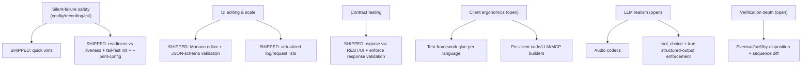

# MockServer Feature-Improvement Roadmap

> Generated 2026-06-18 from an eight-area review of existing features for
> improvements: missing capabilities, features that could be more useful, and
> features that could be easier to work with. Each area was explored against the
> actual code (several "gaps" were verified as already-shipped and dropped).
> Re-audited 2026-06-19 against `origin/master` — a large tranche has since
> shipped and been moved to the Shipped table below.

## TL;DR

MockServer's feature **breadth** is excellent; most recent gaps are closed. As
of the **2026-06-19 re-audit**, four of the original strategic bets have wholly
or largely shipped — silent-failure safety (readiness/liveness, fail-fast init,
`--print-config`), UI editing & scale (Monaco editor + list virtualization),
contract-testing expose & enforce, and the record-to-expectations export flow.
The remaining opportunities now cluster into:

1. **Client ergonomics** — protocol parity is strong; test-framework glue (xUnit/
   Jest/RSpec/Go-`t.Cleanup`) and per-client code/LLM/MCP builders are the gap.
2. **Verification depth** — eventual/timeout, soft/assert-all, by-disposition,
   sequence-diff.
3. **LLM realism** — audio codecs, `tool_choice`, true structured-output
   enforcement, non-OpenAI embeddings, MCP `prompts/*` + `sampling/createMessage`.
4. **Operability** — drift thresholds/webhooks, chaos profile library, richer
   WASM ABI, gRPC example synthesis.

Two tranches of work have **shipped** (see the two Shipped tables below). The
rest of this document is the remaining backlog: **strategic bets** and the full
**per-area opportunity tables**.

## Shipped (2026-06-18)

These landed on `master` (commits `07d0b5ac7` … `2ee5722dc`):

| Item | Commit |
|------|--------|
| Opt-in secret redaction in recorded expectations | `07d0b5ac7` |
| Timestamps on dashboard log entries (UI + serializer) | `8339d86a8` |
| Actionable launcher error when no release bundle (6 clients) | `b3bd08105` |
| Warn on unrecognised configuration keys | `f28906bdf` |
| Configurable default response headers | `1586167f3` |
| Dashboard serializer test follow-up | `f3e9ad203` |

## Shipped (verified 2026-06-19 against `origin/master`)

A second re-audit confirmed the following roadmap items are now implemented on
`master`. Evidence is `file:line` in the current tree.

| Item | Evidence |
|------|----------|
| §1.1 Monaco code editor + JSON-schema validation for request body matchers | `mockserver-ui/src/components/JsonEditor.tsx` (`@monaco-editor/react` + `languages.json.jsonDefaults`), wired in `ComposerView.tsx` via `bodyEditorConfig()` (response body still plain `TextField` — minor follow-up) |
| §1.2 Virtualized log/request lists | `mockserver-ui/src/components/ProgressiveList.tsx` (`@tanstack/react-virtual`), used by `LogPanel.tsx` |
| §1.4 Adaptive tab overflow / "More" menu / hamburger nav | `mockserver-ui/src/components/AppBar.tsx:131-272` (ResizeObserver-driven priority nav over `NAV_TABS`) |
| §2.1 jsonPath/xPath helpers in Velocity & JS templates | `VelocityTemplateEngine.java:171-172` (JsonPathTool/XPathTool), `PolyglotRunner.java:78-85` (jsonPath/xPath JS members) |
| §2.2 Record-to-expectations export flow (OpenAPI/Postman/Bruno) | `HttpState.java:1416-1446` retrieve endpoint + `ExpectationExportSerializer` + `RecordedExpectationPostProcessor.java` |
| §2.4 Weighted/probabilistic response selection (`WEIGHTED` mode) | `ResponseMode.java` (`WEIGHTED`), `Expectation.java:928,943` `selectWeightedResponse()` + `responseWeights` (commit `98f831ea3`) |
| §2.5 Global default response delay | `ConfigurationProperties.java:258,3169-3200` `globalResponseDelayMillis` (commit `a490ff646`) |
| §3.2 Per-upstream proxy metrics + `server.address` span attr | `Metrics.java:398` `observeForwardRequest`, `RequestSpans.java:122-129` `server.address`/`server.port` |
| §4.1 Expose contract test / traffic validator via REST + UI | `HttpState.java` `/mockserver/contractTest`, `mockserver-ui/src/components/ContractTestPanel.tsx`, `OpenApiContractTest.java` |
| §4.2 Enforce (not just log) response validation for mock expectations | `Configuration.java:2060` `enforceResponseValidationForMocks()`, `HttpActionHandler.java:2146` (502 on failure) |
| §4.4 GraphQL SDL/introspection-driven response synthesis | `GraphQLResponseSynthesizer.java`, `GraphQLExpectationGenerator.java` |
| §4.5 Array `minItems`/`pattern`/exclusive-bound constraints in example gen | `ExampleBuilder.java:700-708` `arrayItemCount()` (honours minItems/maxItems), pattern/bound handling |
| §5.3 Testcontainers modules for Go/.NET/Node/Python/Rust | `mockserver-testcontainers/{go,dotnet,node,python,rust}/` (each with src + tests + publishing) |
| §6.1 Scenario state-graph Mermaid visualization | `mockserver-ui/src/components/ScenarioPanel.tsx:167-172,386` `toScenarioMermaid` + `MermaidStateDiagram` |
| §6.2 Cluster status endpoint + dashboard panel + `cluster_members` metric | `HttpState.java:2657` `GET /cluster`, `HttpState.java:230` member-count supplier, `mockserver-ui/src/components/ClusterPanel.tsx` |
| §6.7 Conditional (Nth-hit / skip-count) breakpoints | `BreakpointMatcher.java:43-44,115-125` `skipCount`/`hitCount`/`shouldPause()` (commit `98f831ea3`) |
| §6.8 Quota/match counters routed through `StateBackend` | `HttpState.java:187,206-208` wires quota/chaos registries to `stateBackend` |
| §7.2 `--print-config` effective-config diagnostic (value + source per key) | `ConfigurationProperties.java:4233,4376` `effectiveConfiguration()` + `--print-config` CLI flag in `Main.java` |
| §7.3 Distinct readiness vs liveness Helm probes | `helm/mockserver/templates/deployment.yaml:104-117` (`/mockserver/ready` 503-until-ready vs always-200 `/liveness/probe`) (commit `98f831ea3`) |
| §7.4 Fail-fast on malformed initializers (`failOnInitializationError`) | `ExpectationInitializerLoader.java:84-87` `failFastIfConfigured` + `ExpectationInitializerException` (commit `98f831ea3`) |
| §7.7 Broadened/shared secret redaction (`--print-config` + config diagnostics) | `ConfigurationProperties.java:3865` `isSensitivePropertyName` reused by `effectiveConfigurationAsText()` |
| §8.2 Cached/reasoning token usage fields + refreshed model catalog | `Usage.java:34-36` `cachedInputTokens`/`cacheCreationTokens`/`reasoningTokens`, `LlmPricing.java` current model prices |
| §8.8 Provider-specific LLM overload bodies tied into chaos profiles | `LlmErrorBodies.bodyFor(...)` invoked in chaos error-injection path `HttpLlmResponseActionHandler.java:280` (commit `98f831ea3`) |

## Strategic bets (larger, high-leverage)

The first four bets have shipped (see the Shipped tables). The remaining bets:

| Bet | Why it matters | Anchor evidence |
|-----|----------------|-----------------|
| **Client test-framework glue** | Only Python ships a reusable fixture; no xUnit / Jest / RSpec / Go-`t.Cleanup`. Testcontainers modules now exist for all five languages, but per-client test-helper glue and code/LLM/MCP builders still lag. Pure ergonomics, high adoption payoff. | `mockserver-client-python/tests/conftest.py`; JVM has `MockServerRule`/`MockServerExtension` |
| **Verification depth** | Verification is single-snapshot, throws on first failure, and can't filter by disposition; response-diff shipped but sequence-diff didn't. | `MockServerEventLog.verify`, `MockServerClient.java:1229,1285` |
| **LLM realism** | Image/vision codecs shipped, but no audio, no `tool_choice`, structured-output only validates fail-soft, embeddings OpenAI-only. | `ParsedMessage.java:25-84`, `Completion.java:152-160` |

## Per-area opportunity tables

Effort: S / M / L. Impact: High / Med / Low. Evidence is `file:line` of the
current state. Items already verified as shipped are omitted.

### 1. Dashboard UI usability

| # | Opportunity | Effort | Impact | Evidence |
|---|-------------|--------|--------|----------|
| 1 | Monaco editor for the **response** body too (request body already Monaco) | S | Med | response body still plain `TextField` in `ComposerView.tsx` |
| 3 | Log search: regex + field operators (`status:>=400`) + export filtered set | M | High | `searchMatcher.ts:83,85,95` (substring `.includes` only) |
| 5 | Edit-then-preview-diff for capture-to-mock and Composer | M | Med | `CaptureAsMockDialog.tsx` ("Refine in Composer" only, no diff), `ComposerView.tsx` (code preview, not diff) |
| 6 | Persistent connection-loss banner on sustained WS failure | S | Med | `App.tsx:131-135` (transient alert only), `AppBar.tsx:386-395` (status chip, no sustained-failure banner) |
| 7 | Focus traps + `aria-live` in dialogs/live regions | S-M | Med | `Panel.tsx:78` (no FocusTrap/aria-live), no `aria-live` in `LogPanel.tsx` |

### 2. Core matching & response actions

| # | Opportunity | Effort | Impact | Evidence |
|---|-------------|--------|--------|----------|
| 3 | Bind **regex** capture groups into response context (named path params already exposed) | M | High | `HttpRequestTemplateObject.java:76-78` exposes `pathParameters`; no regex group binding |
| 6 | Lightweight per-expectation hit-count branching (`afterCall(n)`) | M | Med | `Expectation.java:485-563` has ordered `steps`, but no hit-count branching; needs full `ScenarioManager` today |
| 7 | Inline schema-valid response generation without attaching a full OpenAPI spec | M | Med | `SampleDataGenerator` is used only by `ExampleBuilder` (OpenAPI-path only) |

### 3. Proxy / recording / verification

| # | Opportunity | Effort | Impact | Evidence |
|---|-------------|--------|--------|----------|
| 3 | UI view/filter for forwarded/proxy traffic | M | High | `FilterPanel.tsx` (no forwarded filter); `FORWARDED_REQUEST` color exists at `theme.ts:34` but no log-type filter |
| 4 | Eventual / negative-within-timeout verification | M | High | `MockServerEventLog.verify` (single snapshot); `VerificationTimes` has `atMost`/`between` but no timeout |
| 5 | Field-level diff for **sequence** verify failures (response diff now shipped) | M | Med | `buildClosestResponseMatchDiff` wired at `MockServerEventLog.java:772`, but sequence path (`:875-960`) has no field-level diff |
| 6 | Templatize recorded bodies/headers/query, not just id path segments | M | Med | `RecordedExpectationPostProcessor.templatize:219-248` (path segments only) |
| 7 | Soft / collecting verification (assert-all) | S-M | Med | `MockServerClient.java:1229,1285` (throws on first) |
| 8 | Verify-by-disposition (forwarded vs mocked) | S | Med | `MockServerEventLog.java:77-93` predicates exist; `Verification` exposes no disposition filter |
| 9 | Proxy retry / circuit-breaking with metrics (connection pool now exists) | L | Med | `NettyHttpClient.java:55-80` pool present, but `HttpForwardAction.java:40-61` returns `badGatewayFuture()` with no retry / circuit-breaker |

### 4. OpenAPI / spec-driven mocking

| # | Opportunity | Effort | Impact | Evidence |
|---|-------------|--------|--------|----------|
| 3 | Named/multiple-example **UI picker** (backend `exampleName` selection already shipped) | S-M | High | `OpenAPIConverter.java:86-95,233-258` selects named examples; no UI picker widget |
| 6 | Synthesize gRPC example messages from descriptors | M | Med | `grpcDescriptors.ts:29-51` (discovery only) |
| 7 | Auth in generated Postman/Bruno + run generation in CI | S | Med | `generate_collections.py:240` (hardcodes `auth: none`) |
| 8 | Apply request validation + security-requirement checks during mock matching | M | Med | `OpenAPIRequestValidator` invoked only in `validateProxyRequest()` (`HttpActionHandler.java:3135`), not during mock matching |

### 5. Client libraries & integrations

| # | Opportunity | Effort | Impact | Evidence |
|---|-------------|--------|--------|----------|
| 1 | Expose codegen formats (`retrieveAsCode`) from each client (UI-only today) | M | High | Go has only json/log_entries `client.go:503-504`; Node/Python retrieve hardcode `format=JSON` (`mockServerClient.js:1545`, `async_client.py:429`) |
| 2 | Test-framework integration beyond Python (xUnit/Jest/RSpec/Go/PHPUnit) | M | High | only `mockserver-client-python/tests/conftest.py` is a reusable fixture; other clients' test helpers are internal-only |
| 5 | LLM/MCP builders in the other 5 clients (only Python & Node today) | M | Med-High | `llm.py`/`mcp.py`, `llm.js`/`mcpMockBuilder.js`; none in Go/.NET/Rust/Ruby/PHP |
| 6 | Idiomatic auto-cleanup for Go (`t.Cleanup`) & JS (`Symbol.dispose`) — Rust `Drop` already shipped | S | Med | Rust `launcher.rs:795` `impl Drop`; no `t.Cleanup`/`Symbol.dispose` elsewhere |
| 7 | Per-language "use in tests" docs + a capability/parity matrix | S | Med | docs gap |

### 6. Advanced behaviour (chaos / drift / breakpoints / WASM / scenarios / cluster)

| # | Opportunity | Effort | Impact | Evidence |
|---|-------------|--------|--------|----------|
| 3 | Saved chaos **profile library** (multi-stage scheduling already exists) | M | Med | `ChaosExperimentOrchestrator.java` schedules stages, but profiles are ad-hoc with no persisted named-profile store |
| 4 | Drift aggregation + CI fail-threshold + webhook | M | High | `DriftStore.java` flat deque; no threshold/webhook |
| 5 | WASM richer ABI (headers/method/path) + authoring SDK | M | Med-High | `WasmRuntime.java:49-86` (`callMatch(String requestBody)` — body bytes only) |
| 6 | Breakpoint UX: "break on this request" from a log row + structured modify editor | S-M | Med | `BreakpointsPanel.tsx:139-150,365-383` (raw-JSON textarea, no log-row action) |
| 7 | Response-content-conditional breakpoints (Nth-hit / skip-count already shipped) | S | Med | `BreakpointMatcher.java:43-44` has `skipCount`; no response-content condition |

### 7. Deployment / configuration / CLI

| # | Opportunity | Effort | Impact | Evidence |
|---|-------------|--------|--------|----------|
| 5 | First-class `--watch` flag + configurable/instant reload | M | Med | `FileWatcher.java:37` (5s poll, off by default); no `--watch` option in `Main.java` |
| 6 | Quickstart example in `--help` + `mockserver demo` | S | Med | `Main.java` subcommands (run/ui/proxy/openapi/version/help) — no `demo` |

### 8. LLM & AI-protocol mocking

| # | Opportunity | Effort | Impact | Evidence |
|---|-------------|--------|--------|----------|
| 1 | **Audio** request+response codecs (image/vision parts already shipped) | S-M | High | `ParsedMessage.java:25-84` has `ImagePart`/`getImages`; no audio content parts |
| 3 | `tool_choice` / forced-tool realism (request match + honoured) | M | High | `Completion.java` has `toolCalls` only, no `tool_choice`/finish-reason coupling |
| 4 | Structured-output enforcement (true JSON-schema mode, not fail-soft) | M | High | `Completion.java:152-160` `outputSchema` validate-only (warning, non-blocking) |
| 5 | Embeddings beyond OpenAI + rerank endpoints | M | Med-High | Gemini/Bedrock/Ollama embedding codecs throw `UnsupportedOperationException`; no rerank codec |
| 6 | MCP `prompts/*` + `sampling/createMessage` (notifications already shipped) | M | Med-High | `McpRequestProcessor.java` has `notifications/*`; no `prompts/list`, `prompts/get`, `sampling/createMessage` |
| 7 | Agent-framework recipes (LangChain/LlamaIndex/OpenAI-Agents) | M | Med | raw-HTTP only |
| 9 | A2A streaming + push notifications | M | Med | `A2aMockBuilder.java:142` (hard-coded `streaming:false`, `pushNotifications:false`) |
| 10 | Token-count utility / request-side usage inference | S | Low-Med | no tokenizer under `llm/` |

## Suggested sequencing

> Waves A and B from the original plan have largely shipped (see the two Shipped
> tables) — template-engine JSONPath/XPath, per-upstream proxy metrics,
> readiness/liveness, fail-fast init, model-catalog refresh + cached/reasoning
> tokens, image/vision codecs, array/pattern constraints, conditional
> (skip-count) breakpoints, weighted responses, global default delay, contract
> expose+enforce, record-to-expectations export, Monaco editor + virtualization,
> GraphQL SDL synthesis, Testcontainers per language, cluster endpoint, scenario
> Mermaid viz, and the `--print-config` diagnostic. The remaining backlog:

1. **Wave A — quick wins (mostly S):** audio LLM codecs (#8.1), log search regex +
   field operators (#1.3), `--watch` flag (#7.5), `mockserver demo` quickstart (#7.6),
   idiomatic Go/JS auto-cleanup (#5.6), Postman/Bruno auth (#4.7).
2. **Wave B — strategic:** client test-framework glue (#5.2) + per-client code/LLM/MCP
   builders (#5.1/#5.5), verification depth — eventual (#3.4), soft/assert-all (#3.7),
   by-disposition (#3.8), sequence diff (#3.5), forwarded-traffic UI filter (#3.3).
3. **Wave C — larger:** `tool_choice` + true structured-output enforcement (#8.3/#8.4),
   non-OpenAI embeddings + rerank (#8.5), MCP `prompts/*` + `sampling` (#8.6),
   richer WASM ABI (#6.5), gRPC example synthesis (#4.6), drift threshold/webhook (#6.4),
   chaos profile library (#6.3), proxy retry/circuit-breaking (#3.9).

### Parallelisation notes

Items in different modules/areas can be implemented in parallel isolated
worktrees. Watch for **shared-file contention**: anything touching
`Configuration.java` / `ConfigurationProperties.java` (config-style features) or
`changelog.md` will conflict on rebase — sequence those or expect to resolve
additive merges (a `changelog.md merge=union` git attribute resolves the
changelog automatically). Verify each unit's full module test suite before
merge: per-unit `-Dtest=` runs miss related tests (e.g. dashboard-serializer
changes break group-serializer and WebSocket-handler tests).
