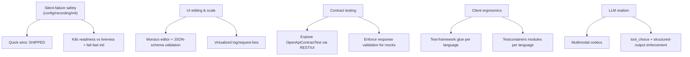

# MockServer Feature-Improvement Roadmap

> Generated 2026-06-18 from an eight-area review of existing features for
> improvements: missing capabilities, features that could be more useful, and
> features that could be easier to work with. Each area was explored against the
> actual code (several "gaps" were verified as already-shipped and dropped).

## TL;DR

MockServer's feature **breadth** is excellent; most recent gaps are closed. The
remaining opportunities cluster into five themes, in rough priority order:

1. **Silent-failure safety** — config / recording / init paths fail quietly.
2. **UI editing & scale** — feature-complete dashboard, but editing and
   large-data handling lag.
3. **Contract-testing story** — powerful code exists but is invisible to users.
4. **Client ergonomics** — protocol parity is strong; test-framework glue is the gap.
5. **LLM realism** — fast-moving area with concrete freshness/feature gaps.

The first tranche of **quick wins shipped** on 2026-06-18 (see below). The rest
of this document is the backlog: **strategic bets** and the full **per-area
opportunity tables**.

## Shipped (2026-06-18)

These landed on `master` (commits `07d0b5ac7` … `2ee5722dc`):

| Item | Commit |
|------|--------|
| Opt-in secret redaction in recorded expectations | `07d0b5ac7` |
| Timestamps on dashboard log entries (UI + serializer) | `8339d86a8` |
| Actionable launcher error when no release bundle (6 clients) | `b3bd08105` |
| Warn on unrecognised configuration keys | `f28906bdf` |
| Configurable default response headers | `1586167f3` |
| Dashboard serializer test follow-up | `f3e9ad203` |

## Strategic bets (larger, high-leverage)

| Bet | Why it matters | Anchor evidence |
|-----|----------------|-----------------|
| **UI: Monaco editor + list virtualization** | Body matchers are plain `TextField`s — no highlight/lint/schema validation; errors only surface after a failed PUT. Log lists mount every row. | `ComposerView.tsx:421-557`, `ProgressiveList.tsx:39-55`; a JSON Schema bundle already exists from the editor-extensions work |
| **Contract testing: expose & enforce** | `OpenApiContractTest` / `OpenApiTrafficValidator` are fully built but reachable only programmatically; OpenAPI response validation only *logs* for mocks (enforced only for proxy). Clear path into Pact/Prism territory on existing code. | `OpenApiContractTest.java:54-104`, `OpenAPIResponseValidator.java:28-76`, enforced only at `HttpActionHandler.java:3123` |
| **Record-to-expectations round-trip** | Recording + multi-language codegen exist as pieces, but no first-class "proxy a real API → export generated expectations" flow (WireMock/Hoverfly flagship onboarding). | `RecordedExpectationPostProcessor.java`, `serialization/code/*` |
| **Client test-framework glue** | Only Python ships a fixture; no xUnit / Jest / RSpec / Go-`t.Cleanup` / Testcontainers modules. Pure ergonomics, high adoption payoff. | `mockserver-client-python/tests/conftest.py`; JVM has `MockServerRule`/`MockServerExtension` |
| **K8s correctness: readiness ≠ liveness + fail-fast init** | Both Helm probes hit one always-200 path → traffic routes to pods before expectations load; broken initializers start "successfully" with zero expectations. | `deployment.yaml:100-118`, `ExpectationInitializerLoader.java:221-232` |
| **LLM realism** | No image/audio codecs, no `tool_choice`, structured-output only validates fail-soft. | `ParsedMessage.java:9`, `Completion.java:152-160` |

## Per-area opportunity tables

Effort: S / M / L. Impact: High / Med / Low. Evidence is `file:line` of the
current state. Items already verified as shipped are omitted.

### 1. Dashboard UI usability

| # | Opportunity | Effort | Impact | Evidence |
|---|-------------|--------|--------|----------|
| 1 | Real code editor (syntax highlight + JSON-schema validation) for body matchers | M | High | `ComposerView.tsx:421-557`, errors only post-PUT at `:299-302` |
| 2 | Virtualize log/request lists (react-window/virtuoso) | M | High | `ProgressiveList.tsx:39-55`, `LogPanel.tsx:39-62` |
| 3 | Log search: regex + field operators (`status:>=400`) + export filtered set | M | High | `searchMatcher.ts:80-86` (substring only) |
| 4 | Tab overflow/drawer for the 12-tab bar on narrow screens | M | Med-High | `AppBar.tsx:265-313` (12 hardcoded ToggleButtons) — *partly addressed by recent responsive work; re-verify* |
| 5 | Edit-then-preview-diff for capture-to-mock and Composer | M | Med | `CaptureAsMockDialog.tsx:420-470`, `ComposerView.tsx:287-303` |
| 6 | Persistent connection-loss banner on sustained WS failure | S | Med | `App.tsx:142-159` (4s auto-hide), `AppBar.tsx:73-107` |
| 7 | Focus traps + `aria-live` in dialogs/live regions | S-M | Med | `Panel.tsx:78`, no `aria-live` in `LogPanel.tsx` |

### 2. Core matching & response actions

| # | Opportunity | Effort | Impact | Evidence |
|---|-------------|--------|--------|----------|
| 1 | JSONPath/XPath extraction in **Velocity & JS** templates (Mustache already has it) | S | High | `MustacheTemplateEngine.java:85-86` vs Velocity/`PolyglotRunner` |
| 2 | Record-to-expectations proxy round-trip (also a strategic bet) | L | High | `RecordedExpectationPostProcessor.java` |
| 3 | Bind path/regex capture groups into response context | M | High | `HttpRequestTemplateObject.java:45-49` |
| 4 | Weighted/probabilistic response selection (`WEIGHTED` mode) | S | Med | `Expectation.java:903-913` (RANDOM/sequential only) |
| 5 | Global default response headers / **global default delay** | S | Med | headers SHIPPED; global delay still open |
| 6 | Lightweight per-expectation hit-count branching (`afterCall(n)`) | M | Med | needs full `ScenarioManager` today |
| 7 | Inline schema-valid response generation without attaching a full OpenAPI spec | M | Med | `SampleDataGenerator` is OpenAPI-path only |

### 3. Proxy / recording / verification

| # | Opportunity | Effort | Impact | Evidence |
|---|-------------|--------|--------|----------|
| 1 | Redact secrets in recordings | S | High | **SHIPPED** (`07d0b5ac7`) |
| 2 | Per-upstream proxy observability (metrics + `server.address` span attr) | M | High | `NettyHttpClient.java:159-165` (Timing computed, discarded), `RequestSpans.java:82-94` |
| 3 | UI view/filter for forwarded/proxy traffic | M | High | `FilterPanel.tsx:439-440`, dead `FORWARDED_REQUEST` color `theme.ts:23` |
| 4 | Eventual / negative-within-timeout verification | M | High | `MockServerEventLog.verify:553` (single snapshot) |
| 5 | Field-level diff for response & sequence verify failures | M | Med-High | `buildClosestMatchDiff` wired only to `verifyRequest:597` |
| 6 | Templatize recorded bodies/headers/query, not just id path segments | M | Med | `RecordedExpectationPostProcessor.templatize:219-248` |
| 7 | Soft / collecting verification (assert-all) | S-M | Med | `MockServerClient.java:1229,1285` (throws on first) |
| 8 | Verify-by-disposition (forwarded vs mocked) | S | Med | log distinguishes types at `MockServerEventLog.java:68-80`; verify folds them |
| 9 | Proxy retry / circuit-breaking with metrics | L | Med | `HttpForwardAction.java:52-58`, no pool `NettyHttpClient.java:121-151` |

### 4. OpenAPI / spec-driven mocking

| # | Opportunity | Effort | Impact | Evidence |
|---|-------------|--------|--------|----------|
| 1 | Expose `OpenApiContractTest` / `OpenApiTrafficValidator` via REST/UI | M | High | `OpenApiContractTest.java:54-104` (internal only) |
| 2 | Enforce (not just log) response validation for mock expectations | M | High | `OpenAPIResponseValidator.java:28-76`, enforced only at `:3123` |
| 3 | Named/multiple-example selection in UI + multi-example expectations | M | High | `OpenAPIConverter.java:393-417`; no UI picker |
| 4 | GraphQL SDL/introspection-driven mocking | L | High | `GraphQLMatcher.java:1-65` (match only, no synthesis) |
| 5 | Array `minItems`/`pattern`/exclusive-bound constraints in example gen | S-M | Med | `ExampleBuilder.java:386-390` (always 1 item) |
| 6 | Synthesize gRPC example messages from descriptors | M | Med | `grpcDescriptors.ts:29-51` (discovery only) |
| 7 | Auth in generated Postman/Bruno + run generation in CI | S | Med | `generate_collections.py:45-110` (no auth) |
| 8 | Apply request validation + security-requirement checks during mock matching | M | Med | `OpenAPIRequestValidator.java:27-46` (proxy-only) |

### 5. Client libraries & integrations

| # | Opportunity | Effort | Impact | Evidence |
|---|-------------|--------|--------|----------|
| 1 | Expose codegen formats (`retrieveAsCode`) from each client (UI-only today) | M | High | `Format.java:7-35`; Go has only json/log_entries `client.go:503-505` |
| 2 | Test-framework integration beyond Python (xUnit/Jest/RSpec/Go/PHPUnit) | M | High | only `mockserver-client-python/tests/conftest.py` |
| 3 | Testcontainers modules for Go/.NET/Node/Python/Rust | M-L | High | JVM-only `mockserver-testcontainers/` |
| 4 | Launcher 404 graceful fallback | S | High | **SHIPPED** (`b3bd08105`) |
| 5 | LLM/MCP builders in the other 5 clients (only Python & Node today) | M | Med-High | `llm.py`/`mcp.py`, `llm.js`/`mcpMockBuilder.js` |
| 6 | Idiomatic auto-cleanup (Go `t.Cleanup`, Rust `Drop`, JS `Symbol.dispose`) | S | Med | inconsistent across clients |
| 7 | Per-language "use in tests" docs + a capability/parity matrix | S | Med | docs gap |

### 6. Advanced behaviour (chaos / drift / breakpoints / WASM / scenarios / cluster)

| # | Opportunity | Effort | Impact | Evidence |
|---|-------------|--------|--------|----------|
| 1 | Scenario state-graph visualization (Mermaid, live state) | M | High | `ScenarioManager.java:155-203`, `ScenarioPanel.tsx` (no viz) |
| 2 | Cluster status endpoint + dashboard panel + `cluster_members` metric | M | High | no cluster endpoint in `HttpRequestHandler.java:158-274` |
| 3 | Chaos experiment scheduling (cron/delayed) + saved profile library | M | High | orchestrator starts immediately; no named-profile store |
| 4 | Drift aggregation + CI fail-threshold + webhook | M | High | `DriftStore.java` flat deque; no threshold/webhook |
| 5 | WASM richer ABI (headers/method/path) + authoring SDK | M | Med-High | `WasmRuntime.java:49-86` (body bytes only) |
| 6 | Breakpoint UX: "break on this request" from a log row + structured modify editor | S-M | Med | `BreakpointsPanel.tsx:346-410` (raw-JSON textarea) |
| 7 | Conditional breakpoints (Nth-hit / response-content) | S | Med | `BreakpointMatcher.java` (no hit-count/condition) |
| 8 | Route quota/match counters through `StateBackend` (cluster-correct) | M | Med | `HttpQuotaRegistry.java:30` (node-local) |

### 7. Deployment / configuration / CLI

| # | Opportunity | Effort | Impact | Evidence |
|---|-------------|--------|--------|----------|
| 1 | Warn on unknown/misspelled config keys | S | High | **SHIPPED** (`f28906bdf`) |
| 2 | `mockserver config` / `--print-config` (effective config + source per key) | M | High | only raw property-file dump `ConfigurationProperties.java:3693` |
| 3 | Distinct readiness vs liveness signal (split Helm probes) | S-M | High | both probes at `deployment.yaml:100-118` |
| 4 | Fail-fast option for malformed initializers (`--strict-init`) | S | Med-High | `ExpectationInitializerLoader.java:221-232` |
| 5 | First-class `--watch` flag + configurable/instant reload | M | Med | `FileWatcher.java:37` (5s poll, off by default) |
| 6 | Quickstart example in `--help` + `mockserver demo` | S | Med | help text gap |
| 7 | Broaden + share secret redaction beyond the file dump | S | Med | `ConfigurationProperties.java:328-342,3700` |

### 8. LLM & AI-protocol mocking

| # | Opportunity | Effort | Impact | Evidence |
|---|-------------|--------|--------|----------|
| 1 | Multimodal / vision request+response codecs (image/audio) | S-M | High | `ParsedMessage.java:9` (text/tool only) |
| 2 | Refresh model catalog + cached/reasoning token usage fields | S | High | `LlmPricing.java:53-65`, `Usage.java` (no cached/reasoning) |
| 3 | `tool_choice` / forced-tool realism (request match + honoured) | M | High | `Completion.java:33` (no choice/finish-reason coupling) |
| 4 | Structured-output enforcement (true JSON-schema mode) | M | High | `Completion.java:152-160` (validate-only) |
| 5 | Embeddings beyond OpenAI + rerank endpoints | M | Med-High | Gemini/Bedrock/Ollama embedding throws |
| 6 | MCP `prompts/*` + `sampling/createMessage` + notifications | M | Med-High | `McpRequestProcessor.java:350-390` |
| 7 | Agent-framework recipes (LangChain/LlamaIndex/OpenAI-Agents) | M | Med | raw-HTTP only |
| 8 | Provider-specific overload bodies tied into chaos profiles | S | Med | `LlmChaosProfile.java:34` (generic error) |
| 9 | A2A streaming + push notifications | M | Med | `A2aMockBuilder.java:142` (hard-coded false) |
| 10 | Token-count utility / request-side usage inference | S | Low-Med | no tokenizer under `llm/` |

## Suggested sequencing

1. **Wave A — quick wins (mostly S, high impact):** template-engine JSONPath/XPath
   parity (#2.1), per-upstream proxy metrics (#3.2), readiness vs liveness (#7.3),
   fail-fast init (#7.4), LLM model-catalog refresh + cached/reasoning tokens (#8.2),
   multimodal codecs (#8.1), OpenAPI array/pattern constraints (#4.5), conditional
   breakpoints (#6.7), weighted responses (#2.4), global default delay (#2.5).
2. **Wave B — strategic:** contract-testing expose+enforce (#4.1/#4.2), record-to-
   expectations (#2.2), UI Monaco editor + virtualization (#1.1/#1.2), client
   test-framework glue (#5.2).
3. **Wave C — larger:** GraphQL SDL mocking (#4.4), Testcontainers per language
   (#5.3), `mockserver config` diagnostic (#7.2), scenario/cluster/chaos/drift
   operability (#6.x).

### Parallelisation notes

Items in different modules/areas can be implemented in parallel isolated
worktrees. Watch for **shared-file contention**: anything touching
`Configuration.java` / `ConfigurationProperties.java` (config-style features) or
`changelog.md` will conflict on rebase — sequence those or expect to resolve
additive merges (a `changelog.md merge=union` git attribute resolves the
changelog automatically). Verify each unit's full module test suite before
merge: per-unit `-Dtest=` runs miss related tests (e.g. dashboard-serializer
changes break group-serializer and WebSocket-handler tests).
