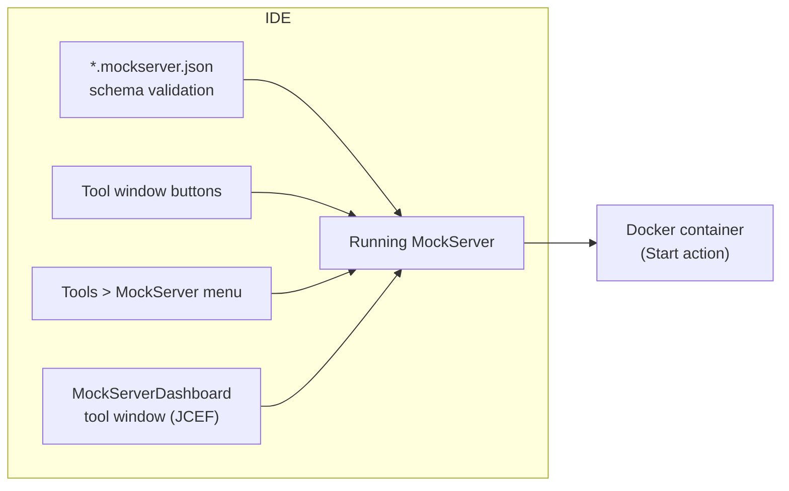

# MockServer JetBrains Plugin

**Author, record, and debug HTTP/HTTPS mocks for MockServer without leaving your IDE.**

MockServer integration for IntelliJ IDEA and all JetBrains IDEs — drive everything from the **Tools > MockServer** menu or the dockable **MockServer** tool window.

**Highlights:**

- **Schema-driven expectation authoring** — live validation, completion, and hover docs in `*.mockserver.json` files, with no language server.
- **Record real traffic into code** — save the requests MockServer proxied from a real upstream as ready-to-use expectations, as JSON or a Java DSL snippet.
- **Generate mocks from an OpenAPI/Swagger spec** — turn the open spec into a full set of expectations in one action.
- **Live MockServer dashboard, embedded in the IDE** — watch requests, inspect match results, and review active expectations without switching to a browser.

## Features at a glance



| Category | What you get |
|----------|-------------|
| Schema validation | Live validation, completion, and hover docs in `*.mockserver.json` / `*.mockserver.jsonc` files |
| Server controls | Start via Docker, open dashboard in IDE or browser, reset |
| Expectation management | Load from file, save recorded, generate from OpenAPI spec |
| Testing | Send ad-hoc HTTP requests and see the response in a new tab |
| Observability | Drift report, distributed-trace correlation by W3C `traceparent` |
| WASM custom rules | Upload and list compiled `.wasm` modules on the running server |
| Settings | Docker image, container name, and port under **Settings \| Tools \| MockServer** |

## Actions

All actions are available from **Tools > MockServer** and as buttons in the **MockServer** tool window at the bottom of the IDE. In the Tools menu they carry semantic icons and are split by `Server`, `Editor actions`, and `WASM` separators so the set is easy to scan.

### Server controls

| Menu text | What it does |
|-----------|-------------|
| Open MockServer Dashboard | Opens `http://localhost:<port>/mockserver/dashboard` in your default browser |
| Open MockServer Dashboard in IDE | Activates the **MockServerDashboard** tool window (right side), which embeds the live dashboard using JCEF (the bundled Chromium engine). Falls back to the external browser when JCEF is unavailable. Has Reload and Open-in-Browser toolbar buttons. |
| Start MockServer (Docker) | Probes Docker availability (`docker info`), then starts the configured `mockserver/mockserver` container via Docker on the configured port; shows a clear error if Docker is not running |
| Reset MockServer | Prompts for confirmation, then calls `PUT /mockserver/reset` to clear all expectations and recorded logs |

### Editor actions (operate on the active file)

| Menu text | What it does |
|-----------|-------------|
| Load Expectations Into Running Server | Sends the active editor's JSON content to `PUT /mockserver/expectation` — a single expectation object or an array of expectations |
| Save Recorded Expectations | Prompts for an output format, then calls `PUT /mockserver/retrieve?type=recorded_expectations&format=json\|java`; opens the result as `recorded-expectations.mockserver.json` (JSON) or `RecordedExpectations.java` (Java DSL) in a new tab |
| Generate Expectations From OpenAPI Spec | Sends the active editor's OpenAPI/Swagger spec (JSON or YAML) to `PUT /mockserver/openapi`, opens the generated expectations in a new tab |
| Send Test Request | Reads a JSON request spec from the active editor, sends it to the running MockServer at the configured port, and opens the response (`HTTP <status>` + body) in a new tab |
| Show Drift Report | Calls `GET /mockserver/drift`, formats the results (type, field, expected vs actual, confidence, affected expectation), and opens them in a new tab |
| Find Requests by Trace | Prompts for a W3C trace id (32 hex) or a full `traceparent` header value, retrieves all received requests, filters those carrying a matching `traceparent` header, and opens the results as JSON in a new tab |

### WASM custom rules

| Menu text | What it does |
|-----------|-------------|
| Upload WASM Module | Opens a file chooser for a `.wasm` file, prompts for a module name, and uploads the raw bytes to `PUT /mockserver/wasm/modules?name=<name>` |
| List WASM Modules | Calls `GET /mockserver/wasm/modules` and opens the JSON list of registered module names in a new tab |

## Tool window layout

The dockable **MockServer** tool window (bottom bar, MockServer icon) opens with a status line — `MockServer · localhost:<port>` showing the configured target — and groups icon buttons under bold section headers matching the action categories above:

- **Server** — Open Dashboard in IDE, Open Dashboard (Browser), Start (Docker), Reset
- **Editor actions (use the active file)** — Load Expectations, Save Recorded, Generate From OpenAPI, Send Test Request, Show Drift Report, Find Requests by Trace
- **WASM** — Upload WASM Module, List WASM Modules

When the embedded dashboard tool window cannot reach a running server it shows a friendly "No MockServer running" panel (with a Retry link) instead of a raw browser connection error.

## File conventions

### Expectation files — `*.mockserver.json`

Name any file with the `.mockserver.json` (or `.mockserver.jsonc`) suffix to activate live schema validation, completion, and hover documentation. The schema is the same one MockServer validates against, generated from `mockserver-core`.

A single expectation:

```json
{
  "httpRequest": { "method": "GET", "path": "/api/hello" },
  "httpResponse": { "statusCode": 200, "body": "Hello" }
}
```

An array of expectations (initialization JSON):

```json
[
  {
    "httpRequest": { "method": "GET", "path": "/api/hello" },
    "httpResponse": { "statusCode": 200, "body": "Hello" }
  }
]
```

### Request files — for Send Test Request

The active file must be a JSON object with `method` and `path` (required), and optionally `headers` and `body`:

```json
{
  "method": "GET",
  "path": "/api/hello",
  "headers": { "Accept": "application/json" }
}
```

### WASM body matcher

After uploading a `.wasm` module named `my-rule`, reference it in an expectation body matcher as:

```json
{
  "httpRequest": {
    "body": { "type": "WASM", "moduleName": "my-rule" }
  },
  "httpResponse": { "statusCode": 200 }
}
```

WASM body matching requires `wasmEnabled=true` on the running MockServer (the server reports clearly when WASM support is disabled).

## Settings — Settings | Tools | MockServer

| Setting | Default | Description |
|---------|---------|-------------|
| Docker image | `mockserver/mockserver:<plugin version>` | Image used by Start MockServer (Docker). Leave blank to track the plugin version automatically. |
| Container name | `mockserver-ide` | Name given to the started container |
| Host port | `1080` | Port used by all actions (dashboard URL, REST calls, Docker port binding) |

## Requirements

- **IDE:** IntelliJ IDEA 2024.3+ or any JetBrains IDE based on IntelliJ Platform build **243** through **253**
- **JDK:** Java 17+
- **Docker:** required only for the **Start MockServer (Docker)** action; all other actions connect to any already-running MockServer at `localhost:<port>`
- **WASM support:** `wasmEnabled=true` must be set on the MockServer instance for the Upload / List WASM actions to work

## Installation

### From JetBrains Marketplace

1. Open **Settings > Plugins > Marketplace**
2. Search for **MockServer**
3. Click **Install**

### From a local build

```bash
cd mockserver-jetbrains
./gradlew buildPlugin
```

The plugin ZIP is written to `build/distributions/mockserver-jetbrains-<version>.zip`. Install via **Settings > Plugins > gear icon > Install Plugin from Disk**.

## Try it locally

From the repo root, one command builds the plugin, starts a local MockServer Docker container, and launches it in a sandbox IDE so every action works immediately:

```bash
scripts/try-editor-extensions.sh jetbrains
```

## Running in a sandbox IDE

```bash
cd mockserver-jetbrains
./gradlew runIde
```

## Running tests

```bash
cd mockserver-jetbrains
./gradlew test
```

## Development

| Detail | Value |
|--------|-------|
| Language | Kotlin |
| Build system | Gradle with IntelliJ Platform Gradle Plugin 2.x |
| Minimum platform | IntelliJ Platform 2024.3 (build 243) |
| JDK | 17+ |
| Expectation schema | Generated from `mockserver-core` by `scripts/generate-editor-expectation-schema.mjs` into `src/main/resources/schemas/`. Re-run that script after changing the core schemas. |
