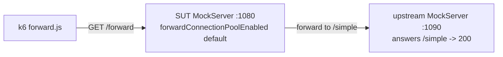

# MockServer k6 performance harness

[k6](https://k6.io) load tests for MockServer. Supersedes the Locust harness
(the Locust files remain in `..` for one release, then are retired). k6 gives
native Prometheus remote-write output, built-in pass/fail **thresholds** (CI
regression gates), and Grafana-native dashboards.

## Scripts

| Script | Purpose | Gates |
|--------|---------|-------|
| `smoke.js` | Wiring sanity — exercises every action once (match, create, forward, large-body, regex). Fast. | Correctness only (status codes + zero transport errors). No latency gate. |
| `load.js` | Primary load test. Closed-loop arrival-rate: `match` (GET /simple) ramps to peak while `create` (PUT expectation) churns the control plane. | p95/p99 latency + error-rate + check-rate (CI pass/fail). |
| `forward.js` | Forward-path regression guard. Drives the OUTBOUND/FORWARD path (`GET /forward` → upstream `/simple`) at a sustained high rate (ramp to ~1500 rps). Guards the `mockserver.forwardConnectionPoolEnabled` default: without pooling, every forwarded request opens a fresh upstream socket and at peak rate exhausts ephemeral ports → BindException → failures. | **error-rate** (the pool-regression signal) + forward-path p95/p99 + check-rate. |
| `stress.js` | Ramp the match path past the load peak to find the breaking point. | Aborts only if error rate exceeds the ceiling (latency intentionally ungated). |
| `soak.js` | Sustained moderate load over a long duration to surface memory/GC/connection leaks. Pair with the Grafana stack to watch JVM heap. | p99 drift + error-rate. |
| `regression.js` | Daily regression harness. Four `constant-arrival-rate` scenarios (`match`, `forward`, `template`, `large`) each tagged `op:<name>`. A warmup scenario runs first. Run twice per CI job — once `BASE_URL=http://...` and once `BASE_URL=https://... PROTO=https_h2` (HTTPS negotiates HTTP/2 via ALPN). Writes per-behaviour `{p50_ms, p95_ms, p99_ms, throughput_rps, error_rate}` keyed `<op>_<proto>` to `K6_RESULT_PATH`. | Notify-only (no k6 thresholds gate the CI build). |
| `growth.js` | Resource-growth regression harness. Validates that latency does not climb as the request log fills (see issue #2329: O(n) eviction once the 100k `maxLogEntries` ring is full). Runs a sustained `load` scenario on the match path at a rate that fills `maxLogEntries` early; `window:first` and `window:last` probes measure the latency slope. Writes first/last-window p95 + ratio. | Notify-only. |
| `sweep.js` | Throughput-vs-latency "knee" curve. Offers the match path (`GET /simple`) at an ascending LADDER of fixed arrival rates (`K6_SWEEP_RATES`); each rate is a staggered `constant-arrival-rate` step tagged `rate:<offered>`. Per step it records the ACHIEVED throughput, latency percentiles (p50/p90/p95/p99/p99.9), and error rate. Writes `{proto, points:[{offered_rps, achieved_rps, p50_ms…p999_ms, error_rate}]}` to `K6_SWEEP_RESULT_PATH` — the series plotted as a load-vs-latency knee curve on the docs site. | Notify-only (NO aborting thresholds — dropped iterations / degradation at the top of the ladder are the point). |

## Running

```bash
# against a local MockServer on :1080 (default)
k6 run mockserver-performance-test/k6/smoke.js
k6 run mockserver-performance-test/k6/load.js

# point at another instance / protocol
k6 run -e BASE_URL=https://localhost:1080 mockserver-performance-test/k6/load.js
k6 run -e MOCKSERVER_HOST=host.docker.internal:1080 .../load.js

# shape the load / relax gates on a slow agent
k6 run -e K6_PEAK_RATE=1000 -e K6_P95_MS=40 .../load.js

# regression script — HTTP then HTTPS+H2 (requires mockserver-upstream for forward behaviour)
k6 run -e BASE_URL=http://localhost:1080 -e K6_RESULT_PATH=/tmp/result-http.json \
  mockserver-performance-test/k6/regression.js
k6 run -e BASE_URL=https://localhost:1080 -e PROTO=https_h2 -e K6_RESULT_PATH=/tmp/result-h2.json \
  mockserver-performance-test/k6/regression.js

# regression without a dedicated upstream (single-container smoke only)
k6 run -e K6_FORWARD_SELF=true -e BASE_URL=http://localhost:1080 \
  mockserver-performance-test/k6/regression.js

# growth script
k6 run -e BASE_URL=http://localhost:1080 mockserver-performance-test/k6/growth.js

# sweep script — full default ladder (500…32000 rps); writes the knee-curve JSON
k6 run -e K6_SWEEP_RESULT_PATH=/tmp/sweep-result.json \
  mockserver-performance-test/k6/sweep.js

# sweep with a short, low ladder (laptop-safe smoke)
k6 run -e K6_SWEEP_RATES=200,500,1000 -e K6_SWEEP_STEP=8s \
  -e K6_SWEEP_RESULT_PATH=/tmp/sweep-result.json \
  mockserver-performance-test/k6/sweep.js
```

### Throughput-vs-latency sweep (`sweep.js`)

`sweep.js` offers the match path at an ascending ladder of FIXED arrival rates
and records, per rate step, the achieved throughput, latency percentiles, and
error rate — the data series plotted as the load-vs-latency "knee" curve. Each
ladder rung is its own `constant-arrival-rate` scenario, staggered after the
previous (`startTime` = sum of prior `step` + `gap` durations) with a short quiet
gap so one step's tail does not bleed into the next step's percentiles. Every
request is tagged `rate:<offered>` so the per-step submetrics are computed in the
summary.

There are deliberately **no aborting thresholds** — at the top of the ladder k6
may drop iterations (VU-starved) and latency/errors degrade sharply; observing
that degradation IS the point. The output JSON shape is a hard contract:

```json
{
  "proto": "http",
  "points": [
    {"offered_rps": 500, "achieved_rps": 499.6, "p50_ms": 0.9, "p90_ms": 1.4,
     "p95_ms": 1.8, "p99_ms": 3.2, "p999_ms": 7.1, "error_rate": 0.0}
  ]
}
```

A committed sample (a real run against MockServer 7.2.0 on Docker Desktop, ladder
`500…16000` rps) lives at `k6/fixtures/sample-perf-sweep.json` — used to build
and test the docs-site knee-curve chart without re-running a load test.

### Forward-path regression guard (`forward.js`)

Guards the upstream connection-pool default (`mockserver.forwardConnectionPoolEnabled`,
default **true**). It hammers the forward path at a high sustained rate; with
pooling on the error rate stays ~0, and if pooling regresses to per-request
connections the host exhausts ephemeral ports (`BindException`) and the
error-rate threshold trips.

**Topology** — the SUT forwards to a *separate* loopback upstream MockServer so
the SUT does real outbound connections (the thing being pooled):



```bash
# 1. upstream MockServer on :1090 answering /simple -> 200
java -jar mockserver/mockserver-netty/target/mockserver-netty-*-jar-with-dependencies.jar \
     -serverPort 1090 >/tmp/upstream.log 2>&1 &
curl -s -XPUT 'http://localhost:1090/mockserver/expectation' -d \
  '[{"httpRequest":{"path":"/simple"},"httpResponse":{"statusCode":200,"body":"some simple response"},"times":{"unlimited":true}}]'

# 2. SUT MockServer on :1080 (pool default = ON — the guarded path)
java -jar mockserver/mockserver-netty/target/mockserver-netty-*-jar-with-dependencies.jar \
     -serverPort 1080 >/tmp/sut.log 2>&1 &

# 3. run the guard — SUT forwards to the upstream on :1090
k6 run -e FORWARD_UPSTREAM_HOST=127.0.0.1:1090 \
       mockserver-performance-test/k6/forward.js

# demonstrate the guard catches a regression: force pooling OFF on the SUT,
# re-run — the error-rate gate trips at peak (BindException-driven failures)
java -Dmockserver.forwardConnectionPoolEnabled=false -jar \
     mockserver/mockserver-netty/target/mockserver-netty-*-jar-with-dependencies.jar \
     -serverPort 1080 ...

# single-container quick smoke (NOT the real guard): SUT forwards to itself
k6 run -e K6_FORWARD_SELF=true mockserver-performance-test/k6/forward.js
```

**What each threshold guards** (`forward.js`):

- `http_req_failed{op:forward}` / `http_req_failed` — **the regression guard.**
  Pooled ≈ 0; a per-request-connection regression spikes this at peak (ephemeral
  port exhaustion → BindException). Reuses `K6_MAX_ERROR_RATE` (default `0.01`).
- `http_req_duration{op:forward}` p95/p99 — forward-path latency bounds (looser
  than the match path because of the upstream hop). Override with
  `K6_FWD_P95_MS` / `K6_FWD_P99_MS`.
- `checks` — every forward returns a 200 from the upstream.

## Environment variables

All tunables are env-driven (see `lib/config.js`). Connection target resolves as
`BASE_URL` → else `MOCKSERVER_PROTOCOL` + `MOCKSERVER_HOST` (bare host gets `:1080`).

| Variable | Default | Meaning |
|----------|---------|---------|
| `BASE_URL` | – | Full base URL, e.g. `https://mockserver:1080` (wins over the pair below) |
| `MOCKSERVER_PROTOCOL` | `http` | `http` or `https` |
| `MOCKSERVER_HOST` | `localhost:1080` | host[:port] (mirrors the Locust variable) |
| `INSECURE_SKIP_TLS_VERIFY` | local→`true`, public→`false` | Skip TLS verification. Defaults insecure only for loopback/private hosts (MockServer uses a self-signed CA); set explicitly to `true` for a public HTTPS target. |
| `K6_START_RATE` / `K6_PEAK_RATE` | `50` / `500` | load.js ramping-arrival-rate (req/s) |
| `K6_RAMP_UP` / `K6_HOLD` / `K6_RAMP_DOWN` | `30s` / `1m` / `15s` | load.js stage durations (compound forms like `1m30s` supported) |
| `K6_CREATE_RATE` | `10` | control-plane create-expectation rate (req/s) |
| `K6_STRESS_PEAK_RATE` | `5000` | stress.js peak target (req/s) |
| `K6_SOAK_RATE` / `K6_SOAK_DURATION` | `200` / `30m` | soak.js sustained rate + duration |
| `K6_P95_MS` / `K6_P99_MS` | `25` / `100` | latency thresholds (ms) |
| `K6_MAX_ERROR_RATE` / `K6_MIN_CHECK_RATE` | `0.01` / `0.99` | error/check-rate thresholds |
| `K6_PRE_VUS` / `K6_MAX_VUS` | `50` / `600` | VU pool for the arrival-rate executors |

**forward.js additional variables** (defined in `lib/config.js` `FORWARD_LOAD` block):

| Variable | Default | Meaning |
|----------|---------|---------|
| `K6_FWD_START_RATE` / `K6_FWD_PEAK_RATE` | `100` / `1500` | forward.js ramping-arrival-rate (req/s); peak is the rate that broke the old per-request default |
| `K6_FWD_RAMP_UP` / `K6_FWD_HOLD` / `K6_FWD_RAMP_DOWN` | `30s` / `1m` / `15s` | forward.js stage durations |
| `K6_FWD_PRE_VUS` / `K6_FWD_MAX_VUS` | `200` / `2000` | VU pool for the forward arrival-rate executor |
| `K6_FWD_P95_MS` / `K6_FWD_P99_MS` | `50` / `200` | forward-path latency thresholds (ms); looser than the match path due to the upstream hop |
| `FORWARD_UPSTREAM_HOST` | `mockserver-upstream:1080` | host:port of the upstream MockServer the SUT forwards to (set to `127.0.0.1:1090` for the local two-instance topology) |
| `K6_FORWARD_SELF` | – | `true` loops `/forward` back to the SUT's own `/simple` (single-container smoke only) |

**regression.js / growth.js additional variables** (defined in `lib/config.js` `REGRESSION` and `GROWTH` blocks):

| Variable | Default | Meaning |
|----------|---------|---------|
| `K6_REG_RATE` | `200` | Constant arrival rate per behaviour scenario (req/s) |
| `K6_REG_DURATION` | `2m` | Duration of each behaviour scenario |
| `K6_REG_WARMUP` | `30s` | Warmup scenario duration (runs before measurements) |
| `PROTO` | `http` | Protocol tag appended to result keys (e.g. `https_h2`) |
| `K6_HTTP2` | – | When set, enables HTTP/2 in the k6 HTTP client |
| `K6_RESULT_PATH` | – | File path where `handleSummary()` writes the result JSON |
| `K6_GROWTH_RATE` | `800` | Sustained load rate for the growth fill scenario (req/s) |
| `K6_GROWTH_DURATION` | `6m` | Total growth run duration |
| `K6_GROWTH_PROBE` | `30s` | Duration of the `window:first` and `window:last` probe scenarios |
| `FORWARD_UPSTREAM_HOST` | `mockserver-upstream:1080` | Host:port of the dedicated upstream MockServer for `forward` expectations |
| `K6_FORWARD_SELF` | – | When set to `true`, the `forward` expectation loops back to the same instance (`127.0.0.1:1080`) instead of requiring a separate upstream. Use for local single-container smoke only. |

**sweep.js additional variables** (defined in `lib/config.js` `SWEEP` block):

| Variable | Default | Meaning |
|----------|---------|---------|
| `K6_SWEEP_RATES` | `500,1000,2000,4000,8000,16000,32000` | Comma-separated ascending ladder of offered arrival rates (req/s); one staggered `constant-arrival-rate` step per rung |
| `K6_SWEEP_STEP` | `20s` | Duration each rate step holds |
| `K6_SWEEP_GAP` | `5s` | Quiet gap between steps (no requests) so percentiles do not bleed across steps |
| `K6_SWEEP_PRE_VUS` / `K6_SWEEP_MAX_VUS` | `200` / `4000` | VU pool for the sweep arrival-rate executors (pre-allocate enough so high rungs are not VU-starved) |
| `PROTO` | `http` | Protocol tag recorded in the result (`https_h2` for an HTTPS+H2 run) |
| `K6_SWEEP_RESULT_PATH` | `sweep-result.json` | File path where `handleSummary()` writes the knee-curve result JSON |

## Seeded expectations

`setup()` seeds the same 4 expectations as the legacy harness (the request
matches the **last** one, so the matcher does a near-full scan — the realistic
worst case), plus a large-body JSON expectation and a regex-path expectation for
the body-decode and regex scenarios.

> **Note — the `/forward` expectation self-loops.** It uses
> `httpOverrideForwardedRequest` to proxy `/forward` → `/simple` on
> `127.0.0.1:1080`, i.e. MockServer forwards to **itself**. This intentionally
> exercises the proxy/override path on a single instance, but requires the
> instance to be reachable at `127.0.0.1:1080` from inside its own container.
> The `forward` action is only used by `smoke.js`.

`regression.js` seeds its own expectations via `lib/expectations.js` `seedRegression()`:

- **Static match** (`match`) — simple GET response, matched by path
- **Forward** (`forward`) — forward action targeting `FORWARD_UPSTREAM_HOST` (a separate upstream MockServer instance). Requires `mockserver-upstream` to be running unless `K6_FORWARD_SELF=true`.
- **Velocity template** (`template`) — `TEMPLATE_EXPECTATION` using a Velocity response template, seeded via `lib/expectations.js`
- **Large body** (`large`) — ~4 KB JSON response body

> **Object/class callbacks are deferred to a future v2.** The dynamic-response path (object callback) needs a WebSocket responder or classpath class. The Velocity template expectation covers the dynamic-response path today.

## Prometheus / Grafana output

```bash
k6 run -o experimental-prometheus-rw \
  -e K6_PROMETHEUS_RW_SERVER_URL=http://localhost:9090/api/v1/write \
  mockserver-performance-test/k6/load.js
```

A docker-compose stack that wires k6 → Prometheus → Grafana and scrapes
MockServer's own `/mockserver/metrics` is added in a later increment.
