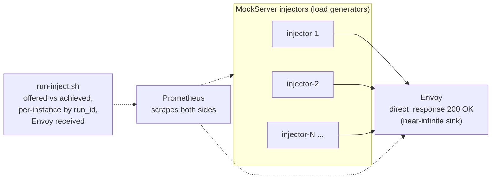

# Load-Injection Measurement Harness

Drive **N MockServer instances as HTTP load _generators_** at a single **Envoy
`direct_response` sink** and measure three things:

1. **Ceiling (simple)** — how much load *one* MockServer instance can inject
   before it saturates (offered-vs-achieved rps as the offered rate climbs a
   stair), using a trivial GET. This runs on a **fat injector** (pinned to ~8
   cores) with a **fine stair** so it finds the real CPU-bound ceiling with a
   clean plateau, not an open-model overshoot/collapse.
1b. **Ceiling (complex)** — the **same** fat injector and stair, but a
   deliberately heavier request: a POST with a 5-row feeder and a ~1 KB
   Velocity-templated JSON body (32 interpolations) so the template engine does
   real work per request. Kept to **one request per iteration** so achieved
   requests/sec still equals the arrival rate and the two ceilings are directly
   comparable. With `ceiling_rps` + `injector_cpu_pct` from both JSONs you get an
   **empirical rps/core data point**: `simple = R/core`, `complex = R'/core`, and
   the per-request cost factor ≈ `R/R'` (complex is lower — each request is
   pricier).
2. **Scaling** — how aggregate injected throughput grows as instances are added
   (1 → 2 → 4 → 6), and the per-instance breakdown. This runs on **lean
   injectors** (2 cores each), each driven at **~80% of the measured lean 2-core
   ceiling** — a rate **derived at runtime** by a quick lean probe, not
   hardcoded — so each instance is comfortably CPU-bound but never collapsing.

The two phases run **sequentially** (never concurrently), so the fat-ceiling
injector and the lean-scaling injectors reuse the same cores without contention.

The Envoy sink answers every request with `200 OK` from its own event loop — it
has **no upstream**, so it absorbs far more than the injectors can produce. That
makes the **injector the provable bottleneck**, which is the whole point: any
plateau is MockServer's injection ceiling, not the target's serving limit.

A small **Lua filter drains any request body before `direct_response`**. Envoy's
`direct_response` path otherwise leaves a POST body unconsumed and sends
`connection: close` to avoid HTTP desync — which, under keep-alive load, churns
the injector's connection pool and floods `kind="connection"` errors, making the
complex (POST-with-body) ceiling collapse to a meaningless near-zero. Draining
the body keeps the connection alive; bodyless requests (the simple GET ceiling)
skip the buffering, so the sink stays cheap for them.



## Quick start (local)

Requires Docker, `jq`, and `curl` on the host.

```bash
cd mockserver-performance-test/stack/inject

# Bring up the sink + 2 injectors + Prometheus (profile selects how many injectors)
MOCKSERVER_IMAGE=mockserver/mockserver:mockserver-snapshot \
  docker compose -f docker-compose.inject.yml --profile n2 up -d

# ...or just let run-inject.sh manage compose up/down for you:
./run-inject.sh ceiling          # 1 injector, simple GET stair  -> inject-ceiling.json
./run-inject.sh ceiling-complex  # 1 injector, templated POST    -> inject-ceiling-complex.json
./run-inject.sh scale 1 2        # aggregate rps at N=1 and N=2   -> inject-scale.json

# Tear everything down
docker compose -f docker-compose.inject.yml \
  --profile n1 --profile n2 --profile n4 --profile n6 down -v
```

`run-inject.sh` brings the stack up/down itself, so you normally only run the
two sub-commands. For a short laptop-safe smoke, shorten the holds/ladder (keep
`CEILING_OFFERED` in step with the stage rates in the ceiling scenario file):

```bash
# ceiling: fat-ish injector, finer SHORT stair
ENVOY_CPUS=0-1 I1_CPUS=2-7 CEILING_OFFERED="2000 4000 6000 8000" \
  CEILING_HOLD_S=14 CEILING_SETTLE_S=10 RATE_WINDOW=8s ./run-inject.sh ceiling

# scale: lean injectors + short lean probe (PROBE_*); or force the rate and skip
# the probe entirely with SCALE_PER_INSTANCE_RPS
ENVOY_CPUS=0-1 I1_CPUS=2-3 I2_CPUS=4-5 \
  PROBE_OFFERED="2000 3000 4000" PROBE_HOLD_S=12 PROBE_SETTLE_S=8 \
  SCALE_HOLD_S=20 SCALE_SETTLE_S=12 RATE_WINDOW=8s ./run-inject.sh scale 1 2
```

| Profile | Injectors up |
|---------|--------------|
| `n1`    | injector-1 |
| `n2`    | injector-1, 2 |
| `n4`    | injector-1, 2, 3, 4 |
| `n6`    | injector-1 … 6 |

| Service | Host URL | Notes |
|---------|----------|-------|
| Envoy sink | `http://localhost:8000` | every request → `200 OK` |
| Envoy admin / stats | `http://localhost:9901` | `/ready`, `/stats/prometheus` |
| injector-K | `http://localhost:108K` | each injector's `1080` published as `1080+K` |
| Prometheus | `http://localhost:9090` | scrapes injectors + Envoy every 2s |

## What each measurement means

`inject-ceiling.json` (one injector, RATE stair):

- `offered_rps` — the arrival rate the RATE stage asked for.
- `achieved_rps` — `sum(rate(mock_server_load_requests_total[15s]))` — what the
  injector actually dispatched. While `achieved ≈ offered`, you are below the
  ceiling.
- `throttled_rps` — `mock_server_load_throttled_total` rate. **Must be ~0.** If
  it climbs, a cap is binding (the run prints a loud WARNING) and the point is
  not trustworthy.
- `error_rate` — connection/timeout errors as a fraction. Must be ~0.
- `injector_cpu_pct` / `envoy_cpu_pct` — `docker stats` snapshots. At the
  ceiling the injector should be CPU-bound (~100% of its pin) while Envoy has
  headroom.
- `target_received_rps` — Envoy's `envoy_http_downstream_rq_completed` rate;
  should track `achieved_rps` (proof the injected requests really landed).
- `ceiling_rps` — the highest offered rate the injector achieved **cleanly**
  (achieved within 10% of offered, no throttle, no errors). With the fine stair
  this lands on a clean plateau just below where CPU saturates, rather than the
  last point before an overshoot collapse.
- `scenario` — which scenario produced this file (`inject-ceiling` for the simple
  GET, `inject-ceiling-complex` for the templated POST).

`inject-ceiling-complex.json` has the **same contract** as `inject-ceiling.json`
(same `points[]` fields, `ceiling_rps`, `ceiling_evidence`) but is produced from
the heavier templated-POST scenario. To get the per-request cost factor, compare
**rps per core** at each ceiling:
`rps_per_core = ceiling_rps / (injector_cpu_pct / 100)` (the evidence block's
`injector_cpu_pct` is the CPU% of the injector's pin at the ceiling point). The
complex scenario's rps/core is lower; `factor ≈ rps_per_core_simple /
rps_per_core_complex` is roughly how much more CPU each templated request costs.

`inject-scale.json` (sweep over N):

- `per_instance_offered_rps` — the rate each lean injector was driven at. This is
  **derived at runtime**: before the N-sweep, `run-inject.sh` runs a quick lean
  2-core ceiling probe to find the lean ceiling C, then sets this to
  `floor(0.8 × C)` (clamped to a sane minimum). It is **not** hardcoded — driving
  a lean 2-core injector far past its ~4–5k ceiling (the old hardcoded 30k) makes
  every instance collapse into throttle + high error rate, which is exactly the
  invalid run this harness now avoids.
- `aggregate_rps` — total injected rps across all instances.
- `per_instance_rps` — `sum by (run_id)(rate(...))`; one entry per instance
  (`run_id` is a fresh UUID per trigger, so co-scraped instances stay distinct).
- `target_received_rps` — Envoy received; cross-checked against `aggregate_rps`.
- `scaling_efficiency.efficiency_pct` — `actual_at_max / (per_instance_offered ×
  instances)`. 100% means clean linear scaling (each added instance adds a full
  instance's worth of throughput).

## Caps — why they are raised

MockServer's load generator self-throttles to protect the server. The defaults
(`maxRequestsPerSecond=500`, `maxRate=500`, 50 VUs) would silently cap every
injector at ~500 rps and inflate `mock_server_load_throttled{reason="rate_limit"}`.
The compose file raises every cap **well above** any scenario peak so the cap
never binds; `run-inject.sh` then **asserts** `throttled ≈ 0` before trusting a
number. The raised caps (per injector) are:

```
MOCKSERVER_LOAD_GENERATION_MAX_REQUESTS_PER_SECOND=200000
MOCKSERVER_LOAD_GENERATION_MAX_RATE=200000
MOCKSERVER_LOAD_GENERATION_MAX_IN_FLIGHT_REQUESTS=20000
MOCKSERVER_LOAD_GENERATION_MAX_VIRTUAL_USERS=4000
MOCKSERVER_LOAD_GENERATION_MAX_DURATION_MILLIS=1800000
```

(The peak rate is validated **up front** at register/trigger time — if a
scenario's peak exceeds a cap the trigger is rejected — so the caps must be
raised *before* the scenario is registered, which the compose env does.)

## Measurement method

Rates are computed with the **Prometheus HTTP API** (`/api/v1/query`):

- aggregate: `sum(rate(mock_server_load_requests_total{scenario="X"}[15s]))`
- per-instance: `sum by (run_id)(rate(mock_server_load_requests_total{scenario="X"}[15s]))`
- Envoy received: `sum(rate(envoy_http_downstream_rq_completed{envoy_http_conn_manager_prefix="ingress_http"}[15s]))`

Each point is sampled **mid-way through a held stage** so the 15s `rate()` window
sits entirely inside the steady portion of the hold. CPU% comes from `docker
stats`.

## Honest note — there is no built-in cross-node coordinator

MockServer does **not** ship a distributed load-generation coordinator. Each
injector runs its own independent Load Scenario; this harness orchestrates the
**launch** (docker compose profiles) and the **aggregation** (Prometheus scrape +
`sum`/`sum by (run_id)`) **externally**. The per-instance `run_id` label is what
makes co-scraped instances separable. "Aggregate injected rps" is therefore a
measured external sum, not a single coordinated run.

## CI

`.buildkite/scripts/steps/perf-test-inject.sh` runs this on the pinned perf box
and uploads `inject-ceiling.json` + `inject-ceiling-complex.json` +
`inject-scale.json` as Buildkite artifacts. The phases run **sequentially** and
pin **differently**:

- **Ceiling (simple)** — Envoy on `0-1`, one **fat** injector on `2-9` (8 cores),
  fine stair, simple GET — the per-instance CPU-bound ceiling on a clean plateau.
- **Ceiling (complex)** — same fat injector + stair, templated POST — the
  comparable rps/core data point. Adds ~5 min; simple ceiling + scale ≈ 18–22 min,
  so the trio stays well inside the 60-min step timeout.
- **Scale** (`N ∈ {1,2,4,6}`) — Envoy on `0-1`, **lean** injectors 2 cores each
  (`2-3 … 12-13`), each driven at the runtime-derived ~80%-of-lean-ceiling rate.

It is **opt-in** — dispatched by `perf-test-guard.sh` only when `PERF_INJECT=true`
(build env) or the build message contains `[perf-inject]` — so it stays off the
lean daily regression build.
```
