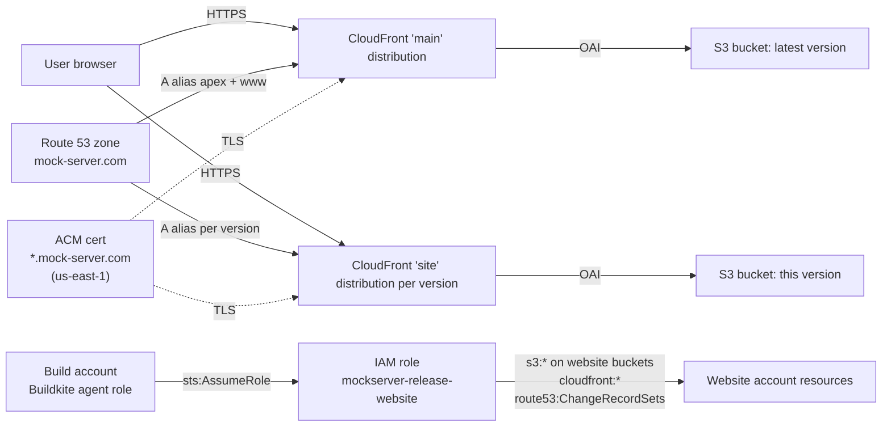

# Website Infrastructure

Terraform-managed S3, CloudFront, Route 53, and cross-account IAM for `mock-server.com` and every versioned subdomain (`<MAJOR>-<MINOR>.mock-server.com`).

## Architecture



## How it works

For each entry in the `sites` map (e.g. `"6-0" = { bucket_name = "aws-website-mockserver-6-0" }`) Terraform creates:

- An S3 bucket (`eu-west-2`, private, public-access-block enabled) configured as a static website
- A CloudFront origin access identity scoped to that bucket
- An S3 bucket policy granting only that OAI (plus the main OAI when this version is the `latest_version`) `s3:GetObject`
- A CloudFront distribution serving `<version>.mock-server.com` with HTTP/2+3, TLSv1.2_2021, gzip, redirect-HTTP-to-HTTPS
- A Route 53 A-alias from `<version>.mock-server.com` to the CloudFront distribution

Plus one **main** CloudFront distribution that serves the apex `mock-server.com` and `www.mock-server.com` from the bucket pointed to by `latest_version`, with a custom 403→200 mapping to `/error403.html` so deep-link refreshes render correctly. The main distribution `depends_on` the per-site distributions so that during a version promotion (changing `latest_version`) the new owner drops the alias before the old one tries to claim it — avoiding CloudFront's "CNAME already associated" error.

The ACM certificate (`*.mock-server.com` in `us-east-1`) is **not** managed by this module — it is provisioned once and renewed automatically by AWS. The ARN is passed in via `acm_certificate_arn`.

The Route 53 hosted zone itself is **not** managed by this module — the zone is created once at account setup and its ID is passed in via `zone_id`. Records inside the zone are managed by this module (apex + `www` + every versioned subdomain).

Promoting a new release to a new versioned subdomain:

```bash
# scripts/release/components/versioned-site.sh does both of these for you:
#   1. Append to the `sites` map in terraform.tfvars (and bump `latest_version`)
#   2. terraform apply
```

## Directory structure

```
terraform/website/
├── README.md
├── backend.tf              # S3 state in build account (use_lockfile = true)
├── versions.tf             # Terraform >= 1.15, AWS provider >= 5.0
├── main.tf                 # Provider config (assume role for CI, AWS_PROFILE for manual)
├── variables.tf            # Input variables
├── outputs.tf              # Distribution IDs, role ARN, main bucket name
├── sites.tf                # S3 + CloudFront + Route 53 (per-version + main)
├── cross-account-role.tf   # IAM role assumed by the build-account Buildkite agent
├── terraform.tfvars        # Live values (committed; no secrets)
└── terraform.tfvars.example
```

## Prerequisites

- [Terraform](https://www.terraform.io/downloads) >= 1.15
- AWS CLI with SSO profiles configured: `mockserver-build` (state backend + role assumption) and `mockserver-website` (target account, for manual runs without `website_role_arn`)
- Initial account bootstrap done: hosted zone created, ACM certificate validated, S3 backend bucket exists in the build account (handled by `terraform/buildkite-agents/bootstrap/`)

The module provisions resources across **two regions** in the website account: `us-east-1` (CloudFront distributions, Route 53 records, IAM role — CloudFront's TLS layer requires ACM certs in `us-east-1`) and `eu-west-2` via the `aws.eu-west-2` provider alias (the static-site S3 buckets, kept close to the contributor base).

## Getting started

```bash
cd terraform/website
aws sso login --profile mockserver-build
aws sso login --profile mockserver-website  # only needed for manual runs
terraform init
terraform plan       # set TF_VAR_website_role_arn="" for manual; CI sets it from secrets
terraform apply
```

## Variables

| Name | Type | Default | Purpose |
|------|------|---------|---------|
| `domain` | string | `"mock-server.com"` | Root domain |
| `latest_version` | string | (required) | Key in `sites` map serving the apex and `www` |
| `build_account_agent_role_arn` | string | (required) | IAM role in the build account that may assume `mockserver-release-website` |
| `sites` | `map({bucket_name = string})` | (required) | Version key → S3 bucket name. One entry per supported versioned subdomain plus the latest. |
| `zone_id` | string | (required) | Route 53 hosted-zone ID for the root domain |
| `acm_certificate_arn` | string | (required) | ARN of an ACM cert in `us-east-1` covering the root + `*.<domain>` |
| `website_role_arn` | string | `""` | Role ARN to assume in CI. Empty in manual runs (uses the SSO profile chain instead). |

## Outputs

| Name | Use |
|------|-----|
| `main_distribution_id` | Pass to `aws cloudfront create-invalidation` after a release |
| `main_distribution_domain` | Verify the apex is pointing at the right distribution |
| `main_bucket_name` | The release pipeline reads this to know where to `aws s3 sync` |
| `release_website_role_arn` | What the build-account Buildkite agent assumes for website operations |
| `distribution_ids` | Map of version → distribution ID for per-version invalidations |

## Cross-account access

The build account's Buildkite agents need to push releases into the website account. Rather than long-lived credentials, this module creates an IAM role (`mockserver-release-website`) in the website account whose trust policy permits assumption from `build_account_agent_role_arn`. The role's permissions are scoped:

- `s3:*` on buckets matching `arn:aws:s3:::aws-website-mockserver-*` only
- `cloudfront:*` account-wide (CloudFront doesn't support resource-level permissions for distribution-list/create)
- Hosted-zone-scoped Route 53 read + `ChangeResourceRecordSets` on `mock-server.com` (`route53:GetHostedZone`, `ListResourceRecordSets`, `ListTagsForResource`, `ChangeResourceRecordSets`), plus account-wide `route53:GetChange` (needed to poll change propagation status — Route 53 doesn't support resource-level scoping for that one)

The release pipeline (`scripts/release/components/website.sh`, `…/javadoc.sh`, `…/helm.sh`, `…/versioned-site.sh`) calls `sts:AssumeRole` against this role and uses the resulting credentials for the rest of the step.

## State

State lives in S3 (`mockserver-terraform-state`, key `website/terraform.tfstate`, region `eu-west-2`, account `mockserver-build`) with native S3 locking (`use_lockfile = true`). This is the same backend bucket as the other modules — see `terraform/buildkite-agents/bootstrap/` for how it was created.

## What this module does NOT manage

| Thing | Where it lives | Why |
|-------|---------------|-----|
| AWS account creation / SSO setup | Manual, one-time | Pre-Terraform bootstrap |
| Route 53 hosted zone (zone itself, not records) | Manual, one-time | Created at account setup; pre-Terraform |
| ACM certificate request and validation | Manual, one-time | Renewals are automatic; initial issuance needs DNS validation outside the cert's lifecycle |
| SES inbound (email) | `terraform/ses-email-forwarding/` | Separate module so email lifecycle is independent of website lifecycle |
| Bucket *contents* (HTML, JS, Javadoc, Helm charts) | `scripts/release/components/website.sh` + `…/javadoc.sh` + `…/helm.sh` | Content is per-release, not per-infrastructure-change |
